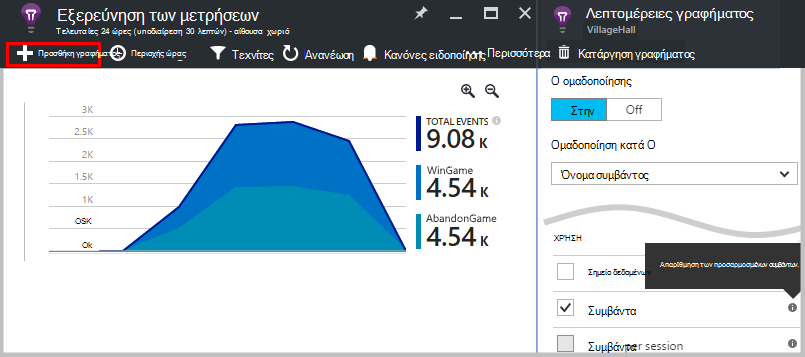
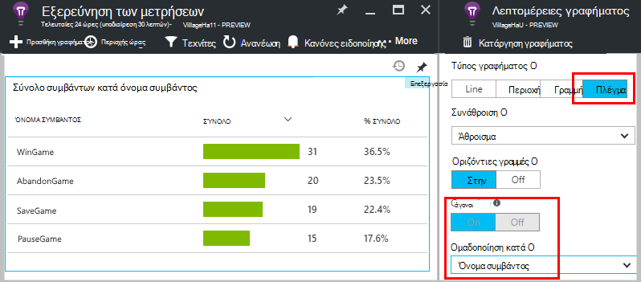
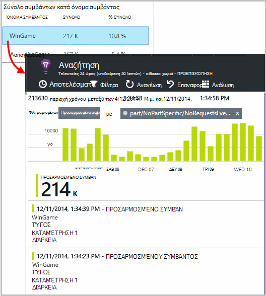
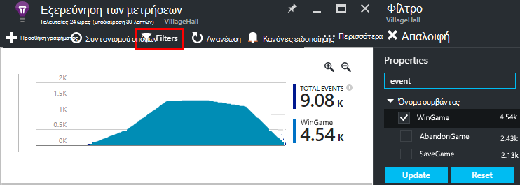
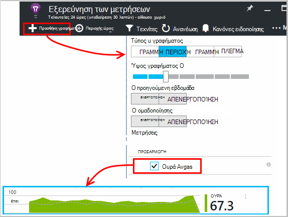
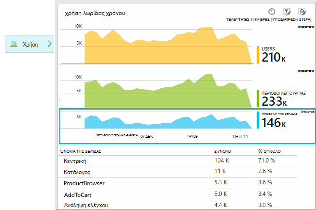
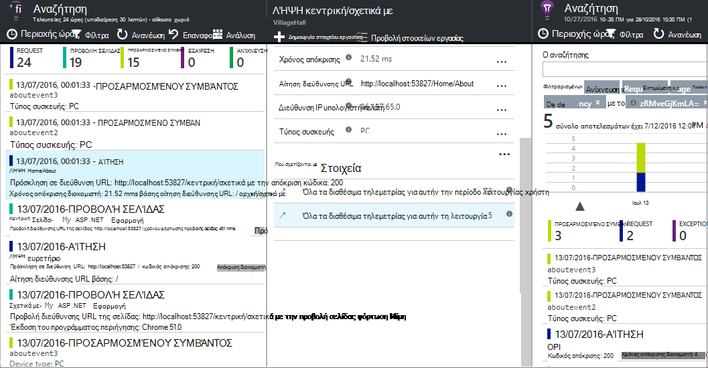
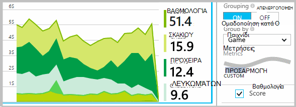
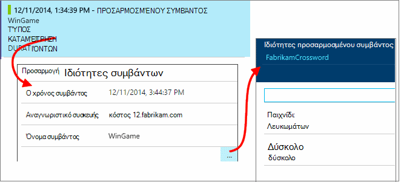
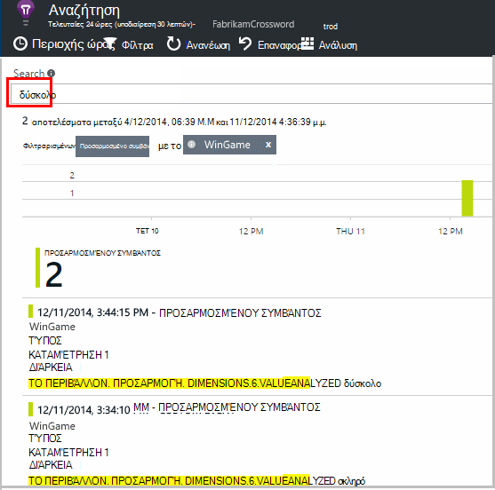

<properties 
    pageTitle="Εφαρμογή ιδέες API για προσαρμοσμένες συμβάντων και μετρήσεις | Microsoft Azure" 
    description="Εισαγωγή μερικές γραμμές κώδικα στο εφαρμογή συσκευή ή υπολογιστή, ιστοσελίδα ή την υπηρεσία, για να παρακολουθείτε τη χρήση και διάγνωση θεμάτων." 
    services="application-insights"
    documentationCenter="" 
    authors="alancameronwills" 
    manager="douge"/>
 
<tags 
    ms.service="application-insights" 
    ms.workload="tbd" 
    ms.tgt_pltfrm="ibiza" 
    ms.devlang="multiple" 
    ms.topic="article" 
    ms.date="10/19/2016" 
    ms.author="awills"/>

# <a name="application-insights-api-for-custom-events-and-metrics"></a>Εφαρμογή ιδέες API για προσαρμοσμένες συμβάντων και μετρήσεις 

*Εφαρμογή ιδέες είναι σε προεπισκόπηση.*

Εισαγωγή μερικές γραμμές κώδικα στην εφαρμογή σας για να μάθετε τι κάνουν οι χρήστες με αυτήν ή για να βοηθά στη διάγνωση προβλημάτων. Μπορείτε να στείλετε τηλεμετρίας από τη συσκευή και τις εφαρμογές υπολογιστή, προγραμμάτων-πελατών web και διακομιστές web. Το μέγεθος των κύριων τηλεμετρίας [Ιδέες εφαρμογή του Visual Studio](app-insights-overview.md) API σάς επιτρέπει να στείλετε προσαρμοσμένα συμβάντα και μετρήσεις και τη δική σας έκδοση του τυπική τηλεμετρίας. Αυτό το API είναι το ίδιο API που χρησιμοποιείται από την τυπική συλλογές δεδομένων ιδέες εφαρμογής.

## <a name="api-summary"></a>Σύνοψη API

Το API είναι ενιαίο σε όλες τις πλατφόρμες, εκτός από μερικές μικρές παραλλαγές.

Μέθοδος | Χρησιμοποιείται για
---|---
[`TrackPageView`](#page-views) | Σελίδες, οθόνες, λεπίδες ή φορμών
[`TrackEvent`](#track-event) | Ενέργειες χρηστών και άλλα συμβάντα. Χρησιμοποιείται για την παρακολούθηση συμπεριφορά χρήστη ή την παρακολούθηση των επιδόσεων.
[`TrackMetric`](#track-metric) | Μετρήσεις επιδόσεων όπως μήκη ουρά που δεν σχετίζονται με συγκεκριμένα συμβάντα
[`TrackException`](#track-exception)|Συνδεθείτε εξαιρέσεις για διάγνωση. Να ανιχνεύσετε όπου προκύπτουν σχέση με άλλα συμβάντα και εξετάστε ίχνη στοίβας.
[`TrackRequest`](#track-request)| Συνδεθείτε τη συχνότητα και τη διάρκεια των αιτήσεων διακομιστή για την ανάλυση απόδοσης.
[`TrackTrace`](#track-trace)|Αρχείο καταγραφής διαγνωστικών μηνύματα. Μπορείτε επίσης να καταγράψετε αρχεία καταγραφής άλλου κατασκευαστή.
[`TrackDependency`](#track-dependency)|Συνδεθείτε τη διάρκεια και τη συχνότητα των κλήσεων σε εξωτερικά στοιχεία από τις οποίες εξαρτάται η εφαρμογή σας.

Μπορείτε να [επισυνάψετε ιδιότητες και μετρήσεις](#properties) σε περισσότερες από αυτές τις κλήσεις τηλεμετρίας. 


## <a name="prep"></a>Πριν ξεκινήσετε

Εάν δεν το έχετε κάνει τα εξής ακόμη:

* Προσθήκη SDK ιδέες για την εφαρμογή στο έργο σας:
 * [Έργο ASP.NET][greenbrown]
 * [Java project][java] 
 * [JavaScript σε κάθε ιστοσελίδα][client]   

* Στον κώδικα διακομιστή web ή συσκευής, περιλαμβάνουν τα εξής:

    *C#:*`using Microsoft.ApplicationInsights;`

    *VB:*`Imports Microsoft.ApplicationInsights`

    *Java:*`import com.microsoft.applicationinsights.TelemetryClient;`

## <a name="construct-a-telemetryclient"></a>Δομή μιας TelemetryClient

Κατασκευή παρουσίας TelemetryClient (εκτός από JavaScript σε σελίδες web):

*C#:* 

    private TelemetryClient telemetry = new TelemetryClient();

*VB:* 

    Private Dim telemetry As New TelemetryClient

*Java*

    private TelemetryClient telemetry = new TelemetryClient();

TelemetryClient είναι ασφαλείς νήματος.

Συνιστάται να χρησιμοποιείτε μια παρουσία του `TelemetryClient` για κάθε λειτουργική μονάδα της εφαρμογής. Για παράδειγμα, μπορεί να έχετε μία `TelemetryClient` στην υπηρεσία web για την αναφορά εισερχόμενες αιτήσεις http και ένα άλλο σε μια κλάση ενδιάμεσο σε αναφορά επιχειρηματικής λογικής συμβάντα. Μπορείτε να ορίσετε ιδιότητες όπως `TelemetryClient.Context.User.Id` για να παρακολουθείτε τους χρήστες και περιόδους λειτουργίας, ή `TelemetryClient.Context.Device.Id` για τον προσδιορισμό του υπολογιστή. Αυτές οι πληροφορίες είναι συνδεδεμένη με όλα τα συμβάντα που αποστέλλονται από την περίοδο λειτουργίας.


## <a name="track-event"></a>Παρακολούθηση συμβάντων

Στην εφαρμογή ιδέες, ένα *προσαρμοσμένο συμβάν* είναι σημείο δεδομένων που μπορείτε να εμφανίσετε και τα δύο σε στην [Εξερεύνηση μετρικά] [ metrics] ως μια συγκεντρωτική μέτρηση και επίσης ως μεμονωμένα εμφανίσεις σε [Διαγνωστικών αναζήτησης][diagnostic]. (Αυτό δεν σχετίζεται με MVC ή άλλα πλαίσια "συμβάντα".) 

Εισαγάγετε τις κλήσεις TrackEvent στον κώδικά σας για να μετρήσετε πόσο συχνά χρήστες, επιλέξτε μια συγκεκριμένη δυνατότητα, πόσο συχνά τους επιτύχετε τους στόχους συγκεκριμένο, ή ίσως να συγκεκριμένους τύπους λάθος. 

Για παράδειγμα, σε μια εφαρμογή για παιχνιδιών, στείλτε ένα συμβάν κάθε φορά που ένας χρήστης κερδίζει το παιχνίδι: 

*JavaScript*

    appInsights.trackEvent("WinGame");

*C#*
    
    telemetry.TrackEvent("WinGame");

*VB*


    telemetry.TrackEvent("WinGame")

*Java*

    telemetry.trackEvent("WinGame");


### <a name="view-your-events-in-the-azure-portal"></a>Προβάλετε τα συμβάντα σας στην πύλη του Azure

Για να δείτε μια καταμέτρηση του τα συμβάντα σας, ανοίξτε ένα [Μετρικό σύστημα Explorer](app-insights-metrics-explorer.md) blade, προσθέστε ένα νέο γράφημα και επιλέξτε συμβάντα.  



Για να συγκρίνετε το πλήθος των διαφορετικά συμβάντα, ορίστε τον τύπο γραφήματος σε πλέγμα και ομάδα κατά όνομα συμβάντος:




Στο πλέγμα, κάντε κλικ σε ένα όνομα για το συμβάν για να δείτε τις μεμονωμένες εμφανίσεις αυτού του συμβάντος.



Κάντε κλικ σε οποιαδήποτε εμφάνισης για να δείτε περισσότερες λεπτομέρειες.

Για να εστιάσετε σε συγκεκριμένα συμβάντα σε αναζήτηση ή Explorer μετρικό σύστημα, ορίστε το blade φίλτρο για τα ονόματα των συμβάντων που σας ενδιαφέρει:



## <a name="track-metric"></a>Παρακολούθηση μετρικό σύστημα

Χρήση TrackMetric για την αποστολή μετρικά που δεν έχουν επισυναφθεί σε συγκεκριμένα συμβάντα. Για παράδειγμα, ενδέχεται να μπορείτε να παρακολουθείτε ένα μήκος ουράς σε τακτά χρονικά διαστήματα. 

Μετρικά εμφανίζονται ως στατιστικών γραφημάτων στην Εξερεύνηση των μετρικό, αλλά, σε αντίθεση με τα συμβάντα, δεν μπορείτε να αναζητήσετε μεμονωμένες εμφανίσεις σε διαγνωστικών αναζήτησης.

Μετρικό τιμές πρέπει να είναι > = 0 για να εμφανίζονται σωστά.


*JavaScript*

    appInsights.trackMetric("Queue", queue.Length);

*C#*

    telemetry.TrackMetric("Queue", queue.Length);

*VB*

    telemetry.TrackMetric("Queue", queue.Length)

*Java*

    telemetry.trackMetric("Queue", queue.Length);

Στην πραγματικότητα, μπορεί να κάνετε αυτό σε ένα νήμα φόντο:

*C#*

    private void Run() {
     var appInsights = new TelemetryClient();
     while (true) {
      Thread.Sleep(60000);
      appInsights.TrackMetric("Queue", queue.Length);
     }
    }


Για να δείτε τα αποτελέσματα, ανοίξτε την Εξερεύνηση των μετρήσεων και προσθέστε ένα νέο γράφημα. Ορισμός, για να εμφανίσετε το μετρικό σύστημα.



Υπάρχουν κάποια [όρια στον αριθμό των μετρήσεων](#limits) που μπορείτε να χρησιμοποιήσετε.

## <a name="page-views"></a>Προβολές σελίδας

Σε μια συσκευή ή εφαρμογή ιστοσελίδα, τηλεμετρίας προβολή σελίδας αποστέλλεται από προεπιλογή, όταν φορτώνεται κάθε οθόνης ή της σελίδας. Αλλά μπορείτε να το αλλάξετε για να παρακολουθείτε προβολές σελίδας σε πρόσθετους ή διαφορετικούς χρόνους. Για παράδειγμα, σε μια εφαρμογή που εμφανίζει καρτέλες ή πτερύγια, ενδέχεται να θέλετε να παρακολουθήσετε ένα "σελίδα" κάθε φορά που ο χρήστης ανοίγει ένα νέο blade. 



Δεδομένα του χρήστη και την περίοδο λειτουργίας αποστέλλεται ως ιδιότητες μαζί με προβολές σελίδας, έτσι ώστε τα γραφήματα χρήστη και την περίοδο λειτουργίας παραδίδεται ενεργών όταν υπάρχει τηλεμετρίας προβολή σελίδας.

#### <a name="custom-page-views"></a>Σελίδα προσαρμοσμένες προβολές

*JavaScript*

    appInsights.trackPageView("tab1");

*C#*

    telemetry.TrackPageView("GameReviewPage");

*VB*

    telemetry.TrackPageView("GameReviewPage")


Εάν έχετε περισσότερες από μία σελίδες μέσα σε διαφορετικές σελίδες HTML, μπορείτε να καθορίσετε τη διεύθυνση URL πολύ:

    appInsights.trackPageView("tab1", "http://fabrikam.com/page1.htm");

#### <a name="timing-page-views"></a>Προβολές σελίδας χρονισμού

Από προεπιλογή, οι χρόνοι αναφέρθηκε ως "Ώρα φόρτωσης προβολή σελίδας" υπολογίζονται από όταν το πρόγραμμα περιήγησης στέλνει την αίτηση, μέχρι να ονομάζεται συμβάν φόρτωση σελίδας του προγράμματος περιήγησης.

Αντί για αυτό, μπορείτε να κάνετε:

* Ορίστε μια ρητή διάρκεια στην κλήση [trackPageView](https://github.com/Microsoft/ApplicationInsights-JS/blob/master/API-reference.md#trackpageview) .
 * `appInsights.trackPageView("tab1", null, null, null, durationInMilliseconds);`
* Χρήση της προβολής σελίδας χρονομέτρηση κλήσεις `startTrackPage` και `stopTrackPage`.

*JavaScript*

    // To start timing a page:
    appInsights.startTrackPage("Page1");

... 

    // To stop timing and log the page:
    appInsights.stopTrackPage("Page1", url, properties, measurements);

Το όνομα που χρησιμοποιεί ως η πρώτη παράμετρος συσχετίζει τις κλήσεις έναρξης και τερματισμού. Από προεπιλογή επιλέγεται το όνομα της τρέχουσας σελίδας. 

Οι που προκύπτει διάρκειες φόρτωση σελίδας εμφανίζεται στην Εξερεύνηση μετρικό σύστημα προέρχονται από το χρονικό διάστημα μεταξύ των κλήσεων έναρξης και τερματισμού. Είναι προς τα επάνω σε εσάς τι χρονικό διάστημα στην πραγματικότητα χρόνο.

## <a name="track-request"></a>Αίτηση παρακολούθησης

Χρησιμοποιείται από το διακομιστή SDK για να συνδεθείτε αιτήσεις HTTP. 

Μπορείτε επίσης να καλέσετε το μόνοι σας Εάν θέλετε να προσομοιώσετε αιτήσεις σε ένα περιβάλλον όπου δεν έχετε τη λειτουργική μονάδα υπηρεσίας web εκτελείται.

*C#*

    // At start of processing this request:

    // Operation Id and Name are attached to all telemetry and help you identify
    // telemetry associated with one request:
    telemetry.Context.Operation.Id = Guid.NewGuid().ToString();
    telemetry.Context.Operation.Name = requestName;
    
    var stopwatch = System.Diagnostics.Stopwatch.StartNew();

    // ... process the request ...

    stopwatch.Stop();
    telemetry.TrackRequest(requestName, DateTime.Now,
       stopwatch.Elapsed, 
       "200", true);  // Response code, success


## <a name="operation-context"></a>Περιβάλλον λειτουργίας

Στοιχεία τηλεμετρίας να συσχετιστεί μαζί, επισυνάπτοντας σε αυτές μια λειτουργία κοινές ταυτότητα. Η τυπική αίτηση παρακολούθησης λειτουργική μονάδα το κάνει αυτό για εξαιρέσεις και άλλα συμβάντα που αποστέλλονται κατά την επεξεργασία μιας αίτησης HTTP. Κατά την [Αναζήτηση](app-insights-diagnostic-search.md) και [ανάλυση](app-insights-analytics.md), μπορείτε να χρησιμοποιήσετε το Αναγνωριστικό για να βρείτε εύκολα τυχόν συμβάντων που σχετίζεται με την αίτηση. 

Ο ευκολότερος τρόπος για να ορίσετε το Αναγνωριστικό είναι για να ορίσετε ένα περιβάλλον λειτουργίας χρησιμοποιώντας αυτό το μοτίβο:

    // Establish an operation context and associated telemetry item:
    using (var operation = telemetry.StartOperation<RequestTelemetry>("operationName"))
    {
        // Telemetry sent in here will use the same operation ID.
        ...
        telemetry.TrackEvent(...); // or other Track* calls
        ...
        // Set properties of containing telemetry item - for example:
        operation.Telemetry.ResponseCode = "200";
        
        // Optional: explicitly send telemetry item:
        telemetry.StopOperation(operation);

    } // When operation is disposed, telemetry item is sent.

Καθώς και τη ρύθμιση ένα περιβάλλον λειτουργίας, `StartOperation` δημιουργεί ένα στοιχείο τηλεμετρίας του τύπου που καθορίζετε και αποστέλλει όταν αποσύρετε τη λειτουργία ή αν καλέσετε ρητά `StopOperation`. Εάν χρησιμοποιείτε το `RequestTelemetry` ως τύπο τηλεμετρίας, στη συνέχεια, τη διάρκειά έχει οριστεί στο χρονικά διάστημα μεταξύ έναρξης και τερματισμού.

Δεν είναι δυνατό να είναι ένθετες περιβάλλοντα λειτουργίας. Εάν υπάρχει ήδη ένα περιβάλλον λειτουργίας, στη συνέχεια, το Αναγνωριστικό είναι συσχετισμένη με όλα τα περιεχόμενα στοιχεία, συμπεριλαμβανομένου του στοιχείου που δημιουργήθηκε με StartOperation.

Στο πλαίσιο Αναζήτηση, χρησιμοποιείται το περιβάλλον λειτουργίας για να δημιουργήσετε τη λίστα σχετικών στοιχείων:




## <a name="track-exception"></a>Παρακολούθηση εξαίρεσης

Αποστολή εξαιρέσεις σε εφαρμογή ιδέες: για να [μετρήσετε τους][metrics], ως ένδειξη της συχνότητας των πρόβλημα; και να [εξετάσετε μεμονωμένες][diagnostic]. Οι αναφορές περιλαμβάνουν τα ίχνη στοίβας.

*C#*

    try
    {
        ...
    }
    catch (Exception ex)
    {
       telemetry.TrackException(ex);
    }

*JavaScript*

    try
    {
       ...
    }
    catch (ex)
    {
       appInsights.trackException(ex);
    }

Το SDK αντιμετωπίσει πολλές εξαιρέσεις αυτόματα, ώστε να μην χρειάζεται να καλέσετε TrackException ρητά πάντα.

* ASP.NET: [σύνταξη κώδικα για να ενημερωθείτε εξαιρέσεις](app-insights-asp-net-exceptions.md)
* J2EE: [Εξαιρέσεις είναι αποκλείονται αυτόματα](app-insights-java-get-started.md#exceptions-and-request-failures)
* JavaScript: Αποκλείονται αυτόματα. Εάν θέλετε να απενεργοποιήσετε την αυτόματη συλλογή, προσθέστε μια γραμμή στο τμήμα κώδικα που εισάγετε στις ιστοσελίδες σας:

    ```
    ({
      instrumentationKey: "your key"
      , disableExceptionTracking: true
    })
    ```


## <a name="track-trace"></a>Παρακολούθηση ανίχνευσης 

Χρησιμοποιήστε αυτήν την επιλογή για να βοηθά στη διάγνωση προβλημάτων με την αποστολή 'ίχνους δυναμικής διαδρομής' εφαρμογή ιδέες. Μπορείτε να στείλετε μπλοκ δεδομένων διαγνωστικών και έλεγχος τους στο [διαγνωστικών αναζήτησης][diagnostic]. 

 

[Συνδεθείτε προσαρμογέων] [ trace] Χρησιμοποιήστε αυτό το API για την αποστολή αρχείων καταγραφής άλλου κατασκευαστή στην πύλη του.


*C#*

    telemetry.TrackTrace(message, SeverityLevel.Warning, properties);


Μπορείτε να αναζητήσετε περιεχόμενο του μηνύματος, αλλά (σε αντίθεση με τις τιμές ιδιοτήτων) δεν μπορείτε να φιλτράρετε σε αυτό.

Το όριο μεγέθους `message` είναι πολύ μεγαλύτερο από το όριο σε ιδιότητες.
Ένα πλεονέκτημα της TrackTrace είναι ότι μπορείτε να τοποθετήσετε σχετικά μεγάλων δεδομένα στο μήνυμα. Για παράδειγμα, μπορεί να κωδικοποιήσετε ΚΑΤΑΧΏΡΗΣΗ δεδομένων εκεί.  


Επιπλέον, μπορείτε να προσθέσετε ένα επίπεδο σοβαρότητας στο μήνυμά σας. Και, όπως άλλες τηλεμετρίας, μπορείτε να προσθέσετε τιμές ιδιοτήτων που μπορείτε να χρησιμοποιήσετε για να σας βοηθήσει φίλτρο ή αναζήτηση για διαφορετικά σύνολα ανιχνεύσεις. Για παράδειγμα:


    var telemetry = new Microsoft.ApplicationInsights.TelemetryClient();
    telemetry.TrackTrace("Slow database response",
                   SeverityLevel.Warning,
                   new Dictionary<string,string> { {"database", db.ID} });

Αυτό θα επιτρέπουν, στο πλαίσιο [Αναζήτηση][diagnostic], για να φιλτράρεται εύκολα όλα τα μηνύματα της συγκεκριμένης σοβαρότητας επιπέδου που σχετίζονται με μια συγκεκριμένη βάση δεδομένων.

## <a name="track-dependency"></a>Παρακολούθηση εξάρτησης

Χρησιμοποιήστε αυτήν την κλήση για να παρακολουθήσετε το χρόνο απόκρισης και τους συντελεστές επιτυχίας των κλήσεων σε μια εξωτερική τμήμα κώδικα. Τα αποτελέσματα εμφανίζονται στα γραφήματα εξάρτηση στην πύλη. 

```C#

            var success = false;
            var startTime = DateTime.UtcNow;
            var timer = System.Diagnostics.Stopwatch.StartNew();
            try
            {
                success = dependency.Call();
            }
            finally
            {
                timer.Stop();
                telemetry.TrackDependency("myDependency", "myCall", startTime, timer.Elapsed, success);
            }
```

Να θυμάστε ότι ο διακομιστής SDK περιλαμβάνουν μια [λειτουργική μονάδα εξάρτηση](app-insights-dependencies.md) που εντοπίζει και παρακολουθεί συγκεκριμένες εξάρτηση καλεί αυτόματα - για παράδειγμα σε βάσεις δεδομένων και REST API του Yammer. Πρέπει να εγκαταστήσετε έναν παράγοντα στο διακομιστή σας για να κάνετε τη λειτουργική μονάδα εργασίας. Μπορείτε να χρησιμοποιήσετε αυτήν την κλήση, εάν θέλετε να παρακολουθείτε τις κλήσεις που δεν αποκλείονται από την αυτοματοποιημένη παρακολούθηση ή εάν δεν θέλετε να εγκαταστήσετε τον παράγοντα.

Για να απενεργοποιήσετε τη λειτουργική μονάδα παρακολούθησης τυπική εξάρτηση, επεξεργαστείτε [ApplicationInsights.config](app-insights-configuration-with-applicationinsights-config.md) και να διαγράψετε την αναφορά σε `DependencyCollector.DependencyTrackingTelemetryModule`.


## <a name="flushing-data"></a>Δεδομένα καταγραφής

Κανονικά στο SDK στέλνει δεδομένων κατά καιρούς επιλέξει για να ελαχιστοποιήσετε την επίδραση στον χρήστη. Ωστόσο, σε ορισμένες περιπτώσεις μπορεί να θέλετε να κάνετε εκκαθάριση του buffer - για παράδειγμα, εάν χρησιμοποιείτε το SDK σε μια εφαρμογή που τερματίζεται.

*C#*

    telemetry.Flush();

    // Allow some time for flushing before shutdown.
    System.Threading.Thread.Sleep(1000);

Σημειώστε ότι η συνάρτηση είναι ασύγχρονης για το [κανάλι τηλεμετρίας server](https://www.nuget.org/packages/Microsoft.ApplicationInsights.WindowsServer.TelemetryChannel/), αλλά σύγχρονη Εάν επιλέξετε να χρησιμοποιήσετε το κανάλι στη μνήμη ή [μόνιμη κανάλι](app-insights-api-filtering-sampling.md#persistence-channel).


## <a name="authenticated-users"></a>Χρήστες με έλεγχο ταυτότητας

Σε μια εφαρμογή web, οι χρήστες είναι από προεπιλογή που προσδιορίζονται με cookie. Ένας χρήστης μπορεί να καταμετρηθούν περισσότερες από μία φορές αν έχετε πρόσβαση σε εφαρμογή σας από ένα διαφορετικό υπολογιστή ή σε πρόγραμμα περιήγησης, ή διαγράψετε τα cookies. 

Αλλά εάν οι χρήστες συνδέονται στην εφαρμογή σας, μπορείτε να λάβετε μια πιο ακριβή καταμέτρηση, ορίζοντας το αναγνωριστικό χρήστη με έλεγχο ταυτότητας τον κώδικα του προγράμματος περιήγησης:

*JavaScript*

```JS
    // Called when my app has identified the user.
    function Authenticated(signInId) {
      var validatedId = signInId.replace(/[,;=| ]+/g, "_");
      appInsights.setAuthenticatedUserContext(validatedId);
      ...
    }
```

Σε ένα web ASP.NET εφαρμογή MVC, για παράδειγμα:

*RAZOR*

        @if (Request.IsAuthenticated)
        {
            <script>
                appInsights.setAuthenticatedUserContext("@User.Identity.Name
                   .Replace("\\", "\\\\")"
                   .replace(/[,;=| ]+/g, "_"));
            </script>
        }

Δεν είναι απαραίτητο να χρησιμοποιήσετε το όνομα του χρήστη πραγματική εισόδου. Το μόνο πρέπει να είναι ένα αναγνωριστικό που είναι μοναδικό σε αυτόν το χρήστη. Δεν πρέπει να περιλαμβάνει κενά διαστήματα ή τους χαρακτήρες `,;=|`. 

Το αναγνωριστικό χρήστη είναι επίσης σε ένα cookie περιόδου λειτουργίας και αποστέλλονται στο διακομιστή. Εάν είναι εγκατεστημένο το διακομιστή SDK, το αναγνωριστικό χρήστη με έλεγχο ταυτότητας θα αποσταλούν ως μέρος των ιδιοτήτων περιβάλλοντος του προγράμματος-πελάτη και διακομιστή τηλεμετρίας, έτσι ώστε να μπορείτε να φιλτράρετε και να πραγματοποιήσετε αναζήτηση σε αυτό.

Εάν η εφαρμογή σας ομαδοποιεί τους χρήστες σε λογαριασμούς, μπορείτε να περάσετε επίσης ένα αναγνωριστικό για το λογαριασμό (με τους ίδιους περιορισμούς χαρακτήρα).


      appInsights.setAuthenticatedUserContext(validatedId, accountId);

Στην [Εξερεύνηση των μετρήσεων](app-insights-metrics-explorer.md), μπορείτε να δημιουργήσετε ένα γράφημα που καταμετρά **τους χρήστες, με έλεγχο ταυτότητας** και **λογαριασμούς χρηστών**. 

Μπορείτε επίσης να κάνετε [Αναζήτηση] [ diagnostic] για τα σημεία δεδομένων προγράμματος-πελάτη με ονόματα συγκεκριμένο χρήστη και λογαριασμούς.

## <a name="properties"></a>Φιλτράρισμα, αναζήτηση και τα δεδομένα σας με τις ιδιότητες του τμήματος

Μπορείτε να επισυνάψετε ιδιότητες και μετρήσεις για τα συμβάντα σας (και επίσης για τις μετρήσεις, σελίδα προβολών, εξαιρέσεις και άλλα δεδομένα τηλεμετρίας).

**Οι ιδιότητες** είναι τιμές συμβολοσειράς που μπορείτε να χρησιμοποιήσετε για να φιλτράρετε τις τηλεμετρίας στις αναφορές χρήσης. Για παράδειγμα εάν η εφαρμογή σας παρέχει διάφορες αγώνων, θα θέλετε να επισυνάψετε το όνομα του παιχνιδιού σε κάθε συμβάν, ώστε να μπορείτε να δείτε ποια αγώνων είναι πιο δημοφιλή. 

Υπάρχει όριο περίπου 1k στην το μήκος της συμβολοσειράς. (Εάν θέλετε να αποστείλετε μεγάλα τμήματα των δεδομένων, χρησιμοποιήστε την παράμετρο μήνυμα του [TrackTrace](#track-trace).)

**Μετρικά** είναι αριθμητικές τιμές που μπορούν να παρουσιαστούν γραφικά. Για παράδειγμα, μπορεί να θέλετε να δείτε εάν υπάρχει μια σταδιακή αύξηση της τις βαθμολογίες σας παίκτες επιτύχετε. Τα γραφήματα μπορούν να φέρουν κατά διαστήματα από τις ιδιότητες που αποστέλλονται με το συμβάν, ώστε να μπορείτε να επιτύχετε το νέο ή σωρευμένων γραφημάτων για διαφορετικές αγώνων.

Μετρικό τιμές πρέπει να είναι > = 0 για να εμφανίζονται σωστά.


Υπάρχουν κάποια [όρια στον αριθμό των ιδιοτήτων, τιμές ιδιοτήτων, και μετρήσεις](#limits) που μπορείτε να χρησιμοποιήσετε.


*JavaScript*

    appInsights.trackEvent
      ("WinGame",
         // String properties:
         {Game: currentGame.name, Difficulty: currentGame.difficulty},
         // Numeric metrics:
         {Score: currentGame.score, Opponents: currentGame.opponentCount}
         );

    appInsights.trackPageView
        ("page name", "http://fabrikam.com/pageurl.html",
          // String properties:
         {Game: currentGame.name, Difficulty: currentGame.difficulty},
         // Numeric metrics:
         {Score: currentGame.score, Opponents: currentGame.opponentCount}
         );
          

*C#*

    // Set up some properties and metrics:
    var properties = new Dictionary <string, string> 
       {{"game", currentGame.Name}, {"difficulty", currentGame.Difficulty}};
    var metrics = new Dictionary <string, double>
       {{"Score", currentGame.Score}, {"Opponents", currentGame.OpponentCount}};

    // Send the event:
    telemetry.TrackEvent("WinGame", properties, metrics);


*VB*

    ' Set up some properties:
    Dim properties = New Dictionary (Of String, String)
    properties.Add("game", currentGame.Name)
    properties.Add("difficulty", currentGame.Difficulty)

    Dim metrics = New Dictionary (Of String, Double)
    metrics.Add("Score", currentGame.Score)
    metrics.Add("Opponents", currentGame.OpponentCount)

    ' Send the event:
    telemetry.TrackEvent("WinGame", properties, metrics)


*Java*
    
    Map<String, String> properties = new HashMap<String, String>();
    properties.put("game", currentGame.getName());
    properties.put("difficulty", currentGame.getDifficulty());
    
    Map<String, Double> metrics = new HashMap<String, Double>();
    metrics.put("Score", currentGame.getScore());
    metrics.put("Opponents", currentGame.getOpponentCount());
    
    telemetry.trackEvent("WinGame", properties, metrics);


> [AZURE.NOTE] Να χειριστείτε δεν την καταγραφή αναγνωρίσιμων προσωπικών πληροφοριών στις ιδιότητες.

**Εάν χρησιμοποιήσατε μετρικά**, ανοίξτε την Εξερεύνηση μετρικό και επιλέξτε τη μέτρηση από την προσαρμοσμένη ομάδα:


*Εάν δεν εμφανίζεται το μετρικό σύστημα ή εάν δεν υπάρχουν την επικεφαλίδα ' Προσαρμογή ', κλείστε το blade επιλογής και προσπαθήστε αργότερα. Ορισμένες φορές ενδέχεται να χρειαστεί μία ώρα για μετρικά να συναθροιστεί μέσω της διοχέτευσης.*

**Εάν χρησιμοποιούσατε ιδιότητες και μετρήσεις**, τμήμα τη μέτρηση από την ιδιότητα:





**Στο διαγνωστικών αναζήτησης**, μπορείτε να προβάλετε τις ιδιότητες και τις μετρήσεις μεμονωμένων εμφανίσεων του συμβάντος.





Χρησιμοποιήστε το πεδίο αναζήτησης για να δείτε συμβάν εμφανίσεις με μια συγκεκριμένη ιδιότητα τιμή.




[Μάθετε περισσότερα σχετικά με τις παραστάσεις αναζήτησης][diagnostic].

#### <a name="alternative-way-to-set-properties-and-metrics"></a>Εναλλακτικός τρόπος για να ορίσετε ιδιότητες και μετρήσεις

Εάν είναι πιο εύκολο, μπορείτε να συγκεντρώσετε τις παραμέτρους ενός συμβάντος σε ένα ξεχωριστό αντικείμενο:

    var event = new EventTelemetry();

    event.Name = "WinGame";
    event.Metrics["processingTime"] = stopwatch.Elapsed.TotalMilliseconds;
    event.Properties["game"] = currentGame.Name;
    event.Properties["difficulty"] = currentGame.Difficulty;
    event.Metrics["Score"] = currentGame.Score;
    event.Metrics["Opponents"] = currentGame.Opponents.Length;

    telemetry.TrackEvent(event);

> [AZURE.WARNING] Μην χρησιμοποιήσετε ξανά την ίδια παρουσία στοιχείου τηλεμετρίας (`event` σε αυτό το παράδειγμα) για να καλέσετε Track*() πολλές φορές. Αυτό μπορεί να προκαλέσει τηλεμετρίας να αποστέλλονται με εσφαλμένη ρύθμιση παραμέτρων.


## <a name="timed"></a>Συμβάντα χρονισμού

Μερικές φορές θέλετε να εμφανίσετε σε γράφημα πόσος χρόνος χρειάζεται να εκτελέσετε κάποια ενέργεια. Για παράδειγμα, μπορεί να θέλετε να μάθετε πόσος χρόνος χρήστες λήψη πρέπει να λάβετε υπόψη τις επιλογές σε ένα παιχνίδι. Αυτή είναι μια χρήσιμη παράδειγμα χρήσεις της παραμέτρου μέτρησης.


*C#*

    var stopwatch = System.Diagnostics.Stopwatch.StartNew();

    // ... perform the timed action ...

    stopwatch.Stop();

    var metrics = new Dictionary <string, double>
       {{"processingTime", stopwatch.Elapsed.TotalMilliseconds}};

    // Set up some properties:
    var properties = new Dictionary <string, string> 
       {{"signalSource", currentSignalSource.Name}};

    // Send the event:
    telemetry.TrackEvent("SignalProcessed", properties, metrics);


## <a name="defaults"></a>Προεπιλεγμένες ιδιότητες για το προσαρμοσμένο τηλεμετρίας

Εάν θέλετε να ορίσετε προεπιλεγμένες τιμές ιδιοτήτων για ορισμένα από τα προσαρμοσμένα συμβάντα που συντάσσετε, μπορείτε να ορίσετε τους σε ένα TelemetryClient. Επισύναψη σε κάθε στοιχείο τηλεμετρίας που αποστέλλεται από αυτόν τον πελάτη. 

*C#*

    using Microsoft.ApplicationInsights.DataContracts;

    var gameTelemetry = new TelemetryClient();
    gameTelemetry.Context.Properties["Game"] = currentGame.Name;
    // Now all telemetry will automatically be sent with the context property:
    gameTelemetry.TrackEvent("WinGame");
    
*VB*

    Dim gameTelemetry = New TelemetryClient()
    gameTelemetry.Context.Properties("Game") = currentGame.Name
    ' Now all telemetry will automatically be sent with the context property:
    gameTelemetry.TrackEvent("WinGame")

*Java*

    import com.microsoft.applicationinsights.TelemetryClient;
    import com.microsoft.applicationinsights.TelemetryContext;
    ...


    TelemetryClient gameTelemetry = new TelemetryClient();
    TelemetryContext context = gameTelemetry.getContext();
    context.getProperties().put("Game", currentGame.Name);
    
    gameTelemetry.TrackEvent("WinGame");


    
Κλήσεις μεμονωμένα τηλεμετρίας να παρακάμψετε τις προεπιλεγμένες τιμές σε τους λεξικά ιδιότητα.

**Για JavaScript προγραμμάτων-πελατών web**, [Χρησιμοποιήστε προετοιμασίες τηλεμετρίας JavaScript](#js-initializer).

**Για να προσθέσετε ιδιότητες, για να τηλεμετρίας όλα** τα δεδομένα από τυπική συλλογή λειτουργικές μονάδες, συμπεριλαμβανομένων [υλοποίηση `ITelemetryInitializer` ](app-insights-api-filtering-sampling.md#add-properties).


## <a name="sampling-filtering-and-processing-telemetry"></a>Δειγματοληψία, φιλτράρισμα και την επεξεργασία τηλεμετρίας 

Μπορείτε να συντάξετε κώδικα για την επεξεργασία του τηλεμετρίας πριν από την αποστολή από το SDK. Η επεξεργασία περιλαμβάνει τα δεδομένα που αποστέλλονται από τις λειτουργικές μονάδες τυπική τηλεμετρίας όπως συλλογής αίτηση HTTP και εξάρτησης συλλογής.

* [Προσθήκη ιδιοτήτων](app-insights-api-filtering-sampling.md#add-properties) σε τηλεμετρίας με την εφαρμογή `ITelemetryInitializer` - για παράδειγμα, για να προσθέσετε έκδοση αριθμούς ή τιμές υπολογιστεί από άλλες ιδιότητες. 
* [Φιλτράρισμα](app-insights-api-filtering-sampling.md#filtering) να τροποποιήσετε ή να απορρίψετε τηλεμετρίας πριν από την αποστολή από το SDK με την εφαρμογή `ITelemetryProcesor`. Μπορείτε να ελέγχετε τι αποστέλλεται ή απορρίπτονται, αλλά θα πρέπει να ληφθούν υπόψη τα εφέ μετρικά σας. Ανάλογα με το πώς μπορείτε να απορρίψετε στοιχεία, ενδέχεται να χάσετε τη δυνατότητα για περιήγηση μεταξύ των σχετικών στοιχείων.
* [Δειγματοληψία](app-insights-api-filtering-sampling.md#sampling) είναι μια συσκευασμένη λύση για να μειώσετε τον όγκο των δεδομένων που αποστέλλονται από την εφαρμογή σας στην πύλη του. Αυτό γίνεται χωρίς να επηρεαστούν τα μετρικά που εμφανίζεται και, χωρίς να επηρεάζεται η δυνατότητα στη διάγνωση προβλημάτων με την περιήγηση μεταξύ των σχετικών στοιχείων όπως εξαιρέσεις, αιτήσεις και προβολών σελίδας.

[Μάθε περισσότερα](app-insights-api-filtering-sampling.md)


## <a name="disabling-telemetry"></a>Απενεργοποίηση της τηλεμετρίας

Για να **διακόψετε δυναμικά και να ξεκινήσετε** τη συλλογή και μετάδοση των τηλεμετρίας:

*C#*

```C#

    using  Microsoft.ApplicationInsights.Extensibility;

    TelemetryConfiguration.Active.DisableTelemetry = true;
```

Για να **απενεργοποιήσετε την επιλεγμένη τυπική συλλογές** - για παράδειγμα, μετρητές επιδόσεων, αιτήσεις HTTP ή εξαρτήσεις - διαγραφή ή σχόλιο τις σχετικές γραμμές στο [ApplicationInsights.config][config]. Μπορεί να κάνετε αυτό, για παράδειγμα, εάν θέλετε να στείλετε τα δικά σας δεδομένα TrackRequest.

## <a name="debug"></a>Κατάσταση λειτουργίας προγραμματιστή

Κατά τον εντοπισμό σφαλμάτων, είναι χρήσιμο να έχετε σας τηλεμετρίας πραγματοποιείται τη διαδικασία, ώστε να μπορείτε να δείτε τα αποτελέσματα αμέσως. Μπορείτε επίσης λήψη πρόσθετα μηνύματα που σας βοηθούν να ανιχνεύσετε προβλήματα με την τηλεμετρίας. Εναλλαγή το της παραγωγής, καθώς μπορεί να επιβραδύνει την εφαρμογή σας.


*C#*
    
    TelemetryConfiguration.Active.TelemetryChannel.DeveloperMode = true;

*VB*

    TelemetryConfiguration.Active.TelemetryChannel.DeveloperMode = True


## <a name="ikey"></a>Ορισμός του κλειδιού οργάνων για το επιλεγμένο προσαρμοσμένο τηλεμετρίας

*C#*
    
    var telemetry = new TelemetryClient();
    telemetry.InstrumentationKey = "---my key---";
    // ...


## <a name="dynamic-ikey"></a>Πλήκτρο δυναμικής οργάνων

Για να αποφύγετε την ανάμιξη του τηλεμετρίας από την ανάπτυξη, δοκιμή και παραγωγής περιβάλλοντα, μπορείτε να [δημιουργήσετε ξεχωριστές πόρους ιδέες εφαρμογής] [ create] και αλλάξτε τους αριθμούς-κλειδιά ανάλογα με το περιβάλλον.

Αντί να γρήγορα τον αριθμό-κλειδί οργάνων από το αρχείο ρύθμισης παραμέτρων, μπορείτε να τη ρυθμίσετε στον κώδικά σας. Ορίστε τον αριθμό-κλειδί σε μια μέθοδο προετοιμασίας, όπως global.aspx.cs σε μια υπηρεσία ASP.NET:

*C#*

    protected void Application_Start()
    {
      Microsoft.ApplicationInsights.Extensibility.
        TelemetryConfiguration.Active.InstrumentationKey = 
          // - for example -
          WebConfigurationManager.Settings["ikey"];
      ...

*JavaScript*

    appInsights.config.instrumentationKey = myKey; 


Στις σελίδες web, ενδέχεται να θέλετε να ρυθμίσετε από το διακομιστή web νομό, αντί να κωδικοποίησης ως έχουν στο τη δέσμη ενεργειών. Για παράδειγμα, σε μια ιστοσελίδα που δημιουργούνται σε μια εφαρμογή ASP.NET:

*JavaScript σε Razor*

    <script type="text/javascript">
    // Standard Application Insights web page script:
    var appInsights = window.appInsights || function(config){ ...
    // Modify this part:
    }({instrumentationKey:  
      // Generate from server property:
      @Microsoft.ApplicationInsights.Extensibility.
         TelemetryConfiguration.Active.InstrumentationKey"
    }) // ...


## <a name="telemetrycontext"></a>TelemetryContext

TelemetryClient έχει μια ιδιότητα περιβάλλοντος, η οποία περιέχει έναν αριθμό τιμών που αποστέλλονται μαζί με όλα τα δεδομένα τηλεμετρίας. Συνήθως ορίζονται από την τυπική τηλεμετρίας λειτουργικές μονάδες, αλλά μπορείτε επίσης να ορίσετε τους στον εαυτό σας. Για παράδειγμα:

    telemetry.Context.Operation.Name = "MyOperationName";

Εάν ορίσετε οποιαδήποτε από αυτές τις τιμές στον εαυτό σας, μπορείτε να καταργήσετε τη σχετική γραμμή από [ApplicationInsights.config][config], ώστε να σας τιμές και το τυπικό δεν γίνει δυσνόητο.

* **Το στοιχείο** Προσδιορίζει την εφαρμογή και την έκδοση
* **Συσκευή** Δεδομένα σχετικά με τη συσκευή στην οποία εκτελείται η εφαρμογή (στις εφαρμογές web, αυτή είναι η συσκευή διακομιστή ή προγράμματος-πελάτη από την οποία αποστέλλονται τα τηλεμετρίας)
* **InstrumentationKey** Προσδιορίζει τον πόρο ιδέες εφαρμογή στο σημείο όπου θα εμφανίζεται το τηλεμετρίας Azure. Συνήθως επιλέξατε προς τα επάνω από το ApplicationInsights.config
* **Θέση** Προσδιορίζει τη γεωγραφική θέση της συσκευής.
* **Η λειτουργία** Στις εφαρμογές web, η τρέχουσα αίτηση HTTP. Σε άλλους τύπους εφαρμογή, μπορείτε να ρυθμίσετε αυτή σε συμβάντα ομάδας μαζί.
 * **Αναγνωριστικό**: μια τιμή που έχει δημιουργηθεί που συσχετίζεται διαφορετικά συμβάντα, έτσι ώστε όταν έλεγχος οποιοδήποτε συμβάν στο διαγνωστικών αναζήτησης, μπορείτε να βρείτε "σχετικά στοιχεία"
 * **Όνομα**: ένα αναγνωριστικό, συνήθως τη διεύθυνση URL της αίτησης HTTP. 
 * **SyntheticSource**: Εάν δεν μηδενική ή κενή, η συμβολοσειρά αυτή υποδεικνύει ότι το αρχείο προέλευσης της αίτησης εντοπίστηκε δοκιμή ρομπότ ή web. Από προεπιλογή θα να εξαιρούνται από τους υπολογισμούς στο μετρικά Explorer.
* **Ιδιότητες** Οι ιδιότητες που αποστέλλονται με όλα τα δεδομένα τηλεμετρίας. Μπορείτε να παρακάμψετε σε μεμονωμένες παρακολούθηση * κλήσεις.
* **Την περίοδο λειτουργίας** Προσδιορίζει την περίοδο λειτουργίας του χρήστη. Το αναγνωριστικό έχει οριστεί σε μια τιμή που δημιουργήθηκε, που έχει αλλάξει όταν ο χρήστης δεν έχει ενεργό για κάποιο χρονικό διάστημα.
* **Χρήστη** Πληροφορίες χρήστη. 

## <a name="limits"></a>Όρια


[AZURE.INCLUDE [application-insights-limits](../../includes/application-insights-limits.md)]

*Πώς να αποφύγετε πάτημα του ορίου επιτόκιο δεδομένων;*

* Χρησιμοποιήστε [δειγματοληψία](app-insights-sampling.md).

*Πόσος χρόνος δεδομένων παραμένει διαθέσιμη;*

* Ανατρέξτε στο θέμα [Διατήρηση δεδομένων και προστασία προσωπικών δεδομένων][data].


## <a name="reference-docs"></a>Αναφορά έγγραφα

* [Αναφορά ASP.NET](https://msdn.microsoft.com/library/dn817570.aspx)
* [Αναφορά Java](http://dl.windowsazure.com/applicationinsights/javadoc/)
* [Αναφορά JavaScript](https://github.com/Microsoft/ApplicationInsights-JS/blob/master/API-reference.md)
* [Android SDK](https://github.com/Microsoft/ApplicationInsights-Android)
* [iOS SDK](https://github.com/Microsoft/ApplicationInsights-iOS)


## <a name="sdk-code"></a>Κωδικός SDK

* [ASP.NET πυρήνα SDK](https://github.com/Microsoft/ApplicationInsights-dotnet)
* [5 ASP.NET](https://github.com/Microsoft/ApplicationInsights-aspnet5)
* [Πακέτων του Windows Server](https://github.com/Microsoft/applicationInsights-dotnet-server)
* [Java SDK](https://github.com/Microsoft/ApplicationInsights-Java)
* [JavaScript SDK](https://github.com/Microsoft/ApplicationInsights-JS)
* [Όλες τις πλατφόρμες](https://github.com/Microsoft?utf8=%E2%9C%93&query=applicationInsights)

## <a name="questions"></a>Ερωτήσεις

* *Τι εξαιρέσεις μπορεί να εμφανίσουν κλήσεις Track_();*
    
    Κανένα. Δεν χρειάζεται να αναδιπλώνεται τους στους όρους δοκιμή προϊόντων. Εάν το SDK αντιμετωπίζει προβλήματα, θα καταγράψει τα μηνύματα που θα εμφανίζεται στο αποτέλεσμα κονσόλας εντοπισμού σφαλμάτων, και - εάν τα μηνύματα που λάβατε μέσω - στο διαγνωστικών αναζήτησης.


* *Υπάρχει μια REST API για τη λήψη δεδομένων από την πύλη;*

    Ναι, σύντομα διαθέσιμο. Στο μεταξύ, χρησιμοποιήστε [συνεχής εξαγωγή](app-insights-export-telemetry.md).

## <a name="next"></a>Επόμενα βήματα


[Αναζήτηση συμβάντων και αρχείων καταγραφής][diagnostic]

[Δείγματα και αναλυτικές παρουσιάσεις](app-insights-code-samples.md)

[Αντιμετώπιση προβλημάτων][qna]


<!--Link references-->

[client]: app-insights-javascript.md
[config]: app-insights-configuration-with-applicationinsights-config.md
[create]: app-insights-create-new-resource.md
[data]: app-insights-data-retention-privacy.md
[diagnostic]: app-insights-diagnostic-search.md
[exceptions]: app-insights-asp-net-exceptions.md
[greenbrown]: app-insights-asp-net.md
[java]: app-insights-java-get-started.md
[metrics]: app-insights-metrics-explorer.md
[qna]: app-insights-troubleshoot-faq.md
[trace]: app-insights-search-diagnostic-logs.md

 
