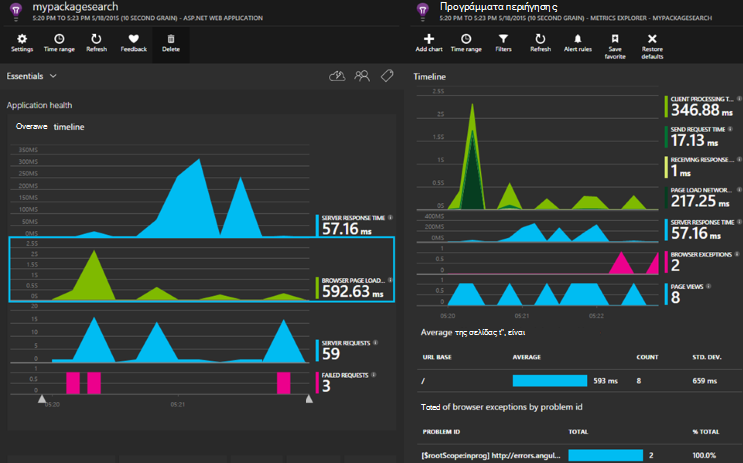

<properties 
    pageTitle="Εφαρμογή ιδέες για το μέγεθος των κύριων ASP.NET" 
    description="Εποπτεία εφαρμογών web για τη διαθεσιμότητα, επιδόσεων και χρήση." 
    services="application-insights" 
    documentationCenter=".net"
    authors="alancameronwills" 
    manager="douge"/>

<tags 
    ms.service="application-insights" 
    ms.workload="tbd" 
    ms.tgt_pltfrm="ibiza" 
    ms.devlang="na" 
    ms.topic="article" 
    ms.date="08/30/2016" 
    ms.author="awills"/>

# Εφαρμογή ιδέες για το μέγεθος των κύριων ASP.NET

[Ιδέες εφαρμογή του Visual Studio](app-insights-overview.md) σάς επιτρέπει να παρακολουθείτε την εφαρμογή web για διαθεσιμότητα, επιδόσεων και η χρήση. Με τα σχόλια που λαμβάνετε σχετικά με τις επιδόσεις και την αποτελεσματικότητα της εφαρμογής από το φυσικό περιβάλλον, μπορείτε να κάνετε επιλογές ενήμεροι σχετικά με την κατεύθυνση της σχεδίασης σε κάθε κύκλος ζωής ανάπτυξης.

Θα χρειαστείτε μια συνδρομή με το [Windows Azure](http://azure.com). Πραγματοποιήστε είσοδο με ένα λογαριασμό Microsoft, ο οποίος μπορεί να έχετε για Windows, XBox Live ή άλλες υπηρεσίες cloud της Microsoft. Ομάδα σας ενδέχεται να έχετε μια συνδρομή για εταιρικό να Azure: ζητήστε από τον κάτοχο να σας προσθέσει στη χρησιμοποιώντας το λογαριασμό της Microsoft.

## Γρήγορα αποτελέσματα

Ακολουθήστε τον [Οδηγό γρήγορων αποτελεσμάτων](https://github.com/Microsoft/ApplicationInsights-aspnetcore/wiki/Getting-Started).

## Χρήση εφαρμογής ιδέες

Πραγματοποιήστε είσοδο στο [Microsoft Azure πύλη](https://portal.azure.com) και αναζητήστε τον πόρο που δημιουργήσατε για την παρακολούθηση της εφαρμογής σας.

Σε ένα ξεχωριστό παράθυρο προγράμματος περιήγησης, χρησιμοποιήστε την εφαρμογή σας για κάποιο χρονικό διάστημα. Θα δείτε δεδομένα που εμφανίζονται στα γραφήματα ιδέες εφαρμογής. (Ίσως χρειαστεί να κάντε κλικ στην επιλογή Ανανέωση.) Θα υπάρχει μόνο ένα μικρό όγκο δεδομένων ενώ αναπτύσσετε, αλλά αυτά τα γραφήματα πραγματικά προέρχονται ενεργών όταν δημοσιεύετε την εφαρμογή σας και έχετε πολλούς χρήστες. 

Στη σελίδα Επισκόπηση εμφανίζει τα γραφήματα επιδόσεων είναι πιο πιθανό να να σας ενδιαφέρουν: χρόνος απόκρισης του διακομιστή, ο χρόνος φόρτωσης σελίδας, και το πλήθος των αποτυχημένων αιτήσεων. Κάντε κλικ σε οποιοδήποτε γράφημα για να δείτε περισσότερα γραφήματα και τα δεδομένα.

Προβολές στην πύλη εμπίπτουν σε δύο βασικές κατηγορίες:

* [Μετρικά Explorer](app-insights-metrics-explorer.md) εμφανίζει γραφήματα και πίνακες μετρικά και μετρήσεις, όπως χρόνους απόκρισης, αποτυχία χρεώσεων ή μετρικά δημιουργείτε μόνοι σας με το [API](app-insights-api-custom-events-metrics.md). Φιλτράρισμα και τμήμα των δεδομένων από τιμές ιδιοτήτων για να λάβετε μια καλύτερη κατανόηση της εφαρμογής σας και τους χρήστες.
* [Εξερεύνηση αναζήτησης](app-insights-diagnostic-search.md) παραθέτει μεμονωμένα συμβάντα, όπως ειδικά αιτήματα, εξαιρέσεις, ανιχνεύσεις καταγραφής ή συμβάντα που δημιουργήσατε στον εαυτό σας με το [API](app-insights-api-custom-events-metrics.md). Φιλτράρισμα και αναζήτηση στο τα συμβάντα και περιήγηση μεταξύ σχετικών συμβάντα που θέλετε να ερευνήσετε θέματα.
* [Ανάλυση](app-insights-analytics.md) σας επιτρέπει να εκτελέσετε ερωτήματα SQL μοιάζουν πάνω από το τηλεμετρίας και είναι ένα ισχυρό εργαλείο αναλυτικής και διαγνωστικών.

## Ειδοποιήσεις

* Λαμβάνετε αυτόματα [πριν από την ενεργοποίηση ειδοποιήσεων διαγνωστικών](app-insights-proactive-diagnostics.md) που ενημερώνουν το που σχετικά με την ύπαρξη αλλαγών σε αποτυχία χρεώσεις και άλλες μετρήσεις.
* Ρύθμιση [διαθεσιμότητα δοκιμές](app-insights-monitor-web-app-availability.md) για να ελέγξετε την τοποθεσία Web συνεχώς από θέσεις σε όλο τον κόσμο και λήψη μηνυμάτων ηλεκτρονικού ταχυδρομείου με οποιαδήποτε δοκιμή αποτυγχάνει.
* Ρύθμιση [ειδοποιήσεων μετρικό](app-insights-monitor-web-app-availability.md) να γνωρίζω εάν μετρικά όπως χρόνους απόκρισης ή εξαίρεση χρεώσεις μεταβείτε εκτός αποδεκτά όρια.

## Λήψη περισσότερων τηλεμετρίας

* [Προσθήκη τηλεμετρίας στις ιστοσελίδες σας](app-insights-javascript.md) στη σελίδα παρακολούθηση χρήσης και την απόδοση.
* [Εξαρτήσεις οθόνη](app-insights-dependencies.md) για να δείτε εάν ΥΠΌΛΟΙΠΑ, SQL ή άλλων εξωτερικών πόρων επιβραδύνουν που.
* [Χρήση του API](app-insights-api-custom-events-metrics.md) για να στείλετε τη δική σας συμβάντων και μετρήσεις για μια πιο λεπτομερή προβολή της απόδοσης και η χρήση της εφαρμογής σας.
* [Διαθεσιμότητα δοκιμές](app-insights-monitor-web-app-availability.md) Ελέγξτε την εφαρμογή συνεχώς από όλο τον κόσμο. 

## Άνοιγμα αρχείου προέλευσης

[Ανάγνωση και να συνεισφέρουν στον κώδικα](https://github.com/Microsoft/ApplicationInsights-aspnetcore#recent-updates)

