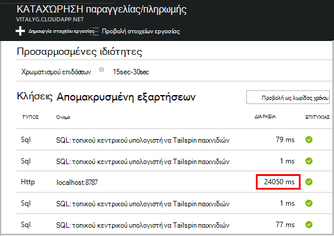

<properties 
    pageTitle="Εξάρτηση παρακολούθησης στο ιδέες εφαρμογής" 
    description="Ανάλυση χρήσης, διαθεσιμότητα και την απόδοση της εσωτερικής εγκατάστασης ή την εφαρμογή web Microsoft Azure με εφαρμογή ιδέες σας." 
    services="application-insights" 
    documentationCenter=".net"
    authors="alancameronwills" 
    manager="douge"/>

<tags 
    ms.service="application-insights" 
    ms.workload="tbd" 
    ms.tgt_pltfrm="ibiza" 
    ms.devlang="na" 
    ms.topic="article" 
    ms.date="10/24/2016" 
    ms.author="awills"/>


# <a name="set-up-application-insights-dependency-tracking"></a>Ρύθμιση εφαρμογών ιδέες: παρακολούθηση εξάρτησης


[AZURE.INCLUDE [app-insights-selector-get-started-dotnet](../../includes/app-insights-selector-get-started-dotnet.md)]


*Εξάρτηση* είναι ένα εξωτερικό στοιχείο που ονομάζεται από την εφαρμογή σας. Συνήθως, είναι μια υπηρεσία που ονομάζεται χρησιμοποιώντας HTTP, μια βάση δεδομένων ή ένα σύστημα αρχείων. Στο Visual Studio ιδέες εφαρμογή, μπορείτε να δείτε εύκολα πόσο χρόνο αναμονής της εφαρμογής σας για εξαρτήσεις και πόσο συχνά κλήσης εξάρτηση αποτυγχάνει.


Η οθόνη εξάρτηση εκτός του πλαισίου αναφορές αυτήν τη στιγμή κλήσεις σε αυτούς τους τύπους εξαρτήσεων:

* ASP.NET
 * Βάσεις δεδομένων SQL
 * ASP.NET web και υπηρεσίες WCF που χρησιμοποιούν συνδέσεις που βασίζονται σε HTTP
 * Τοπική ή απομακρυσμένη κλήσεις HTTP
 * Azure DocumentDb, πίνακα, χώρος αποθήκευσης αντικειμένων blob και ουρά
* Java
 * Κλήσεις σε μια βάση δεδομένων μέσω ενός προγράμματος οδήγησης [JDBC](http://docs.oracle.com/javase/7/docs/technotes/guides/jdbc/) , όπως MySQL, SQL Server, PostgreSQL ή SQLite.
* JavaScript σε σελίδες web - [ιστοσελίδα SDK](app-insights-javascript.md) καταγράφει αυτόματα Ajax κλήσεις ως εξαρτήσεις.

Μπορείτε να συντάξετε το δικό σας κλήσεις SDK για την παρακολούθηση άλλων εξαρτήσεις με χρήση του [TrackDependency API](app-insights-api-custom-events-metrics.md#track-dependency).


## <a name="to-set-up-dependency-monitoring"></a>Για να ρυθμίσετε την παρακολούθηση εξάρτησης

Χρειάζεστε μια συνδρομή στο [Microsoft Azure](http://azure.com) .

### <a name="if-your-app-runs-on-your-iis-server"></a>Εάν η εφαρμογή σας εκτελείται στο διακομιστή των υπηρεσιών IIS

Εάν την εφαρμογή web της εκτελείται στο .NET 4.6 ή νεότερη έκδοση, μπορείτε να [εγκαταστήσετε SDK ιδέες για την εφαρμογή](app-insights-asp-net.md) είτε στην εφαρμογή σας, ή να το εγκαταστήσετε Εποπτεία κατάστασης ιδέες εφαρμογής. Δεν χρειάζεται και τα δύο.

Διαφορετικά, εγκαταστήστε Εποπτεία κατάστασης ιδέες εφαρμογής στο διακομιστή:

1. Στο των υπηρεσιών IIS διακομιστή web, συνδεθείτε με τα διαπιστευτήρια διαχειριστή.
2. Κάντε λήψη και εκτέλεση του [προγράμματος εγκατάστασης Εποπτεία κατάστασης](http://go.microsoft.com/fwlink/?LinkId=506648).
4. Στον Οδηγό εγκατάστασης, πραγματοποιήστε είσοδο στο Windows Azure.

    

    *Σφαλμάτων σύνδεσης; Ανατρέξτε στο θέμα [Αντιμετώπιση προβλημάτων](#troubleshooting).*

5. Επιλέξτε την εφαρμογή εγκατεστημένων web ή την τοποθεσία Web που θέλετε να παρακολουθήσετε και, στη συνέχεια, ρύθμιση παραμέτρων του πόρου στο οποίο θέλετε να δείτε τα αποτελέσματα στην πύλη εφαρμογής ιδέες.

    

    Κανονικά, επιλέγετε για να ρυθμίσετε ένα νέο πόρο και [ομάδα πόρων][roles].

    Διαφορετικά, χρησιμοποιήστε έναν υπάρχοντα πόρο, εάν έχετε ήδη ρυθμίσει [web ελέγχει] [ availability] για την τοποθεσία ή το [πρόγραμμα-πελάτη web παρακολούθηση][client].

6. Επανεκκίνηση των υπηρεσιών IIS.

    

    Υπηρεσία web θα διακοπεί για λίγο.

6. Παρατηρήστε ότι έχει εισαχθεί ApplicationInsights.config τις εφαρμογές web που θέλετε να παρακολουθήσετε.

    

   Υπάρχουν επίσης ορισμένες αλλαγές στην web.config.

#### <a name="want-to-reconfigure-later"></a>Θέλετε να (σχετικά) ρύθμιση παραμέτρων αργότερα;

Μετά την ολοκλήρωση του οδηγού, μπορείτε να ρυθμίσετε εκ νέου τον παράγοντα κάθε φορά που θέλετε. Μπορείτε επίσης να χρησιμοποιήσετε αυτό εάν έχετε εγκαταστήσει τον παράγοντα, αλλά υπήρχε κάποια προβλήματα με την αρχική εγκατάσταση.


### <a name="if-your-app-runs-as-an-azure-web-app"></a>Εάν εκτελείται η εφαρμογή σας ως μια εφαρμογή Web της Azure

Στον πίνακα ελέγχου της εφαρμογής Web Azure, προσθέστε την επέκταση εφαρμογής ιδέες.


### <a name="if-its-an-azure-cloud-services-project"></a>Εάν πρόκειται για ένα έργο υπηρεσιών Azure cloud

[Προσθήκη web και εργαζόμενου τους ρόλους των δεσμών ενεργειών](app-insights-cloudservices.md#dependencies). Ή να [εγκαταστήσετε το .NET framework 4.6 ή νεότερη έκδοση](../cloud-services/cloud-services-dotnet-install-dotnet.md).

## <a name="diagnosis"></a>Διάγνωση θεμάτων επιδόσεων εξάρτησης

Για να αξιολογήσετε τις επιδόσεις της αιτήσεις στο διακομιστή σας, ανοίξτε το blade απόδοσης και κάντε κύλιση προς τα κάτω, ανατρέξτε στο πλέγμα των αιτήσεων:


Επάνω αυτό διαρκεί πολύ χρόνο. Ας δούμε εάν θα σας να μάθετε πού δαπανάται την ώρα.

Κάντε κλικ σε αυτήν τη γραμμή για να δείτε μεμονωμένες αίτηση συμβάντα:


Κάντε κλικ σε οποιαδήποτε παρουσία μεγάλη διάρκεια εκτέλεσης για να ελέγξετε την περαιτέρω.

Κάντε κύλιση προς τα κάτω για τις κλήσεις απομακρυσμένης εξάρτηση που σχετίζονται με αυτήν την αίτηση:



Εμφανίζεται μεγαλύτερο μέρος του χρόνου συντήρησης αυτής της αίτησης αφιερώθηκε σε μια κλήση σε μια τοπική υπηρεσία. 


Επιλέξτε αυτήν τη γραμμή για να λάβετε περισσότερες πληροφορίες:


Οι λεπτομέρειες περιλαμβάνει επαρκείς πληροφορίες για να εντοπίσετε το πρόβλημα.


Σε διαφορετική περίπτωση, χωρίς κλήση εξάρτηση είναι μεγάλο, αλλά, μεταβαίνοντας στην προβολή λωρίδας χρόνου, μπορούμε να δούμε όπου παρουσιαστεί την καθυστέρηση σε μας εσωτερική επεξεργασία:


## <a name="failures"></a>Αποτυχίες

Εάν υπάρχουν αποτυχημένων αιτήσεων, κάντε κλικ στο γράφημα.


Κάντε κλικ στις έναν τύπο αίτησης και μια αίτηση παρουσία, για να βρείτε μια αποτυχίας κλήση σε έναν απομακρυσμένο εξάρτηση.


## <a name="custom-dependency-tracking"></a>Προσαρμοσμένη εξάρτηση παρακολούθησης

Η βασική λειτουργική μονάδα εξάρτηση παρακολούθησης εντοπίζει αυτόματα εξωτερικές εξαρτήσεις, όπως βάσεις δεδομένων και REST API του Yammer. Αλλά μπορεί να θέλετε ορισμένες πρόσθετα στοιχεία που αντιμετωπίζεται με τον ίδιο τρόπο. 

Μπορείτε να συντάξετε κώδικα που στέλνει πληροφορίες για τις εξαρτήσεις, χρησιμοποιώντας το ίδιο [TrackDependency API](app-insights-api-custom-events-metrics.md#track-dependency) που χρησιμοποιείται από τις βασικές λειτουργικές μονάδες.

Για παράδειγμα, εάν δημιουργείτε τον κωδικό με ένα σύνολο που δεν μπορείτε να συντάξετε στον εαυτό σας, θα μπορούσε να χρόνο όλων των κλήσεων σε αυτό, για να μάθετε ποιες συνεισφορά που έχει τις χρονικές περιόδους την απάντησή σας. Για να διατηρήσετε αυτά τα δεδομένα εμφανίζονται σε τα γραφήματα εξάρτηση στην εφαρμογή ιδέες, στείλτε τη χρησιμοποιώντας `TrackDependency`.

```C#

            var startTime = DateTime.UtcNow;
            var timer = System.Diagnostics.Stopwatch.StartNew();
            try
            {
                success = dependency.Call();
            }
            finally
            {
                timer.Stop();
                telemetry.TrackDependency("myDependency", "myCall", startTime, timer.Elapsed, success);
            }
```

Εάν θέλετε να μεταβείτε εκτός της λειτουργικής μονάδας παρακολούθησης τυπική εξάρτηση, καταργήστε την αναφορά σε DependencyTrackingTelemetryModule σε [ApplicationInsights.config](app-insights-configuration-with-applicationinsights-config.md).

## <a name="troubleshooting"></a>Αντιμετώπιση προβλημάτων

*Εξάρτηση επιτυχίας πάντα σημαία εμφανίζει true ή false.*

* Αναβάθμιση στην πιο πρόσφατη έκδοση του SDK. Εάν η έκδοση .NET είναι μικρότερη από 4.6, εγκαταστήστε [την οθόνη κατάσταση](app-insights-monitor-performance-live-website-now.md).

## <a name="next-steps"></a>Επόμενα βήματα

- [Εξαιρέσεις](app-insights-asp-net-exceptions.md)
- [Σελίδα χρήστη και δεδομένων][client]
- [Διαθεσιμότητα](app-insights-monitor-web-app-availability.md)


<!--Link references-->

[api]: app-insights-api-custom-events-metrics.md
[apikey]: app-insights-api-custom-events-metrics.md#ikey
[availability]: app-insights-monitor-web-app-availability.md
[azure]: ../insights-perf-analytics.md
[client]: app-insights-javascript.md
[diagnostic]: app-insights-diagnostic-search.md
[metrics]: app-insights-metrics-explorer.md
[netlogs]: app-insights-asp-net-trace-logs.md
[portal]: http://portal.azure.com/
[qna]: app-insights-troubleshoot-faq.md
[redfield]: app-insights-asp-net-dependencies.md
[roles]: app-insights-resources-roles-access-control.md

 
