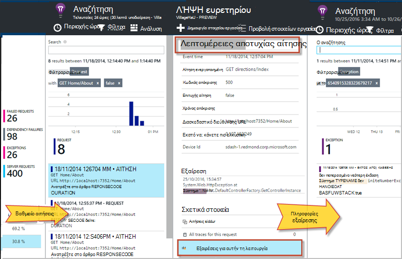

<properties 
    pageTitle="Διάγνωση αποτυχίες και εξαιρέσεις σε εφαρμογές ASP.NET με ιδέες εφαρμογής" 
    description="Καταγραφή εξαιρέσεις από τις εφαρμογές ASP.NET μαζί με αίτηση τηλεμετρίας." 
    services="application-insights" 
    documentationCenter=".net"
    authors="alancameronwills" 
    manager="douge"/>

<tags 
    ms.service="application-insights" 
    ms.workload="tbd" 
    ms.tgt_pltfrm="ibiza" 
    ms.devlang="na" 
    ms.topic="article" 
    ms.date="10/27/2016" 
    ms.author="awills"/>


# <a name="set-up-application-insights-diagnose-exceptions"></a>Ρύθμιση εφαρμογών ιδέες: διάγνωση εξαιρέσεις

[AZURE.INCLUDE [app-insights-selector-get-started-dotnet](../../includes/app-insights-selector-get-started-dotnet.md)]


Παρακολουθώντας την εφαρμογή σας με το [Visual Studio εφαρμογή ιδέες][start], μπορείτε να συσχετίσετε αποτυχημένων αιτήσεων με εξαιρέσεις και άλλα συμβάντα στο πρόγραμμα-πελάτη και διακομιστή, ώστε να μπορείτε γρήγορα να διάγνωση τις αιτίες.

Για να παρακολουθείτε μια εφαρμογή ASP.NET, πρέπει να [προσθέσετε SDK ιδέες εφαρμογής] [ greenbrown] στην εφαρμογή ή [εγκατάσταση Εποπτεία κατάστασης στο διακομιστή των υπηρεσιών IIS][redfield], ή, εάν η εφαρμογή σας είναι μια εφαρμογή Web της Azure, προσθέστε την [Επέκταση ιδέες εφαρμογής](app-insights-azure-web-apps.md).

## <a name="diagnosing-exceptions-using-visual-studio"></a>Διάγνωση εξαιρέσεις χρήση του Visual Studio

Ανοίξτε την εφαρμογή λύση στο Visual Studio για να σας βοηθήσει με τον εντοπισμό σφαλμάτων.

Εκτελέστε την εφαρμογή, είτε στο διακομιστή είτε στον υπολογιστή σας στην ανάπτυξη χρησιμοποιώντας F5.

Ανοίξτε το παράθυρο αναζήτησης ιδέες εφαρμογή στο Visual Studio και ορισμός, για να εμφανίσετε τα συμβάντα από την εφαρμογή σας. Ενώ κάνετε εντοπισμό σφαλμάτων, μπορείτε να το κάνετε απλώς κάνοντας κλικ στο κουμπί Εφαρμογή ιδέες.


Παρατηρήστε ότι μπορείτε να φιλτράρετε την αναφορά για να εμφανίσετε μόνο εξαιρέσεις. 

*Χωρίς εξαιρέσεις που εμφανίζει; Ανατρέξτε στο θέμα [Καταγραφή εξαιρέσεις](#exceptions).*

Κάντε κλικ σε μια αναφορά εξαιρέσεων για να εμφανίσετε την ανίχνευση στοίβας.


Κάντε κλικ σε μια αναφορά γραμμής στην ανίχνευση στοίβας, για να το ανοίξετε στο σχετικό αρχείο.  

## <a name="diagnosing-failures-using-the-azure-portal"></a>Διάγνωση αποτυχίες με την πύλη Azure

Από την εφαρμογή ιδέες Επισκόπηση της εφαρμογής, το πλακίδιο αποτυχίες παρουσιάζονται γραφήματα εξαιρέσεων και απέτυχε αιτήσεις HTTP, μαζί με μια λίστα της αίτησης διευθύνσεις URL που προκαλούν το πιο συχνά αποτυχίες.


Κάντε κλικ σε έναν από τους τύπους αποτυχημένων αιτήσεων στη λίστα για να μεταβείτε σε μεμονωμένες εμφανίσεις της αποτυχίας. Από εκεί, κάντε κλικ στην επιλογή μέσω τις εξαιρέσεις ή ανίχνευση δεδομένα που σχετίζονται με αυτό:




**Εναλλακτικά,** μπορείτε να ξεκινήσετε από τη λίστα των εξαιρέσεις που θα βρείτε πιο κάτω το blade αποτυχίες. Διατήρηση κάνοντας κλικ στην επιλογή μέχρι να φτάσετε τελικά στο μεμονωμένα εξαιρέσεις.


*Χωρίς εξαιρέσεις που εμφανίζει; Ανατρέξτε στο θέμα [Καταγραφή εξαιρέσεις](#exceptions).*

Από εκεί που μπορεί να ανατρέξετε στην ανίχνευση στοίβας και λεπτομερείς ιδιότητες του κάθε εξαίρεση και να βρείτε σχετικό αρχείο καταγραφής ανίχνευσης ή άλλα συμβάντα.


[Μάθετε περισσότερα σχετικά με διαγνωστικών αναζήτησης][diagnostic].


## <a name="dependency-failures"></a>Αποτυχίες εξάρτησης

*Εξάρτηση* είναι μια υπηρεσία που η εφαρμογή σας καλεί, συνήθως μέσω μιας σύνδεσης REST API ή τη βάση δεδομένων. [Εποπτεία κατάστασης ιδέες εφαρμογής] [ redfield] παρακολουθεί αυτόματα μια ποικιλία τύπων της κλήσης εξάρτηση, μέτρηση διάρκεια κλήσης και επιτυχίας ή αποτυχίας. 

Για να λάβετε δεδομένα εξάρτηση, πρέπει να [εγκαταστήσετε την οθόνη κατάσταση] [ redfield] στο διακομιστή των υπηρεσιών IIS, εάν μια εφαρμογή Web της Azure είναι η εφαρμογή σας, χρησιμοποιήστε την [Επέκταση ιδέες εφαρμογής](app-insights-azure-web-apps.md). 

Αποτυχίας κλήσεις με τις εξαρτήσεις, παρατίθενται στη το blade αποτυχίες και μπορείτε επίσης να βρείτε τους στην περιοχή σχετικά στοιχεία στο λεπτομέρειες της αίτησης και λεπτομέρειες εξαίρεσης.

*Δεν υπάρχει αποτυχίες εξάρτηση; Αυτό είναι καλό. Αλλά για να βεβαιωθείτε ότι λαμβάνετε εξάρτηση δεδομένων, ανοίξτε το blade επιδόσεων και εξετάστε το γράφημα εξάρτησης διάρκεια.*

 

## <a name="custom-tracing-and-log-data"></a>Προσαρμοσμένη ανίχνευσης και δεδομένα του αρχείου καταγραφής

Για να λάβετε διαγνωστικών δεδομένων ειδικά για την εφαρμογή σας, μπορείτε να εισαγάγετε κωδικό για να στείλετε τα δικά σας δεδομένα τηλεμετρίας. Αυτό που εμφανίζεται στο διαγνωστικών αναζήτησης μαζί με την αίτηση, προβολή σελίδας και άλλα δεδομένα που συλλέγονται αυτόματα. 

Έχετε διάφορες επιλογές:

* [TrackEvent()](app-insights-api-custom-events-metrics.md#track-event) χρησιμοποιείται συνήθως για την παρακολούθηση μοτίβων χρήσης, αλλά τα δεδομένα να αποστέλλεται επίσης εμφανίζεται στην περιοχή προσαρμοσμένα συμβάντα στο διαγνωστικών αναζήτησης. Συμβάντα ονομάζονται και να εκτελέσετε Ιδιότητες συμβολοσειράς και αριθμητικών μετρικά στην οποία μπορείτε να [φιλτράρετε τις αναζητήσεις διαγνωστικών][diagnostic].
* [TrackTrace()](app-insights-api-custom-events-metrics.md#track-trace) επιτρέπει την αποστολή περισσότερο δεδομένων όπως οι πληροφορίες ΔΗΜΟΣΊΕΥΣΗ.
* [TrackException()](#exceptions) στέλνει ίχνη στοίβας. [Περισσότερες πληροφορίες σχετικά με εξαιρέσεις](#exceptions).
* Εάν χρησιμοποιείτε ήδη ένα πλαίσιο καταγραφή όπως Log4Net ή NLog, μπορείτε να [καταγράψετε αυτά τα αρχεία καταγραφής] [ netlogs] και να τα δείτε στην διαγνωστικών αναζήτησης μαζί με τα δεδομένα αίτησης και εξαίρεση.

Για να δείτε αυτά τα συμβάντα, Άνοιγμα [αναζήτησης][diagnostic], Άνοιγμα φίλτρου και, στη συνέχεια, επιλέξτε προσαρμοσμένο συμβάν, ανίχνευσης ή η εξαίρεση.


> [AZURE.NOTE] Εάν το app δημιουργεί πολλές τηλεμετρίας, τη λειτουργική μονάδα προσαρμόσιμη δειγματοληψία μειώνει αυτόματα την ένταση ήχου που αποστέλλονται με την πύλη με την αποστολή μόνο σε αντιπρόσωπος κλάσμα συμβάντων. Συμβάντα που αποτελούν μέρος της την ίδια λειτουργία θα είναι επιλεγμένο ή μη επιλεγμένο ως ομάδα, ώστε να μπορείτε να μετακινηθείτε μεταξύ των σχετικών συμβάντα. [Μάθετε περισσότερα σχετικά με δειγματοληψία.](app-insights-sampling.md)

### <a name="how-to-see-request-post-data"></a>Πώς μπορείτε να δείτε την αίτηση ΚΑΤΑΧΏΡΗΣΗΣ δεδομένων

Λεπτομέρειες της αίτησης δεν περιλαμβάνουν τα δεδομένα που αποστέλλονται σε εφαρμογή σε μια κλήση ΔΗΜΟΣΊΕΥΣΗ. Για να έχετε αυτά τα δεδομένα που αναφέρονται:

* [Εγκατάσταση του SDK] [ greenbrown] στο έργο σας εφαρμογής.
* Εισαγωγή κώδικα στην εφαρμογή σας για να καλέσετε [Microsoft.ApplicationInsights.TrackTrace()][api]. Στείλτε την ΚΑΤΑΧΏΡΗΣΗ δεδομένων στην παράμετρο μήνυμα. Υπάρχει όριο το επιτρεπόμενο μέγεθος, επομένως θα πρέπει να προσπαθήσετε να στείλετε μόνο τα βασικά δεδομένα.
* Όταν διερευνήσουμε αίτησης αποτυχίας, βρείτε τη συσχετισμένη ανιχνεύσεις.  


## <a name="exceptions"></a>Καταγραφή εξαιρέσεις και σχετικών δεδομένων διαγνωστικών

Αρχικά, δεν θα βλέπετε στην πύλη του όλες τις εξαιρέσεις που προκαλέσει αποτυχίες στην εφαρμογή. Θα δείτε τυχόν εξαιρέσεις προγράμματος περιήγησης (Εάν χρησιμοποιείτε το [JavaScript SDK] [ client] στις ιστοσελίδες σας). Αλλά περισσότερες εξαιρέσεις διακομιστή είναι αποκλείονται από τις υπηρεσίες IIS και θα πρέπει να γράψετε λίγο του κώδικα για να τα δείτε.

Μπορείς:

* **Συνδεθείτε εξαιρέσεις ρητά** με την εισαγωγή κώδικα σε προγράμματα χειρισμού εξαίρεση για την αναφορά τις εξαιρέσεις.
* **Καταγραφή εξαιρέσεις αυτόματα** τη ρύθμιση των παραμέτρων σας framework ASP.NET. Τις απαραίτητες προσθήκες είναι διαφορετικές για διαφορετικούς τύπους framework.

## <a name="reporting-exceptions-explicitly"></a>Δημιουργία αναφορών εξαιρέσεις ρητά

Ο πιο απλός τρόπος είναι να εισαγάγετε μια κλήση για να TrackException() σε ένα πρόγραμμα χειρισμού εξαίρεσης.

JavaScript

    try 
    { ...
    }
    catch (ex)
    {
      appInsights.trackException(ex, "handler loc",
        {Game: currentGame.Name, 
         State: currentGame.State.ToString()});
    }

C#

    var telemetry = new TelemetryClient();
    ...
    try 
    { ...
    }
    catch (Exception ex)
    {
       // Set up some properties:
       var properties = new Dictionary <string, string> 
         {{"Game", currentGame.Name}};

       var measurements = new Dictionary <string, double>
         {{"Users", currentGame.Users.Count}};

       // Send the exception telemetry:
       telemetry.TrackException(ex, properties, measurements);
    }

VB

    Dim telemetry = New TelemetryClient
    ...
    Try
      ...
    Catch ex as Exception
      ' Set up some properties:
      Dim properties = New Dictionary (Of String, String)
      properties.Add("Game", currentGame.Name)

      Dim measurements = New Dictionary (Of String, Double)
      measurements.Add("Users", currentGame.Users.Count)
  
      ' Send the exception telemetry:
      telemetry.TrackException(ex, properties, measurements)
    End Try

Τις παραμέτρους ιδιοτήτων και μετρήσεις είναι προαιρετικό, αλλά είναι χρήσιμο για [το φιλτράρισμα και την προσθήκη] [ diagnostic] επιπλέον πληροφορίες. Για παράδειγμα, εάν έχετε μια εφαρμογή που μπορούν να εκτελούν πολλές αγώνων, ενδέχεται να μπορείτε να βρείτε όλες τις αναφορές εξαίρεσης που σχετίζονται με ένα συγκεκριμένο παιχνίδι. Μπορείτε να προσθέσετε όσες στοιχεία θέλετε κάθε λεξικό.

## <a name="browser-exceptions"></a>Εξαιρέσεις προγράμματος περιήγησης

Αναφέρονται περισσότερες εξαιρέσεις προγράμματος περιήγησης.

Εάν η ιστοσελίδα σας περιλαμβάνει αρχεία δέσμης ενεργειών από δίκτυα παράδοσης περιεχομένου ή άλλους τομείς, βεβαιωθείτε ότι η ετικέτα δέσμης ενεργειών σας περιλαμβάνει το χαρακτηριστικό ```crossorigin="anonymous"```, και ότι ο διακομιστής αποστέλλει [CORS κεφαλίδες](http://enable-cors.org/). Αυτό θα σας επιτρέψει να λάβετε μια ανίχνευση στοίβας και λεπτομερειών για ανεπίλυτη JavaScript εξαιρέσεις από αυτούς τους πόρους.

## <a name="web-forms"></a>Φόρμες Web

Για φόρμες web, θα μπορείτε να συλλέξετε τις εξαιρέσεις όταν υπάρχουν δεν έχουν ρυθμιστεί με CustomErrors ανακατευθύνει τη λειτουργική μονάδα HTTP.

Αλλά, εάν έχετε ενεργό ανακατευθύνσεις, προσθέστε τις ακόλουθες γραμμές στη λειτουργία Application_Error Global.asax.cs. (Προσθήκη ένα αρχείο Global.asax, εάν δεν έχετε ήδη ένα.)

*C#*

    void Application_Error(object sender, EventArgs e)
    {
      if (HttpContext.Current.IsCustomErrorEnabled && Server.GetLastError  () != null)
      {
         var ai = new TelemetryClient(); // or re-use an existing instance

         ai.TrackException(Server.GetLastError());
      }
    }


## <a name="mvc"></a>MVC

Εάν η ρύθμιση παραμέτρων [CustomErrors](https://msdn.microsoft.com/library/h0hfz6fc.aspx) είναι `Off`, τότε εξαιρέσεις θα είναι διαθέσιμες για τη [Λειτουργική μονάδα HTTP](https://msdn.microsoft.com/library/ms178468.aspx) για τη συλλογή. Ωστόσο, εάν είναι `RemoteOnly` (προεπιλογή), ή `On`, τότε η εξαίρεση θα απενεργοποιηθεί και δεν είναι διαθέσιμη για εφαρμογή ιδέες για τη συλλογή αυτόματα. Μπορείτε να διορθώσετε που παράκαμψη [κλάσης System.Web.Mvc.HandleErrorAttribute](http://msdn.microsoft.com/library/system.web.mvc.handleerrorattribute.aspx)και, εφαρμόζοντας έχουν παρακαμφθεί τάξη, όπως φαίνεται για τις διαφορετικές εκδόσεις MVC κάτω από το στοιχείο ([github προέλευσης](https://github.com/AppInsightsSamples/Mvc2UnhandledExceptions/blob/master/MVC2App/Controllers/AiHandleErrorAttribute.cs)):

    using System;
    using System.Web.Mvc;
    using Microsoft.ApplicationInsights;

    namespace MVC2App.Controllers
    {
      [AttributeUsage(AttributeTargets.Class | AttributeTargets.Method, Inherited = true, AllowMultiple = true)] 
      public class AiHandleErrorAttribute : HandleErrorAttribute
      {
        public override void OnException(ExceptionContext filterContext)
        {
            if (filterContext != null && filterContext.HttpContext != null && filterContext.Exception != null)
            {
                //If customError is Off, then AI HTTPModule will report the exception
                if (filterContext.HttpContext.IsCustomErrorEnabled)
                {   //or reuse instance (recommended!). see note above  
                    var ai = new TelemetryClient();
                    ai.TrackException(filterContext.Exception);
                } 
            }
            base.OnException(filterContext);
        }
      }
    }

#### <a name="mvc-2"></a>MVC 2

Αντικαταστήστε το χαρακτηριστικό HandleError με το νέο χαρακτηριστικό στο ελεγκτές σας.

    namespace MVC2App.Controllers
    {
       [AiHandleError]
       public class HomeController : Controller
       {
    ...

[Δείγμα](https://github.com/AppInsightsSamples/Mvc2UnhandledExceptions)

#### <a name="mvc-3"></a>MVC 3

Καταχώρηση `AiHandleErrorAttribute` ως καθολικό φίλτρο στο Global.asax.cs:

    public class MyMvcApplication : System.Web.HttpApplication
    {
      public static void RegisterGlobalFilters(GlobalFilterCollection filters)
      {
         filters.Add(new AiHandleErrorAttribute());
      }
     ...

[Δείγμα](https://github.com/AppInsightsSamples/Mvc3UnhandledExceptionTelemetry)


#### <a name="mvc-4-mvc5"></a>MVC 4, MVC5

Καταχώρηση AiHandleErrorAttribute ως καθολικό φίλτρο στο FilterConfig.cs:

    public class FilterConfig
    {
      public static void RegisterGlobalFilters(GlobalFilterCollection filters)
      {
        // Default replaced with the override to track unhandled exceptions
        filters.Add(new AiHandleErrorAttribute());
      }
    }

[Δείγμα](https://github.com/AppInsightsSamples/Mvc5UnhandledExceptionTelemetry)

## <a name="web-api-1x"></a>Web API 1.x


Παράκαμψη System.Web.Http.Filters.ExceptionFilterAttribute:

    using System.Web.Http.Filters;
    using Microsoft.ApplicationInsights;

    namespace WebAPI.App_Start
    {
      public class AiExceptionFilterAttribute : ExceptionFilterAttribute
      {
        public override void OnException(HttpActionExecutedContext actionExecutedContext)
        {
            if (actionExecutedContext != null && actionExecutedContext.Exception != null)
            {  //or reuse instance (recommended!). see note above 
                var ai = new TelemetryClient();
                ai.TrackException(actionExecutedContext.Exception);    
            }
            base.OnException(actionExecutedContext);
        }
      }
    }

Που θα μπορούσε να προσθέσετε αυτό το χαρακτηριστικό έχουν παρακαμφθεί σε συγκεκριμένες ελεγκτές ή να προσθέσετε το στη ρύθμιση παραμέτρων καθολικής φίλτρου στην τάξη WebApiConfig: 

    using System.Web.Http;
    using WebApi1.x.App_Start;

    namespace WebApi1.x
    {
      public static class WebApiConfig
      {
        public static void Register(HttpConfiguration config)
        {
            config.Routes.MapHttpRoute(name: "DefaultApi", routeTemplate: "api/{controller}/{id}",
                defaults: new { id = RouteParameter.Optional });
            ...
            config.EnableSystemDiagnosticsTracing();

            // Capture exceptions for Application Insights:
            config.Filters.Add(new AiExceptionFilterAttribute());
        }
      }
    }

[Δείγμα](https://github.com/AppInsightsSamples/WebApi_1.x_UnhandledExceptions)

Υπάρχουν περιπτώσεις που δεν είναι δυνατό να χειριστείτε τα φίλτρα εξαίρεσης. Για παράδειγμα:

* Εξαιρέσεις που ανακύπτουν από ελεγκτή κατασκευές. 
* Εξαιρέσεις που ανακύπτουν από προγράμματα χειρισμού μηνύματος. 
* Εξαιρέσεις που ανακύπτουν κατά τη δρομολόγηση. 
* Εξαιρέσεις που ανακύπτουν κατά τη διάρκεια της απόκρισης σειριοποίησης περιεχομένου. 

## <a name="web-api-2x"></a>Web API 2.x

Προσθέστε μια εφαρμογή της IExceptionLogger:

    using System.Web.Http.ExceptionHandling;
    using Microsoft.ApplicationInsights;

    namespace ProductsAppPureWebAPI.App_Start
    {
      public class AiExceptionLogger : ExceptionLogger
      {
        public override void Log(ExceptionLoggerContext context)
        {
            if (context !=null && context.Exception != null)
            {//or reuse instance (recommended!). see note above 
                var ai = new TelemetryClient();
                ai.TrackException(context.Exception);
            }
            base.Log(context);
        }
      }
    }

Προσθέστε αυτό με τις υπηρεσίες στο WebApiConfig:

    using System.Web.Http;
    using System.Web.Http.ExceptionHandling;
    using ProductsAppPureWebAPI.App_Start;

    namespace WebApi2WithMVC
    {
      public static class WebApiConfig
      {
        public static void Register(HttpConfiguration config)
        {
            // Web API configuration and services

            // Web API routes
            config.MapHttpAttributeRoutes();

            config.Routes.MapHttpRoute(
                name: "DefaultApi",
                routeTemplate: "api/{controller}/{id}",
                defaults: new { id = RouteParameter.Optional }
            );
            config.Services.Add(typeof(IExceptionLogger), new AiExceptionLogger()); 
        }
      }
  }

[Δείγμα](https://github.com/AppInsightsSamples/WebApi_2.x_UnhandledExceptions)

Ως εναλλακτικές λύσεις, που θα μπορούσαν να:

2. Αντικαταστήστε το ExceptionHandler μόνο με μια προσαρμοσμένη υλοποίηση της IExceptionHandler. Αυτό ονομάζεται μόνο όταν το πλαίσιο είναι εξακολουθείτε να μπορείτε να επιλέξετε ποιο μήνυμα απάντησης για να στείλετε (όχι όταν η σύνδεση είναι ματαιώθηκε, για παράδειγμα) 
3. Εξαίρεση φίλτρα (όπως περιγράφεται στην ενότητα Web API 1.x ελεγκτές παραπάνω) - δεν καλείται σε όλες τις περιπτώσεις.


## <a name="wcf"></a>WCF

Προσθήκη μιας κλάσης που επεκτείνει χαρακτηριστικό και υλοποιεί IErrorHandler και IServiceBehavior.

    using System;
    using System.Collections.Generic;
    using System.Linq;
    using System.ServiceModel.Description;
    using System.ServiceModel.Dispatcher;
    using System.Web;
    using Microsoft.ApplicationInsights;

    namespace WcfService4.ErrorHandling
    {
      public class AiLogExceptionAttribute : Attribute, IErrorHandler, IServiceBehavior
      {
        public void AddBindingParameters(ServiceDescription serviceDescription,
            System.ServiceModel.ServiceHostBase serviceHostBase,
            System.Collections.ObjectModel.Collection<ServiceEndpoint> endpoints,
            System.ServiceModel.Channels.BindingParameterCollection bindingParameters)
        {
        }

        public void ApplyDispatchBehavior(ServiceDescription serviceDescription, 
            System.ServiceModel.ServiceHostBase serviceHostBase)
        {
            foreach (ChannelDispatcher disp in serviceHostBase.ChannelDispatchers)
            {
                disp.ErrorHandlers.Add(this);
            }
        }

        public void Validate(ServiceDescription serviceDescription, 
            System.ServiceModel.ServiceHostBase serviceHostBase)
        {
        }

        bool IErrorHandler.HandleError(Exception error)
        {//or reuse instance (recommended!). see note above 
            var ai = new TelemetryClient();

            ai.TrackException(error);
            return false;
        }

        void IErrorHandler.ProvideFault(Exception error, 
            System.ServiceModel.Channels.MessageVersion version, 
            ref System.ServiceModel.Channels.Message fault)
        {
        }
      }
    }

Προσθέστε το χαρακτηριστικό με τις υλοποιήσεις υπηρεσίας:

    namespace WcfService4
    {
        [AiLogException]
        public class Service1 : IService1 
        { 
         ...

[Δείγμα](https://github.com/AppInsightsSamples/WCFUnhandledExceptions)

## <a name="exception-performance-counters"></a>Εξαίρεση μετρητές επιδόσεων

Εάν έχετε [εγκαταστήσει την οθόνη κατάσταση] [ redfield] στο διακομιστή σας, μπορείτε να λάβετε ένα γράφημα του ποσοστού εξαιρέσεις, μετράται με βάση το .NET. Αυτό περιλαμβάνει τόσο Διαχειρισμένων και ανεπίλυτη .NET εξαιρέσεις.

Ανοίξτε ένα μετρικό σύστημα Explorer blade, προσθέστε ένα νέο γράφημα και επιλέξτε **εξαίρεση επιτόκιο**που παρατίθενται στην περιοχή μετρητές επιδόσεων. 

Το .NET framework υπολογίζει το επιτόκιο καταμέτρηση του αριθμού των εξαιρέσεις σε ένα διάστημα και διαιρώντας κατά τη διάρκεια του χρονικού διαστήματος. 

Σημειώστε ότι θα είναι διαφορετικό από το πλήθος 'Εξαιρέσεις' υπολογίζεται από την πύλη εφαρμογής ιδέες μετρώντας TrackException αναφορές. Τα χρονικά διαστήματα δειγματοληψία είναι διαφορετικές και το SDK δεν αποστολή TrackException αναφορές για όλους χειρισμού και δεν επιλύεται εξαιρέσεις.

<!--Link references-->

[api]: app-insights-api-custom-events-metrics.md
[client]: app-insights-javascript.md
[diagnostic]: app-insights-diagnostic-search.md
[greenbrown]: app-insights-asp-net.md
[netlogs]: app-insights-asp-net-trace-logs.md
[redfield]: app-insights-monitor-performance-live-website-now.md
[start]: app-insights-overview.md

 
