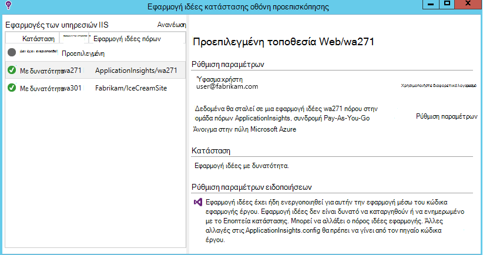
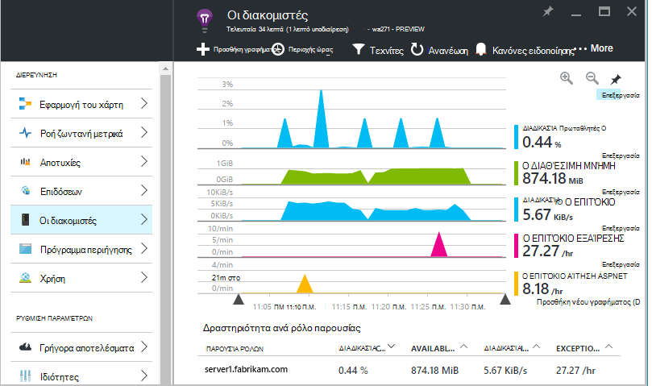
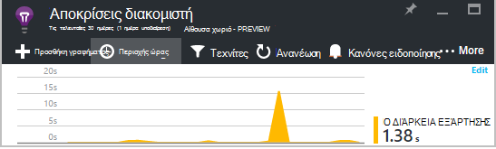
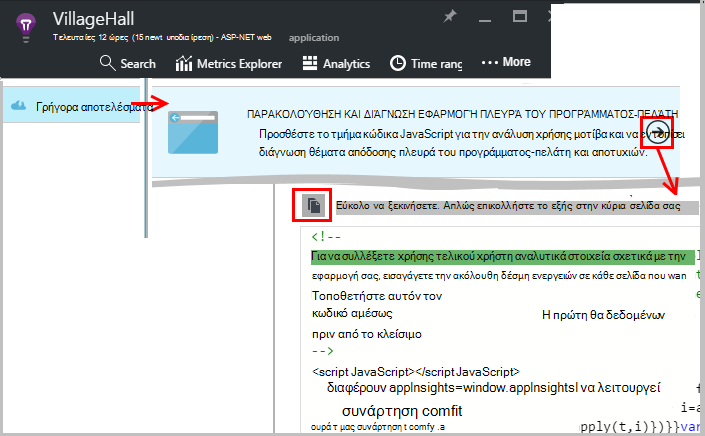
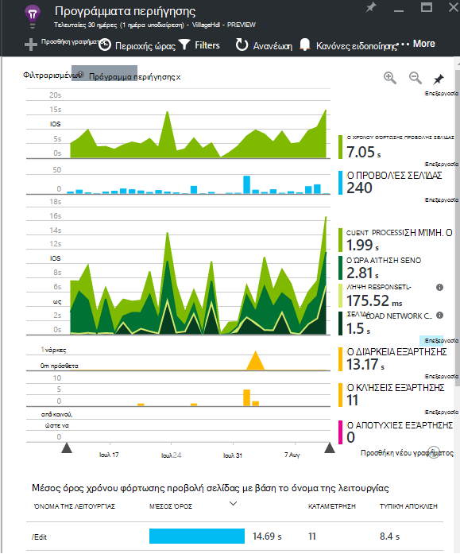
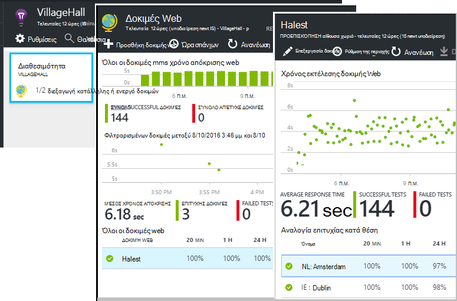
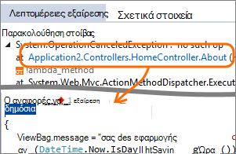
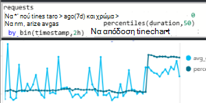
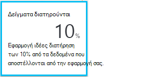

<properties 
    pageTitle="Αξιοποιήσετε περισσότερο ιδέες εφαρμογή | Microsoft Azure" 
    description="Μετά την γρήγορα αποτελέσματα με την εφαρμογή ιδέες, θα δείτε μια σύνοψη των δυνατοτήτων που μπορείτε να εξερευνήσετε." 
    services="application-insights" 
    documentationCenter=".net"
    authors="alancameronwills" 
    manager="douge"/>

<tags 
    ms.service="application-insights" 
    ms.workload="tbd" 
    ms.tgt_pltfrm="ibiza" 
    ms.devlang="na" 
    ms.topic="article" 
    ms.date="10/27/2016" 
    ms.author="awills"/>

# <a name="more-telemetry-from-application-insights"></a>Περισσότερες τηλεμετρίας από εφαρμογή ιδέες

Αφού έχετε [προσθέσει ιδέες εφαρμογής για να τον κωδικό ASP.NET](app-insights-asp-net.md), υπάρχουν μερικά πράγματα που μπορείτε να κάνετε για να λάβετε ακόμα περισσότερα τηλεμετρίας. 

## <a name="if-your-app-runs-on-your-iis-server-"></a>Εάν η εφαρμογή σας εκτελείται στο διακομιστή των υπηρεσιών IIS...

Εάν η εφαρμογή σας φιλοξενείται σε διακομιστές των υπηρεσιών IIS σε στοιχείο ελέγχου σας, εγκαταστήστε την οθόνη κατάσταση ιδέες εφαρμογή στους διακομιστές. Εάν έχει ήδη εγκατασταθεί, δεν χρειάζεται να κάνετε τίποτα.

1. Σε κάθε διακομιστή web των υπηρεσιών IIS, πραγματοποιήστε είσοδο με τα διαπιστευτήρια διαχειριστή.
2. Κάντε λήψη και εκτέλεση του [προγράμματος εγκατάστασης Εποπτεία κατάστασης](http://go.microsoft.com/fwlink/?LinkId=506648).
3. Στον Οδηγό εγκατάστασης, πραγματοποιήστε είσοδο στο Windows Azure.

Δεν χρειάζεται να κάνετε κάτι άλλο, αλλά μπορείτε να επιβεβαιώσετε ότι παρακολούθηση είναι ενεργοποιημένη για την εφαρμογή σας.



(Μπορείτε επίσης να χρησιμοποιήσετε Εποπτεία κατάστασης για να [ενεργοποιήσετε την παρακολούθηση κατά το χρόνο εκτέλεσης](app-insights-monitor-performance-live-website-now.md), ακόμα και αν δεν έχετε μέσου τις εφαρμογές στο Visual Studio.)

### <a name="what-do-you-get"></a>Τι μπορώ να αποκτήσω;

Εάν είναι εγκατεστημένο Εποπτεία κατάστασης σε υπολογιστές του διακομιστή σας, θα λάβετε ορισμένες πρόσθετες τηλεμετρίας:

* Εξάρτηση τηλεμετρίας (κλήσεις SQL και ΥΠΌΛΟΙΠΑ κλήσεις που έγιναν από την εφαρμογή σας) για τις εφαρμογές της διαίρεσης 4,5 .NET. (Για νεότερες εκδόσεις του .NET, Εποπτεία κατάστασης δεν είναι απαραίτητη για το τηλεμετρίας εξάρτηση.) 
* Ίχνη στοίβας εξαίρεσης εμφάνιση περισσότερων λεπτομερειών.
* Μετρητές επιδόσεων. Στο εφαρμογής ιδέες, αυτοί οι μετρητές εμφανίζονται στο το blade διακομιστές. 



Για να δείτε περισσότερα ή λιγότερα μετρητές, [επεξεργαστείτε τα γραφήματα](app-insights-metrics-explorer.md). Εάν το μετρητή επιδόσεων που θέλετε δεν είναι διαθέσιμη του συνόλου, μπορείτε να [το προσθέσετε στο σύνολο που συλλέγονται από τη λειτουργική μονάδα μετρητή επιδόσεων](app-insights-performance-counters.md).

## <a name="if-its-an-azure-web-app-"></a>Εάν πρόκειται για μια εφαρμογή Azure web...

Εάν εκτελείται την εφαρμογή σας με Azure web app, μεταβείτε στον πίνακα ελέγχου Azure για την εφαρμογή ή Εικονική και ανοίξτε την εφαρμογή ιδέες blade. 

### <a name="what-do-you-get"></a>Τι μπορώ να αποκτήσω;

* Ίχνη στοίβας εξαίρεσης εμφάνιση περισσότερων λεπτομερειών.
* Εξάρτηση τηλεμετρίας (κλήσεις SQL και ΥΠΌΛΟΙΠΑ κλήσεις που έγιναν από την εφαρμογή σας) για τις εφαρμογές της διαίρεσης 4,5 .NET. (Για .NET νεότερες εκδόσεις, την επέκταση δεν είναι απαραίτητη για το τηλεμετρίας εξάρτηση.) 



(Μπορείτε επίσης να χρησιμοποιήσετε αυτήν τη μέθοδο για να [ενεργοποιήσετε την παρακολούθηση κατά το χρόνο εκτέλεσης των επιδόσεων](app-insights-monitor-performance-live-website-now.md), ακόμα και αν δεν έχετε μέσου την εφαρμογή στο Visual Studio.)

## <a name="client-side-monitoring"></a>Παρακολούθηση πλευρά του προγράμματος-πελάτη

Έχετε εγκαταστήσει το SDK που στέλνει δεδομένα τηλεμετρίας από το διακομιστή (παρασκηνίου) της εφαρμογής σας. Τώρα μπορείτε να προσθέσετε παρακολούθηση πλευρά του προγράμματος-πελάτη. Αυτό σας παρέχει με δεδομένα σε χρήστες, περιόδους λειτουργίας, προβολές σελίδας, και τυχόν εξαιρέσεις ή σφάλματα που προκύπτουν στο πρόγραμμα περιήγησης. Επίσης θα έχετε τη δυνατότητα να συντάξετε το δικό σας κώδικα για να παρακολουθείτε πώς λειτουργούν οι χρήστες σας με την εφαρμογή, προς τα δεξιά προς τα κάτω τη λεπτομερή επίπεδο κλικ και πατήματα πλήκτρων.

Προσθέστε το τμήμα κώδικα JavaScript ιδέες εφαρμογής σε κάθε ιστοσελίδα, για να λάβετε τηλεμετρίας από τα προγράμματα περιήγησης του προγράμματος-πελάτη.

1. Στο Azure, ανοίξτε τον πόρο εφαρμογής ιδέες για την εφαρμογή σας.
2. Ανοίξτε γρήγορα αποτελέσματα, οθόνη-πελάτη, και αντιγράψτε το τμήμα κώδικα.
3. Το επικολλήσετε ώστε να εμφανίζεται στην κεφαλίδα του κάθε ιστοσελίδα - συνήθως μπορείτε να το κάνετε αυτό, επικολλώντας σε αυτήν τη σελίδα Διάταξη υποδείγματος.



Παρατηρήστε ότι ο κώδικας περιέχει τον αριθμό-κλειδί οργάνων που προσδιορίζει τον πόρο εφαρμογής.

### <a name="what-do-you-get"></a>Τι μπορώ να αποκτήσω;

* Μπορείτε να συντάξετε JavaScript για την αποστολή [προσαρμοσμένων τηλεμετρίας από τις ιστοσελίδες σας](app-insights-api-custom-events-metrics.md), για παράδειγμα, για να παρακολουθείτε κλικ με το κουμπί.
* Στην [ανάλυση](app-insights-analytics.md), δεδομένα σε `pageViews` και AJAX δεδομένων σε `dependencies`. 
* [Επιδόσεις προγράμματος-πελάτη και δεδομένων χρήσης](app-insights-javascript.md) στο blade τα προγράμματα περιήγησης.




[Μάθετε περισσότερα σχετικά με την ιστοσελίδα παρακολούθησης.](app-insights-web-track-usage.md)


## <a name="track-application-version"></a>Η έκδοση της εφαρμογής παρακολούθησης

Βεβαιωθείτε ότι `buildinfo.config` δημιουργείται από τη διαδικασία MSBuild. Στο αρχείο σας .csproj, προσθέστε:  

```XML

    <PropertyGroup>
      <GenerateBuildInfoConfigFile>true</GenerateBuildInfoConfigFile>    <IncludeServerNameInBuildInfo>true</IncludeServerNameInBuildInfo>
    </PropertyGroup> 
```

Όταν που έχει τις πληροφορίες Δόμηση, τη λειτουργική μονάδα ιδέες εφαρμογής web προσθέτει αυτόματα **η έκδοση της εφαρμογής** ως ιδιότητα για κάθε στοιχείο της τηλεμετρίας. Σας επιτρέπει να φιλτράρετε με βάση την έκδοση όταν εκτελεί [τις αναζητήσεις διαγνωστικών](app-insights-diagnostic-search.md) ή όταν [Εξερεύνηση μετρήσεις](app-insights-metrics-explorer.md). 

Ωστόσο, σημειώστε ότι ο αριθμός έκδοσης Δόμηση δημιουργείται μόνο με τη δημιουργία του MS, δεν από τη Δόμηση προγραμματιστής στο Visual Studio.


## <a name="availability-web-tests"></a>Διαθεσιμότητα web δοκιμές

Στείλτε την εφαρμογή web της αιτήσεις HTTP σε τακτά χρονικά διαστήματα από όλο τον κόσμο. Θα σας ειδοποιήσει, αν η απάντηση είναι αργή ή μη αξιόπιστη.

Στον πόρο εφαρμογής ιδέες για την εφαρμογή σας, κάντε κλικ στο πλακίδιο διαθεσιμότητα για προσθήκη, επεξεργασία και προβολή web δοκιμές.

Μπορείτε να προσθέσετε πολλές δοκιμών που εκτελούνται σε πολλές θέσεις.



[Μάθε περισσότερα](app-insights-monitor-web-app-availability.md)

## <a name="custom-telemetry-and-logging"></a>Προσαρμοσμένη τηλεμετρίας και καταγραφής

Τα πακέτα ιδέες εφαρμογής που έχετε προσθέσει στο τον κωδικό παρέχουν ένα API που μπορείτε να καλέσετε από την εφαρμογή σας.

* [Δημιουργήσετε το δικό σας συμβάντων και μετρήσεις](app-insights-api-custom-events-metrics.md), για παράδειγμα, για να συμβάντα επιχειρήσεις count ή παρακολούθηση απόδοσης.
* [Καταγραφή καταγραφής ανιχνεύσεις](app-insights-asp-net-trace-logs.md) από Log4Net, NLog ή System.Diagnostics.Trace.
* [Φιλτράρισμα, να τροποποιήσετε, ή να αυξήσετε](app-insights-api-filtering-sampling.md) την τυπική τηλεμετρίας αποστέλλονται από την εφαρμογή με τη σύνταξη Τηλεμετρίας επεξεργαστών. 


## <a name="powerful-analysis-and-presentation"></a>Ισχυρές αναλύσεις και την παρουσίαση

Υπάρχουν πολλοί τρόποι για να εξερευνήσετε τα δεδομένα σας. Εάν έχετε ξεκινήσει πρόσφατα με εφαρμογή ιδέες, ανατρέξτε στα θέματα αυτά τα άρθρα:

||
|---|---
|[**Για παράδειγμα δεδομένων διαγνωστικών αναζήτησης**](app-insights-visual-studio.md)<br/>Αναζήτησης και φίλτρου συμβάντα όπως αιτήσεις, εξαιρέσεις, κλήσεις εξάρτηση, ανιχνεύσεις καταγραφής και προβολών σελίδας. Στο Visual Studio, μεταβείτε στο κώδικα από ίχνη στοίβας.|
|[**Εξερεύνηση μετρήσεις για συγκεντρωτικά δεδομένα**](app-insights-metrics-explorer.md)<br/>Εξερεύνηση του, να φιλτράρετε και να χωρίσετε συγκεντρωτικά δεδομένα όπως χρεώσεις αιτήσεις, αποτυχίες και εξαιρέσεις. χρόνοι απόκρισης, τους χρόνους φόρτωσης σελίδων.|
|[**Πίνακες εργαλείων**](app-insights-dashboards.md#dashboards)<br/>Συνδυάσετε δεδομένα από πολλούς πόρους και κοινή χρήση με άλλους. Ιδανικό για εφαρμογές πολλαπλών στοιχείων, καθώς και για συνεχή εμφάνιση στην αίθουσα ομάδας.  |
|[**Ροή ζωντανή μετρικά**](app-insights-metrics-explorer.md#live-metrics-stream)<br/>Όταν αναπτύξετε μια νέα έκδοση, παρακολουθήστε αυτά τα δείκτες απόδοσης κοντά-πραγματικό χρόνο για να βεβαιωθείτε ότι όλα λειτουργούν όπως αναμένεται.|
|[**Ανάλυση**](app-insights-analytics.md)<br/>Απαντήστε δύσκολες ερωτήσεις σχετικά με τις επιδόσεις και η χρήση της εφαρμογής σας χρησιμοποιώντας αυτήν τη γλώσσα ερωτήματος ισχυρή.|
|[**Αυτόματες και μη αυτόματες ειδοποιήσεις**](app-insights-alerts.md)<br/>Αυτόματες ειδοποιήσεις προσαρμοστεί σε κανονική μοτίβα της εφαρμογής σας τηλεμετρίας και έναυσμα όταν υπάρχει κάτι έξω από το συνήθη μοτίβο. Μπορείτε επίσης να ορίσετε ειδοποιήσεις στη συγκεκριμένη επίπεδα προσαρμοσμένων ή τυπική μετρικά.|

## <a name="data-management"></a>Διαχείριση δεδομένων

|||
|---|---|
|[**Συνεχής εξαγωγής**](app-insights-export-telemetry.md)<br/>Αντιγράψτε όλες τις τηλεμετρίας στο χώρο αποθήκευσης, έτσι ώστε να μπορείτε να αναλύσετε τον δικό σας τρόπο.|
|**Πρόσβαση σε δεδομένα API**<br/>Έρχομαι σύντομα.|
|[**Δειγματοληψία**](app-insights-sampling.md)<br/>Μειώνει την ταχύτητα δεδομένων και σας βοηθά να παραμείνει εντός του ορίου σας τιμολόγησης επίπεδο.|