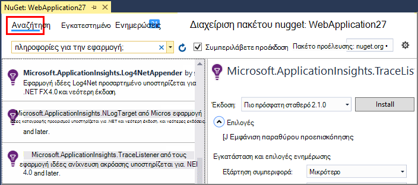

<properties 
    pageTitle="Εξερεύνηση αρχείων καταγραφής ανίχνευσης .NET στην εφαρμογή ιδέες" 
    description="Αναζήτηση αρχείων καταγραφής που δημιουργούνται με ανίχνευση, NLog ή Log4Net." 
    services="application-insights" 
    documentationCenter=".net"
    authors="alancameronwills" 
    manager="douge"/>

<tags 
    ms.service="application-insights" 
    ms.workload="tbd" 
    ms.tgt_pltfrm="ibiza" 
    ms.devlang="na" 
    ms.topic="article" 
    ms.date="07/21/2016" 
    ms.author="awills"/>
 
# <a name="explore-net-trace-logs-in-application-insights"></a>Εξερεύνηση αρχείων καταγραφής ανίχνευσης .NET στην εφαρμογή ιδέες  

Εάν χρησιμοποιείτε το NLog, log4Net ή System.Diagnostics.Trace για διαγνωστικών ανίχνευση στην εφαρμογή σας ASP.NET, μπορείτε να έχετε τα αρχεία καταγραφής που αποστέλλονται στο [Visual Studio εφαρμογή ιδέες][start], όπου μπορείτε να εξερευνήσετε και να τις αναζητήσετε. Τα αρχεία καταγραφής θα συγχωνευτούν με τα άλλα τηλεμετρίας που προέρχονται από την εφαρμογή σας, ώστε να μπορείτε να προσδιορίσετε τα στοιχεία που σχετίζονται με κάθε αίτηση χρήστη για τη συντήρηση και συσχετισμός τους με άλλα συμβάντα και εξαίρεση εκθέσεις.


> [AZURE.NOTE] Χρειάζεστε τη λειτουργική μονάδα καταγραφής καταγραφής; Πρόκειται για μια χρήσιμη προσαρμογέα για άλλου κατασκευαστή καταγραφής ακολουθίας χαρακτήρων πληκτρολόγησης, αλλά εάν δεν χρησιμοποιείτε ήδη NLog, log4Net ή System.Diagnostics.Trace, εξετάστε το ενδεχόμενο να καλεί μόνο [TrackTrace() ιδέες εφαρμογή](app-insights-api-custom-events-metrics.md#track-trace) απευθείας.


## <a name="install-logging-on-your-app"></a>Εγκατάσταση καταγραφής στην εφαρμογή σας

Εγκαταστήστε το πλαίσιο επιλογής καταγραφής στο έργο σας. Αυτό θα πρέπει να έχει ως αποτέλεσμα μια καταχώρηση σε app.config ή web.config.

Εάν χρησιμοποιείτε το System.Diagnostics.Trace, πρέπει να προσθέσετε μια εγγραφή στους web.config:

```XML

    <configuration>
     <system.diagnostics>
       <trace autoflush="false" indentsize="4">
         <listeners>
           <add name="myListener" 
             type="System.Diagnostics.TextWriterTraceListener" 
             initializeData="TextWriterOutput.log" />
           <remove name="Default" />
         </listeners>
       </trace>
     </system.diagnostics>
   </configuration>
```

## <a name="configure-application-insights-to-collect-logs"></a>Ρύθμιση παραμέτρων εφαρμογής ιδέες για τη συλλογή αρχείων καταγραφής

**[Προσθήκη εφαρμογής ιδέες για το έργο σας](app-insights-asp-net.md)** Εάν δεν το έχετε κάνει που ακόμη. Θα δείτε μια επιλογή για να συμπεριλάβετε το αρχείο καταγραφής συλλογής.

Ή **Ρύθμιση παραμέτρων ιδέες εφαρμογής** κάνοντας δεξί κλικ στην Εξερεύνηση λύσεων το έργο σας. Ενεργοποιήστε την επιλογή **Ρύθμιση παραμέτρων ανίχνευση**στη συλλογή.

*Επιλογή "χωρίς εφαρμογή ιδέες μενού ή το αρχείο καταγραφής συλλογής";* Δοκιμάστε [την αντιμετώπιση προβλημάτων](#troubleshooting).


## <a name="manual-installation"></a>Μη αυτόματη εγκατάσταση

Χρησιμοποιήστε αυτήν τη μέθοδο εάν τον τύπο του έργου σας δεν υποστηρίζεται από το πρόγραμμα εγκατάστασης εφαρμογών ιδέες (για παράδειγμα Windows επιφάνειας εργασίας έργου). 

1. Εάν σκοπεύετε να χρησιμοποιήσετε το log4Net ή NLog, εγκαταστήσετε στο έργο σας. 
2. Στην Εξερεύνηση λύσεων, κάντε δεξιό κλικ στο έργο σας και επιλέξτε **Διαχείριση πακέτων NuGet**.
3. Αναζήτηση για "Εφαρμογή ιδεών"

    

4. Επιλέξτε το κατάλληλο πακέτο - μία από:
  + Microsoft.ApplicationInsights.TraceListener (για να καταγράψετε τις κλήσεις System.Diagnostics.Trace)
  + Microsoft.ApplicationInsights.NLogTarget
  + Microsoft.ApplicationInsights.Log4NetAppender

Το πακέτο NuGet εγκαθιστά τις απαραίτητες συγκροτήσεις και επίσης τροποποιεί web.config ή app.config.

## <a name="insert-diagnostic-log-calls"></a>Εισαγωγή κλήσεις αρχείο καταγραφής διαγνωστικών

Εάν χρησιμοποιείτε το System.Diagnostics.Trace, πρέπει να είναι μια τυπική κλήση:

    System.Diagnostics.Trace.TraceWarning("Slow response - database01");

Εάν προτιμάτε να log4net ή NLog:

    logger.Warn("Slow response - database01");


## <a name="using-the-trace-api-directly"></a>Χρήση της ανίχνευσης API απευθείας

Μπορείτε να καλέσετε την ανίχνευση ιδέες εφαρμογής API απευθείας. Η καταγραφή προσαρμογέων Χρησιμοποιήστε αυτό το API. 

Για παράδειγμα:

    var telemetry = new Microsoft.ApplicationInsights.TelemetryClient();
    telemetry.TrackTrace("Slow response - database01");

Ένα πλεονέκτημα της TrackTrace είναι ότι μπορείτε να τοποθετήσετε σχετικά μεγάλων δεδομένα στο μήνυμα. Για παράδειγμα, μπορεί να κωδικοποιήσετε ΚΑΤΑΧΏΡΗΣΗ δεδομένων εκεί. 

Επιπλέον, μπορείτε να προσθέσετε ένα επίπεδο σοβαρότητας στο μήνυμά σας. Και, όπως άλλες τηλεμετρίας, μπορείτε να προσθέσετε τιμές ιδιοτήτων που μπορείτε να χρησιμοποιήσετε για να σας βοηθήσει φίλτρο ή αναζήτηση για διαφορετικά σύνολα ανιχνεύσεις. Για παράδειγμα:


    var telemetry = new Microsoft.ApplicationInsights.TelemetryClient();
    telemetry.TrackTrace("Slow database response",
                   SeverityLevel.Warning,
                   new Dictionary<string,string> { {"database", db.ID} });

Αυτό θα επιτρέπουν, στο πλαίσιο [Αναζήτηση][diagnostic], για να φιλτράρεται εύκολα όλα τα μηνύματα της συγκεκριμένης σοβαρότητας επιπέδου που σχετίζονται με μια συγκεκριμένη βάση δεδομένων.

## <a name="explore-your-logs"></a>Εξερεύνηση αρχείων καταγραφής σας

Εκτελέστε την εφαρμογή σας, είτε σε λειτουργία εντοπισμού σφαλμάτων ή να το αναπτύξετε live.

Στο blade Επισκόπηση της εφαρμογής σας στην [πύλη εφαρμογής ιδέες][portal], επιλέξτε [Αναζήτηση][diagnostic].


Μπορείτε να κάνετε, για παράδειγμα:

* Φιλτράρισμα στο αρχείο καταγραφής ανίχνευσης ή στοιχεία με συγκεκριμένες ιδιότητες
* Έλεγχος ενός συγκεκριμένου στοιχείου με λεπτομέρειες.
* Εύρεση άλλων τηλεμετρίας σχετικά με την ίδια αίτηση χρήστη (δηλαδή, με την ίδια OperationId) 
* Αποθήκευση των παραμέτρων αυτής της σελίδας ως αγαπημένης

> [AZURE.NOTE] **Δειγματοληψία.** Εάν η εφαρμογή σας στέλνει πολλά δεδομένα και χρησιμοποιείτε το SDK ιδέες εφαρμογής για ASP.NET έκδοση 2.0.0-beta3 ή νεότερη έκδοση, η δυνατότητα προσαρμόσιμης δειγματοληψία μπορεί να εφαρμόζει και αποστολή μόνο ποσοστό του τηλεμετρίας σας. [Μάθετε περισσότερα σχετικά με τη δειγματοληψία.](app-insights-sampling.md)

## <a name="next-steps"></a>Επόμενα βήματα

[Διάγνωση αποτυχίες και εξαιρέσεις σε ASP.NET][exceptions]

[Μάθετε περισσότερα σχετικά με την αναζήτηση][diagnostic].


## <a name="troubleshooting"></a>Αντιμετώπιση προβλημάτων

### <a name="how-do-i-do-this-for-java"></a>Πώς να κάνω αυτό για Java;

Χρήση των [προσαρμογέων καταγραφής Java](app-insights-java-trace-logs.md).

### <a name="theres-no-application-insights-option-on-the-project-context-menu"></a>Δεν υπάρχει επιλογή ιδέες εφαρμογής από το μενού περιβάλλοντος έργου

* Εργαλεία ελέγχου ιδέες εφαρμογή είναι εγκατεστημένη σε αυτόν τον υπολογιστή ανάπτυξης. Στο μενού Εργαλεία του Visual Studio, επεκτάσεις και ενημερώσεις, αναζητήστε εργαλεία ιδέες εφαρμογών. Εάν δεν είναι στην καρτέλα εγκατεστημένες, ανοίξτε την καρτέλα ηλεκτρονικά και εγκαταστήστε το.
* Αυτό μπορεί να είναι ένας τύπος έργου δεν υποστηρίζονται από τα εργαλεία ιδέες εφαρμογής. Χρήση [μη αυτόματης εγκατάστασης](#manual-installation).

### <a name="no-log-adapter-option-in-the-configuration-tool"></a>Δεν υπάρχει επιλογή προσαρμογέα καταγραφής στο εργαλείο ρύθμισης παραμέτρων

* Πρέπει να εγκαταστήσετε το πλαίσιο καταγραφή πρώτα.
* Εάν χρησιμοποιείτε System.Diagnostics.Trace, βεβαιωθείτε ότι [έχει ρυθμιστεί με `web.config` ](https://msdn.microsoft.com/library/system.diagnostics.eventlogtracelistener.aspx).
* Έχετε που έχετε την πιο πρόσφατη έκδοση της εφαρμογής ιδέες εργαλεία; Στο μενού **Εργαλεία** του Visual Studio, επιλέξτε **επεκτάσεις και ενημερώσεις**και ανοίξτε την καρτέλα **ενημερώσεις** . Εάν υπάρχουν εργαλεία ιδέες εφαρμογής, κάντε κλικ για να την ενημερώσετε.


### <a name="emptykey"></a>Λαμβάνω ένα μήνυμα σφάλματος "το κλειδί οργάνων δεν μπορεί να είναι κενό"

Φαίνεται έχετε εγκαταστήσει το πακέτο Nuget προσαρμογέα καταγραφής χωρίς την εγκατάσταση εφαρμογών ιδέες.

Στην Εξερεύνηση λύσεων, κάντε δεξί κλικ `ApplicationInsights.config` και επιλέξτε **Ενημέρωση εφαρμογής ιδέες**. Θα εμφανιστεί ένα παράθυρο διαλόγου που σάς καλεί να εισέλθετε στο Azure και είτε δημιουργήστε έναν πόρο ιδέες εφαρμογής, ή εκ νέου χρήση μιας υπάρχουσας. Που θα πρέπει να το διορθώσετε.

### <a name="i-can-see-traces-in-diagnostic-search-but-not-the-other-events"></a>Μπορώ να δω ανιχνεύσεις στο διαγνωστικών αναζήτησης, αλλά όχι τα υπόλοιπα συμβάντα του

Μερικές φορές μπορεί να χρειαστεί κάποιος χρόνος για όλα τα συμβάντα και προσκλήσεις για να λάβετε μέσω της διοχέτευσης.

### <a name="limits"></a>Διατηρούνται όγκο δεδομένων;

Έως 500 συμβάντα ανά δευτερόλεπτο από κάθε εφαρμογή. Συμβάντα διατηρούνται για επτά ημέρες.

### <a name="im-not-seeing-some-of-the-log-entries-that-i-expect"></a>Δεν βλέπω κάποιες από τις εγγραφές που να περιμένω

Εάν η εφαρμογή σας στέλνει πολλά δεδομένα και χρησιμοποιείτε το SDK ιδέες εφαρμογής για ASP.NET έκδοση 2.0.0-beta3 ή νεότερη έκδοση, η δυνατότητα προσαρμόσιμης δειγματοληψία μπορεί να εφαρμόζει και αποστολή μόνο ποσοστό του τηλεμετρίας σας. [Μάθετε περισσότερα σχετικά με τη δειγματοληψία.](app-insights-sampling.md)

## <a name="add"></a>Επόμενα βήματα

* [Ρύθμιση δοκιμές απόκριση και διαθεσιμότητα][availability]
* [Αντιμετώπιση προβλημάτων][qna]


<!--Link references-->

[availability]: app-insights-monitor-web-app-availability.md
[diagnostic]: app-insights-diagnostic-search.md
[exceptions]: app-insights-asp-net-exceptions.md
[portal]: https://portal.azure.com/
[qna]: app-insights-troubleshoot-faq.md
[start]: app-insights-overview.md

 
