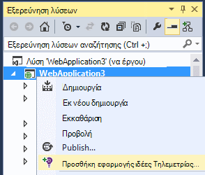

<properties 
    pageTitle="Ρύθμιση υπηρεσίας εφαρμογής web analytics για ASP.NET με εφαρμογή ιδέες | Microsoft Azure" 
    description="Ρύθμιση παραμέτρων επιδόσεων, διαθεσιμότητα και αναλυτικών στοιχείων χρήσης για την τοποθεσία Web ASP.NET, φιλοξενούνται εσωτερικής εγκατάστασης ή στο Azure." 
    services="application-insights" 
    documentationCenter=".net"
    authors="NumberByColors" 
    manager="douge"/>

<tags 
    ms.service="application-insights" 
    ms.workload="tbd" 
    ms.tgt_pltfrm="ibiza" 
    ms.devlang="na" 
    ms.topic="get-started-article" 
    ms.date="10/13/2016" 
    ms.author="awills"/>


# <a name="set-up-application-insights-for-aspnet"></a>Ρύθμιση εφαρμογών ιδέες για το ASP.NET

[Visual Studio εφαρμογή ιδέες](app-insights-overview.md) παρακολουθεί την εφαρμογή σας live για να σας βοηθήσουν να [εντοπίσετε και να διάγνωση θεμάτων επιδόσεων και εξαιρέσεις](app-insights-detect-triage-diagnose.md)και [Ανακαλύψτε τον τρόπο χρήσης της εφαρμογής σας](app-insights-overview-usage.md).  Λειτουργεί για τις εφαρμογές που φιλοξενούνται σε τη δική σας διακομιστών εσωτερικής εγκατάστασης των υπηρεσιών IIS ή στο cloud ΣΠΣ, καθώς και εφαρμογές Azure web.


## <a name="before-you-start"></a>Πριν ξεκινήσετε

Χρειάζεσαι:

* Visual Studio ενημέρωση 2013 3 ή νεότερη έκδοση. Αργότερα, είναι καλύτερα.
* Μια συνδρομή στο [Microsoft Azure](http://azure.com). Εάν η ομάδα ή την εταιρεία σας έχει μια συνδρομή του Azure, ο κάτοχος να προσθέσετε που, χρησιμοποιώντας το [λογαριασμό Microsoft που διαθέτετε](http://live.com). 

Υπάρχουν εναλλακτικές άρθρα για να δείτε εάν σας ενδιαφέρει:

* [Instrumenting μια εφαρμογή web κατά το χρόνο εκτέλεσης](app-insights-monitor-performance-live-website-now.md)
* [Υπηρεσίες Cloud της Azure](app-insights-cloudservices.md)

## <a name="ide"></a>1. Προσθήκη εφαρμογής ιδέες SDK


### <a name="if-its-a-new-project"></a>Εάν πρόκειται για ένα νέο έργο...

Βεβαιωθείτε ότι έχει επιλεγεί ιδέες εφαρμογής όταν δημιουργείτε ένα νέο έργο στο Visual Studio. 


### <a name="-or-if-its-an-existing-project"></a>... ή εάν πρόκειται για ένα υπάρχον έργο

Κάντε δεξί κλικ στο έργο στην Εξερεύνηση λύσεων και επιλέξτε **Προσθήκη εφαρμογής ιδέες Τηλεμετρίας** ή **Ρύθμιση παραμέτρων εφαρμογής ιδέες**.



* ASP.NET βασικού έργου; - [Ακολουθήστε αυτές τις οδηγίες για τη διόρθωση μερικές γραμμές κώδικα](https://github.com/Microsoft/ApplicationInsights-aspnetcore/wiki/Getting-Started#add-application-insights-instrumentation-code-to-startupcs). 


## <a name="run"></a>2. Εκτελέστε την εφαρμογή σας

Εκτελέστε την εφαρμογή σας με F5 και να το δοκιμάσετε: άνοιγμα διαφορετικές σελίδες για να δημιουργήσετε ορισμένες τηλεμετρίας.

Στο Visual Studio, μπορείτε να δείτε μια καταμέτρηση του τα συμβάντα που έχουν καταγραφεί. 


## <a name="3-see-your-telemetry"></a>3. δείτε σας τηλεμετρίας...

### <a name="-in-visual-studio"></a>... στο Visual Studio

Ανοίξτε το παράθυρο ιδέες εφαρμογή στο Visual Studio: κάντε κλικ στο κουμπί Εφαρμογή ιδέες, είτε κάντε δεξί κλικ στην Εξερεύνηση λύσεων το έργο σας:


Αυτή η προβολή εμφανίζει τηλεμετρίας που δημιουργούνται στο διακομιστή της εφαρμογής. Πειραματιστείτε με τα φίλτρα και κάντε κλικ σε οποιοδήποτε συμβάν για να δείτε περισσότερες λεπτομέρειες.

[Μάθετε περισσότερα σχετικά με τα εργαλεία ιδέες εφαρμογή στο Visual Studio](app-insights-visual-studio.md).

<a name="monitor"></a> 
### <a name="-in-the-portal"></a>... στην πύλη

Εκτός εάν επιλέξατε να *Εγκαταστήσετε το SDK μόνο,* μπορείτε επίσης να δείτε το τηλεμετρίας στην πύλη ιδέες εφαρμογής web. 

Η πύλη έχει περισσότερα γραφήματα, εργαλεία ανάλυσης και πίνακες εργαλείων του Visual Studio. 


Ανοίξτε την εφαρμογή ιδέες πόρο στην [πύλη του Azure](https://portal.azure.com/).


Ανοίγει η πύλη σε μια προβολή από το τηλεμετρίας από την εφαρμογή:

* Η πρώτη τηλεμετρίας εμφανίζεται στη [ζωντανή ροή μετρήσεις](app-insights-metrics-explorer.md#live-metrics-stream).
* Μεμονωμένα συμβάντα εμφανίζονται στο πλαίσιο **αναζήτησης** (1). Δεδομένων ενδέχεται να χρειαστούν μερικά λεπτά για να εμφανιστούν. Κάντε κλικ σε οποιοδήποτε συμβάν για να δείτε τις ιδιότητές του. 
* Συγκεντρωτική μετρικά εμφανίζονται στα γραφήματα (2). Αυτό μπορεί να διαρκέσει ένα ή δύο για τα δεδομένα να εμφανίζεται εδώ λεπτά. Κάντε κλικ σε οποιοδήποτε γράφημα για να ανοίξετε μια blade με περισσότερες λεπτομέρειες.

[Μάθετε περισσότερα σχετικά με τη χρήση εφαρμογής ιδέες στην πύλη του Azure](app-insights-dashboards.md).

## <a name="4-publish-your-app"></a>4. δημοσίευση της εφαρμογής σας

Δημοσίευση της εφαρμογής σας με το διακομιστή των υπηρεσιών IIS ή για να Azure. Παρακολουθήστε [ζωντανή ροή μετρικά](app-insights-metrics-explorer.md#live-metrics-stream) για να βεβαιωθείτε ότι όλα τα στοιχεία εκτελείται ομαλά.

Θα δείτε το τηλεμετρίας δημιουργώντας στην πύλη του εφαρμογή ιδέες, όπου μπορείτε να παρακολουθείτε μετρικά, αναζήτηση σας τηλεμετρίας και ρύθμιση [πίνακες εργαλείων](app-insights-dashboards.md). Μπορείτε επίσης να χρησιμοποιήσετε το ισχυρή [ανάλυση ερωτήματος γλώσσα](app-insights-analytics.md) για την ανάλυση χρήσης και επιδόσεων ή βρείτε συγκεκριμένα συμβάντα. 

Μπορείτε επίσης να συνεχίσετε να αναλύσετε σας τηλεμετρίας στο [Visual Studio](app-insights-visual-studio.md) με εργαλεία όπως το διαγνωστικών αναζήτησης και [τάσεις](app-insights-visual-studio-trends.md).

> [AZURE.NOTE] Αν την εφαρμογή σας στείλει αρκετό τηλεμετρίας για να προσεγγίσετε το [περιορισμού όρια](app-insights-pricing.md#limits-summary), αυτόματη [δειγματοληψία](app-insights-sampling.md) αλλάζει. Δειγματοληψία μειώνει την ποσότητα των τηλεμετρίας που αποστέλλονται από την εφαρμογή, διατηρώντας συσχετισμένης δεδομένα για σκοπούς διαγνωστικών.


##<a name="land"></a>Τι έχει αλλάξει 'Προσθήκη εφαρμογής ιδέες'

Εφαρμογή ιδέες αποστέλλει τηλεμετρίας από την εφαρμογή σας στην πύλη του ιδέες εφαρμογής (η οποία φιλοξενείται στο Microsoft Azure):


Επομένως, η εντολή μήπως τρία στοιχεία:

1. Προσθέστε το πακέτο εφαρμογών ιδέες Web SDK NuGet στο έργο σας. Για να το δείτε στο Visual Studio, κάντε δεξιό κλικ στο έργο σας και επιλέξτε Διαχείριση πακέτων NuGet.
2. Δημιουργήστε έναν πόρο ιδέες εφαρμογής στην [πύλη του Azure](https://portal.azure.com/). Αυτό είναι όπου θα δείτε τα δεδομένα σας. Ανακτά το *κλειδί οργάνων,* το οποίο προσδιορίζει τον πόρο.
3. Εισάγει το κλειδί οργάνων στο `ApplicationInsights.config`, έτσι ώστε το SDK μπορεί να στείλει τηλεμετρίας στην πύλη του.

Εάν θέλετε, μπορείτε να κάνετε αυτά τα βήματα με μη αυτόματο τρόπο για το [ASP.NET 4](app-insights-windows-services.md) ή [ASP.NET πυρήνα](https://github.com/Microsoft/ApplicationInsights-aspnetcore/wiki/Getting-Started).

### <a name="to-upgrade-to-future-sdk-versions"></a>Για να αναβαθμίσετε σε μελλοντικές εκδόσεις SDK

Για να κάνετε αναβάθμιση σε μια [νέα έκδοση του SDK](https://github.com/Microsoft/ApplicationInsights-dotnet-server/releases), ανοίξτε ξανά τη Διαχείριση πακέτου NuGet και το φιλτράρισμα σε εγκατεστημένων πακέτων. Επιλέξτε Microsoft.ApplicationInsights.Web και επιλέξτε αναβάθμιση.

Εάν έχετε κάνει τυχόν προσαρμογές ApplicationInsights.config, αποθηκεύστε ένα αντίγραφό του πριν από την αναβάθμιση και, στη συνέχεια να συγχωνεύσετε τις αλλαγές με τη νέα έκδοση.

## <a name="add-more-telemetry"></a>Προσθήκη περισσότερων τηλεμετρίας

### <a name="web-pages-and-single-page-apps"></a>Σελίδες Web και εφαρμογές μίας σελίδας

1. [Προσθήκη το τμήμα κώδικα JavaScript](app-insights-javascript.md) σε σελίδες web για να ανάβει το πρόγραμμα περιήγησης και η χρήση λεπίδες με δεδομένα σχετικά με τις προβολές σελίδας, τους χρόνους φόρτωσης, εξαιρέσεις προγράμματος περιήγησης, AJAX κλήση επιδόσεις, μετρήσεις χρήστη και την περίοδο λειτουργίας.
2. [Προσαρμοσμένα συμβάντα κώδικα](app-insights-api-custom-events-metrics.md) σε πλήθος, ώρα ή μέτρηση ενεργειών του χρήστη.

### <a name="dependencies-exceptions-and-performance-counters"></a>Εξαρτήσεις, εξαιρέσεις και μετρητές επιδόσεων

[Εγκατάσταση Εποπτεία κατάστασης](app-insights-monitor-performance-live-website-now.md) σε κάθε μία από υπολογιστές του διακομιστή σας, για να λάβετε επιπλέον τηλεμετρίας σχετικά με την εφαρμογή σας. Αυτό είναι τι μπορείτε να:

* [Μετρητές επιδόσεων](app-insights-performance-counters.md) - 
CPU, μνήμης, δίσκου και άλλους μετρητές επιδόσεων που σχετίζονται με την εφαρμογή σας. 
* [Εξαιρέσεις](app-insights-asp-net-exceptions.md) - πιο λεπτομερείς τηλεμετρίας για ορισμένες εξαιρέσεις.
* [Εξαρτήσεις](app-insights-asp-net-dependencies.md) - κλήσεις σε υπηρεσίες REST API ή SQL. Μάθετε εάν αργές αποκρίσεις από εξωτερικά στοιχεία που προκαλούν προβλήματα επιδόσεων στην εφαρμογή. (Εάν η εφαρμογή σας εκτελείται στο .NET 4.6, δεν χρειάζεται Εποπτεία κατάστασης για να μεταβείτε σε αυτό το τηλεμετρίας.)

### <a name="diagnostic-code"></a>Κωδικός διαγνωστικών

Έχετε κάποιο πρόβλημα; Εάν θέλετε να εισαγάγετε κώδικα στην εφαρμογή για να βοηθά στη διάγνωση το, έχετε διάφορες επιλογές:

* [Καταγραφή καταγραφής ανιχνεύσεις](app-insights-asp-net-trace-logs.md): Εάν χρησιμοποιείτε ήδη Log4N, NLog ή System.Diagnostics.Trace για την καταγραφή συμβάντων ανίχνευσης, στη συνέχεια, το αποτέλεσμα του μπορούν να σταλούν στον ιδέες εφαρμογής, ώστε να μπορείτε να το συσχετίσετε με αιτήσεις, αναζήτηση σε αυτό και να αναλύσετε το. 
* [Προσαρμοσμένα συμβάντα και μετρήσεις](app-insights-api-custom-events-metrics.md): χρήση TrackEvent() και TrackMetric() είτε στο διακομιστή ή κώδικα ιστοσελίδας.
* [Ετικέτα τηλεμετρίας με πρόσθετες ιδιότητες](app-insights-api-filtering-sampling.md#add-properties)

Χρησιμοποιήστε την [Αναζήτηση](app-insights-diagnostic-search.md) για να βρείτε και να συσχετίσετε συγκεκριμένα συμβάντα και [ανάλυση](app-insights-analytics.md) για να εκτελέσετε πιο ισχυρή ερωτήματα.

## <a name="alerts"></a>Ειδοποιήσεις

Είναι η πρώτη να γνωρίζω εάν η εφαρμογή σας έχει προβλήματα. (Μην περιμένετε μέχρι να ενημερώσει τους χρήστες σας!) 

* [Δημιουργία web δοκιμές](app-insights-monitor-web-app-availability.md) για να βεβαιωθείτε ότι η τοποθεσία σας είναι ορατό στο web.
* [Έγκαιρη Διαγνωστικά](app-insights-proactive-diagnostics.md) εκτελείται αυτόματα (εάν την εφαρμογή σας έχει ορισμένες ελάχιστο κίνηση). Δεν χρειάζεται να κάνετε τίποτα για να ρυθμίσετε τους. Λένε που εάν την εφαρμογή σας έχει ένα ασυνήθιστο ρυθμός των αποτυχημένων αιτήσεων.
* [Ορισμός ειδοποιήσεων μετρικό](app-insights-alerts.md) σας ειδοποιήσει εάν ένα μετρικό τέμνει μια οριακή τιμή. Μπορείτε να ορίσετε τους σε προσαρμοσμένο μετρικά τον κωδικό που στην εφαρμογή σας.

Από προεπιλογή, ο κάτοχος της συνδρομής Azure αποστέλλονται οι ειδοποιήσεις. 


## <a name="version-and-release-tracking"></a>Παρακολούθηση της έκδοσης και

### <a name="track-application-version"></a>Η έκδοση της εφαρμογής παρακολούθησης

Βεβαιωθείτε ότι `buildinfo.config` δημιουργείται από τη διαδικασία MSBuild. Στο αρχείο σας .csproj, προσθέστε:  

```XML

    <PropertyGroup>
      <GenerateBuildInfoConfigFile>true</GenerateBuildInfoConfigFile>    <IncludeServerNameInBuildInfo>true</IncludeServerNameInBuildInfo>
    </PropertyGroup> 
```

Όταν που έχει τις πληροφορίες Δόμηση, τη λειτουργική μονάδα ιδέες εφαρμογής web προσθέτει αυτόματα **η έκδοση της εφαρμογής** ως ιδιότητα για κάθε στοιχείο της τηλεμετρίας. Σας επιτρέπει να φιλτράρετε με βάση την έκδοση όταν εκτελεί [τις αναζητήσεις διαγνωστικών](app-insights-diagnostic-search.md) ή όταν [Εξερεύνηση μετρήσεις](app-insights-metrics-explorer.md). 

Ωστόσο, σημειώστε ότι ο αριθμός έκδοσης Δόμηση δημιουργείται μόνο με τη δημιουργία του MS, δεν από τη Δόμηση προγραμματιστής στο Visual Studio.

### <a name="release-annotations"></a>Αφήστε σχόλια

Εάν χρησιμοποιείτε το Visual Studio Team Services, μπορείτε να [λάβετε ένα δείκτη σχολιασμού](app-insights-annotations.md) προστεθεί σε γραφήματα σας κάθε φορά που αφήνετε μια νέα έκδοση.


## <a name="next-steps"></a>Επόμενα βήματα

| | 
|---|---
|**[Εργασία με εφαρμογή ιδέες στο Visual Studio](app-insights-visual-studio.md)**<br/>Εντοπισμός σφαλμάτων με τηλεμετρίας, διαγνωστικών αναζήτησης, οδηγεί σε κώδικα.|
|**[Εργασία με την πύλη ιδέες εφαρμογής](app-insights-dashboards.md)**<br/>Πίνακες εργαλείων, ισχυρά εργαλεία διαγνωστικών και ανάλυσης, ειδοποιήσεις, ένα χάρτη ζωντανή εξάρτηση από την εφαρμογή, και την εξαγωγή τηλεμετρίας. |
|**[Προσθήκη περισσότερων δεδομένων](app-insights-asp-net-more.md)**<br/>Παρακολούθηση χρήσης, διαθεσιμότητα, εξαρτήσεις, εξαιρέσεις. Ενοποίηση ανιχνεύσεις από καταγραφή πλαισίων. Γράψτε προσαρμοσμένο τηλεμετρίας. | 


