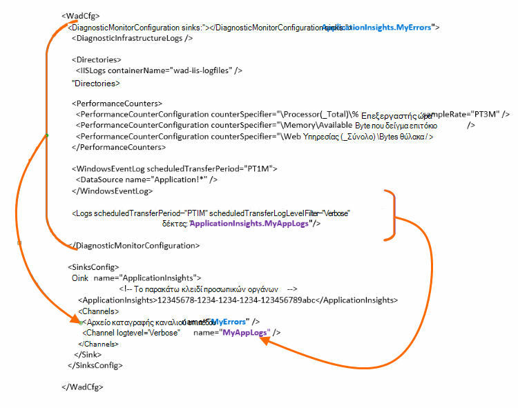

<properties
    pageTitle="Αποστολή αρχείων καταγραφής διαγνωστικών Azure ιδέες εφαρμογής"
    description="Ρυθμίστε τις παραμέτρους των λεπτομερειών των υπηρεσίες Cloud Azure αρχεία καταγραφής διαγνωστικών που έχουν αποσταλεί στην πύλη εφαρμογής ιδέες."
    services="application-insights"
    documentationCenter=".net"
    authors="sbtron"
    manager="douge"/>

<tags
    ms.service="application-insights"
    ms.workload="tbd"
    ms.tgt_pltfrm="ibiza"
    ms.devlang="na"
    ms.topic="article"
    ms.date="11/17/2015"
    ms.author="awills"/>

# <a name="configure-azure-diagnostic-logging-to-application-insights"></a>Ρύθμιση παραμέτρων καταγραφής διαγνωστικών Azure για ιδέες εφαρμογής

Όταν ορίζετε ένα έργο υπηρεσιών Cloud ή μια εικονική μηχανή στο Microsoft Azure, [Azure μπορούν να δημιουργούν ένα αρχείο καταγραφής διαγνωστικών](../vs-azure-tools-diagnostics-for-cloud-services-and-virtual-machines.md). Μπορείτε να έχετε αυτό αποστέλλονται εφαρμογή ιδέες, έτσι ώστε να μπορείτε να τα αναλύσετε μαζί με diagnostic και η χρήση τηλεμετρίας αποστέλλονται από μέσα στην εφαρμογή από SDK ιδέες για την εφαρμογή. Το αρχείο καταγραφής Azure περιλαμβάνει συμβάντα στη διαχείριση της εφαρμογής όπως Έναρξη, διακοπή, παρουσιάζει σφάλμα, καθώς και μετρητές επιδόσεων. Το αρχείο καταγραφής κλήσεων και περιλαμβάνει επίσης στην εφαρμογή για να System.Diagnostics.Trace.

Σε αυτό το άρθρο περιγράφει ρύθμιση παραμέτρων για την καταγραφή διαγνωστικών με λεπτομέρειες.

Χρειάζεστε Azure SDK 2,8 εγκατεστημένο στο Visual Studio.

## <a name="get-an-application-insights-resource"></a>Λάβετε έναν πόρο ιδέες εφαρμογής

Για το βέλτιστη εμπειρία, να [προσθέσετε στο SDK ιδέες εφαρμογής σε κάθε ρόλο της εφαρμογής υπηρεσιών Cloud](app-insights-cloudservices.md)ή [σε οποιαδήποτε εφαρμογή που θα εκτελείται σε σας Εικονική](app-insights-overview.md). Στη συνέχεια, να στείλετε τα διαγνωστικά δεδομένα προς ανάλυση και εμφανίζεται ο ίδιος πόρος ιδέες εφαρμογής.

Εναλλακτικά, εάν δεν θέλετε να χρησιμοποιήσετε το SDK - για παράδειγμα, εάν η εφαρμογή είναι ήδη live - μπορείτε απλώς [Δημιουργήστε ένα νέο πόρο ιδέες εφαρμογής](app-insights-create-new-resource.md) στην πύλη του Azure. Επιλέξτε **Διαγνωστικά Azure** ως ο τύπος της εφαρμογής.


## <a name="send-azure-diagnostics-to-application-insights"></a>Αποστολή Azure Διαγνωστικά ιδέες εφαρμογής

Εάν είστε σε θέση να ενημερώσετε το έργο σας εφαρμογής, στη συνέχεια, στο Visual Studio επιλέξτε κάθε ρόλο, επιλέξτε τις ιδιότητες και στην καρτέλα παράμετροι, επιλέξτε **Αποστολή διαγνωστικών για ιδέες εφαρμογής**.

Εάν η εφαρμογή σας είναι ήδη ζωντανή, χρησιμοποιήστε Εξερεύνηση Server ή τις υπηρεσίες Cloud explorer Visual Studio για να ανοίξετε τις ιδιότητες της εφαρμογής. Επιλέξτε **Αποστολή διαγνωστικών για ιδέες εφαρμογής**.

Σε κάθε περίπτωση θα σας ζητηθεί για τις λεπτομέρειες του πόρου ιδέες εφαρμογής που δημιουργήσατε.

[Μάθετε περισσότερα σχετικά με τη ρύθμιση της εφαρμογής ιδέες για μια εφαρμογή για τις υπηρεσίες Cloud](app-insights-cloudservices.md).

## <a name="configuring-the-azure-diagnostics-adapter"></a>Ρύθμιση παραμέτρων του προσαρμογέα Διαγνωστικά του Azure

Μόνο για ανάγνωση στην εάν θέλετε να επιλέξετε τα τμήματα του αρχείου καταγραφής που στέλνετε σε εφαρμογή ιδέες. Από προεπιλογή, όλα τα στοιχεία αποστέλλεται, συμπεριλαμβανομένων των: Microsoft Azure συμβάντων; μετρητές επιδόσεων; ανίχνευση κλήσεις από την εφαρμογή για να System.Diagnostics.Trace.

Διαγνωστικά του Azure αποθηκεύει δεδομένα σε πίνακες αποθήκευσης Azure. Ωστόσο, μπορείτε επίσης να διοχέτευση όλα ή ένα υποσύνολο των δεδομένων σε εφαρμογή ιδέες, ρυθμίζοντας τις παραμέτρους "δέκτες" και "Κανάλια" στη ρύθμιση παραμέτρων σας όταν χρησιμοποιείτε την επέκταση Διαγνωστικά Azure 1,5 ή νεότερη έκδοση.

### <a name="configure-application-insights-as-a-sink"></a>Ρύθμιση παραμέτρων ιδέες εφαρμογή ως ένα δέκτη

Όταν χρησιμοποιείτε τις ιδιότητες ρόλο για να ορίσετε "Αποστολή δεδομένων σε εφαρμογή ιδέες", το SDK Azure (2,8 ή νεότερη έκδοση) προσθέτει μια `<SinksConfig>` στοιχείο στο δημόσιο [αρχείο ρύθμισης παραμέτρων Azure Διαγνωστικά](https://msdn.microsoft.com/library/azure/dn782207.aspx) του ρόλου.

`<SinksConfig>`Καθορίζει το δέκτη επιπλέον όπου μπορούν να αποσταλούν τα δεδομένα του Azure Διαγνωστικά.  Παράδειγμα `SinksConfig` μοιάζει κάπως έτσι:

```xml

    <SinksConfig>
     <Sink name="ApplicationInsights">
      <ApplicationInsights>{Insert InstrumentationKey}</ApplicationInsights>
      <Channels>
        <Channel logLevel="Error" name="MyTopDiagData"  />
        <Channel logLevel="Verbose" name="MyLogData"  />
      </Channels>
     </Sink>
    </SinksConfig>

```

Το `ApplicationInsights` στοιχείο Καθορίζει το κλειδί οργάνων που προσδιορίζει τον πόρο ιδέες εφαρμογής στην οποία θα αποστέλλονται τα δεδομένα του Azure Διαγνωστικά. Όταν επιλέγετε τον πόρο, το συμπληρώνεται αυτόματα με βάση το `APPINSIGHTS_INSTRUMENTATIONKEY` ρύθμιση παραμέτρων της υπηρεσίας. (Εάν θέλετε να ρυθμίσετε με μη αυτόματο τρόπο, λάβετε τον αριθμό-κλειδί από τα βασικά στοιχεία για την αναπτυσσόμενη λίστα του πόρου.)

`Channels`Ορισμός των δεδομένων που θα αποσταλούν του δέκτη. Το κανάλι που λειτουργεί ως φίλτρο. Το `loglevel` χαρακτηριστικό σάς επιτρέπει να καθορίσετε το επίπεδο καταγραφής που θα σας στέλνει το κανάλι. Οι διαθέσιμες τιμές είναι: `{Verbose, Information, Warning, Error, Critical}`.

### <a name="send-data-to-the-sink"></a>Αποστολή δεδομένων για το δέκτη

Αποστολή δεδομένων για την εφαρμογή ιδέες δέκτη, προσθέτοντας το χαρακτηριστικό δέκτες κάτω από τον κόμβο DiagnosticMonitorConfiguration. Προσθήκη στοιχείου δέκτες σε κάθε κόμβο Καθορίζει ότι θέλετε τα δεδομένα που συλλέγονται από αυτόν τον κόμβο και οποιαδήποτε κόμβου κάτω από το να αποστέλλονται το δέκτη που καθορίζεται.

Για παράδειγμα, η προεπιλεγμένη που δημιουργήθηκε από το Azure SDK είναι να στείλετε όλα τα Azure διαγνωστικών δεδομένα:

```xml

    <DiagnosticMonitorConfiguration overallQuotaInMB="4096" sinks="ApplicationInsights">
```

Ωστόσο, εάν θέλετε να στείλετε μόνο αρχείων καταγραφής σφαλμάτων, εγκρίνετε το όνομα δέκτη με όνομα καναλιού:

```xml

    <DiagnosticMonitorConfiguration overallQuotaInMB="4096" sinks="ApplicationInsights.MyTopDiagdata">
```

Παρατηρήστε ότι χρησιμοποιούμε τη το όνομα του δέκτη που ορίσαμε, μαζί με το όνομα του καναλιού που ορίσαμε παραπάνω.

Εάν θέλετε να στείλετε αρχεία καταγραφής εφαρμογών λεπτομερές σε εφαρμογή ιδέες, στη συνέχεια, προσθέστε το χαρακτηριστικό δέκτες για να το `Logs` κόμβο.

```xml

    <Logs scheduledTransferPeriod="PT1M" scheduledTransferLogLevelFilter="Verbose" sinks="ApplicationInsights.MyLogData"/>
```

Μπορείτε επίσης να συμπεριλάβετε πολλές δέκτες στη ρύθμιση παραμέτρων σε διαφορετικά επίπεδα στην ιεραρχία. Σε αυτήν την περίπτωση το δέκτη που καθορίζεται στο ανώτατο επίπεδο της ιεραρχίας λειτουργεί ως καθολική ρύθμιση και του προϊόντος που καθορίζεται στο στοιχείο πράξεων μεμονωμένων στοιχείων όπως παράκαμψη αυτήν τη ρύθμιση καθολικού.

Ακολουθεί ένα παράδειγμα ολοκλήρωσης του αρχείου δημόσια ρύθμισης παραμέτρων που στέλνει όλα τα σφάλματα σε εφαρμογή ιδέες (καθορισμένο στο το `DiagnosticMonitorConfiguration` κόμβου) και επίσης λεπτομερές επίπεδο καταγράφει για τα αρχεία καταγραφής εφαρμογής (καθορισμένο στο το `Logs` κόμβου).

```xml

    <WadCfg>
     <DiagnosticMonitorConfiguration overallQuotaInMB="4096"
       sinks="ApplicationInsights.MyTopDiagData"> <!-- All info below sent to this channel -->
      <DiagnosticInfrastructureLogs />
      <PerformanceCounters>
        <PerformanceCounterConfiguration counterSpecifier="\Processor(_Total)\% Processor Time" sampleRate="PT3M" sinks="ApplicationInsights.MyLogData/>
        <PerformanceCounterConfiguration counterSpecifier="\Memory\Available MBytes" sampleRate="PT3M" />
        <PerformanceCounterConfiguration counterSpecifier="\Web Service(_Total)\Bytes Total/Sec" sampleRate="PT3M" />
      </PerformanceCounters>
      <WindowsEventLog scheduledTransferPeriod="PT1M">
        <DataSource name="Application!*" />
      </WindowsEventLog>
      <Logs scheduledTransferPeriod="PT1M" scheduledTransferLogLevelFilter="Verbose"
            sinks="ApplicationInsights.MyLogData"/>
       <!-- This specific info sent to this channel -->
     </DiagnosticMonitorConfiguration>

     <SinksConfig>
      <Sink name="ApplicationInsights">
        <ApplicationInsights>{Insert InstrumentationKey}</ApplicationInsights>
        <Channels>
          <Channel logLevel="Error" name="MyTopDiagData"  />
          <Channel logLevel="Verbose" name="MyLogData"  />
        </Channels>
      </Sink>
     </SinksConfig>
    </WadCfg>
```



Υπάρχουν ορισμένοι περιορισμοί που πρέπει να γνωρίζετε με αυτήν τη λειτουργία:

* Κανάλια προορίζονται μόνο για να εργαστείτε με τύπο αρχείου καταγραφής και δεν μετρητές επιδόσεων. Εάν καθορίσετε καναλιού με ένα στοιχείο μετρητή επιδόσεων θα αγνοηθεί.
* Το επίπεδο καταγραφής για ένα κανάλι δεν πρέπει να υπερβαίνει το επίπεδο καταγραφής για το τι που συλλέγονται από Azure Διαγνωστικά. Για παράδειγμα: δεν μπορείτε να συλλέξετε σφάλματα αρχείο καταγραφής της εφαρμογής στο στοιχείο αρχεία καταγραφής και προσπαθούν να στείλουν λεπτομερές αρχεία καταγραφής για το συγχρονισμό πληροφορίες για την εφαρμογή. Το χαρακτηριστικό scheduledTransferLogLevelFilter πάντα πρέπει να συλλέξετε ίση ή περισσότερα αρχεία καταγραφής από τα αρχεία καταγραφής που προσπαθείτε να στείλετε σε ένα δέκτη.
* Δεν μπορείτε να στείλετε blob δεδομένα που συλλέγονται από την επέκταση Azure Διαγνωστικά σε εφαρμογή ιδέες. Για παράδειγμα όλα τα στοιχεία που καθορίζεται στον κόμβο σε καταλόγους. Για το σφάλμα Αποτυπώνει η ένδειξη σφαλμάτων πραγματική θα εξακολουθούν να αποστέλλονται αντικειμένων blob χώρου αποθήκευσης και θα αποσταλούν μόνο μια ειδοποίηση ότι η ένδειξη σφαλμάτων δημιουργήθηκε σε εφαρμογή ιδέες.

## <a name="related-topics"></a>Σχετικά θέματα

* [Παρακολούθηση των υπηρεσιών Azure Cloud με ιδέες εφαρμογής](app-insights-cloudservices.md)
* [Χρήση του PowerShell για να στείλετε Azure Διαγνωστικά σε ιδέες εφαρμογής](app-insights-powershell-azure-diagnostics.md)
* [Azure αρχείο ρύθμισης παραμέτρων διαγνωστικών](https://msdn.microsoft.com/library/azure/dn782207.aspx)
