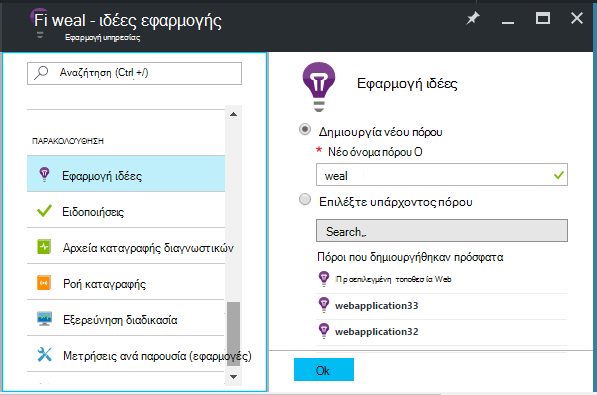
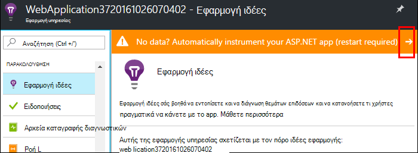
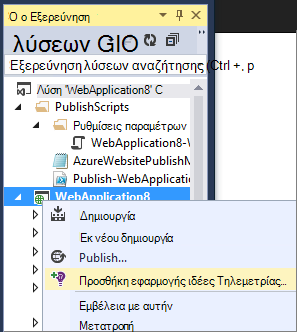
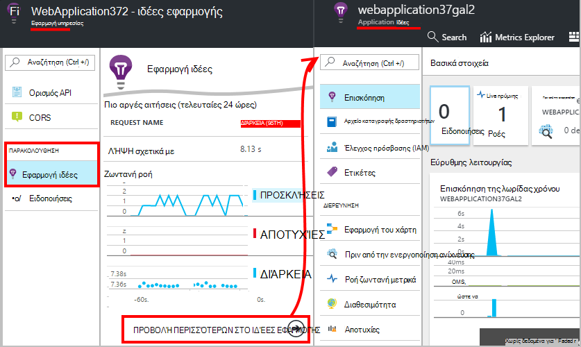
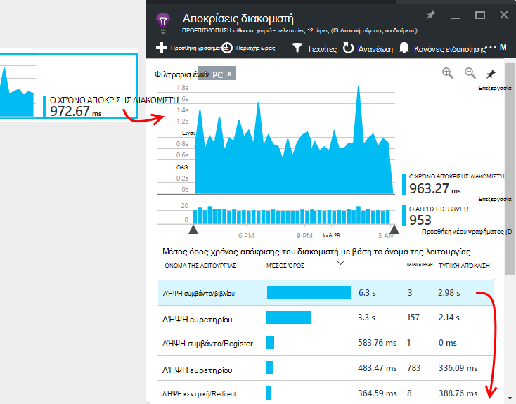
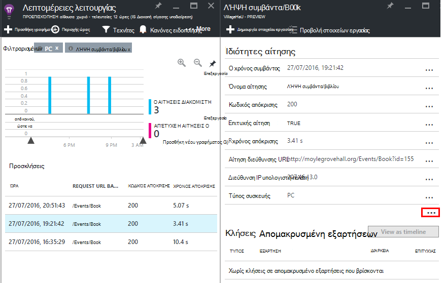

<properties
    pageTitle="Παρακολούθηση των επιδόσεων εφαρμογής Azure web | Microsoft Azure"
    description="Εφαρμογή παρακολούθησης επιδόσεων για εφαρμογές Azure web. Γράφημα φόρτωση και ο χρόνος απόκρισης, πληροφορίες για τις εξαρτήσεις και Ορισμός ειδοποιήσεων για την απόδοση."
    services="application-insights"
    documentationCenter=".net"
    authors="alancameronwills"
    manager="douge"/>

<tags
    ms.service="azure-portal"
    ms.workload="na"
    ms.tgt_pltfrm="na"
    ms.devlang="na"
    ms.topic="article"
    ms.date="10/24/2016"
    ms.author="awills"/>

# Παρακολούθηση των επιδόσεων του Azure web app

Στην [Πύλη του Azure](https://portal.azure.com) μπορείτε να ρυθμίσετε εφαρμογή Εποπτεία επιδόσεων για τις [εφαρμογές Azure web](../app-service-web/app-service-web-overview.md). [Visual Studio εφαρμογή ιδέες](app-insights-overview.md) μέσα την εφαρμογή σας για να στείλετε τηλεμετρίας σχετικά με τις δραστηριότητες με την υπηρεσία εφαρμογής ιδέες, όπου είναι αποθηκευμένο και ανάλυση. Εκεί, μετρικό γραφημάτων και εργαλεία αναζήτησης μπορεί να χρησιμοποιηθεί για να σας βοηθήσει διάγνωση θεμάτων και Βελτιώστε την απόδοση Αξιολογήστε χρήση.

## Χρόνος εκτέλεσης ή δημιουργήστε χρόνου

Μπορείτε να ρυθμίσετε την παρακολούθηση από instrumenting στην εφαρμογή με δύο τρόπους:

* **Χρόνου εκτέλεσης** - μπορείτε να επιλέξετε μια παρακολούθηση επέκταση κατά την εφαρμογή web της είναι ήδη ζωντανή των επιδόσεων. Δεν είναι απαραίτητο να δημιουργήσετε εκ νέου ή να εγκαταστήσετε ξανά την εφαρμογή σας. Λαμβάνετε ένα βασικό σύνολο πακέτων που παρακολουθούν το χρόνο απόκρισης, συντελεστές επιτυχίας, εξαιρέσεις, εξαρτήσεις και ούτω καθεξής. 
 
* **Δημιουργία χρόνου** - μπορείτε να εγκαταστήσετε ένα πακέτο με την εφαρμογή σας στην ανάπτυξη. Αυτή η επιλογή είναι πιο ευέλικτο. Εκτός από την ίδια τυπική πακέτα, μπορείτε να συντάξετε κώδικα για να προσαρμόσετε το τηλεμετρίας ή για να στείλετε τη δική σας τηλεμετρίας. Μπορείτε να συνδεθείτε συγκεκριμένες δραστηριότητες ή εγγραφή συμβάντα σύμφωνα με τη σημασιολογία του τομέα σας εφαρμογή. 

## Εκτέλεση οργάνων χρόνου με ιδέες εφαρμογής

Εάν χρησιμοποιείτε ήδη μια εφαρμογή web στο Azure, λαμβάνετε ήδη ορισμένες παρακολούθηση: αίτηση και σφάλματος χρεώσεις. Προσθήκη εφαρμογής ιδέες για να λάβετε περισσότερες πληροφορίες, όπως το χρόνο απόκρισης, παρακολούθηση κλήσεων με τις εξαρτήσεις, έξυπνη εντοπισμού και την ισχυρή ανάλυση ερωτήματος γλώσσας. 

1. **Επιλέξτε εφαρμογή ιδέες** στον πίνακα ελέγχου Azure για την εφαρμογή web σας.

    

 * Επιλέξτε για να δημιουργήσετε ένα νέο πόρο, εκτός αν ήδη ορίσει έναν πόρο εφαρμογής ιδέες για αυτήν την εφαρμογή από μια άλλη δρομολόγηση.

2. **Instrument την εφαρμογή web** μετά την εγκατάσταση της εφαρμογής ιδέες. 

    

3. **Οθόνη της εφαρμογής σας**.  [Expore τα δεδομένα](#explore-the-data).

Αργότερα, μπορείτε να δημιουργήσετε και να αναπτύξετε ξανά την εφαρμογή με εφαρμογή ιδέες, εάν θέλετε.

*Πώς να καταργήσετε ιδέες εφαρμογής, ή μεταβείτε στην αποστολή σε άλλον πόρο;*

* Στο Azure, ανοίξτε το blade ελέγχου εφαρμογής web και, στην περιοχή εργαλεία ανάπτυξης, ανοίξτε **επεκτάσεις**. Διαγράψτε την επέκταση εφαρμογής ιδέες. Στη συνέχεια, στην περιοχή παρακολούθηση, επιλέξτε εφαρμογή ιδέες και δημιουργήστε ή επιλέξτε τον πόρο που θέλετε.

## Δημιουργήστε την εφαρμογή με ιδέες εφαρμογής

Εφαρμογή ιδέες μπορούν να παρέχουν πιο λεπτομερείς τηλεμετρίας μέσω της εγκατάστασης ενός SDK στην εφαρμογή σας. Συγκεκριμένα, μπορείτε να συλλογής αρχεία καταγραφής ανίχνευσης, [Γράψτε προσαρμοσμένο τηλεμετρίας](../application-insights/app-insights-api-custom-events-metrics.md), και να λάβετε πιο λεπτομερείς αναφορές εξαίρεσης.

1. **Στο Visual Studio** (ενημέρωση 2013 2 ή νεότερες εκδόσεις), προσθέστε SDK ιδέες για την εφαρμογή στο έργο σας.

    

    Εάν σας ζητηθεί να εισέλθετε, χρησιμοποιήστε τα διαπιστευτήρια για το λογαριασμό σας Azure.

    Η λειτουργία έχει δύο εφέ:

 1. Δημιουργεί έναν πόρο εφαρμογής ιδέες Azure, όπου τηλεμετρίας αποθηκεύονται, ανάλυση και εμφανίζονται.
 2. Προσθέτει το πακέτο εφαρμογών NuGet ιδέες σας κώδικα και ρυθμίζει τις παραμέτρους για να στείλετε τηλεμετρίας στον πόρο Azure.

2. **Δοκιμή του τηλεμετρίας** με την εκτέλεση της εφαρμογής στον υπολογιστή σας ανάπτυξης (F5).

3. **Δημοσίευση της εφαρμογής** για να Azure με τον συνήθη τρόπο. 

*Πώς μπορώ να αλλάξω για να στείλετε σε έναν άλλο πόρο ιδέες εφαρμογή;*

* Στο Visual Studio, κάντε δεξί κλικ στο έργο, επιλέξτε **ιδέες εφαρμογής > Ρύθμιση παραμέτρων** και επιλέξτε τον πόρο που θέλετε. Μπορείτε να λάβετε την επιλογή για να δημιουργήσετε ένα νέο πόρο. Εκ νέου δημιουργία και αναπτύξτε ξανά.

## Εξερεύνηση των δεδομένων

1. Στη το blade ιδέες εφαρμογής από τον πίνακα ελέγχου του web app, μπορείτε να δείτε Live μετρικά που εμφανίζει αιτήσεις και αποτυχίες μέσα σε δευτερόλεπτα ή δύο από αυτές που μεσολαβούν. Είναι πολύ χρήσιμο εμφάνισης όταν Αναδημοσίευση της εφαρμογής σας - μπορείτε να δείτε αμέσως τυχόν προβλήματα.

2. Κάντε κλικ στις στον πόρο πλήρους εφαρμογής ιδέες.

    
    

    Μπορείτε επίσης να μεταβείτε εκεί είτε απευθείας από την περιήγηση Azure πόρων.

2. Κάντε κλικ σε οποιοδήποτε γράφημα για να δείτε περισσότερες λεπτομέρειες:

    

    Μπορείτε να [προσαρμόσετε λεπίδες μετρήσεις](../application-insights/app-insights-metrics-explorer.md).

3. Κάντε κλικ στις μετά δείτε: μεμονωμένα συμβάντα και τις ιδιότητές τους:

    

    Παρατηρήστε ότι το "..." σύνδεση για να ανοίξετε όλες τις ιδιότητες.

    Μπορείτε να [προσαρμόσετε αναζητήσεις](../application-insights/app-insights-diagnostic-search.md).

Για πιο ισχυρή αναζητήσεις πάνω από το τηλεμετρίας, χρησιμοποιήστε τη [γλώσσα ερωτήματος ανάλυσης](../application-insights/app-insights-analytics-tour.md).

## Επόμενα βήματα

* [Ενεργοποίηση Azure Διαγνωστικά](app-insights-azure-diagnostics.md) σε εφαρμογή ιδέες.
* [Οθόνη μετρικά εύρυθμης λειτουργίας υπηρεσίας](../monitoring-and-diagnostics/insights-how-to-customize-monitoring.md) για να βεβαιωθείτε ότι η υπηρεσία σας είναι διαθέσιμο και αποκρίνεται.
* [Λήψη ειδοποίησης ειδοποιήσεις](../monitoring-and-diagnostics/insights-receive-alert-notifications.md) κάθε φορά που συμβαίνουν λειτουργικές συμβάντα ή μετρικά cross μια οριακή τιμή.
* Χρήση [Εφαρμογής ιδέες για εφαρμογές JavaScript και τις σελίδες web](app-insights-web-track-usage.md) για τη λήψη τηλεμετρίας προγράμματος-πελάτη από τα προγράμματα περιήγησης που επισκεφθείτε την ιστοσελίδα.
* [Ρύθμιση διαθεσιμότητα web δοκιμές](app-insights-monitor-web-app-availability.md) για να λαμβάνετε ειδοποιήσεις εάν η τοποθεσία σας είναι προς τα κάτω.
