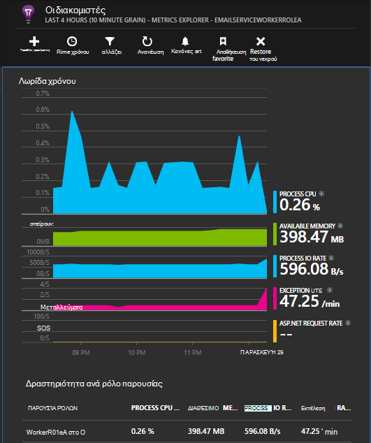

<properties
   pageTitle="Εφαρμογή ιδέες για τις υπηρεσίες Azure Cloud"
   description="Παρακολούθηση ρόλους σας web και εργαζόμενου αποτελεσματικά με ιδέες εφαρμογής"
   services="application-insights"
   documentationCenter=""
   authors="soubhagyadash"
   manager="douge"
   editor="alancameronwills"/>

<tags
   ms.service="application-insights"
   ms.devlang="na"
   ms.tgt_pltfrm="ibiza"
   ms.topic="article"
   ms.workload="tbd"
   ms.date="03/02/2016"
   ms.author="sdash"/>

# <a name="application-insights-for-azure-cloud-services"></a>Εφαρμογή ιδέες για τις υπηρεσίες Azure Cloud


*Εφαρμογή ιδέες είναι σε προεπισκόπηση*

[Εφαρμογές υπηρεσίας Microsoft Azure Cloud](https://azure.microsoft.com/services/cloud-services/) μπορεί να παρακολουθείται από [Ιδέες εφαρμογή του Visual Studio] [ start] για διαθεσιμότητα, απόδοση, αποτυχίες και χρήση. Με τα σχόλια που λαμβάνετε σχετικά με τις επιδόσεις και την αποτελεσματικότητα της εφαρμογής από το φυσικό περιβάλλον, μπορείτε να κάνετε επιλογές ενήμεροι σχετικά με την κατεύθυνση της σχεδίασης σε κάθε κύκλος ζωής ανάπτυξης.


Θα χρειαστείτε μια συνδρομή με το [Windows Azure](http://azure.com). Πραγματοποιήστε είσοδο με ένα λογαριασμό Microsoft, ο οποίος μπορεί να έχετε για Windows, XBox Live ή άλλες υπηρεσίες cloud της Microsoft. 


#### <a name="sample-application-instrumented-with-application-insights"></a>Δείγμα εφαρμογής όργανα, με εφαρμογή ιδέες

Ρίξτε μια ματιά στο [δείγμα εφαρμογής](https://github.com/Microsoft/ApplicationInsights-Home/tree/master/Samples/AzureEmailService) στην οποία προστίθεται ιδέες εφαρμογής σε μια υπηρεσία cloud με δύο ρόλους εργαζόμενου σε Azure. 

Τι ακολουθεί θα δείτε πώς μπορείτε να προσαρμόσετε το δικό σας έργο υπηρεσία cloud με τον ίδιο τρόπο.

## <a name="create-an-application-insights-resource-for-each-role"></a>Δημιουργία μιας εφαρμογής ιδέες πόρων για κάθε ρόλο

Ένας πόρος ιδέες εφαρμογής είναι όπου θα αναλυθεί και θα εμφανιστούν τα δεδομένα τηλεμετρίας σας.  

1.  Στην [πύλη του Azure][portal], δημιουργήστε ένα νέο πόρο εφαρμογής ιδέες. Για τον τύπο εφαρμογής, επιλέξτε εφαρμογή ASP.NET. 

    

2.  Λήψη αντιγράφου του αριθμού-κλειδιού οργάνων. Θα χρειαστεί λίγο για να ρυθμίσετε τις παραμέτρους του SDK.

    


Συνήθως, είναι [καλύτερα να δημιουργήσετε έναν νέο πόρο για τα δεδομένα από κάθε ρόλο web και εργασίας](app-insights-separate-resources.md). 

Ως εναλλακτική λύση, μπορείτε να αποστολή δεδομένων από όλους τους ρόλους σε ένα μόνο πόρο, αλλά να ορίσετε μια [προεπιλεγμένη ιδιότητα] [ apidefaults] ώστε να μπορείτε να φιλτράρετε ή να ομαδοποιήσετε τα αποτελέσματα από κάθε ρόλο.

## <a name="sdk"></a>Εγκατάσταση του SDK σε κάθε έργο


1. Στο Visual Studio, επεξεργαστείτε τα πακέτα NuGet του έργου σας εφαρμογή cloud.

    


2. Για να τους ρόλους web, προσθέστε το πακέτο NuGet [Εφαρμογή ιδέες για το Web](http://www.nuget.org/packages/Microsoft.ApplicationInsights.Web) . Αυτή η έκδοση του SDK περιλαμβάνει λειτουργικές μονάδες που προσθέσετε περιβάλλον διακομιστή όπως πληροφοριών του ρόλου. Για ρόλους εργασίας, χρησιμοποιήστε [Ιδέες για το Windows διακομιστές εφαρμογών](https://www.nuget.org/packages/Microsoft.ApplicationInsights.WindowsServer/).

    


3. Ρυθμίστε τις παραμέτρους του SDK για την αποστολή δεδομένων στον πόρο εφαρμογής ιδέες.

    Ορίστε τον αριθμό-κλειδί οργάνων ως μια ρύθμιση παραμέτρων του αρχείου `ServiceConfiguration.Cloud.cscfg`. ([Δείγμα κώδικα](https://github.com/Microsoft/ApplicationInsights-Home/blob/master/Samples/AzureEmailService/AzureEmailService/ServiceConfiguration.Cloud.cscfg)).
 
    ```XML
     <Role name="WorkerRoleA"> 
      <Setting name="APPINSIGHTS_INSTRUMENTATIONKEY" value="YOUR IKEY" /> 
     </Role>
    ```
 
    Σε μια συνάρτηση κατάλληλο εκκίνησης, ορίστε τον αριθμό-κλειδί οργάνων από τη ρύθμιση παραμέτρων:

    ```C#
     TelemetryConfiguration.Active.InstrumentationKey = RoleEnvironment.GetConfigurationSettingValue("APPINSIGHTS_INSTRUMENTATIONKEY");
    ```

    Σημείωση, το ίδιο όνομα `APPINSIGHTS_INSTRUMENTATIONKEY` της ρύθμισης παραμέτρων ρύθμιση θα χρησιμοποιηθεί από Azure Διαγνωστικά αναφοράς. 


    Κάντε τα εξής για κάθε ρόλο στην εφαρμογή σας. Δείτε τα παραδείγματα:
 
 * [Ρόλος Web](https://github.com/Microsoft/ApplicationInsights-Home/blob/master/Samples/AzureEmailService/MvcWebRole/Global.asax.cs#L27)
 * [Ρόλος εργαζόμενου](https://github.com/Microsoft/ApplicationInsights-Home/blob/master/Samples/AzureEmailService/WorkerRoleA/WorkerRoleA.cs#L232)
 * [Για τις ιστοσελίδες](https://github.com/Microsoft/ApplicationInsights-Home/blob/master/Samples/AzureEmailService/MvcWebRole/Views/Shared/_Layout.cshtml#L13)   

4. Ορίστε το αρχείο ApplicationInsights.config να αντιγραφούν πάντα στον κατάλογο εξόδου. 

    (Στο αρχείο .config, θα δείτε τα μηνύματα που σας ζητά να τοποθετήσετε τον αριθμό-κλειδί οργάνων εκεί. Ωστόσο, για τις εφαρμογές του cloud είναι καλύτερα να τη ρυθμίσετε από το αρχείο .cscfg. Αυτό εξασφαλίζει ότι ο ρόλος αναγνωρίζεται σωστά στην πύλη του.)


#### <a name="run-and-publish-the-app"></a>Εκτέλεση και δημοσίευση της εφαρμογής

Εκτελέστε την εφαρμογή και πραγματοποιήστε είσοδο στο Azure. Ανοίξτε τους πόρους ιδέες εφαρμογής που δημιουργήσατε και θα δείτε μεμονωμένα σημεία δεδομένων που εμφανίζονται στο πλαίσιο [Αναζήτηση](app-insights-diagnostic-search.md)και, τα Συγκεντρωτικά στοιχεία στην [Εξερεύνηση μετρικό σύστημα](app-insights-metrics-explorer.md). 

Προσθέστε περισσότερες τηλεμετρίας - ανατρέξτε στις ενότητες παρακάτω - και, στη συνέχεια, να δημοσιεύσετε την εφαρμογή σας για να λάβετε ζωντανή diagnostic και η χρήση σχολίων. 


#### <a name="no-data"></a>Δεν υπάρχουν δεδομένα;

* Ανοίξτε την [Αναζήτηση] [ diagnostic] πλακίδιο, για να δείτε επιμέρους συμβάντα.
* Χρησιμοποιήστε την εφαρμογή, Άνοιγμα διαφορετικές σελίδες, έτσι ώστε να δημιουργεί ορισμένες τηλεμετρίας.
* Περιμένετε μερικά δευτερόλεπτα και κάντε κλικ στην επιλογή Ανανέωση.
* Ανατρέξτε στο θέμα [Αντιμετώπιση προβλημάτων][qna].


## <a name="more-telemetry"></a>Περισσότερες τηλεμετρίας

Οι παρακάτω ενότητες δείχνουν πώς μπορείτε να λάβετε επιπλέον τηλεμετρίας από διαφορετικές πτυχές της εφαρμογής σας.


## <a name="track-requests-from-worker-roles"></a>Παρακολουθήστε αιτήσεις από τους ρόλους εργαζόμενου

Σε ρόλους web, τη λειτουργική μονάδα αιτήσεις συλλέγει αυτόματα δεδομένα σχετικά με τις αιτήσεις HTTP. Ανατρέξτε στο θέμα το [δείγμα MVCWebRole](https://github.com/Microsoft/ApplicationInsights-Home/tree/master/Samples/AzureEmailService/MvcWebRole) για παραδείγματα πώς μπορείτε να παρακάμψετε την προεπιλεγμένη συμπεριφορά συλλογής. 

Μπορείτε να καταγράψετε τις επιδόσεις των κλήσεων σε ρόλους εργαζόμενου παρακολούθησης τους με τον ίδιο τρόπο ως αιτήσεις HTTP. Στην εφαρμογή ιδέες, ο τύπος τηλεμετρίας αίτηση μέτρα μια μονάδα εργασίας πλευρά του διακομιστή με όνομα που μπορεί να είναι το χρονικό όριο και να ανεξάρτητη επιτύχει ή να αποτύχει. Ενώ οι αιτήσεις HTTP καταγράψει αυτόματα από το SDK, μπορείτε να εισαγάγετε το δικό σας κώδικα για την παρακολούθηση προσκλήσεων σε ρόλους εργασίας.

Ανατρέξτε στο θέμα τους δύο ρόλους εργαζόμενου δείγμα όργανα, σε αιτήσεις αναφορών: [WorkerRoleA](https://github.com/Microsoft/ApplicationInsights-Home/tree/master/Samples/AzureEmailService/WorkerRoleA) και [WorkerRoleB](https://github.com/Microsoft/ApplicationInsights-Home/tree/master/Samples/AzureEmailService/WorkerRoleB)

## <a name="azure-diagnostics"></a>Διαγνωστικά του Azure

[Διαγνωστικά Azure](../vs-azure-tools-diagnostics-for-cloud-services-and-virtual-machines.md) δεδομένων περιλαμβάνει ρόλων διαχείρισης συμβάντων, μετρητές επιδόσεων και αρχεία καταγραφής εφαρμογών. Μπορείτε να έχετε αυτών των απεσταλμένων σε εφαρμογή ιδέες, ώστε να μπορείτε να δείτε τους μαζί με τα υπόλοιπα σας τηλεμετρίας, διευκολύνοντας την διάγνωση θεμάτων.

Διαγνωστικά του Azure είναι ιδιαίτερα χρήσιμα εάν ένα ρόλο αποτυγχάνει απροσδόκητα ή δεν μπορεί να ξεκινήσει.

1. Κάντε δεξί κλικ στο ρόλο (μην το έργο!) για να ανοίξετε τις ιδιότητές του και επιλέξτε **Ενεργοποίηση Διαγνωστικά**, **Αποστολή διαγνωστικών για ιδέες εφαρμογής**.

    

    **Ή εάν είναι ήδη δημοσιευμένο και εκτελείται η εφαρμογή σας**, Άνοιγμα Εξερεύνηση Server ή Cloud Explorer, κάντε δεξί κλικ την εφαρμογή σας και επιλέξτε την ίδια επιλογή.

3.  Επιλέξτε τον ίδιο πόρο εφαρμογής ιδέες σας άλλες τηλεμετρίας.

    Εάν θέλετε, μπορείτε να ορίσετε διαφορετικό πόρο σε διαφορετική υπηρεσία ρυθμίσεις παραμέτρων (Cloud, τοπική) για να διατηρήσετε τα δεδομένα στην ανάπτυξη ξεχωριστά από δεδομένα πραγματικού χρόνου.

3. Προαιρετικά, [εξαίρεση ορισμένα από τα Διαγνωστικά του Azure](app-insights-azure-diagnostics.md) που θέλετε να προωθούνται στην εφαρμογή ιδέες. Η προεπιλογή είναι όλα τα στοιχεία.

### <a name="view-azure-diagnostic-events"></a>Προβολή Azure διαγνωστικών συμβάντων

Πού θα βρείτε τα Διαγνωστικά του:

* Μετρητές επιδόσεων εμφανίζονται ως προσαρμοσμένο μετρήσεις. 
* Αρχεία καταγραφής συμβάντων των Windows εμφανίζονται ως ανιχνεύσεις και τα προσαρμοσμένα συμβάντα.
* Αρχεία καταγραφής από την εφαρμογή, αρχεία καταγραφής ETW και οποιαδήποτε αρχεία καταγραφής διαγνωστικών υποδομή εμφανίζονται ως ανιχνεύσεις.

Για να δείτε μετρητές επιδόσεων και το πλήθος των συμβάντων, ανοίξτε την [Εξερεύνηση μετρικά](app-insights-metrics-explorer.md) και προσθέστε ένα νέο γράφημα:


Χρήση της [αναζήτησης](app-insights-diagnostic-search.md) για αναζήτηση σε αποστέλλονται από Azure Διαγνωστικά τα διάφορα αρχεία καταγραφής ανίχνευσης. Για παράδειγμα, εάν είχατε μια εξαίρεση unhanded σε ένα ρόλο που προκάλεσαν το ρόλο για να παρουσιάσει σφάλμα και Κάδος Ανακύκλωσης, ότι πληροφορίες θα εμφανίζονται στην εφαρμογή του καναλιού του καταγραφή συμβάντων των Windows. Μπορείτε να χρησιμοποιήσετε τη λειτουργία αναζήτησης για να κοιτάξετε το αρχείο καταγραφής συμβάντων των Windows σφάλμα και να λάβετε την ανίχνευση πλήρη στοίβα για την εξαίρεση που μπορείτε να βρείτε την αρχική αιτία του ζητήματος.


## <a name="app-diagnostics"></a>Διαγνωστικά εφαρμογής

Διαγνωστικά του Azure περιλαμβάνει αυτόματα εγγραφές καταγραφής που δημιουργείται από την εφαρμογή σας με χρήση System.Diagnostics.Trace. 

Εάν χρησιμοποιείτε ήδη τα πλαίσια Log4N ή NLog, μπορείτε επίσης να [καταγράψετε τις ανιχνεύσεις καταγραφής], αλλά[netlogs].

[Παρακολούθηση προσαρμοσμένων συμβάντων και μετρήσεις] [ api] στο πρόγραμμα-πελάτη ή διακομιστή ή και τα δύο, για να μάθετε περισσότερα σχετικά με τις επιδόσεις και η χρήση της εφαρμογής σας.

## <a name="dependencies"></a>Εξαρτήσεις

Εφαρμογή ιδέες SDK μπορούν να αναφέρουν κλήσεις που κάνει την εφαρμογή σας σε εξωτερικές εξαρτήσεις όπως REST API και διακομιστές SQL. Αυτό σας επιτρέπει να δείτε εάν μια συγκεκριμένη εξάρτηση προκαλεί αργές αποκρίσεις ή αποτυχίες.

Εάν η εφαρμογή σας χρησιμοποιεί το .NET framework 4.6 ή νεότερη έκδοση, δεν χρειάζεται να κάνετε κάτι άλλο. 

Διαφορετικά, ρυθμίστε το ρόλο web/εργαζόμενου με τον [Παράγοντα ιδέες εφαρμογή](app-insights-monitor-performance-live-website-now.md) γνωστό και ως "Εποπτεία κατάστασης".

Για να χρησιμοποιήσετε τον παράγοντα ιδέες εφαρμογή με το web/εργαζόμενου ρόλους:

* Προσθέστε το φάκελο [AppInsightsAgent](https://github.com/Microsoft/ApplicationInsights-Home/tree/master/Samples/AzureEmailService/WorkerRoleA/AppInsightsAgent) και τα δύο αρχεία σε αυτό για να τα έργα σας web/εργαζόμενου ρόλο. Φροντίστε να ορίσετε τις ιδιότητές τους Δόμηση ώστε να αντιγράφονται πάντα στον κατάλογο εξόδου. Αυτά τα αρχεία εγκαταστήσει τον παράγοντα.
* Προσθέστε την έναρξη εργασία στο αρχείο CSDEF όπως φαίνεται [εδώ](https://github.com/Microsoft/ApplicationInsights-Home/tree/master/Samples/AzureEmailService/AzureEmailService/ServiceDefinition.csdef#L18).
* ΣΗΜΕΊΩΣΗ: *Ρόλους εργαζόμενου* απαιτούν τρεις μεταβλητές περιβάλλοντος όπως φαίνεται [εδώ](https://github.com/Microsoft/ApplicationInsights-Home/tree/master/Samples/AzureEmailService/AzureEmailService/ServiceDefinition.csdef#L44). Αυτό δεν είναι απαραίτητη για το web ρόλοι.

### <a name="dependency-reports"></a>Εξάρτηση αναφορών

Ακολουθεί ένα παράδειγμα του τι βλέπετε στην πύλη ιδέες εφαρμογής:

* Εμπλουτισμένο Διαγνωστικά με αυτόματα συσχετισμένης αιτήσεις και εξαρτήσεις:

    

* Επιδόσεις του ρόλου web, με πληροφορίες για τις εξαρτήσεις:

    

* Ακολουθεί ένα στιγμιότυπο οθόνης σε αιτήσεις και πληροφορίες για τις εξαρτήσεις για ένα ρόλο εργασίας:

    

## <a name="exceptions"></a>Εξαιρέσεις

Για πληροφορίες σχετικά με το πώς μπορείτε να συλλέξετε ανεπίλυτη εξαιρέσεις από το web διαφορετικούς τύπους εφαρμογών, ανατρέξτε στο θέμα [Παρακολούθηση εξαιρέσεις σε εφαρμογή ιδέες](app-insights-asp-net-exceptions.md) .

Ο ρόλος web δείγμα έχει ελεγκτές MVC5 και Web API 2. Καταγραφή των ανεπίλυτη εξαίρεση από το 2 με τα εξής:

* [AiHandleErrorAttribute](https://github.com/Microsoft/ApplicationInsights-Home/blob/master/Samples/AzureEmailService/MvcWebRole/Telemetry/AiHandleErrorAttribute.cs) ρύθμιση [εδώ](https://github.com/Microsoft/ApplicationInsights-Home/blob/master/Samples/AzureEmailService/MvcWebRole/App_Start/FilterConfig.cs#L12) για ελεγκτές MVC5
* [AiWebApiExceptionLogger](https://github.com/Microsoft/ApplicationInsights-Home/blob/master/Samples/AzureEmailService/MvcWebRole/Telemetry/AiWebApiExceptionLogger.cs) ρύθμιση [εδώ](https://github.com/Microsoft/ApplicationInsights-Home/blob/master/Samples/AzureEmailService/MvcWebRole/App_Start/WebApiConfig.cs#L25) για ελεγκτές Web API 2

Για ρόλους εργαζόμενου, υπάρχουν δύο τρόποι για να παρακολουθείτε εξαιρέσεις.

* TrackException(ex)
* Εάν έχετε προσθέσει το πακέτο εφαρμογών ιδέες ανίχνευση ακρόασης NuGet, μπορείτε να χρησιμοποιήσετε System.Diagnostics.Trace για να συνδεθείτε εξαιρέσεις. [Παράδειγμα κώδικα.](https://github.com/Microsoft/ApplicationInsights-Home/blob/master/Samples/AzureEmailService/WorkerRoleA/WorkerRoleA.cs#L107)

## <a name="performance-counters"></a>Μετρητές επιδόσεων

Οι παρακάτω μετρητές συλλέγονται από προεπιλογή:

    * \Process(??APP_WIN32_PROC??)\% χρόνου επεξεργαστή
    * Byte που \Memory\Available
    * \.Exceptions(??APP_CLR_PROC??) CLR Καθαρής\# της Exceps δημιουργήθηκε / δευτ.
    * \Process (??. APP_WIN32_PROC??) Byte που \Private
    * \Process (??. APP_WIN32_PROC??) \IO δεδομένων byte/δευτερόλεπτο
    * \Processor(_Total)\% χρόνου επεξεργαστή

Επιπλέον, τα παρακάτω είναι επίσης συλλέγονται για ρόλους web:

    * \ASP.NET εφαρμογές (??. APP_W3SVC_PROC??) \Requests/sec    
    * \ASP.NET εφαρμογές (??. APP_W3SVC_PROC??) Χρόνος εκτέλεσης \Request
    * \ASP.NET εφαρμογές (??. APP_W3SVC_PROC??) \Requests στην ουρά εφαρμογής

Μπορείτε να καθορίσετε επιπλέον προσαρμοσμένα ή άλλες μετρητών επιδόσεων των windows, όπως φαίνεται [εδώ](https://github.com/Microsoft/ApplicationInsights-Home/blob/master/Samples/AzureEmailService/WorkerRoleA/ApplicationInsights.config#L14)

  

## <a name="correlated-telemetry-for-worker-roles"></a>Συσχετισμένης Τηλεμετρίας για ρόλους εργαζόμενου

Είναι μια πλούσια εμπειρία διαγνωστικών, όταν μπορείτε να δείτε τι οδήγησε σε μια αίτηση αποτυχίας ή υψηλό λανθάνοντα χρόνο. Με τους ρόλους web, το SDK ορίζει αυτόματα συσχέτισης μεταξύ σχετικών τηλεμετρίας. Για ρόλους εργασίας, μπορείτε να χρησιμοποιήσετε ένα προσαρμοσμένο τηλεμετρίας προετοιμασίας για να ορίσετε ένα κοινό χαρακτηριστικό περιβάλλοντος Operation.Id για όλα τα τηλεμετρίας να επιτύχετε το εξής. Αυτό θα σας επιτρέψει να δείτε εάν το ζήτημα λανθάνων χρόνος/αποτυχία προκλήθηκε λόγω εξάρτησης ή τον κωδικό σας, με μια ματιά! 

Δείτε πώς:

* Ορίστε το αναγνωριστικό συσχέτισης σε μια CallContext όπως φαίνεται [εδώ](https://github.com/Microsoft/ApplicationInsights-Home/blob/master/Samples/AzureEmailService/WorkerRoleA/WorkerRoleA.cs#L36). Σε αυτήν την περίπτωση, χρησιμοποιούμε το Αναγνωριστικό αίτηση όπως το αναγνωριστικό συσχέτισης
* Προσθέστε μια προσαρμοσμένη υλοποίηση TelemetryInitializer, που θα ορίσετε το Operation.Id για το correlationId συνόλου παραπάνω. Φαίνεται εδώ: [ItemCorrelationTelemetryInitializer](https://github.com/Microsoft/ApplicationInsights-Home/blob/master/Samples/AzureEmailService/WorkerRoleA/Telemetry/ItemCorrelationTelemetryInitializer.cs#L13)
* Προσθέστε το προσαρμοσμένο τηλεμετρίας προετοιμασίας. Μπορείτε θα μπορούσε να το κάνετε στο αρχείο ApplicationInsights.config ή σε κώδικα όπως φαίνεται [εδώ](https://github.com/Microsoft/ApplicationInsights-Home/blob/master/Samples/AzureEmailService/WorkerRoleA/WorkerRoleA.cs#L233)

Αυτό είναι! Η εμπειρία πύλης είναι ήδη ενσύρματο προς τα επάνω για να σας βοηθήσει να δείτε όλες τις συσχετισμένες τηλεμετρίας με μια ματιά:


## <a name="client-telemetry"></a>Τηλεμετρίας προγράμματος-πελάτη

[Προσθήκη του SDK JavaScript σε σελίδες web] [ client] για να τηλεμετρίας όπως καταμετρά προβολή σελίδας, τους χρόνους φόρτωσης σελίδων, εξαιρέσεις δέσμης ενεργειών που βασίζονται σε πρόγραμμα περιήγησης και για να επιτρέψετε σε σύνταξη προσαρμοσμένου τηλεμετρίας σε δέσμες ενεργειών σας σελίδα.

## <a name="availability-tests"></a>Διαθεσιμότητα δοκιμές

[Ρύθμιση του web δοκιμές] [ availability] για να βεβαιωθείτε ότι η εφαρμογή σας παραμένει ζωντανή και αποκρίνεται.


## <a name="example"></a>Παράδειγμα

[Το παράδειγμα](https://github.com/Microsoft/ApplicationInsights-Home/tree/master/Samples/AzureEmailService) παρακολουθεί μια υπηρεσία που έχει ένα ρόλο web και δύο ρόλους εργαζόμενου.

## <a name="exception-method-not-found-on-running-in-azure-cloud-services"></a>Εξαίρεση "δεν βρέθηκε η μέθοδος" σχετικά με την εκτέλεση στις υπηρεσίες Cloud Azure

Δημιουργείτε για .NET 4.6; 4.6 δεν υποστηρίζεται αυτόματα με τις υπηρεσίες Cloud Azure ρόλους. [Εγκατάσταση 4.6 σχετικά με κάθε ρόλο](../cloud-services/cloud-services-dotnet-install-dotnet.md) πριν από την εκτέλεση της εφαρμογής σας.

## <a name="related-topics"></a>Σχετικά θέματα

* [Ρύθμιση παραμέτρων στέλνει Διαγνωστικά Azure σε εφαρμογή ιδεών](app-insights-azure-diagnostics.md)
* [Χρήση του PowerShell για να στείλετε Azure Διαγνωστικά σε ιδέες εφαρμογής](app-insights-powershell-azure-diagnostics.md)


[api]: app-insights-api-custom-events-metrics.md
[apidefaults]: app-insights-api-custom-events-metrics.md#default-properties
[apidynamicikey]: app-insights-separate-resources.md#dynamic-ikey
[availability]: app-insights-monitor-web-app-availability.md
[azure]: app-insights-azure.md
[client]: app-insights-javascript.md
[diagnostic]: app-insights-diagnostic-search.md
[netlogs]: app-insights-asp-net-trace-logs.md
[portal]: http://portal.azure.com/
[qna]: app-insights-troubleshoot-faq.md
[redfield]: app-insights-monitor-performance-live-website-now.md
[start]: app-insights-overview.md 
