<properties 
    pageTitle="Αναλυτικές οδηγίες: εξαγωγή τηλεμετρίας σε βάση δεδομένων SQL από την εφαρμογή ιδέες" 
    description="Συνεχώς εξαγάγετε δεδομένα ιδέες εφαρμογή στο SQL χρησιμοποιώντας ροή ανάλυσης." 
    services="application-insights" 
    documentationCenter=""
    authors="noamben" 
    manager="douge"/>

<tags 
    ms.service="application-insights" 
    ms.workload="tbd" 
    ms.tgt_pltfrm="ibiza" 
    ms.devlang="na" 
    ms.topic="article" 
    ms.date="03/06/2015" 
    ms.author="awills"/>
 
# <a name="walkthrough-export-to-sql-from-application-insights-using-stream-analytics"></a>Αναλυτικές οδηγίες: Εξαγωγή σε SQL από την εφαρμογή ιδέες ροή αναλυτικών στοιχείων χρήσης

Αυτό το άρθρο περιγράφει πώς μπορείτε να μεταφέρετε τα δεδομένα σας τηλεμετρίας από το [Visual Studio εφαρμογή ιδέες] [ start] σε μια βάση δεδομένων Azure SQL με τη χρήση [Συνεχής εξαγωγή] [ export] και τις [Αναλύσεις ροή Azure](https://azure.microsoft.com/services/stream-analytics/). 

Συνεχής εξαγωγή μετακινεί τα δεδομένα σας τηλεμετρίας στο χώρο αποθήκευσης Azure σε μορφή JSON. Θα ανάλυση των αντικειμένων JSON χρησιμοποιώντας Azure ροή ανάλυση και δημιουργία γραμμών σε έναν πίνακα βάσης δεδομένων.

(Γενικότερα, λόγω των συνεχών εξαγωγή είναι ο τρόπος για να κάνετε τη δική σας ανάλυση της το τηλεμετρίας τις εφαρμογές σας Αποστολή σε εφαρμογή ιδέες. Που θα μπορούσε να το προσαρμόσετε αυτό το δείγμα κώδικα για να εκτελέσετε άλλες ενέργειες με το εξαγόμενο τηλεμετρίας, όπως άθροιση των δεδομένων.)

Ας ξεκινήσουμε με την προϋπόθεση ότι έχετε ήδη την εφαρμογή που θέλετε να παρακολουθείτε.


Σε αυτό το παράδειγμα, θα χρησιμοποιήσουμε τη σελίδα Προβολή δεδομένων, αλλά το ίδιο μοτίβο μπορεί εύκολα να επεκταθεί σε άλλους τύπους δεδομένων, όπως τα προσαρμοσμένα συμβάντα εξαιρέσεις. 


## <a name="add-application-insights-to-your-application"></a>Προσθήκη εφαρμογής ιδέες για την εφαρμογή σας


Για να ξεκινήσετε:

1. [Ρύθμιση εφαρμογής ιδέες για τις ιστοσελίδες σας](app-insights-javascript.md). 

    (Σε αυτό το παράδειγμα, θα σας θα εστίαση σε επεξεργασία σελίδας προβολή δεδομένων από τα προγράμματα περιήγησης του προγράμματος-πελάτη, αλλά μπορείτε επίσης μπορεί να ρυθμίσετε εφαρμογή ιδέες για την πλευρά του διακομιστή σας εφαρμογή [Java](app-insights-java-get-started.md) ή [ASP.NET](app-insights-asp-net.md) και διαδικασία αίτησης, εξάρτηση και άλλες τηλεμετρίας διακομιστή.)


5. Δημοσίευση της εφαρμογής σας και να παρακολουθήσετε δεδομένα τηλεμετρίας που εμφανίζεται στο τον πόρο εφαρμογής ιδέες.


## <a name="create-storage-in-azure"></a>Δημιουργία χώρου αποθήκευσης στο Azure

Συνεχής εξαγωγή πάντα εξάγει δεδομένα σε ένα λογαριασμό αποθήκευσης Azure, ώστε να πρέπει πρώτα να δημιουργήσετε το χώρο αποθήκευσης.

1. Δημιουργία λογαριασμού χώρου αποθήκευσης στη συνδρομή σας στην [πύλη του Azure][portal].

    

2. Δημιουργία κοντέινερ

    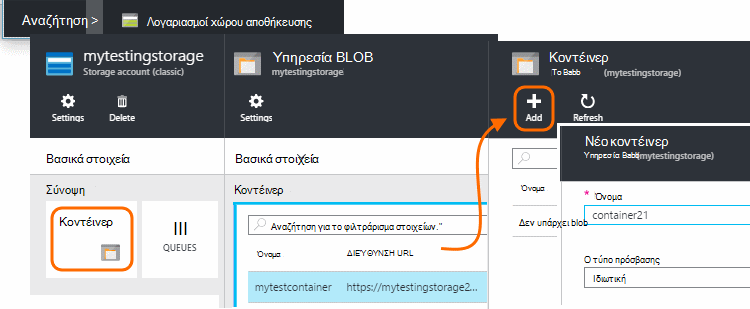

3. Αντιγράψτε το πλήκτρο πρόσβασης χώρου αποθήκευσης

    Θα χρειαστεί σύντομα για να ρυθμίσετε την είσοδο στην υπηρεσία ανάλυσης ροής.

    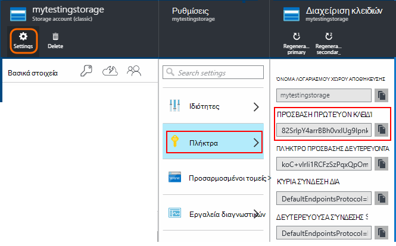

## <a name="start-continuous-export-to-azure-storage"></a>Έναρξη συνεχής εξαγωγή με το χώρο αποθήκευσης Azure

1. Στην πύλη του Azure, αναζητήστε τον πόρο ιδέες εφαρμογής που δημιουργήσατε για την εφαρμογή σας.

    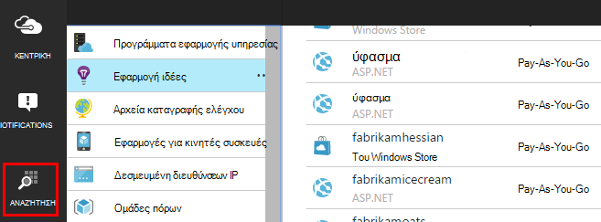

2. Δημιουργία μιας συνεχούς εξαγωγής.

    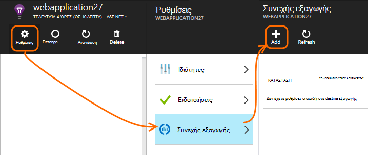


    Επιλέξτε το λογαριασμό χώρου αποθήκευσης που δημιουργήσατε νωρίτερα:

    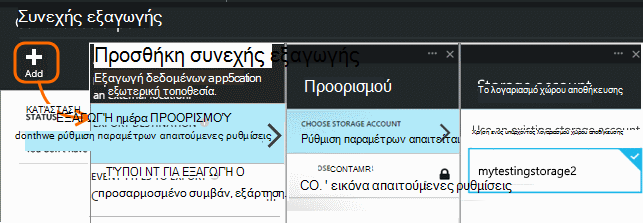
    
    Ορίστε τους τύπους συμβάντων που θέλετε να δείτε:

    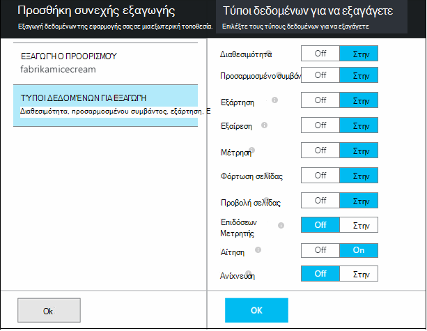


3. Ενημερώστε ορισμένες συγκεντρώσουν τα δεδομένα. Καθίσετε πίσω και να επιτρέψετε στους χρήστες να χρησιμοποιήσουν την εφαρμογή σας για κάποιο χρονικό διάστημα. Τηλεμετρίας να παραδίδεται και θα δείτε στατιστικών γραφημάτων στην [Εξερεύνηση των μετρικό](app-insights-metrics-explorer.md) και μεμονωμένα συμβάντα στο [διαγνωστικών αναζήτησης](app-insights-diagnostic-search.md). 

    Και, επίσης, θα εξαγάγετε τα δεδομένα για το χώρο αποθήκευσης. 

4. Έλεγχος τα εξαγόμενα δεδομένα, είτε στην πύλη του - επιλέξτε **Αναζήτηση**, επιλέξτε το λογαριασμό χώρου αποθήκευσης και, στη συνέχεια, **κοντέινερ** - ή στο Visual Studio. Στο Visual Studio, επιλέξτε **Προβολή / Cloud Explorer**, και ανοίξτε το Azure / χώρου αποθήκευσης. (Εάν δεν έχετε αυτήν την επιλογή μενού, πρέπει να εγκαταστήσετε το SDK Azure: Ανοίξτε το παράθυρο διαλόγου νέο έργο και ανοίξτε το Visual C# / Cloud / λήψη Microsoft Azure SDK για το .NET.)

    

    Σημειώστε το κοινό τμήμα του ονόματος της διαδρομής, που προέρχεται από το όνομα και οργάνων πλήκτρο εφαρμογής. 

Τα συμβάντα εγγράφονται αντικειμένων blob αρχεία σε μορφή JSON. Κάθε αρχείο μπορεί να περιέχει ένα ή περισσότερα συμβάντα. Επομένως, θα σας θα θέλατε να διαβάσει τα δεδομένα του συμβάντος και φιλτράρετε τα πεδία θέλουμε. Υπάρχουν όλοι οι τύποι πράγματα που θα μπορούσε να κάνουμε με τα δεδομένα, αλλά το σχεδίου σήμερα είναι να χρησιμοποιήσετε ανάλυση ροής για να μετακινήσετε τα δεδομένα σε μια βάση δεδομένων SQL. Που θα διευκολύνουν την εκτέλεση πολλές ενδιαφέρον ερωτημάτων.

## <a name="create-an-azure-sql-database"></a>Δημιουργήστε μια βάση δεδομένων SQL Azure

Πάλι ξεκινώντας από τη συνδρομή σας στην [πύλη Azure][portal], δημιουργήστε τη βάση δεδομένων (και ένα νέο διακομιστή, εκτός και εάν έχετε ήδη λάβει ένα) για την οποία θα εγγραφή των δεδομένων.

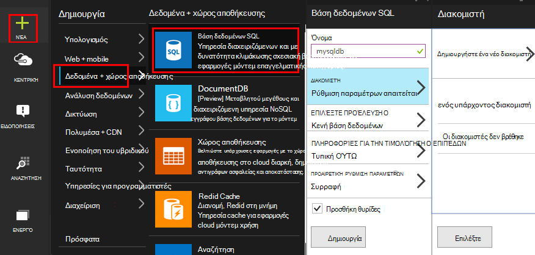


Βεβαιωθείτε ότι ο διακομιστής βάσης δεδομένων επιτρέπει την πρόσβαση σε υπηρεσίες Azure:


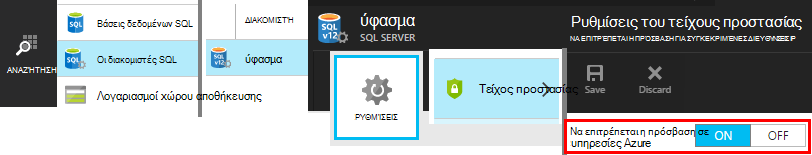

## <a name="create-a-table-in-azure-sql-db"></a>Δημιουργία πίνακα σε Azure SQL DB

Σύνδεση με τη βάση δεδομένων που δημιουργήσατε στην προηγούμενη ενότητα με το εργαλείο διαχείρισης προτιμώμενη. Σε αυτόν τον οδηγό, θα χρησιμοποιήσουμε [Εργαλεία διαχείρισης του SQL Server](https://msdn.microsoft.com/ms174173.aspx) (SSMS).

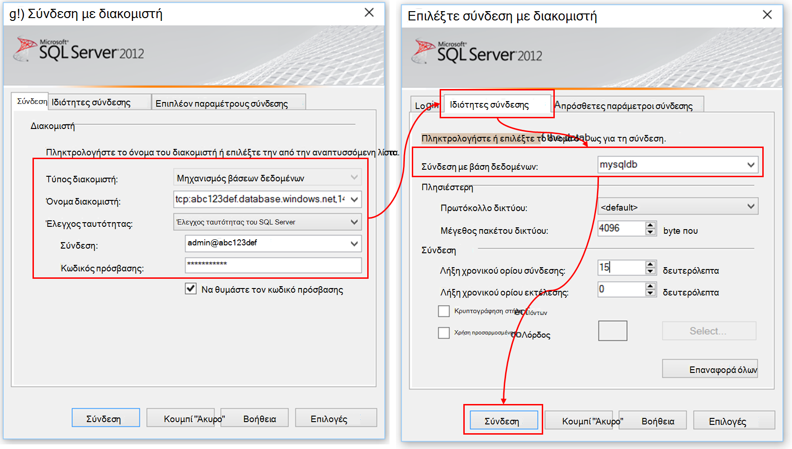

Δημιουργήστε ένα νέο ερώτημα και εκτελέστε το ακόλουθο T SQL:

```SQL

CREATE TABLE [dbo].[PageViewsTable](
    [pageName] [nvarchar](max) NOT NULL,
    [viewCount] [int] NOT NULL,
    [url] [nvarchar](max) NULL,
    [urlDataPort] [int] NULL,
    [urlDataprotocol] [nvarchar](50) NULL,
    [urlDataHost] [nvarchar](50) NULL,
    [urlDataBase] [nvarchar](50) NULL,
    [urlDataHashTag] [nvarchar](max) NULL,
    [eventTime] [datetime] NOT NULL,
    [isSynthetic] [nvarchar](50) NULL,
    [deviceId] [nvarchar](50) NULL,
    [deviceType] [nvarchar](50) NULL,
    [os] [nvarchar](50) NULL,
    [osVersion] [nvarchar](50) NULL,
    [locale] [nvarchar](50) NULL,
    [userAgent] [nvarchar](max) NULL,
    [browser] [nvarchar](50) NULL,
    [browserVersion] [nvarchar](50) NULL,
    [screenResolution] [nvarchar](50) NULL,
    [sessionId] [nvarchar](max) NULL,
    [sessionIsFirst] [nvarchar](50) NULL,
    [clientIp] [nvarchar](50) NULL,
    [continent] [nvarchar](50) NULL,
    [country] [nvarchar](50) NULL,
    [province] [nvarchar](50) NULL,
    [city] [nvarchar](50) NULL
)

CREATE CLUSTERED INDEX [pvTblIdx] ON [dbo].[PageViewsTable]
(
    [eventTime] ASC
)WITH (PAD_INDEX = OFF, STATISTICS_NORECOMPUTE = OFF, SORT_IN_TEMPDB = OFF, DROP_EXISTING = OFF, ONLINE = OFF, ALLOW_ROW_LOCKS = ON, ALLOW_PAGE_LOCKS = ON)

```

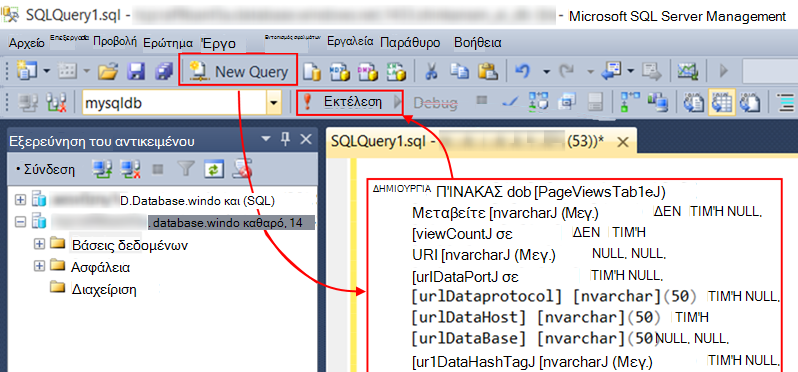

Σε αυτό το δείγμα, χρησιμοποιούμε τα δεδομένα από τη σελίδα προβολές. Για να δείτε τα άλλα διαθέσιμα στοιχεία, έλεγχος σας εξόδου JSON και δείτε την [Εξαγωγή μοντέλου δεδομένων](app-insights-export-data-model.md).

## <a name="create-an-azure-stream-analytics-instance"></a>Δημιουργήστε μια παρουσία ανάλυση ροή Azure

Από την [Πύλη κλασική Azure](https://manage.windowsazure.com/), επιλέξτε την υπηρεσία Azure ροή ανάλυση και δημιουργία νέας ανάλυσης ροής εργασίας:


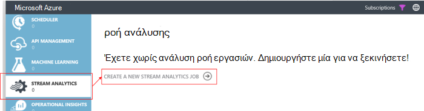


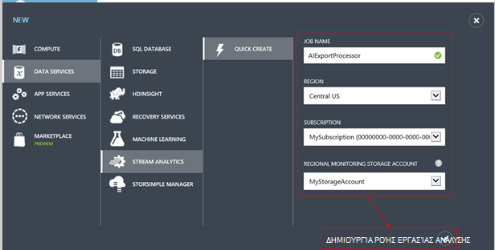

Όταν δημιουργείται το νέο έργο, αναπτύξτε τις λεπτομέρειες:

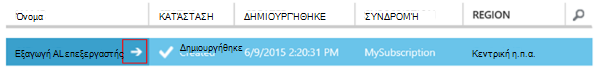

#### <a name="set-blob-location"></a>Ορισμός τοποθεσίας blob

Ρύθμιση για να λάβετε είσοδο από το blob συνεχής εξαγωγή:

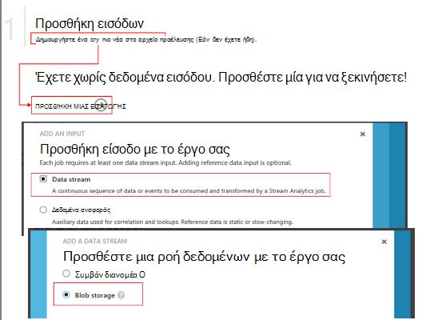

Τώρα θα πρέπει το πρωτεύον κλειδί πρόσβασης από το λογαριασμό χώρου αποθήκευσης, η οποία σημειώσατε προηγουμένως. Ρύθμιση ως το κλειδί λογαριασμού χώρου αποθήκευσης.

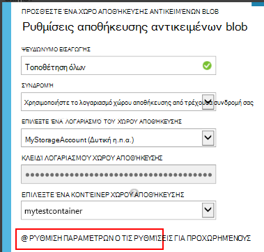

#### <a name="set-path-prefix-pattern"></a>Ορισμός διαδρομής πρόθεμα μοτίβου 

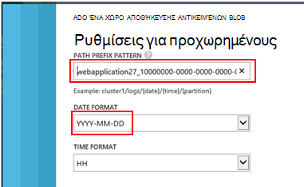

Φροντίστε να ρυθμίσετε τη μορφή ημερομηνίας **Εεεε-ηη** (με **παύλες**).

Το μοτίβο πρόθεμα διαδρομή Καθορίζει τον τρόπο ανάλυσης ροή εντοπίζει τα αρχεία εισόδου στο χώρο αποθήκευσης της. Πρέπει να ρυθμίσετε ώστε να αντιστοιχούν στις πώς συνεχής εξαγωγή αποθηκεύει τα δεδομένα. Ορίστε την ως εξής:

    webapplication27_12345678123412341234123456789abcdef0/PageViews/{date}/{time}

Σε αυτό το παράδειγμα:

* `webapplication27`είναι το όνομα του πόρου ιδέες εφαρμογή, **όλα με πεζά γράμματα**. 
* `1234...`είναι το κλειδί οργάνων από την εφαρμογή ιδέες πόρων **με παύλες καταργούνται**. 
* `PageViews`είναι ο τύπος δεδομένων που θέλουμε να αναλύσετε. Τους διαθέσιμους τύπους εξαρτώνται από το φίλτρο που ορίζετε σε συνεχή εξαγωγή. Εξετάστε τα εξαγόμενα δεδομένα για να δείτε τους διαθέσιμους τύπους και δείτε την [Εξαγωγή μοντέλου δεδομένων](app-insights-export-data-model.md).
* `/{date}/{time}`γράφεται ως έχουν ένα μοτίβο.

Για να λάβετε το όνομα και iKey του πόρου ιδέες εφαρμογή, ανοίξτε Essentials στη σελίδα επισκόπηση, ή ανοίξτε τις ρυθμίσεις.

#### <a name="finish-initial-setup"></a>Αρχική ρύθμιση λήξης

Επιβεβαιώστε τη μορφή σειριοποίησης:

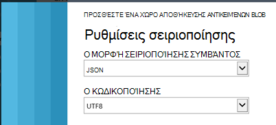

Κλείστε τον οδηγό και περιμένετε για την ολοκλήρωση της εγκατάστασης.

>[AZURE.TIP] Χρησιμοποιήστε τη συνάρτηση δείγμα για να βεβαιωθείτε ότι έχουν ρυθμιστεί σωστά τη διαδρομή εισαγωγής. Εάν αποτύχει: Ελέγξτε ότι υπάρχει δεδομένων στο χώρο αποθήκευσης της για το δείγμα χρονικό διάστημα που επιλέξατε. Επεξεργαστείτε τον ορισμό της εισαγωγής και ορίστε το λογαριασμό χώρου αποθήκευσης, το πρόθεμα διαδρομή και μορφή ημερομηνίας σωστά.

## <a name="set-query"></a>Ορισμός ερωτήματος

Ανοίξτε την ενότητα ερωτήματος:

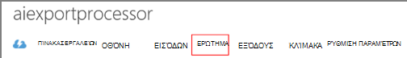

Αντικαταστήστε το προεπιλεγμένο ερώτημα με:

```SQL

    SELECT flat.ArrayValue.name as pageName
    , flat.ArrayValue.count as viewCount
    , flat.ArrayValue.url as url
    , flat.ArrayValue.urlData.port as urlDataPort
    , flat.ArrayValue.urlData.protocol as urlDataprotocol
    , flat.ArrayValue.urlData.host as urlDataHost
    , flat.ArrayValue.urlData.base as urlDataBase
    , flat.ArrayValue.urlData.hashTag as urlDataHashTag
      ,A.context.data.eventTime as eventTime
      ,A.context.data.isSynthetic as isSynthetic
      ,A.context.device.id as deviceId
      ,A.context.device.type as deviceType
      ,A.context.device.os as os
      ,A.context.device.osVersion as osVersion
      ,A.context.device.locale as locale
      ,A.context.device.userAgent as userAgent
      ,A.context.device.browser as browser
      ,A.context.device.browserVersion as browserVersion
      ,A.context.device.screenResolution.value as screenResolution
      ,A.context.session.id as sessionId
      ,A.context.session.isFirst as sessionIsFirst
      ,A.context.location.clientip as clientIp
      ,A.context.location.continent as continent
      ,A.context.location.country as country
      ,A.context.location.province as province
      ,A.context.location.city as city
    INTO
      AIOutput
    FROM AIinput A
    CROSS APPLY GetElements(A.[view]) as flat


```

Παρατηρήστε ότι η πρώτη μερικές ιδιότητες είναι ειδικά για τη σελίδα Προβολή δεδομένων. Εξαγωγές από τους άλλους τύπους τηλεμετρίας θα έχουν διαφορετικές ιδιότητες. Ανατρέξτε στο θέμα το [λεπτομερή αναφορά μοντέλου δεδομένων για το τύποι ιδιοτήτων και τις τιμές.](app-insights-export-data-model.md)

## <a name="set-up-output-to-database"></a>Ρύθμιση εξόδου στη βάση δεδομένων

Επιλέξτε SQL ως το αποτέλεσμα.

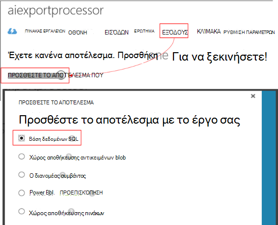

Καθορίστε τη βάση δεδομένων SQL.


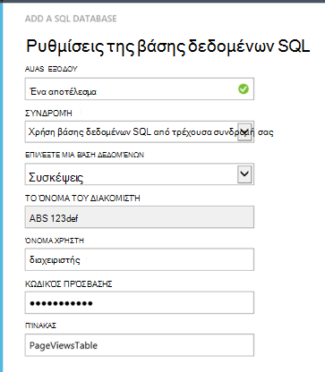

Κλείστε τον οδηγό και περιμένετε να εμφανιστεί μια ειδοποίηση που έχει οριστεί η έξοδος.

## <a name="start-processing"></a>Έναρξη επεξεργασίας

Έναρξη της εργασίας από τη γραμμή ενεργειών:

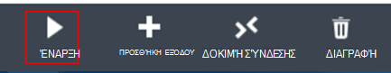

Μπορείτε να επιλέξετε εάν θέλετε να ξεκινήσετε την επεξεργασία των δεδομένων ξεκινώντας από τώρα ή για να ξεκινήσετε με προηγούμενες δεδομένων. Η τελευταία είναι χρήσιμη αν έχετε είχατε συνεχής εξαγωγή εκτελείται ήδη για κάποιο χρονικό διάστημα.


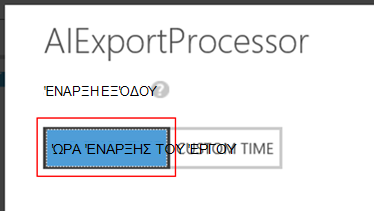

Μετά από μερικά λεπτά, επιστρέψτε στο Εργαλεία διαχείρισης του SQL Server και παρακολουθήστε τα δεδομένα στη ροή. Για παράδειγμα, χρησιμοποιήστε ένα ερώτημα ως εξής:

    SELECT TOP 100 *
    FROM [dbo].[PageViewsTable]


## <a name="related-articles"></a>Σχετικά άρθρα

* [Εξαγωγή σε SQL χρησιμοποιώντας ένα ρόλο εργαζόμενου](app-insights-code-sample-export-telemetry-sql-database.md)
* [Εξαγωγή στο PowerBI ροή αναλυτικών στοιχείων χρήσης](app-insights-export-power-bi.md)
* [Λεπτομερή δεδομένα του μοντέλου αναφορά για το τύποι ιδιοτήτων και τις τιμές.](app-insights-export-data-model.md)
* [Συνεχής εξαγωγή στην εφαρμογή ιδέες](app-insights-export-telemetry.md)
* [Εφαρμογή ιδέες](https://azure.microsoft.com/services/application-insights/)

<!--Link references-->

[diagnostic]: app-insights-diagnostic-search.md
[export]: app-insights-export-telemetry.md
[metrics]: app-insights-metrics-explorer.md
[portal]: http://portal.azure.com/
[start]: app-insights-overview.md

 