<properties 
    pageTitle="Δείγμα κώδικα: ανάλυση των δεδομένων που έχουν εξαχθεί από εφαρμογή ιδέες" 
    description="Κωδικός τη δική σας ανάλυση των τηλεμετρίας σε εφαρμογή ιδέες, χρησιμοποιώντας τη δυνατότητα συνεχής εξαγωγή. Αποθηκεύστε τα δεδομένα σε SQL." 
    services="application-insights" 
    documentationCenter=""
    authors="mazharmicrosoft" 
    manager="douge"/>

<tags 
    ms.service="application-insights" 
    ms.workload="tbd" 
    ms.tgt_pltfrm="ibiza" 
    ms.devlang="na" 
    ms.topic="article" 
    ms.date="01/05/2016" 
    ms.author="awills"/>
 
# Δείγμα κώδικα: ανάλυση των δεδομένων που έχουν εξαχθεί από εφαρμογή ιδέες

Σε αυτό το άρθρο δείχνει πώς μπορείτε να επεξεργάζεστε JSON δεδομένα που έχουν εξαχθεί από εφαρμογή ιδέες. Ως παράδειγμα, θα σας θα σύνταξη κώδικα για να μετακινήσετε τα δεδομένα σας τηλεμετρίας από [Ιδέες εφαρμογή του Visual Studio] [ start] σε μια βάση δεδομένων Azure SQL με τη χρήση [Συνεχής εξαγωγή][export]. (Μπορείτε επίσης να επιτύχετε αυτό [με τη χρήση ανάλυσης ροής](app-insights-code-sample-export-sql-stream-analytics.md), αλλά εδώ μας στόχος είναι να σας δείξουν ορισμένες κώδικα.) 

Συνεχής εξαγωγή μεταβαίνει σας τηλεμετρίας σε χώρο αποθήκευσης Azure σε μορφή JSON, έτσι θα σας θα γράψετε ορισμένες κώδικα για την ανάλυση των αντικειμένων JSON και δημιουργία γραμμών σε έναν πίνακα βάσης δεδομένων.

Γενικότερα, λόγω των συνεχών εξαγωγή είναι ο τρόπος για να κάνετε τη δική σας ανάλυση της το τηλεμετρίας τις εφαρμογές σας Αποστολή σε εφαρμογή ιδέες. Ενδέχεται να μπορείτε να προσαρμόσετε αυτό το δείγμα κώδικα για να εκτελέσετε άλλες ενέργειες με το εξαγόμενο τηλεμετρίας.

Ας ξεκινήσουμε με την προϋπόθεση ότι έχετε ήδη την εφαρμογή που θέλετε να παρακολουθείτε.

## Προσθήκη εφαρμογής ιδέες SDK

Για να παρακολουθείτε την εφαρμογή, μπορείτε να [προσθέσετε μια εφαρμογή του SDK ιδέες] [ start] στην εφαρμογή σας. Υπάρχουν διαφορετικές SDK και εργαλεία βοήθειας για διαφορετικές πλατφόρμες, IDEs και γλώσσες. Μπορείτε να παρακολουθείτε σελίδες web, σε διακομιστές web Java ή ASP.NET και κινητές συσκευές με διάφορα είδη. Όλα τα SDK αποστολή τηλεμετρίας στην [πύλη εφαρμογής ιδέες][portal], όπου μπορείτε να χρησιμοποιήσετε μας ισχυρές αναλύσεις και διαγνωστικά εργαλεία και εξαγάγετε τα δεδομένα στο χώρο αποθήκευσης.

Για να ξεκινήσετε:

1. Αποκτήστε ένα [λογαριασμό στο Microsoft Azure](https://azure.microsoft.com/pricing/).
2. Στην [πύλη του Azure][portal], προσθέστε ένα νέο πόρο εφαρμογής ιδέες για την εφαρμογή σας:

    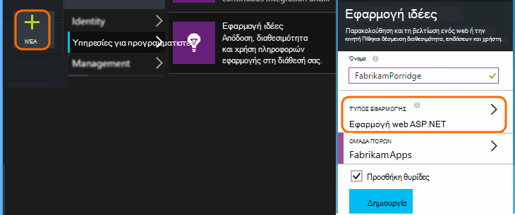

    (Τον τύπο εφαρμογής και συνδρομή μπορεί να διαφέρει.)
3. Άνοιγμα γρήγορης εκκίνησης για να βρείτε πώς μπορείτε να ρυθμίσετε το SDK για τον τύπο εφαρμογής σας.

    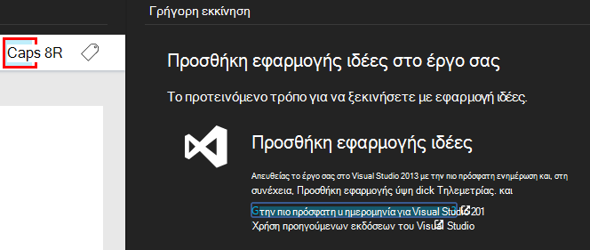

    Εάν δεν αναφέρεται τον τύπο εφαρμογής, Ρίξτε μια ματιά το παράθυρο [Γρήγορα αποτελέσματα] [ start] σελίδας.

4. Σε αυτό το παράδειγμα, θα σας παρακολούθηση μια εφαρμογή web, ώστε να μπορούμε να χρησιμοποιήσουμε το Azure εργαλεία στο Visual Studio για να εγκαταστήσετε το SDK. Ενημερώσουμε σχετικά με αυτό το όνομα του πόρου μας ιδέες εφαρμογής:

    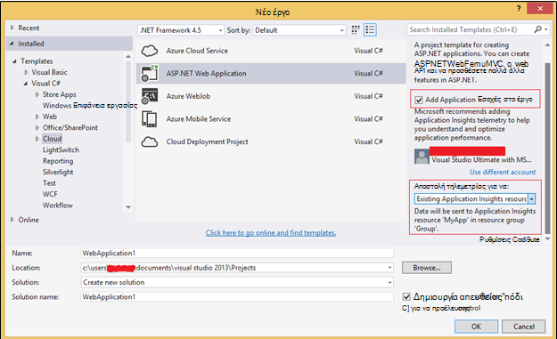

## Δημιουργία χώρου αποθήκευσης στο Azure

Δεδομένα από εφαρμογή ιδέες εξάγεται πάντα με ένα λογαριασμό αποθήκευσης Azure σε μορφή JSON. Είναι από το χώρο αποθήκευσης που θα σας κώδικα διαβάσει τα δεδομένα.

1. Δημιουργία λογαριασμού "κλασική" χώρο αποθήκευσης στη συνδρομή σας στην [πύλη του Azure][portal].

    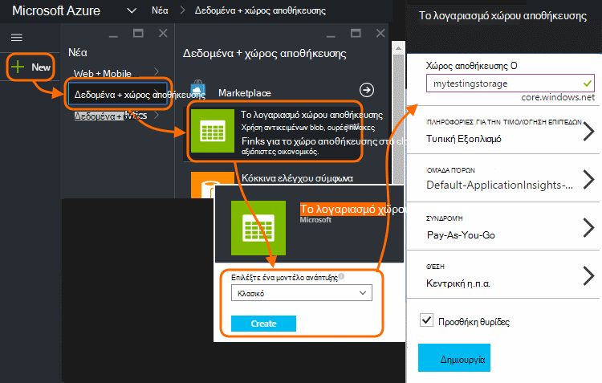

2. Δημιουργία κοντέινερ

    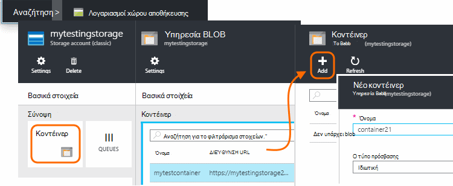

## Έναρξη συνεχής εξαγωγή με το χώρο αποθήκευσης Azure

1. Στην πύλη του Azure, αναζητήστε τον πόρο ιδέες εφαρμογής που δημιουργήσατε για την εφαρμογή σας.

    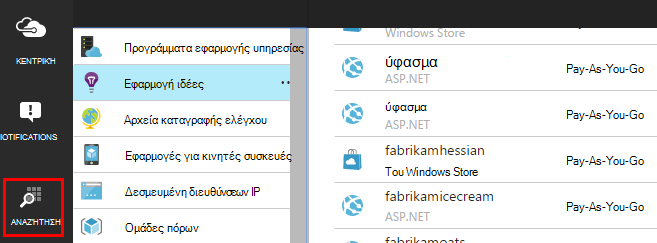

2. Δημιουργία μιας συνεχούς εξαγωγής.

    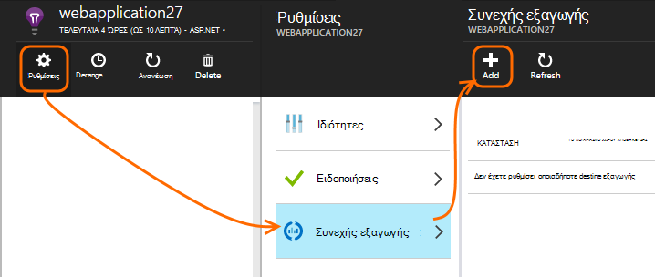

    Επιλέξτε το λογαριασμό χώρου αποθήκευσης που δημιουργήσατε νωρίτερα:

    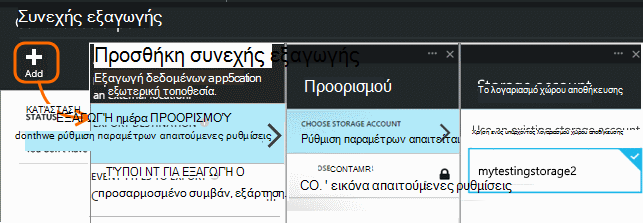
    
    Ορίστε τους τύπους συμβάντων που θέλετε να δείτε:

    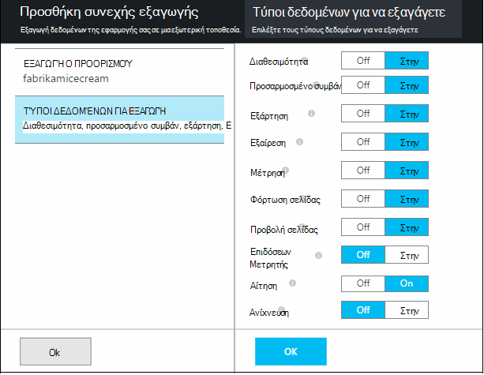

3. Ενημερώστε ορισμένες συγκεντρώσουν τα δεδομένα. Καθίσετε πίσω και να επιτρέψετε στους χρήστες να χρησιμοποιήσουν την εφαρμογή σας για κάποιο χρονικό διάστημα. Τηλεμετρίας να παραδίδεται και θα δείτε στατιστικών γραφημάτων στην [Εξερεύνηση των μετρικό](app-insights-metrics-explorer.md) και μεμονωμένα συμβάντα στο [διαγνωστικών αναζήτησης](app-insights-diagnostic-search.md). 

    Και, επίσης, θα εξαγάγετε τα δεδομένα για το χώρο αποθήκευσης. 

4. Έλεγχος τα εξαγόμενα δεδομένα. Στο Visual Studio, επιλέξτε **Προβολή / Cloud Explorer**, και ανοίξτε το Azure / χώρου αποθήκευσης. (Εάν δεν έχετε αυτήν την επιλογή μενού, πρέπει να εγκαταστήσετε το SDK Azure: Ανοίξτε το παράθυρο διαλόγου νέο έργο και ανοίξτε το Visual C# / Cloud / λήψη Microsoft Azure SDK για το .NET.)

    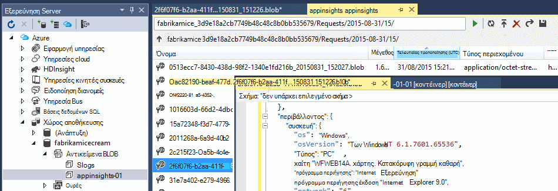

    Σημειώστε το κοινό τμήμα του ονόματος της διαδρομής, που προέρχεται από το όνομα και οργάνων πλήκτρο εφαρμογής. 

Τα συμβάντα εγγράφονται αντικειμένων blob αρχεία σε μορφή JSON. Κάθε αρχείο μπορεί να περιέχει ένα ή περισσότερα συμβάντα. Επομένως, θα σας θα θέλατε να διαβάσει τα δεδομένα του συμβάντος και φιλτράρετε τα πεδία θέλουμε. Υπάρχουν όλοι οι τύποι πράγματα που θα μπορούσε να κάνουμε με τα δεδομένα, αλλά το σχεδίου είναι σήμερα να γράψετε ορισμένες κώδικα για να μετακινήσετε τα δεδομένα σε μια βάση δεδομένων SQL. Που θα διευκολύνουν την εκτέλεση πολλές ενδιαφέρον ερωτημάτων.

## Δημιουργήστε μια βάση δεδομένων SQL Azure

Για αυτό το παράδειγμα, θα σας θα σύνταξη κώδικα για να προωθήσετε τα δεδομένα σε μια βάση δεδομένων.

Πάλι ξεκινώντας από τη συνδρομή σας στην [πύλη Azure][portal], δημιουργήστε τη βάση δεδομένων (και ένα νέο διακομιστή, εκτός και εάν έχετε ήδη λάβει ένα) για την οποία θα εγγραφή των δεδομένων.

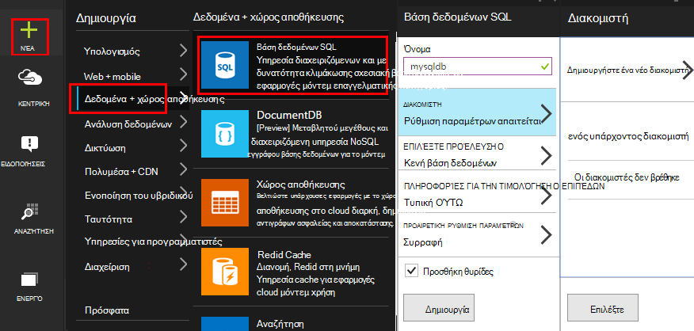

Βεβαιωθείτε ότι ο διακομιστής βάσης δεδομένων επιτρέπει την πρόσβαση σε υπηρεσίες Azure:

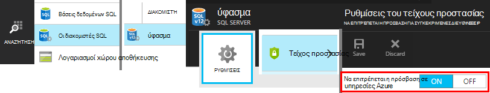

## Δημιουργήστε ένα ρόλο εργαζόμενου 

Τώρα τελευταία να [ορισμένες κώδικα](https://sesitai.codeplex.com/) για την ανάλυση του JSON στο τα εξαγόμενα αντικείμενα BLOB σύνταξης, και να δημιουργήσετε εγγραφές στη βάση δεδομένων. Εφόσον η εξαγωγή χώρου αποθήκευσης και η βάση δεδομένων είναι και τα δύο στο Azure, θα μπορούμε να εκτελέσουμε τον κωδικό σε ένα ρόλο Azure εργαζόμενου.

Αυτός ο κωδικός εξάγει αυτόματα όποιο ιδιότητες είναι παρόντες σε το JSON. Για περιγραφές των ιδιοτήτων, ανατρέξτε στο θέμα [Εξαγωγή μοντέλου δεδομένων](app-insights-export-data-model.md).

#### Δημιουργία εργασίας έργου ρόλων

Στο Visual Studio, δημιουργήστε ένα νέο έργο για το ρόλο εργασίας:

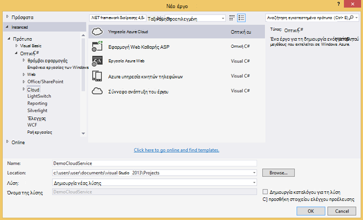

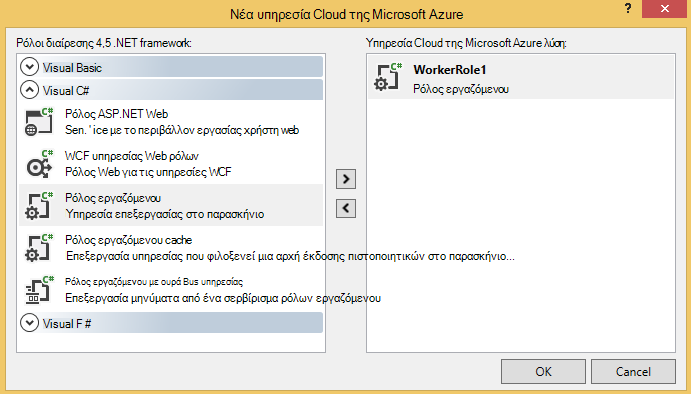

#### Σύνδεση με το λογαριασμό χώρου αποθήκευσης

Στο Azure, λάβετε τη συμβολοσειρά σύνδεσης από το λογαριασμό χώρου αποθήκευσης:

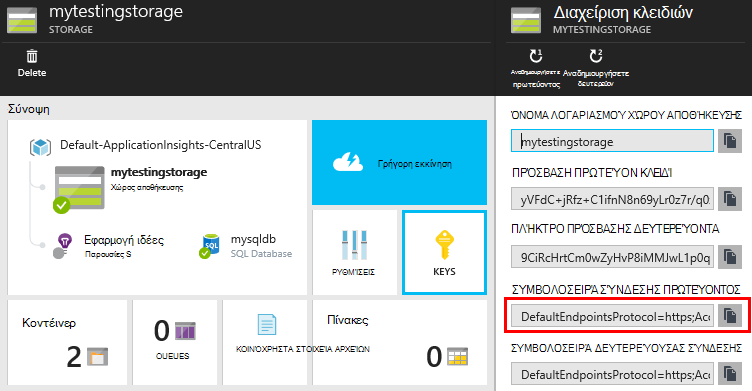

Στο Visual Studio, ρυθμίστε τις παραμέτρους ρόλων εργασίας με τη συμβολοσειρά σύνδεσης λογαριασμού χώρου αποθήκευσης:

#### Πακέτα

Στην Εξερεύνηση λύσεων, κάντε δεξιό κλικ στο έργο σας εργαζόμενου ρόλο και επιλέξτε Διαχείριση πακέτων NuGet.
Αναζητήστε και εγκαταστήστε αυτά τα πακέτα: 

 * EntityFramework 6.1.2 ή αργότερα - θα χρησιμοποιήσουμε αυτό για τη δημιουργία του σχήματος πίνακα DB δυναμική, με βάση το περιεχόμενο του το JSON στο αντικείμενο blob.
 * JsonFx - θα χρησιμοποιήσουμε αυτό για ισοπέδωση το JSON ιδιότητες κλάσης C#.

Χρησιμοποιήστε αυτό το εργαλείο για τη δημιουργία κλάσης C# εκτός μας μεμονωμένο έγγραφο JSON. Απαιτεί ορισμένες δευτερεύουσες αλλαγές όπως ισοπέδωση JSON πίνακες σε μία μόνο ιδιότητα C# σε Ενεργοποίηση μόνο μία στήλη στον πίνακα DB (ex. urlData_port) 

 * [Γεννήτρια κλάσης JSON C#](http://jsonclassgenerator.codeplex.com/)

## Κωδικός 

Μπορείτε να συμπεριλάβετε αυτόν τον κωδικό σε `WorkerRole.cs`.

#### Εισαγωγών

    using Microsoft.WindowsAzure.Storage;

    using Microsoft.WindowsAzure.Storage.Blob;

#### Ανάκτηση τη συμβολοσειρά σύνδεσης του χώρου αποθήκευσης

    private static string GetConnectionString()
    {
      return Microsoft.WindowsAzure.CloudConfigurationManager.GetSetting("StorageConnectionString");
    }

#### Εκτέλεση ο εργαζόμενος σε τακτά χρονικά διαστήματα

Αντικατάσταση της υπάρχουσας Εκτέλεση μεθόδου, και επιλέξτε το χρονικό διάστημα που προτιμάτε. Αυτό πρέπει να είναι τουλάχιστον μία ώρα, επειδή η δυνατότητα εξαγωγή ολοκληρωθεί ένα αντικείμενο JSON σε μία ώρα.

    public override void Run()
    {
      Trace.TraceInformation("WorkerRole1 is running");

      while (true)
      {
        Trace.WriteLine("Sleeping", "Information");

        Thread.Sleep(86400000); //86400000=24 hours //1 hour=3600000
                
        Trace.WriteLine("Awake", "Information");

        ImportBlobtoDB();
      }
    }

#### Εισαγωγή κάθε αντικείμενο JSON ως μια γραμμή πίνακα

    public void ImportBlobtoDB()
    {
      try
      {
        CloudStorageAccount account = CloudStorageAccount.Parse(GetConnectionString());

        var blobClient = account.CreateCloudBlobClient();
        var container = blobClient.GetContainerReference(FilterContainer);

        foreach (CloudBlobDirectory directory in container.ListBlobs())//Parent directory
        {
          foreach (CloudBlobDirectory subDirectory in directory.ListBlobs())//PageViewPerformance
          {
            foreach (CloudBlobDirectory dir in subDirectory.ListBlobs())//2015-01-31
            {
              foreach (CloudBlobDirectory subdir in dir.ListBlobs())//22
              {
                foreach (IListBlobItem item in subdir.ListBlobs())//3IAwm6u3-0.blob
                {
                  itemname = item.Uri.ToString();
                  ParseEachBlob(container, item);
                  AuditBlob(container, directory, subDirectory, dir, subdir, item);
                } //item loop
              } //subdir loop
            } //dir loop
          } //subDirectory loop
        } //directory loop
      }
      catch (Exception ex)
      {
        //handle exception
      }
    }

#### Ανάλυση κάθε blob

    private void ParseEachBlob(CloudBlobContainer container, IListBlobItem item)
    {
      try
      {
        var blob = container.GetBlockBlobReference(item.Parent.Prefix + item.Uri.Segments.Last());
    
        string json;
    
        using (var memoryStream = new MemoryStream())
        {
          blob.DownloadToStream(memoryStream);
          json = System.Text.Encoding.UTF8.GetString(memoryStream.ToArray());
    
          IEnumerable<string> entities = json.Split('\n').Where(s => !string.IsNullOrWhiteSpace(s));
    
          recCount = entities.Count();
          failureCount = 0; //resetting failure count
    
          foreach (var entity in entities)
          {
            var reader = new JsonFx.Json.JsonReader();
            dynamic output = reader.Read(entity);
    
            Dictionary<string, object> dict = new Dictionary<string, object>();
    
            GenerateDictionary((System.Dynamic.ExpandoObject)output, dict, "");
    
            switch (FilterType)
            {
              case "PageViewPerformance":
    
              if (dict.ContainsKey("clientPerformance"))
                {
                  GenerateDictionary(((System.Dynamic.ExpandoObject[])dict["clientPerformance"])[0], dict, "");
                }
    
              if (dict.ContainsKey("context_custom_dimensions"))
              {
                if (dict["context_custom_dimensions"].GetType() == typeof(System.Dynamic.ExpandoObject[]))
                {
                  GenerateDictionary(((System.Dynamic.ExpandoObject[])dict["context_custom_dimensions"])[0], dict, "");
                }
              }
    
            PageViewPerformance objPageViewPerformance = (PageViewPerformance)GetObject(dict);
    
            try
            {
              using (var db = new TelemetryContext())
              {
                db.PageViewPerformanceContext.Add(objPageViewPerformance);
                db.SaveChanges();
              }
            }
            catch (Exception ex)
            {
              failureCount++;
            }
            break;
    
            default:
            break;
          }
        }
      }
    }
    catch (Exception ex)
    {
      //handle exception 
    }
    }

#### Προετοιμασία ένα λεξικό για κάθε έγγραφο JSON

    private void GenerateDictionary(System.Dynamic.ExpandoObject output, Dictionary<string, object> dict, string parent)
        {
            try
            {
                foreach (var v in output)
                {
                    string key = parent + v.Key;
                    object o = v.Value;

                    if (o.GetType() == typeof(System.Dynamic.ExpandoObject))
                    {
                        GenerateDictionary((System.Dynamic.ExpandoObject)o, dict, key + "_");
                    }
                    else
                    {
                        if (!dict.ContainsKey(key))
                        {
                            dict.Add(key, o);
                        }
                    }
                }
            }
            catch (Exception ex)
            {
            //handle exception 
            }
        }

#### Μετατροπή του περιεχομένου του εγγράφου JSON σε C# κλάσης τηλεμετρίας ιδιότητες αντικειμένου

     public object GetObject(IDictionary<string, object> d)
        {
            PropertyInfo[] props = null;
            object res = null;

            try
            {
                switch (FilterType)
                {
                    case "PageViewPerformance":

                        props = typeof(PageViewPerformance).GetProperties();
                        res = Activator.CreateInstance<PageViewPerformance>();
                        break;

                    default:
                        break;
                }

                for (int i = 0; i < props.Length; i++)
                {
                    if (props[i].CanWrite && d.ContainsKey(props[i].Name))
                    {
                        props[i].SetValue(res, d[props[i].Name], null);
                    }
                }
            }
            catch (Exception ex)
            {
            //handle exception 
            }

            return res;
        }

#### Αρχείο κλάσης PageViewPerformance που δημιουργούνται από το έγγραφο JSON

    public class PageViewPerformance
    {
        [DatabaseGenerated(DatabaseGeneratedOption.Identity)]
        public Guid Id { get; set; }

        public string url { get; set; }

        public int urlData_port { get; set; }

        public string urlData_protocol { get; set; }

        public string urlData_host { get; set; }

        public string urlData_base { get; set; }

        public string urlData_hashTag { get; set; }

        public double total_value { get; set; }

        public double networkConnection_value { get; set; }

        public double sendRequest_value { get; set; }

        public double receiveRequest_value { get; set; }

        public double clientProcess_value { get; set; }

        public string name { get; set; }

        public string internal_data_id { get; set; }

        public string internal_data_documentVersion { get; set; }

        public DateTime? context_data_eventTime { get; set; }

        public string context_device_id { get; set; }

        public string context_device_type { get; set; }

        public string context_device_os { get; set; }

        public string context_device_osVersion { get; set; }

        public string context_device_locale { get; set; }

        public string context_device_userAgent { get; set; }

        public string context_device_browser { get; set; }

        public string context_device_browserVersion { get; set; }

        public string context_device_screenResolution_value { get; set; }

        public string context_user_anonId { get; set; }

        public string context_user_anonAcquisitionDate { get; set; }

        public string context_user_authAcquisitionDate { get; set; }

        public string context_user_accountAcquisitionDate { get; set; }

        public string context_session_id { get; set; }

        public bool context_session_isFirst { get; set; }

        public string context_operation_id { get; set; }

        public double context_location_point_lat { get; set; }

        public double context_location_point_lon { get; set; }

        public string context_location_clientip { get; set; }

        public string context_location_continent { get; set; }

        public string context_location_country { get; set; }

        public string context_location_province { get; set; }

        public string context_location_city { get; set; }
    }

#### DBcontext για SQL αλληλεπίδραση με πλαίσιο οντότητα

    public class TelemetryContext : DbContext
    {
        public DbSet<PageViewPerformance> PageViewPerformanceContext { get; set; }
        public TelemetryContext()
            : base("name=TelemetryContext")
        {
        }
    }

Προσθήκη DB συμβολοσειρά σύνδεσης με το όνομα `TelemetryContext` στο `app.config`.

## Σχήμα (πληροφορίες μόνο)

Αυτό είναι το σχήμα για τον πίνακα που θα δημιουργηθεί για προβολή σελίδας.

> [AZURE.NOTE] Δεν χρειάζεται να εκτελέσετε αυτήν τη δέσμη ενεργειών. Τα χαρακτηριστικά στο το JSON καθορίζουν τις στήλες του πίνακα.

    CREATE TABLE [dbo].[PageViewPerformances](
    [Id] [uniqueidentifier] NOT NULL,
    [url] [nvarchar](max) NULL,
    [urlData_port] [int] NOT NULL,
    [urlData_protocol] [nvarchar](max) NULL,
    [urlData_host] [nvarchar](max) NULL,
    [urlData_base] [nvarchar](max) NULL,
    [urlData_hashTag] [nvarchar](max) NULL,
    [total_value] [float] NOT NULL,
    [networkConnection_value] [float] NOT NULL,
    [sendRequest_value] [float] NOT NULL,
    [receiveRequest_value] [float] NOT NULL,
    [clientProcess_value] [float] NOT NULL,
    [name] [nvarchar](max) NULL,
    [User] [nvarchar](max) NULL,
    [internal_data_id] [nvarchar](max) NULL,
    [internal_data_documentVersion] [nvarchar](max) NULL,
    [context_data_eventTime] [datetime] NULL,
    [context_device_id] [nvarchar](max) NULL,
    [context_device_type] [nvarchar](max) NULL,
    [context_device_os] [nvarchar](max) NULL,
    [context_device_osVersion] [nvarchar](max) NULL,
    [context_device_locale] [nvarchar](max) NULL,
    [context_device_userAgent] [nvarchar](max) NULL,
    [context_device_browser] [nvarchar](max) NULL,
    [context_device_browserVersion] [nvarchar](max) NULL,
    [context_device_screenResolution_value] [nvarchar](max) NULL,
    [context_user_anonId] [nvarchar](max) NULL,
    [context_user_anonAcquisitionDate] [nvarchar](max) NULL,
    [context_user_authAcquisitionDate] [nvarchar](max) NULL,
    [context_user_accountAcquisitionDate] [nvarchar](max) NULL,
    [context_session_id] [nvarchar](max) NULL,
    [context_session_isFirst] [bit] NOT NULL,
    [context_operation_id] [nvarchar](max) NULL,
    [context_location_point_lat] [float] NOT NULL,
    [context_location_point_lon] [float] NOT NULL,
    [context_location_clientip] [nvarchar](max) NULL,
    [context_location_continent] [nvarchar](max) NULL,
    [context_location_country] [nvarchar](max) NULL,
    [context_location_province] [nvarchar](max) NULL,
    [context_location_city] [nvarchar](max) NULL,
    CONSTRAINT [PK_dbo.PageViewPerformances] PRIMARY KEY CLUSTERED 
    (
     [Id] ASC
    )WITH (PAD_INDEX = OFF, STATISTICS_NORECOMPUTE = OFF, IGNORE_DUP_KEY = OFF, ALLOW_ROW_LOCKS = ON, ALLOW_PAGE_LOCKS = ON) ON [PRIMARY]
    ) ON [PRIMARY] TEXTIMAGE_ON [PRIMARY]

    GO

    ALTER TABLE [dbo].[PageViewPerformances] ADD  DEFAULT (newsequentialid()) FOR [Id]
    GO

Για να δείτε αυτό το παράδειγμα στην πράξη, [κάντε λήψη](https://sesitai.codeplex.com/) του κώδικα ολοκλήρωσης εργασίας, αλλάξτε το `app.config` ρυθμίσεις και να δημοσιεύσετε το ρόλο εργαζόμενου σε Azure.

## Σχετικά άρθρα

* [Εξαγωγή σε SQL χρησιμοποιώντας ένα ρόλο εργαζόμενου](app-insights-code-sample-export-telemetry-sql-database.md)
* [Συνεχής εξαγωγή στην εφαρμογή ιδέες](app-insights-export-telemetry.md)
* [Εφαρμογή ιδέες](https://azure.microsoft.com/services/application-insights/)
* [Εξαγωγή μοντέλου δεδομένων](app-insights-export-data-model.md)
* [Περισσότερα παραδείγματα και αναλυτικές παρουσιάσεις](app-insights-code-samples.md)

<!--Link references-->

[diagnostic]: app-insights-diagnostic-search.md
[export]: app-insights-export-telemetry.md
[metrics]: app-insights-metrics-explorer.md
[portal]: http://portal.azure.com/
[start]: app-insights-overview.md

 
