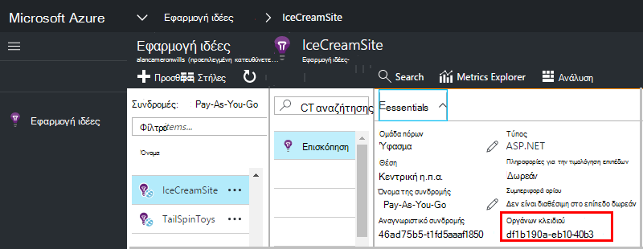

<properties 
    pageTitle="Δημιουργήστε ένα νέο πόρο ιδέες εφαρμογή | Microsoft Azure" 
    description="Ρύθμιση του ιδέες εφαρμογής παρακολούθησης για μια νέα εφαρμογή live. Προσέγγιση που βασίζεται στο Web." 
    services="application-insights" 
    documentationCenter=""
    authors="alancameronwills" 
    manager="douge"/>

<tags 
    ms.service="application-insights" 
    ms.workload="tbd" 
    ms.tgt_pltfrm="ibiza" 
    ms.devlang="na" 
    ms.topic="article" 
    ms.date="08/26/2016" 
    ms.author="awills"/>

# Δημιουργία ενός πόρου ιδέες εφαρμογής

Visual Studio εφαρμογή ιδέες εμφανίζει δεδομένα σχετικά με την εφαρμογή του Microsoft Azure *πόρων*. Δημιουργία νέου πόρου, επομένως, είναι μέρος της [ρύθμισης των εφαρμογών ιδέες για την παρακολούθηση της νέας εφαρμογής][start]. Σε πολλές περιπτώσεις, αυτό μπορεί να γίνει αυτόματα από το IDE και αυτό είναι το συνιστώμενο τρόπο ώστε να είναι διαθέσιμη. Αλλά σε ορισμένες περιπτώσεις, μπορείτε να δημιουργήσετε έναν πόρο με μη αυτόματο τρόπο.

Αφού δημιουργήσετε τον πόρο, μπορείτε να μεταφέρετε το κλειδί οργάνων και να το χρησιμοποιήσετε για να ρυθμίσετε τις παραμέτρους του SDK στην εφαρμογή. Αυτή στέλνει το τηλεμετρίας στον πόρο.

## Εγγραφείτε στο Microsoft Azure

Εάν δεν λάβατε [Microsoft του λογαριασμού σας, αποκτήστε ένα τώρα](http://live.com). (Εάν χρησιμοποιείτε υπηρεσίες όπως το Outlook.com, OneDrive, Windows Phone ή XBox Live, έχετε ήδη ένα λογαριασμό Microsoft.)

Θα χρειαστεί επίσης μια συνδρομή στο [Microsoft Azure](http://azure.com). Εάν η ομάδα ή την εταιρεία σας έχει μια συνδρομή του Azure, ο κάτοχος μπορεί να προσθέσει στη, χρησιμοποιώντας το Windows Live ID σας.

Ή μπορείτε να δημιουργήσετε μια νέα συνδρομή. Το δωρεάν λογαριασμό σάς επιτρέπει να δοκιμάσετε τα πάντα στο Azure. Μετά τη λήξη της δοκιμαστικής περιόδου, που μπορεί να βρείτε τη συνδρομή διανεμητική απαραίτητο, όπως που δεν θα χρεωθεί δωρεάν υπηρεσίες. 

Όταν έχετε πρόσβαση σε μια συνδρομή, συνδεθείτε στο ιδέες εφαρμογή στο [http://portal.azure.com](https://portal.azure.com), και χρησιμοποιήστε το Live ID για να συνδεθείτε.

## Δημιουργία ενός πόρου ιδέες εφαρμογής
  

Στο [portal.azure.com](https://portal.azure.com), προσθέστε έναν πόρο ιδέες εφαρμογής:

* **Τύπος εφαρμογής** επηρεάζει αυτό που βλέπετε στην την επισκόπηση blade και τις ιδιότητες που είναι διαθέσιμες στην [Εξερεύνηση των μετρικό][metrics]. Εάν δεν βλέπετε τον τύπο της εφαρμογής, επιλέξτε ASP.NET.
* **Ομάδα πόρων** είναι εξυπηρέτηση για τη Διαχείριση ιδιοτήτων, όπως τον έλεγχο πρόσβασης. Εάν έχετε ήδη δημιουργήσει άλλους πόρους Azure, μπορείτε να επιλέξετε για να τοποθετήσετε αυτόν τον νέο πόρο στην ίδια ομάδα.
* **Η συνδρομή** είναι το λογαριασμό πληρωμής στο Azure.
* **Θέση** είναι όπου θα σας να διατηρείτε τα δεδομένα σας. Προς το παρόν δεν μπορεί να αλλάξει.
* **Προσθήκη για να startboard** συμπληρώνει ένα πλακίδιο γρήγορης πρόσβασης για τον πόρο στην Azure αρχική σελίδα σας. Συνιστάται η.

Αφού δημιουργηθεί η εφαρμογή σας, ανοίγει ένα νέο blade. Αυτό είναι όπου θα δείτε δεδομένα απόδοσης και χρήσης σχετικά με την εφαρμογή σας. 

Για να λάβετε πίσω για το επόμενο ώρας login Azure, αναζητήστε για πλακίδιο γρήγορης εκκίνησης της εφαρμογής σας στον πίνακα έναρξης (αρχική οθόνη). Ή κάντε κλικ στο κουμπί Αναζήτηση για να το βρείτε.

## Αντιγράψτε τον αριθμό-κλειδί οργάνων

Το κλειδί οργάνων προσδιορίζει τον πόρο που δημιουργήσατε. Θα χρειαστεί για να εκχωρήσετε στο SDK.

## Εγκατάσταση του SDK στην εφαρμογή

Εγκαταστήστε την εφαρμογή ιδέες SDK στην εφαρμογή. Αυτό το βήμα εξαρτάται σε μεγάλο βαθμό τον τύπο της εφαρμογής σας. 

Χρησιμοποιήστε το πλήκτρο οργάνων για να ρυθμίσετε τις παραμέτρους [του SDK που μπορείτε να εγκαταστήσετε την εφαρμογή σας][start].

Το SDK περιλαμβάνει βασικές λειτουργικές μονάδες που στέλνουν τηλεμετρίας χωρίς να χρειάζεται να γράφετε κώδικα. Για να παρακολουθείτε ενεργειών του χρήστη ή διάγνωση θεμάτων με περισσότερες λεπτομέρειες, [Χρησιμοποιήστε το API] [ api] για να στείλετε τη δική σας τηλεμετρίας.

## Ανατρέξτε στο θέμα δεδομένα τηλεμετρίας

Κλείστε το blade γρήγορης εκκίνησης για να επιστρέψετε στο σας blade εφαρμογής στην πύλη του Azure.

Κάντε κλικ στο πλακίδιο αναζήτησης για να δείτε [Διαγνωστικών αναζήτησης][diagnostic], όπου θα εμφανίζεται το πρώτο συμβάντα. 

Εάν αναμένεται περισσότερα δεδομένα, κάντε κλικ στην επιλογή Ανανέωση μετά από μερικά δευτερόλεπτα.

## Αυτόματη δημιουργία ενός πόρου

Μπορείτε να συντάξετε μια [δέσμη ενεργειών του PowerShell](app-insights-powershell-script-create-resource.md) για να δημιουργήσετε αυτόματα έναν πόρο.

## Επόμενα βήματα

* [Δημιουργία ενός πίνακα εργαλείων](app-insights-dashboards.md)
* [Διαγνωστικών αναζήτησης](app-insights-diagnostic-search.md)
* [Εξερεύνηση μετρικά](app-insights-metrics-explorer.md)
* [Γράψτε ανάλυσης ερωτήματα](app-insights-analytics.md)

<!--Link references-->

[api]: app-insights-api-custom-events-metrics.md
[diagnostic]: app-insights-diagnostic-search.md
[metrics]: app-insights-metrics-explorer.md
[start]: app-insights-overview.md

 