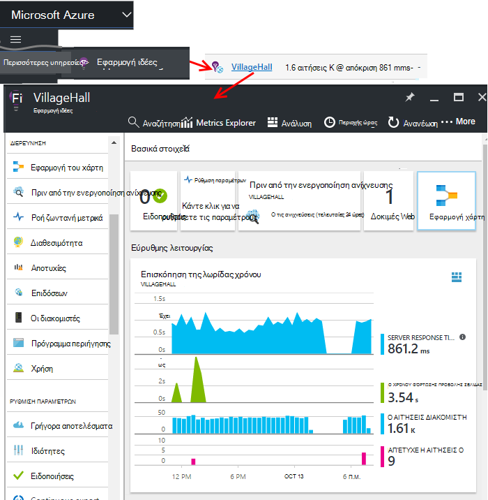

<properties
    pageTitle="Πίνακες εργαλείων και περιήγησης στην πύλη του ιδέες εφαρμογή | Microsoft Azure"
    description="Δημιουργία προβολών των βασικών APM γραφήματα και ερωτήματα."
    services="application-insights"
    documentationCenter=""
    authors="alancameronwills"
    manager="douge"/>

<tags
    ms.service="application-insights"
    ms.workload="tbd"
    ms.tgt_pltfrm="ibiza"
    ms.devlang="multiple"
    ms.topic="article" 
    ms.date="10/18/2016"
    ms.author="awills"/>

# Περιήγηση και πίνακες εργαλείων στην πύλη του ιδέες εφαρμογής

Αφού [ρυθμίσετε ιδέες εφαρμογή στο έργο σας](app-insights-overview.md), θα εμφανιστούν τηλεμετρίας δεδομένα σχετικά με τις επιδόσεις και η χρήση της εφαρμογής σας στον πόρο ιδέες εφαρμογής του έργου σας στην [πύλη του Azure](https://portal.azure.com).

## Βρείτε το τηλεμετρίας

Είσοδος στην [πύλη του Azure](https://portal.azure.com) και μεταβείτε στον πόρο ιδέες εφαρμογής που δημιουργήσατε για την εφαρμογή σας.

Η επισκόπηση blade (σελίδα) για την εφαρμογή σας εμφανίζει μια σύνοψη των βασικών διαγνωστικών μετρικών της εφαρμογής και είναι μια πύλη για τις άλλες δυνατότητες της πύλης.

Μπορείτε να προσαρμόσετε οποιοδήποτε από τα άλλα γραφήματα και να καρφιτσώσετε σε έναν πίνακα εργαλείων. Με αυτόν τον τρόπο, μπορείτε να μεταφέρετε μαζί τα γραφήματα κλειδιού από διαφορετικές εφαρμογές.

## Πίνακες εργαλείων

Το πρώτο πράγμα που βλέπετε μετά την είσοδο [πύλη του Microsoft Azure](https://portal.azure.com) είναι ένας πίνακας εργαλείων. Εδώ μπορείτε να μεταφέρετε μαζί τα γραφήματα που είναι πιο σημαντικές για εσάς σε όλους σας Azure τους πόρους, συμπεριλαμβανομένων των τηλεμετρίας από το [Visual Studio εφαρμογή ιδέες](app-insights-overview.md).
 

1. **Περιήγηση σε συγκεκριμένους πόρους** , όπως την εφαρμογή σας στην εφαρμογή ιδέες: Χρησιμοποιήστε την αριστερή γραμμή.
2. **Επιστρέψτε στον πίνακα εργαλείων τρέχουσα**ή Μετάβαση σε άλλες προβολές πρόσφατα: Χρησιμοποιήστε το αναπτυσσόμενο μενού στην επάνω αριστερά.
3. **Πίνακες εργαλείων διακόπτη**: Χρησιμοποιήστε το αναπτυσσόμενο μενού στο τον τίτλο του πίνακα εργαλείων
4. **Δημιουργία, επεξεργασία, και κοινή χρήση πινάκων εργαλείων** στη γραμμή εργαλείων του πίνακα εργαλείων.
5. **Επεξεργασία του πίνακα εργαλείων**: το δείκτη του ποντικιού πάνω από ένα πλακίδιο και, στη συνέχεια, χρησιμοποιήστε την επάνω γραμμή για να μετακινήσετε, προσαρμογή ή καταργήστε την.

## Προσθήκη σε έναν πίνακα εργαλείων

Όταν αναζητάτε στο ένα blade ή ένα σύνολο γραφημάτων που είναι ιδιαίτερα ενδιαφέρον, μπορείτε να καρφιτσώσετε ένα αντίγραφό του στον πίνακα εργαλείων. Θα δείτε την επόμενη φορά που θα επιστρέψετε εκεί.

1. Καρφίτσωμα γράφημα στον πίνακα εργαλείων. Ένα αντίγραφο του γραφήματος εμφανίζεται στον πίνακα εργαλείων.
2. Καρφίτσωμα του ολόκληρη blade στον πίνακα εργαλείων - εμφανίζεται στον πίνακα εργαλείων ως πλακίδιο που μπορείτε να κάνετε κλικ μέσα.
3. Κάντε κλικ στην επάνω αριστερή γωνία για να επιστρέψετε στην τρέχουσα πίνακα εργαλείων. Στη συνέχεια, μπορείτε να χρησιμοποιήσετε το αναπτυσσόμενο μενού για να επιστρέψετε στην τρέχουσα προβολή.

Παρατηρήστε ότι τα γραφήματα είναι ομαδοποιημένα σε πλακίδια: ένα πλακίδιο μπορεί να περιέχει περισσότερα από ένα γράφημα. Μπορείτε να καρφιτσώσετε το πλακίδιο ολόκληρη στον πίνακα εργαλείων.

### Καρφίτσωμα οποιοδήποτε ερώτημα στην ανάλυση

Μπορείτε επίσης να γραφήματα [pin αναλυτικών στοιχείων](app-insights-analytics-using.md#pin-to-dashboard) σε έναν [κοινόχρηστο](#share-dashboards-with-your-team) πίνακα εργαλείων. Αυτό σας επιτρέπει να προσθέσετε γραφήματα οποιουδήποτε αυθαίρετου ερωτήματος μαζί με την τυπική μετρήσεις. (Υπάρχει μια χρέωση για αυτήν τη δυνατότητα).

## Προσαρμόστε ένα πλακίδιο στον πίνακα εργαλείων

Μόλις ένα πλακίδιο στον πίνακα εργαλείων, μπορείτε να το προσαρμόσετε.

1. Προσθήκη γραφήματος στο πλακίδιο. 
2. Ορισμός μετρικό, ομαδοποίηση κατά διάσταση και (πίνακας; graph) του στυλ ενός γραφήματος.
3. Σύρετε κατά μήκος του διαγράμματος για να κάνετε μεγέθυνση. Κάντε κλικ στο κουμπί "Αναίρεση" για να επαναφέρετε το χρονικό διάστημα; Ορισμός ιδιοτήτων φίλτρου για τα γραφήματα στο πλακίδιο.
4. Ορισμός τίτλου πλακίδιο.

Τα πλακίδια καρφιτσωμένα από λεπίδες μετρικό explorer έχετε περισσότερες επιλογές επεξεργασίας από τα πλακίδια καρφιτσωμένα από μια επισκόπηση blade.

Το αρχικό πλακίδιο που έχετε καρφιτσωμένα δεν επηρεάζονται από τις αλλαγές που θέλετε.

## Εναλλαγή μεταξύ των πινάκων εργαλείων

Μπορείτε να αποθηκεύσετε περισσότερους από έναν πίνακα εργαλείων και να πραγματοποιήσετε εναλλαγή μεταξύ τους. Όταν καρφιτσώνετε ένα γράφημα ή blade, αθροίζονται στον τρέχοντα πίνακα εργαλείων.

Για παράδειγμα, ίσως έχετε έναν πίνακα εργαλείων για την εμφάνιση σε πλήρη οθόνη στο κανάλι ομάδας και ένα άλλο για την ανάπτυξη Γενικά.

Στον πίνακα εργαλείων, εμφανίζεται μια blade ως πλακίδιο: κάντε κλικ για να μεταβείτε στο το blade. Ένα γράφημα αναπαράγει το γράφημα στην αρχική του θέση.

## Κοινή χρήση πινάκων εργαλείων

Όταν έχετε δημιουργήσει έναν πίνακα εργαλείων, μπορείτε να το μοιραστείτε με άλλους χρήστες.

Μάθετε περισσότερα σχετικά με [τους ρόλους και έλεγχος πρόσβασης](app-insights-resources-roles-access-control.md).

## Εφαρμογή περιήγησης

Η επισκόπηση blade είναι η πύλη για περισσότερες πληροφορίες σχετικά με την εφαρμογή σας.

* **Οποιοδήποτε γράφημα ή το πλακίδιο** - κάντε κλικ σε οποιοδήποτε πλακίδιο ή γράφημα για να δείτε περισσότερες λεπτομέρειες σχετικά με το τι απεικονίζει.

### Επισκόπηση blade κουμπιά

* [**Εξερεύνηση μετρικά**](app-insights-metrics-explorer.md) - δημιουργήστε το δικό σας γραφήματα της απόδοσης και της χρήσης.
* [**Αναζήτηση**](app-insights-diagnostic-search.md) - διερευνήσουμε συγκεκριμένες εμφανίσεις για συμβάντα όπως οι προσκλήσεις, εξαιρέσεις, ή συνδεθείτε ανιχνεύσεις.
* [**Ανάλυση**](app-insights-analytics.md) - ισχυρή ερωτήματα μέσω του τηλεμετρίας.
* **Εύρος χρόνου** - Προσαρμόστε την περιοχή που εμφανίζεται με όλα τα γραφήματα στην το blade.
* **Διαγραφή** - διαγραφή ο πόρος εφαρμογής ιδέες για αυτήν την εφαρμογή. Που θα πρέπει επίσης είτε κατάργηση των πακέτων του ιδέες εφαρμογής από τον κωδικό εφαρμογή ή να επεξεργαστείτε το [κλειδί οργάνων](app-insights-create-new-resource.md#copy-the-instrumentation-key) στην εφαρμογή για να κατευθύνουν τηλεμετρίας σε διαφορετικό πόρο ιδέες εφαρμογής.

### Βασικά στοιχεία για την καρτέλα

* [Πλήκτρο οργάνων](app-insights-create-new-resource.md#copy-the-instrumentation-key) - προσδιορίζει αυτόν τον πόρο εφαρμογής. 
* Τις τιμές - να είναι διαθέσιμες και να ορίσετε ένταση caps δυνατότητες.

### Γραμμή περιήγησης της εφαρμογής

* **Επισκόπηση** - Επιστροφή στην το blade Επισκόπηση της εφαρμογής.
* **Αρχείο καταγραφής δραστηριοτήτων** - ειδοποιήσεις και Azure διαχείρισης συμβάντων.
* [**Έλεγχος πρόσβασης**](app-insights-resources-roles-access-control.md) - παρέχουν πρόσβαση σε μέλη της ομάδας και οι άλλοι χρήστες.
* [**Ετικέτες**](../resource-group-using-tags.md) - χρήση ετικετών για να ομαδοποιήσετε την εφαρμογή σας με άλλους.

ΔΙΕΡΕΎΝΗΣΗ

* [**Εφαρμογή του χάρτη**](app-insights-app-map.md) - Active χάρτη που εμφανίζει τα στοιχεία της εφαρμογής σας, που προέρχονται από τις πληροφορίες εξαρτήσεων.
* [**Έγκαιρη Διαγνωστικά**](app-insights-proactive-diagnostics.md) - αναθεώρηση πρόσφατες ειδοποιήσεις επιδόσεων.
* [**Ζωντανή ροή**](app-insights-metrics-explorer.md#live-stream) - μια σταθερή σύνολο μετρικά κοντά-άμεσων μηνυμάτων, χρήσιμη κατά την ανάπτυξη μια νέα έκδοση ή τον εντοπισμό σφαλμάτων.
* [**Διαθεσιμότητα / Web δοκιμές**](app-insights-monitor-web-app-availability.md) -αποστολή προσκλήσεων σε κανονική σε εφαρμογή web από γύρω από το world.* 
* [**Αποτυχίες, απόδοσης**](app-insights-web-monitor-performance.md) - εξαιρέσεις, αποτυχία χρεώσεις και τις ώρες απόκρισης για αιτήσεις για την εφαρμογή σας και για αιτήσεις από την εφαρμογή σας με τις [εξαρτήσεις](app-insights-asp-net-dependencies.md).
* [**Απόδοση**](app-insights-web-monitor-performance.md) - χρόνος απόκρισης, χρόνους απόκρισης εξάρτηση. 
* [Οι διακομιστές](app-insights-web-monitor-performance.md) - μετρητές επιδόσεων. Διαθέσιμο αν μπορείτε να [εγκαταστήσετε την οθόνη κατάσταση](app-insights-monitor-performance-live-website-now.md).

* **Πρόγραμμα περιήγησης** - προβολή σελίδας και AJAX επιδόσεων. Διαθέσιμο αν [μέσου ιστοσελίδες σας](app-insights-javascript.md).
* Καταμετρά **Χρήση** - προβολή σελίδας, χρήστη και την περίοδο λειτουργίας. Διαθέσιμο αν [μέσου ιστοσελίδες σας](app-insights-javascript.md).

ΡΎΘΜΙΣΗ ΠΑΡΑΜΈΤΡΩΝ

* **Γρήγορα αποτελέσματα** - πρόγραμμα εκμάθησης ενσωματωμένη.
* **Ιδιότητες** - κλειδί οργάνων, συνδρομής και αναγνωριστικό πόρου.
* [Ειδοποιήσεις](app-insights-alerts.md) - μετρικό ρυθμίσεις ειδοποιήσεων.
* [Εξαγωγή συνεχούς](app-insights-export-telemetry.md) - ρύθμιση παραμέτρων εξαγωγής τηλεμετρίας με το Azure χώρο αποθήκευσης.
* [Δοκιμές επιδόσεων](app-insights-monitor-web-app-availability.md#performance-tests) - ρύθμιση σύνθετων φορτίο στην τοποθεσία Web σας.
* [Όριο και τις πληροφορίες τιμολόγησης](app-insights-pricing.md) και [κατάποσης δειγματοληψία](app-insights-sampling.md).
* **API Access** - Δημιουργία [αφήστε σχόλια](app-insights-annotations.md) και για το API πρόσβασης δεδομένων.
* [**Εργασία στοιχεία**](app-insights-diagnostic-search.md#create-work-item) - σύνδεση με έναν εταιρικό σύστημα παρακολούθησης, έτσι ώστε να μπορείτε να δημιουργήσετε σφάλματα κατά την επιθεώρηση τηλεμετρίας.

ΡΥΘΜΊΣΕΙΣ

* [**Κλειδώνει**](..\resource-group-lock-resources.md) - κλείδωμα Azure πόροι
* [**Δέσμη ενεργειών αυτοματισμού**](app-insights-powershell.md) - εξαγάγετε έναν ορισμό του Azure πόρου, έτσι ώστε να μπορείτε να την χρησιμοποιήσετε ως πρότυπο για τη δημιουργία νέων πόρων.

ΥΠΟΣΤΉΡΙΞΗ

* **Αίτηση υποστήριξης** - απαιτεί μια συνδρομή επί πληρωμή. Ανατρέξτε επίσης στο θέμα [Λήψη Βοήθειας](app-insights-get-dev-support.md).

## Τι ακολουθεί;

||
|---|---
|[Εξερεύνηση των μετρήσεων](app-insights-metrics-explorer.md) Φιλτράρισμα και τμήμα μετρικά|
|[Διαγνωστικών αναζήτησης](app-insights-diagnostic-search.md) Εύρεση και συμβάντα, σχετικών συμβάντα, έλεγχος και τη δημιουργία σφαλμάτων |
|[Ανάλυση](app-insights-analytics.md) Γλώσσα ισχυρή ερωτημάτων| 

