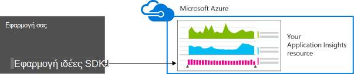
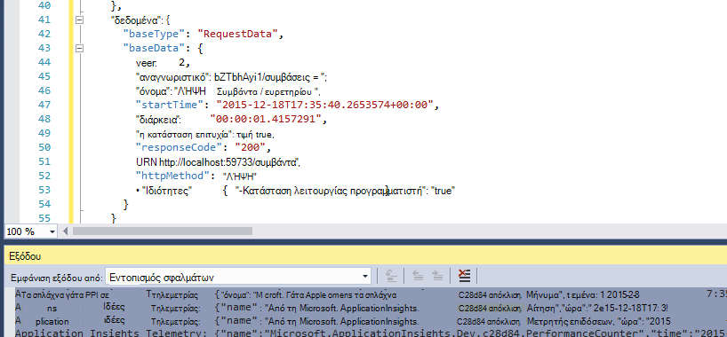
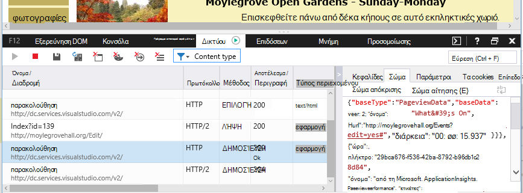

<properties 
    pageTitle="Διατήρηση δεδομένων και την αποθήκευση σε ιδέες εφαρμογής" 
    description="Δήλωση πολιτικής διατήρησης και προστασίας προσωπικών δεδομένων" 
    services="application-insights" 
    documentationCenter=""
    authors="alancameronwills" 
    manager="douge"/>

<tags 
    ms.service="application-insights" 
    ms.workload="tbd" 
    ms.tgt_pltfrm="ibiza" 
    ms.devlang="na" 
    ms.topic="article" 
    ms.date="05/17/2016" 
    ms.author="awills"/>

# Συλλογή δεδομένων, διατήρηση και αποθήκευσης στην εφαρμογή ιδέες 

*Εφαρμογή ιδέες είναι σε προεπισκόπηση.*

Κατά την εγκατάσταση του [Visual Studio εφαρμογή ιδέες] [ start] SDK στην εφαρμογή, στέλνει τηλεμετρίας σχετικά με την εφαρμογή σας στο cloud. Φυσικά, οι υπεύθυνοι προγραμματιστές θέλετε να ξέρετε ακριβώς ποια δεδομένα αποστέλλονται, τι συμβαίνει με τα δεδομένα και πώς αυτές να διατηρήσετε τον έλεγχό του. Συγκεκριμένα, ήταν δυνατή η αποστολή ευαίσθητα δεδομένα, όπου είναι αποθηκευμένες και πόσο ασφαλή είναι; 

Πρώτα, η σύντομη απάντηση:

* Οι λειτουργικές μονάδες τυπική τηλεμετρίας που εκτελούνται "Έξοδος από το πλαίσιο" είναι πιθανό να στείλετε ευαίσθητα δεδομένα για την υπηρεσία. Το τηλεμετρίας αφορά φόρτωσης, μετρικά απόδοσης και της χρήσης, εξαίρεση αναφορών και άλλων διαγνωστικών δεδομένων. Τα δεδομένα του κύριου χρήστη ορατές στις αναφορές διαγνωστικών είναι διευθύνσεις URL; αλλά την εφαρμογή σας δεν θα πρέπει να τοποθετήσετε σε κάθε περίπτωση ευαίσθητα δεδομένα σε μορφή απλού κειμένου σε μια διεύθυνση URL.
* Μπορείτε να συντάξετε κώδικα που στέλνει επιπλέον προσαρμοσμένα τηλεμετρίας για να σας βοηθήσει με εργαλεία διαγνωστικών και η χρήση παρακολούθησης. (Αυτό επεκτασιμότητα του είναι μια εξαιρετική δυνατότητα της εφαρμογής ιδέες.) Θα είναι δυνατή, κατά λάθος, για να γράψετε αυτόν τον κωδικό, έτσι ώστε να περιλαμβάνει προσωπικές και άλλα ευαίσθητα δεδομένα. Εάν η εφαρμογή σας λειτουργεί με τα δεδομένα, θα πρέπει να εφαρμόσετε ισχυρό αναθεώρηση διεργασίες στον κώδικα που συντάσσετε.
* Κατά την ανάπτυξη και τη δοκιμή της εφαρμογής σας, είναι εύκολο να ελέγξετε τι αποστέλλεται από το SDK. Τα δεδομένα εμφανίζονται στο παράθυρο εξόδου εντοπισμού σφαλμάτων της IDE και προγράμματος περιήγησης. 
* Τα δεδομένα είναι σε αναμονή στον [Microsoft Azure](http://azure.com) διακομιστών στις ΗΠΑ. (Αλλά την εφαρμογή σας μπορεί να εκτελέσει οπουδήποτε.) Azure περιλαμβάνει [ισχυρή ασφάλεια επεξεργάζεται και πληροί ένα ευρύ φάσμα πρότυπα συμμόρφωσης](https://azure.microsoft.com/support/trust-center/). Μόνο εσείς και την ομάδα που έχει οριστεί ως σας έχουν πρόσβαση στα δεδομένα σας. Microsoft προσωπικού μπορούν να έχουν περιορισμένη πρόσβαση σε αυτήν μόνο σε συγκεκριμένα περιορισμένες περιπτώσεις με τις γνώσεις σας. Αυτό είναι κρυπτογραφημένα κατά τη μεταφορά, αν και όχι σε διακομιστές.

Τα υπόλοιπα σε αυτό το άρθρο εξετάζει πιο πλήρως σε αυτές τις απαντήσεις. Το έχει σχεδιαστεί για να είναι αυτόνομη, ώστε να μπορείτε να το εμφανίσετε σε συναδέλφους που δεν αποτελούν μέρος άμεση ομάδα σας.

## Τι είναι η εφαρμογή ιδέες;

[Visual Studio εφαρμογή ιδέες] [ start] είναι μια υπηρεσία που παρέχεται από τη Microsoft που σας βοηθά να βελτιώσετε την απόδοση και τη δυνατότητα χρήσης της εφαρμογής σας live. Παρακολουθεί την εφαρμογή σας συνεχώς λειτουργεί, κατά τις δοκιμές και αφού δημοσιευτεί ή αναπτυχθεί το. Εφαρμογή ιδέες δημιουργεί γραφήματα και πίνακες που σας δείχνουν, για παράδειγμα, τι ώρες της ημέρας λάβετε οι περισσότεροι χρήστες, πώς αποκρίνεται η εφαρμογή είναι και πόσο καλά χρησιμοποιείται από οποιαδήποτε εξωτερικές υπηρεσίες, η οποία εξαρτάται. Εάν υπάρχουν παρουσιάσει σφάλμα, αποτυχίες ή ζητήματα επιδόσεων, μπορείτε να κάνετε αναζήτηση στα δεδομένα τηλεμετρίας με λεπτομέρειες για τη διάγνωση την αιτία. Και η υπηρεσία θα σας στέλνει μηνύματα ηλεκτρονικού ταχυδρομείου εάν υπάρχουν αλλαγές σε τη διαθεσιμότητα και την απόδοση της εφαρμογής σας.

Για να λάβετε αυτήν τη λειτουργικότητα, μπορείτε να εγκαταστήσετε μια εφαρμογή του SDK ιδέες στην εφαρμογή σας, η οποία γίνεται μέρος του κώδικά του. Κατά την εκτέλεση της εφαρμογής σας, το SDK παρακολουθεί τη λειτουργία και σας αποστέλλει τηλεμετρίας στην υπηρεσία εφαρμογής ιδέες. Αυτή είναι μια υπηρεσία cloud που φιλοξενούνται από το [Windows Azure](http://azure.com). (Αλλά λειτουργεί η εφαρμογή ιδέες για όλες τις εφαρμογές, όχι μόνο αυτές που φιλοξενούνται στο Azure.)

Η υπηρεσία εφαρμογής ιδέες αποθηκεύει και αναλύει την τηλεμετρίας. Για να δείτε την ανάλυση ή κάντε αναζήτηση έως την αποθηκευμένη τηλεμετρίας, πραγματοποιήστε είσοδο στο λογαριασμό σας στο Azure και ανοίξτε τον πόρο εφαρμογής ιδέες για την εφαρμογή σας. Μπορείτε επίσης να μοιραστείτε πρόσβαση στα δεδομένα με άλλα μέλη της ομάδας σας ή με το καθορισμένο Azure συνδρομητών.

Μπορείτε να έχετε δεδομένα που έχουν εξαχθεί από την υπηρεσία εφαρμογής ιδέες, για παράδειγμα σε μια βάση δεδομένων ή σε εξωτερικά εργαλεία. Μπορείτε να παράσχετε κάθε εργαλείο με ένα ειδικό κλειδί που λαμβάνετε από την υπηρεσία. Το κλειδί μπορεί να ανακληθεί, εάν είναι απαραίτητο. 

Εφαρμογή ιδέες SDK είναι διαθέσιμα για μια περιοχή τύπους εφαρμογών: υπηρεσίες που φιλοξενούνται στο δικό σας J2EE ή ASP.NET διακομιστές ή σε Azure; web στο Web προγράμματα-πελάτες - αυτό σημαίνει ότι ο κώδικας που εκτελείται σε μια σελίδα web. εφαρμογές υπολογιστή και υπηρεσιών. συσκευή εφαρμογές όπως το Windows Phone, iOS και Android. Όλα αποστολή τηλεμετρίας στην ίδια υπηρεσία.

## Ποια δεδομένα συλλέγει;

### Πώς είναι τα δεδομένα συλλέγονται;

Υπάρχουν τρεις προελεύσεις δεδομένων:

* Το SDK, το οποίο μπορείτε να ενοποιήσετε με την εφαρμογή [στο ανάπτυξης](app-insights-asp-net.md) ή [κατά το χρόνο εκτέλεσης](app-insights-monitor-performance-live-website-now.md). Υπάρχουν διαφορετικές SDK για τους τύπους άλλη εφαρμογή. Υπάρχει επίσης μια [SDK για τις ιστοσελίδες](app-insights-javascript.md), το οποίο φορτώνει στη του τελικού χρήστη του προγράμματος περιήγησης μαζί με τη σελίδα.

 * Κάθε SDK έχει έναν αριθμό [λειτουργικές μονάδες](app-insights-configuration-with-applicationinsights-config.md), που χρησιμοποιούν διαφορετικές τεχνικές για να συλλέγει διάφορους τύπους τηλεμετρίας.
 * Εάν εγκαταστήσετε το SDK ανάπτυξης, μπορείτε να χρησιμοποιήσετε το API για να στείλετε τη δική σας τηλεμετρίας, εκτός από τις βασικές λειτουργικές μονάδες. Αυτό προσαρμοσμένο τηλεμετρίας μπορούν να περιλαμβάνουν δεδομένα που θέλετε να στείλετε.
* Σε ορισμένες διακομιστές web, υπάρχουν επίσης παράγοντες που εκτελείται παράλληλα με την εφαρμογή και να στείλετε τηλεμετρίας για CPU, μνήμης και διάθεση των χώρων δικτύου. Για παράδειγμα, ΣΠΣ Azure, Docker hosts και [διακομιστές J2EE](app-insights-java-agent.md) μπορεί να έχει αυτών των παραγόντων.
* [Διαθεσιμότητα δοκιμές](app-insights-monitor-web-app-availability.md) είναι διεργασιών που εκτελούνται από τη Microsoft που αποστολή προσκλήσεων σε εφαρμογή web σε τακτά χρονικά διαστήματα. Στην υπηρεσία ιδέες εφαρμογής στην οποία αποστέλλονται τα αποτελέσματα.

### Τι είδους δεδομένα συλλέγονται;

Βασικές κατηγορίες είναι οι εξής:

* [Τηλεμετρίας διακομιστή web](app-insights-asp-net.md) - αιτήσεις HTTP.  URI, την ώρα που λαμβάνονται για να επεξεργαστείτε την αίτηση, κωδικός απόκρισης, διεύθυνση IP υπολογιστή-πελάτη. Αναγνωριστικό περιόδου λειτουργίας.
* Καταμετρά [τις ιστοσελίδες](app-insights-javascript.md) - σελίδα, χρήστη και την περίοδο λειτουργίας. Τους χρόνους φόρτωσης σελίδων. Εξαιρέσεις. Κλήσεις AJAX.
* Απόδοση μετρητές - μνήμη, CPU, εισόδου/ΕΞΌΔΟΥ, δικτύου διάθεση των χώρων.
* Πρόγραμμα-πελάτη και διακομιστή περιβάλλον - λειτουργικό σύστημα, τοπικές ρυθμίσεις, τύπος συσκευής, πρόγραμμα περιήγησης, την ανάλυση της οθόνης.
* [Εξαιρέσεις](app-insights-asp-net-exceptions.md) και παρουσιάζει σφάλμα - **ενδείξεις στοίβας**, δημιουργήστε αναγνωριστικό, τύπος CPU. 
* [Εξαρτήσεις](app-insights-asp-net-dependencies.md) - κλήσεις σε εξωτερικές υπηρεσίες, όπως τα ΥΠΌΛΟΙΠΑ, SQL, AJAX. URI ή η συμβολοσειρά σύνδεσης, διάρκεια, την επιτυχία, εντολή.
* [Διαθεσιμότητα δοκιμές](app-insights-monitor-web-app-availability.md) - τη διάρκεια της δοκιμής και βήματα, τις απαντήσεις.
* [Αρχεία καταγραφής ανίχνευσης](app-insights-search-diagnostic-logs.md) και [προσαρμοσμένα τηλεμετρίας](app-insights-api-custom-events-metrics.md) - **οτιδήποτε μπορείτε κώδικα στην αρχεία καταγραφής ή τηλεμετρίας**.

[Περισσότερες λεπτομέρειες](#data-sent-by-application-insights).

## Πώς μπορώ να επαληθεύσω τι που συλλέγονται;

Εάν αναπτύσσετε την εφαρμογή με χρήση του Visual Studio, εκτελέστε την εφαρμογή σε κατάσταση εντοπισμού σφαλμάτων (F5). Το τηλεμετρίας εμφανίζεται στο παράθυρο εξόδου. Από εκεί, μπορείτε να αντιγράψετε και να μορφοποιήσετε ως JSON για εύκολη επιθεώρηση. 

Υπάρχει επίσης μια πιο ευανάγνωστο προβολή στο παράθυρο Διαγνωστικά.

Για τις ιστοσελίδες, ανοίξτε εντοπισμού σφαλμάτων παράθυρο του προγράμματος περιήγησής σας.

### Μπορώ να συντάξω κώδικα για να φιλτράρετε τα τηλεμετρίας πριν από την αποστολή;

Αυτό είναι δυνατό με τη σύνταξη ενός [τηλεμετρίας επεξεργαστής προσθήκης](app-insights-api-filtering-sampling.md).

## Πόσος χρόνος τα δεδομένα διατηρούνται; 

Σημεία ανεπεξέργαστα δεδομένα (δηλαδή, όλα τα στοιχεία που μπορείτε να ελέγξετε σε διαγνωστικών αναζήτησης) διατηρούνται για διάστημα 7 ημερών. Εάν θέλετε να διατηρήσετε τα δεδομένα που είναι μεγαλύτερη από εκείνη που, μπορείτε να χρησιμοποιήσετε [συνεχής εξαγωγής](app-insights-export-telemetry.md) για να το αντιγράψετε σε ένα λογαριασμό του χώρου αποθήκευσης.

Συγκεντρωτικά δεδομένα (δηλαδή, πλήθος, μέσους όρους και άλλα στατιστικά στοιχεία που εμφανίζονται στην Εξερεύνηση μετρικό σύστημα) διατηρούνται στο μια ως 1 λεπτού για 30 ημέρες, και 1 ώρα ή 1 ημέρα (ανάλογα με τον τύπο) για τουλάχιστον 90 ημέρες.

## Ποιος έχει πρόσβαση στα δεδομένα;

Τα δεδομένα είναι ορατές σε εσάς και, εάν έχετε ένα λογαριασμό οργανισμού, τα μέλη της ομάδας σας. 

Μπορεί να εξαχθεί από εσάς και από μέλη της ομάδας σας και μπορεί να αντιγραφεί σε άλλες θέσεις και αντανάκλαση, σε άλλα άτομα.

#### Τι κάνει με τις πληροφορίες εφαρμογής μου στέλνει ιδέες εφαρμογής Microsoft;

Η Microsoft χρησιμοποιεί τα δεδομένα μόνο για την παροχή της υπηρεσίας για εσάς.

## Πού είναι τα δεδομένα που θα διατηρούνται; 

* Στις ΗΠΑ. 

#### Μπορεί να το αποθηκευτεί κάπου αλλού, για παράδειγμα στην Ευρώπη; 

* Δεν αυτήν τη στιγμή. 

#### Αυτό σημαίνει εφαρμογή μου έχει να φιλοξενηθούν στις ΗΠΑ;

* Όχι. Η εφαρμογή σας να εκτελέσετε οπουδήποτε, είτε σε τη δική σας hosts εσωτερικής εγκατάστασης είτε στο Cloud.

## Πόσο ασφαλή είναι τα δεδομένα μου;  

Εφαρμογή ιδέες είναι μια υπηρεσία Azure στην προεπισκόπηση. Ενώ στην προεπισκόπηση Προσπαθούμε προς την προστασία των δεδομένων σας ανά τις πολιτικές που περιγράφονται στο [Azure ασφάλεια, προστασία προσωπικών δεδομένων και συμμόρφωση λευκή βίβλος](http://go.microsoft.com/fwlink/?linkid=392408).

Τα δεδομένα αποθηκεύονται σε διακομιστές Microsoft Azure. Για τους λογαριασμούς στην πύλη του Azure, περιγράφονται τους περιορισμούς του λογαριασμού στο [Azure ασφάλεια, προστασία προσωπικών δεδομένων και συμμόρφωση εγγράφου](http://go.microsoft.com/fwlink/?linkid=392408). Για τους λογαριασμούς στην πύλη υπηρεσιών του Visual Studio ομάδας, αφορά το έγγραφο [Visual Studio ομάδας υπηρεσίες προστασία των δεδομένων](http://download.microsoft.com/download/8/E/E/8EE6A61C-44C2-4F81-B870-A267F1DF978C/MicrosoftVisualStudioOnlineDataProtection.pdf) . 

Πρόσβαση στα δεδομένα σας από το προσωπικό της Microsoft είναι περιορισμένη. Θα σας πρόσβαση στα δεδομένα σας μόνο με τα δικαιώματά σας και αν είναι απαραίτητο να υποστηρίζει τη χρήση της εφαρμογής ιδέες. 

Δεδομένων σε συγκεντρωτικό αποτέλεσμα σε εφαρμογές όλες οι πελάτες μας (όπως χρεώσεις δεδομένων και μέσο μέγεθος ανιχνεύσεις) χρησιμοποιείται για τη βελτίωση της εφαρμογής ιδέες.

#### Θα μπορούσε να τηλεμετρίας κάποιου άλλου παρεμβάλλεται με τα δεδομένα μου ιδέες εφαρμογή;

Θα μπορούσε να μπορούν να στείλουν επιπλέον τηλεμετρίας στο λογαριασμό σας, χρησιμοποιώντας το πλήκτρο οργάνων, το οποίο μπορείτε να βρείτε τον κώδικα των σελίδων σας web. Με αρκετά επιπλέον δεδομένα, τις μετρήσεις θα σωστά αντιπροσωπεύει επιδόσεις και η χρήση της εφαρμογής σας.

Εάν κάνετε κοινή χρήση κώδικα με άλλα έργα, θυμηθείτε να καταργήσετε τον αριθμό-κλειδί οργάνων.

## Τα δεδομένα είναι κρυπτογραφημένα; 

Δεν μέσα τους διακομιστές αυτήν τη στιγμή.

Όλα τα δεδομένα είναι κρυπτογραφημένα καθώς μετακινείται μεταξύ των κέντρων των δεδομένων.

#### Είναι τα δεδομένα είναι κρυπτογραφημένα κατά τη μεταφορά από εφαρμογή μου στους διακομιστές ιδέες εφαρμογή;

Ναι, χρησιμοποιούμε https για την αποστολή δεδομένων στην πύλη από σχεδόν όλων SDK, συμπεριλαμβανομένων των διακομιστές web, συσκευές και ιστοσελίδες HTTPS. Η μοναδική εξαίρεση είναι τα δεδομένα που αποστέλλονται από απλές σελίδες web HTTP. 

## Αναγνωρίσιμα προσωπικά στοιχεία

#### Μπορεί να αποσταλούν προσωπικά αναγνωρίσιμα πληροφορίες (PII) για την εφαρμογή ιδέες; 

Ναι, είναι δυνατό. 

Ως γενικές οδηγίες:

* Περισσότερα βασικά τηλεμετρίας (δηλαδή, τηλεμετρίας αποστέλλονται χωρίς να σύνταξη κώδικα) δεν περιλαμβάνει ρητές PII. Ωστόσο, είναι πιθανό να εντοπίσετε άτομα από την ανίχνευση από μια συλλογή από συμβάντα.
* Εξαίρεση και ανίχνευση μηνυμάτων μπορεί να περιέχουν PII
* Προσαρμοσμένη τηλεμετρίας - δηλαδή, τις κλήσεις όπως TrackEvent που γράφετε σε κώδικα, χρησιμοποιώντας το API ή το αρχείο καταγραφής ανιχνεύσεις - μπορούν να περιέχουν δεδομένα που επιλέγετε.

Ο πίνακας στο τέλος αυτού του εγγράφου περιέχει πιο λεπτομερείς περιγραφές των δεδομένων που έχουν συλλεχθεί.

#### Είμαι υπεύθυνοι για τη συμμόρφωση με τη νομοθεσία και τους κανονισμούς όσον αφορά PII;

Ναι. Είναι δική σας ευθύνη για να βεβαιωθείτε ότι η συλλογή και χρήση των δεδομένων συμμορφώνεται με τη νομοθεσία και τους κανονισμούς και με τους όρους της Microsoft Online Services.

Θα πρέπει να ενημερώσετε τους πελάτες σας σωστά σχετικά με τα δεδομένα συλλέγει την εφαρμογή και τον τρόπο χρήσης των δεδομένων.

#### Να τους χρήστες μου απενεργοποιήσετε ιδέες εφαρμογή;

Δεν απευθείας. Δεν παρέχουμε διακόπτη που μπορούν να λειτουργούν οι χρήστες σας για να απενεργοποιήσετε την εφαρμογή ιδέες.

Ωστόσο, μπορείτε να εφαρμόσετε μια τέτοια δυνατότητα στην εφαρμογή σας. Όλα τα SDK περιλαμβάνουν μια ρύθμιση API που απενεργοποιεί τις τηλεμετρίας συλλογής. 

#### Η εφαρμογή μου είναι κατά λάθος τη συλλογή ευαίσθητες πληροφορίες. Να ιδέες εφαρμογή ακυρώστε αυτών των δεδομένων, ώστε το δεν διατηρούνται;

Εφαρμογή ιδέες δεν φιλτράρετε ή να διαγράψει τα δεδομένα σας. Θα πρέπει να μπορείτε να διαχειριστείτε σωστά τα δεδομένα και να αποφύγετε την αποστολή τέτοιων δεδομένων σε εφαρμογή ιδέες.

## Τα δεδομένα που αποστέλλονται από εφαρμογή ιδέες

Το SDK διαφέρουν μεταξύ πλατφόρμες και είναι αρκετά στοιχεία που μπορείτε να το εγκαταστήσετε. (Αναφέρονται να [ξεκινήσετε την εφαρμογή ιδέες -][start].) Κάθε στοιχείο στέλνει διαφορετικά δεδομένα.

#### Κατηγορίες των δεδομένων που αποστέλλονται σε διαφορετικά σενάρια

Η ενέργεια  | Κατηγορίες δεδομένων που έχουν συλλεχθεί (ανατρέξτε στον επόμενο πίνακα)
---|---
[Προσθήκη εφαρμογής ιδέες SDK σε ένα έργο web .NET][greenbrown] | Περιβάλλον διακομιστή Προκύπτουν Μετρητές επιδόσεων Προσκλήσεις **Εξαιρέσεις** Την περίοδο λειτουργίας Οι χρήστες
[Εγκατάσταση Εποπτεία κατάστασης σε των υπηρεσιών IIS][redfield]|Εξαρτήσεις Περιβάλλον διακομιστή Προκύπτουν Μετρητές επιδόσεων
[Προσθήκη εφαρμογής SDK ιδέες σε μια εφαρμογή web Java][java]|Περιβάλλον διακομιστή Προκύπτουν Αίτηση Την περίοδο λειτουργίας Οι χρήστες
[Προσθήκη JavaScript SDK σε ιστοσελίδα][client]|ClientContext  Προκύπτουν Σελίδα ClientPerf AJAX
[Ορισμός προεπιλεγμένων ιδιοτήτων][apiproperties]|Σε όλα τα συμβάντα τυπικών και προσαρμοσμένων **ιδιοτήτων**
[Κλήση TrackMetric][api]|Αριθμητικές τιμές **Ιδιότητες**
[Κλήση παρακολούθηση *][api]|Όνομα συμβάντος **Ιδιότητες**
[Κλήση TrackException][api]|**Εξαιρέσεις** Ένδειξη της στοίβας **Ιδιότητες**
SDK δεν είναι δυνατό να συλλέγετε δεδομένα. Για παράδειγμα:   -δεν είναι δυνατή η πρόσβαση μετρητές επιδόσεων  -εξαίρεση στην προετοιμασία τηλεμετρίας | Διαγνωστικά SDK
 

Για [SDK για άλλες πλατφόρμες][platforms], ανατρέξτε στο θέμα έγγραφά τους.

#### Οι κατηγορίες των δεδομένων που έχουν συλλεχθεί

Δεδομένα που έχουν συλλεχθεί τάξης | Περιλαμβάνει (δεν περιλαμβάνονται στον κατάλογο) 
---|---
**Ιδιότητες**|**Οποιαδήποτε δεδομένα - καθορίζεται από τον κωδικό**
DeviceContext |Αναγνωριστικό, IP, τοπικές ρυθμίσεις, μοντέλο της συσκευής, δικτύου, τύπος δικτύου, όνομα OEM, την ανάλυση της οθόνης, την παρουσία ρόλο, όνομα ρόλου, τύπος συσκευής
ClientContext |Λειτουργικό σύστημα, τοπικές ρυθμίσεις, δικτύου, γλώσσας ανάλυση παραθύρου
Την περίοδο λειτουργίας | αναγνωριστικό περιόδου λειτουργίας
Περιβάλλον διακομιστή |Το όνομα του υπολογιστή, τοπικές ρυθμίσεις, λειτουργικό σύστημα, συσκευής, περίοδο λειτουργίας χρήστη, περιβάλλοντος χρήστη, η λειτουργία 
Προκύπτουν |θέση παν από τη διεύθυνση IP, χρονική σήμανση, λειτουργικό σύστημα, πρόγραμμα περιήγησης
Μετρήσεις | Μετρικό όνομα και την τιμή
Συμβάντα | Όνομα συμβάντος και τιμή
PageViews | Όνομα διεύθυνσης URL και της σελίδας ή οθόνης
Επιδόσεων υπολογιστή-πελάτη | Όνομα διεύθυνσης URL/σελίδας, ο χρόνος φόρτωσης προγράμματος περιήγησης
AJAX | HTTP κλήσεις από την ιστοσελίδα στο διακομιστή
Προσκλήσεις |Διεύθυνση URL, διάρκεια, κωδικός απόκρισης
Εξαρτήσεις|Τύπος (SQL, HTTP,...), συμβολοσειρά σύνδεσης ή URI, συγχρονισμού/ασύγχρονης, διάρκεια, την επιτυχία, πρόταση SQL (με την κατάσταση οθόνη)
**Εξαιρέσεις** | Τύπος, το **μήνυμα**, στοίβες κλήσης, αριθμός αρχείου και γραμμή προέλευσης, αναγνωριστικό νήματος
Παρουσιάζει σφάλμα | Αναγνωριστικό διεργασίας, γονικό αναγνωριστικό διεργασίας, αναγνωριστικό νήματος σφάλμα. Εφαρμογή ενημέρωσης κώδικα, αναγνωριστικό, Δόμηση;  Τύπος εξαίρεσης, διεύθυνση, λόγο. θολού συμβόλων και μητρώα, δυαδικό διευθύνσεις έναρξης και λήξης, δυαδικό όνομα και διαδρομή, τύπος cpu
Ανίχνευση | **Μήνυμα** και της σοβαρότητας επιπέδου
Μετρητές επιδόσεων | Χρόνος επεξεργασίας, διαθέσιμη μνήμη, ρυθμό αίτησης, εξαίρεση επιτόκιο, διαδικασία ιδιωτικών byte, ταχύτητα εισόδου/ΕΞΌΔΟΥ, διάρκεια αίτησης, μήκος ουράς αιτήσεων
Διαθεσιμότητα | Κωδικός απόκρισης δοκιμής Web, τη διάρκεια της κάθε βήμα έλεγχος, έλεγχος ονομάτων, χρονικής σήμανσης, επιτυχίας, χρόνος απόκρισης, θέση δοκιμής
Διαγνωστικά SDK | Ανίχνευση μηνύματος ή εξαίρεσης 

Μπορείτε να κάνετε [Εναλλαγή απενεργοποιήσετε ορισμένα από τα δεδομένα από ApplicationInsights.config επεξεργασίας][config]

## Πιστώσεων

Αυτό το προϊόν περιλαμβάνει GeoLite2 δεδομένων που δημιουργούνται από MaxMind, διαθέσιμο από [http://www.maxmind.com](http://www.maxmind.com).

## Βίντεο

#### Εισαγωγή

> [AZURE.VIDEO application-insights-introduction]

#### Γρήγορα αποτελέσματα

> [AZURE.VIDEO getting-started-with-application-insights]

<!--Link references-->

[api]: app-insights-api-custom-events-metrics.md
[apiproperties]: app-insights-api-custom-events-metrics.md#properties
[client]: app-insights-javascript.md
[config]: app-insights-configuration-with-applicationinsights-config.md
[greenbrown]: app-insights-asp-net.md
[java]: app-insights-java-get-started.md
[platforms]: app-insights-platforms.md
[pricing]: http://azure.microsoft.com/pricing/details/application-insights/
[redfield]: app-insights-monitor-performance-live-website-now.md
[start]: app-insights-overview.md

 