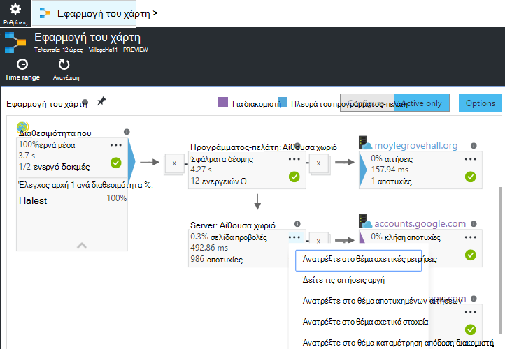
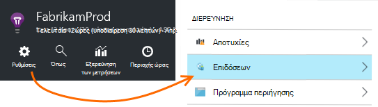
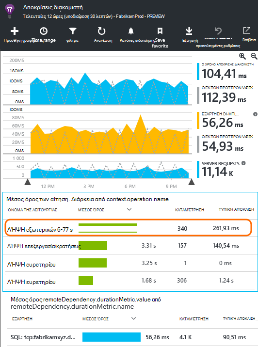
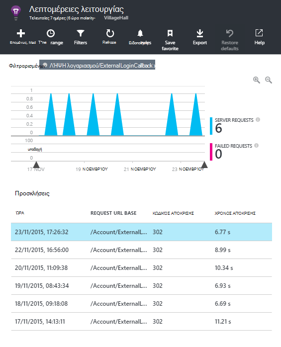
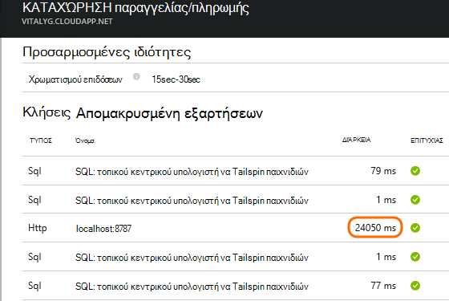
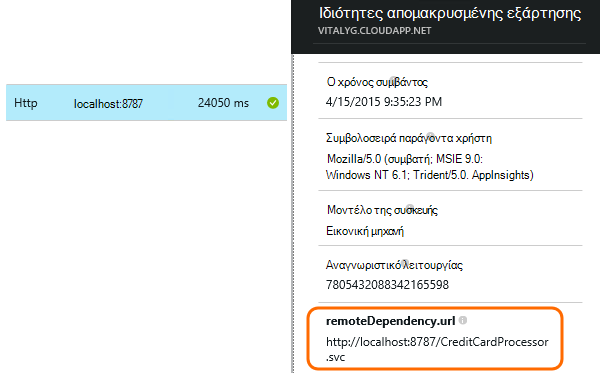
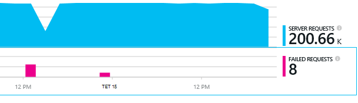
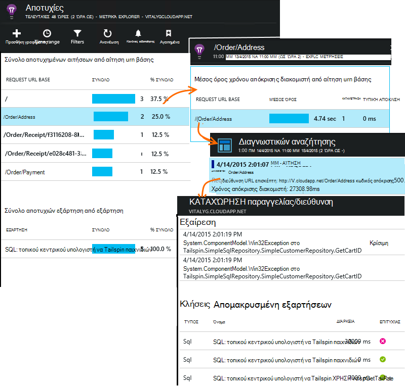

<properties 
    pageTitle="Διάγνωση θεμάτων με τις εξαρτήσεις στην εφαρμογή ιδέες" 
    description="Εύρεση αποτυχίες και χαμηλές επιδόσεις που προκαλούνται από τις εξαρτήσεις" 
    services="application-insights" 
    documentationCenter=""
    authors="alancameronwills" 
    manager="douge"/>

<tags 
    ms.service="application-insights" 
    ms.workload="tbd" 
    ms.tgt_pltfrm="ibiza" 
    ms.devlang="na" 
    ms.topic="article" 
    ms.date="05/12/2016" 
    ms.author="awills"/>
 
# <a name="diagnosing-issues-with-dependencies-in-application-insights"></a>Διάγνωση θεμάτων με τις εξαρτήσεις στην εφαρμογή ιδέες


*Εξάρτηση* είναι ένα εξωτερικό στοιχείο που ονομάζεται από την εφαρμογή σας. Συνήθως, είναι μια υπηρεσία που ονομάζεται χρησιμοποιώντας HTTP, μια βάση δεδομένων ή ένα σύστημα αρχείων. Ή στη δέσμη ενεργειών σας ιστοσελίδα, μπορεί να είναι μια κλήση AJAX στο διακομιστή. Στο Visual Studio ιδέες εφαρμογή, μπορείτε να δείτε εύκολα πόσο χρόνο αναμονής της εφαρμογής σας για εξαρτήσεις και πόσο συχνά κλήσης εξάρτηση αποτυγχάνει.

## <a name="where-you-can-use-it"></a>Πού μπορείτε να το χρησιμοποιήσετε

Έξοδος από το πλαίσιο παρακολούθησης εξάρτηση είναι τώρα διαθέσιμο για:

* Εφαρμογές web ASP.NET και υπηρεσίες που εκτελούνται σε ένα διακομιστή των υπηρεσιών IIS ή στο Azure
* [Εφαρμογές web της Java](app-insights-java-agent.md)
* [Ιστοσελίδες](https://azure.microsoft.com/blog/ajax-collection-in-application-insights/)

Για άλλους τύπους, όπως εφαρμογές συσκευής, μπορείτε να συντάξετε το δικό σας με χρήση του [TrackDependency API](app-insights-api-custom-events-metrics.md#track-dependency)οθόνη.

Η οθόνη εξάρτηση εκτός του πλαισίου αναφορές αυτήν τη στιγμή κλήσεις σε αυτούς τους τύπους εξαρτήσεων:

* ASP.NET
 * Βάσεις δεδομένων SQL
 * ASP.NET web και υπηρεσίες WCF που χρησιμοποιούν συνδέσεις που βασίζονται σε HTTP
 * Τοπική ή απομακρυσμένη κλήσεις HTTP
 * Azure DocumentDb, πίνακα, χώρος αποθήκευσης αντικειμένων blob και ουρά
* Java
 * Κλήσεις σε μια βάση δεδομένων μέσω ενός προγράμματος οδήγησης [JDBC](http://docs.oracle.com/javase/7/docs/technotes/guides/jdbc/) , όπως MySQL, SQL Server, PostgreSQL ή SQLite.
* Ιστοσελίδες
 * [Κλήσεις AJAX](app-insights-javascript.md)

Και πάλι, μπορείτε να συντάξετε το δικό σας κλήσεις SDK για την παρακολούθηση άλλων εξαρτήσεις.

## <a name="to-set-up-dependency-monitoring"></a>Για να ρυθμίσετε την παρακολούθηση εξάρτησης

Εγκαταστήστε το κατάλληλο παράγοντας για τον κεντρικό υπολογιστή διακομιστή.

Πλατφόρμα | Εγκατάσταση
---|---
Διακομιστής των υπηρεσιών IIS | Είτε [εγκατάσταση Εποπτεία κατάστασης στο διακομιστή σας](app-insights-monitor-performance-live-website-now.md) ή να [αναβαθμίσετε την εφαρμογή με το .NET framework 4.6 ή νεότερη έκδοση](http://go.microsoft.com/fwlink/?LinkId=528259) και εγκατάστασης του [SDK ιδέες εφαρμογής](app-insights-asp-net.md) στην εφαρμογή.
Azure Web App | [Επέκταση ιδέες εφαρμογής](app-insights-azure-web-apps.md)
Διακομιστής web Java | [Εφαρμογές web της Java](app-insights-java-agent.md)
Ιστοσελίδες | [Οθόνη JavaScript](app-insights-javascript.md) (Χωρίς επιπλέον ρύθμιση εκτός από την παρακολούθηση ιστοσελίδα)
Υπηρεσία Azure Cloud |  [Χρήση εκκίνησης εργασία](app-insights-cloudservices.md#dependencies) ή [εγκατάσταση του .NET framework 4.6 +](../cloud-services/cloud-services-dotnet-install-dotnet.md)  

Την οθόνη κατάσταση για τους διακομιστές IIS δεν χρειάζεται να δημιουργήσετε ξανά το έργο σας προέλευσης με SDK ιδέες για την εφαρμογή. 

## <a name="application-map"></a>Εφαρμογή του χάρτη

Εφαρμογή του χάρτη λειτουργεί ως οπτικό βοήθημα για να εντοπισμός εξαρτήσεις μεταξύ των στοιχείων της εφαρμογής σας. 



Από τα πλαίσια, μπορείτε να περιηγηθείτε σε σχετικό εξάρτηση και άλλα γραφήματα.

Κάντε κλικ στο μικρό [x] για να συμπτύξετε ένα δευτερεύον δέντρο.

Καρφίτσωμα του χάρτη στον πίνακα [εργαλείων](app-insights-dashboards.md), όπου θα είναι πλήρως λειτουργικό.

[Μάθετε περισσότερα](app-insights-app-map.md).

## <a name="diagnosis"></a>Διάγνωση θεμάτων επιδόσεων εξάρτηση στο διακομιστή web

Για να αξιολογήσετε τις επιδόσεις της αιτήσεις στο διακομιστή σας:



Κάντε κύλιση προς τα κάτω, ανατρέξτε στο πλέγμα των αιτήσεων:



Επάνω αυτό διαρκεί πολύ χρόνο. Ας δούμε εάν θα σας να μάθετε πού δαπανάται την ώρα.

Κάντε κλικ σε αυτήν τη γραμμή για να δείτε μεμονωμένες αίτηση συμβάντα:




Κάντε κλικ σε οποιαδήποτε παρουσία μεγάλη διάρκεια εκτέλεσης για να ελέγξετε την περαιτέρω.

> [AZURE.NOTE] Κάντε κύλιση προς τα κάτω για να επιλέξετε μια παρουσία λίγο. Λανθάνων χρόνος στη διοχέτευση μπορεί να σημαίνει ότι τα δεδομένα για τις κύριες παρουσίες είναι ελλιπής.

Κάντε κύλιση προς τα κάτω για τις κλήσεις απομακρυσμένης εξάρτηση που σχετίζονται με αυτήν την αίτηση:



Εμφανίζεται μεγαλύτερο μέρος του χρόνου συντήρησης αυτής της αίτησης αφιερώθηκε σε μια κλήση σε μια τοπική υπηρεσία. 

Επιλέξτε αυτήν τη γραμμή για να λάβετε περισσότερες πληροφορίες:




Οι λεπτομέρειες περιλαμβάνει επαρκείς πληροφορίες για να εντοπίσετε το πρόβλημα.


## <a name="failures"></a>Αποτυχίες

Εάν υπάρχουν αποτυχημένων αιτήσεων, κάντε κλικ στο γράφημα.



Κάντε κλικ στις έναν τύπο αίτησης και μια αίτηση παρουσία, για να βρείτε μια αποτυχίας κλήση σε έναν απομακρυσμένο εξάρτηση.





## <a name="custom-dependency-tracking"></a>Προσαρμοσμένη εξάρτηση παρακολούθησης

Η βασική λειτουργική μονάδα εξάρτηση παρακολούθησης εντοπίζει αυτόματα εξωτερικές εξαρτήσεις, όπως βάσεις δεδομένων και REST API του Yammer. Αλλά μπορεί να θέλετε ορισμένες πρόσθετα στοιχεία που αντιμετωπίζεται με τον ίδιο τρόπο. 

Μπορείτε να συντάξετε κώδικα που στέλνει πληροφορίες για τις εξαρτήσεις, χρησιμοποιώντας το ίδιο [TrackDependency API](app-insights-api-custom-events-metrics.md#track-dependency) που χρησιμοποιείται από τις βασικές λειτουργικές μονάδες.

Για παράδειγμα, εάν δημιουργείτε τον κωδικό με ένα σύνολο που δεν μπορείτε να συντάξετε στον εαυτό σας, θα μπορούσε να χρόνο όλων των κλήσεων σε αυτό, για να μάθετε ποιες συνεισφορά που έχει τις χρονικές περιόδους την απάντησή σας. Για να διατηρήσετε αυτά τα δεδομένα εμφανίζονται σε τα γραφήματα εξάρτηση στην εφαρμογή ιδέες, στείλτε τη χρησιμοποιώντας `TrackDependency`.

```C#

            var success = false;
            var startTime = DateTime.UtcNow;
            var timer = System.Diagnostics.Stopwatch.StartNew();
            try
            {
                success = dependency.Call();
            }
            finally
            {
                timer.Stop();
                telemetry.TrackDependency("myDependency", "myCall", startTime, timer.Elapsed, success);
            }
```

Εάν θέλετε να μεταβείτε εκτός της λειτουργικής μονάδας παρακολούθησης τυπική εξάρτηση, καταργήστε την αναφορά σε DependencyTrackingTelemetryModule σε [ApplicationInsights.config](app-insights-configuration-with-applicationinsights-config.md).


## <a name="ajax"></a>AJAX

Ανατρέξτε στο θέμα [σελίδες Web](app-insights-javascript.md).


 