<properties
    pageTitle="Εντοπισμός, διαλογής, διάγνωση"
    description="Αναλύει παρουσιάσει σφάλμα και εντοπισμός και διάγνωση θεμάτων επιδόσεων στις εφαρμογές σας"
    authors="alancameronwills"
    services="application-insights"
    documentationCenter=""
    manager="douge"/>

<tags
    ms.service="application-insights"
    ms.workload="tbd"
    ms.tgt_pltfrm="ibiza"
    ms.devlang="na"
    ms.topic="article" 
    ms.date="11/06/2015"
    ms.author="awills"/>

# Εντοπισμός, διαλογής και διάγνωση με ιδέες εφαρμογής

*Εφαρμογή ιδέες είναι σε προεπισκόπηση.*

Εφαρμογή σάς βοηθά ιδέες που μπορείτε να μάθετε πώς αποδίδει την εφαρμογή σας και να χρησιμοποιείται όταν είναι live. Και, εάν υπάρχει πρόβλημα, σας επιτρέπει να γνωρίζετε σχετικά με αυτό σας βοηθά να αξιολογήσετε τις επιπτώσεις και σάς βοηθά να προσδιορίσετε την αιτία.

Ακολουθεί ένα λογαριασμό από μια ομάδα που αναπτύσσει εφαρμογές web:

* *"Δύο ημέρες, θα σας αναπτυχθεί 'μικρή' επείγουσα επιδιόρθωση. Δεν μπορούμε να εκτελέσουμε μια φάση γενικά δοκιμής, αλλά Δυστυχώς ορισμένα μη αναμενόμενη αλλαγή στη διάθεσή σας συγχωνεύονται σε το φορτίο, προκαλεί ασυμβατότητα μεταξύ της εμπρός και πίσω άκρα. Αμέσως, ενεργοποιείται μας ειδοποίηση surged εξαιρέσεις διακομιστή, και θα σας πραγματοποιήθηκαν υπόψη της κατάστασης. Μερικά κλικ εκτός οθόνης στην πύλη εφαρμογής ιδέες, θα σας στη διάθεσή σας αρκετές πληροφορίες από callstacks εξαίρεση για να περιορίσετε το πρόβλημα. Προσπαθούμε να επανέλθει αμέσως και περιορίζεται η ζημιά. Εφαρμογή ιδέες έχει κάνει αυτό το τμήμα της το devops κυκλική εναλλαγή πολύ εύκολη και εύχρηστα."*

Ας δούμε πώς μια ομάδα ανάπτυξης τυπικές web χρησιμοποιεί ιδέες εφαρμογής για να παρακολουθείτε τις επιδόσεις. Θα σας θα ακολουθήσετε την ομάδα στην Τράπεζα Fabrikam που αναπτύσσει το σύστημα ηλεκτρονικών τραπεζικών εργασιών (OBS).

Η ομάδα λειτουργεί σε έναν κύκλο ως εξής:

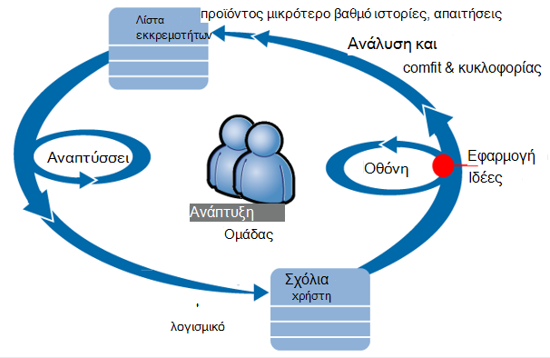

Απαιτήσεις τροφοδοσίας σε τους λίστας εκκρεμοτήτων ανάπτυξης (λίστα εργασιών). Με λίγα λόγια λειτουργούν διεργασιών, η οποία συχνά παράδοση λογισμικού εργασία - συνήθως με τη μορφή βελτιώσεις και επεκτάσεις στην υπάρχουσα εφαρμογή. Η εφαρμογή ζωντανή συχνά ενημερώνεται με τις νέες δυνατότητες. Ενώ είναι ζωντανή, στην ομάδα την παρακολουθεί για απόδοσης και της χρήσης με τη Βοήθεια της εφαρμογής ιδέες. Αυτή η ανάλυση τροφοδοσίες πάλι στο τους λίστας εκκρεμοτήτων ανάπτυξης.

Η ομάδα χρησιμοποιεί εφαρμογή ιδέες για την παρακολούθηση της εφαρμογής web ζωντανή στενά για:
* Επιδόσεων. Που θέλουν να κατανοήσετε τον τρόπο χρόνους απόκρισης διαφέρουν ανάλογα με τη μέτρηση αιτήσεων, πόσο CPU, δικτύου, δίσκο και άλλους πόρους που χρησιμοποιούνται; και όπου το συνωστισμών.
* Αποτυχίες. Εάν υπάρχουν εξαιρέσεις ή απέτυχε αιτήσεις, ή εάν μετρητή επιδόσεων μεταβαίνει εκτός της περιοχής του άνετα, στην ομάδα πρέπει να γνωρίζετε γρήγορα, ώστε να μπορούν να πάρουν ενέργεια.
* Χρήση. Όποτε κυκλοφορήσει μια νέα δυνατότητα, την ομάδα θέλετε να γνωρίζετε σε ποιο βαθμό χρησιμοποιείται και, εάν οι χρήστες έχουν δυσκολίες με αυτό.

Ας εστίαση στο τμήμα σχολίων του κύκλου:

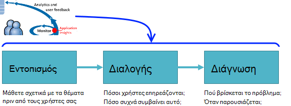

## Εντοπισμός κακή διαθεσιμότητα

Marcela Markova είναι μια Εκπαιδευτική εκδρομή προγραμματιστή της ομάδας για OBS και λαμβάνει τον υποψήφιο πελάτη στην παρακολούθηση των επιδόσεων. Κάνει ρυθμίζει διάφορες [δοκιμές web][availability]:

* Δοκιμή μίας-διεύθυνση URL για τη σελίδα υποδοχής κύριο για την εφαρμογή, http://fabrikambank.com/onlinebanking/. Χρήστης ορίζει κριτήρια κωδικό HTTP 200 και κειμένου 'Καλώς ορίσατε'!. Εάν η δοκιμή αποτύχει, υπάρχει κάτι σοβαρά πρόβλημα με το δίκτυο ή των διακομιστών ή μήπως ένα ζήτημα ανάπτυξης. (Ή κάποιος έχει αλλάξει Καλώς ορίσατε! μήνυμα στη σελίδα χωρίς να εκφράζετε της γνωρίζουν.)

* Βαθύτερη πολλών βήμα δοκιμή, το οποίο συνδέεται και λαμβάνει ένα λογαριασμό τρέχουσα καταχώρηση, ο έλεγχος μερικές σημαντικές λεπτομέρειες σε κάθε σελίδα. Αυτή η δοκιμή επαληθεύει ότι λειτουργεί η σύνδεση στη βάση δεδομένων λογαριασμών. Στο παράθυρο χρησιμοποιεί ένα αναγνωριστικό πελάτη φανταστικά: μερικές από τις διατηρούνται για σκοπούς δοκιμής.

Με αυτές τις δοκιμές ρύθμιση, Marcela είναι βέβαιοι ότι η ομάδα θα γνωρίζετε γρήγορα σχετικά με οποιαδήποτε μη διαθεσιμότητα.  

Αποτυχίες εμφανίζεται ως κόκκινες κουκκίδες στο γράφημα δοκιμής web:

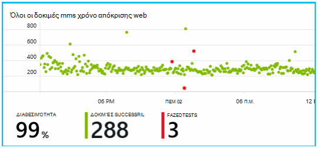

Αλλά σημαντικότερο, θα είναι ή στείλατε μια ειδοποίηση σχετικά με οποιαδήποτε αποτυχία στην ομάδα ανάπτυξης. Με αυτόν τον τρόπο, θα γνωρίζουν για αυτό πριν από σχεδόν όλους τους πελάτες.

## Οθόνη μετρικών απόδοσης

Στη σελίδα Επισκόπηση στην εφαρμογή ιδέες, υπάρχει ένα γράφημα που εμφανίζει μια ποικιλία [κλειδιού μετρικά][perf].

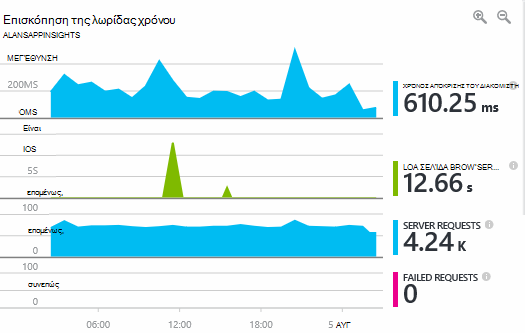

Ο χρόνος φόρτωσης περιήγησης σελίδας προέρχεται από τηλεμετρίας αποστέλλονται απευθείας από σελίδες web. Χρόνος απόκρισης διακομιστή, μέτρηση αιτήσεων διακομιστή και μέτρηση αποτυχημένων αιτήσεων είναι όλα υπολογίζεται σε διακομιστή web και να σταλούν σε εφαρμογή ιδέες από εκεί.

Marcela ενδιαφέρεται ελαφρώς στο στο γράφημα απόκριση διακομιστή, η οποία εμφανίζει ο μέσος χρόνος μεταξύ όταν ο διακομιστής λαμβάνει μια αίτηση HTTP από πρόγραμμα περιήγησης ενός χρήστη και, όταν η συνάρτηση επιστρέφει την απάντηση. Δεν είναι ασυνήθιστο για να δείτε μια παραλλαγή σε αυτό το γράφημα, όπως ποικίλλει φόρτωση στο σύστημα. Αλλά σε αυτήν την περίπτωση, φαίνεται να είναι ένα συσχέτισης μεταξύ μικρές αυξάνεται στην καταμέτρηση των αιτήσεων, και μεγάλο αυξάνεται το χρόνο απόκρισης. Που μπορεί να υποδεικνύουν ότι το σύστημα λειτουργεί μόνο με τα όρια. 

Κάνει ανοίγει τα γραφήματα διακομιστές:

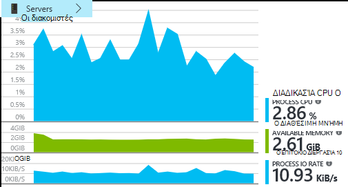

Δεν φαίνεται να χωρίς πρόσημο περιορισμού πόρων εκεί, επομένως ίσως το χτυπήματα στα γραφήματα απόκριση διακομιστή είναι απλώς μια ότι.

## Ειδοποιήσεις

Ωστόσο, θα θέλατε να να παρακολουθείτε τις ώρες απόκρισης. Όταν μεταβαίνουν πολύ υψηλό, θέλει να γνωρίζετε σχετικά με το αμέσως.

Ώστε να κάνει ορίζει ένα [ειδοποιήσεις][metrics], για το χρόνο απόκρισης μεγαλύτερο από ένα τυπικό όριο. Το αποτέλεσμα της εμπιστοσύνης που θα κάνει να γνωρίζετε σχετικά με το εάν οι χρόνοι απόκρισης είναι αργή.

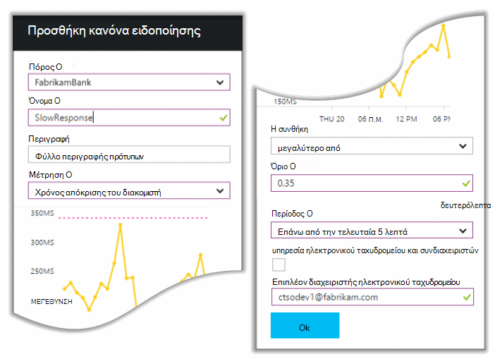

Ειδοποιήσεις μπορεί να οριστεί σε μια μεγάλη ποικιλία άλλες μετρήσεις. Για παράδειγμα, μπορείτε να λαμβάνετε μηνύματα ηλεκτρονικού ταχυδρομείου, εάν το πλήθος εξαίρεση γίνεται υψηλή ή τη διαθέσιμη μνήμη μεταβαίνει χαμηλή ή εάν υπάρχει μια κορύφωσης στην αιτήσεις προγράμματος-πελάτη.

## Πριν από την ενεργοποίηση ειδοποιήσεων διαγνωστικών

Επόμενη ημέρα, άφιξη μηνύματος ειδοποίησης ηλεκτρονικού ταχυδρομείου από εφαρμογή ιδέες. Αλλά όταν θα ανοίξει, βρίσκει που δεν είναι στην ειδοποίηση χρόνου απόκρισης που θα ορίσετε. Αντί για αυτό, ενημερώνει εκείνη έχει μια απότομη αύξηση αποτυχημένων αιτήσεων - δηλαδή, αιτήσεις που έχουν επιστραφεί αποτυχία κώδικες 500 ή περισσότερα.

Οι αιτήσεις αποτυχίας είναι όπου οι χρήστες είδατε ένα σφάλμα - συνήθως ακολουθώντας μια εξαίρεση στον κώδικα. Μήπως μπορούν να δουν ένα μήνυμα αναφέρει ότι "Λυπούμαστε δεν ήταν δυνατό να ενημερώσουμε λεπτομέρειες σας αυτήν τη στιγμή" ή, σε απόλυτη embarrassing χειρότερη περίπτωση, μια ένδειξη της στοίβας στην οθόνη του χρήστη, από το διακομιστή web.

Αυτή η ειδοποίηση είναι μια εκπλήξεις, επειδή την τελευταία φορά που βλέπατε, το πλήθος αποτυχημένων αιτήσεων ήταν encouragingly χαμηλό. Ένα μικρό αριθμό αποτυχιών είναι η αναμενόμενη σε έναν απασχολημένο διακομιστή. 

Ήταν επίσης ένα bit από μια εκπλήξεις για εκείνη επειδή ο χρήστης δεν χρειάζεται να ρυθμίσετε αυτήν την ειδοποίηση. Στην πραγματικότητα, πριν από την ενεργοποίηση Διαγνωστικά παρέχεται αυτόματα με τις ιδέες εφαρμογής. Το αυτόματα προσαρμόζεται για να μοτίβο συνήθη την αποτυχία της εφαρμογής σας και αποτυχίες "λαμβάνει χρησιμοποιείται για την" σε μια συγκεκριμένη σελίδα ή υψηλός φόρτος ή συνδέονται με άλλες μετρήσεις. Ανάγει την ειδοποίηση μόνο εάν υπάρχει μια αύξηση παραπάνω τι θα πρέπει να περιμένουν.

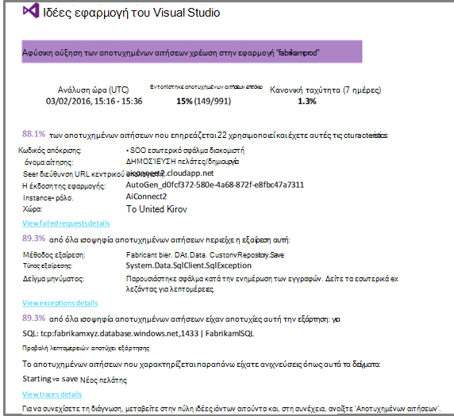

Αυτό είναι ένα πολύ χρήσιμο ηλεκτρονικού ταχυδρομείου. Το απλώς δεν βελτιώσετε μια ηχητική ειδοποίηση; κάνει πάρα πολλά της διαλογής και διαγνωστικών εργασίας.

Εμφανίζει επηρεάζονται πόσες πελάτες, και ποιες σελίδες web ή λειτουργίες. Marcela να αποφασίσετε αν πρέπει να λάβετε την εργασία για αυτή την επιλογή ως εμφάνιση λεπτομερειών fire ολόκληρη η ομάδα ή αν μπορεί να αγνοηθεί μέχρι την επόμενη εβδομάδα.

Το μήνυμα ηλεκτρονικού ταχυδρομείου εμφανίζει επίσης ότι μια συγκεκριμένη εξαίρεση Παρουσιάστηκε και - ακόμα πιο ενδιαφέρουσα - ότι το σφάλμα είναι συσχετισμένη με αποτυχημένων κλήσεων σε μια συγκεκριμένη βάση δεδομένων. Αυτό εξηγεί γιατί το σφάλμα εμφανίζονταν ξαφνικά Παρόλο που τα Marcela της ομάδας έχει δεν έχει αναπτυχθεί οι ενημερώσεις πρόσφατα. 

Χρήστης κάνει ping ο επικεφαλής της ομάδας βάσης δεδομένων. Ναι, τους κυκλοφορήσει μια ενημερωμένη έκδοση κώδικα σε προηγούμενες μισή ώρα; και Λυπάμαι, ίσως ενδέχεται να υπήρξε μια αλλαγή σχήματος μικρή...

Επομένως, το πρόβλημα βρίσκεται στη ο τρόπος για να είναι σταθερή, ακόμα και πριν από την έρευνα αρχεία καταγραφής και μέσα σε 15 λεπτά από αυτό που προκύπτει. Ωστόσο, Marcela κάνει κλικ στη σύνδεση για να ανοίξετε την εφαρμογή ιδέες. Ανοίγει απευθείας σε μια αίτηση απέτυχε και ότι μπορούν να δουν καλέσετε τη σχετική λίστα κλήσεων εξάρτηση βάσης δεδομένων απέτυχε. 

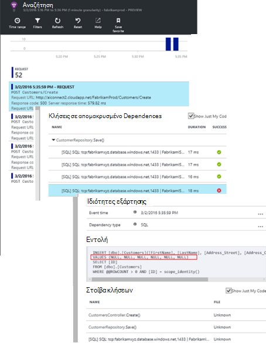

## Εντοπισμός εξαιρέσεις

Με λίγο της ρύθμισης, [Εξαιρέσεις](app-insights-asp-net-exceptions.md) , αναφέρονται ιδέες εφαρμογή αυτόματα. Αυτές μπορούν επίσης να καταγραφούν ρητά, εισάγοντας κλήσεων στο [TrackException()](app-insights-api-custom-events-metrics.md#track-exception) στον κώδικα:  

    var telemetry = new TelemetryClient();
    ...
    try
    { ...
    }
    catch (Exception ex)
    {
       // Set up some properties:
       var properties = new Dictionary <string, string>
         {{"Game", currentGame.Name}};

       var measurements = new Dictionary <string, double>
         {{"Users", currentGame.Users.Count}};

       // Send the exception telemetry:
       telemetry.TrackException(ex, properties, measurements);
    }

Στην ομάδα τράπεζα Fabrikam έχει εξελιχθεί πρακτική εξάσκηση πάντα αποστολής τηλεμετρίας σε μια εξαίρεση, εκτός εάν υπάρχει μια εμφανή αποκατάστασης.  

Στην πραγματικότητα, τους στρατηγική είναι ακόμα ευρύτερη από αυτά: Αποστολή τηλεμετρίας σε κάθε περίπτωση όπου ο πελάτης είναι αγχωμένο σε τι που θέλει να κάνετε, αν το αντιστοιχεί σε μια εξαίρεση στον κώδικα ή όχι. Για παράδειγμα, εάν το σύστημα εξωτερικών μεταξύ τραπεζική μεταφορά επιστρέφει ένα μήνυμα "δεν είναι δυνατό να ολοκληρώσετε αυτήν τη συναλλαγή" για κάποιο λόγο λειτουργικές (χωρίς σφάλμα του πελάτη), στη συνέχεια, παρακολουθούν αυτό το συμβάν.

    var successCode = AttemptTransfer(transferAmount, ...);
    if (successCode < 0)
    {
       var properties = new Dictionary <string, string>
            {{ "Code", returnCode, ... }};
       var measurements = new Dictionary <string, double>
         {{"Value", transferAmount}};
       telemetry.TrackEvent("transfer failed", properties, measurements);
    }

TrackException χρησιμοποιείται για την αναφορά εξαιρέσεις επειδή στέλνει ένα αντίγραφο των στοιχείων ελέγχου. TrackEvent χρησιμοποιείται για την αναφορά άλλα συμβάντα. Μπορείτε να επισυνάψετε οποιεσδήποτε ιδιότητες που μπορεί να είναι χρήσιμη σε διάγνωση.

Εξαιρέσεις και τα συμβάντα εμφανίζονται στο [Διαγνωστικών αναζήτησης] [ diagnostic] blade. Μπορείτε να κάνετε γενίκευση σε αυτά για να δείτε τις πρόσθετες ιδιότητες και παρακολούθηση στοίβας.

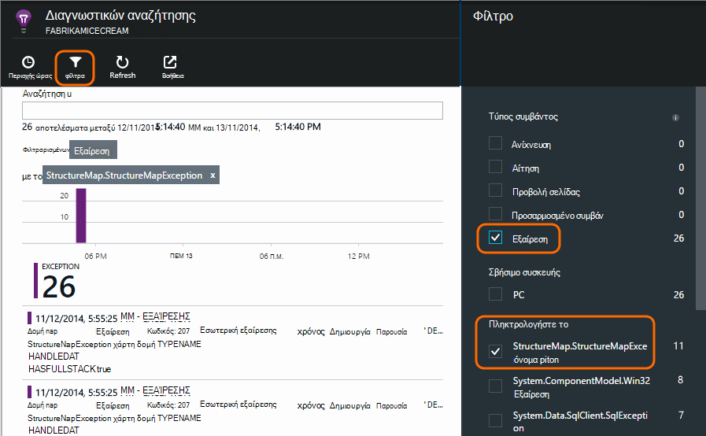

## Παρακολούθηση της δραστηριότητας του χρήστη

Όταν χρόνος απόκρισης είναι καλή με συνέπεια και υπάρχουν μερικές εξαιρέσεις, στην ομάδα αποκλίσεις μπορεί να σκεφτείτε πώς μπορείτε να βελτιώσετε την εμπειρία των χρηστών και πώς να ενθαρρύνετε τους περισσότερους χρήστες για να επιτύχετε τους στόχους επιθυμητή.

Για παράδειγμα, ένα ταξίδι τυπικές χρήστη μέσω της τοποθεσίας web περιλαμβάνει ένα Απαλοιφή 'χωνί': πολλοί πελάτες, εξετάστε τις χρεώσεις από διαφορετικούς τύπους από δανείου Ορισμένες από αυτές συμπληρώστε τη φόρμα προσφοράς; και εκείνων που λαμβάνουν ένα απόσπασμα, προχωρήστε μερικές και απομάκρυνση δανείου.

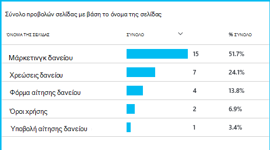

Εξετάζοντας όπου η μεγαλύτερη τους αριθμούς των πελατών απόρριψη, την επιχείρηση να εργαστείτε πώς μπορείτε να κάνετε περισσότεροι χρήστες προς τα κάτω από την ομαδοποίηση. Σε ορισμένες περιπτώσεις ίσως να υπάρχουν αποτυχία (UX) την εμπειρία χρήστη - για παράδειγμα, το κουμπί "Επόμενο" είναι δύσκολο να βρείτε ή δεν είναι εμφανή τις οδηγίες. Πιθανότερο, υπάρχουν πιο σημαντική επιχειρήσεις λόγοι για απόθεσης ανάληψης: μήπως οι συντελεστές δανείου είναι πολύ υψηλή.

Ανεξάρτητα από τους λόγους, τα δεδομένα σας βοηθά στην ομάδα εργασίας εκτός τι κάνουν οι χρήστες. Παρακολούθηση κλήσεων μπορούν να εισαχθούν ώστε να λειτουργεί εκτός περισσότερες λεπτομέρειες. TrackEvent() μπορεί να χρησιμοποιηθεί για να μετρήσετε τις ενέργειες χρηστών, από το λεπτομέρειας των μεμονωμένων κουμπί κλικ για να σημαντική επιτεύγματα όπως πληρωμής απενεργοποίηση ενός δανείου.

Στην ομάδα γρήγορα χρησιμοποιείται για να αντιμετωπίζετε πληροφορίες σχετικά με τη δραστηριότητα του χρήστη. Σήμερα, κάθε φορά που τους σχεδίαση μια νέα δυνατότητα, λειτουργούν εκτός πώς θα δουν σχόλια σχετικά με τη χρήση. Αυτά σχεδίασης παρακολούθησης κλήσεις σε τη δυνατότητα από την αρχή. Μπορούν να χρησιμοποιήσουν τα σχόλια για τη βελτίωση της δυνατότητας σε κάθε κύκλου ανάπτυξης.

## Έγκαιρη παρακολούθηση  

Marcela απλώς δεν καθίσετε γύρω από αναμονή για τις ειδοποιήσεις. Σύντομα μετά από κάθε επανάληψη ανάπτυξης, χρήστης λαμβάνει μια ματιά [χρόνους απόκρισης] [ perf] -η συνολική εικόνα και ο πίνακας χαμηλότερη αιτήσεις, καθώς και μετρήσεις εξαίρεσης.  

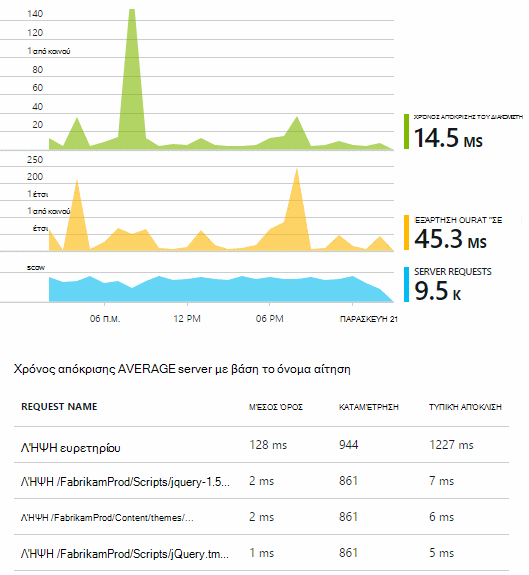

Κάνει να υπολογίσετε το εφέ απόδοσης κάθε ανάπτυξης, συνήθως σύγκριση κάθε εβδομάδα με την τελευταία. Εάν υπάρχει μια απότομη επιδεινώνεται, κάνει ανάγει που με τη σχετική τους προγραμματιστές.

## Διαλογής

Διαλογής - εκτίμηση της σοβαρότητας και την έκταση της πρόβλημα - είναι το πρώτο βήμα μετά την ανίχνευση. Θα πρέπει να ονομάζουμε εκτός ομάδας μεσάνυχτα; Ή μπορεί να παραμείνει μέχρι την επόμενη κενό εύκολη στην τη λίστα εκκρεμοτήτων; Υπάρχουν ορισμένες βασικές ερωτήσεις σε διαλογής.

Πόσο συμβαίνει; Τα γραφήματα στην την επισκόπηση blade δώσετε ορισμένες προοπτική σε ένα ζήτημα. Για παράδειγμα, η εφαρμογή Fabrikam που δημιουργούνται από τέσσερα ειδοποιήσεις δοκιμής web μία νύχτα. Εξετάζοντας το γράφημα το πρωί, στην ομάδα μπορεί να δείτε ότι υπήρχαν στην πραγματικότητα ορισμένες κόκκινες κουκκίδες, αν και ακόμη περισσότερα από τους ελέγχους που έχουν πράσινο. Διερεύνηση σε γράφημα διαθεσιμότητας, ήταν Απαλοιφή ότι όλα αυτά τα προβλήματα περιστασιακό ήταν από μία δοκιμή θέση. Αυτό ήταν εμφανώς ένα πρόβλημα δικτύου που επηρεάζουν μόνο μία δρομολόγηση και πιθανώς να καταργήστε ίδια.  

Σε αντίθεση, μια εντυπωσιακή και είναι σταθερό ανύψωση στο γράφημα εξαίρεση απόκριση ή πλήθος φορές είναι εμφανώς κάτι για να πανικοβληθείτε σχετικά με.

Μια χρήσιμη διαλογής τακτική αυτή είναι δοκιμάστε την στον εαυτό σας. Εάν αντιμετωπίσετε το ίδιο πρόβλημα, γνωρίζετε είναι πραγματικά.

Τι κλάσμα χρήστες επηρεάζονται; Για να αποκτήσετε μια πρόχειρη απάντηση, διαιρέστε το επιτόκιο αποτυχία με την καταμέτρηση περιόδου λειτουργίας.

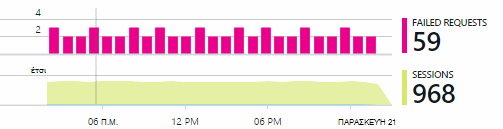

Στην περίπτωση αργή απόκριση, συγκρίνετε τον πίνακα των αιτήσεων χαμηλότερη αποκρίνεται με τη χρήση συχνότητα μέρος κάθε σελίδας.

Το αποκλεισμένο σενάριο είναι σημαντικό; Εάν αυτή είναι μια λειτουργική πρόβλημα αποκλεισμού κειμένου συγκεκριμένο χρήστη, έχει σημασία πολύ; Εάν οι πελάτες δεν είναι δυνατό να πληρώνετε τις χρεώσεις, αυτή είναι η σοβαρές; Εάν δεν είναι δυνατό να αλλάξουν τις προτιμήσεις χρώμα οθόνης, ίσως αυτό να περιμένετε να ολοκληρωθεί. Τις λεπτομέρειες του συμβάντος ή εξαίρεση ή την ταυτότητα της σελίδας αργή, σας ενημερώνει όπου οι πελάτες αντιμετωπίζουν προβλήματα.

## Διάγνωση

Διάγνωση δεν είναι απολύτως το ίδιο με τον εντοπισμό σφαλμάτων. Πριν ξεκινήσετε την ανίχνευση μέσω του κώδικα, θα πρέπει να έχετε μια ιδέα για το Πρόχειρο γιατί, όπου και όταν το πρόβλημα.

**Όταν παρουσιάζεται;** Η προβολή ιστορικού που παρέχεται από το συμβάν και μετρικό σύστημα γραφήματα διευκολύνει την συσχετισμός εφέ με πιθανές αιτίες. Εάν υπάρχουν διακοπές κορυφών στο χρόνο ή εξαίρεση ποσοστών απόκρισης, εξετάστε το πλήθος αίτηση: Εάν το κορυφές με την ίδια στιγμή και, στη συνέχεια, εμφανίζεται ένα πρόβλημα πόρων. Χρειάζεται να εκχωρήσετε περισσότερα CPU ή μνήμης; Ή είναι μια εξάρτηση που δεν είναι δυνατή η διαχείριση του φόρτου;

**Είναι η μας;**  Εάν έχετε μια απότομη απόθεσης στις επιδόσεις ενός συγκεκριμένου τύπου της αίτησης - για παράδειγμα όταν ο πελάτης θέλει μια δήλωση λογαριασμού -, στη συνέχεια, υπάρχει πιθανότητα ίσως είναι μια εξωτερική υποσυστήματος αντί για την εφαρμογή web. Στην Εξερεύνηση των μετρήσεων, επιλέξτε το ρυθμό αποτυχία εξάρτηση και χρεώσεις διάρκεια εξάρτησης και συγκρίνετε τους ιστορικά πάνω από το προηγούμενο μερικές ώρες ή ημέρες με το πρόβλημα που εντοπίστηκε. Εάν αντιστοιχίας υπάρχουν αλλαγές, στη συνέχεια, μια εξωτερική υποσυστήματος μπορεί να σε blame.  

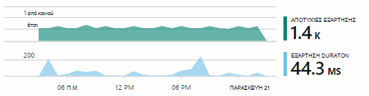

Ορισμένα ζητήματα αργή εξάρτηση είναι γεωεντοπισμός προβλήματα. Τράπεζα Fabrikam χρησιμοποιεί Azure εικονικές μηχανές και εντόπισε ότι αυτά είχαν κατά λάθος που βρίσκεται το διακομιστή web και διακομιστή λογαριασμού σε διαφορετικές χώρες. Μια εντυπωσιακή βελτίωσης έχει προκληθεί από τη μετεγκατάσταση μία από αυτές.

**Τι έχει αλλάξει μας** Εάν το ζήτημα δεν φαίνονται να είναι σε μια εξάρτηση, και δεν ήταν πάντα εκεί, αυτό οφείλεται πιθανότατα μια πρόσφατη αλλαγή. Την προοπτική ιστορικού που παρέχεται από τα γραφήματα μετρικό και event διευκολύνει την συσχετισμός απότομη αλλαγές με αναπτύξεις. Που περιορίζει την αναζήτηση για το πρόβλημα.

**Τι τρέχει?** Ορισμένα προβλήματα που παρουσιάζονται μόνο σπάνια και μπορεί να είναι δύσκολο να εντοπίσετε, δοκιμάζοντας χωρίς σύνδεση. Μόνο μπορούμε να κάνουμε είναι να δοκιμάσετε για να καταγράψετε το σφάλμα όταν παρουσιάζεται live. Μπορείτε να ελέγξετε το ενδείξεις στοίβας σε αναφορές εξαίρεσης. Επιπλέον, μπορείτε να συντάξετε ανίχνευση κλήσεις, είτε με το πλαίσιο καταγραφή αγαπημένο είτε TrackTrace() ή TrackEvent().  

Fabrikam παρουσίασε ένα περιστασιακό πρόβλημα με μεταφορές μεταξύ λογαριασμό, αλλά μόνο με συγκεκριμένους τύπους λογαριασμού. Για να κατανοήσετε καλύτερα τι συμβαίνει, μπορούν να εισαχθούν TrackTrace() κλήσεις σε βασικά σημεία στον κώδικα, επισύναψη τον τύπο του λογαριασμού ως ιδιότητα σε κάθε κλήση. Που κάνει εύκολο να φιλτράρισμα μόνο των ίχνη σε διαγνωστικών αναζήτησης. Αυτά που έχουν επισυναφθεί επίσης τιμές παραμέτρων ως ιδιότητες και μετρήσεις για την ανίχνευση κλήσεων.

## Χειρισμός το

Αφού έχετε διάγνωση το ζήτημα, μπορείτε να κάνετε ένα σχέδιο για να διορθώσετε το πρόβλημα. Μήπως πρέπει να επαναφέρετε μια πρόσφατη αλλαγή ή μήπως μπορείτε απλώς να προχωρήσετε και να fix it για. Μετά την ολοκλήρωση της ενημέρωσης κώδικα, ιδέες εφαρμογής θα σας ενημερώσει εάν που ολοκληρώθηκε με επιτυχία.  

Ομάδα ανάπτυξης τραπεζική Fabrikam λαμβάνουν μια πιο δομημένη προσέγγιση για μέτρησης επιδόσεων από αυτά που χρησιμοποιούνται για να για να χρησιμοποιούνται ιδέες εφαρμογής.

* Αυτά ορίζουν στόχους επιδόσεων όσον αφορά ειδικά μέτρα στη σελίδα επισκόπησης της εφαρμογής ιδέες.

* Αυτά σχεδίαση μετρήσεις επιδόσεων σε μια εφαρμογή από την αρχή, όπως τα μετρικά που μετρούν χρήστη την πρόοδο μέσω 'χοάνες'.  

## Χρήση

Εφαρμογή ιδέες μπορεί επίσης να χρησιμοποιηθεί για να μάθετε τι να κάνετε τους χρήστες με μια εφαρμογή. Όταν εκτελείται ομαλά, στην ομάδα θέλατε να γνωρίζετε ποιες δυνατότητες είναι τα πιο δημοφιλή, τι τους χρήστες σας αρέσει ή έχετε δυσκολία με και πόσο συχνά προκύπτουν ξανά. Που θα τους βοηθήσουν να δίνετε προτεραιότητα σε προσεχείς εργασίες τους. Και να πρόκειται να μετρήσετε την επιτυχία κάθε δυνατότητα ως μέρος του κύκλου ανάπτυξης. [Διαβάστε περισσότερα][usage].

## Εφαρμογές σας

Αυτή η ενέργεια έχει πώς μία ομάδας χρήση εφαρμογής ιδέες, όχι μόνο για τη διόρθωση προβλημάτων μεμονωμένα, αλλά για να βελτιώσετε τις κύκλος ζωής ανάπτυξης. Να ελπίζετε το σας εκχώρησε ορισμένες ιδέες σχετικά με τον τρόπο εφαρμογής ιδέες μπορεί να σας βοηθήσει να βελτιώσετε τις επιδόσεις της τις δικές σας εφαρμογές.

## Βίντεο

[AZURE.VIDEO performance-monitoring-application-insights]

<!--Link references-->

[api]: app-insights-api-custom-events-metrics.md
[availability]: app-insights-monitor-web-app-availability.md
[diagnostic]: app-insights-diagnostic-search.md
[metrics]: app-insights-metrics-explorer.md
[perf]: app-insights-web-monitor-performance.md
[usage]: app-insights-web-track-usage.md
 
