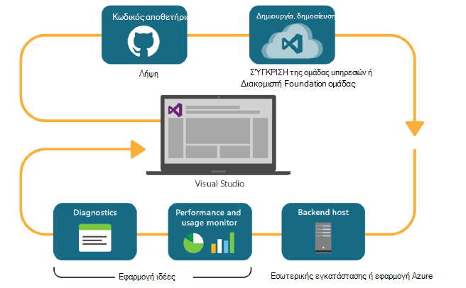
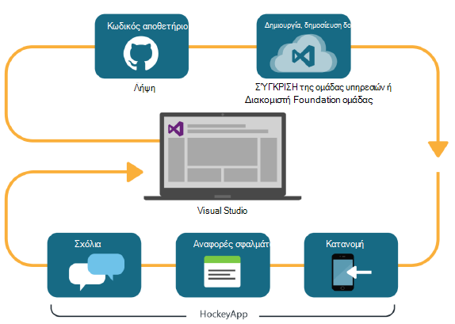

<properties
    pageTitle="Ανάλυση για προγραμματιστές"
    description="DevOps με το Visual Studio, εφαρμογή ιδέες και HockeyApp"
    authors="alancameronwills"
    services="application-insights"
    documentationCenter=""
    manager="douge"/>

<tags
    ms.service="application-insights"
    ms.workload="tbd"
    ms.tgt_pltfrm="ibiza"
    ms.devlang="na"
    ms.topic="article" 
    ms.date="05/18/2016"
    ms.author="awills"/>

# Ανάλυση προγραμματιστής με εφαρμογή ιδέες και HockeyApp

*Εφαρμογή ιδέες είναι σε προεπισκόπηση.*

Πολλά έργα λειτουργούν μια γρήγορη κύκλος [DevOps](https://en.wikipedia.org/wiki/DevOps) . Μπορούν Δόμηση και διανομή εφαρμογές τους, λήψη σχολίων σχετικά με τον τρόπο εκτέλεσης και τι να κάνετε τους χρήστες με το και, στη συνέχεια, χρησιμοποιήστε αυτές τις γνώσεις για να σχεδιάσετε περαιτέρω κύκλοι ανάπτυξης. 

Για την παρακολούθηση της χρήσης και επιδόσεων, είναι σημαντικό να έχουν τηλεμετρίας από την εφαρμογή ζωντανή, καθώς και σχολίων από τους ίδιους τους χρήστες. 

Πολλά συστήματα δημιουργούνται από πολλαπλά στοιχεία: μια υπηρεσία web, επεξεργαστές παρασκηνίου ή χώροι αποθήκευσης δεδομένων και λογισμικό προγράμματος-πελάτη που εκτελείται στο πρόγραμμα περιήγησης του χρήστη ή ως εφαρμογής στο τηλέφωνο ή άλλη συσκευή. Το τηλεμετρίας από αυτά τα διαφορετικά στοιχεία πρέπει να ληφθεί μαζί.

Ορισμένες εκδόσεις έχουν τεθεί περιορισμοί διανομής για να που έχει οριστεί ως στους υπεύθυνους δοκιμών; Έχουμε επίσης οργανωμένο flighting (δοκιμές των νέων δυνατοτήτων με περιορισμένα ακροατηρίων) και A | B δοκιμές (παράλληλες δοκιμές του περιβάλλοντος εργασίας Χρήστη εναλλακτικού).

Διαχείριση κατανομές και ενοποίηση παρακολούθηση επάνω σε πολλά στοιχεία πελάτη και διακομιστή δεν είναι trivial εργασίας. Αυτή η διαδικασία είναι βασικές τμήμα της αρχιτεκτονικής της εφαρμογής: δεν είναι δυνατό να δημιουργήσουμε ένα σύστημα αυτή είδος χωρίς ενός κύκλου επαναληπτικού ανάπτυξης και καλή εργαλεία παρακολούθησης.

Σε αυτό το άρθρο, θα εξετάσουμε τον τρόπο προσαρμογής του παρακολούθησης πτυχές του κύκλου devOps με τα άλλα τμήματα της διαδικασίας. 

Εάν θέλετε να δείτε ένα συγκεκριμένο παράδειγμα, υπάρχει [μια ενδιαφέρουσα περιπτωσιολογική μελέτη](http://aka.ms/mydrivingdocs) που έχει πολλά στοιχεία πελάτη και διακομιστή.

## Ένας κύκλος DevOps

Εργαλεία του Visual Studio και τις αναλύσεις για προγραμματιστές παρέχουν μια εμπειρία ενοποιημένο devOps. Για παράδειγμα, ακολουθεί ένα τυπικό κύκλο για μια εφαρμογή web (το οποίο μπορεί να είναι Java, Node.js ή ASP.NET):

* Ένας προγραμματιστής μεταβιβάζει του αποθετηρίου κώδικα ή συγχωνεύει στο κύριο κλάδο. Το αρχείο φύλαξης είναι Git σε αυτήν την απεικόνιση, αλλά μπορεί να είναι εξίσου [Έλεγχος έκδοσης Foundation ομάδας](https://www.visualstudio.com/docs/tfvc/overview).
* Οι αλλαγές έναυσμα μια δοκιμαστική έκδοση και της μονάδας. Μπορεί να είναι η υπηρεσία Δόμηση στο [Visual Studio Team Services ή το αντίστοιχο εσωτερικής εγκατάστασης, διακομιστή Foundation ομάδας](https://www.visualstudio.com/docs/vsts-tfs-overview). 
* Μια επιτυχημένη Δόμηση και μονάδα δοκιμής μπορούν να [έναυσμα μια αυτόματη ανάπτυξη](https://www.visualstudio.com/docs/release/author-release-definition/more-release-definition). Ο κεντρικός υπολογιστής εφαρμογής web μπορεί να είναι το δικό σας διακομιστή web ή το Microsoft Azure. 
* Τηλεμετρίας από την εφαρμογή ζωντανή αποστέλλεται [Εφαρμογή ιδέες](app-insights-overview.md), τόσο από το διακομιστή και [από τα προγράμματα περιήγησης του προγράμματος-πελάτη](app-insights-javascript.md). Εκεί, μπορείτε να αναλύει την απόδοση των εφαρμογών και η χρήση μοτίβων. Διάγνωση τυχόν θέματα Βοήθειας ισχυρά [Εργαλεία αναζήτησης](app-insights-analytics.md) . [Ειδοποιήσεις](app-insights-alerts.md) βεβαιωθείτε ότι γνωρίζετε σχετικά με ένα πρόβλημα με την που προκύπτει. 
* Την επόμενη περίοδο ανάπτυξης ενημερώνεται με την ανάλυσή σας από το live τηλεμετρίας.

### Συσκευή και τις εφαρμογές υπολογιστή

Για τη συσκευή και εφαρμογές υπολογιστή, το τμήμα κατανομής του κύκλου είναι λίγο διαφορετικό, επειδή θα σας δεν είναι απλώς Αποστολή σε μία ή δύο διακομιστές. Αντί για αυτό, μια επιτυχημένη Δόμηση και μονάδα δοκιμής μπορούν να [έναυσμα Αποστολή σε HockeyApp](https://support.hockeyapp.net/kb/third-party-bug-trackers-services-and-webhooks/how-to-use-hockeyapp-with-visual-studio-team-services-vsts-or-team-foundation-server-tfs). HockeyApp επιβλέπει κατανομής με την ομάδα σας από τους χρήστες δοκιμής (ή στο ευρύ κοινό, εάν προτιμάτε). 

HockeyApp συλλέγει επίσης δεδομένα απόδοσης και χρήσης, στις φόρμες:

* Σχόλια χρήστη κατά λέξη με στιγμιότυπα οθόνης
* Αναφορές σφαλμάτων
* Προσαρμοσμένη τηλεμετρίας στον κώδικα από εσάς.

Και πάλι, τον κύκλο devOps έχει ολοκληρωθεί καθώς κάνετε σχέδιά σας μελλοντική ανάπτυξη, με βάση τα σχόλια που αποκτήθηκε.

## Ρύθμιση ανάλυσης για προγραμματιστές

Για κάθε στοιχείο της εφαρμογής σας - κινητές συσκευές ή web ή επιφάνειας εργασίας σας - τα βήματα είναι στην ουσία τα ίδια. Για πολλούς τύπους της εφαρμογής, Visual Studio πραγματοποιεί αυτόματα ορισμένα από τα παρακάτω βήματα.

1. Προσθέστε το κατάλληλο SDK την εφαρμογή σας. Για τις εφαρμογές συσκευής, είναι HockeyApp και για τις υπηρεσίες web είναι εφαρμογή ιδέες. Κάθε διαθέτει διάφορα χαρακτηριστικά για διαφορετικές πλατφόρμες. (Είναι επίσης μπορείτε να χρησιμοποιήσετε είτε SDK για εφαρμογές υπολογιστή του, αν και συνιστάται HockeyApp.)
2. Να καταχωρήσει την εφαρμογή σας με την πύλη εφαρμογής ιδέες ή HockeyApp, ανάλογα με το SDK που χρησιμοποιήσατε. Αυτό είναι όπου θα δείτε αναλυτικά στοιχεία από την εφαρμογή του live. Λαμβάνετε ένα πλήκτρο οργάνων ή το Αναγνωριστικό που μπορείτε να ρυθμίσετε την εφαρμογή ώστε να γνωρίζει το SDK πού να στείλετε το τηλεμετρίας.
3. Προσθήκη προσαρμοσμένου κώδικα (Εάν θέλετε) για να συνδεθείτε συμβάντα ή μετρήσεις, για να σας βοηθήσει με Διαγνωστικά ή για να αναλύσετε τις επιδόσεις ή χρήση. Υπάρχει πολλές παρακολούθηση ενσωματωμένη, οπότε δεν χρειάζεται αυτό το πρώτο κύκλο.
3. Για τις εφαρμογές συσκευής:
 * Στείλτε μια Δόμηση εντοπισμού σφαλμάτων σε HockeyApp. Από εκεί μπορείτε να τη διανείμετε σε μια ομάδα από τους χρήστες δοκιμής. Κάθε φορά που κάνετε αποστολή οι επόμενες δημιουργεί, θα λάβετε μια ειδοποίηση στην ομάδα.
 * Κατά τη ρύθμιση του σας συνεχής δημιουργήσετε υπηρεσίας, δημιουργία ενός ορισμού την έκδοση που χρησιμοποιεί το προσθήκης βήμα για την αποστολή στο HockeyApp.

### Ανάλυση και εξαγωγή για HockeyApp τηλεμετρίας

Για να διερευνήσουμε προσαρμοσμένη HockeyApp και καταγραφή τηλεμετρίας χρησιμοποιώντας τις ανάλυση και συνεχής εξαγωγή δυνατότητες της εφαρμογής ιδέες κατά [τη ρύθμιση του γέφυρα](app-insights-hockeyapp-bridge-app.md).

## Επόμενα βήματα
 
Εδώ θα βρείτε τις λεπτομερείς οδηγίες για διαφορετικούς τύπους της εφαρμογής:

* [Εφαρμογή web ASP.NET](app-insights-asp-net.md) 
* [Εφαρμογή web Java](app-insights-java-get-started.md)
* [Node.js web app](https://github.com/Microsoft/ApplicationInsights-node.js)
* [εφαρμογή iOS](https://support.hockeyapp.net/kb/client-integration-ios-mac-os-x-tvos/hockeyapp-for-ios)
* [Mac OS X εφαρμογής](https://support.hockeyapp.net/kb/client-integration-ios-mac-os-x-tvos/hockeyapp-for-mac-os-x)
* [Εφαρμογή Android](https://support.hockeyapp.net/kb/client-integration-android/hockeyapp-for-android-sdk)
* [Εφαρμογή καθολικής Windows](https://support.hockeyapp.net/kb/client-integration-windows-and-windows-phone/how-to-create-an-app-for-uwp)
* [Εφαρμογή Windows Phone 8 και 8.1](https://support.hockeyapp.net/kb/client-integration-windows-and-windows-phone/hockeyapp-for-windows-phone-silverlight-apps-80-and-81)
* [Παρουσίαση Windows Foundation εφαρμογής](https://support.hockeyapp.net/kb/client-integration-windows-and-windows-phone/hockeyapp-for-windows-wpf-apps)

