<properties 
    pageTitle="Χρήση διαγνωστικών αναζήτησης | Microsoft Azure" 
    description="Αναζήτηση και να φιλτράρετε μεμονωμένα συμβάντα, οι προσκλήσεις, και συνδεθείτε ανιχνεύσεις." 
    services="application-insights" 
    documentationCenter=""
    authors="alancameronwills" 
    manager="douge"/>

<tags 
    ms.service="application-insights" 
    ms.workload="tbd" 
    ms.tgt_pltfrm="ibiza" 
    ms.devlang="na" 
    ms.topic="article" 
    ms.date="06/09/2016" 
    ms.author="awills"/>
 
# Χρήση διαγνωστικών αναζήτησης σε ιδέες εφαρμογής

Διαγνωστικών αναζήτησης είναι μια δυνατότητα της [Εφαρμογής ιδέες] [ start] ότι χρησιμοποιείτε για να βρείτε και να εξερευνήσετε τηλεμετρίας μεμονωμένα στοιχεία, όπως προβολές σελίδας, εξαιρέσεις, ή προσκλήσεις στο web. Και μπορείτε να προβάλετε το αρχείο καταγραφής ανίχνευσης και τα συμβάντα που έχουν στον κώδικα.

## Όπου μπορείτε να δείτε διαγνωστικών αναζήτησης;

### Στην πύλη του Azure

Μπορείτε να ανοίξετε ρητά διαγνωστικών αναζήτησης:

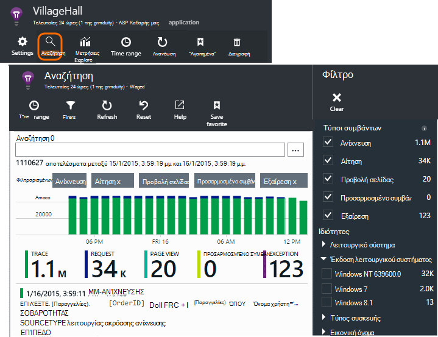

Ανοίγει επίσης όταν κάνετε κλικ στην επιλογή μέσω ορισμένα γραφήματα και στοιχεία του πλέγματος. Σε αυτήν την περίπτωση, τα φίλτρα προ-έχουν οριστεί για εστίαση σε τον τύπο του στοιχείου που επιλέξατε. 

Για παράδειγμα, εάν η εφαρμογή σας είναι μια υπηρεσία web, το blade Επισκόπηση εμφανίζει ένα γράφημα του όγκου των αιτήσεων. Κάντε κλικ σε αυτήν και μπορείτε να αποκτήσετε μια πιο λεπτομερή γράφημα, με μια λίστα που δείχνει πόσες αιτήσεις έχουν γίνει για κάθε διεύθυνση URL. Κάντε κλικ σε οποιαδήποτε γραμμή και μπορείτε να λάβετε μια λίστα με τις μεμονωμένες αιτήσεις για αυτήν τη διεύθυνση URL:

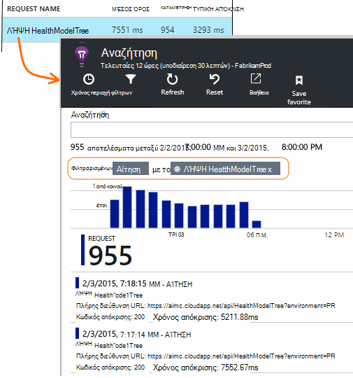

Στο κύριο σώμα διαγνωστικών αναζήτησης είναι μια λίστα των στοιχείων τηλεμετρίας - αιτήσεις διακομιστή, σελίδα προβολών, προσαρμοσμένα συμβάντα που έχουν στον κώδικα και ούτω καθεξής. Στο επάνω μέρος της λίστας είναι ένα γράφημα σύνοψης που εμφανίζει το πλήθος των συμβάντων μέσα στο χρόνο.

Συμβάντα συνήθως εμφανίζονται στην αναζήτηση διαγνωστικών πριν να εμφανίζονται στην Εξερεύνηση των μετρικό. Παρόλο που το blade ανανέωση σε χρονικά διαστήματα, μπορείτε να επιλέξετε ανανέωση εάν περιμένετε για ένα συγκεκριμένο συμβάν.

### Στο Visual Studio

Ανοίξτε το παράθυρο αναζήτησης στο Visual Studio:

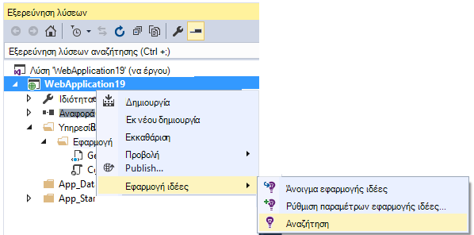

Το παράθυρο αναζήτησης περιλαμβάνει τις ίδιες δυνατότητες με την πύλη web:

## Δειγματοληψία

Εάν η εφαρμογή σας δημιουργεί πολλές τηλεμετρίας (και χρησιμοποιείτε το 2.0.0-beta3 έκδοσης ASP.NET SDK ή νεότερη έκδοση), τη λειτουργική μονάδα προσαρμόσιμη δειγματοληψία μειώνει αυτόματα την ένταση ήχου που αποστέλλονται με την πύλη με την αποστολή μόνο σε αντιπρόσωπος κλάσμα συμβάντων. Ωστόσο, τα συμβάντα που σχετίζονται με την ίδια πρόσκληση σε θα επιλεγμένο ή μη επιλεγμένο ως ομάδα, ώστε να μπορείτε να μετακινηθείτε μεταξύ των σχετικών συμβάντα. 

[Μάθετε σχετικά με τη δειγματοληψία](app-insights-sampling.md).

## Έλεγχος μεμονωμένων στοιχείων

Επιλέξτε οποιοδήποτε στοιχείο τηλεμετρίας για να δείτε τα πεδία κλειδιών και τα σχετικά στοιχεία. Εάν θέλετε να δείτε το πλήρες σύνολο των πεδίων, κάντε κλικ στην επιλογή "...". 

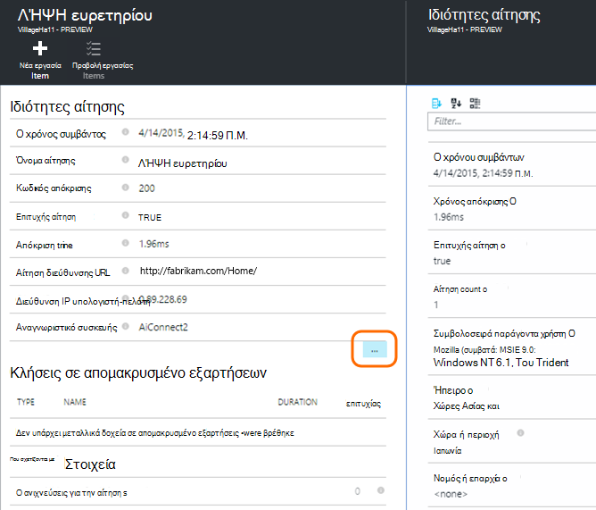

Για να βρείτε το πλήρες σύνολο των πεδίων, χρησιμοποιήστε απλό συμβολοσειρές (χωρίς χαρακτήρες μπαλαντέρ). Τα διαθέσιμα πεδία εξαρτώνται από τον τύπο του τηλεμετρίας.

## Δημιουργία στοιχείου εργασίας

Μπορείτε να δημιουργήσετε ένα σφάλμα στο Visual Studio Team Services με τις λεπτομέρειες από οποιοδήποτε στοιχείο τηλεμετρίας. 

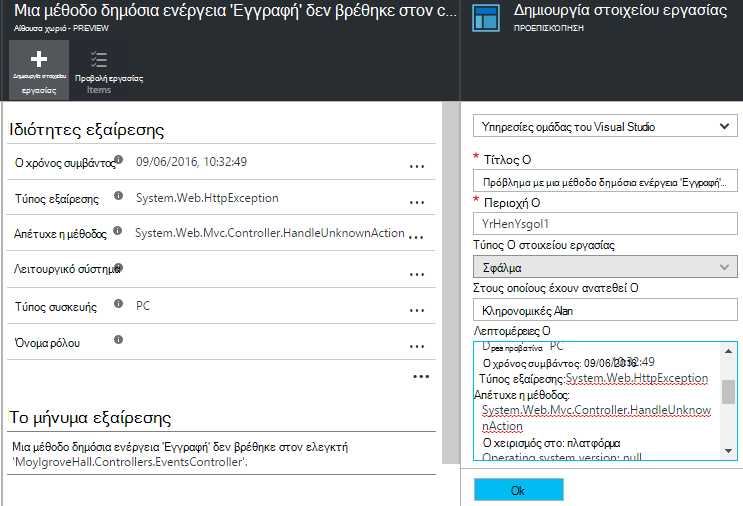

Την πρώτη φορά που κάνετε αυτό, θα σας ζητηθεί να ρυθμίσετε μια σύνδεση για το λογαριασμό υπηρεσίες ομάδας και έργου.

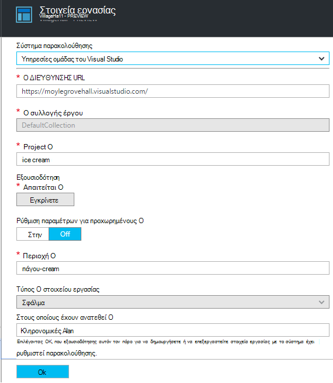

(Μπορείτε επίσης να λάβετε για τη ρύθμιση των παραμέτρων blade από τις ρυθμίσεις > στοιχεία εργασίας.)

## Τύποι συμβάντων φίλτρου

Ανοίξτε το blade φίλτρο και επιλέξτε τους τύπους συμβάντων που θέλετε να δείτε. (Εάν αργότερα, που θέλετε να επαναφέρετε τα φίλτρα με την οποία έχετε ανοίξει το blade, κάντε κλικ στην επιλογή Επαναφορά.)

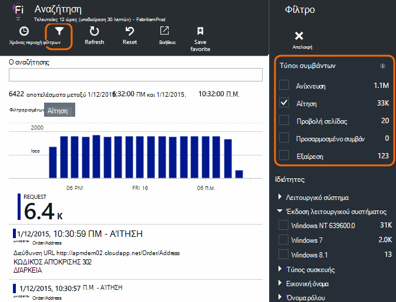

Οι τύποι συμβάντων είναι:

* **Ανίχνευση** - αρχεία καταγραφής διαγνωστικών συμπεριλαμβανομένων TrackTrace, log4Net, NLog και System.Diagnostic.Trace κλήσεις.
* **Αίτηση** - αιτήσεις HTTP από την εφαρμογή του διακομιστή, συμπεριλαμβανομένων των σελίδων, δέσμες ενεργειών, εικόνες, αρχεία στυλ και δεδομένων. Αυτά τα συμβάντα που χρησιμοποιούνται για τη δημιουργία της αίτησης και της απόκρισης Επισκόπηση γραφημάτων.
* **Προβολή σελίδας** - Τηλεμετρίας αποστέλλονται από το πρόγραμμα-πελάτη web, που χρησιμοποιείται για τη δημιουργία αναφορών προβολή σελίδας. 
* **Προσαρμοσμένη συμβάν** - εάν έχετε εισαγάγει κλήσεων στο TrackEvent() για την [Παρακολούθηση χρήσης][track], μπορείτε να πραγματοποιήσετε αναζήτηση τους εδώ.
* **Εξαίρεση** - μη καταγεγραμμένο εξαιρέσεις στο διακομιστή και αυτές που θα συνδεθείτε με τη χρήση TrackException().

## Φιλτράρισμα τιμών ιδιοτήτων

Μπορείτε να φιλτράρετε συμβάντα τις τιμές των ιδιοτήτων τους. Οι διαθέσιμες ιδιότητες εξαρτώνται από τους τύπους συμβάντων που επιλέξατε. 

Για παράδειγμα, επιλέξτε ανάληψη αιτήσεις με έναν κωδικό συγκεκριμένες απόκρισης.

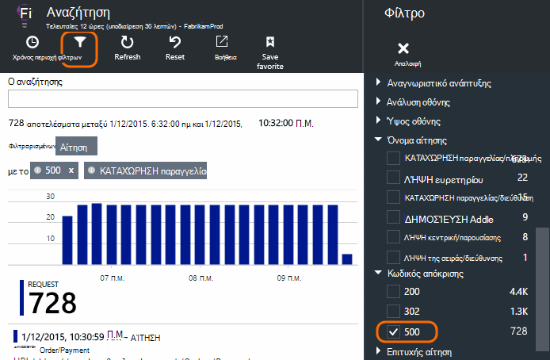

Επιλογή χωρίς τιμές από μια συγκεκριμένη ιδιότητα έχει το ίδιο αποτέλεσμα με την επιλογή όλων των τιμών; Αυτό αλλάζει απενεργοποίηση φιλτραρίσματος σε αυτήν την ιδιότητα.

### Περιορίστε την αναζήτησή σας

Παρατηρήστε ότι τις μετρήσεις στα δεξιά των τιμών φίλτρου εμφανίζεται πόσες εμφανίσεις εκεί είναι η τρέχουσα φιλτραρισμένου συνόλου. 

Σε αυτό το παράδειγμα, το έχει σαφές ότι το `Reports/Employees` αίτηση έχει ως αποτέλεσμα το μεγαλύτερο μέρος των 500 σφαλμάτων:

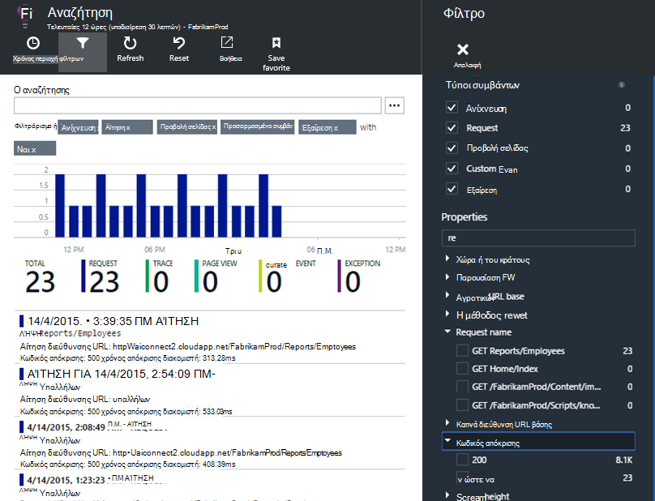

Επιπλέον εάν θέλετε να επίσης να δείτε ποια άλλα συμβάντα συμβαίνει κατά τη διάρκεια αυτήν τη στιγμή, μπορείτε να ελέγξετε **συμβάντα συμπερίληψη με τις ιδιότητες δεν έχει οριστεί**.

## Κατάργηση web και bot κίνηση δοκιμής

Χρησιμοποιήστε το φίλτρο **πραγματικό ή σύνθετων κυκλοφορίας** και έλεγχος **πραγματικό**.

Μπορείτε επίσης να φιλτράρετε κατά **προέλευση της σύνθετων κυκλοφορίας**.

## Έλεγχος μεμονωμένων εμφανίσεων

Προσθέστε αυτό το όνομα αίτηση στο σύνολο του φίλτρου και, στη συνέχεια, μπορείτε να ελέγξετε τις μεμονωμένες εμφανίσεις αυτού του συμβάντος.

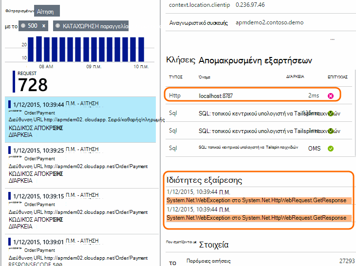

Για πρόσκληση σε συμβάντα, τις λεπτομέρειες εμφάνιση εξαιρέσεις που έγιναν κατά την επεξεργασία της αίτησης.

Κάντε κλικ στις μια εξαίρεση για να δείτε τις λεπτομέρειες, όπως η παρακολούθηση στοίβας.

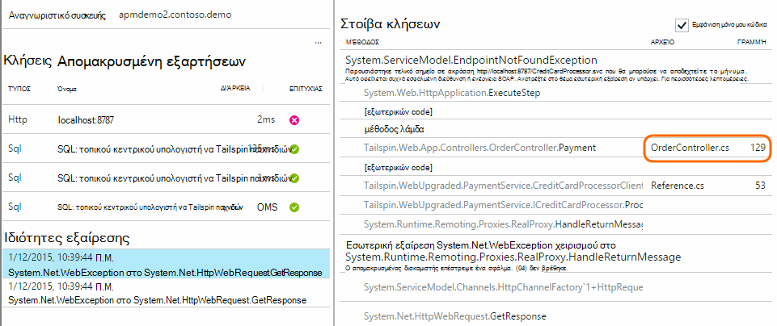

## Εύρεση συμβάντων με την ίδια ιδιότητα

Βρείτε όλα τα στοιχεία με την ίδια τιμή ιδιότητα:

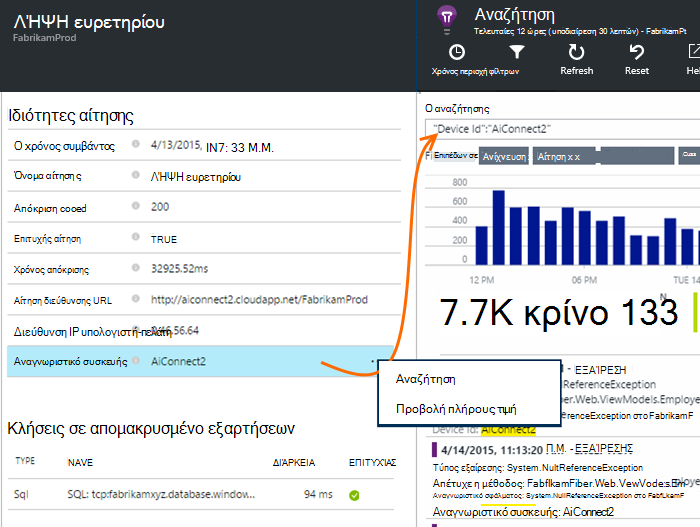

## Αναζήτηση με μετρική τιμή

Λάβετε αιτήσεις απόκριση πάντα > 5s.  Φορές αντιπροσωπεύονται σε διαβαθμίσεις: 10 000 υποδιαιρέσεις = 1ms.

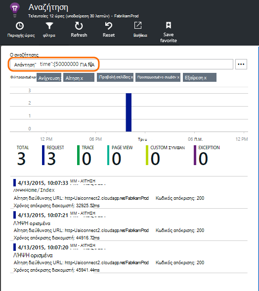

## Αναζήτηση στα δεδομένα

Μπορείτε να αναζητήσετε όρους σε οποιαδήποτε από τις τιμές ιδιοτήτων. Αυτό είναι ιδιαίτερα χρήσιμο αν έχετε κάνει εγγραφή [προσαρμοσμένα συμβάντα] [ track] με τιμές ιδιοτήτων. 

Ενδέχεται να θέλετε να ορίσετε την ώρα περιοχής, ως αναζητήσεις επάνω σε μια περιοχή μικρότερη είναι πιο γρήγορα. 

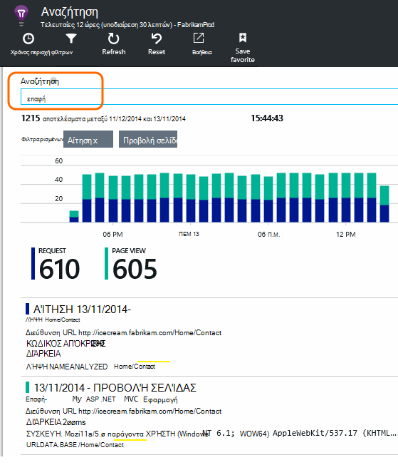

Αναζήτηση για όρους, δεν δευτερευουσών συμβολοσειρών. Τους όρους είναι αλφαριθμητικό συμβολοσειρές όπως ορισμένα σημεία στίξης όπως '.' και '_'. Για παράδειγμα:

όρος|*δεν* συμφωνείται από|αλλά αυτά ταιριάζει με
---|---|---
HomeController.About|σχετικά με αρχική|h\*σχετικά με αρχική\*
IsLocal|τοπική είναι \*τοπική|isl\* islocal i\*l\*
Νέα καθυστέρηση|w d|νέα καθυστέρηση n\* και d\*

Ακολουθούν οι παραστάσεις αναζήτησης που μπορείτε να χρησιμοποιήσετε:

Δείγμα ερωτήματος | Εφέ 
---|---
αργή|Βρείτε όλα τα συμβάντα στην περιοχή ημερομηνιών του οποίου τα πεδία περιλαμβάνουν τον όρο "καθυστέρηση"
βάσης δεδομένων;|Ταιριάζει με database01, databaseAB... ? Δεν επιτρέπεται κατά την έναρξη της έναν όρο αναζήτησης.
βάση δεδομένων * |Ταιριάζει με βάση δεδομένων, database01, databaseNNNN  * Δεν επιτρέπεται κατά την έναρξη της έναν όρο αναζήτησης
Apple μπανάνες και|Βρείτε τα συμβάντα που περιέχουν και οι δύο όροι. Χρήση κεφάλαιο "και", δεν "και".
Apple μπανάνες OR Apple μπανάνες|Βρείτε τα συμβάντα που περιέχουν είτε όρων. Χρήση του "OR", δεν "ή". < /br/ > Σύντομη φόρμα.
Apple δεν μπανάνες Apple-μπανάνες|Βρείτε τα συμβάντα που περιέχει έναν όρο αλλά όχι το άλλο. Σύντομη μορφή.
Εφαρμογή *-(grape pear) μπανάνες και|Λογικοί τελεστές και χρήση αγκύλων.
"Μετρικό": 0 ΈΩΣ 500 "Μετρικό": 500 ΠΡΟΣ * | Βρείτε τα συμβάντα που περιέχουν την καθορισμένη μέτρησης μέσα στην περιοχή τιμή.

## Αποθήκευση της αναζήτησης

Όταν ορίζετε όλα τα φίλτρα που θέλετε, μπορείτε να αποθηκεύσετε τα αποτελέσματα της αναζήτησης ως Αγαπημένα. Εάν εργάζεστε σε έναν εταιρικό λογαριασμό, μπορείτε να επιλέξετε εάν θέλετε να χρησιμοποιήσετε από κοινού με άλλα μέλη της ομάδας.

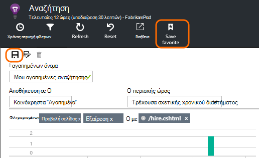

Για να δείτε την αναζήτηση ξανά, **μεταβείτε στο την επισκόπηση blade** και ανοίξτε "Αγαπημένα":

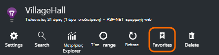

Εάν έχετε αποθηκεύσει με σχετική χρονικό διάστημα, το ανοίξει ξανά blade περιλαμβάνει τα πιο πρόσφατα δεδομένα. Εάν έχετε αποθηκεύσει με απόλυτη χρονικό διάστημα, θα δείτε τα ίδια δεδομένα κάθε φορά.

## Αποστολή τηλεμετρίας περισσότερες ιδέες εφαρμογής

Εκτός από την τηλεμετρίας εκτός του πλαισίου που αποστέλλονται από εφαρμογή ιδέες SDK, μπορείτε:

* Καταγραφή ανιχνεύσεις καταγραφής από το πλαίσιο καταγραφή Αγαπημένα στο [.NET] [ netlogs] ή [Java][javalogs]. Αυτό σημαίνει ότι μπορείτε να αναζήτηση σε ανιχνεύσεις σας καταγραφής και συσχετισμός τους με προβολές σελίδας, εξαιρέσεις και άλλα συμβάντα. 
* [Σύνταξη κώδικα] [ track] για να στείλετε προσαρμοσμένα συμβάντα, προβολών σελίδας και εξαιρέσεις. 

[Μάθετε πώς μπορείτε να στείλετε τα αρχεία καταγραφής και προσαρμοσμένα τηλεμετρίας σε εφαρμογή ιδέες][trace].

## Ερωτήσεις και απαντήσεις

### Διατηρούνται όγκο δεδομένων;

Έως 500 συμβάντα ανά δευτερόλεπτο από κάθε εφαρμογή. Συμβάντα διατηρούνται για επτά ημέρες.

### Πώς μπορώ να δω ΚΑΤΑΧΏΡΗΣΗ δεδομένων σε προσκλήσεις διακομιστή μου;

Δεν θα σας να συνδεθείτε αυτόματα την ΚΑΤΑΧΏΡΗΣΗ δεδομένων, αλλά μπορείτε να χρησιμοποιήσετε το [TrackTrace ή το αρχείο καταγραφής κλήσεων][trace]. Τοποθετήστε την ΚΑΤΑΧΏΡΗΣΗ δεδομένων σε μήνυμα παραμέτρου. Δεν μπορείτε να φιλτράρετε στο μήνυμα τον τρόπο που μπορείτε να κάνετε ιδιότητες, αλλά το όριο μεγέθους είναι περισσότερο.

## Επόμενα βήματα

* [Αποστολή αρχείων καταγραφής και προσαρμοσμένα τηλεμετρίας σε ιδέες εφαρμογής][trace]
* [Ρύθμιση δοκιμές απόκριση και διαθεσιμότητα][availability]
* [Αντιμετώπιση προβλημάτων][qna]

<!--Link references-->

[availability]: app-insights-monitor-web-app-availability.md
[javalogs]: app-insights-java-trace-logs.md
[netlogs]: app-insights-asp-net-trace-logs.md
[qna]: app-insights-troubleshoot-faq.md
[start]: app-insights-overview.md
[trace]: app-insights-search-diagnostic-logs.md
[track]: app-insights-api-custom-events-metrics.md

 