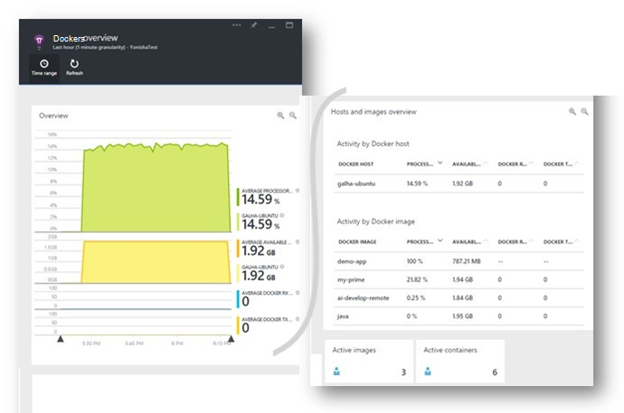
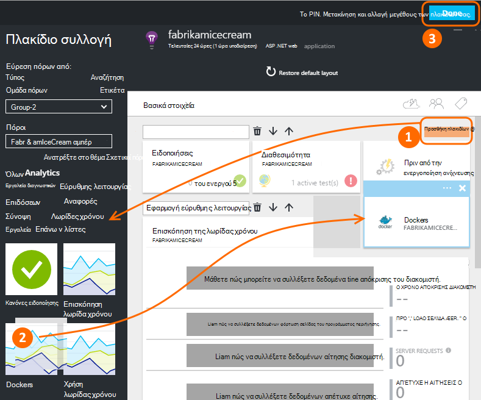
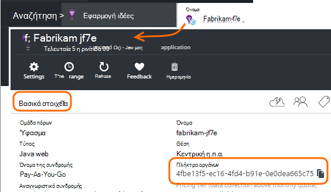
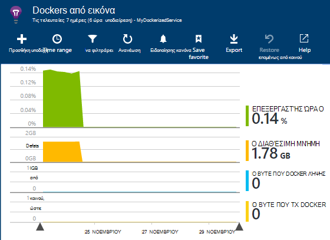
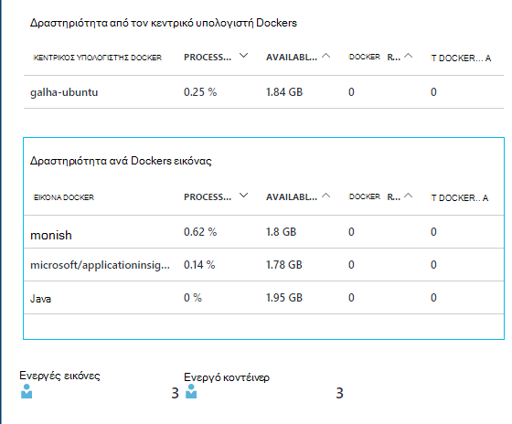
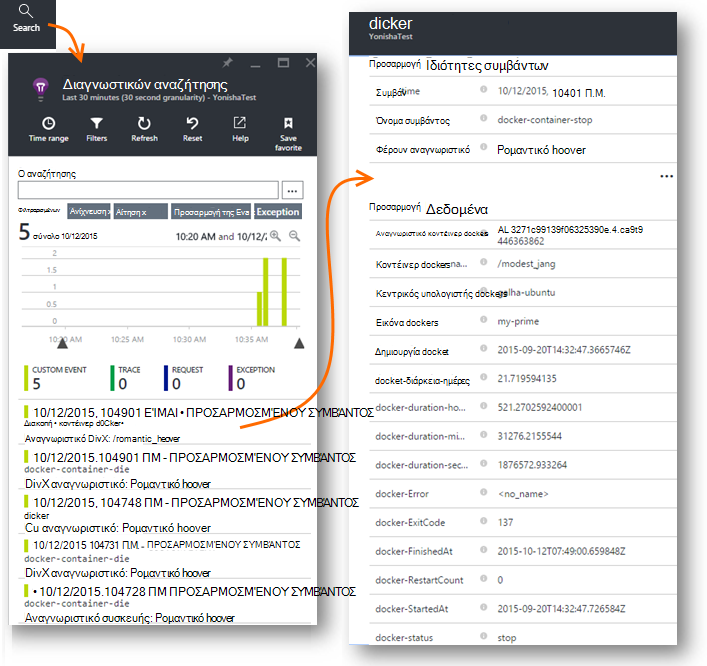
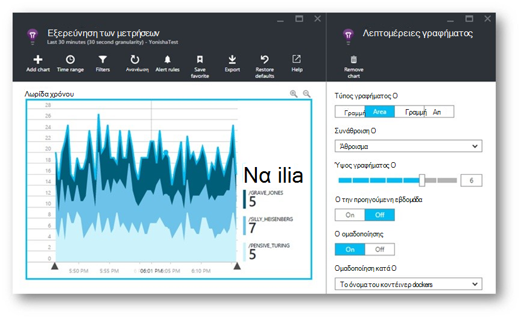
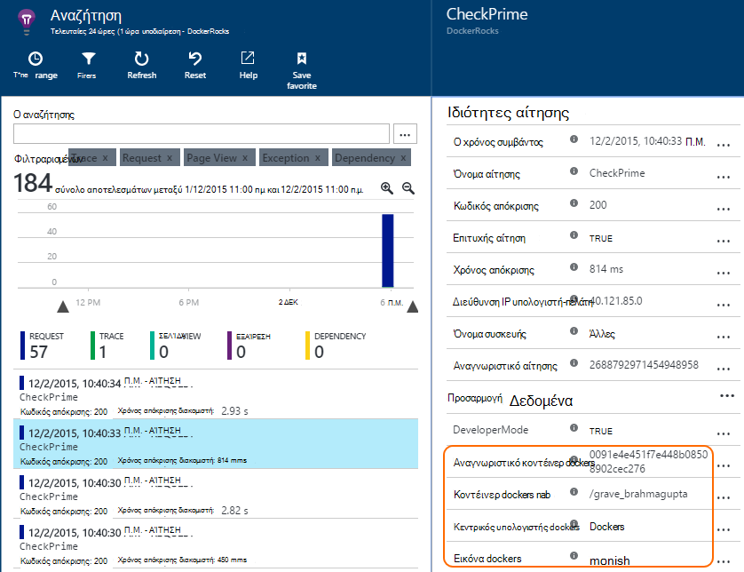
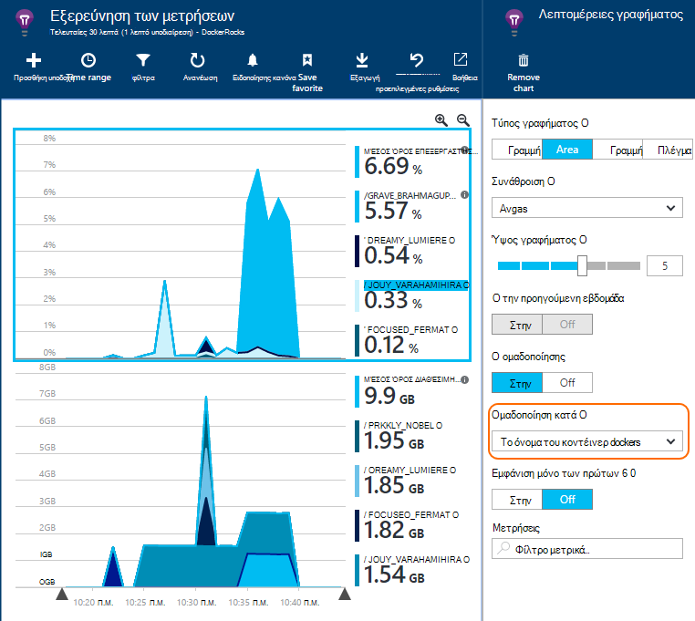

<properties 
    pageTitle="Εποπτεία εφαρμογών Docker στην εφαρμογή ιδέες" 
    description="Μετρητές επιδόσεων docker, συμβάντων και εξαιρέσεις μπορεί να εμφανίζεται στην εφαρμογή ιδέες, μαζί με το τηλεμετρίας από τις εφαρμογές του περιεχόμενα." 
    services="application-insights" 
    documentationCenter=""
    authors="alancameronwills" 
    manager="douge"/>

<tags 
    ms.service="application-insights" 
    ms.workload="tbd" 
    ms.tgt_pltfrm="ibiza" 
    ms.devlang="na" 
    ms.topic="article" 
    ms.date="12/01/2015" 
    ms.author="awills"/>
 
# <a name="monitor-docker-applications-in-application-insights"></a>Εποπτεία εφαρμογών Docker στην εφαρμογή ιδέες

Κύκλος ζωής συμβάντων και μετρητών επιδόσεων από το κοντέινερ [Docker](https://www.docker.com/) να απεικόνιση σε γράφημα στην εφαρμογή ιδέες. Εγκαταστήστε την [Εφαρμογή ιδέες](app-insights-overview.md) εικόνα σε ένα κοντέινερ στην υπηρεσία παροχής φιλοξενίας και θα εμφανίσει μετρητές επιδόσεων για τον κεντρικό υπολογιστή, καθώς και για τις άλλες εικόνες.

Με Docker μπορείτε να διανείμετε εφαρμογές σας σε πλήρη με όλες τις εξαρτήσεις ελαφριά κοντέινερ. Θα εκτελούνται σε οποιονδήποτε κεντρικό υπολογιστή που εκτελεί ένας μηχανισμός Docker.

Όταν εκτελείτε την [εφαρμογή ιδέες εικόνα](https://hub.docker.com/r/microsoft/applicationinsights/) στην υπηρεσία παροχής φιλοξενίας Docker, θα λάβετε τα εξής πλεονεκτήματα:

* Κύκλος ζωής τηλεμετρίας σχετικά με όλα τα κοντέινερ που εκτελείται στον κεντρικό υπολογιστή - Έναρξη, διακοπή και ούτω καθεξής.
* Μετρητές επιδόσεων για όλα τα κοντέινερ. CPU, μνήμης, χρήση δικτύου και πολλά άλλα.
* Εάν έχετε [εγκατεστημένη εφαρμογή ιδέες SDK](app-insights-java-live.md) των εφαρμογών που εκτελούνται στο το κοντέινερ, όλα τα τηλεμετρίας από αυτές τις εφαρμογές θα έχει πρόσθετες ιδιότητες εντοπισμός κοντέινερ και κεντρικού υπολογιστή. Επομένως, για παράδειγμα, εάν έχετε τις εμφανίσεις της εφαρμογής που εκτελούνται σε περισσότερους από έναν κεντρικούς υπολογιστές, εύκολα θα έχετε τη δυνατότητα να εφαρμόσετε το φίλτρο σας τηλεμετρίας εφαρμογής από τον κεντρικό υπολογιστή.




## <a name="set-up-your-application-insights-resource"></a>Ρύθμιση του πόρου ιδέες εφαρμογής

1. Πραγματοποιήστε είσοδο στο [Microsoft Azure πύλη](https://azure.com) και ανοίξτε τον πόρο εφαρμογής ιδέες για την εφαρμογή σας; ή [Δημιουργήστε ένα νέο](app-insights-create-new-resource.md). 

    *Τον πόρο που θα πρέπει να χρησιμοποιήσω;* Εάν τις εφαρμογές που χρησιμοποιείτε στην υπηρεσία παροχής φιλοξενίας αναπτύχθηκαν από κάποιον άλλο, στη συνέχεια, θα χρειαστεί να [δημιουργήσετε ένα νέο πόρο εφαρμογής ιδέες](app-insights-create-new-resource.md). Αυτό είναι όπου που προβάλετε και να αναλύσετε τα τηλεμετρίας. (Επιλέξτε 'Άλλο' για τον τύπο εφαρμογής).

    Ωστόσο, εάν είστε ο προγραμματιστής από τις εφαρμογές, στη συνέχεια, θα σας ελπίζετε [προσθέσει SDK ιδέες εφαρμογής](app-insights-java-live.md) σε κάθε μία από αυτές. Εάν βρίσκονται όλα πραγματικά στοιχεία από ένα μεμονωμένο επιχειρηματική εφαρμογή, στη συνέχεια, μπορείτε να ρυθμίσετε όλες τις για να στείλετε τηλεμετρίας σε έναν πόρο και θα χρησιμοποιήσετε αυτόν τον ίδιο πόρο για να εμφανίσετε τα δεδομένα Docker κύκλου ζωής και επιδόσεων. 

    Ένα τρίτο σενάριο είναι ότι έχετε αναπτύξει περισσότερες από τις εφαρμογές, αλλά χρησιμοποιείτε ξεχωριστή πόρους για να εμφανίσετε τους τηλεμετρίας. Σε αυτή την περίπτωση, θα πιθανώς επίσης να θέλετε να δημιουργήσετε έναν νέο πόρο για τα δεδομένα Docker. 

2.  Προσθέστε το πλακίδιο Docker: Επιλέξτε **Προσθήκη πλακίδιο**, σύρετε το πλακίδιο Docker από τη συλλογή και, στη συνέχεια, κάντε κλικ στην επιλογή **εργασία**. 

    


3. Κάντε κλικ στο αναπτυσσόμενο **Essentials** και αντιγράψτε τον αριθμό-κλειδί οργάνων. Θα χρησιμοποιήσετε για να υποδείξετε στο SDK πού να στείλετε το τηλεμετρίας.


    

Να διατηρήσετε το παράθυρο του προγράμματος περιήγησης που εύχρηστο, ενώ που θα επιστρέψει σε αυτό σύντομα για να δείτε τις τηλεμετρίας σας.


## <a name="run-the-application-insights-monitor-on-your-host"></a>Εκτελέστε την εφαρμογή ιδέες οθόνη στην υπηρεσία παροχής φιλοξενίας
 
Τώρα που έχετε στη διάθεσή σας κάποιο σημείο για να εμφανίσετε το τηλεμετρίας, μπορείτε να ρυθμίσετε την εφαρμογή περιεχόμενα που θα συλλέξετε και να το στείλετε.

1.  Σύνδεση με την υπηρεσία παροχής φιλοξενίας Docker. 
2.  Επεξεργασία αριθμού-κλειδιού οργάνων σε αυτή την εντολή και, στη συνέχεια, εκτελέστε το:
 
    ```

    docker run -v /var/run/docker.sock:/docker.sock -d microsoft/applicationinsights ikey=000000-1111-2222-3333-444444444
    ```

Απαιτείται μία μόνο εφαρμογή ιδέες εικόνα ανά Docker κεντρικού υπολογιστή. Εάν η εφαρμογή σας έχει αναπτυχθεί σε πολλούς κεντρικούς υπολογιστές Docker, στη συνέχεια, επαναλάβετε την εντολή σε κάθε κεντρικό υπολογιστή.

## <a name="update-your-app"></a>Ενημέρωση της εφαρμογής σας

Εάν η εφαρμογή σας διαθέτει όργανα με την [Εφαρμογή ιδέες SDK για Java](app-insights-java-get-started.md), προσθέστε την ακόλουθη γραμμή στο αρχείο ApplicationInsights.xml στο έργο σας, στην περιοχή του `<TelemetryInitializers>` στοιχείο:

```xml

    <Add type="com.microsoft.applicationinsights.extensibility.initializer.docker.DockerContextInitializer"/> 
```

Αυτό προσθέτει Docker πληροφορίες όπως κοντέινερ και αναγνωριστικό κεντρικού υπολογιστή για κάθε στοιχείο τηλεμετρίας αποστέλλεται από την εφαρμογή σας.

## <a name="view-your-telemetry"></a>Προβολή του τηλεμετρίας

Επιστρέψτε στο τον πόρο ιδέες εφαρμογής στην πύλη του Azure.

Κάντε κλικ στην επιλογή έως το πλακίδιο Docker.

Σύντομα θα δείτε δεδομένων φτάνει από την εφαρμογή Docker, ειδικά εάν έχετε άλλα κοντέινερ που εκτελούνται από το μηχανισμό Docker.


Εδώ θα βρείτε ορισμένες από τις προβολές που μπορείτε να λάβετε.

### <a name="perf-counters-by-host-activity-by-image"></a>Μετρητές επιδόσεων από τον κεντρικό υπολογιστή, δραστηριότητα από εικόνα








Κάντε κλικ σε οποιοδήποτε όνομα κεντρικού υπολογιστή ή την εικόνα για περισσότερες λεπτομέρειες.


Για να προσαρμόσετε την προβολή, κάντε κλικ σε οποιοδήποτε γράφημα, το πλέγμα επικεφαλίδας, ή χρησιμοποιήστε Προσθήκη γραφήματος. 

[Μάθετε περισσότερα σχετικά με την Εξερεύνηση των μετρήσεων](app-insights-metrics-explorer.md).

### <a name="docker-container-events"></a>Docker κοντέινερ συμβάντα




Για να εξερευνήσετε μεμονωμένα συμβάντα, κάντε κλικ στο κουμπί [Αναζήτηση](app-insights-diagnostic-search.md). Αναζήτησης και φίλτρου για να βρείτε τα συμβάντα που θέλετε. Κάντε κλικ σε οποιοδήποτε συμβάν για περισσότερες λεπτομέρειες.
 
### <a name="exceptions-by-container-name"></a>Εξαιρέσεις από το όνομα του κοντέινερ
 



### <a name="docker-context-added-to-app-telemetry"></a>Περιβάλλον docker προστεθεί σε εφαρμογή τηλεμετρίας

Αίτηση τηλεμετρίας αποστέλλονται από την εφαρμογή τοποθετηθεί αισθητήρας SDK AI, εμπλουτισμένα με Docker περιβάλλοντος:



Χρόνος επεξεργασίας και μετρητές επιδόσεων διαθέσιμη μνήμη, εμπλουτισμένη και ομαδοποιημένες κατά όνομα Docker κοντέινερ:





## <a name="q--a"></a>Ερωτήσεις και απαντήσεις

*Τι η εφαρμογή ιδέες τη που δεν είναι δυνατό να λαμβάνω από Docker;*

* Λεπτομερή ανάλυση των μετρητών επιδόσεων από το κοντέινερ και εικόνα.
* Ενοποίηση του κοντέινερ και εφαρμογή δεδομένων σε έναν πίνακα εργαλείων.
* [Εξαγωγή τηλεμετρίας](app-insights-export-telemetry.md) για περαιτέρω ανάλυση σε μια βάση δεδομένων, Power BI ή άλλες πίνακα εργαλείων.

*Πώς μπορώ να τηλεμετρίας από την ίδια την εφαρμογή;*

* Εγκαταστήστε την εφαρμογή ιδέες SDK στην εφαρμογή. Μάθετε τον τρόπο για: [Java εφαρμογές web](app-insights-java-get-started.md), [εφαρμογών web των Windows](app-insights-asp-net.md).
