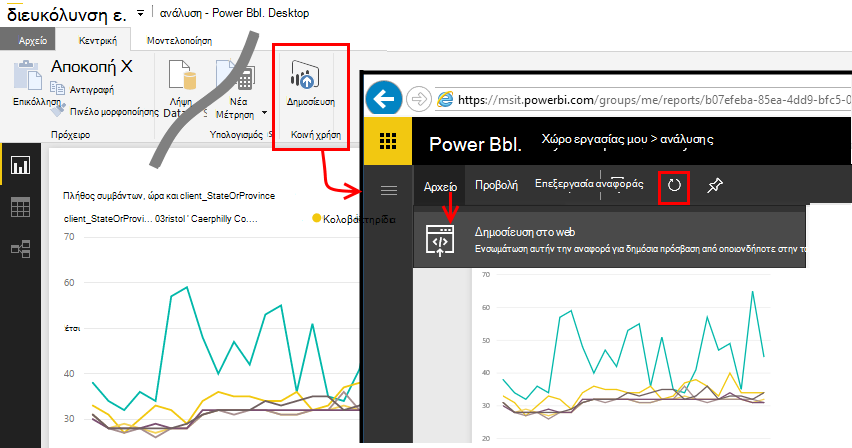

<properties 
    pageTitle="Εξαγωγή στο Power BI από εφαρμογή ιδέες | Microsoft Azure" 
    description="Ανάλυσης ερωτήματα μπορεί να εμφανίζεται στο Power BI." 
    services="application-insights" 
    documentationCenter=""
    authors="noamben" 
    manager="douge"/>

<tags 
    ms.service="application-insights" 
    ms.workload="tbd" 
    ms.tgt_pltfrm="ibiza" 
    ms.devlang="na" 
    ms.topic="article" 
    ms.date="10/18/2016" 
    ms.author="awills"/>

# Τροφοδοσία Power BI από εφαρμογή ιδέες

[Power BI](http://www.powerbi.com/) είναι μια οικογένεια business analytics εργαλεία που σας βοηθούν να αναλύετε δεδομένα και να μοιραστείτε ιδέες. Πίνακες εργαλείων εμπλουτισμένου είναι διαθέσιμες σε κάθε συσκευή. Μπορείτε να συνδυάσετε δεδομένα από πολλές προελεύσεις, όπως ερωτήματα αναλυτικών στοιχείων από το [Visual Studio εφαρμογή ιδέες](app-insights-overview.md).

Υπάρχουν τρεις μέθοδοι που προτείνονται εξαγωγή δεδομένων ιδέες εφαρμογής Power BI. Μπορείτε να τις χρησιμοποιήσετε ξεχωριστά ή μαζί.

* [**Προσαρμογέα power BI**](#power-pi-adapter) - ρύθμιση ολοκλήρωσης πίνακα εργαλείων του τηλεμετρίας από την εφαρμογή. Το σύνολο των γραφημάτων είναι προκαθορισμένες, αλλά μπορείτε να προσθέσετε τα δικά σας ερωτήματα από οποιεσδήποτε άλλες προελεύσεις.
* [**Εξαγωγή ανάλυσης ερωτήματα**](#export-analytics-queries) - Γράψτε ένα ερώτημα που θέλετε χρησιμοποιώντας την ανάλυση και το εξαγάγετε σε Power BI. Μπορείτε να τοποθετήσετε αυτό το ερώτημα σε έναν πίνακα εργαλείων μαζί με οποιαδήποτε άλλα δεδομένα.
* [**Συνεχής εξαγωγή και τις αναλύσεις ροή**](app-insights-export-stream-analytics.md) - αυτό περιλαμβάνει περισσότερη εργασία για να ρυθμίσετε. Αυτό είναι χρήσιμο αν θέλετε να διατηρήσετε τα δεδομένα σας για μεγάλα διαστήματα. Διαφορετικά, συνιστάται η τις άλλες μεθόδους.

## Power BI προσαρμογέα

Αυτή η μέθοδος δημιουργεί έναν πλήρη πίνακα εργαλείων του τηλεμετρίας για εσάς. Προκαθορισμένες το αρχικό σύνολο δεδομένων, αλλά μπορείτε να προσθέσετε περισσότερα δεδομένα σε αυτό.

### Λήψη του προσαρμογέα

1. Πραγματοποιήστε είσοδο στο [Power BI](https://app.powerbi.com/).
2. Άνοιγμα **λήψη δεδομένων**, **υπηρεσίες**, **ιδέες εφαρμογής**

    

3. Δώστε τις λεπτομέρειες του πόρου ιδέες εφαρμογής.

    

4. Περιμένετε ένα ή δύο για τα δεδομένα που θα εισαχθούν λεπτά.

    

Μπορείτε να επεξεργαστείτε τον πίνακα εργαλείων, συνδυασμό των γραφημάτων ιδέες εφαρμογής με αυτά από άλλες προελεύσεις, και ανάλυσης ερωτήματα. Υπάρχει μια συλλογή απεικόνισης, όπου μπορείτε να λάβετε περισσότερες γραφήματα και κάθε γράφημα έχει έναν μπορείτε να ρυθμίσετε τις παραμέτρους.

Μετά την αρχική εισαγωγή, στον πίνακα εργαλείων και τις αναφορές συνεχίζουν να ενημερώνονται καθημερινά. Μπορείτε να ελέγξετε το χρονοδιάγραμμα ανανέωσης σε του συνόλου δεδομένων.

## Εξαγωγή ανάλυσης ερωτήματα

Αυτή η δρομολόγηση σάς επιτρέπει να γράψετε οποιοδήποτε ερώτημα ανάλυση που θέλετε και, στη συνέχεια, εξαγωγή που σε έναν πίνακα εργαλείων του Power BI. (Μπορείτε να προσθέσετε στον πίνακα εργαλείων που δημιουργήθηκε από τον προσαρμογέα.)

### Μία φορά: εγκατάσταση του Power BI Desktop

Για να εισαγάγετε το ερώτημά σας ιδέες εφαρμογή, μπορείτε να χρησιμοποιήσετε την έκδοση υπολογιστή του Power BI. Ωστόσο, στη συνέχεια, μπορείτε να το δημοσιεύσετε στο Web ή στο χώρο εργασίας σας cloud Power BI. 

Εγκατάσταση του [Power BI Desktop](https://powerbi.microsoft.com/en-us/desktop/).

### Εξαγωγή ενός ερωτήματος ανάλυσης

1. [Άνοιγμα ανάλυσης και να γράφετε το ερώτημά σας](app-insights-analytics-tour.md).
2. Δοκιμή και να βελτιώνουμε το ερώτημα μέχρι να είστε ικανοποιημένοι με τα αποτελέσματα.
3. Στο μενού **Εξαγωγή** , επιλέξτε **Power BI (M)**. Αποθηκεύστε το αρχείο κειμένου.

    
4. Στο Power BI Desktop επιλέξτε **γρήγορα δεδομένα, κενό ερώτημα** και, στη συνέχεια, στο πρόγραμμα επεξεργασίας ερωτήματος, στην περιοχή **Προβολή** επιλέξτε **Πρόγραμμα επεξεργασίας ερωτήματος για προχωρημένους**.

    Επικολλήστε το εξαγόμενο δέσμη ενεργειών M γλώσσας σε του ερωτήματος πρόγραμμα επεξεργασίας για προχωρημένους.

    

5. Ίσως χρειαστεί να καταχωρήσετε τα διαπιστευτήρια για να επιτρέψετε Power BI για να αποκτήσετε πρόσβαση Azure. Χρησιμοποιήστε 'εταιρικός λογαριασμός' για να συνδεθείτε με το λογαριασμό Microsoft.

    

6. Επιλέξτε μια απεικόνιση για το ερώτημά σας και επιλέξτε τα πεδία για άξονα x άξονα y και διαίρεση διάστασης.

    

7. Δημοσίευση της αναφοράς στο χώρο εργασίας σας cloud Power BI. Από εδώ, μπορείτε να ενσωματώσετε μια συγχρονισμένη έκδοση σε άλλες σελίδες web.

    
 
8. Ανανέωση της αναφοράς με μη αυτόματο τρόπο σε χρονικά διαστήματα, ή να ρυθμίσετε μια προγραμματισμένη ανανέωση στη σελίδα Επιλογές.

## Σχετικά με τη δειγματοληψία

Εάν η εφαρμογή σας στείλει πολλά δεδομένα, η δυνατότητα προσαρμόσιμης δειγματοληψία μπορεί να εφαρμόζει και αποστολή μόνο ποσοστό του τηλεμετρίας σας. Το ίδιο ισχύει εάν έχετε ρυθμίσει με μη αυτόματο τρόπο δειγματοληψία είτε στο SDK είτε σε κατάποσης. [Μάθετε περισσότερα σχετικά με τη δειγματοληψία.](app-insights-sampling.md)
 

## Επόμενα βήματα

* [Power BI - μάθετε](http://www.powerbi.com/learning/)
* [Πρόγραμμα εκμάθησης ανάλυσης](app-insights-analytics-tour.md)
