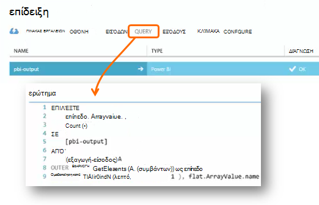

<properties 
    pageTitle="Χρήση ροής ανάλυσης για την επεξεργασία δεδομένων που έχουν εξαχθεί από εφαρμογή ιδέες | Microsoft Azure" 
    description="Ανάλυση ροή να συνεχώς μετασχηματισμός, το φιλτράρισμα και δρομολόγηση των δεδομένων που εξάγετε από εφαρμογή ιδέες." 
    services="application-insights" 
    documentationCenter=""
    authors="noamben" 
    manager="douge"/>

<tags 
    ms.service="application-insights" 
    ms.workload="tbd" 
    ms.tgt_pltfrm="ibiza" 
    ms.devlang="na" 
    ms.topic="article" 
    ms.date="10/18/2016" 
    ms.author="awills"/>

# <a name="use-stream-analytics-to-process-exported-data-from-application-insights"></a>Χρήση ροής ανάλυσης για την επεξεργασία δεδομένων που έχουν εξαχθεί από εφαρμογή ιδέες

[Ανάλυση ροή Azure](https://azure.microsoft.com/services/stream-analytics/) είναι το ιδανικό εργαλείο για την επεξεργασία των δεδομένων [που έχουν εξαχθεί από εφαρμογή ιδέες](app-insights-export-telemetry.md). Ανάλυση ροή μπορούν να χρησιμοποιούν δεδομένα από μια ποικιλία προελεύσεων. Αυτό μπορεί να μετασχηματισμός φιλτράρισμα των δεδομένων, και, στη συνέχεια, να το δρομολόγηση με μια ποικιλία δέκτες.

Σε αυτό το παράδειγμα, θα δημιουργήσουμε έναν προσαρμογέα που λαμβάνει δεδομένα από εφαρμογή ιδέες, μετονομάζει και επεξεργάζεται ορισμένα από τα πεδία και το σωλήνες στο Power BI.

> [AZURE.WARNING] Υπάρχουν πολλά καλύτερα και πιο [προτεινόμενοι τρόποι για να εμφανίσετε δεδομένα ιδέες εφαρμογή στο Power BI](app-insights-export-power-bi.md). Τη διαδρομή που φαίνεται στην παρακάτω εικόνα αποτελεί παράδειγμα μόνο για την απεικόνιση πώς να επεξεργάζονται τα εξαγόμενα δεδομένα.


## <a name="create-storage-in-azure"></a>Δημιουργία χώρου αποθήκευσης στο Azure

Συνεχής εξαγωγή πάντα εξάγει δεδομένα σε ένα λογαριασμό αποθήκευσης Azure, ώστε να πρέπει πρώτα να δημιουργήσετε το χώρο αποθήκευσης.

1.  Δημιουργία λογαριασμού "κλασική" χώρο αποθήκευσης στη συνδρομή σας στην [πύλη του Azure](https://portal.azure.com).

    

2. Δημιουργία κοντέινερ

    

3. Αντιγράψτε το πλήκτρο πρόσβασης χώρου αποθήκευσης

    Θα χρειαστεί σύντομα για να ρυθμίσετε την είσοδο στην υπηρεσία ανάλυσης ροής.

    

## <a name="start-continuous-export-to-azure-storage"></a>Έναρξη συνεχής εξαγωγή με το χώρο αποθήκευσης Azure

[Εξαγωγή συνεχούς](app-insights-export-telemetry.md) μετακινεί δεδομένα από εφαρμογή ιδέες σε Azure χώρου αποθήκευσης.

1. Στην πύλη του Azure, αναζητήστε τον πόρο ιδέες εφαρμογής που δημιουργήσατε για την εφαρμογή σας.

    

2. Δημιουργία μιας συνεχούς εξαγωγής.

    


    Επιλέξτε το λογαριασμό χώρου αποθήκευσης που δημιουργήσατε νωρίτερα:

    
    
    Ορίστε τους τύπους συμβάντων που θέλετε να δείτε:

    

3. Ενημερώστε ορισμένες συγκεντρώσουν τα δεδομένα. Καθίσετε πίσω και να επιτρέψετε στους χρήστες να χρησιμοποιήσουν την εφαρμογή σας για κάποιο χρονικό διάστημα. Τηλεμετρίας να παραδίδεται και θα δείτε στατιστικών γραφημάτων στην [Εξερεύνηση των μετρικό](app-insights-metrics-explorer.md) και μεμονωμένα συμβάντα στο [διαγνωστικών αναζήτησης](app-insights-diagnostic-search.md). 

    Και, επίσης, θα εξαγάγετε τα δεδομένα για το χώρο αποθήκευσης. 

4. Έλεγχος τα εξαγόμενα δεδομένα. Στο Visual Studio, επιλέξτε **Προβολή / Cloud Explorer**, και ανοίξτε το Azure / χώρου αποθήκευσης. (Εάν δεν έχετε αυτήν την επιλογή μενού, πρέπει να εγκαταστήσετε το SDK Azure: Ανοίξτε το παράθυρο διαλόγου νέο έργο και ανοίξτε το Visual C# / Cloud / λήψη Microsoft Azure SDK για το .NET.)

    

    Σημειώστε το κοινό τμήμα του ονόματος της διαδρομής, που προέρχεται από το όνομα και οργάνων πλήκτρο εφαρμογής. 

Τα συμβάντα εγγράφονται αντικειμένων blob αρχεία σε μορφή JSON. Κάθε αρχείο μπορεί να περιέχει ένα ή περισσότερα συμβάντα. Επομένως, θα σας θα θέλατε να διαβάσει τα δεδομένα του συμβάντος και φιλτράρετε τα πεδία θέλουμε. Υπάρχουν όλοι οι τύποι πράγματα που θα μπορούσε να κάνουμε με τα δεδομένα, αλλά το σχεδίου σήμερα είναι να χρησιμοποιήσετε ανάλυση ροής στη διοχέτευση των δεδομένων στο Power BI.

## <a name="create-an-azure-stream-analytics-instance"></a>Δημιουργήστε μια παρουσία ανάλυση ροή Azure

Από την [Πύλη κλασική Azure](https://manage.windowsazure.com/), επιλέξτε την υπηρεσία Azure ροή ανάλυση και δημιουργία νέας ανάλυσης ροής εργασίας:


Όταν δημιουργείται το νέο έργο, αναπτύξτε τις λεπτομέρειες:


### <a name="set-blob-location"></a>Ορισμός τοποθεσίας blob

Ρύθμιση για να λάβετε είσοδο από το blob συνεχής εξαγωγή:


Τώρα θα πρέπει το πρωτεύον κλειδί πρόσβασης από το λογαριασμό χώρου αποθήκευσης, η οποία σημειώσατε προηγουμένως. Ρύθμιση ως το κλειδί λογαριασμού χώρου αποθήκευσης.


### <a name="set-path-prefix-pattern"></a>Ορισμός διαδρομής πρόθεμα μοτίβου 


**Φροντίστε να ρυθμίσετε τη μορφή ημερομηνίας εεεε-ηη (με παύλες).**

Το μοτίβο πρόθεμα διαδρομή Καθορίζει όπου ανάλυση ροή εντοπίζει τα αρχεία εισόδου από το χώρο αποθήκευσης. Πρέπει να ρυθμίσετε ώστε να αντιστοιχούν στις πώς συνεχής εξαγωγή αποθηκεύει τα δεδομένα. Ορίστε την ως εξής:

    webapplication27_12345678123412341234123456789abcdef0/PageViews/{date}/{time}

Σε αυτό το παράδειγμα:

* `webapplication27`είναι το όνομα της εφαρμογής ιδέες πόρων **όλα πεζά**.
* `1234...`είναι το κλειδί οργάνων του πόρου εφαρμογή ιδέες, **παραλείποντας παύλες**. 
* `PageViews`είναι ο τύπος δεδομένων που θέλετε να αναλύσετε. Τους διαθέσιμους τύπους εξαρτώνται από το φίλτρο που ορίζετε σε συνεχή εξαγωγή. Εξετάστε τα εξαγόμενα δεδομένα για να δείτε τους διαθέσιμους τύπους και δείτε την [Εξαγωγή μοντέλου δεδομένων](app-insights-export-data-model.md).
* `/{date}/{time}`γράφεται ως έχουν ένα μοτίβο.

> [AZURE.NOTE] Έλεγχος του χώρου αποθήκευσης για να βεβαιωθείτε ότι θα έχετε τη διαδρομή δεξιά.

### <a name="finish-initial-setup"></a>Αρχική ρύθμιση λήξης

Επιβεβαιώστε τη μορφή σειριοποίησης:


Κλείστε τον οδηγό και περιμένετε για την ολοκλήρωση της εγκατάστασης.

> [AZURE.TIP] Χρησιμοποιήστε την εντολή δείγμα για να κάνετε λήψη ορισμένα δεδομένα. Διατηρήστε την επιλογή ως δείγμα δοκιμής για τον εντοπισμό σφαλμάτων το ερώτημά σας.

## <a name="set-the-output"></a>Ορίστε την έξοδο

Τώρα, επιλέξτε την εργασία σας και ορίστε την έξοδο.


Δώστε την **εργασία ή το σχολικό λογαριασμό** για να εξουσιοδοτήσετε ανάλυση ροής για να αποκτήσετε πρόσβαση του πόρου Power BI. Στη συνέχεια, πληκτρολογήστε ένα όνομα για το αποτέλεσμα του, καθώς και για το σύνολο δεδομένων Power BI προορισμού και πίνακα.


## <a name="set-the-query"></a>Ορισμός του ερωτήματος

Το ερώτημα Καθορίζει τη μετάφραση από την είσοδο για να εξαγάγετε.




Χρησιμοποιήστε τη συνάρτηση δοκιμή για να ελέγξετε ότι έχετε το σωστό αποτέλεσμα. Δώστε το δείγμα δεδομένων που έγιναν από τη σελίδα εισόδων. 

### <a name="query-to-display-counts-of-events"></a>Ερώτημα για να εμφανίσετε την καταμέτρηση συμβάντων

Επικολλήστε το ερώτημα:

```SQL

    SELECT
      flat.ArrayValue.name,
      count(*)
    INTO
      [pbi-output]
    FROM
      [export-input] A
    OUTER APPLY GetElements(A.[event]) as flat
    GROUP BY TumblingWindow(minute, 1), flat.ArrayValue.name
```

* Εξαγωγή εισόδου είναι το ψευδώνυμο που θα σας δώσει στη ροή εισαγωγής
* ρβι εξόδου είναι το ψευδώνυμο εξόδου ορίσαμε
* Χρησιμοποιούμε [ΕΞΩΤΕΡΙΚΌ GetElements ΕΦΑΡΜΟΓΉ](https://msdn.microsoft.com/library/azure/dn706229.aspx) , επειδή είναι το όνομα του συμβάντος σε μια ένθετη arrray JSON. Στη συνέχεια, επιλέξτε επιλέγει το όνομα του συμβάντος, μαζί με μια καταμέτρηση του αριθμού των παρουσιών με αυτό το όνομα στη χρονική περίοδο. Ο όρος [Group By](https://msdn.microsoft.com/library/azure/dn835023.aspx) ομαδοποιεί τα στοιχεία σε χρονικές περιόδους 1 λεπτού.


### <a name="query-to-display-metric-values"></a>Ερώτημα για να εμφανίσετε τιμές μονάδων μέτρησης


```SQL

    SELECT
      A.context.data.eventtime,
      avg(CASE WHEN flat.arrayvalue.myMetric.value IS NULL THEN 0 ELSE  flat.arrayvalue.myMetric.value END) as myValue
    INTO
      [pbi-output]
    FROM
      [export-input] A
    OUTER APPLY GetElements(A.context.custom.metrics) as flat
    GROUP BY TumblingWindow(minute, 1), A.context.data.eventtime

``` 

* Αυτό το ερώτημα ΓΥΜΝΑΣΙΑ σε το τηλεμετρίας μετρήσεις για να λάβετε την ώρα συμβάν και την τιμή μέτρησης. Οι τιμές μετρικό είναι μέσα σε έναν πίνακα, ώστε να χρησιμοποιήσουμε το μοτίβο ΕΞΩΤΕΡΙΚΌ GetElements ΕΦΑΡΜΟΓΉ για να εξαγάγετε τις γραμμές. "myMetric" είναι το όνομα του τη μέτρηση σε αυτήν την περίπτωση. 

### <a name="query-to-include-values-of-dimension-properties"></a>Ερώτημα για να συμπεριλάβετε τιμές ιδιοτήτων διάστασης

```SQL

    WITH flat AS (
    SELECT
      MySource.context.data.eventTime as eventTime,
      InstanceId = MyDimension.ArrayValue.InstanceId.value,
      BusinessUnitId = MyDimension.ArrayValue.BusinessUnitId.value
    FROM MySource
    OUTER APPLY GetArrayElements(MySource.context.custom.dimensions) MyDimension
    )
    SELECT
     eventTime,
     InstanceId,
     BusinessUnitId
    INTO AIOutput
    FROM flat

```

* Αυτό το ερώτημα περιλαμβάνει τιμές από τις ιδιότητες διάσταση χωρίς ανάλογα με μια συγκεκριμένη διάσταση που έχει τεθεί σε ένα σταθερό ευρετήριο στον πίνακα Διάσταση.

## <a name="run-the-job"></a>Εκτέλεση της εργασίας

Μπορείτε να επιλέξετε μια ημερομηνία στο παρελθόν για να ξεκινήσει η εργασία από. 


Περιμένετε μέχρι την εκτέλεση του έργου.

## <a name="see-results-in-power-bi"></a>Δείτε τα αποτελέσματα στο Power BI

> [AZURE.WARNING] Υπάρχουν πολλά καλύτερα και πιο [προτεινόμενοι τρόποι για να εμφανίσετε δεδομένα ιδέες εφαρμογή στο Power BI](app-insights-export-power-bi.md). Τη διαδρομή που φαίνεται στην παρακάτω εικόνα αποτελεί παράδειγμα μόνο για την απεικόνιση πώς να επεξεργάζονται τα εξαγόμενα δεδομένα.

Ανοίξτε Power BI με τον εταιρικό ή σχολικό λογαριασμό, και επιλέξτε το σύνολο δεδομένων και ο πίνακας που ορίσατε ως το αποτέλεσμα της ανάλυσης ροής εργασίας.


Τώρα μπορείτε να χρησιμοποιήσετε το σύνολο δεδομένων σε αναφορές και πίνακες εργαλείων στο [Power BI](https://powerbi.microsoft.com).


## <a name="no-data"></a>Δεν υπάρχουν δεδομένα;

* Ελέγξτε που θα [ορίσετε τη μορφή ημερομηνίας](#set-path-prefix-pattern) σωστά σε εεεε-ηη (με παύλες).


## <a name="video"></a>Βίντεο

Zeev Βασίλη Noam δείχνει τον τρόπο για την επεξεργασία δεδομένων που έχουν εξαχθεί ροή αναλυτικών στοιχείων χρήσης.

> [AZURE.VIDEO export-to-power-bi-from-application-insights]

## <a name="next-steps"></a>Επόμενα βήματα

* [Συνεχής εξαγωγής](app-insights-export-telemetry.md)
* [Λεπτομερή δεδομένα του μοντέλου αναφορά για το τύποι ιδιοτήτων και τις τιμές.](app-insights-export-data-model.md)
* [Εφαρμογή ιδέες](app-insights-overview.md)
* [Περισσότερα παραδείγματα και αναλυτικές παρουσιάσεις](app-insights-code-samples.md)
 
