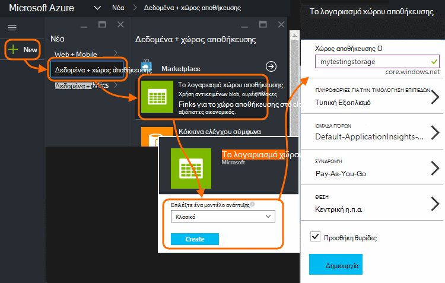
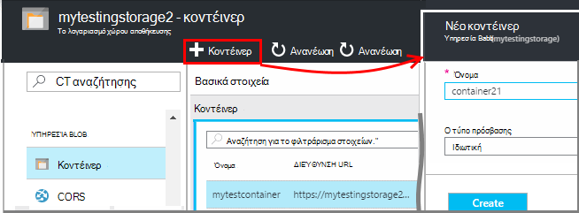
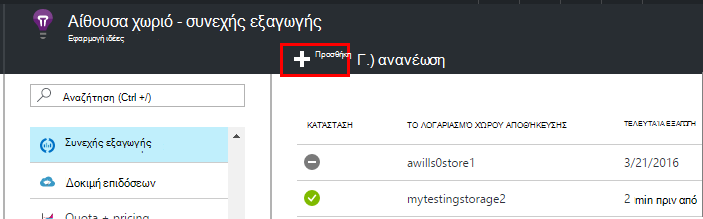
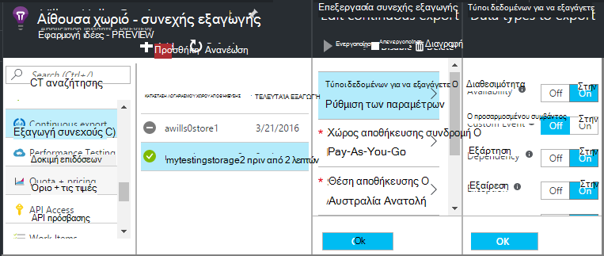
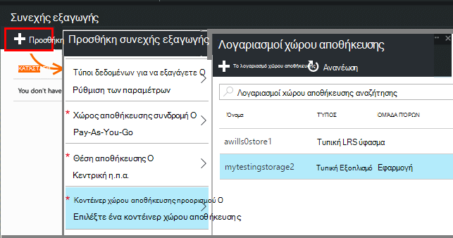
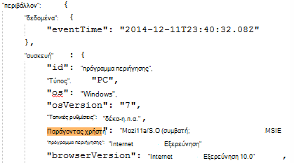
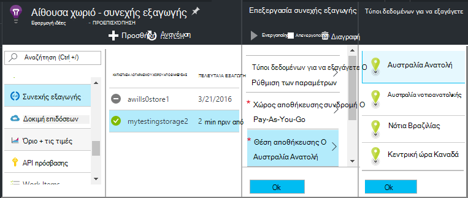

<properties 
    pageTitle="Συνεχής εξαγωγή των τηλεμετρίας από εφαρμογή ιδέες | Microsoft Azure" 
    description="Εξαγωγή δεδομένων χρήσης και διαγνωστικά με το χώρο αποθήκευσης στο Microsoft Azure και κάντε λήψη του από εκεί." 
    services="application-insights" 
    documentationCenter=""
    authors="alancameronwills" 
    manager="douge"/>

<tags 
    ms.service="application-insights" 
    ms.workload="tbd" 
    ms.tgt_pltfrm="ibiza" 
    ms.devlang="na" 
    ms.topic="article" 
    ms.date="10/18/2016" 
    ms.author="awills"/>
 
# Εξαγωγή τηλεμετρίας από εφαρμογή ιδέες

Θέλετε να διατηρήσετε το τηλεμετρίας για περισσότερο από την περίοδο τυπική διατήρησης; Ή επεξεργασίας του εγγράφου με ορισμένες εξειδικευμένες τρόπο; Συνεχής εξαγωγή είναι ιδανική για αυτό. Τα συμβάντα που βλέπετε στην πύλη εφαρμογής ιδέες μπορούν να εξαχθούν στο χώρο αποθήκευσης στο Microsoft Azure σε μορφή JSON. Από εκεί, μπορείτε να κάνετε λήψη των δεδομένων σας και γράψτε ό, τι κώδικα που πρέπει να επεξεργαστεί.  

Συνεχής εξαγωγή είναι διαθέσιμη στην περίοδο του δωρεάν δοκιμαστικής έκδοσης και στην [τυπική και Premium για τις τιμές του προγράμματος](https://azure.microsoft.com/pricing/details/application-insights/).

Πριν να ρυθμίσετε τη συνεχή εξαγωγή, υπάρχουν μερικές εναλλακτικές λύσεις που μπορεί να θέλετε να λάβετε υπόψη:

* [Εξαγάγετε το κουμπί](app-insights-metrics-explorer.md#export-to-excel) στο επάνω μέρος μιας blade μετρικά ή κάντε αναζήτηση σάς επιτρέπει να μεταφέρετε πίνακες και γραφήματα σε ένα υπολογιστικό φύλλο του Excel. 
* [Ανάλυση](app-insights-analytics.md) παρέχει μια γλώσσα ερωτημάτων ισχυρή για τηλεμετρίας και επίσης να εξαγάγετε αποτελέσματα.
* Αν θέλετε να [εξερευνήσετε τα δεδομένα σας στο Power BI](http://blogs.msdn.com/b/powerbi/archive/2015/11/04/explore-your-application-insights-data-with-power-bi.aspx), μπορείτε να το κάνετε χωρίς τη χρήση συνεχής εξαγωγή.

## Δημιουργία λογαριασμού χώρου αποθήκευσης

Εάν δεν έχετε ήδη ένα λογαριασμό "κλασική" χώρου αποθήκευσης, δημιουργήστε μία τώρα.

1. Δημιουργία λογαριασμού χώρου αποθήκευσης στη συνδρομή σας στην [πύλη του Azure](https://portal.azure.com).

    

2. Δημιουργία κοντέινερ.

    

## Ρύθμιση του συνεχής εξαγωγή

Στην blade Επισκόπηση της εφαρμογής σας στην πύλη εφαρμογής ιδέες, ανοίξτε τη συνεχή εξαγωγή: 

Προσθέστε μια συνεχόμενη εξαγωγή και, επιλέξτε τους τύπους συμβάντων που θέλετε να εξαγάγετε:

Επιλέξτε ή δημιουργήστε το [λογαριασμό χώρου αποθήκευσης Azure](../storage/storage-introduction.md) όπου θέλετε να αποθηκεύσετε τα δεδομένα:

Αφού δημιουργήσετε την εξαγωγή, ξεκινά μεταβαίνοντας. (Μόνο λαμβάνετε τα δεδομένα που λαμβάνονται αφού δημιουργήσετε την εξαγωγή.) 

Μπορεί να υπάρχει μια καθυστέρηση περίπου μία ώρα πριν από τα δεδομένα που εμφανίζονται στο αντικείμενο blob.

Εάν θέλετε να αλλάξετε τους τύπους συμβάντων αργότερα, απλώς επεξεργαστείτε την εξαγωγή:

Για να διακόψετε τη ροή, κάντε κλικ στην επιλογή Απενεργοποίηση. Όταν επιλέξετε ξανά ενεργοποίηση, θα γίνει επανεκκίνηση της ροής με νέα δεδομένα. Δεν θα λάβετε τα δεδομένα που έφτασαν στην πύλη κατά την εξαγωγή έχει απενεργοποιηθεί.

Για να διακόψετε τη ροή μόνιμα, διαγράψτε την εξαγωγή. Αυτή η ενέργεια δεν διαγράφει τα δεδομένα σας από το χώρο αποθήκευσης.

#### Δεν είναι δυνατό να προσθέσετε ή να αλλάξετε μια εξαγωγή;

* Για να προσθέσετε ή να αλλάξετε εξαγωγές, χρειάζεστε κάτοχο, συνεργάτη ή εφαρμογή ιδέες συμβολής δικαιώματα πρόσβασης. [Μάθετε περισσότερα σχετικά με τους ρόλους][roles].

## Ποια συμβάντα λαμβάνετε;

Τα εξαγόμενα δεδομένα είναι τα ανεπεξέργαστα τηλεμετρίας λαμβάνουμε από την εφαρμογή σας, με τη διαφορά ότι προσθέσουμε δεδομένα τοποθεσίας που θα σας υπολογίζει την από τη διεύθυνση IP του υπολογιστή-πελάτη. 

Δεδομένα που έχει απορριφθεί με [δειγματοληψία](app-insights-sampling.md) δεν περιλαμβάνεται στα εξαγόμενα δεδομένα.

Άλλες υπολογιζόμενες μετρήσεις δεν περιλαμβάνονται. Για παράδειγμα, θα σας δεν εξαγωγή μέσου αξιοποίηση CPU, αλλά θα σας εξαγωγή τα ανεπεξέργαστα τηλεμετρίας από το οποίο έχει υπολογιστεί ο μέσος όρος.

Τα δεδομένα περιλαμβάνει επίσης τα αποτελέσματα [διαθεσιμότητα web δοκιμών που](app-insights-monitor-web-app-availability.md) έχετε ορίσει. 

> [AZURE.NOTE] **Δειγματοληψία.** Εάν η εφαρμογή σας στέλνει πολλά δεδομένα και χρησιμοποιείτε το SDK ιδέες εφαρμογής για ASP.NET έκδοση 2.0.0-beta3 ή νεότερη έκδοση, η δυνατότητα προσαρμόσιμης δειγματοληψία μπορεί να εφαρμόζει και αποστολή μόνο ποσοστό του τηλεμετρίας σας. [Μάθετε περισσότερα σχετικά με τη δειγματοληψία.](app-insights-sampling.md)

## Έλεγχος των δεδομένων

Μπορείτε να ελέγξετε το χώρο αποθήκευσης απευθείας στην πύλη του. Κάντε κλικ στο κουμπί **Αναζήτηση**, επιλέξτε το λογαριασμό χώρου αποθήκευσης και, στη συνέχεια, ανοίξτε το **κοντέινερ**.

Για να ελέγξετε Azure χώρου αποθήκευσης στο Visual Studio, ανοίξετε την **Προβολή**, **Cloud Explorer**. (Εάν δεν έχετε αυτήν την εντολή μενού, πρέπει να εγκαταστήσετε το SDK Azure: Ανοίξτε το παράθυρο διαλόγου **Νέο έργο** , αναπτύξτε το στοιχείο Visual C# / στο Cloud και επιλέξτε **Λήψη του Microsoft Azure SDK για .NET**.)

Όταν ανοίγετε το χώρο αποθήκευσης αντικειμένων blob, θα δείτε ένα κοντέινερ με ένα σύνολο αντικειμένων blob αρχείων. Το URI κάθε αρχείο που προέρχονται από το όνομα του πόρου ιδέες εφαρμογής, το πλήκτρο οργάνων, τηλεμετρίας-τύπος/ημερομηνίας/ώρας. (Το όνομα του πόρου είναι όλοι με πεζά και τον αριθμό-κλειδί οργάνων παραλείπει παύλες.)

Ημερομηνίας και ώρας είναι UTC και όταν το τηλεμετρίας έχει κατάθεση στο χώρο αποθήκευσης - όχι την ώρα που δημιουργήθηκε. Επομένως, Εάν συντάσσετε κώδικα για να κάνετε λήψη των δεδομένων, αυτό να μετακινήσετε γραμμικά στα δεδομένα.

Εδώ είναι η μορφή της διαδρομής:

    $"{applicationName}_{instrumentationKey}/{type}/{blobDeliveryTimeUtc:yyyy-MM-dd}/{ blobDeliveryTimeUtc:HH}/{blobId}_{blobCreationTimeUtc:yyyyMMdd_HHmmss}.blob"
  
Όπου 

-   `blobCreationTimeUtc`η ώρα δημιουργίας blob η εσωτερική ενδιάμεσου χώρο αποθήκευσης
-   `blobDeliveryTimeUtc`είναι η ώρα κατά την αποθήκευση προορισμού εξαγωγή αντιγράφονται blob

## Μορφοποίηση δεδομένων

* Κάθε blob είναι ένα αρχείο κειμένου που περιέχει πολλές ' \n'-separated γραμμών. Περιέχει το τηλεμετρίας υποβάλλονται σε επεξεργασία μια χρονική περίοδο της περίπου μισό λεπτό.
* Κάθε γραμμή αντιπροσωπεύει ένα σημείο δεδομένων τηλεμετρίας όπως μια αίτηση ή προβολή σελίδας.
* Κάθε γραμμή είναι μια μη μορφοποιημένους έγγραφο JSON. Εάν θέλετε να καθίσετε και stare τη, ανοίξτε το στο Visual Studio και επιλέξτε Επεξεργασία, για προχωρημένους, μορφή αρχείου:

Ώρα διάρκειες βρίσκονται σε διαβαθμίσεις, όπου 10 000 υποδιαιρέσεις = 1ms. Για παράδειγμα, αυτές οι τιμές εμφάνιση μιας ώρας της 1ms για να στείλετε μια αίτηση από το πρόγραμμα περιήγησης, 3ms για τη λήψη του και 1.8s για την επεξεργασία της σελίδας στο πρόγραμμα περιήγησης:

    "sendRequest": {"value": 10000.0},
    "receiveRequest": {"value": 30000.0},
    "clientProcess": {"value": 17970000.0}

[Λεπτομερή δεδομένα του μοντέλου αναφορά για το τύποι ιδιοτήτων και τις τιμές.](app-insights-export-data-model.md)

## Επεξεργασία των δεδομένων

Σε μικρές κλίμακα, μπορείτε να συντάξετε ορισμένες κώδικα για να αποσπάσετε απομακρύνετε τα δεδομένα σας, διαβάστε την σε ένα υπολογιστικό φύλλο και ούτω καθεξής. Για παράδειγμα:

    private IEnumerable<T> DeserializeMany<T>(string folderName)
    {
      var files = Directory.EnumerateFiles(folderName, "*.blob", SearchOption.AllDirectories);
      foreach (var file in files)
      {
         using (var fileReader = File.OpenText(file))
         {
            string fileContent = fileReader.ReadToEnd();
            IEnumerable<string> entities = fileContent.Split('\n').Where(s => !string.IsNullOrWhiteSpace(s));
            foreach (var entity in entities)
            {
                yield return JsonConvert.DeserializeObject<T>(entity);
            }
         }
      }
    }

Για μεγαλύτερη δείγμα κώδικα, ανατρέξτε στο θέμα [Χρήση ένα ρόλο εργαζόμενου][exportasa].

## Διαγράψτε το παλιό δεδομένων
Έχετε υπόψη ότι είστε υπεύθυνοι για τη διαχείριση του χωρητικότητα αποθήκευσης και να διαγράψετε τα παλιά δεδομένα, εάν είναι απαραίτητο. 

## Αν αναδημιουργήσετε το κλειδί αποθήκευσης...

Εάν αλλάξετε τον αριθμό-κλειδί για το χώρο αποθήκευσης, λόγω των συνεχών εξαγωγής θα σταματήσουν να λειτουργούν. Θα δείτε μια ειδοποίηση στο λογαριασμό σας στο Azure. 

Ανοίξτε το blade συνεχής εξαγωγή και επεξεργαστείτε την εξαγωγή. Επεξεργαστείτε τον προορισμό εξαγωγή, αλλά απλώς αφήστε τον ίδιο χώρο αποθήκευσης που επιλέξατε. Κάντε κλικ στο κουμπί OK για να τον επιβεβαιώσετε.

Θα γίνει επανεκκίνηση της συνεχούς εξαγωγή.

## Εξαγωγή δείγματα

* [Εξαγωγή σε SQL χρησιμοποιώντας ένα ρόλο εργαζόμενου][exportcode]
* [Εξαγωγή σε SQL ροή αναλυτικών στοιχείων χρήσης][exportasa]
* [Δείγμα ροής ανάλυσης 2](app-insights-export-stream-analytics.md)

Στον μεγαλύτερο κλίμακες, εξετάστε το ενδεχόμενο [HDInsight](https://azure.microsoft.com/services/hdinsight/) - Hadoop συμπλεγμάτων στο cloud. HDInsight παρέχει μια ποικιλία τεχνολογιών για τη διαχείριση και την ανάλυση δεδομένων μεγάλο.

## Ερωτήσεις και απαντήσεις

* *Αλλά μόνο που χρειάζεστε είναι μια μεμονωμένη λήψη ενός γραφήματος.*  
 
    Ναι, μπορείτε να το κάνετε. Στο επάνω μέρος του blade, κάντε κλικ στην επιλογή [Εξαγωγή δεδομένων](app-insights-metrics-explorer.md#export-to-excel).

* *Μπορώ να δημιουργήσω μια εξαγωγή, αλλά δεν δεδομένα στο χώρο αποθήκευσης my.*

    Εφαρμογή ιδέες έλαβε οποιαδήποτε τηλεμετρίας από την εφαρμογή σας καθώς ρυθμίζετε την εξαγωγή; Θα λάβετε μόνο νέα δεδομένα.

* *Να προσπαθήσατε να ρυθμίσετε μια εξαγωγή, αλλά έχει δεν επιτρέπεται η πρόσβαση*

    Εάν ο λογαριασμός ανήκει από την εταιρεία σας, πρέπει να είστε μέλος των ομάδων κάτοχοι ή συνεργατών.

* *Μπορώ να εξαγάγω απευθείας στο δικό μου store στην εσωτερική εγκατάσταση;* 

    Όχι, Δυστυχώς. Μας μηχανισμός εξαγωγή αυτήν τη στιγμή λειτουργεί μόνο με Azure αποθήκευσης αυτήν τη στιγμή.  

* *Υπάρχει οποιαδήποτε όριο την ποσότητα των δεδομένων που τοποθετείτε στο χώρο αποθήκευσης my;* 

    Όχι. Θα σας θα διατηρήσετε Ώθηση δεδομένων μέχρι να διαγράψετε την εξαγωγή. Θα σας θα σταματήσει εάν θα σας πατήσετε τα εξωτερικά όρια για το χώρο αποθήκευσης αντικειμένων blob, αλλά που είναι πολύ μεγάλη. Είναι προς τα επάνω για να ελέγχετε πόσο χώρο αποθήκευσης που χρησιμοποιείτε.  

* *Πόσες αντικείμενα BLOB πρέπει να βλέπω στο χώρο αποθήκευσης της;*

 * Για κάθε τύπο δεδομένων που έχετε επιλέξει να εξαγάγετε, ένα νέο blob δημιουργείται κάθε λεπτό (Εάν τα δεδομένα είναι διαθέσιμη). 
 * Επιπλέον, για τις εφαρμογές με υψηλή κίνηση, εκχωρούνται πρόσθετες partition μονάδες. Σε αυτήν την περίπτωση κάθε μονάδα δημιουργεί ένα blob κάθε λεπτό.

* *Να δημιουργείται ξανά το πλήκτρο με το χώρο αποθήκευσης μου ή αλλάξει το όνομα του κοντέινερ και τώρα δεν λειτουργεί η εξαγωγή.*

    Επεξεργαστείτε την εξαγωγή και ανοίξτε την εξαγωγή blade προορισμού. Αφήστε επιλεγμένο όπως και πριν το ίδιο χώρο αποθήκευσης και κάντε κλικ στο κουμπί OK για να επιβεβαιώσετε. Εξαγωγή θα γίνει επανεκκίνηση. Εάν η αλλαγή ήταν από τις τελευταίες μερικές ημέρες, δεν θα χάσετε δεδομένα.

* *Μπορώ να διακόψετε προσωρινά την εξαγωγή;*

    Ναι. Κάντε κλικ στην επιλογή Απενεργοποίηση.

## Δείγματα κώδικα

* [Ανάλυση εξαγόμενα JSON χρησιμοποιώντας ένα ρόλο εργαζόμενου][exportcode]
* [Δείγμα ροής ανάλυσης](app-insights-export-stream-analytics.md)
* [Εξαγωγή σε SQL ροή αναλυτικών στοιχείων χρήσης][exportasa]

* [Λεπτομερή δεδομένα του μοντέλου αναφορά για το τύποι ιδιοτήτων και τις τιμές.](app-insights-export-data-model.md)

<!--Link references-->

[exportcode]: app-insights-code-sample-export-telemetry-sql-database.md
[exportasa]: app-insights-code-sample-export-sql-stream-analytics.md
[roles]: app-insights-resources-roles-access-control.md

 
