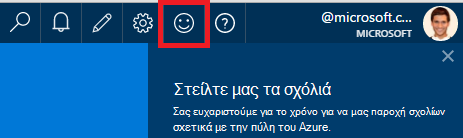
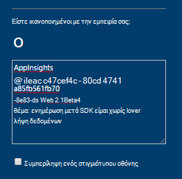
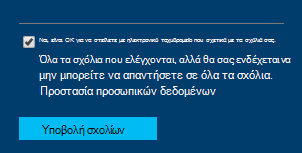

<properties 
    pageTitle="Πώς μπορώ να αποκτήσω τεχνικής υποστήριξης από την ομάδα ανάπτυξης εφαρμογής ιδέες | Microsoft Azure" 
    description="Όταν έχετε μια υπόθεση που απαιτεί ειδική υποστήριξης από την ομάδα ανάπτυξης εφαρμογής ιδέες, αυτό είναι πώς μπορείτε να υποβάλετε τις λεπτομέρειες για να λάβετε υποστήριξη." 
    services="application-insights" 
    documentationCenter=""
    authors="alexbulankou" 
    manager="douge"/>
 
<tags 
    ms.service="application-insights" 
    ms.workload="tbd" 
    ms.tgt_pltfrm="ibiza" 
    ms.devlang="na" 
    ms.topic="article" 
    ms.date="06/01/2016" 
    ms.author="albulank"/>
    
# <a name="how-to-get-technical-support-from-application-insights-development-team"></a>Πώς μπορώ να αποκτήσω τεχνικής υποστήριξης από την ομάδα ανάπτυξης εφαρμογής ιδέες
    
Όταν έχετε μια τεχνική ζήτημα με [Ιδέες εφαρμογή του Visual Studio](app-insights-overview.md), οι επιλογές σας για τη λήψη Βοήθειας:

## <a name="1-check-the-documents"></a>1. ελέγχου των εγγράφων

* Δεδομένα που λείπουν; Έλεγχος: [δειγματοληψία](app-insights-sampling.md), [τα όρια και περιορισμού](app-insights-pricing.md).
* Αντιμετώπιση προβλημάτων: [ASP.NET](app-insights-troubleshoot-faq.md) | [Java](app-insights-java-troubleshoot.md)

## <a name="2-search-the-forums"></a>2. Πραγματοποιήστε αναζήτηση στα φόρουμ

* [Φόρουμ στο MSDN](https://social.msdn.microsoft.com/Forums/vstudio/home?forum=ApplicationInsights)
* [StackOverflow](http://stackoverflow.com/questions/tagged/ms-application-insights)

## <a name="3-azure-support-plan"></a>3. πρόγραμμα azure υποστήριξης;

Υπάρχουν περιπτώσεις όπου θέλετε στους προγραμματιστές να διερευνήσουμε την περίπτωση. 

Εάν έχετε μια [υποστηρίζουν σχέδιο με το Microsoft Azure](https://azure.microsoft.com/support/plans/) μπορείτε να [ανοίξετε ένα δελτίο υποστήριξης](https://portal.azure.com/?#blade/Microsoft_Azure_Support/HelpAndSupportBlade).

## <a name="4-contact-the-application-insights-team"></a>4. Επικοινωνήστε με την ομάδα ιδέες εφαρμογής

Εάν δεν έχετε ένα πρόγραμμα υποστήριξης, μας ομάδα ανάπτυξης είναι ικανοποιημένοι για την προσφορά βέλτιστη προσπάθειες υποστήριξης για εφαρμογή ιδέες τους πελάτες που θα σας προετοιμασία για το ορόσημο γενικής διαθεσιμότητας. Θα σας εισαγωγή **μιας νέας επιλογής υποστήριξης**: μπορείτε να περιγράψετε υπόθεσή σας μας κατά την υποβολή μιας φόρμας σχολίων στην πύλη του Azure και προγραμματιστής στην επαφή ομάδας εφαρμογής ιδέες δημιουργείτε αντίγραφα για να επιλύσετε το πρόβλημα.


1. Στην [πύλη ιδέες εφαρμογής](https://portal.azure.com), κάντε κλικ στην επιλογή το Γελαστό πρόσωπο στην επάνω δεξιά γωνία:  

       

2. Στο πλαίσιο σχόλιο, βεβαιωθείτε ότι για να καθορίσετε **AppInsights** ως η πρώτη γραμμή και, στη συνέχεια, να συμπεριλάβετε τις παρακάτω πληροφορίες:   

    ```

    AppInsights   
    ikey: <instrumentation key>   
    sdk: <SDK that you are using, including name and version>  
    issue: <please describe the problem you are having>

    ```   

       

3. Επιλέξτε "Ναι, είναι ok για να στείλετε με ηλεκτρονικό ταχυδρομείο που". 

      

Μηχανικούς της ομάδας για ιδέες εφαρμογή θα επικοινωνήσει μαζί σας σύντομα. Καθώς παρέχουμε αυτήν την υπηρεσία με βάση τη βέλτιστη προσπάθειας, χωρίς επίσημη SLA μπορεί να δοθεί σε αυτό το σημείο.


