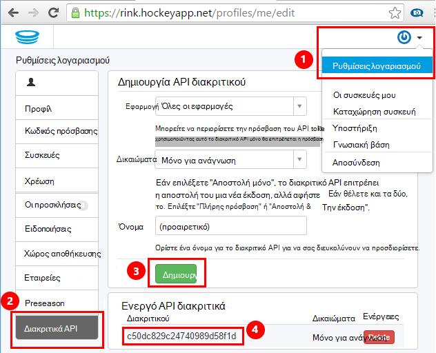
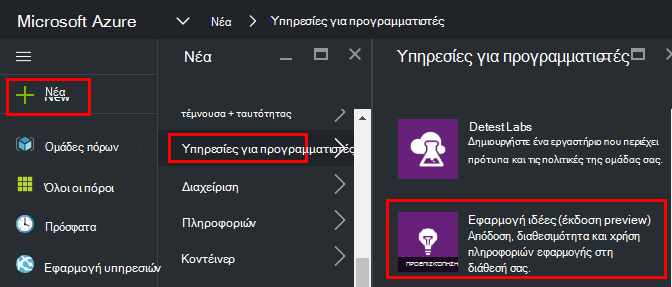
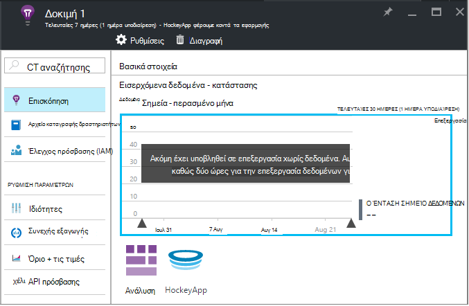
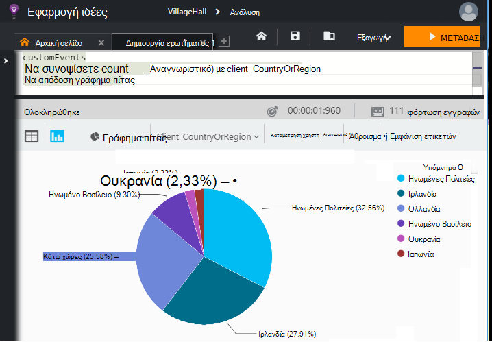

<properties 
    pageTitle="Εξερεύνηση δεδομένων HockeyApp σε εφαρμογή ιδέες | Microsoft Azure" 
    description="Ανάλυση χρήσης και απόδοση της εφαρμογής σας Azure με εφαρμογή ιδέες." 
    services="application-insights" 
    documentationCenter="windows"
    authors="alancameronwills" 
    manager="douge"/>

<tags 
    ms.service="application-insights" 
    ms.workload="tbd" 
    ms.tgt_pltfrm="ibiza" 
    ms.devlang="na" 
    ms.topic="article" 
    ms.date="08/25/2016" 
    ms.author="awills"/>

#  Εξερεύνηση δεδομένων HockeyApp σε ιδέες εφαρμογής

[HockeyApp](https://azure.microsoft.com/services/hockeyapp/) είναι η προτεινόμενη πλατφόρμα για την παρακολούθηση ζωντανή εφαρμογές υπολογιστή και κινητών. Από το HockeyApp, μπορείτε να στείλετε προσαρμοσμένα και ανίχνευση τηλεμετρίας για παρακολούθηση της χρήσης και παροχή Βοήθειας στη διάγνωση (εκτός από τα γρήγορα σφάλμα δεδομένων). Αυτή η ροή της τηλεμετρίας μπορούν να αναζητηθούν χρησιμοποιώντας τη δυνατότητα ισχυρή [ανάλυση](app-insights-analytics.md) του [Visual Studio εφαρμογή ιδέες](app-insights-overview.md). Επιπλέον, μπορείτε να [εξαγάγετε την προσαρμοσμένη και ανίχνευση τηλεμετρίας](app-insights-export-telemetry.md). Για να ενεργοποιήσετε αυτές τις δυνατότητες, μπορείτε να ρυθμίσετε μια γέφυρα που αναμεταδίδει τα δεδομένα HockeyApp στην εφαρμογή ιδέες.

## Η εφαρμογή HockeyApp γέφυρας

Η εφαρμογή γέφυρα HockeyApp είναι η βασική δυνατότητα που σας επιτρέπει να έχετε πρόσβαση στις HockeyApp δεδομένων σε εφαρμογή ιδέες από την ανάλυση και συνεχής εξαγωγή δυνατότητες. Τα δεδομένα που συλλέγονται από HockeyApp μετά τη δημιουργία της εφαρμογής γέφυρα HockeyApp θα είναι προσβάσιμα από αυτές τις δυνατότητες. Ας δούμε πώς μπορείτε να ρυθμίσετε μία από αυτές τις εφαρμογές του Bridge.

Στην HockeyApp, ανοίξτε τις ρυθμίσεις λογαριασμού, [Τα διακριτικά API](https://rink.hockeyapp.net/manage/auth_tokens). Δημιουργείτε έναν νέο κωδικό ή εκ νέου χρήση μιας υπάρχουσας. Τα ελάχιστα δικαιώματα που απαιτούνται είναι "μόνο για ανάγνωση". Λήψη αντιγράφου του API διακριτικού.

Ανοίξτε την πύλη του Microsoft Azure και [Δημιουργήστε έναν πόρο εφαρμογής ιδέες](app-insights-create-new-resource.md). Ορισμός τύπου εφαρμογή "Εφαρμογή γέφυρα HockeyApp":

Δεν χρειάζεται να ορίσετε ένα όνομα - αυτό θα οριστεί αυτόματα από το όνομα της HockeyApp.

Τα πεδία γέφυρα HockeyApp εμφανίζονται. 

Εισαγάγετε το διακριτικό HockeyApp σημειώσατε προηγουμένως. Αυτή η ενέργεια συμπληρώνει το αναπτυσσόμενο μενού "Εφαρμογή HockeyApp" με όλες τις εφαρμογές σας HockeyApp. Επιλέξτε αυτήν που θέλετε να χρησιμοποιήσετε και, ολοκληρώστε το υπόλοιπο των πεδίων. 

Ανοίξτε το νέο πόρο. 

Σημειώστε ότι τα δεδομένα χρειάζονται κάποιος χρόνος για να ξεκινήσετε τη ροή.

Αυτό είναι! Τα δεδομένα που συλλέγονται στην εφαρμογή όργανα HockeyApp από το τρέχον σημείο επίσης είναι πλέον διαθέσιμη σε εσάς σε τις δυνατότητες ανάλυσης και συνεχής εξαγωγή της εφαρμογής ιδέες.

Ας σύντομα αναθεωρήσετε κάθε μία από αυτές τις δυνατότητες που είναι τώρα διαθέσιμα σε εσάς.

## Ανάλυση

Ανάλυση είναι ένα ισχυρό εργαλείο για την υποβολή ερωτημάτων ad-hoc των δεδομένων σας, επιτρέποντάς σας να διάγνωση και ανάλυση σας τηλεμετρίας και Ανακαλύψτε γρήγορα αρχικές αιτίες και μοτίβα.

* [Μάθετε περισσότερα σχετικά με την ανάλυση](app-insights-analytics-tour.md)
* [Εισαγωγή βίντεο](https://channel9.msdn.com/events/Build/2016/T666)
* [Για προχωρημένους έννοιες βίντεο](https://channel9.msdn.com/Events/Build/2016/P591)

## Συνεχής εξαγωγής

Συνεχής εξαγωγή σάς επιτρέπει να εξαγάγετε τα δεδομένα σας σε ένα χώρο αποθήκευσης Blob του Azure κοντέινερ. Αυτό είναι πολύ χρήσιμο εάν θέλετε να διατηρήσετε τα δεδομένα σας για περισσότερο από την περίοδο διατήρησης αυτήν τη στιγμή που παρέχεται από την εφαρμογή ιδέες. Μπορείτε να διατηρήσετε τα δεδομένα στο χώρο αποθήκευσης αντικειμένων blob, να επεξεργαστεί σε μια βάση δεδομένων SQL ή την προτιμώμενη δεδομένα αποταμίευσης λύση.

[Μάθετε περισσότερα σχετικά με τη συνεχή εξαγωγή](app-insights-export-telemetry.md)

## Επόμενα βήματα

* [Εφαρμογή ανάλυση των δεδομένων σας](app-insights-analytics-tour.md)

