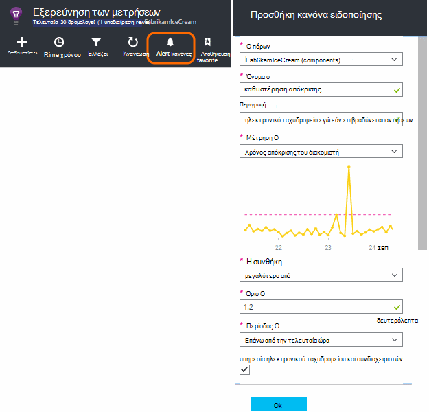
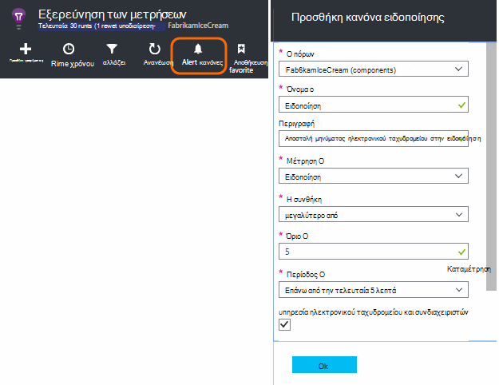
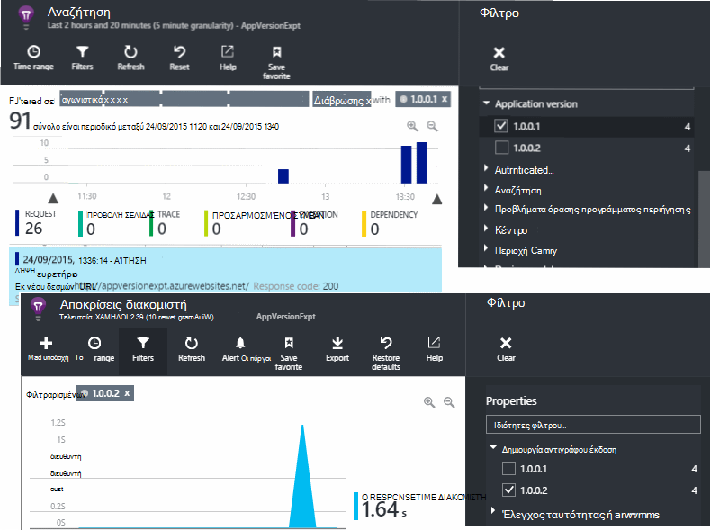
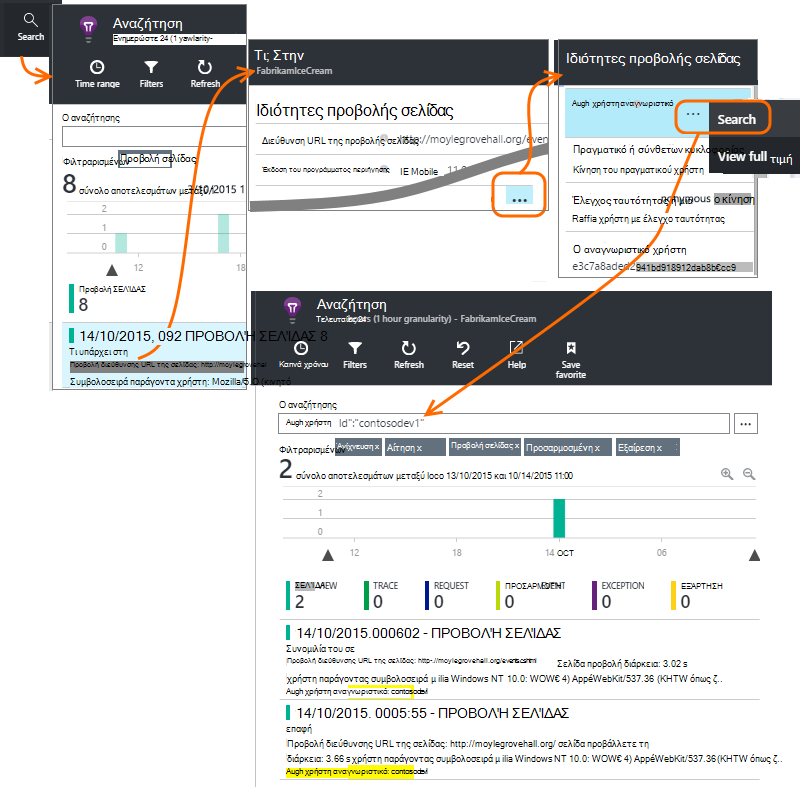
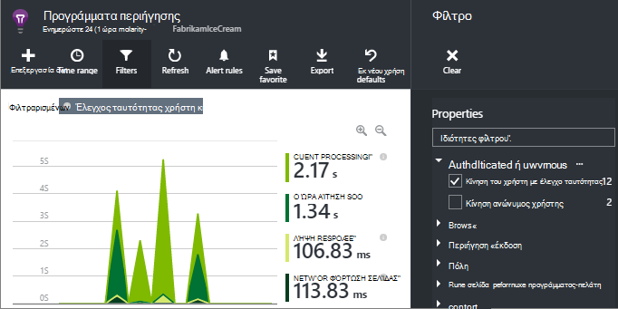
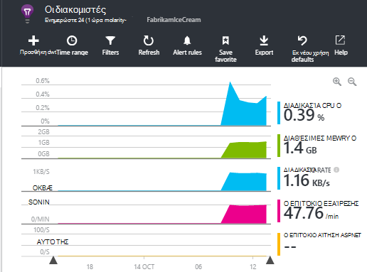

<properties 
    pageTitle="Πώς μπορώ να... στην εφαρμογή ιδέες | Microsoft Azure" 
    description="Συνήθεις Ερωτήσεις σε εφαρμογή ιδέες." 
    services="application-insights" 
    documentationCenter=""
    authors="alancameronwills" 
    manager="douge"/>

<tags 
    ms.service="application-insights" 
    ms.workload="tbd" 
    ms.tgt_pltfrm="ibiza" 
    ms.devlang="na" 
    ms.topic="article" 
    ms.date="02/05/2016" 
    ms.author="awills"/>

# <a name="how-do-i--in-application-insights"></a>Πώς μπορώ να... στο ιδέες εφαρμογή;

## <a name="get-an-email-when-"></a>Λάβετε ένα μήνυμα ηλεκτρονικού ταχυδρομείου όταν...

### <a name="email-if-my-site-goes-down"></a>Μήνυμα ηλεκτρονικού ταχυδρομείου, εάν η τοποθεσία μου δεν λειτουργεί

Ορίστε μια [Δοκιμή διαθεσιμότητα web](app-insights-monitor-web-app-availability.md).

### <a name="email-if-my-site-is-overloaded"></a>Ηλεκτρονικού ταχυδρομείου εάν φορτώνεται η τοποθεσία μου

Ρύθμιση [ειδοποίησης](app-insights-alerts.md) σε **χρόνο απόκρισης του διακομιστή**. Θα πρέπει να εργαστείτε ένα όριο μεταξύ 1 και 2 δευτερόλεπτα.



Εφαρμογή σας ενδέχεται να επίσης ενδείξεις στέλεχος, επιστρέφοντας τους κωδικούς αποτυχίας. Ρύθμιση ειδοποίησης σε **προσκλήσεις απέτυχε**.

Εάν θέλετε να ορίσετε μια ειδοποίηση σε **διακομιστή εξαιρέσεις**, ίσως χρειαστεί να κάνετε [ορισμένες επιπλέον ρύθμιση](app-insights-asp-net-exceptions.md) για να βλέπετε τα δεδομένα.

### <a name="email-on-exceptions"></a>Ηλεκτρονικού ταχυδρομείου σε εξαιρέσεις

1. [Ρύθμιση παρακολούθησης εξαίρεσης](app-insights-asp-net-exceptions.md)
2. [Ρύθμιση ειδοποίησης](app-insights-alerts.md) σε τη μέτρηση count εξαίρεσης


### <a name="email-on-an-event-in-my-app"></a>Ηλεκτρονικού ταχυδρομείου σε ένα συμβάν στην εφαρμογή

Ας υποθέσουμε ότι θέλετε να λάβετε ένα μήνυμα ηλεκτρονικού ταχυδρομείου όταν συμβαίνει κάποιο συγκεκριμένο συμβάν. Εφαρμογή ιδέες δεν παρέχει αυτή τη δυνατότητα απευθείας, αλλά αυτό μπορεί να [στείλετε μια ειδοποίηση όταν ένα μετρικό τέμνει μια οριακή τιμή](app-insights-alerts.md). 

Ειδοποιήσεις μπορεί να οριστεί [προσαρμοσμένη μετρικά](app-insights-api-custom-events-metrics.md#track-metric), μέσω δεν προσαρμοσμένα συμβάντα. Σύνταξη ορισμένες κώδικα για να αυξήσετε ένα μετρικό όταν εμφανίζεται το συμβάν:

    telemetry.TrackMetric("Alarm", 10);

ή:

    var measurements = new Dictionary<string,double>();
    measurements ["Alarm"] = 10;
    telemetry.TrackEvent("status", null, measurements);

Επειδή ειδοποιήσεις έχουν δύο καταστάσεις, πρέπει να στείλετε μια χαμηλή τιμή όταν σκέφτεστε την ειδοποίηση προς έχουν λήξει:

    telemetry.TrackMetric("Alarm", 0.5);

Δημιουργία γραφήματος στο [μετρικό explorer](app-insights-metrics-explorer.md) για να δείτε την ειδοποίηση:


Τώρα ορίστε μια ειδοποίηση όταν το μετρικό μεταβαίνει επάνω από μια τιμή mid για ένα σύντομο περίοδο:




Ορισμός της περιόδου μέσου όρου στο ελάχιστο. 

Θα λάβετε μηνύματα ηλεκτρονικού ταχυδρομείου όταν το μετρικό μεταβαίνει επάνω και κάτω από το όριο.

Ορισμένα σημεία που πρέπει να λάβετε υπόψη:

* Μια ειδοποίηση έχει δύο Πολιτείες ("Ειδοποίηση" και "καλή κατάσταση"). Η κατάσταση αξιολογείται μόνο κατά τη λήψη μιας μονάδας μέτρησης.
* Ένα μήνυμα ηλεκτρονικού ταχυδρομείου θα σταλεί μόνο όταν η κατάσταση αλλάξει. Αυτό είναι τι θα πρέπει να στείλετε και τα δύο υψηλή και μετρήσεις χαμηλή τιμή. 
* Για να αξιολογήσετε την ειδοποίηση, τον μέσο όρο λαμβάνεται από τις τιμές που λάβατε μέσω της προηγούμενης περιόδου. Αυτό συμβαίνει κάθε φορά που λαμβάνεται ένα μετρικό, ώστε να μπορούν να αποσταλούν πιο συχνά από την περίοδο ορίζετε μηνύματα ηλεκτρονικού ταχυδρομείου.
* Εφόσον μηνύματα ηλεκτρονικού ταχυδρομείου στην οποία αποστέλλονται τόσο στην "Ειδοποίηση" και "καλή κατάσταση", μπορείτε να λάβετε υπόψη σας εκ νέου υπόψη σας one-shot συμβάν ως συνθήκη δύο φάσεων. Για παράδειγμα, αντί για ένα συμβάν "η εργασία ολοκληρώθηκε", έχετε μια συνθήκη "εργασία σε εξέλιξη", όπου μπορείτε να λάβετε μηνύματα ηλεκτρονικού ταχυδρομείου στην αρχή και το τέλος μιας εργασίας.

### <a name="set-up-alerts-automatically"></a>Αυτόματη ρύθμιση ειδοποιήσεων

[Χρήση του PowerShell για να δημιουργήσετε νέες ειδοποιήσεις](app-insights-alerts.md#set-alerts-by-using-powershell)

## <a name="use-powershell-to-manage-application-insights"></a>Χρήση του PowerShell για τη Διαχείριση εφαρμογών ιδέες

* [Δημιουργία νέων πόρων](app-insights-powershell-script-create-resource.md)
* [Δημιουργία νέου ειδοποιήσεων](app-insights-alerts.md#set-alerts-by-using-powershell)

## <a name="application-versions-and-stamps"></a>Εφαρμογή εκδόσεις και σφραγίδες

### <a name="separate-the-results-from-dev-test-and-prod"></a>Διαχωρίστε τα αποτελέσματα από την, δοκιμή και ειδών

* Για διαφορετικές environmnents, ρυθμίστε διαφορετικό ikeys
* Για διαφορετικές σφραγίδες (αποκλίσεις, δοκιμή, ανάλωση) Προσθήκη ετικετών σε το τηλεμετρίας με άλλες τιμές ιδιοτήτων

[Μάθε περισσότερα](app-insights-separate-resources.md)
 

### <a name="filter-on-build-number"></a>Φιλτράρετε αριθμό build

Όταν δημοσιεύετε μια νέα έκδοση της εφαρμογής σας, που θα θέλετε να έχετε τη δυνατότητα να διαχωρίσετε το τηλεμετρίας από διαφορετικές εκδόσεις.

Μπορείτε να ορίσετε την ιδιότητα έκδοση της εφαρμογής, ώστε να μπορείτε να φιλτράρετε τα αποτελέσματα [αναζήτησης](app-insights-diagnostic-search.md) και [μετρικό explorer](app-insights-metrics-explorer.md) . 




Υπάρχουν διάφορες μεθόδους ορίζοντας την ιδιότητα έκδοση της εφαρμογής.

* Ορισμός απευθείας:

    `telemetryClient.Context.Component.Version = typeof(MyProject.MyClass).Assembly.GetName().Version;`

* Αναδίπλωση αυτήν τη γραμμή σε ένα [σύνολο αρχικών τιμών τηλεμετρίας](app-insights-api-custom-events-metrics.md#telemetry-initializers) για να βεβαιωθείτε ότι όλες οι εμφανίσεις TelemetryClient έχουν οριστεί με συνέπεια.

* [ASP.NET] Ορισμός της έκδοσης `BuildInfo.config`. Η λειτουργική μονάδα web θα σηκώστε την έκδοση από τον κόμβο BuildLabel. Συμπεριλάβετε αυτό το αρχείο στο έργο σας και να θυμάστε ότι για να ορίσετε την ιδιότητα πάντα αντίγραφο της Εξερεύνηση λύσεων.

    ```XML

    <?xml version="1.0" encoding="utf-8"?>
    <DeploymentEvent xmlns:xsi="http://www.w3.org/2001/XMLSchema-instance" xmlns:xsd="http://www.w3.org/2001/XMLSchema" xmlns="http://schemas.microsoft.com/VisualStudio/DeploymentEvent/2013/06">
      <ProjectName>AppVersionExpt</ProjectName>
      <Build type="MSBuild">
        <MSBuild>
          <BuildLabel kind="label">1.0.0.2</BuildLabel>
        </MSBuild>
      </Build>
    </DeploymentEvent>

    ```
* [ASP.NET] Αυτόματη δημιουργία BuildInfo.config στο MSBuild. Για να κάνετε αυτό, προσθέστε μερικές γραμμές στο αρχείο σας .csproj:

    ```XML

    <PropertyGroup>
      <GenerateBuildInfoConfigFile>true</GenerateBuildInfoConfigFile>    <IncludeServerNameInBuildInfo>true</IncludeServerNameInBuildInfo>
    </PropertyGroup> 
    ```

    Αυτό δημιουργεί ένα αρχείο που ονομάζεται *yourProjectName*. BuildInfo.config. Η διαδικασία δημοσίευσης μετονομάζει το BuildInfo.config.

    Η ετικέτα Δόμηση περιέχει ένα σύμβολο κράτησης θέσης (AutoGen_...) όταν δημιουργείτε με το Visual Studio. Αλλά όταν δημιουργηθεί με MSBuild, συμπληρώνεται με τον αριθμό έκδοσης σωστά.

    Για να επιτρέψετε MSBuild για τη δημιουργία αριθμών έκδοσης, ορίστε την έκδοση όπως `1.0.*` στο AssemblyReference.cs

## <a name="monitor-backend-servers-and-desktop-apps"></a>Παρακολούθηση των διακομιστών παρασκηνίου και εφαρμογές υπολογιστή

[Χρήση της λειτουργικής μονάδας SDK του Windows Server](app-insights-windows-desktop.md).


## <a name="visualize-data"></a>Απεικόνιση δεδομένων

#### <a name="dashboard-with-metrics-from-multiple-apps"></a>Πίνακας εργαλείων με μετρικά από πολλές εφαρμογές

* Στην [Εξερεύνηση των μετρικό](app-insights-metrics-explorer.md), προσαρμογή του γραφήματος και αποθηκεύστε το ως Αγαπημένα. Καρφιτσώσετε το Azure στον πίνακα εργαλείων.


#### <a name="dashboard-with-data-from-other-sources-and-application-insights"></a>Πίνακας εργαλείων με δεδομένα από άλλες προελεύσεις και τις ιδέες εφαρμογής

* [Εξαγωγή τηλεμετρίας στο Power BI](app-insights-export-power-bi.md). 

Ή

* Χρήση του SharePoint ως τον πίνακα εργαλείων, εμφάνιση δεδομένων σε τμήματα web του SharePoint. [Χρήση συνεχής εξαγωγή και τις αναλύσεις ροής για να εξαγάγετε στο SQL](app-insights-code-sample-export-sql-stream-analytics.md).  Χρησιμοποιήστε το PowerView για να εξετάσετε τη βάση δεδομένων και δημιουργήστε ένα τμήμα web του SharePoint για το PowerView.


<a name="search-specific-users"></a>
### <a name="filter-out-anonymous-or-authenticated-users"></a>Φιλτράρισμα ανώνυμα ή έλεγχο ταυτότητας χρηστών

Εάν συνδεθείτε τους χρήστες σας, μπορείτε να ορίσετε το [αναγνωριστικό χρήστη σε έλεγχο ταυτότητας](app-insights-api-custom-events-metrics.md#authenticated-users). (Αυτό δεν συμβαίνει αυτόματα.) 

Στη συνέχεια, μπορείτε:

* Γίνεται αναζήτηση αναγνωριστικών συγκεκριμένο χρήστη



* Φιλτράρισμα μετρικά στους χρήστες ανώνυμη είτε με έλεγχο ταυτότητας



## <a name="modify-property-names-or-values"></a>Τροποποίηση της ιδιότητας ονόματα ή τις τιμές

Δημιουργήστε ένα [φίλτρο](app-insights-api-filtering-sampling.md#filtering). Αυτό σας επιτρέπει να τροποποιήσετε ή να φιλτράρετε τηλεμετρίας πριν έχει σταλεί από την εφαρμογή σε εφαρμογή ιδέες.

## <a name="list-specific-users-and-their-usage"></a>Λίστα συγκεκριμένους χρήστες και τη χρήση τους

Εάν θέλετε απλώς να [αναζήτησης για συγκεκριμένους χρήστες](#search-specific-users), μπορείτε να ορίσετε το [αναγνωριστικό χρήστη σε έλεγχο ταυτότητας](app-insights-api-custom-events-metrics.md#authenticated-users).

Εάν θέλετε μια λίστα με τους χρήστες με δεδομένα όπως ποιες σελίδες κοιτάζει ή πόσο συχνά συνδέονται, έχετε δύο επιλογές:

* [Ορισμός με έλεγχο ταυτότητας του αναγνωριστικού χρήστη](app-insights-api-custom-events-metrics.md#authenticated-users), [Εξαγωγή σε βάση δεδομένων](app-insights-code-sample-export-sql-stream-analytics.md) και χρήση κατάλληλου εργαλεία για την ανάλυση δεδομένων χρήστη εκεί.
* Εάν έχετε μόνο ένα μικρό αριθμό των χρηστών, στείλτε προσαρμοσμένα συμβάντα ή μετρήσεις, χρησιμοποιώντας τα δεδομένα που σας ενδιαφέρουν ως το μετρικό τιμή ή ένα συμβάν όνομα και τη ρύθμιση του αναγνωριστικού χρήστη ως μια ιδιότητα. Για να αναλύσετε προβολές σελίδας, αντικαταστήστε την τυπική κλήση trackPageView JavaScript. Για να αναλύσετε τηλεμετρίας πλευρά του διακομιστή, χρησιμοποιήστε ένα σύνολο αρχικών τιμών τηλεμετρίας για να προσθέσετε το αναγνωριστικό χρήστη όλα τηλεμετρίας διακομιστή. Στη συνέχεια, μπορείτε να φίλτρο και τμήμα μετρικά και αναζητήσεις σε το αναγνωριστικό χρήστη.


## <a name="reduce-traffic-from-my-app-to-application-insights"></a>Μείωση κίνηση από εφαρμογή μου να ιδέες εφαρμογής

* Στο [ApplicationInsights.config](app-insights-configuration-with-applicationinsights-config.md), απενεργοποιήστε οποιαδήποτε λειτουργικές μονάδες που δεν χρειάζεστε, όπως το συλλογής μετρητή επιδόσεων.
* Χρησιμοποιήστε [δειγματοληψία και το φιλτράρισμα](app-insights-api-filtering-sampling.md) στο SDK.
* Στις σελίδες web, περιορίστε τον αριθμό των κλήσεων Ajax αναφέρθηκε για κάθε προβολή σελίδας. Στο το τμήμα κώδικα δέσμης ενεργειών μετά `instrumentationKey:...` , εισαγωγή: `,maxAjaxCallsPerView:3` (ή έναν κατάλληλο αριθμό).
* Αν χρησιμοποιείτε [TrackMetric](app-insights-api-custom-events-metrics.md#track-metric), υπολογίσετε το συγκεντρωτικό αποτέλεσμα ενός δέσμες μετρικό τιμές πριν από την αποστολή το αποτέλεσμα. Υπάρχει μια υπερφόρτωσης του TrackMetric() που παρέχει για αυτό.


Μάθετε περισσότερα σχετικά με [τις τιμές και τα όρια](app-insights-pricing.md).

## <a name="disable-telemetry"></a>Απενεργοποίηση τηλεμετρίας

Για να **διακόψετε δυναμικά και να ξεκινήσετε** τη συλλογή και μετάδοση των τηλεμετρίας από το διακομιστή:

```

    using  Microsoft.ApplicationInsights.Extensibility;

    TelemetryConfiguration.Active.DisableTelemetry = true;
```


Για να **απενεργοποιήσετε την επιλεγμένη τυπική συλλογές** - για παράδειγμα, μετρητές επιδόσεων, αιτήσεις HTTP ή εξαρτήσεις - διαγραφή ή σχόλιο τις σχετικές γραμμές στο [ApplicationInsights.config](app-insights-api-custom-events-metrics.md). Μπορεί να κάνετε αυτό, για παράδειγμα, εάν θέλετε να στείλετε τα δικά σας δεδομένα TrackRequest.


## <a name="view-system-performance-counters"></a>Προβολή μετρητές επιδόσεων συστήματος

Μεταξύ των μετρικών μπορείτε να εμφανίσετε στην Εξερεύνηση μετρικά είναι ένα σύνολο του συστήματος μετρητές επιδόσεων. Υπάρχει ένα προκαθορισμένο blade με τίτλο **τους διακομιστές** που εμφανίζει πολλές από αυτές.



### <a name="if-you-see-no-performance-counter-data"></a>Εάν βλέπετε χωρίς δεδομένα του μετρητή επιδόσεων

* **Διακομιστής των υπηρεσιών IIS** στο δικό σας υπολογιστή ή σε μια Εικονική. [Εγκατάσταση Εποπτεία κατάστασης](app-insights-monitor-performance-live-website-now.md). 
* **Azure τοποθεσίας web** - δεν υποστηρίζουμε μετρητές επιδόσεων ακόμη. Υπάρχουν πολλά μετρικά που μπορείτε να λάβετε ως κανονικό τμήμα του πίνακα ελέγχου Azure τοποθεσίας web.
* **Διακομιστή UNIX** - [εγκατάσταση collectd](app-insights-java-collectd.md)

### <a name="to-display-more-performance-counters"></a>Για να εμφανίσετε περισσότερες μετρητές επιδόσεων

* Πρώτα, [προσθέστε ένα νέο γράφημα](app-insights-metrics-explorer.md) και δείτε αν ο μετρητής βρίσκεται στο το βασικό σύνολο που προσφέρουμε.
* Εάν όχι, [προσθέστε τον μετρητή στο σύνολο που συλλέγονται από τη λειτουργική μονάδα μετρητή επιδόσεων](app-insights-performance-counters.md).


