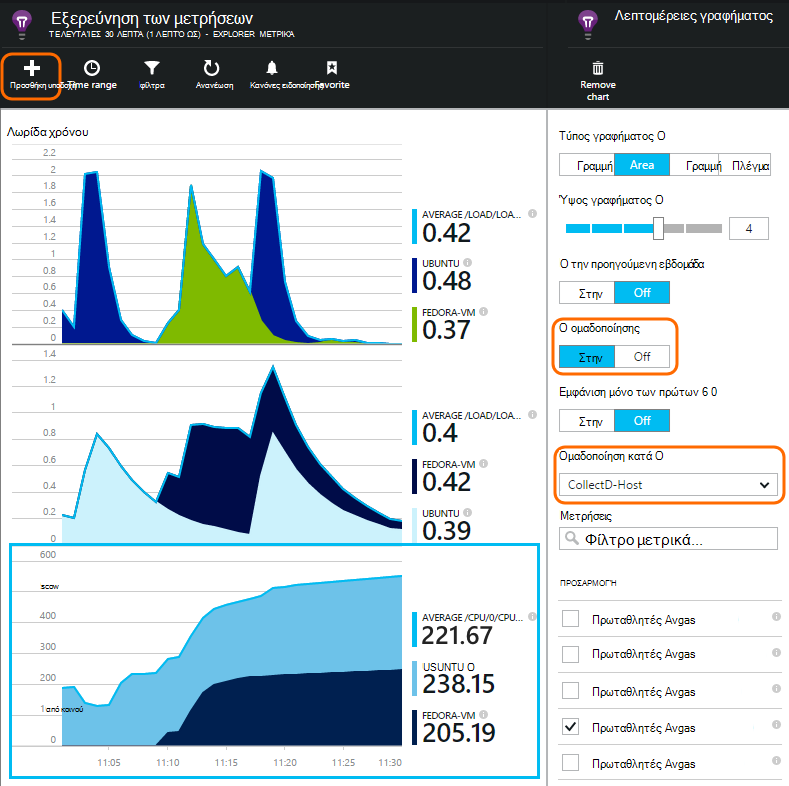

<properties 
    pageTitle="collectd: στατιστικά στοιχεία επιδόσεων για Java σε Unix στο ιδέες εφαρμογής" 
    description="Εκτεταμένη παρακολούθηση της τοποθεσίας Web Java με την προσθήκη CollectD για ιδέες εφαρμογής" 
    services="application-insights" 
    documentationCenter="java"
    authors="alancameronwills" 
    manager="douge"/>

<tags 
    ms.service="application-insights" 
    ms.workload="tbd" 
    ms.tgt_pltfrm="ibiza" 
    ms.devlang="na" 
    ms.topic="article" 
    ms.date="08/24/2016" 
    ms.author="awills"/>
 
# <a name="collectd-unix-performance-metrics-in-application-insights"></a>collectd: μετρικών απόδοσης Unix στο ιδέες εφαρμογής

*Εφαρμογή ιδέες είναι σε προεπισκόπηση.*

Για να εξερευνήσετε μετρικών απόδοσης συστήματος Unix στην [Εφαρμογή ιδέες](app-insights-overview.md), εγκαταστήστε [collectd](http://collectd.org/), μαζί με την προσθήκη εφαρμογής ιδέες. Αυτή η λύση ανοιχτού κώδικα συγκεντρώνει διάφορα στατιστικά στοιχεία συστήματος και του δικτύου.

Τυπικά, θα χρησιμοποιήσετε collectd εάν έχετε ήδη [όργανα, την υπηρεσία web Java με εφαρμογή ιδέες][java]. Σας προσφέρει περισσότερων δεδομένων για να σας βοηθήσει να βελτιώσετε τις επιδόσεις της εφαρμογής σας ή στη διάγνωση προβλημάτων. 


## <a name="get-your-instrumentation-key"></a>Λάβετε τον αριθμό-κλειδί οργάνων

Στην [πύλη του Microsoft Azure](https://portal.azure.com), ανοίξτε τον πόρο [Ιδέες εφαρμογής](app-insights-overview.md) όπου θέλετε να εμφανιστεί η δεδομένων. (Ή [Δημιουργήστε ένα νέο πόρο](app-insights-create-new-resource.md).)

Λαμβάνουν ένα αντίγραφο του το κλειδί οργάνων, το οποίο προσδιορίζει τον πόρο.


## <a name="install-collectd-and-the-plug-in"></a>Εγκατάσταση collectd και την προσθήκη

Σε υπολογιστές του διακομιστή σας Unix:

1. Εγκατάσταση [collectd](http://collectd.org/) έκδοση 5.4.0 ή νεότερη έκδοση.
2. Κάντε λήψη της [προσθήκης writer collectd εφαρμογή ιδέες](https://aka.ms/aijavasdk). Σημειώστε τον αριθμό έκδοσης.
3. Αντιγραφή της προσθήκης ΒΆΖΩΝ σε `/usr/share/collectd/java`.
3. Επεξεργασία `/etc/collectd/collectd.conf`:
 * Βεβαιωθείτε ότι είναι ενεργοποιημένη η αυτήν [την προσθήκη Java](https://collectd.org/wiki/index.php/Plugin:Java) .
 * Ενημερώστε το JVMArg για το java.class.path για να συμπεριλάβετε το παρακάτω ΒΆΖΟ. Ενημερώστε τον αριθμό έκδοσης, ώστε να ταιριάζει με αυτό που λάβατε:
  * `/usr/share/collectd/java/applicationinsights-collectd-1.0.5.jar`
 * Προσθέστε αυτό τμημάτων κώδικα, χρησιμοποιώντας το πλήκτρο οργάνων από τον πόρο:

```

     LoadPlugin "com.microsoft.applicationinsights.collectd.ApplicationInsightsWriter"
     <Plugin ApplicationInsightsWriter>
        InstrumentationKey "Your key"
     </Plugin>
```

Εδώ είναι τμήμα ενός δείγματος αρχείου ρύθμισης παραμέτρων:

    ...
    # collectd plugins
    LoadPlugin cpu
    LoadPlugin disk
    LoadPlugin load
    ...

    # Enable Java Plugin
    LoadPlugin "java"

    # Configure Java Plugin
    <Plugin "java">
      JVMArg "-verbose:jni"
      JVMArg "-Djava.class.path=/usr/share/collectd/java/applicationinsights-collectd-1.0.5.jar:/usr/share/collectd/java/collectd-api.jar"

      # Enabling Application Insights plugin
      LoadPlugin "com.microsoft.applicationinsights.collectd.ApplicationInsightsWriter"
                
      # Configuring Application Insights plugin
      <Plugin ApplicationInsightsWriter>
        InstrumentationKey "12345678-1234-1234-1234-123456781234"
      </Plugin>

      # Other plugin configurations ...
      ...
    </Plugin>
.   ...

Ρύθμιση παραμέτρων άλλων [collectd προσθήκες](https://collectd.org/wiki/index.php/Table_of_Plugins), που μπορεί να συλλέγει διάφορους δεδομένων από διαφορετικές προελεύσεις.

Επανεκκινήστε collectd σύμφωνα με τη [μη αυτόματη](https://collectd.org/wiki/index.php/First_steps).

## <a name="view-the-data-in-application-insights"></a>Προβολή των δεδομένων σε εφαρμογή ιδέες

Στο τον πόρο εφαρμογής ιδέες, ανοίξτε [μετρικά Explorer και να προσθέσετε γραφήματα][metrics], επιλέγοντας τα μετρικά που θέλετε να δείτε από την προσαρμοσμένη κατηγορία.



Από προεπιλογή, τα μετρικά έχουν συναθροιστεί σε όλους τους υπολογιστές κεντρικού υπολογιστή από τον οποίο συλλέχθηκαν τα μετρικά. Για να προβάλετε τα μετρικά ανά κεντρικό υπολογιστή, το γράφημα blade λεπτομέρειες, ενεργοποιήστε την επιλογή ομαδοποίησης και, στη συνέχεια, επιλέξτε ομαδοποίηση κατά CollectD-κεντρικό υπολογιστή.


## <a name="to-exclude-upload-of-specific-statistics"></a>Για να αποκλείσετε αποστολής συγκεκριμένων στατιστικών στοιχείων

Από προεπιλογή, η προσθήκη εφαρμογής ιδέες στέλνει όλα τα δεδομένα που συλλέγονται από όλα τα collectd enabled "ανάγνωση" προσθήκες. 

Για να εξαιρέσετε δεδομένα από συγκεκριμένες προσθήκες ή προελεύσεις δεδομένων:

* Επεξεργαστείτε το αρχείο ρύθμισης παραμέτρων. 
* Στο `<Plugin ApplicationInsightsWriter>`, προσθέστε οδηγία γραμμές ως εξής:

Οδηγία | Εφέ
---|---
`Exclude disk` | Εξαίρεση όλα τα δεδομένα που συλλέγονται από το `disk` προσθήκης
`Exclude disk:read,write` | Εξαίρεση των προελεύσεων με το όνομα `read` και `write` από το `disk` προσθήκης.

Επιμέρους οδηγίες με μια νέα γραμμή.


## <a name="problems"></a>Αντιμετωπίζετε προβλήματα;

*Δεν βλέπω δεδομένων στην πύλη*

* Άνοιγμα [αναζήτησης] [ diagnostic] για να δείτε εάν έχουν φτάσει τα ανεπεξέργαστα συμβάντα. Μερικές φορές χρειαστεί περισσότερος χρόνος για να εμφανίζονται στην Εξερεύνηση των μετρήσεων.
* Ίσως χρειαστεί να [ορίσετε εξαιρέσεις του τείχους προστασίας για τα εξερχόμενα δεδομένα](app-insights-ip-addresses.md)
* Να ενεργοποιήσετε την ανίχνευση στην προσθήκη εφαρμογής ιδέες. Προσθέστε την ακόλουθη γραμμή μέσα σε `<Plugin ApplicationInsightsWriter>`:
 *  `SDKLogger true`
* Ανοίξτε μια terminal και έναρξη collectd σε κατάσταση με λεπτομέρειες, για να δείτε προβλήματα αναφέρει:
 * `sudo collectd -f`


<!--Link references-->

[api]: app-insights-api-custom-events-metrics.md
[apiexceptions]: app-insights-api-custom-events-metrics.md#track-exception
[availability]: app-insights-monitor-web-app-availability.md
[diagnostic]: app-insights-diagnostic-search.md
[eclipse]: app-insights-java-eclipse.md
[java]: app-insights-java-get-started.md
[javalogs]: app-insights-java-trace-logs.md
[metrics]: app-insights-metrics-explorer.md
[usage]: app-insights-web-track-usage.md

 
