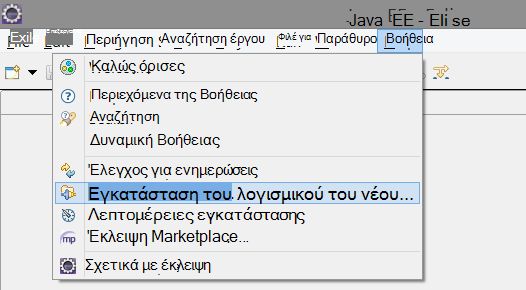
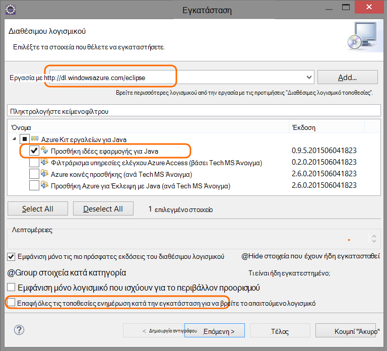
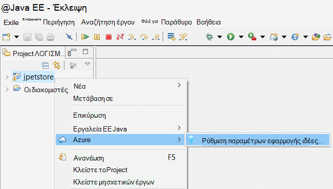
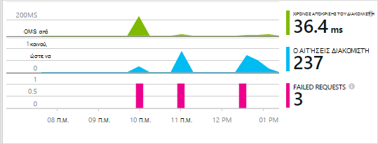
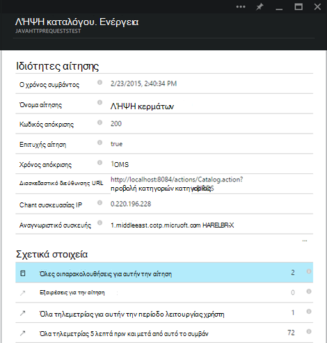
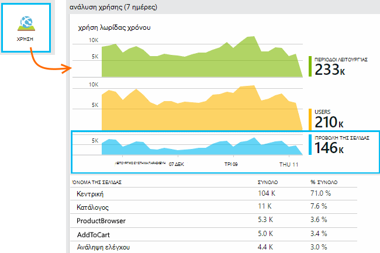
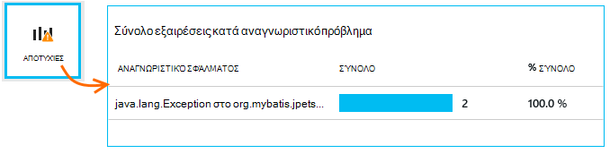
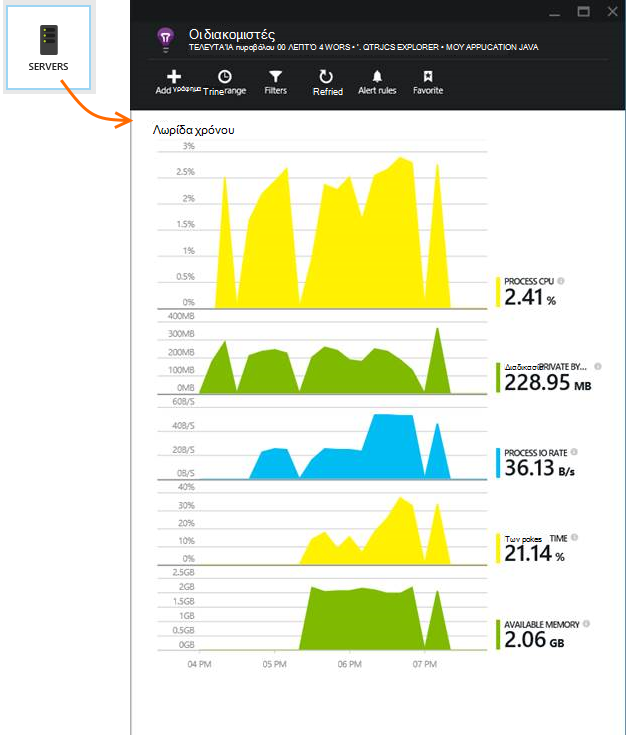
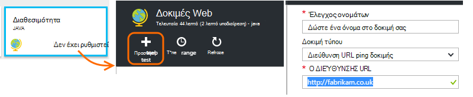
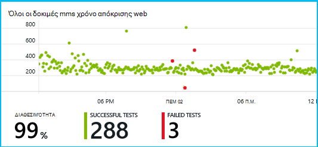

<properties 
    pageTitle="Γρήγορα αποτελέσματα με την εφαρμογή ιδέες με Java στο Έκλειψη" 
    description="Χρησιμοποιήστε το προσθήκης Έκλειψη για να προσθέσετε επιδόσεις και χρήση παρακολούθησης στην τοποθεσία Web σας Java με ιδέες εφαρμογής" 
    services="application-insights" 
    documentationCenter="java"
    authors="alancameronwills" 
    manager="douge"/>

<tags 
    ms.service="application-insights" 
    ms.workload="tbd" 
    ms.tgt_pltfrm="ibiza" 
    ms.devlang="na" 
    ms.topic="article" 
    ms.date="03/02/2016" 
    ms.author="awills"/>
 
# Γρήγορα αποτελέσματα με την εφαρμογή ιδέες με Java στο Έκλειψη

SDK ιδέες για την εφαρμογή στέλνει τηλεμετρίας από την εφαρμογή web Java σας ώστε να μπορείτε να αναλύσετε χρήση και τις επιδόσεις. Η προσθήκη για εφαρμογή ιδέες Έκλειψη εγκαθιστά αυτόματα το SDK στο έργο σας, έτσι ώστε να μπορείτε να κλείσετε το πλαίσιο τηλεμετρίας, καθώς και το API που μπορείτε να χρησιμοποιήσετε για να γράψετε προσαρμοσμένο τηλεμετρίας.   

## Προαπαιτούμενα στοιχεία

Αυτήν τη στιγμή η προσθήκη λειτουργεί για Maven έργα και δυναμική Web έργα στο Έκλειψη. ([Προσθήκη εφαρμογής ιδέες με άλλους τύπους έργου Java][java].)

Θα πρέπει:

* Oracle JRE 1,6 ή νεότερη έκδοση
* Μια συνδρομή στο [Microsoft Azure](https://azure.microsoft.com/). (Θα μπορούσε να ξεκινά με τη [δωρεάν δοκιμαστική έκδοση](https://azure.microsoft.com/pricing/free-trial/)).
* [Έκλειψη IDE για τους προγραμματιστές ΕΕ Java](http://www.eclipse.org/downloads/), Indigo ή νεότερη έκδοση.
* Windows 7 ή νεότερη έκδοση ή Windows Server 2008 ή νεότερη έκδοση

## Εγκατάσταση του SDK σε Έκλειψη (μία φορά)

Έχετε μόνο για να το κάνετε αυτό μία φορά ανά υπολογιστή. Αυτό το βήμα εγκαθιστά ένα κιτ εργαλείων, η οποία, στη συνέχεια, να προσθέσετε το SDK σε κάθε δυναμικής Project Web.

1. Στο Έκλειψη, κάντε κλικ στην επιλογή Βοήθεια, εγκατάσταση νέου λογισμικού.

    

2. Το SDK είναι σε http://dl.windowsazure.com/eclipse, στην περιοχή Azure Κιτ εργαλείων. 
3. Καταργήστε την επιλογή **Επικοινωνήστε με όλες τις τοποθεσίες ενημέρωση...**

    

Ακολουθήστε τα υπόλοιπα βήματα για κάθε έργο Java.

## Δημιουργία ενός πόρου ιδέες εφαρμογή στο Azure

1. Είσοδος στην [πύλη του Azure](https://portal.azure.com).
2. Δημιουργήστε ένα νέο πόρο εφαρμογής ιδέες.  

      
3. Ορίστε τον τύπο εφαρμογής σε εφαρμογή web Java.  

      
4. Βρείτε το κλειδί οργάνων του νέου πόρου. Θα χρειαστεί να επικολλήσετε αυτό το έργο κώδικα λίγο.  

      

## Προσθήκη εφαρμογής ιδέες στο έργο σας

1. Προσθήκη ιδέες εφαρμογής από το μενού περιβάλλοντος του έργου σας web Java.

    

2. Επικολλήστε τον αριθμό-κλειδί οργάνων που λάβατε από την πύλη του Azure.

    

Το κλειδί αποστέλλεται μαζί με κάθε στοιχείο της τηλεμετρίας και σας ενημερώνει για ιδέες εφαρμογής για να το εμφανίσετε σε τον πόρο.

## Εκτελέστε την εφαρμογή και να δείτε μετρικά

Εκτελέστε την εφαρμογή σας.

Επιστροφή στο τον πόρο ιδέες εφαρμογή στο Microsoft Azure.

HTTP αιτήσεις δεδομένων θα εμφανίζεται η επισκόπηση blade. (Εάν δεν είναι εκεί, περιμένετε μερικά δευτερόλεπτα και, στη συνέχεια, κάντε κλικ στην επιλογή Ανανέωση.)

 

Κάντε κλικ σε οποιοδήποτε γράφημα για να δείτε πιο λεπτομερείς μετρήσεις. 

[Μάθετε περισσότερα σχετικά με τις μετρήσεις.][metrics]

 

Και κατά την προβολή των ιδιοτήτων μιας αίτησης, μπορείτε να δείτε τα συμβάντα τηλεμετρίας που σχετίζεται με το όπως αιτήσεις και εξαιρέσεις.
 

## Τηλεμετρίας πλευρά του προγράμματος-πελάτη

Από τη γρήγορη έναρξη blade, κάντε κλικ στην επιλογή λήψη κώδικα για την παρακολούθηση της ιστοσελίδες μου: 

Εισαγάγετε το τμήμα κώδικα στην κεφαλίδα του τα αρχεία HTML.

#### Προβολή δεδομένων στην πλευρά του προγράμματος-πελάτη

Ανοίξτε το ενημερωμένο ιστοσελίδες σας και να τις χρησιμοποιήσετε. Περιμένετε λίγο ή δύο, στη συνέχεια, επιστρέψετε στην εφαρμογή ιδέες και ανοίξτε το blade χρήση. (Από την επισκόπηση blade, κάντε κύλιση προς τα κάτω και κάντε κλικ στην επιλογή χρήση).

Σελίδα προβολής, χρήστη και την περίοδο λειτουργίας μετρικά θα εμφανιστούν στον blade τη χρήση:

[Μάθετε περισσότερα σχετικά με τη ρύθμιση τηλεμετρίας πλευρά του προγράμματος-πελάτη.][usage]

## Δημοσίευση εφαρμογής σας

Τώρα μπορείτε να δημοσιεύσετε την εφαρμογή σας στο διακομιστή, χρησιμοποιήστε ενημερώστε τα άτομα και παρακολουθήστε τα τηλεμετρίας που εμφανίζονται στην πύλη του.

* Βεβαιωθείτε ότι το τείχος προστασίας σας επιτρέπει την εφαρμογή σας για να στείλετε τηλεμετρίας σε αυτές τις θύρες:

 * DC.Services.visualstudio.com:443
 * DC.Services.visualstudio.com:80
 * F5.Services.visualstudio.com:443
 * F5.Services.visualstudio.com:80

* Σε διακομιστές των Windows, εγκαταστήστε:

 * [Microsoft Visual C++ με δυνατότητα ανακατανομής](http://www.microsoft.com/download/details.aspx?id=40784)

    (Αυτή η δυνατότητα επιτρέπει μετρητές επιδόσεων.)

## Εξαιρέσεις και αποτυχίες αίτηση

Συλλέγει αυτόματα ανεπίλυτη εξαιρέσεις:

Για τη συλλογή δεδομένων σε άλλες εξαιρέσεις, έχετε δύο επιλογές:

* [Εισαγωγή κλήσεων στο TrackException στον κώδικά σας](app-insights-api-custom-events-metrics.md#track-exception). 
* [Εγκαταστήστε τον παράγοντα Java στο διακομιστή σας](app-insights-java-agent.md). Μπορείτε να καθορίσετε τις μεθόδους που θέλετε να παρακολουθήσετε.

## Παρακολούθηση της μεθόδου κλήσεις και εξωτερικές εξαρτήσεις

[Εγκαταστήστε τον παράγοντα Java](app-insights-java-agent.md) για να συνδεθείτε καθοριστεί εσωτερικό μεθόδους και κλήσεις που έγιναν μέσω JDBC, με δεδομένα του χρονισμού.

## Μετρητές επιδόσεων

Στην σας blade επισκόπηση, κάντε κύλιση προς τα κάτω και κάντε κλικ στο πλακίδιο **διακομιστές** . Θα δείτε μια περιοχή μετρητές επιδόσεων.

### Προσαρμογή συλλογή του μετρητή επιδόσεων

Για να απενεργοποιήσετε συλλογή από το βασικό σύνολο μετρητών επιδόσεων, προσθέστε τον ακόλουθο κώδικα κάτω από τον ριζικό κόμβο του αρχείου ApplicationInsights.xml:

    <PerformanceCounters>
       <UseBuiltIn>False</UseBuiltIn>
    </PerformanceCounters>

### Συλλογή μετρητών επιπλέον επιδόσεων

Μπορείτε να καθορίσετε επιπλέον επιδόσεων μετρητές που συλλέγονται.

#### Μετρητές JMX (που εκτίθεται από την εικονική μηχανή Java)

    <PerformanceCounters>
      <Jmx>
        <Add objectName="java.lang:type=ClassLoading" attribute="TotalLoadedClassCount" displayName="Loaded Class Count"/>
        <Add objectName="java.lang:type=Memory" attribute="HeapMemoryUsage.used" displayName="Heap Memory Usage-used" type="composite"/>
      </Jmx>
    </PerformanceCounters>

*   `displayName`– Το όνομα που εμφανίζεται στην πύλη εφαρμογής ιδέες.
*   `objectName`-Στο όνομα του αντικειμένου JMX.
*   `attribute`– Το χαρακτηριστικό του ονόματος του αντικειμένου JMX για τη λήψη
*   `type`(προαιρετικό) - τον τύπο του αντικειμένου JMX χαρακτηριστικό:
 *  Προεπιλογή: έναν απλό τύπο όπως int ή μεγάλη.
 *  `composite`: τα δεδομένα του μετρητή επιδόσεων είναι στο πλαίσιο μορφή 'Attribute.Data'
 *  `tabular`: τα δεδομένα του μετρητή επιδόσεων είναι στη μορφή γραμμής πίνακα

#### Μετρητών επιδόσεων των Windows

Κάθε [μετρητή επιδόσεων Windows](https://msdn.microsoft.com/library/windows/desktop/aa373083.aspx) είναι μέλος της κατηγορίας (με τον ίδιο τρόπο ότι ένα πεδίο είναι μέλος μιας κλάσης). Κατηγορίες μπορεί να είναι καθολικός, ή να έχετε αρίθμηση ή την καθορισμένη παρουσίες.

    <PerformanceCounters>
      <Windows>
        <Add displayName="Process User Time" categoryName="Process" counterName="%User Time" instanceName="__SELF__" />
        <Add displayName="Bytes Printed per Second" categoryName="Print Queue" counterName="Bytes Printed/sec" instanceName="Fax" />
      </Windows>
    </PerformanceCounters>

*   Εμφανιζόμενο όνομα – το όνομα που εμφανίζεται στην πύλη εφαρμογής ιδέες.
*   ΌνομαΚατηγορίας – της κατηγορίας μετρητή επιδόσεων (αντικείμενο επιδόσεων) με την οποία συσχετίζεται αυτό μετρητή επιδόσεων.
*   το Όνομα_μετρητή-στο όνομα του μετρητή επιδόσεων.
*   όνομα_παρουσίας – το όνομα του παρουσία κατηγορία μετρητή επιδόσεων, ή μια κενή συμβολοσειρά (""), εάν η κατηγορία περιέχει μία παρουσία. Εάν το όνομα κατηγορίας διαδικασία και το μετρητή επιδόσεων που θέλετε να συλλέξετε από την τρέχουσα διαδικασία JVM στην οποία εκτελείται η εφαρμογή σας, να καθορίσετε `"__SELF__"`.

Μετρητές επιδόσεων σας εμφανίζονται ως προσαρμοσμένο μετρικά στην [Εξερεύνηση μετρικά][metrics].

### Μετρητές επιδόσεων UNIX

* [Εγκατάσταση collectd με την προσθήκη εφαρμογής ιδέες](app-insights-java-collectd.md) για να λάβετε μια μεγάλη ποικιλία δεδομένων συστήματος και του δικτύου.

## Διαθεσιμότητα web δοκιμές

Εφαρμογή ιδέες να ελέγξετε την τοποθεσία Web σε τακτά χρονικά διαστήματα για να βεβαιωθείτε ότι είναι προς τα επάνω και να αποκρίνεται επίσης και. [Για να ρυθμίσετε][availability], μεταβείτε με κύλιση προς τα κάτω για να επιλέξτε διαθεσιμότητας.

Θα λάβετε γραφήματα χρόνους απόκρισης, καθώς και ειδοποιήσεις ηλεκτρονικού ταχυδρομείου εάν την τοποθεσία σας μεταβαίνει προς τα κάτω.

[Μάθετε περισσότερα σχετικά με τη διαθεσιμότητα web δοκιμές.][availability] 

## Αρχεία καταγραφής διαγνωστικών

Εάν χρησιμοποιείτε το Logback ή Log4J (v1.2 ή v2.0) για την ανίχνευση, μπορείτε να έχετε τα αρχεία καταγραφής ανίχνευσης αποστέλλονται αυτόματα σε εφαρμογή ιδέες, όπου μπορείτε να εξερευνήσετε και να αναζήτηση σε αυτά.

[Μάθετε περισσότερα σχετικά με τα αρχεία καταγραφής διαγνωστικών][javalogs]

## Προσαρμοσμένη τηλεμετρίας 

Εισαγωγή μερικές γραμμές κώδικα στην εφαρμογή web Java για να μάθετε τι κάνουν οι χρήστες με αυτήν ή για να βοηθά στη διάγνωση προβλημάτων. 

Μπορείτε να εισαγάγετε κωδικό τόσο στην ιστοσελίδα JavaScript και σε Java την πλευρά του διακομιστή.

[Μάθετε περισσότερα σχετικά με προσαρμοσμένο τηλεμετρίας][track]

## Επόμενα βήματα

#### Εντοπισμός και διάγνωση θεμάτων

* [Προσθήκη τηλεμετρίας προγράμματος-πελάτη web] [ usage] για τη λήψη τηλεμετρίας απόδοσης από το πρόγραμμα-πελάτη web.
* [Ρύθμιση του web δοκιμές] [ availability] για να βεβαιωθείτε ότι η εφαρμογή σας παραμένει ζωντανή και αποκρίνεται.
* [Αναζήτηση συμβάντων και τα αρχεία καταγραφής] [ diagnostic] για να βοηθά στη διάγνωση προβλημάτων.
* [Καταγραφή Log4J ή Logback ανιχνεύσεις][javalogs]

#### Παρακολούθηση χρήσης

* [Προσθήκη τηλεμετρίας προγράμματος-πελάτη web] [ usage] σε οθόνη σελίδα προβολές και μετρήσεις βασικού χρήστη.
* [Παρακολούθηση προσαρμοσμένων συμβάντων και μετρήσεις] [ track] για να μάθετε περισσότερα σχετικά με τον τρόπο χρήσης την εφαρμογή σας, τόσο στο πρόγραμμα-πελάτη και του διακομιστή.

<!--Link references-->

[availability]: app-insights-monitor-web-app-availability.md
[diagnostic]: app-insights-diagnostic-search.md
[java]: app-insights-java-get-started.md
[javalogs]: app-insights-java-trace-logs.md
[metrics]: app-insights-metrics-explorer.md
[track]: app-insights-api-custom-events-metrics.md
[usage]: app-insights-web-track-usage.md

 