<properties
    pageTitle="Ανάλυση εφαρμογής web Java με εφαρμογή ιδέες | Microsoft Azure"
    description="Παρακολούθηση απόδοσης και η χρήση της τοποθεσίας Web Java με εφαρμογή ιδέες. "
    services="application-insights"
    documentationCenter="java"
    authors="alancameronwills"
    manager="douge"/>

<tags
    ms.service="application-insights"
    ms.workload="tbd"
    ms.tgt_pltfrm="ibiza"
    ms.devlang="na"
    ms.topic="get-started-article"
    ms.date="08/17/2016"
    ms.author="awills"/>

# Γρήγορα αποτελέσματα με την εφαρμογή ιδέες σε ένα έργο web Java

*Εφαρμογή ιδέες είναι σε προεπισκόπηση.*

[AZURE.INCLUDE [app-insights-selector-get-started](../../includes/app-insights-selector-get-started.md)]

[Εφαρμογή ιδέες](https://azure.microsoft.com/services/application-insights/) είναι μια υπηρεσία επεκτάσιμη ανάλυσης που σας βοηθά να κατανοήσετε τις επιδόσεις και η χρήση της εφαρμογής σας live. Χρησιμοποιήστε το για να [εντοπίσει και διάγνωση προβλημάτων επιδόσεων και εξαιρέσεις](app-insights-detect-triage-diagnose.md)και [σύνταξη κώδικα] [ api] για να παρακολουθείτε τι να κάνετε τους χρήστες με την εφαρμογή σας.

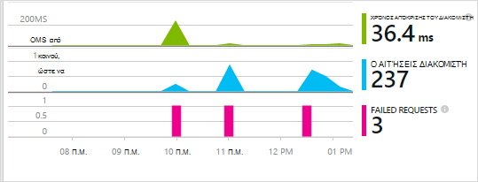

Εφαρμογή ιδέες υποστηρίζει εφαρμογές Java εκτελείται σε Linux, Unix ή Windows.

Χρειάζεσαι:

* Oracle JRE 1,6 ή νεότερη έκδοση ή Ζουλού JRE 1,6 ή νεότερη έκδοση
* Μια συνδρομή στο [Microsoft Azure](https://azure.microsoft.com/). (Θα μπορούσε να ξεκινά με τη [δωρεάν δοκιμαστική έκδοση](https://azure.microsoft.com/pricing/free-trial/)).

*Εάν έχετε μια εφαρμογή web που υπάρχει ήδη ζωντανή, θα μπορούσατε να ακολουθήσετε την εναλλακτική διαδικασία για να [προσθέσετε το SDK κατά το χρόνο εκτέλεσης στο διακομιστή web](app-insights-java-live.md). Αυτή η εναλλακτική λύση αποφεύγεται η ανακατασκευή του κώδικα, αλλά δεν μπορείτε να λάβετε την επιλογή για να γράψετε κώδικα για την παρακολούθηση της δραστηριότητας χρήστη.*

## 1. γρήγορα ένα πλήκτρο εφαρμογής ιδέες οργάνων

1. Είσοδος στην [πύλη του Microsoft Azure](https://portal.azure.com).
2. Δημιουργήστε έναν πόρο εφαρμογής ιδέες. Ορίστε τον τύπο εφαρμογής σε εφαρμογή web Java.

    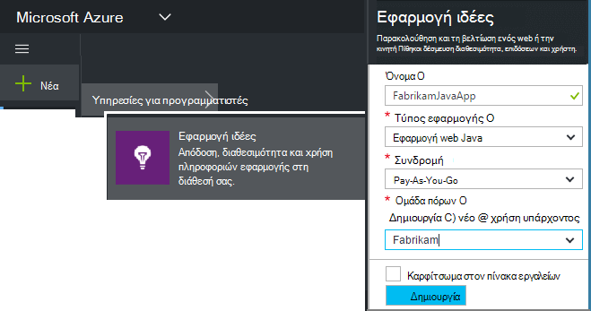
4. Βρείτε το κλειδί οργάνων του νέου πόρου. Θα χρειαστεί για να επικολλήσετε λίγο αυτό το κλειδί στο έργο σας κώδικα.

    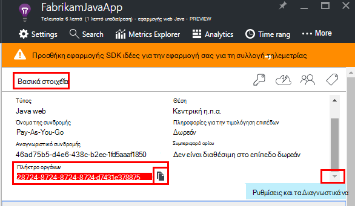

## 2. προσθέστε την εφαρμογή SDK ιδέες για Java στο έργο σας

*Επιλέξτε τον κατάλληλο τρόπο για το έργο σας.*

#### Εάν χρησιμοποιείτε το Έκλειψη για να δημιουργήσετε ένα έργο Maven ή δυναμικού περιεχομένου Web...

Χρησιμοποιήστε την [Εφαρμογή SDK ιδέες για προσθήκη Java][eclipse].

#### Εάν χρησιμοποιείτε το Maven...

Εάν το έργο σας έχει ήδη ρυθμιστεί για να χρησιμοποιήσετε Maven για δημιουργία, συγχώνευση τον παρακάτω κώδικα στο αρχείο σας pom.xml.

Στη συνέχεια, ανανεώστε τις εξαρτήσεις έργου για να λάβετε τα δυαδικά αρχεία που έχουν ληφθεί.

    <repositories>
       <repository>
          <id>central</id>
          <name>Central</name>
          <url>http://repo1.maven.org/maven2</url>
       </repository>
    </repositories>

    <dependencies>
      <dependency>
        <groupId>com.microsoft.azure</groupId>
        <artifactId>applicationinsights-web</artifactId>
        <!-- or applicationinsights-core for bare API -->
        <version>[1.0,)</version>
      </dependency>
    </dependencies>

* *Δημιουργία ή άθροισμα ελέγχου σφαλμάτων επικύρωσης;* Δοκιμάστε να χρησιμοποιήσετε μια συγκεκριμένη έκδοση, όπως είναι οι: `<version>1.0.n</version>`. Θα βρείτε την πιο πρόσφατη έκδοση του [SDK σημειώσεις έκδοσης](https://github.com/Microsoft/ApplicationInsights-Java#release-notes) ή μας [Maven αντικείμενα](http://search.maven.org/#search%7Cga%7C1%7Capplicationinsights).
* *Πρέπει να ενημερώσετε για ένα νέο SDK;* Ανανέωση εξαρτήσεις του έργου σας.

#### Εάν χρησιμοποιείτε το Gradle...

Εάν το έργο σας έχει ήδη ρυθμιστεί για να χρησιμοποιήσετε Gradle για δημιουργία, συγχώνευση τον παρακάτω κώδικα στο αρχείο σας build.gradle.

Στη συνέχεια, ανανεώστε τις εξαρτήσεις έργου για να λάβετε τα δυαδικά αρχεία που έχουν ληφθεί.

    repositories {
      mavenCentral()
    }

    dependencies {
      compile group: 'com.microsoft.azure', name: 'applicationinsights-web', version: '1.+'
      // or applicationinsights-core for bare API
    }

* Σφάλματα *επικύρωσης Δόμηση ή άθροισμα ελέγχου; Δοκιμάστε να χρησιμοποιήσετε μια συγκεκριμένη έκδοση, όπως είναι οι:* `version:'1.0.n'`. *Θα βρείτε την πιο πρόσφατη έκδοση στο το [SDK σημειώσεις έκδοσης](https://github.com/Microsoft/ApplicationInsights-Java#release-notes).*
* *Για να ενημερώσετε μια νέα SDK*
 * Ανανέωση εξαρτήσεις του έργου σας.

#### Διαφορετικά...

Να προσθέσετε με μη αυτόματο τρόπο το SDK:

1. Κάντε λήψη του [εφαρμογή ιδέες SDK για Java](https://aka.ms/aijavasdk).
2. Εξαγάγετε τα δυαδικά αρχεία από το αρχείο zip και προσθέστε τις στο έργο σας.

### Ερωτήσεις...

* *Ποια είναι η σχέση μεταξύ του `-core` και `-web` στοιχείων στην zip;*

 * `applicationinsights-core`παρέχει τα κενά API. Θα πρέπει πάντα αυτό το στοιχείο.
 * `applicationinsights-web`παρέχει μετρικά που παρακολουθούν το πλήθος αίτηση HTTP και το χρόνο απόκρισης. Μπορείτε να παραλείψετε αυτό το στοιχείο, εάν δεν θέλετε αυτή τηλεμετρίας συλλέγει αυτόματα. Για παράδειγμα, εάν θέλετε να γράψετε το δικό σας.

* *Για να ενημερώσετε το SDK όταν θα σας δημοσίευση αλλαγών*
 * Λήψη την πιο πρόσφατη [Εφαρμογή ιδέες SDK για Java](https://aka.ms/qqkaq6) και αντικαταστήστε τα παλιά.
 * Αλλαγές περιγράφονται με το [SDK σημειώσεις έκδοσης](https://github.com/Microsoft/ApplicationInsights-Java#release-notes).

## 3. Προσθέστε ένα αρχείο .xml ιδέες εφαρμογής

Προσθήκη ApplicationInsights.xml στο φάκελο πόρων στο έργο σας ή βεβαιωθείτε ότι αυτά προστίθενται στη διαδρομή κλάσης ανάπτυξης του έργου σας. Αντιγράψτε το παρακάτω δείγμα XML σε αυτό.

Αντικαταστήστε το κλειδί οργάνων που λάβατε από την πύλη του Azure.

    <?xml version="1.0" encoding="utf-8"?>
    <ApplicationInsights xmlns="http://schemas.microsoft.com/ApplicationInsights/2013/Settings" schemaVersion="2014-05-30">

      <!-- The key from the portal: -->

      <InstrumentationKey>** Your instrumentation key **</InstrumentationKey>

      <!-- HTTP request component (not required for bare API) -->

      <TelemetryModules>
        <Add type="com.microsoft.applicationinsights.web.extensibility.modules.WebRequestTrackingTelemetryModule"/>
        <Add type="com.microsoft.applicationinsights.web.extensibility.modules.WebSessionTrackingTelemetryModule"/>
        <Add type="com.microsoft.applicationinsights.web.extensibility.modules.WebUserTrackingTelemetryModule"/>
      </TelemetryModules>

      <!-- Events correlation (not required for bare API) -->
      <!-- These initializers add context data to each event -->

      <TelemetryInitializers>
        <Add   type="com.microsoft.applicationinsights.web.extensibility.initializers.WebOperationIdTelemetryInitializer"/>
        <Add type="com.microsoft.applicationinsights.web.extensibility.initializers.WebOperationNameTelemetryInitializer"/>
        <Add type="com.microsoft.applicationinsights.web.extensibility.initializers.WebSessionTelemetryInitializer"/>
        <Add type="com.microsoft.applicationinsights.web.extensibility.initializers.WebUserTelemetryInitializer"/>
        <Add type="com.microsoft.applicationinsights.web.extensibility.initializers.WebUserAgentTelemetryInitializer"/>

      </TelemetryInitializers>
    </ApplicationInsights>

* Το κλειδί οργάνων αποστέλλεται μαζί με κάθε στοιχείο της τηλεμετρίας και σας ενημερώνει για ιδέες εφαρμογής για να το εμφανίσετε σε τον πόρο.
* Το στοιχείο αίτηση HTTP είναι προαιρετικό. Στέλνει αυτόματα τηλεμετρίας σχετικά με τις αιτήσεις και το χρόνο απόκρισης στην πύλη του.
* Συμβάντα συσχέτισης είναι μια προσθήκη στο στοιχείο αίτηση HTTP. Αντιστοιχίζει ένα αναγνωριστικό για κάθε αίτηση παραλήφθηκε από το διακομιστή και προσθέτει αυτό το αναγνωριστικό ως ιδιότητα σε κάθε στοιχείο της τηλεμετρίας ως η ιδιότητα 'Operation.Id'. Σας επιτρέπει να συσχετίσετε το τηλεμετρίας που σχετίζονται με κάθε αίτηση με τη ρύθμιση ενός φίλτρου στο [διαγνωστικών αναζήτησης][diagnostic].
* Το πλήκτρο εφαρμογής ιδέες μπορούν να περάσουν δυναμικά από την πύλη του Azure ως μια ιδιότητα συστήματος (-DAPPLICATION_INSIGHTS_IKEY = your_ikey). Εάν δεν υπάρχει ιδιότητα που ορίζονται από το, ελέγχει για μεταβλητή περιβάλλοντος (APPLICATION_INSIGHTS_IKEY) στο Azure των ρυθμίσεων της εφαρμογής. Εάν δεν έχει οριστεί τόσο τις ιδιότητες, χρησιμοποιείται το προεπιλεγμένο InstrumentationKey από ApplicationInsights.xml. Αυτή η ακολουθία σάς βοηθά να διαχειρίζεστε διαφορετικές InstrumentationKeys για διαφορετικά περιβάλλοντα δυναμικά.

### Εναλλακτικές τρόποι για να ορίσετε τον αριθμό-κλειδί οργάνων

Εφαρμογή ιδέες SDK αναζητά το κλειδί με αυτήν τη σειρά:

1. Ιδιότητα συστήματος:-DAPPLICATION_INSIGHTS_IKEY = your_ikey
2. Μεταβλητή περιβάλλοντος: APPLICATION_INSIGHTS_IKEY
3. Αρχείο ρύθμισης παραμέτρων: ApplicationInsights.xml

Μπορείτε επίσης να [ρυθμίσετε στον κώδικα](app-insights-api-custom-events-metrics.md#ikey):

    telemetryClient.InstrumentationKey = "...";

## 4. Προσθήκη ενός φίλτρου HTTP

Το τελευταίο βήμα ρύθμισης παραμέτρων επιτρέπει το στοιχείο αίτηση HTTP για να συνδεθείτε κάθε αίτηση web. (Δεν απαιτείται εάν θέλετε απλώς το API απολύτως.)

Εντοπίστε και ανοίξτε το αρχείο web.xml στο έργο σας και συγχώνευση τον παρακάτω κώδικα κάτω από τον κόμβο εφαρμογής web, όπου έχουν ρυθμιστεί οι παράμετροι φίλτρα εφαρμογή σας.

Για να λάβετε τα πιο ακριβή αποτελέσματα, θα πρέπει να αντιστοιχιστεί το φίλτρο πριν από όλα τα άλλα φίλτρα.

    <filter>
      <filter-name>ApplicationInsightsWebFilter</filter-name>
      <filter-class>
        com.microsoft.applicationinsights.web.internal.WebRequestTrackingFilter
      </filter-class>
    </filter>
    <filter-mapping>
       <filter-name>ApplicationInsightsWebFilter</filter-name>
       <url-pattern>/*</url-pattern>
    </filter-mapping>

#### Εάν χρησιμοποιείτε το Ανοιξιάτικο Web MVC 3.1 ή νεότερη έκδοση

Επεξεργαστείτε αυτά τα στοιχεία για να συμπεριλάβετε το πακέτο ιδέες εφαρμογής:

    <context:component-scan base-package=" com.springapp.mvc, com.microsoft.applicationinsights.web.spring"/>

    <mvc:interceptors>
        <mvc:interceptor>
            <mvc:mapping path="/**"/>
            <bean class="com.microsoft.applicationinsights.web.spring.RequestNameHandlerInterceptorAdapter" />
        </mvc:interceptor>
    </mvc:interceptors>

#### Εάν χρησιμοποιείτε το Struts 2

Προσθέστε αυτό το στοιχείο στο αρχείο παραμέτρων διαγώνιες αντηρίδες (συνήθως ονομάζεται struts.xml ή default.xml διαγώνιες αντηρίδες):

     <interceptors>
       <interceptor name="ApplicationInsightsRequestNameInterceptor" class="com.microsoft.applicationinsights.web.struts.RequestNameInterceptor" />
     </interceptors>
     <default-interceptor-ref name="ApplicationInsightsRequestNameInterceptor" />

(Εάν έχετε interceptors που ορίζονται από το σε μια προεπιλεγμένη στοίβα, το interceptor να απλώς να προστίθεται σε αυτήν τη στοίβα.)

## 5. Εκτελέστε την εφαρμογή σας

Εκτελέστε σε κατάσταση εντοπισμού σφαλμάτων στον υπολογιστή σας στην ανάπτυξη ή δημοσίευση στο διακομιστή σας.

## 6. προβολή σας τηλεμετρίας σε ιδέες εφαρμογής

Επιστροφή στο τον πόρο ιδέες εφαρμογή στο [Microsoft Azure πύλη](https://portal.azure.com).

HTTP αιτήσεις δεδομένων εμφανίζεται στο το blade Επισκόπηση. (Εάν δεν είναι εκεί, περιμένετε μερικά δευτερόλεπτα και, στη συνέχεια, κάντε κλικ στην επιλογή Ανανέωση.)

[Μάθετε περισσότερα σχετικά με τις μετρήσεις.][metrics]

Κάντε κλικ σε οποιοδήποτε γράφημα για να δείτε πιο λεπτομερείς συγκεντρωτική μετρήσεις.

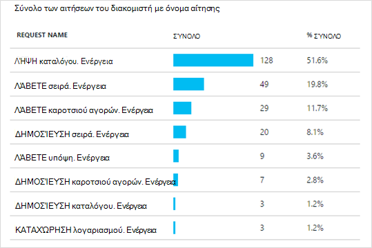

> Εφαρμογή ιδέες προϋποθέτει είναι η μορφή για αιτήσεις HTTP για εφαρμογές MVC: `VERB controller/action`. Για παράδειγμα, `GET Home/Product/f9anuh81`, `GET Home/Product/2dffwrf5` και `GET Home/Product/sdf96vws` είναι ομαδοποιημένα σε `GET Home/Product`. Αυτή η ομάδα επιτρέπει χαρακτηριστικό συναθροίσεις των αιτήσεων, όπως τον αριθμό των αιτήσεων και μέσος χρόνος εκτέλεσης για αιτήσεις.

### Δεδομένα παρουσίας 

Κάντε κλικ στην επιλογή μέσω ενός τύπου συγκεκριμένες αίτησης για να δείτε ξεχωριστές παρουσίες. 

Εμφανίζονται δύο είδη των δεδομένων σε εφαρμογή ιδέες: Συγκεντρωτικά στοιχεία, αποθηκεύονται και εμφανίζονται ως μέσους όρους, πλήθος και αθροισμάτων; και παρουσίας δεδομένων - μεμονωμένες αναφορές των αιτήσεων HTTP, εξαιρέσεις, προβολές σελίδας ή προσαρμοσμένα συμβάντα.

Όταν προβάλετε τις ιδιότητες μιας αίτησης, μπορείτε να δείτε τα συμβάντα τηλεμετρίας που σχετίζεται με το όπως αιτήσεις και εξαιρέσεις.

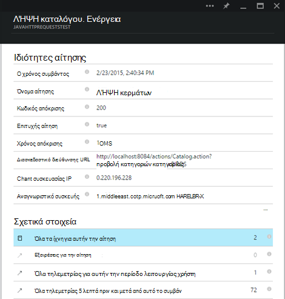

### Ανάλυση: Γλώσσα ερωτημάτων ισχυρή

Καθώς συσσωρεύονται περισσότερα δεδομένα, μπορείτε να εκτελέσετε ερωτήματα τόσο για συγκέντρωση δεδομένων και για να βρείτε ξεχωριστές παρουσίες. [Ανάλυση]() είναι ένα ισχυρό εργαλείο για τα δύο για Κατανόηση απόδοσης και της χρήσης και για σκοπούς διαγνωστικών.

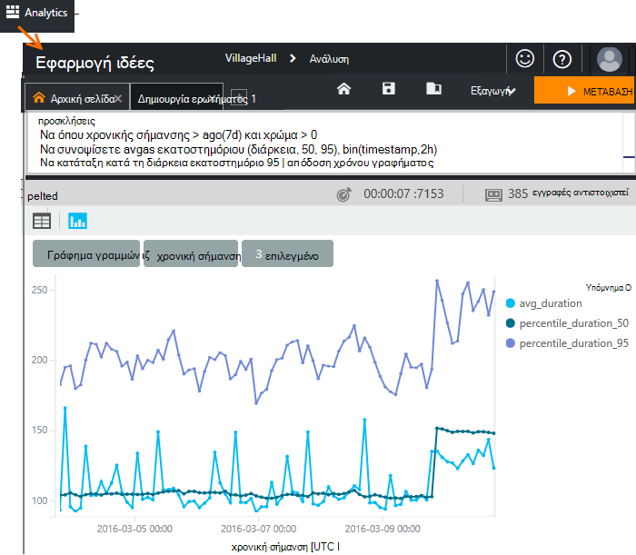

## 7. Εγκαταστήστε την εφαρμογή σας στο διακομιστή

Τώρα μπορείτε να δημοσιεύσετε την εφαρμογή σας στο διακομιστή, χρησιμοποιήστε ενημερώστε τα άτομα και παρακολουθήστε τα τηλεμετρίας που εμφανίζονται στην πύλη του.

* Βεβαιωθείτε ότι το τείχος προστασίας σας επιτρέπει την εφαρμογή σας για να στείλετε τηλεμετρίας σε αυτές τις θύρες:

 * DC.Services.visualstudio.com:443
 * F5.Services.visualstudio.com:443

* Σε διακομιστές των Windows, εγκαταστήστε:

 * [Microsoft Visual C++ με δυνατότητα ανακατανομής](http://www.microsoft.com/download/details.aspx?id=40784)

    (Αυτό το στοιχείο επιτρέπει μετρητές επιδόσεων).

## Εξαιρέσεις και αποτυχίες αίτηση

Συλλέγει αυτόματα ανεπίλυτη εξαιρέσεις:

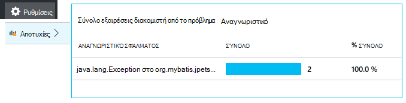

Για τη συλλογή δεδομένων σε άλλες εξαιρέσεις, έχετε δύο επιλογές:

* [Εισαγωγή κλήσεων στο trackException() στον κώδικα][apiexceptions]. 
* [Εγκαταστήστε τον παράγοντα Java στο διακομιστή σας](app-insights-java-agent.md). Μπορείτε να καθορίσετε τις μεθόδους που θέλετε να παρακολουθήσετε.

## Παρακολούθηση της μεθόδου κλήσεις και εξωτερικές εξαρτήσεις

[Εγκαταστήστε τον παράγοντα Java](app-insights-java-agent.md) για να συνδεθείτε καθοριστεί εσωτερικό μεθόδους και κλήσεις που έγιναν μέσω JDBC, με δεδομένα του χρονισμού.

## Μετρητές επιδόσεων

Ανοίξτε τις **Ρυθμίσεις**, **διακομιστές**, για να δείτε μια περιοχή μετρητές επιδόσεων.

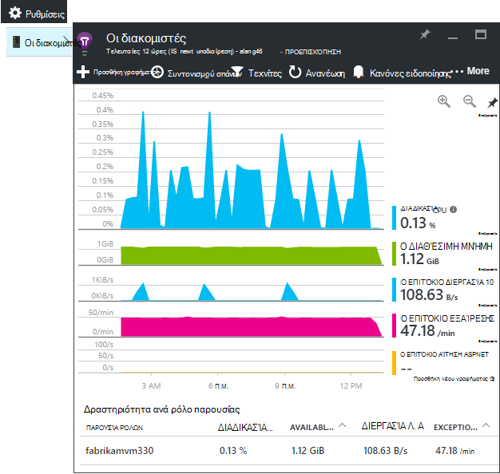

### Προσαρμογή συλλογή του μετρητή επιδόσεων

Για να απενεργοποιήσετε συλλογή από το βασικό σύνολο μετρητών επιδόσεων, προσθέστε τον ακόλουθο κώδικα κάτω από τον ριζικό κόμβο του αρχείου ApplicationInsights.xml:

    <PerformanceCounters>
       <UseBuiltIn>False</UseBuiltIn>
    </PerformanceCounters>

### Συλλογή μετρητών επιπλέον επιδόσεων

Μπορείτε να καθορίσετε επιπλέον επιδόσεων μετρητές που συλλέγονται.

#### Μετρητές JMX (που εκτίθεται από την εικονική μηχανή Java)

    <PerformanceCounters>
      <Jmx>
        <Add objectName="java.lang:type=ClassLoading" attribute="TotalLoadedClassCount" displayName="Loaded Class Count"/>
        <Add objectName="java.lang:type=Memory" attribute="HeapMemoryUsage.used" displayName="Heap Memory Usage-used" type="composite"/>
      </Jmx>
    </PerformanceCounters>

*   `displayName`– Το όνομα που εμφανίζεται στην πύλη εφαρμογής ιδέες.
*   `objectName`-Στο όνομα του αντικειμένου JMX.
*   `attribute`– Το χαρακτηριστικό του ονόματος του αντικειμένου JMX για τη λήψη
*   `type`(προαιρετικό) - τον τύπο του αντικειμένου JMX χαρακτηριστικό:
 *  Προεπιλογή: έναν απλό τύπο όπως int ή μεγάλη.
 *  `composite`: τα δεδομένα του μετρητή επιδόσεων είναι στο πλαίσιο μορφή 'Attribute.Data'
 *  `tabular`: τα δεδομένα του μετρητή επιδόσεων είναι στη μορφή γραμμής πίνακα

#### Μετρητών επιδόσεων των Windows

Κάθε [μετρητή επιδόσεων Windows](https://msdn.microsoft.com/library/windows/desktop/aa373083.aspx) είναι μέλος της κατηγορίας (με τον ίδιο τρόπο ότι ένα πεδίο είναι μέλος μιας κλάσης). Κατηγορίες μπορεί να είναι καθολικός, ή να έχετε αρίθμηση ή την καθορισμένη παρουσίες.

    <PerformanceCounters>
      <Windows>
        <Add displayName="Process User Time" categoryName="Process" counterName="%User Time" instanceName="__SELF__" />
        <Add displayName="Bytes Printed per Second" categoryName="Print Queue" counterName="Bytes Printed/sec" instanceName="Fax" />
      </Windows>
    </PerformanceCounters>

*   Εμφανιζόμενο όνομα – το όνομα που εμφανίζεται στην πύλη εφαρμογής ιδέες.
*   ΌνομαΚατηγορίας – της κατηγορίας μετρητή επιδόσεων (αντικείμενο επιδόσεων) με την οποία συσχετίζεται αυτό μετρητή επιδόσεων.
*   το Όνομα_μετρητή-στο όνομα του μετρητή επιδόσεων.
*   όνομα_παρουσίας – το όνομα του παρουσία κατηγορία μετρητή επιδόσεων, ή μια κενή συμβολοσειρά (""), εάν η κατηγορία περιέχει μία παρουσία. Εάν το όνομα κατηγορίας διαδικασία και το μετρητή επιδόσεων που θέλετε να συλλέξετε από την τρέχουσα διαδικασία JVM στην οποία εκτελείται η εφαρμογή σας, να καθορίσετε `"__SELF__"`.

Μετρητές επιδόσεων σας εμφανίζονται ως προσαρμοσμένο μετρικά στην [Εξερεύνηση μετρικά][metrics].

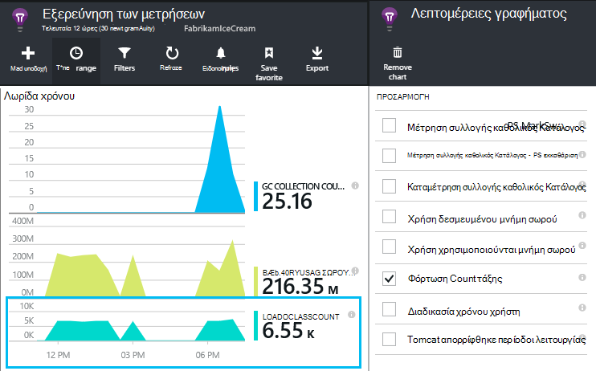

### Μετρητές επιδόσεων UNIX

* [Εγκατάσταση collectd με την προσθήκη εφαρμογής ιδέες](app-insights-java-collectd.md) για να λάβετε μια μεγάλη ποικιλία δεδομένων συστήματος και του δικτύου.

## Λήψη δεδομένων χρήστη και την περίοδο λειτουργίας

Τώρα, στέλνετε τηλεμετρίας από το διακομιστή web. Τώρα για να λάβετε την προβολή πλήρους 360 μοιρών της εφαρμογής σας, μπορείτε να προσθέσετε περισσότερες παρακολούθηση:

* [Προσθήκη τηλεμετρίας στις ιστοσελίδες σας] [ usage] σε οθόνη σελίδα προβολές και μετρικά χρήστη.
* [Ρύθμιση του web δοκιμές] [ availability] για να βεβαιωθείτε ότι η εφαρμογή σας παραμένει ζωντανή και αποκρίνεται.

## Καταγραφή ανιχνεύσεις αρχείου καταγραφής

Μπορείτε να χρησιμοποιήσετε εφαρμογή ιδέες για αρχεία καταγραφής φέτα και ζάρια από Log4J, Logback ή άλλα πλαίσια καταγραφής. Μπορείτε να συσχετίσετε τα αρχεία καταγραφής με αιτήσεις HTTP και άλλες τηλεμετρίας. [Μάθετε πώς][javalogs].

## Στείλτε τις δικές σας τηλεμετρίας

Τώρα που έχετε εγκαταστήσει το SDK, μπορείτε να χρησιμοποιήσετε το API για να στείλετε τη δική σας τηλεμετρίας.

* [Παρακολούθηση προσαρμοσμένων συμβάντων και μετρήσεις] [ api] για να μάθετε τι κάνουν οι χρήστες με την εφαρμογή σας.
* [Αναζήτηση συμβάντων και τα αρχεία καταγραφής] [ diagnostic] για να βοηθά στη διάγνωση προβλημάτων.

## Διαθεσιμότητα web δοκιμές

Εφαρμογή ιδέες να ελέγξετε την τοποθεσία Web σε τακτά χρονικά διαστήματα για να βεβαιωθείτε ότι είναι προς τα επάνω και να αποκρίνεται επίσης και. [Για να ρυθμίσετε][availability], κάντε κλικ στην επιλογή Web δοκιμές.

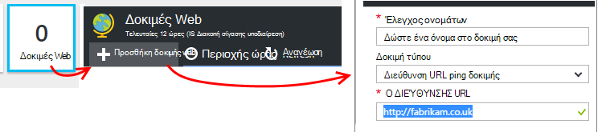

Θα λάβετε γραφήματα χρόνους απόκρισης, καθώς και ειδοποιήσεις ηλεκτρονικού ταχυδρομείου εάν την τοποθεσία σας μεταβαίνει προς τα κάτω.

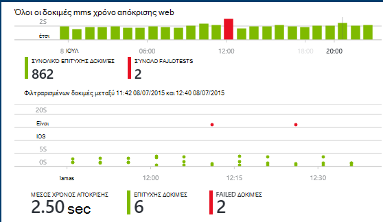

[Μάθετε περισσότερα σχετικά με τη διαθεσιμότητα web δοκιμές.][availability] 

## Ερωτήσεις; Αντιμετωπίζετε προβλήματα;

[Αντιμετώπιση προβλημάτων Java](app-insights-java-troubleshoot.md)

## Επόμενα βήματα

Για περισσότερες πληροφορίες, ανατρέξτε στο [Κέντρο για προγραμματιστές Java](/develop/java/).

<!--Link references-->

[api]: app-insights-api-custom-events-metrics.md
[apiexceptions]: app-insights-api-custom-events-metrics.md#track-exception
[availability]: app-insights-monitor-web-app-availability.md
[diagnostic]: app-insights-diagnostic-search.md
[eclipse]: app-insights-java-eclipse.md
[javalogs]: app-insights-java-trace-logs.md
[metrics]: app-insights-metrics-explorer.md
[usage]: app-insights-web-track-usage.md
