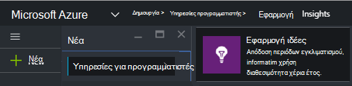
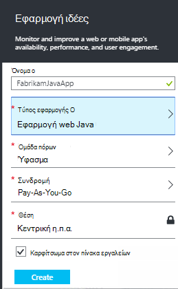
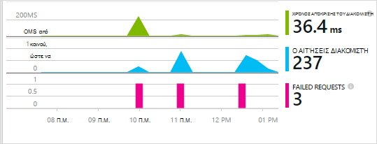
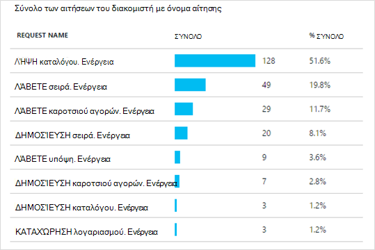
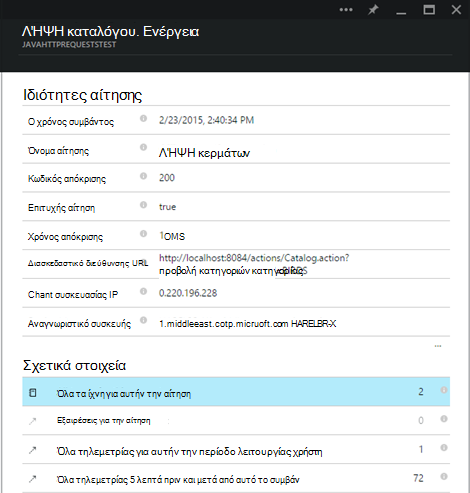

<properties 
    pageTitle="Εφαρμογή ιδέες για τις εφαρμογές web Java που βρίσκονται ήδη live" 
    description="Έναρξη παρακολούθησης μια εφαρμογή web που εκτελείται ήδη στο διακομιστή" 
    services="application-insights" 
    documentationCenter="java"
    authors="alancameronwills" 
    manager="douge"/>

<tags 
    ms.service="application-insights" 
    ms.workload="tbd" 
    ms.tgt_pltfrm="ibiza" 
    ms.devlang="na" 
    ms.topic="article" 
    ms.date="08/24/2016" 
    ms.author="awills"/>
 
# Εφαρμογή ιδέες για τις εφαρμογές web Java που βρίσκονται ήδη live

*Εφαρμογή ιδέες είναι σε προεπισκόπηση.*

Εάν έχετε μια εφαρμογή web που εκτελείται ήδη στο διακομιστή J2EE, μπορείτε να ξεκινήσετε την παρακολούθηση με [Εφαρμογή ιδέες](app-insights-overview.md) χωρίς να χρειάζεται να κάνετε αλλαγές κώδικα ή να μεταγλωττίσετε ξανά το έργο σας. Με αυτήν την επιλογή, μπορείτε να λάβετε πληροφορίες σχετικά με τις αιτήσεις HTTP που αποστέλλονται σε σας διακομιστή, ανεπίλυτη εξαιρέσεις και μετρητές επιδόσεων.

Θα χρειαστείτε μια συνδρομή στο [Microsoft Azure](https://azure.com).

> [AZURE.NOTE] Η διαδικασία σε αυτήν τη σελίδα προσθέτει το SDK σε εφαρμογή web κατά το χρόνο εκτέλεσης. Αυτό οργάνων χρόνου εκτέλεσης είναι χρήσιμη αν δεν θέλετε να ενημερώσετε ή εκ νέου δημιουργία του πηγαίου κώδικα. Αλλά αν μπορείτε, συνιστούμε να που [προσθέτετε στο SDK στον πηγαίο κώδικα](app-insights-java-get-started.md) αντί για αυτό. Που σας προσφέρει περισσότερες επιλογές όπως σύνταξη κώδικα για την παρακολούθηση της δραστηριότητας χρήστη.

## 1. γρήγορα ένα πλήκτρο εφαρμογής ιδέες οργάνων

1. Είσοδος στην [πύλη του Microsoft Azure](https://portal.azure.com)
2. Δημιουργήστε ένα νέο πόρο ιδέες εφαρμογής

    
3. Ορίστε τον τύπο εφαρμογής σε εφαρμογή web Java.

    
4. Βρείτε το κλειδί οργάνων του νέου πόρου. Θα χρειαστεί για να επικολλήσετε λίγο αυτό το κλειδί στο έργο σας κώδικα.

    

## 2. Κάντε λήψη του SDK

1. Κάντε λήψη του [εφαρμογή ιδέες SDK για Java](https://aka.ms/aijavasdk). 
2. Στο διακομιστή σας, κάνετε εξαγωγή των περιεχομένων SDK στον κατάλογο από την οποία γίνεται φόρτωση σας δυαδικά δεδομένα έργου. Εάν χρησιμοποιείτε το Tomcat, αυτόν τον κατάλογο θα συνήθως στην περιοχή`webapps\<your_app_name>\WEB-INF\lib`

## 3. Προσθήκη ενός αρχείου xml ιδέες εφαρμογής

Δημιουργία ApplicationInsights.xml στο φάκελο όπου έχετε προσθέσει στο SDK. Τοποθέτηση σε αυτόν το παρακάτω δείγμα XML.

Αντικαταστήστε το κλειδί οργάνων που λάβατε από την πύλη του Azure.

    <?xml version="1.0" encoding="utf-8"?>
    <ApplicationInsights xmlns="http://schemas.microsoft.com/ApplicationInsights/2013/Settings" schemaVersion="2014-05-30">

      <!-- The key from the portal: -->

      <InstrumentationKey>** Your instrumentation key **</InstrumentationKey>

      <!-- HTTP request component (not required for bare API) -->

      <TelemetryModules>
        <Add type="com.microsoft.applicationinsights.web.extensibility.modules.WebRequestTrackingTelemetryModule"/>
        <Add type="com.microsoft.applicationinsights.web.extensibility.modules.WebSessionTrackingTelemetryModule"/>
        <Add type="com.microsoft.applicationinsights.web.extensibility.modules.WebUserTrackingTelemetryModule"/>
      </TelemetryModules>

      <!-- Events correlation (not required for bare API) -->
      <!-- These initializers add context data to each event -->

      <TelemetryInitializers>
        <Add   type="com.microsoft.applicationinsights.web.extensibility.initializers.WebOperationIdTelemetryInitializer"/>
        <Add type="com.microsoft.applicationinsights.web.extensibility.initializers.WebOperationNameTelemetryInitializer"/>
        <Add type="com.microsoft.applicationinsights.web.extensibility.initializers.WebSessionTelemetryInitializer"/>
        <Add type="com.microsoft.applicationinsights.web.extensibility.initializers.WebUserTelemetryInitializer"/>
        <Add type="com.microsoft.applicationinsights.web.extensibility.initializers.WebUserAgentTelemetryInitializer"/>

      </TelemetryInitializers>
    </ApplicationInsights>

* Το κλειδί οργάνων αποστέλλεται μαζί με κάθε στοιχείο της τηλεμετρίας και σας ενημερώνει για ιδέες εφαρμογής για να το εμφανίσετε σε τον πόρο.
* Το στοιχείο αίτηση HTTP είναι προαιρετικό. Στέλνει αυτόματα τηλεμετρίας σχετικά με τις αιτήσεις και το χρόνο απόκρισης στην πύλη του.
* Συμβάντα συσχέτισης είναι μια προσθήκη στο στοιχείο αίτηση HTTP. Αντιστοιχίζει ένα αναγνωριστικό για κάθε αίτηση παραλήφθηκε από το διακομιστή και προσθέτει αυτό το αναγνωριστικό ως ιδιότητα σε κάθε στοιχείο της τηλεμετρίας ως η ιδιότητα 'Operation.Id'. Σας επιτρέπει να συσχετίσετε το τηλεμετρίας που σχετίζονται με κάθε αίτηση με τη ρύθμιση ενός φίλτρου στο [διαγνωστικών αναζήτησης](app-insights-diagnostic-search.md).

## 4. Προσθήκη ενός φίλτρου HTTP

Εντοπίστε και ανοίξτε το αρχείο web.xml στο έργο σας και συγχώνευση το παρακάτω τμήμα κώδικα του κώδικα κάτω από τον κόμβο εφαρμογής web, όπου έχουν ρυθμιστεί οι παράμετροι φίλτρα εφαρμογή σας.

Για να λάβετε τα πιο ακριβή αποτελέσματα, θα πρέπει να αντιστοιχιστεί το φίλτρο πριν από όλα τα άλλα φίλτρα.

    <filter>
      <filter-name>ApplicationInsightsWebFilter</filter-name>
      <filter-class>
        com.microsoft.applicationinsights.web.internal.WebRequestTrackingFilter
      </filter-class>
    </filter>
    <filter-mapping>
       <filter-name>ApplicationInsightsWebFilter</filter-name>
       <url-pattern>/*</url-pattern>
    </filter-mapping>

## 5. εξαιρέσεις τείχους προστασίας ελέγχου

Ίσως χρειαστεί να [ορίσετε εξαιρέσεις για την αποστολή εξερχόμενων δεδομένων](app-insights-ip-addresses.md).

## 6. Επανεκκινήστε την εφαρμογή web σας

## 7. προβολή σας τηλεμετρίας σε ιδέες εφαρμογής

Επιστροφή στο τον πόρο ιδέες εφαρμογή στο [Microsoft Azure πύλη](https://portal.azure.com).

Τηλεμετρίας σχετικά με τις αιτήσεις HTTP εμφανίζεται στη το blade Επισκόπηση. (Εάν δεν είναι εκεί, περιμένετε μερικά δευτερόλεπτα και, στη συνέχεια, κάντε κλικ στην επιλογή Ανανέωση.)

 

Κάντε κλικ σε οποιοδήποτε γράφημα για να δείτε πιο λεπτομερείς μετρήσεις. 

 

Και κατά την προβολή των ιδιοτήτων μιας αίτησης, μπορείτε να δείτε τα συμβάντα τηλεμετρίας που σχετίζεται με το όπως αιτήσεις και εξαιρέσεις.
 

[Μάθετε περισσότερα σχετικά με τις μετρήσεις.](app-insights-metrics-explorer.md)

## Επόμενα βήματα

* [Προσθήκη τηλεμετρίας στις ιστοσελίδες σας](app-insights-web-track-usage.md) σε οθόνη σελίδα προβολές και μετρήσεις χρήστη.
* [Ρύθμιση δοκιμές web](app-insights-monitor-web-app-availability.md) για να βεβαιωθείτε ότι η εφαρμογή σας παραμένει ζωντανή και αποκρίνεται.
* [Καταγραφή ανιχνεύσεις αρχείου καταγραφής](app-insights-java-trace-logs.md)
* [Αρχεία καταγραφής και συμβάντα αναζήτησης](app-insights-diagnostic-search.md) για να βοηθά στη διάγνωση προβλημάτων.

 
