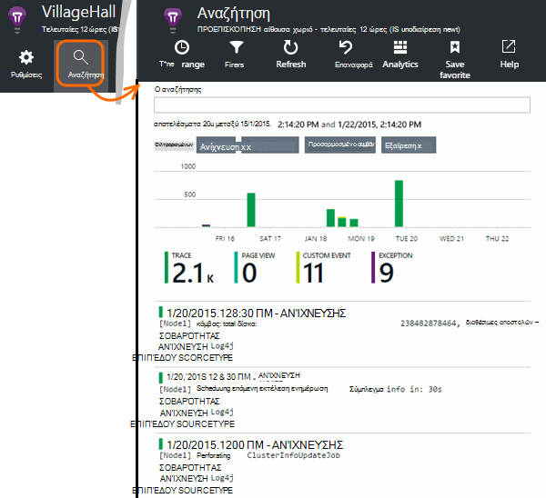

<properties 
    pageTitle="Εξερευνήστε τα αρχεία καταγραφής ανιχνεύσεων στην εφαρμογή ιδέες Java" 
    description="Ίχνη Log4J αναζήτησης ή Logback σε ιδέες εφαρμογής" 
    services="application-insights" 
    documentationCenter="java"
    authors="alancameronwills" 
    manager="douge"/>

<tags 
    ms.service="application-insights" 
    ms.workload="tbd" 
    ms.tgt_pltfrm="ibiza" 
    ms.devlang="na" 
    ms.topic="article" 
    ms.date="07/12/2016" 
    ms.author="awills"/>

# Εξερευνήστε τα αρχεία καταγραφής ανιχνεύσεων στην εφαρμογή ιδέες Java

Εάν χρησιμοποιείτε το Logback ή Log4J (v1.2 ή v2.0) για την ανίχνευση, μπορείτε να έχετε τα αρχεία καταγραφής ανίχνευσης αποστέλλονται αυτόματα σε εφαρμογή ιδέες, όπου μπορείτε να εξερευνήσετε και να αναζήτηση σε αυτά.

Εγκατάσταση [Εφαρμογής ιδέες SDK για Java][java], εάν δεν το έχετε κάνει ήδη που.

## Προσθήκη βιβλιοθηκών καταγραφής στο έργο σας

*Επιλέξτε τον κατάλληλο τρόπο για το έργο σας.*

#### Εάν χρησιμοποιείτε το Maven...

Εάν το έργο σας έχει ήδη ρυθμιστεί για να χρησιμοποιήσετε Maven για δημιουργία, συγχώνευση ένα από τα εξής τμήματα του κώδικα στο αρχείο σας pom.xml.

Στη συνέχεια, ανανεώστε τις εξαρτήσεις έργου, για να λάβετε τα δυαδικά αρχεία που έχουν ληφθεί.

*Logback*

    <dependencies>
       <dependency>
          <groupId>com.microsoft.azure</groupId>
          <artifactId>applicationinsights-logging-logback</artifactId>
          <version>[1.0,)</version>
       </dependency>
    </dependencies>

*Log4J v2.0*

    <dependencies>
       <dependency>
          <groupId>com.microsoft.azure</groupId>
          <artifactId>applicationinsights-logging-log4j2</artifactId>
          <version>[1.0,)</version>
       </dependency>
    </dependencies>

*Log4J v1.2*

    <dependencies>
       <dependency>
          <groupId>com.microsoft.azure</groupId>
          <artifactId>applicationinsights-logging-log4j1_2</artifactId>
          <version>[1.0,)</version>
       </dependency>
    </dependencies>

#### Εάν χρησιμοποιείτε το Gradle...

Εάν το έργο σας έχει ήδη ρυθμιστεί για να χρησιμοποιήσετε Gradle για δημιουργία, προσθέστε μία από τις ακόλουθες γραμμές για να το `dependencies` ομάδας στο αρχείο σας build.gradle:

Στη συνέχεια, ανανεώστε τις εξαρτήσεις έργου, για να λάβετε τα δυαδικά αρχεία που έχουν ληφθεί.

**Logback**

    compile group: 'com.microsoft.azure', name: 'applicationinsights-logging-logback', version: '1.0.+'

**Log4J v2.0**

    compile group: 'com.microsoft.azure', name: 'applicationinsights-logging-log4j2', version: '1.0.+'

**Log4J v1.2**

    compile group: 'com.microsoft.azure', name: 'applicationinsights-logging-log4j1_2', version: '1.0.+'

#### Διαφορετικά...

Κάντε λήψη και εξαγάγετε το κατάλληλο appender και, στη συνέχεια, προσθέστε την κατάλληλη βιβλιοθήκη στο έργο σας:

Πρόγραμμα καταγραφής | Λήψη | Βιβλιοθήκη
----|----|----
Logback|[SDK με Logback appender](https://aka.ms/xt62a4)|applicationinsights-καταγραφή-logback
Log4J v2.0|[SDK με Log4J v2 appender](https://aka.ms/qypznq)|applicationinsights-καταγραφή-log4j2 
Log4j v1.2|[SDK με Log4J v1.2 appender](https://aka.ms/ky9cbo)|applicationinsights-καταγραφή-log4j1_2 

## Προσθήκη του appender του πλαισίου καταγραφή

Για να ξεκινήσετε γρήγορα ανιχνεύσεις, συγχώνευσης το σχετικό τμήμα κώδικα του κώδικα στο αρχείο παραμέτρων Log4J ή Logback: 

*Logback*

    <appender name="aiAppender" 
      class="com.microsoft.applicationinsights.logback.ApplicationInsightsAppender">
    </appender>
    <root level="trace">
      <appender-ref ref="aiAppender" />
    </root>

*Log4J v2.0*

    <Configuration packages="com.microsoft.applicationinsights.Log4j">
      <Appenders>
        <ApplicationInsightsAppender name="aiAppender" />
      </Appenders>
      <Loggers>
        <Root level="trace">
          <AppenderRef ref="aiAppender"/>
        </Root>
      </Loggers>
    </Configuration>

*Log4J v1.2*

    <appender name="aiAppender" 
         class="com.microsoft.applicationinsights.log4j.v1_2.ApplicationInsightsAppender">
    </appender>
    <root>
      <priority value ="trace" />
      <appender-ref ref="aiAppender" />
    </root>

Η εφαρμογή ιδέες appenders μπορούν να χρησιμοποιηθούν με οποιαδήποτε ρύθμιση παραμέτρων καταγραφής και όχι απαραίτητα με το πρόγραμμα καταγραφής ρίζας (όπως φαίνεται στο παραπάνω δείγματα κώδικα).

## Εξερευνήστε τις ανιχνεύσεις σας στην πύλη του ιδέες εφαρμογής

Τώρα που έχετε ρυθμίσει το έργο σας για να στείλετε ανιχνεύσεις σε εφαρμογή ιδέες, μπορείτε να προβάλετε και να πραγματοποιήσετε αναζήτηση αυτές τις ανιχνεύσεις στην πύλη του εφαρμογή ιδέες, στο πλαίσιο [αναζήτησης] [ diagnostic] blade.

## Επόμενα βήματα

[Διαγνωστικών αναζήτησης][diagnostic]

<!--Link references-->

[diagnostic]: app-insights-diagnostic-search.md
[java]: app-insights-java-get-started.md

 
