<properties
    pageTitle="Εφαρμογή ιδέες για JavaScript στο web apps | Microsoft Azure"
    description="Σελίδα προβολή περιόδου λειτουργίας μετρήσεις και, δεδομένων προγράμματος-πελάτη web, σας και παρακολούθηση μοτίβα χρήσης. Εντοπισμός εξαιρέσεις και θέματα απόδοσης σε ιστοσελίδες JavaScript."
    services="application-insights"
    documentationCenter=""
    authors="alancameronwills"
    manager="douge"/>

<tags
    ms.service="application-insights"
    ms.workload="tbd"
    ms.tgt_pltfrm="ibiza"
    ms.devlang="na"
    ms.topic="get-started-article"
    ms.date="08/15/2016"
    ms.author="awills"/>

# Εφαρμογή ιδέες για τις ιστοσελίδες

[AZURE.INCLUDE [app-insights-selector-get-started-dotnet](../../includes/app-insights-selector-get-started-dotnet.md)]

Μάθετε περισσότερα σχετικά με τις επιδόσεις και χρήση της ιστοσελίδας ή την εφαρμογή σας. Εάν προσθέσετε ιδέες εφαρμογή του Visual Studio δέσμη ενεργειών σας σελίδα, μπορείτε να λάβετε χρονισμών φορτώσεις σελίδων και κλήσεις AJAX, πλήθος και λεπτομέρειες εξαιρέσεις προγράμματος περιήγησης και AJAX αποτυχίες, καθώς και οι χρήστες και το πλήθος περιόδου λειτουργίας. Όλα αυτά μπορεί να είναι φέρουν κατά διαστήματα σελίδας, προγράμματος-πελάτη λειτουργικό σύστημα και έκδοση του προγράμματος περιήγησης, θέση παν και άλλες διαστάσεις. Μπορείτε να Ορισμός ειδοποιήσεων σε αποτυχία καταμετρά ή να επιβραδύνει φόρτωση σελίδας.

Μπορείτε να χρησιμοποιήσετε την εφαρμογή ιδέες με οποιεσδήποτε σελίδες web - μπορείτε να προσθέσετε μόνο ένα μικρό τμήμα κώδικα JavaScript. Εάν η υπηρεσία web είναι [Java](app-insights-java-get-started.md) ή [ASP.NET](app-insights-asp-net.md), μπορείτε να ενοποιήσετε τηλεμετρίας από το διακομιστή και προγράμματα-πελάτες.

Χρειάζεστε μια συνδρομή στο [Microsoft Azure](https://azure.com). Εάν η ομάδα σας έχει μια συνδρομή του οργανισμού, ζητήστε από τον κάτοχο για να προσθέσετε το λογαριασμό της Microsoft. Υπάρχει μια δωρεάν τιμολόγησης σειρά, ώστε να ανάπτυξης και χρήση μικρού μεγέθους δεν θα κόστους όλα τα στοιχεία.

## Ρύθμιση εφαρμογών ιδέες για την ιστοσελίδα σας

Πρώτα, χρειάζεται να προσθέσετε ιδέες εφαρμογή στις ιστοσελίδες σας; Που μπορεί να έχετε κάνει ήδη. Εάν επιλέξατε να προσθέσετε ιδέες εφαρμογής σε εφαρμογή web στο παράθυρο διαλόγου νέο έργο στο Visual Studio, προστέθηκε, στη συνέχεια, η δέσμη ενεργειών. Σε αυτή την περίπτωση, δεν χρειάζεται να κάνετε οποιαδήποτε περισσότερα.

Διαφορετικά, πρέπει να προσθέσετε ένα τμήμα κώδικα σελίδες web, ως εξής.

### Ανοίξτε μια εφαρμογή ιδέες πόρων

Ο πόρος ιδέες εφαρμογής είναι όπου εμφανίζονται δεδομένα σχετικά με τις επιδόσεις και η χρήση της σελίδας σας. 

Πραγματοποιήστε είσοδο στην [πύλη του Azure](https://portal.azure.com).

Εάν έχετε ήδη ρυθμίσει παρακολούθησης για την πλευρά του διακομιστή της εφαρμογής σας, διαθέτετε ήδη έναν πόρο:

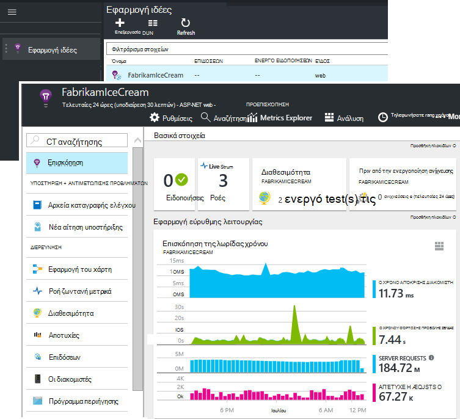

Εάν δεν έχετε, δημιουργήστε την:

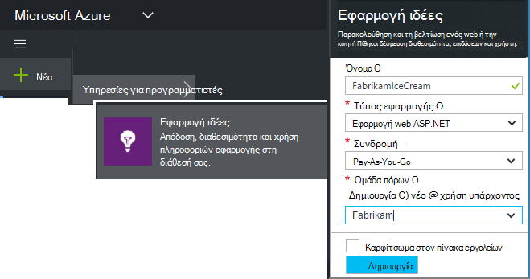

*Ήδη ερωτήσεις;* [Περισσότερες πληροφορίες σχετικά με τη δημιουργία ενός πόρου](app-insights-create-new-resource.md).

### Προσθέστε τη δέσμη ενεργειών SDK στην εφαρμογή ή σελίδες web

Στη Γρήγορη εκκίνηση, λάβετε τη δέσμη ενεργειών για σελίδες web:

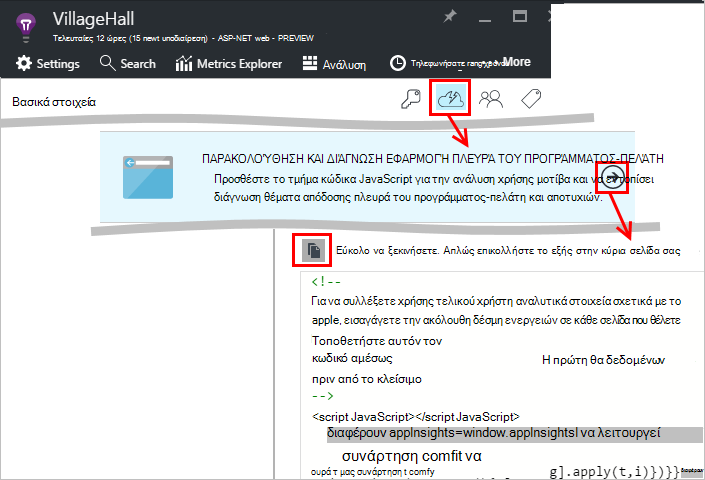

Εισαγάγετε τη δέσμη ενεργειών πριν από την `</head>` ετικέτα κάθε σελίδας που θέλετε να παρακολουθήσετε. Εάν η τοποθεσία Web σας έχει μια κύρια σελίδα, μπορείτε να τοποθετήσετε τη δέσμη ενεργειών εκεί. Για παράδειγμα:

* Σε ένα έργο ASP.NET MVC, μπορείτε να τοποθετήσετε σε`View\Shared\_Layout.cshtml`
* Σε μια τοποθεσία του SharePoint, στον πίνακα ελέγχου, ανοίξτε το [για την τοποθεσία / κύρια σελίδα](app-insights-sharepoint.md).

Η δέσμη ενεργειών περιέχει το κλειδί οργάνων που κατευθύνει τα δεδομένα για τον πόρο εφαρμογής ιδέες. 

([Βαθύτερη εξήγηση των το δέσμης ενεργειών](http://apmtips.com/blog/2015/03/18/javascript-snippet-explained/))

*(Εάν χρησιμοποιείτε ένα πλαίσιο γνωστές ιστοσελίδα, αναζητήστε γύρω από εφαρμογή ιδέες προσαρμογείς. For example, υπάρχει [μια λειτουργική μονάδα AngularJS](http://ngmodules.org/modules/angular-appinsights).)*

## Λεπτομερή ρύθμισης παραμέτρων

Υπάρχουν αρκετές [παράμετροι](https://github.com/Microsoft/ApplicationInsights-JS/blob/master/API-reference.md#config) που μπορείτε να ορίσετε, αν και στις περισσότερες περιπτώσεις, δεν θα χρειαστεί να. Για παράδειγμα, μπορείτε να απενεργοποιήσετε ή να περιορίζει τον αριθμό των κλήσεων Ajax ανέφεραν ανά σελίδα Προβολή (για να μειώσετε την κυκλοφορία). Ή μπορείτε να ορίσετε κατάσταση εντοπισμού σφαλμάτων για να μετακινήσετε γρήγορα μέσω της διοχέτευσης χωρίς να μαζικής τηλεμετρίας.

Για να ρυθμίσετε αυτές τις παραμέτρους, αναζητήστε αυτήν τη γραμμή στο τμήμα κώδικα και προσθέστε περισσότερα στοιχεία οριοθετημένων με κόμματα μετά από αυτό:

    })({
      instrumentationKey: "..."
      // Insert here
    });

Οι [διαθέσιμες παραμέτρους](https://github.com/Microsoft/ApplicationInsights-JS/blob/master/API-reference.md#config) περιλαμβάνουν:

    // Send telemetry immediately without batching.
    // Remember to remove this when no longer required, as it
    // can affect browser performance.
    enableDebug: boolean,

    // Don't log browser exceptions.
    disableExceptionTracking: boolean,

    // Don't log ajax calls.
    disableAjaxTracking: boolean,

    // Limit number of Ajax calls logged, to reduce traffic.
    maxAjaxCallsPerView: 10, // default is 500

    // Time page load up to execution of first trackPageView().
    overridePageViewDuration: boolean,

    // Set these dynamically for an authenticated user.
    appUserId: string,
    accountId: string,

## Εκτελέστε την εφαρμογή σας

Εκτελέστε την εφαρμογή web της, να το χρησιμοποιήσετε κάποιος χρόνος για να δημιουργήσετε τηλεμετρίας και περιμένετε μερικά δευτερόλεπτα. Μπορείτε να εκτελέσετε χρησιμοποιώντας το πλήκτρο **F5** στον υπολογιστή σας ανάπτυξης, ή δημοσιεύστε το και επιτρέπουν στους χρήστες να αναπαραγάγετε με αυτό.

Εάν θέλετε να ελέγξετε το τηλεμετρίας μια εφαρμογή web αποστολής για εφαρμογή ιδέες, χρησιμοποιήστε εργαλεία εντοπισμού σφαλμάτων του προγράμματος περιήγησής σας (**F12** σε πολλά προγράμματα περιήγησης). Τα δεδομένα αποστέλλονται στο dc.services.visualstudio.com.

## Εξερεύνηση των δεδομένων επιδόσεων του προγράμματος περιήγησης

Ανοίξτε το blade προγράμματα περιήγησης για να εμφανίσετε δεδομένα συγκεντρωτική επιδόσεων από τα προγράμματα περιήγησης των χρηστών σας.

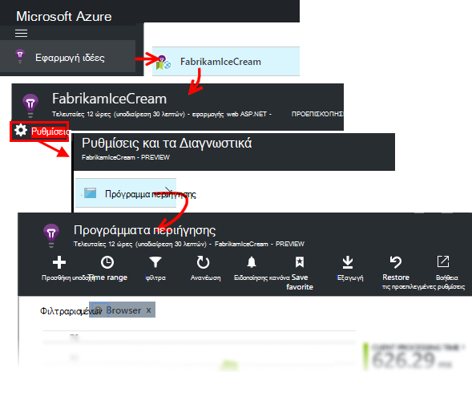

*Ακόμη χωρίς δεδομένα; Κάντε κλικ στην επιλογή * *Ανανέωση* * στο επάνω μέρος της σελίδας. Εξακολουθεί να έχει κανένα αποτέλεσμα; Ανατρέξτε στο θέμα [Αντιμετώπιση προβλημάτων](app-insights-troubleshoot-faq.md).*

Τα προγράμματα περιήγησης blade είναι μια [Explorer μετρικά blade](app-insights-metrics-explorer.md) με προκαθορισμένα φίλτρα και τις επιλογές γραφήματος. Μπορείτε να επεξεργαστείτε το χρονικό διάστημα, φίλτρα και ρύθμισης παραμέτρων γράφημα εάν θέλετε, και αποθηκεύστε το αποτέλεσμα ως Αγαπημένα. Κάντε κλικ στην επιλογή **Επαναφορά προεπιλογών** για να επιστρέψετε στο την αρχική ρύθμιση παραμέτρων blade.

## Απόδοση φόρτωση της σελίδας

Στο επάνω μέρος είναι ένα γράφημα τμηματική από τους χρόνους φόρτωσης σελίδων. Το συνολικό ύψος του γραφήματος αναπαριστά ο μέσος χρόνος για τη φόρτωση και να εμφανίσει σελίδες από την εφαρμογή σας σε προγράμματα περιήγησης των χρηστών σας. Ο χρόνος υπολογίζεται από όταν το πρόγραμμα περιήγησης στέλνει την αρχική αίτηση HTTP μέχρι όλα σύγχρονη φόρτωσης συμβάντα έχουν υποστεί επεξεργασία, συμπεριλαμβανομένης της διάταξης και να εκτελούν δέσμες ενεργειών. Δεν περιλαμβάνει ασύγχρονης εργασίες όπως η φόρτωση τμήματα web από AJAX κλήσεις.

Το γράφημα τμήματα του χρόνου φόρτωσης σύνολο σελίδων σε την [τυπική τους χρονισμούς που ορίζονται από W3C](http://www.w3.org/TR/navigation-timing/#processing-model). 

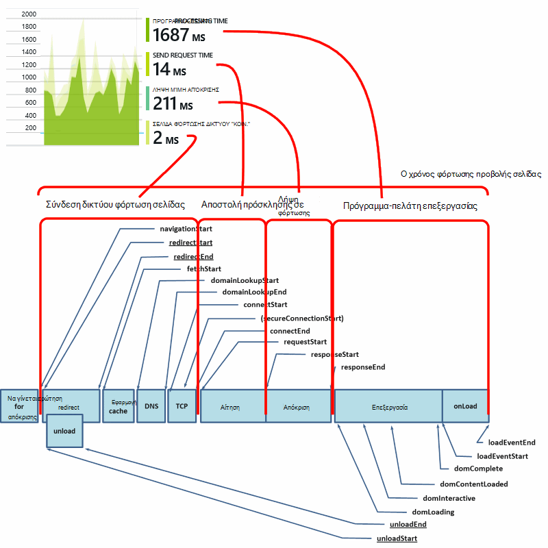

Σημειώστε ότι η ώρα *σύνδεση δικτύου* είναι συχνά κατώτερο ίσως αναμένατε, επειδή είναι ο μέσος όρος πάνω από όλες τις αιτήσεις από το πρόγραμμα περιήγησης στο διακομιστή. Πολλά μεμονωμένα αιτήσεις έχει σύνδεση ώρας 0, επειδή υπάρχει ήδη μια ενεργή σύνδεση με το διακομιστή.

### Επιβραδύνει τη φόρτωση;

Φορτώσεις σελίδων αργές είναι σημαντική πηγή μη ικανοποίησης για τους χρήστες σας. Εάν το γράφημα δείχνει φορτώσεις σελίδων αργή, είναι εύκολο να κάνετε ορισμένες διαγνωστικών έρευνα.

Το γράφημα εμφανίζει τον μέσο όρο όλων φορτώσεις σελίδων στην εφαρμογή. Για να δείτε εάν το ζήτημα πρέπει να περιορίζεται σε συγκεκριμένες σελίδες, είναι πιο κάτω το blade, όταν δεν υπάρχει ένα πλέγμα φέρουν κατά διαστήματα με διεύθυνση URL της σελίδας:

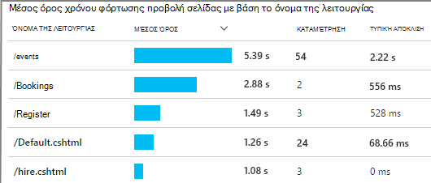

Παρατηρήστε το πλήθος προβολής σελίδων και τυπική απόκλιση. Εάν το πλήθος σελίδων είναι πολύ χαμηλή, στη συνέχεια, το ζήτημα δεν είναι που επηρεάζουν τους χρήστες πολύ. Υψηλή τυπική απόκλιση (συγκρίσιμη με εκείνη τον μέσο όρο ίδια) υποδεικνύει πολλές παραλλαγών μεταξύ μεμονωμένες μετρήσεις.

**Μεγέθυνση σε μία διεύθυνση URL και προβολή μιας σελίδας.** Κάντε κλικ σε οποιοδήποτε όνομα σελίδας για να δείτε μια blade γραφημάτων περιήγησης φιλτραρισμένο μόνο για αυτήν τη διεύθυνση URL; και, στη συνέχεια, σε μια παρουσία μιας προβολής σελίδας.

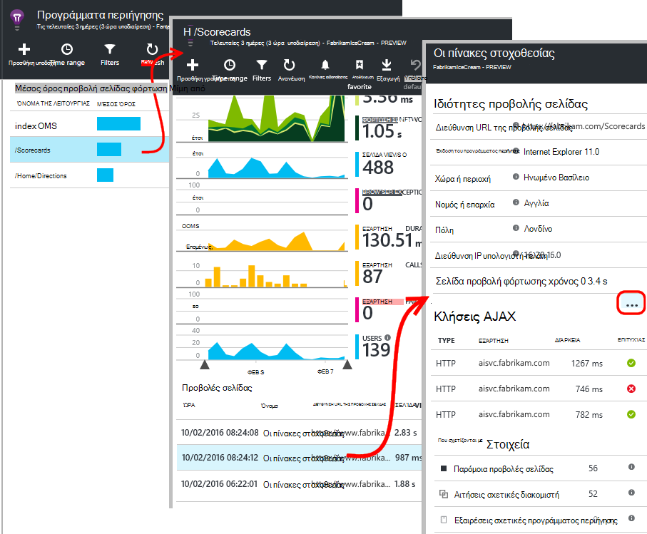

Κάντε κλικ στην επιλογή `...` για μια πλήρη λίστα των ιδιοτήτων για αυτό το συμβάν, ή έλεγχος των κλήσεων Ajax και των σχετικών συμβάντων. Αργή κλήσεις Ajax επηρεάζει ο συνολικός χρόνος φόρτωσης σελίδας εάν είναι σύγχρονη. Σχετικές συμβάντα περιλαμβάνουν αιτήσεις διακομιστή για την ίδια διεύθυνση URL (Εάν έχετε ρυθμίσει ιδέες εφαρμογής στο διακομιστή web).

**Απόδοση της σελίδας μέσα στο χρόνο.** Πίσω στη blade τα προγράμματα περιήγησης, αλλάξτε το πλέγμα χρόνου φόρτωσης προβολή σελίδας σε ένα γράφημα γραμμών για να δείτε εάν υπάρχουν κορυφών σε συγκεκριμένες ώρες:

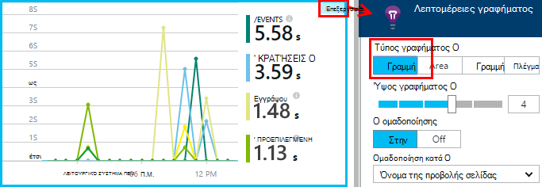

**Τμήμα από άλλες διαστάσεις.** Ίσως είναι πιο αργά για τη φόρτωση σε ένα συγκεκριμένο πρόγραμμα περιήγησης, προγράμματος-πελάτη λειτουργικό σύστημα ή τοποθεσία χρήστη οι σελίδες σας; Προσθέστε ένα νέο γράφημα και να πειραματιστείτε με τη διάσταση **Ομαδοποίηση κατά** .

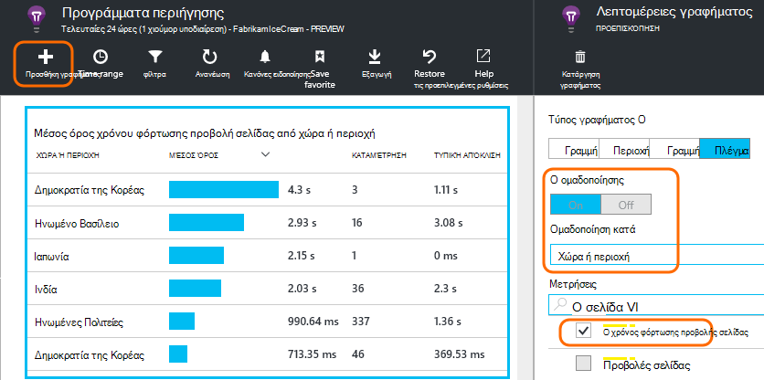

## Απόδοσης AJAX

Βεβαιωθείτε ότι εκτελείτε επίσης και τυχόν κλήσεις AJAX στις ιστοσελίδες σας. Χρησιμοποιούνται συχνά για να συμπληρώσετε ασύγχρονα τμήματα της σελίδας σας. Παρόλο που η συνολική σελίδα μπορεί να φορτώσετε αμέσως, οι χρήστες σας θα μπορούσε να είναι frustrated, ξεκινώντας με τμήματα web κενό, αναμονή για να εμφανίζονται σε αυτά τα δεδομένα.

AJAX κλήσεις που έγιναν από την ιστοσελίδα σας εμφανίζονται στην τα προγράμματα περιήγησης blade ως εξαρτήσεις.

Υπάρχουν διαγράμματα σύνοψης στο επάνω μέρος του το blade:

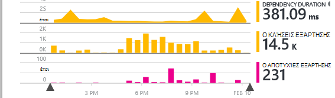

και λεπτομερείς πλέγματα κάτω προς τα κάτω:

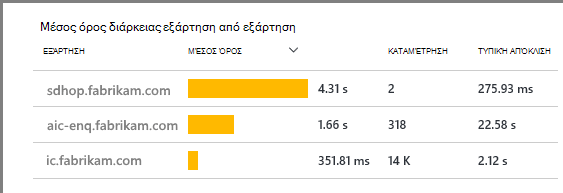

Κάντε κλικ σε οποιαδήποτε γραμμή για συγκεκριμένες λεπτομέρειες.

> [AZURE.NOTE] Εάν διαγράψετε το φίλτρο προγράμματα περιήγησης στο το blade, διακομιστή και AJAX εξαρτήσεις περιλαμβάνονται σε αυτά τα γραφήματα. Κάντε κλικ στην επιλογή Επαναφορά προεπιλογών για να ρυθμίσει ξανά τις παραμέτρους του φίλτρου.

**Για να διερευνήσουν αποτυχίας κλήσεις Ajax** κάντε κύλιση προς τα κάτω στο πλέγμα αποτυχίες εξάρτηση και, στη συνέχεια, κάντε κλικ στην επιλογή μιας γραμμής για να δείτε συγκεκριμένα εμφανίσεις.

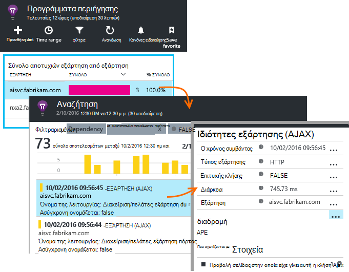

Κάντε κλικ στην επιλογή `...` για την πλήρη τηλεμετρίας για μια κλήση Ajax.

### Χωρίς κλήσεις Ajax αναφερθεί;

Κλήσεις AJAX περιλαμβάνουν τυχόν κλήσεις HTTP που έγιναν από τη δέσμη ενεργειών της ιστοσελίδας σας. Εάν δεν βλέπετε τα αναφερθεί, ελέγξτε ότι το τμήμα κώδικα δεν οριστεί η `disableAjaxTracking` ή `maxAjaxCallsPerView` [παράμετροι](https://github.com/Microsoft/ApplicationInsights-JS/blob/master/API-reference.md#config).

## Εξαιρέσεις προγράμματος περιήγησης

Σε blade τα προγράμματα περιήγησης, υπάρχει ένα γράφημα σύνοψης εξαιρέσεις και ένα πλέγμα τύπων εξαίρεση περαιτέρω προς τα κάτω το blade.

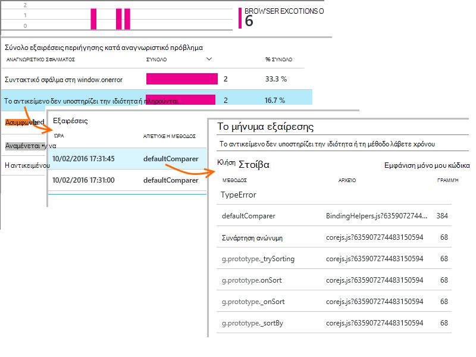

Εάν δεν βλέπετε το πρόγραμμα περιήγησης εξαιρέσεις που αναφέρονται, ελέγξτε ότι το τμήμα κώδικα δεν οριστεί η `disableExceptionTracking` [παραμέτρου](https://github.com/Microsoft/ApplicationInsights-JS/blob/master/API-reference.md#config).

## Έλεγχος συμβάντα προβολή μεμονωμένης σελίδας

Συνήθως αναλύεται τηλεμετρίας προβολή σελίδας με εφαρμογή ιδέες και μπορείτε να δείτε μόνο αθροιστική αναφορές, ως μέσος όρος για όλους τους χρήστες σας. Αλλά, για σκοπούς εντοπισμού σφαλμάτων, μπορείτε επίσης να ανατρέξετε σε μεμονωμένη σελίδα Προβολή συμβάντων.

Στο πλαίσιο Αναζήτηση διαγνωστικών blade, ρυθμίστε τα φίλτρα στην προβολή σελίδα.

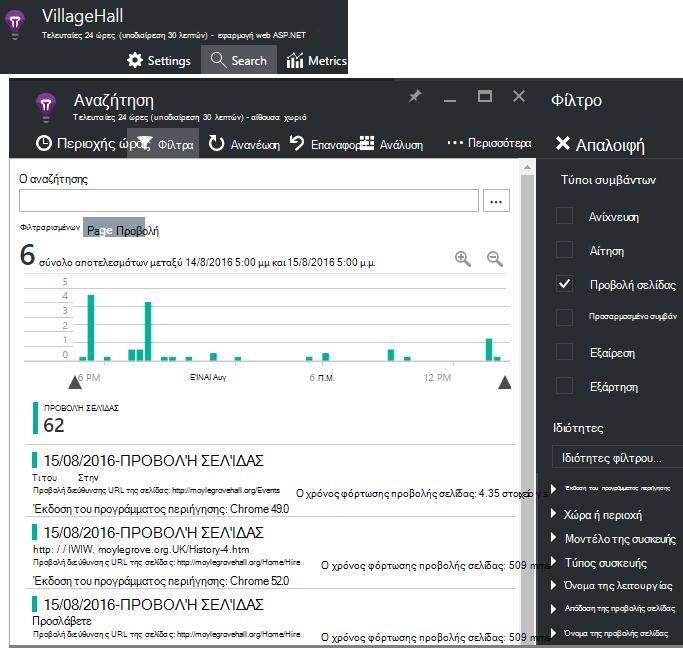

Επιλέξτε οποιοδήποτε συμβάν για να δείτε περισσότερες λεπτομέρειες. Στη σελίδα λεπτομέρειες, κάντε κλικ στο κουμπί "…" για να δείτε ακόμα περισσότερες λεπτομέρειες.

> [AZURE.NOTE] Εάν χρησιμοποιείτε την [Αναζήτηση](app-insights-diagnostic-search.md), παρατηρήστε ότι πρέπει να συμφωνεί με ολόκληρες λέξεις: "Ληροφορίες για" και "πληροφορίες" δεν αντιστοιχούν με τις "Σχετικά με".

Μπορείτε επίσης να χρησιμοποιήσετε το ισχυρή [ανάλυση ερωτήματος γλώσσας](app-insights-analytics-tour.md) για να πραγματοποιήσετε αναζήτηση προβολών σελίδας.

### Προβολή ιδιοτήτων σελίδας

* **Διάρκεια προβολής σελίδας** 

 * Από προεπιλογή, το χρόνο που χρειάζεται για τη φόρτωση της σελίδας, από το πρόγραμμα-πελάτη ζητούν πλήρους φορτίο (συμπεριλαμβανομένων των βοηθητικά αρχεία εξαιρουμένων των ασύγχρονης εργασίες όπως Ajax κλήσεις). 
 * Εάν ορίσετε `overridePageViewDuration` στην [σελίδα ρύθμισης παραμέτρων](#detailed-configuration), το διάστημα μεταξύ του προγράμματος-πελάτη αίτηση εκτέλεσης της πρώτης `trackPageView`. Εάν έχετε μετακινήσει trackPageView από τη θέση του συνήθη μετά την προετοιμασία της δέσμης ενεργειών, αυτό θα αντανακλούν μια διαφορετική τιμή.
 * Εάν `overridePageViewDuration` είναι σύνολο και διάρκεια όρισμα παρέχεται με το `trackPageView()` κλήση, τότε η τιμή του ορίσματος χρησιμοποιείται αντί για αυτό. 

## Καταμετρά προσαρμοσμένη σελίδα

Από προεπιλογή, ένα πλήθος σελίδων πραγματοποιείται κάθε φορά που φορτώνει μια νέα σελίδα στο πρόγραμμα περιήγησης υπολογιστή-πελάτη.  Αλλά μπορεί να θέλετε να καταμετρήσετε πρόσθετη σελίδα προβολές. Για παράδειγμα, μια σελίδα μπορεί να εμφανίζονται το περιεχόμενο σε καρτέλες και θέλετε να καταμετρήσετε μια σελίδα, όταν ο χρήστης αλλάζει καρτέλες. Ή κώδικα JavaScript στη σελίδα μπορεί να φορτώσετε νέο περιεχόμενο χωρίς να αλλάξετε τη διεύθυνση URL του προγράμματος περιήγησης.

Εισαγάγετε μια κλήση JavaScript ως εξής στο κατάλληλο σημείο στον κώδικα του προγράμματος-πελάτη:

    appInsights.trackPageView(myPageName);

Το όνομα της σελίδας μπορούν να περιέχουν τους ίδιους χαρακτήρες ως διεύθυνση URL, αλλά όλα μετά "#" ή ";" παραβλέπεται.

## Παρακολούθηση χρήσης

Θέλετε να μάθετε τι να κάνετε τους χρήστες σας με την εφαρμογή σας;

* [Μάθετε σχετικά με τη χρήση παρακολούθησης](app-insights-web-track-usage.md)
* [Μάθετε σχετικά με προσαρμοσμένα συμβάντα και μετρήσεις API](app-insights-api-custom-events-metrics.md).

#### Βίντεο: Παρακολούθηση χρήσης

> [AZURE.VIDEO tracking-usage-with-application-insights]

## Επόμενα βήματα

* [Παρακολούθηση χρήσης](app-insights-web-track-usage.md)
* [Προσαρμοσμένα συμβάντα και μετρήσεις](app-insights-api-custom-events-metrics.md)
* [Δόμηση-μάθετε μέτρησης](app-insights-overview-usage.md)

