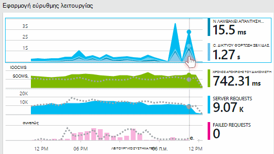
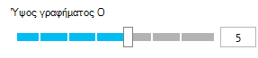

<properties 
    pageTitle="Εξερεύνηση μετρικά στην εφαρμογή ιδέες | Microsoft Azure" 
    description="Πώς μπορείτε να ερμηνεύσετε γραφήματα στην Εξερεύνηση των μετρικό και πώς μπορείτε να προσαρμόσετε λεπίδες μετρικό explorer." 
    services="application-insights" 
    documentationCenter=""
    authors="alancameronwills" 
    manager="douge"/>

<tags 
    ms.service="application-insights" 
    ms.workload="tbd" 
    ms.tgt_pltfrm="ibiza" 
    ms.devlang="na" 
    ms.topic="article" 
    ms.date="10/15/2016" 
    ms.author="awills"/>
 
# Εξερεύνηση μετρικά στην εφαρμογή ιδέες

Μετρήσεις στην [Εφαρμογή ιδέες] [ start] είναι μετράται τιμές και το πλήθος των συμβάντων που αποστέλλονται σε τηλεμετρίας από την εφαρμογή σας. Βοηθούν να εντοπίσετε θέματα απόδοσης και να δείτε τις τάσεις σε πώς χρησιμοποιείται η εφαρμογή σας. Υπάρχει μια μεγάλη ποικιλία τυπικές μετρήσεις και μπορείτε επίσης να δημιουργήσετε το δικό σας προσαρμοσμένο μετρήσεις και τα συμβάντα.

Μετρήσεις μετρικά και συμβάντων εμφανίζονται σε γραφήματα των συγκεντρωτικών τιμών όπως αθροίσματα, μέσους όρους ή πλήθος.

Ακολουθεί ένα δείγμα γραφήματος:

Φέρουν κατά διαστήματα ορισμένα γραφήματα: το συνολικό ύψος του γραφήματος σε οποιοδήποτε σημείο είναι το άθροισμα των μετρικών που εμφανίζεται. Το υπόμνημα από προεπιλογή εμφανίζει τις ποσότητες μεγαλύτερη.

Διακεκομμένες γραμμές δείχνουν την τιμή από τη μέτρηση μία εβδομάδα προηγουμένως.

## Περιοχής ώρας

Μπορείτε να αλλάξετε το εύρος χρόνου που καλύπτονται από το γραφημάτων ή πλεγμάτων σε οποιαδήποτε blade.

Εάν περιμένατε ορισμένα δεδομένα τα οποία δεν έχει εμφανίζονταν ακόμη, κάντε κλικ στην επιλογή Ανανέωση. Γραφήματα ανανέωση τον εαυτό τους σε χρονικά διαστήματα, αλλά τα χρονικά διαστήματα είναι περισσότερο χρόνο για μεγαλύτερα χρονικά διαστήματα. Στη λειτουργία έκδοση, ενδέχεται να χρειαστεί κάποιος χρόνος για δεδομένα αναμένεται μέσω της διοχέτευσης ανάλυσης πάνω σε ένα γράφημα.

Για να μεγεθύνετε μέρος του γραφήματος, σύρετε επάνω από αυτό:

Κάντε κλικ στο κουμπί Αναίρεση ζουμ για να τον επαναφέρετε.

## Τιμές υποδιαίρεσης και σημείο

Τοποθετήστε το δείκτη του ποντικιού πάνω από το γράφημα για να εμφανίσετε τις τιμές από τα μετρικά σε αυτό το σημείο.

Η τιμή του τη μέτρηση σε ένα συγκεκριμένο σημείο συναθροίζεται το προηγούμενο διάστημα δειγματοληψία. 

Το διάστημα δειγματοληψία ή "υποδιαίρεση" εμφανίζεται στο επάνω μέρος του blade. 

Μπορείτε να προσαρμόσετε το επίπεδο λεπτομερειών στο το blade περιοχή χρόνου:

Τα διαθέσιμα υποδιαιρέσεων εξαρτώνται από το εύρος χρόνου που επιλέγετε. Τα ρητά υποδιαιρέσεων είναι εναλλακτικές λύσεις για το επίπεδο λεπτομερειών "Αυτόματη" για το χρονικό διάστημα. 

## Εξερεύνηση των μετρήσεων

Κάντε κλικ σε οποιοδήποτε γράφημα στην την επισκόπηση blade για να δείτε μια πιο λεπτομερή σύνολο σχετικά γραφήματα και πλέγματα. Μπορείτε να επεξεργαστείτε αυτά τα γραφήματα και πλέγματα για εστίαση σε τις λεπτομέρειες που σας ενδιαφέρει.

Ή μπορείτε να κάνετε κλικ στο κουμπί μετρικά Explorer στην κεφαλίδα του την επισκόπηση blade.

Για παράδειγμα, κάντε κλικ στην επιλογή μέσω του web app απέτυχε αιτήσεις γραφήματος:

## Τι σημαίνουν τα στοιχεία;

Το υπόμνημα στο πλάι από προεπιλογή εμφανίζει συνήθως η συγκεντρωτική τιμή κατά τη διάρκεια περιόδου του γραφήματος. Εάν έχετε το δείκτη του ποντικιού πάνω από το γράφημα, που εμφανίζει την τιμή σε αυτό το σημείο.

Κάθε σημείο δεδομένων στο γράφημα είναι μια συγκεντρωτική τιμή από τις τιμές δεδομένων που λάβατε με το προηγούμενο δειγματοληψία διάστημα ή "υποδιαίρεση". Το επίπεδο λεπτομερειών εμφανίζεται στο επάνω μέρος του blade και ποικίλλει, ανάλογα με τη συνολική χρονική κλίμακα του γραφήματος.

Μετρικά μπορεί να είναι ενοποιούνται με διάφορους τρόπους: 

 * **Sum** προσθέτει τις τιμές από όλα τα σημεία δεδομένων που λάβατε μέσω το χρονικό διάστημα δειγματοληψία ή της περιόδου του γραφήματος.
 * **Μέσος όρος** διαιρεί το άθροισμα από τον αριθμό των σημείων δεδομένων που λάβατε το διάστημα.
 * **Μοναδικές** μετρήσεις που χρησιμοποιούνται για το πλήθος των χρηστών και των λογαριασμών. Το διάστημα δειγματοληψία ή κατά τη διάρκεια της στο γράφημα, η εικόνα δείχνει το πλήθος των διαφορετικούς χρήστες που εμφανίζονται σε αυτό το χρονικό διάστημα.

Μπορείτε να αλλάξετε τη μέθοδο συγκέντρωσης:

Η προεπιλεγμένη μέθοδος για κάθε μετρικό εμφανίζεται όταν δημιουργείτε ένα νέο γράφημα ή όταν όλα τα μετρικά είναι απενεργοποιημένη:

## Επεξεργασία γραφήματα και πλέγματα

Για να προσθέσετε ένα νέο γράφημα το blade:

Επιλέξτε **Επεξεργασία** σε ένα υπάρχον ή νέο γράφημα για να επεξεργαστείτε τι εμφανίζεται:

Μπορείτε να εμφανίσετε περισσότερα από ένα μετρικό σύστημα σε ένα γράφημα, αν και δεν υπάρχουν περιορισμοί σχετικά με τους συνδυασμούς που μπορούν να εμφανίζονται μαζί. Μόλις επιλέξετε ένα μετρικό σύστημα, ορισμένες από τις άλλες απενεργοποιούνται. 

Εάν κώδικα [προσαρμοσμένο μετρικά] [ track] στην εφαρμογή σας (κλήσεων για TrackMetric και TrackEvent) θα παρατεθούν εδώ.

## Τμήμα των δεδομένων σας

Μπορείτε να διαιρέσετε ένα μετρικό από την ιδιότητα - για παράδειγμα, για να συγκρίνετε τις προβολές σελίδας σε προγράμματα-πελάτες με διαφορετικά λειτουργικά συστήματα. 

Επιλέξτε ένα γράφημα ή πλέγμα, εναλλαγή την ομαδοποίηση και επιλέξτε μια ιδιότητα για ομαδοποίηση κατά:

> [AZURE.NOTE] Όταν χρησιμοποιείτε ομαδοποίησης, οι τύποι περιοχών και γραφήματος ράβδων παρέχουν μια Σωρευμένη εμφάνισης. Αυτό είναι κατάλληλο όπου η μέθοδος συνάθροισης είναι το άθροισμα. Αλλά όπου ο τύπος συνάθροισης είναι μέσος όρος, επιλέξτε τους τύπους εμφάνισης γραμμών ή γραμμών πλέγματος. 

Εάν κώδικα [προσαρμοσμένο μετρικά] [ track] στην εφαρμογή σας και σε αυτές περιλαμβάνονται οι τιμές ιδιοτήτων, θα έχετε τη δυνατότητα να επιλέξετε την ιδιότητα στη λίστα.

Είναι πολύ μικρό για τμηματική τα δεδομένα του γραφήματος; Προσαρμόστε το ύψος:

## Φιλτράρισμα των δεδομένων σας

Για να δείτε μόνο τις μετρήσεις για ένα επιλεγμένο σύνολο τιμών ιδιοτήτων:

Εάν δεν επιλέξετε τις τιμές για μια συγκεκριμένη ιδιότητα, είναι η ίδια με την επιλογή όλα: δεν υπάρχει κανένα φίλτρο σε αυτήν την ιδιότητα.

Παρατηρήστε ότι το πλήθος των συμβάντων μαζί με κάθε τιμή της ιδιότητας. Όταν επιλέγετε τιμές από μία ιδιότητα, προσαρμόζονται τις μετρήσεις μαζί με άλλες τιμές ιδιοτήτων.

Τα φίλτρα που εφαρμόζονται σε όλα τα γραφήματα σε ένα blade. Εάν θέλετε διαφορετική φίλτρα που εφαρμόζονται σε διάφορα γραφήματα, δημιουργήστε και αποθηκεύστε λεπίδες διαφορετικό μετρικά. Εάν θέλετε, μπορείτε να καρφιτσώσετε γραφήματα από διαφορετικές λεπίδες στον πίνακα εργαλείων, ώστε να μπορείτε να τις δείτε παράλληλα με μεταξύ τους.

### Κατάργηση web και bot κίνηση δοκιμής

Χρησιμοποιήστε το φίλτρο **πραγματικό ή σύνθετων κυκλοφορίας** και έλεγχος **πραγματικό**.

Μπορείτε επίσης να φιλτράρετε κατά **προέλευση της σύνθετων κυκλοφορίας**.

### Για να προσθέσετε ιδιότητες στη λίστα φίλτρων

Θέλετε να εφαρμόσετε το φίλτρο τηλεμετρίας σε μια κατηγορία της επιλογής σας; Για παράδειγμα, ίσως έχετε Διαίρεση προς τα επάνω τους χρήστες σας σε διαφορετικές κατηγορίες και θα θέλατε να χωρίσετε τα δεδομένα σας από αυτές τις κατηγορίες.

[Δημιουργία ιδιότητας το δικό σας](app-insights-api-custom-events-metrics.md#properties). Ρυθμίσετε σε μια [Τηλεμετρίας προετοιμασίας](app-insights-api-custom-events-metrics.md#telemetry-initializers) για να εμφανίζονται σε όλους τηλεμετρίας - όπως η τυπική τηλεμετρίας αποσταλεί από διαφορετική SDK λειτουργικές μονάδες.

## Επεξεργαστείτε τον τύπο γραφήματος

Παρατηρήστε ότι μπορείτε να εναλλάσσεστε μεταξύ πλέγματα και γραφήματα:

## Αποθηκεύστε το blade μετρικά

Όταν έχετε δημιουργήσει κάποια γραφήματα, τις αποθηκεύσετε ως Αγαπημένα. Μπορείτε να επιλέξετε εάν θέλετε να χρησιμοποιήσετε από κοινού με άλλα μέλη της ομάδας, εάν χρησιμοποιείτε έναν εταιρικό λογαριασμό.

Για να δείτε το blade ξανά, **μεταβείτε στο την επισκόπηση blade** και ανοίξτε το "Αγαπημένα":

Εάν επιλέξατε σχετική χρονικό διάστημα κατά την αποθήκευση, την blade θα ενημερωθεί με την πιο πρόσφατη μετρήσεις. Εάν επιλέξατε απόλυτη χρονικό διάστημα, θα εμφανίζεται των ίδιων δεδομένων κάθε φορά.

## Επαναφορά του blade

Εάν επεξεργαστείτε μια blade, αλλά, στη συνέχεια, που θέλετε να επιστρέψετε στην αρχική αποθηκευμένο σύνολο, απλώς κάντε κλικ στην επιλογή Επαναφορά.

## Ζωντανή ροή μετρικά: άμεση μετρικά στενής παρακολούθησης

Ζωντανή ροή μετρικά δείχνει τις μετρήσεις εφαρμογή δεξιά αυτήν τη στιγμή πολύ, με ένα άμεσο λανθάνων χρόνος πραγματικό χρόνο από 1 δευτερόλεπτο. Αυτό είναι πολύ χρήσιμο όταν αφήσετε μια νέα έκδοση και θέλετε να βεβαιωθείτε ότι όλα τα στοιχεία είναι λειτουργεί όπως αναμένεται ή Διερεύνηση ενός περιστατικού σε πραγματικό χρόνο.

Σε αντίθεση με την Εξερεύνηση των μετρήσεων, ζωντανή ροή μετρικά εμφανίζει ένα σταθερό σύνολο μετρήσεις. Τα δεδομένα εξακολουθεί να εμφανίζεται μόνο για όσο διάστημα είναι στο γράφημα και, στη συνέχεια, απορρίπτονται. 

Ζωντανή ροή μετρικά είναι διαθέσιμο με εφαρμογή SDK ιδέες για το ASP.NET, έκδοση 2.1.0 ή νεότερη έκδοση.

## Ορισμός ειδοποιήσεων

Να λαμβάνετε ειδοποιήσεις μέσω ηλεκτρονικού ταχυδρομείου ασυνήθιστο τιμών οποιαδήποτε μέτρησης, προσθέστε μια ειδοποίηση. Μπορείτε να επιλέξετε είτε για να στείλετε το μήνυμα ηλεκτρονικού ταχυδρομείου για τους διαχειριστές του λογαριασμού ή για διευθύνσεις ηλεκτρονικού ταχυδρομείου συγκεκριμένα.

[Μάθετε περισσότερα σχετικά με τις ειδοποιήσεις][alerts].

## Εξαγωγή στο Excel

Μπορείτε να εξαγάγετε μετρικά δεδομένα που εμφανίζεται στην Εξερεύνηση μετρικό σύστημα σε ένα αρχείο Excel. Τα εξαγόμενα δεδομένα περιλαμβάνει δεδομένα από όλα τα γραφήματα και πίνακες, όπως φαίνεται στην πύλη του. 

Εξαγωγή των δεδομένων για κάθε γράφημα ή πίνακα σε ένα ξεχωριστό φύλλο στο αρχείο του Excel.

Τι βλέπετε είναι τι εξάγεται. Αλλάξτε το χρονικό διάστημα ή τα φίλτρα, εάν θέλετε να αλλάξετε την περιοχή των δεδομένων που έχει εξαχθεί. Για πίνακες, εάν εμφανίζεται η εντολή **Φόρτωση περισσότερων** , μπορείτε να κάνετε κλικ πριν κάνετε κλικ στην επιλογή εξαγωγή, για να έχετε περισσότερα δεδομένα εξαγωγής.

*Εξαγωγή λειτουργεί μόνο για το Internet Explorer και το Chrome αυτήν τη στιγμή. Προσπαθούμε σχετικά με την προσθήκη υποστήριξης για άλλα προγράμματα περιήγησης.*

## Συνεχής εξαγωγής

Εάν θέλετε εξάγονται συνεχώς, έτσι ώστε να μπορείτε να το επεξεργαστείτε εξωτερικά δεδομένα, εξετάστε το ενδεχόμενο χρήσης [συνεχούς εξαγωγή](app-insights-export-telemetry.md).

### Power BI

Εάν θέλετε ακόμα περισσότερες προβολές των δεδομένων σας, μπορείτε να κάνετε [Εξαγωγή στο Power BI](http://blogs.msdn.com/b/powerbi/archive/2015/11/04/explore-your-application-insights-data-with-power-bi.aspx).

## Ανάλυση

[Ανάλυση](app-insights-analytics.md) είναι πιο εύχρηστο τρόπο για να αναλύσετε σας χρησιμοποιώντας μια γλώσσα ερωτημάτων ισχυρή τηλεμετρίας. Χρησιμοποιήστε το, εάν θέλετε να συνδυάσετε ή τον υπολογισμό αποτελέσματα από μετρικά εκτελέσετε μια Εξερεύνηση στο deph πρόσφατες απόδοσης της εφαρμογής σας. Χρησιμοποιήστε την Εξερεύνηση μετρικά από την άλλη πλευρά, εάν θέλετε αυτόματη ανανέωση, γραφήματα στον πίνακα εργαλείων και ειδοποιήσεων.

## Αντιμετώπιση προβλημάτων

*Δεν βλέπω όλα τα δεδομένα στο γράφημά μου.*

* Τα φίλτρα που εφαρμόζονται σε όλα τα γραφήματα στην το blade. Βεβαιωθείτε ότι, ενώ εστιάζοντας σε ένα γράφημα, δεν έχετε ρυθμίσει ένα φίλτρο που αποκλείει όλα τα δεδομένα σε έναν άλλον. 

    Εάν θέλετε να ορίσετε διαφορετικά φίλτρα στα διάφορα γραφήματα, τα δημιουργήσετε στο διαφορετικό λεπίδες, τα αποθηκεύσετε ως ξεχωριστή "Αγαπημένα". Εάν θέλετε, μπορείτε να τις καρφιτσώσετε στον πίνακα εργαλείων, έτσι ώστε να μπορείτε να τις δείτε παράλληλα με μεταξύ τους.

* Εάν ομαδοποιείτε ένα γράφημα με βάση μια ιδιότητα που δεν έχει οριστεί σε τη μέτρηση, στη συνέχεια, δεν θα έχει κανένα αποτέλεσμα στο γράφημα. Δοκιμάστε να καταργήσετε "Ομαδοποίηση κατά" ή επιλέξτε μια ιδιότητα διαφορετικό ομαδοποίηση.
* Δεδομένα επιδόσεων (CPU, rate εισόδου/ΕΞΌΔΟΥ και ούτω καθεξής) είναι διαθέσιμο για Java υπηρεσίες web, τα Windows εφαρμογές υπολογιστή, [των υπηρεσιών IIS στο web εφαρμογές και υπηρεσίες Εάν εγκαταστήσετε την οθόνη κατάσταση](app-insights-monitor-performance-live-website-now.md)και [Τις υπηρεσίες Cloud Azure](app-insights-azure.md). Δεν είναι διαθέσιμη για Azure τοποθεσίες Web που διαθέτετε.

## Επόμενα βήματα

* [Παρακολούθηση χρήσης με ιδέες εφαρμογής](app-insights-overview-usage.md)
* [Χρήση διαγνωστικών αναζήτησης](app-insights-diagnostic-search.md)

<!--Link references-->

[alerts]: app-insights-alerts.md
[start]: app-insights-overview.md
[track]: app-insights-api-custom-events-metrics.md

 