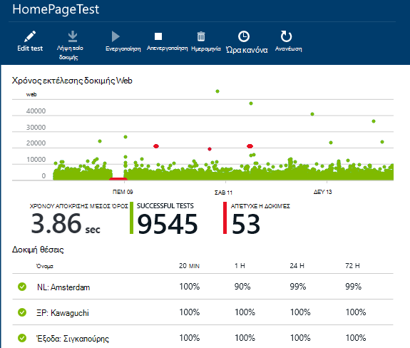
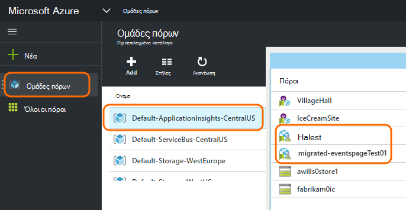
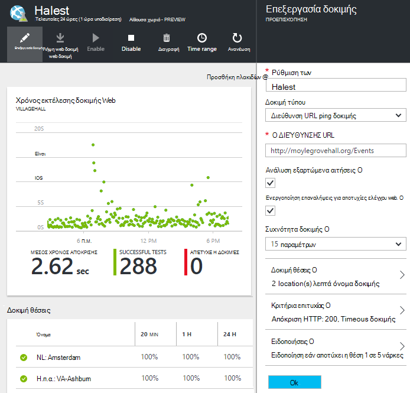

<properties 
    pageTitle="Μετεγκατάσταση Azure τελικού σημείου εφαρμογής ιδέες διαθεσιμότητα δοκιμές" 
    description="Μετεγκατάσταση κλασική δοκιμές Azure τελικού σημείου παρακολούθησης σε εφαρμογή ιδέες διαθεσιμότητα δοκιμών κατά 31 Οκτωβρίου 2016."
    services="application-insights" 
    documentationCenter=""
    authors="soubhagyadash" 
    manager="douge"/>

<tags 
    ms.service="application-insights" 
    ms.workload="tbd" 
    ms.tgt_pltfrm="ibiza" 
    ms.devlang="na" 
    ms.topic="article" 
    ms.date="07/25/2016" 
    ms.author="awills"/>
 
# Μετακίνηση από το Azure τελικού σημείου παρακολούθηση δοκιμές διαθεσιμότητα ιδέες εφαρμογής

Μπορείτε να χρησιμοποιήσετε [το τελικό σημείο παρακολούθησης](https://blogs.msdn.microsoft.com/mast/2013/03/03/windows-azure-portal-update-configure-web-endpoint-status-monitoring-preview/) για τις εφαρμογές του Azure; Από το *31 Οκτωβρίου 2016*, θα σας θα αντικαταστήσει τους με τις νέες και πιο ισχυρή [διαθεσιμότητα δοκιμές](app-insights-monitor-web-app-availability.md). Έχουμε ήδη δημιουργήσει ορισμένες από τις νέες δοκιμές, παρόλο που, είστε απενεργοποιημένες έως 31 Οκτωβρίου 2016. 

Μπορείτε να επεξεργαστείτε τις νέες δοκιμές και να κάνετε το διακόπτη μόνοι σας Εάν θέλετε. Θα βρείτε τους [Azure πύλη](https://portal.azure.com) στην προεπιλεγμένη-ApplicationInsights-CentralUS ομάδα πόρων.

## Τι είναι οι δοκιμές διαθεσιμότητα;

Έλεγχος διαθεσιμότητας είναι μια δυνατότητα του Azure που συνεχώς ελέγχει ότι οποιαδήποτε τοποθεσία web ή υπηρεσία είναι προς τα επάνω και μπορείτε να προχωρήσετε με την αποστολή αιτήσεων HTTP σε αυτό (μία ping δοκιμές ή Visual Studio web δοκιμές) από έως 16 θέσεις σε όλο τον κόσμο. 

Στην [κλασική Azure πύλη](https://manage.windowsazure.com), αυτές οι δοκιμές ονομάζονταν παρακολούθηση τελικού σημείου. Τους πιο έχουν περιορισμένη εμβέλεια. Οι νέες δοκιμές διαθεσιμότητα είναι ένα σημαντικό βελτίωσης:

* Έως και 10 δοκιμές web Visual Studio ή δοκιμές ping ανά πόρο εφαρμογής ιδέες. 
* Έως 16 θέσεις σε όλο τον κόσμο για να στείλετε προσκλήσεις δοκιμής σε εφαρμογή web. Μεγαλύτερο έλεγχο δοκιμής επιτυχίας κριτηρίων. 
* Δοκιμή οποιαδήποτε τοποθεσία web ή υπηρεσία - δεν απλώς Azure web apps.
* Δοκιμή επαναλήψεις: μείωση ειδοποιήσεις ψευδές θετικό λόγω προσωρινά ζητήματα δικτύου. 
* Webhooks να λαμβάνετε ειδοποιήσεις HTTP ΔΗΜΟΣΊΕΥΣΗ για τις ειδοποιήσεις.

Διαβάστε περισσότερα σχετικά με τη [διαθεσιμότητα δοκιμές εδώ](app-insights-monitor-web-app-availability.md).

Διαθεσιμότητα δοκιμές αποτελούν μέρος [Ιδέες εφαρμογή του Visual Studio](app-insights-overview.md), που είναι μια υπηρεσία επεκτάσιμη analytics για οποιαδήποτε εφαρμογή web.

## Επομένως, τι συμβαίνει με το τελικό σημείο δοκιμές;

* Θα σας έχετε αντιγράψει το τελικό σημείο παρακολούθησης ελέγχει τις νέες δοκιμές διαθεσιμότητα ιδέες εφαρμογής.
* Οι νέες δοκιμές διαθεσιμότητα είναι απενεργοποιημένες και τις παλιές δοκιμές τελικού σημείου εξακολουθούν να λειτουργούν.
* Το προειδοποιεί τους κανόνες *δεν* έχουν μετεγκατασταθεί. Οι νέες δοκιμές αρχικά έχουν ρυθμιστεί με έναν προεπιλεγμένο κανόνα:
 * Εναύσματα όταν περισσότερες από 1 θέση των αναφορών αποτυχίες σε 5 λεπτά.
 * Στέλνει μηνύματα ηλεκτρονικού ταχυδρομείου του διαχειριστές τη συνδρομή.

Στην [πύλη του Azure](https://portal.azure.com), μπορείτε να βρείτε τους ελέγχους που μετεγκαταστάθηκαν στην ομάδα πόρων "Προεπιλογή-ApplicationInsights-CentralUS". Τα ονόματα δοκιμής είναι το πρόθεμα "Migrated-". 

## Τι πρέπει να κάνετε;

* Εάν με κάποιον τρόπο παραβλέψει τη μετεγκατάσταση δοκιμές σας, οι νέες δοκιμές διαθεσιμότητα είναι [εύκολο να ρυθμίσετε](app-insights-monitor-web-app-availability.md).

### Επιλογή απάντηση: κάντε τίποτα. Αφήστε το μας.

**Στην ημερομηνία 31 Οκτωβρίου 2016,** θα σας:

* Απενεργοποίηση των παλιών δοκιμών τελικού σημείου.
* Ενεργοποίηση μετεγκαταστάθηκαν δοκιμών διαθεσιμότητα.

### Επιλογή β: Μπορείτε διαχείριση ή/και να ενεργοποιήσετε τους ελέγχους που είναι νέα.

* Αναθεώρηση και επεξεργασία του νέου διαθεσιμότητα δοκιμών στην νέα [πύλη Azure](https://portal.azure.com). 
 * Εξετάστε τα κριτήρια εναυσμάτων
 * Εξετάστε τους παραλήπτες ηλεκτρονικού ταχυδρομείου
* Ενεργοποίηση της νέας δοκιμών
* Θα απενεργοποιήσουμε το παλαιού τύπου τελικό σημείο παρακολούθηση δοκιμές σε 31 Οκτωβρίου 2016 

### Γ: η επιλογή Συμμετοχής ανάληψη

Εάν δεν θέλετε να χρησιμοποιήσετε δοκιμές διαθεσιμότητας, μπορείτε να τα διαγράψετε στην [πύλη Azure](https://portal.azure.com). Υπάρχει επίσης μια σύνδεση κατάργηση στο κάτω μέρος τα μηνύματα ηλεκτρονικού ταχυδρομείου ειδοποίησης.

Θα εξακολουθούν να διαγραφή των παλιών δοκιμών τελικού σημείου 31 Οκτωβρίου 2016. 

## Πώς μπορώ να επεξεργαστώ το νέες δοκιμές;

Συνδεθείτε στην [πύλη του Azure](https://portal.azure.com) και να βρείτε τις δοκιμές web 'Migrated-': 

Επεξεργασία ή/και να ενεργοποιήσετε τον έλεγχο:

## Γιατί συμβαίνει αυτό;

Καλύτερη υπηρεσία. Η παλιά υπηρεσία τελικού σημείου ήταν πολύ πιο στενό. Θα μπορούσατε να παρέχετε δύο μόνο διευθύνσεις URL για τις δοκιμές απλό ping από 3 παν θέσεις στο μια Εικονική Azure ή στο web. Τις νέες δοκιμές να εκτελέσετε δοκιμές πολλών βήμα web από έως και 16 θέσεις και μπορείτε να καθορίσετε έως και 10 δοκιμές για μια εφαρμογή. Μπορείτε να δοκιμάσετε οποιαδήποτε διεύθυνση URL - δεν έχει να είναι μια τοποθεσία του Azure.

Οι νέες δοκιμές έχουν ρυθμιστεί ξεχωριστά από την εφαρμογή web ή Εικονική που που ελέγχετε. 

Θα σας μετεγκατάσταση τις δοκιμές για να βεβαιωθείτε ότι εξακολουθείτε να έχετε τον έλεγχό τους κατά τη χρήση της νέας πύλης. 

## Τι είναι η εφαρμογή ιδέες;

Οι νέες δοκιμές διαθεσιμότητα αποτελούν μέρος της [Visual Studio εφαρμογή ιδέες](app-insights-overview.md). Παρακάτω θα δείτε ένα [βίντεο 2 λεπτών](http://go.microsoft.com/fwlink/?LinkID=733921).

## Πληρώνετε για τις νέες δοκιμές;

Τους ελέγχους που μετεγκαταστάθηκαν έχουν ρυθμιστεί σε έναν πόρο ιδέες εφαρμογή στο προεπιλεγμένο πρόγραμμα δωρεάν. Αυτό σας επιτρέπει τη συλλογή των σημείων δεδομένων έως 5 εκατομμύρια. Που καλύπτει εύκολα την ένταση δεδομένων σας δοκιμών που θα χρησιμοποιήσετε αυτήν τη στιγμή. 

Φυσικά, εάν όπως εφαρμογή ιδέες και δημιουργία περισσότερες δοκιμές διαθεσιμότητα ή υιοθετήσουν περισσότερα από την παρακολούθηση των επιδόσεων και διαγνωστικών δυνατότητες, στη συνέχεια, που θα δημιουργήσει περισσότερες σημεία δεδομένων.  Ωστόσο, το αποτέλεσμα θα είναι μόνο ότι μπορεί να πατήσετε του ορίου για το δωρεάν πρόγραμμα. Δεν θα λαμβάνετε ένα ομόλογο, εκτός εάν επιλέξετε στο για την τυπική ή Premium για τα προγράμματα. 

[Μάθετε περισσότερα σχετικά με τις τιμές εφαρμογή ιδέες και εποπτεία ορίου](app-insights-pricing.md). 

## Τι είναι και δεν είναι η μετεγκατάσταση;

Διατηρούνται από το παλιό δοκιμές τελικού σημείου:

* Διεύθυνση URL τελικού σημείου να ελεγχθεί.
* Από την οποία αποστέλλονται τα αιτήματα θέσεις παν.
* Συχνότητα δοκιμής παραμένει 5 λεπτά.
* Δοκιμή χρονικού ορίου παραμένει 30 δευτερόλεπτα. 

Χωρίς μετεγκατάσταση:

* Έναυσμα ειδοποίησης κανόνα. Ο κανόνας θα σας έχετε ορίσει εναύσματα όταν 1 θέση των αναφορών αποτυχίες σε 5 λεπτά.
* Ειδοποίηση των παραληπτών. Μηνύματα ηλεκτρονικού ταχυδρομείου ειδοποίησης θα αποσταλούν στη συνδρομή κάτοχοι και κατόχους από κοινού. 

## Πώς μπορώ να βρω τις νέες δοκιμές;

Μπορείτε να κάποια από τις νέες δοκιμές επεξεργαστείτε τώρα εάν θέλετε. Είσοδος στην [πύλη του Azure](https://portal.azure.com), ανοίξτε **Τις ομάδες πόρων** και επιλέξτε **Προεπιλογή-ApplicationInsights-CentralUS**. Σε αυτήν την ομάδα, θα βρείτε τις νέες δοκιμές web. [Μάθετε σχετικά με τις νέες δοκιμές διαθεσιμότητα](app-insights-monitor-web-app-availability.md).

Σημειώστε ότι τα νέα μηνύματα ηλεκτρονικού ταχυδρομείου ειδοποίησης θα σταλεί από αυτήν τη διεύθυνση: εφαρμογή ιδέες ειδοποιήσεων(ai-noreply@microsoft.com)

## Τι συμβαίνει εάν να μην κάνετε τίποτα;

Επιλογή A θα εφαρμοστούν. Θα ενεργοποιήσετε τους ελέγχους που μετεγκαταστάθηκαν και, ρυθμίσετε τους προεπιλεγμένους κανόνες ειδοποίησης που προαναφέρθηκαν. Θα πρέπει να προσθέσετε τυχόν προσαρμοσμένες ειδοποίησης κανόνες, οι παραλήπτες που προαναφέρθηκαν. Θα απενεργοποιήσουμε το παλαιού τύπου τελικό σημείο παρακολούθηση δοκιμές. 

## Πού μπορώ να να παρέχετε σχόλια σχετικά με αυτό; 

Εκτιμούμε ιδιαίτερα τα σχόλιά σας. Επικοινωνήστε [ηλεκτρονικού ταχυδρομείου μας](mailto:vsai@microsoft.com). 

