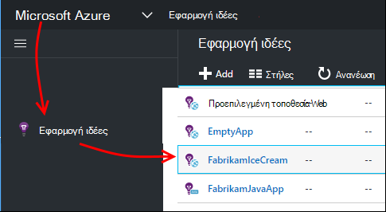

<properties
    pageTitle="Διάγνωση θεμάτων επιδόσεων σε τοποθεσία Web των υπηρεσιών IIS εκτελείται | Microsoft Azure"
    description="Παρακολούθηση των επιδόσεων μιας τοποθεσίας Web χωρίς εκ νέου την ανάπτυξή του. Χρήση του μεμονωμένου ή με εφαρμογή SDK ιδέες για να λάβετε τηλεμετρίας εξάρτηση."
    services="application-insights"
    documentationCenter=".net"
    authors="alancameronwills"
    manager="douge"/>

<tags
    ms.service="application-insights"
    ms.workload="tbd"
    ms.tgt_pltfrm="ibiza"
    ms.devlang="na"
    ms.topic="get-started-article"
    ms.date="10/24/2016"
    ms.author="awills"/>

# Εφαρμογές web Instrument κατά το χρόνο εκτέλεσης με ιδέες εφαρμογής

*Εφαρμογή ιδέες είναι σε προεπισκόπηση.*

Μπορείτε να μέσου μια ζωντανή web app με ιδέες εφαρμογή του Visual Studio, χωρίς να χρειάζεται να τροποποιήσετε ή αναπτύξτε ξανά τον κωδικό. Στις εφαρμογές σας φιλοξενούνται από ένα διακομιστή των υπηρεσιών IIS εσωτερικής εγκατάστασης, μπορείτε να εγκαταστήσετε την οθόνη κατάσταση; ή, αν είστε εφαρμογών Azure web ή εκτελούνται σε μια Εικονική Azure, μπορείτε να εγκαταστήσετε την εφαρμογή ιδέες επέκταση. (Υπάρχουν επίσης ξεχωριστά άρθρα σχετικά με instrumenting [live J2EE εφαρμογών web](app-insights-java-live.md) και [Τις υπηρεσίες Cloud Azure](app-insights-cloudservices.md).)

Μπορείτε να επιλέξετε τρία διαδρομών για να εφαρμόσετε ιδέες εφαρμογής στις εφαρμογές web του .NET:

* **Χρόνος κατασκευής:** [Προσθέστε την εφαρμογή ιδέες SDK] [greenbrown] κώδικα εφαρμογής web. 
* **Χρόνος εκτέλεσης:** Μέσου την εφαρμογή web σας στο διακομιστή, όπως περιγράφεται παρακάτω, χωρίς να φτιάχνετε και επανάληψη ανάπτυξης του κώδικα.
* **Και τα δύο:** Δημιουργία του SDK μέσα στον κώδικα της εφαρμογής web και ισχύουν επίσης οι επεκτάσεις χρόνου εκτέλεσης. Λάβετε τις καλύτερες και τις δύο επιλογές. 

Ακολουθεί μια σύνοψη των λαμβάνετε από κάθε οδό:

||Δημιουργία χρόνου|Χρόνος εκτέλεσης|
|---|---|---|
|Αιτήσεις & εξαιρέσεις|Ναι|Ναι|
|[Πιο λεπτομερείς εξαιρέσεις](app-insights-asp-net-exceptions.md)||Ναι|
|[Διαγνωστικά εξάρτησης](app-insights-asp-net-dependencies.md)|Στο .NET 4.6 +|Ναι|
|[Μετρητές επιδόσεων συστήματος](app-insights-performance-counters.md)||Των υπηρεσιών IIS ή Azure υπηρεσία στο cloud, δεν Azure web app|
|[API για προσαρμοσμένες τηλεμετρίας][api]|Ναι||
|[Ενοποίηση του αρχείου καταγραφής ανίχνευσης](app-insights-asp-net-trace-logs.md)|Ναι||
|[Σελίδα χρήστη & προβολής δεδομένων](app-insights-javascript.md)|Ναι||
|Χωρίς να χρειάζεται να εκ νέου δημιουργία κώδικα|Όχι||

## Μέσου την εφαρμογή web της κατά το χρόνο εκτέλεσης

Χρειάζεστε μια συνδρομή στο [Microsoft Azure](http://azure.com) .

### Εάν η εφαρμογή σας είναι μια εφαρμογή Azure web ή μια υπηρεσία Cloud

* Επιλέξτε εφαρμογή ιδέες στον πίνακα ελέγχου της εφαρμογής στο Azure. 

    [Μάθετε περισσότερα](app-insights-azure.md).

### Εάν την εφαρμογή σας φιλοξενείται σε διακομιστή των υπηρεσιών IIS

1. Στο διακομιστή web των υπηρεσιών IIS, πραγματοποιήστε είσοδο με τα διαπιστευτήρια διαχειριστή.
2. Κάντε λήψη και εκτέλεση του [προγράμματος εγκατάστασης Εποπτεία κατάστασης](http://go.microsoft.com/fwlink/?LinkId=506648).
4. Στον Οδηγό εγκατάστασης, πραγματοποιήστε είσοδο στο Windows Azure.

    

    *Σφαλμάτων σύνδεσης; Ανατρέξτε στο θέμα [Αντιμετώπιση προβλημάτων](#troubleshooting).*

5. Επιλέξτε την εφαρμογή εγκατεστημένων web ή την τοποθεσία Web που θέλετε να παρακολουθήσετε και, στη συνέχεια, ρύθμιση παραμέτρων του πόρου στο οποίο θέλετε να δείτε τα αποτελέσματα στην πύλη εφαρμογής ιδέες.

    

    Κανονικά, επιλέγετε για να ρυθμίσετε ένα νέο πόρο και [ομάδα πόρων][roles].

    Διαφορετικά, χρησιμοποιήστε έναν υπάρχοντα πόρο, εάν έχετε ήδη ρυθμίσει [web ελέγχει] [ availability] για την τοποθεσία ή το [πρόγραμμα-πελάτη web παρακολούθηση][client].

6. Επανεκκίνηση των υπηρεσιών IIS.

    

    Υπηρεσία web θα διακοπεί για λίγο.

6. Παρατηρήστε ότι έχει εισαχθεί ApplicationInsights.config τις εφαρμογές web που θέλετε να παρακολουθήσετε.

    

   Υπάρχουν επίσης ορισμένες αλλαγές στην web.config.

#### Θέλετε να (σχετικά) ρύθμιση παραμέτρων αργότερα;

Μετά την ολοκλήρωση του οδηγού, μπορείτε να ρυθμίσετε εκ νέου τον παράγοντα κάθε φορά που θέλετε. Μπορείτε επίσης να χρησιμοποιήσετε αυτό εάν έχετε εγκαταστήσει τον παράγοντα, αλλά υπήρχε κάποια προβλήματα με την αρχική εγκατάσταση.

## Προβολή επιδόσεων τηλεμετρίας

Πραγματοποιήστε είσοδο στην [πύλη του Azure](https://portal.azure.com), αναζητήστε ιδέες εφαρμογής και ανοίξτε τον πόρο που δημιουργήσατε.

Ανοίξτε το blade απόδοσης για να δείτε την αίτηση, χρόνος απόκρισης, εξάρτηση και άλλα δεδομένα.

Κάντε κλικ σε οποιοδήποτε γράφημα για να ανοίξετε μια πιο λεπτομερή προβολή.

Μπορείτε να κάνετε [να επεξεργαστείτε, να αναδιατάξετε, αποθήκευση](app-insights-metrics-explorer.md), και να καρφιτσώσετε γραφήματα ή το ολόκληρη blade σε έναν [πίνακα εργαλείων](app-insights-dashboards.md).

## Εξαρτήσεις

Το γράφημα διάρκεια εξάρτησης εμφανίζει το χρόνο που λαμβάνει κλήσεις από την εφαρμογή σε εξωτερικά στοιχεία, όπως βάσεις δεδομένων, API ΥΠΌΛΟΙΠΑ, ή χώρο αποθήκευσης αντικειμένων blob του Azure.

Για να χωρίσετε το γράφημα με κλήσεις σε διαφορετική εξαρτήσεις: επεξεργαστείτε το γράφημα, ενεργοποιήστε την επιλογή ομαδοποίησης και, στη συνέχεια, ομαδοποίηση κατά εξάρτηση, τον τύπο εξάρτησης ή εξάρτηση επιδόσεων.

## Μετρητές επιδόσεων 

(Όχι για εφαρμογές Azure web.) Κάντε κλικ στην εντολή διακομιστές την επισκόπηση blade για να δείτε γραφήματα μετρητές επιδόσεων του διακομιστή όπως διάθεση των χώρων και τη μνήμη της CPU.

Εάν έχετε πολλές παρουσίες διακομιστή, που μπορεί να θέλετε να επεξεργαστείτε τα γραφήματα για να ομαδοποιήσετε σύμφωνα με την παρουσία ρόλο.

Μπορείτε επίσης να [αλλάξετε το σύνολο των μετρητών επιδόσεων που αναφέρονται από το SDK](app-insights-configuration-with-applicationinsights-config.md#nuget-package-3). 

## Εξαιρέσεις

Μπορείτε να Διερεύνηση σε συγκεκριμένες εξαιρέσεις (από τις τελευταίες επτά ημέρες) και να λάβετε ίχνη στοίβας και περιβάλλον δεδομένων.

## Δειγματοληψία

Εάν η εφαρμογή σας στέλνει πολλά δεδομένα και χρησιμοποιείτε το SDK ιδέες εφαρμογής για ASP.NET έκδοση 2.0.0-beta3 ή νεότερη έκδοση, η δυνατότητα προσαρμόσιμης δειγματοληψία μπορεί να εφαρμόζει και αποστολή μόνο ποσοστό του τηλεμετρίας σας. [Μάθετε περισσότερα σχετικά με τη δειγματοληψία.](app-insights-sampling.md)

## Αντιμετώπιση προβλημάτων

### Σφαλμάτων σύνδεσης

Πρέπει να το ανοίξετε [ορισμένα εξερχόμενες θύρες](app-insights-ip-addresses.md#outgoing-ports) στο τείχος προστασίας του διακομιστή σας για να επιτρέψετε την οθόνη κατάσταση εργασίας.

### Δεν υπάρχει τηλεμετρίας;

  * Χρησιμοποιήστε την τοποθεσία σας, για να δημιουργήσετε ορισμένα δεδομένα.
  * Περιμένετε μερικά λεπτά για να ενημερώσετε τα δεδομένα άφιξη και, στη συνέχεια, κάντε κλικ στην επιλογή **Ανανέωση**.
  * Άνοιγμα διαγνωστικών αναζήτησης (το πλακίδιο αναζήτησης) για να δείτε επιμέρους συμβάντα. Συμβάντα συχνά είναι ορατές σε διαγνωστικών αναζήτησης μέχρι να εμφανιστεί συγκέντρωση δεδομένων στα γραφήματα.
  * Ανοίξτε την οθόνη κατάσταση και επιλέξτε την εφαρμογή στο αριστερό τμήμα του παραθύρου. Ελέγξτε εάν υπάρχουν τυχόν μηνύματα Διαγνωστικά για αυτήν την εφαρμογή στην ενότητα "Ρύθμιση παραμέτρων ειδοποιήσεων":

  

  * Βεβαιωθείτε ότι το τείχος προστασίας διακομιστή επιτρέπει την εξερχόμενη κυκλοφορία στις θύρες που αναφέρονται παραπάνω.
  * Στο διακομιστή, εάν δείτε ένα μήνυμα σχετικά με "επαρκή δικαιώματα", δοκιμάστε τα εξής:
    * Στη διαχείριση των υπηρεσιών IIS, επιλέξτε το χώρο συγκέντρωσης εφαρμογών, ανοίξτε τις **Ρυθμίσεις για προχωρημένους**και στην περιοχή **Process Model** Σημειώστε την ταυτότητα.
    * Στον πίνακα ελέγχου διαχείρισης υπολογιστή, προσθέστε αυτήν την ταυτότητα στην ομάδα χρηστών εποπτείας επιδόσεων.
  * Εάν έχετε MMA/SCOM εγκατεστημένα στο διακομιστή σας, μπορεί να βρίσκονται σε διένεξη ορισμένες εκδόσεις. Κατάργηση εγκατάστασης SCOM και Εποπτεία κατάστασης και να εγκαταστήσετε ξανά τις πιο πρόσφατες εκδόσεις.
  * Ανατρέξτε στο θέμα [Αντιμετώπιση προβλημάτων][qna].

## Απαιτήσεις συστήματος

Υποστήριξη λειτουργικού Συστήματος για την οθόνη κατάσταση ιδέες εφαρμογής στο διακομιστή:

- Windows Server 2008
- Windows Server 2008 R2
- Windows Server 2012
- Windows server 2012 R2

με την πιο πρόσφατη SP και .NET Framework 4.0 και διαίρεσης 4,5

Στην πλευρά προγράμματος-πελάτη των Windows 7, 8 και 8.1, ξανά με το .NET Framework 4.0 και διαίρεσης 4,5

Υποστήριξη των υπηρεσιών IIS είναι: των υπηρεσιών IIS 7, 7.5, 8, 8.5 (απαιτείται των υπηρεσιών IIS)

## Αυτοματοποίηση με το PowerShell

Μπορείτε να ξεκινήσετε και να διακόψετε την παρακολούθηση με χρήση του PowerShell στο διακομιστή των υπηρεσιών IIS.

Εισαγωγή πρώτα τη λειτουργική μονάδα ιδέες εφαρμογής:

`Import-Module 'C:\Program Files\Microsoft Application Insights\Status Monitor\PowerShell\Microsoft.Diagnostics.Agent.StatusMonitor.PowerShell.dll'`

Μάθετε ποιες εφαρμογές παρακολουθούνται:

`Get-ApplicationInsightsMonitoringStatus [-Name appName]`

* `-Name`(Προαιρετικό) Το όνομα του μια εφαρμογή web.
* Εμφανίζει την εφαρμογή ιδέες παρακολούθηση κατάστασης για κάθε εφαρμογή web (ή την καθορισμένη εφαρμογή) σε αυτόν το διακομιστή των υπηρεσιών IIS.

* Επιστρέφει `ApplicationInsightsApplication` για κάθε εφαρμογή:
 * `SdkState==EnabledAfterDeployment`: Η εφαρμογή παρακολουθείται και έχει τοποθετηθεί αισθητήρας κατά το χρόνο εκτέλεσης, είτε με το εργαλείο Εποπτεία κατάστασης, είτε με `Start-ApplicationInsightsMonitoring`.
 * `SdkState==Disabled`: Η εφαρμογή δεν διαθέτει όργανα για ιδέες εφαρμογής. Αυτό ήταν ποτέ όργανα, είτε παρακολούθησης χρόνου εκτέλεσης απενεργοποιήθηκε με το εργαλείο Εποπτεία κατάστασης ή με `Stop-ApplicationInsightsMonitoring`.
 * `SdkState==EnabledByCodeInstrumentation`: Η εφαρμογή έχει όργανα, προσθέτοντας το SDK στον πηγαίο κώδικα. Δεν είναι δυνατή η ενημέρωση ή διακοπή του SDK.
 * `SdkVersion`Εμφανίζει την έκδοση που χρησιμοποιείται για την παρακολούθηση αυτής της εφαρμογής.
 * `LatestAvailableSdkVersion`Εμφανίζει την έκδοση που είναι διαθέσιμη αυτήν τη στιγμή στη συλλογή NuGet. Για να αναβαθμίσετε την εφαρμογή σε αυτήν την έκδοση, χρησιμοποιήστε `Update-ApplicationInsightsMonitoring`.

`Start-ApplicationInsightsMonitoring -Name appName -InstrumentationKey 00000000-000-000-000-0000000`

* `-Name`Το όνομα της εφαρμογής των υπηρεσιών IIS
* `-InstrumentationKey`Το ikey του πόρου ιδέες εφαρμογής όπου θέλετε τα αποτελέσματα να εμφανίζονται.

* Αυτό το cmdlet επηρεάζει μόνο εφαρμογές που δεν είναι ήδη όργανα - δηλαδή, SdkState == NotInstrumented.

    Το cmdlet δεν επηρεάζει μια εφαρμογή που διαθέτει ήδη όργανα, είτε κατά το χρόνο δημιουργίας, προσθέτοντας το SDK του κώδικα ή κατά το χρόνο εκτέλεσης με μια προηγούμενη της αυτό το cmdlet.

    Την έκδοση SDK που χρησιμοποιείται για την εφαρμογή μέσου είναι η έκδοση που έχει ληφθεί πιο πρόσφατα σε αυτόν το διακομιστή.

    Για να κάνετε λήψη της πιο πρόσφατης έκδοσης, χρησιμοποιήστε ApplicationInsightsVersion ενημερωμένη έκδοση.

* Επιστρέφει `ApplicationInsightsApplication` στην επιτυχία. Εάν αποτύχει, καταγράφει μια ανίχνευση στο stderr.

    
          Name                      : Default Web Site/WebApp1
          InstrumentationKey        : 00000000-0000-0000-0000-000000000000
          ProfilerState             : ApplicationInsights
          SdkState                  : EnabledAfterDeployment
          SdkVersion                : 1.2.1
          LatestAvailableSdkVersion : 1.2.3

`Stop-ApplicationInsightsMonitoring [-Name appName | -All]`

* `-Name`Το όνομα της εφαρμογής των υπηρεσιών IIS
* `-All`Παρακολούθηση όλες οι εφαρμογές σε αυτόν το διακομιστή των υπηρεσιών IIS για την οποία διακοπές`SdkState==EnabledAfterDeployment`

* Παρακολουθεί τις καθορισμένες εφαρμογές και καταργεί οργάνων. Αυτό λειτουργεί μόνο για τις εφαρμογές που έχουν τεθεί όργανα κατά το χρόνο εκτέλεσης χρησιμοποιώντας το εργαλείο που παρακολούθηση κατάστασης ή Έναρξη-ApplicationInsightsApplication. (`SdkState==EnabledAfterDeployment`)

* Επιστρέφει ApplicationInsightsApplication.

`Update-ApplicationInsightsMonitoring -Name appName [-InstrumentationKey "0000000-0000-000-000-0000"`]

* `-Name`: Το όνομα του μια εφαρμογή web στις υπηρεσίες IIS.
* `-InstrumentationKey`(Προαιρετικό). Χρησιμοποιήστε αυτήν την επιλογή για να αλλάξετε τον πόρο στην οποία αποστέλλονται τηλεμετρίας της εφαρμογής.
* Αυτό το cmdlet:
 * Αναβαθμίσεις το επώνυμο στην έκδοση του SDK πιο πρόσφατα κάνει λήψη της εφαρμογής σε αυτόν τον υπολογιστή. (Λειτουργεί μόνο εάν `SdkState==EnabledAfterDeployment`)
 * Εάν παρέχεται ένα κλειδί οργάνων, της καθορισμένης εφαρμογής είναι εκ νέου ρύθμιση παραμέτρων για να στείλετε τηλεμετρίας στον πόρο με συγκεκριμένο αριθμό-κλειδί. (Λειτουργεί εάν `SdkState != Disabled`)

`Update-ApplicationInsightsVersion`

* Στοιχεία λήψης την πιο πρόσφατη SDK ιδέες εφαρμογής στο διακομιστή.

## Επόμενα βήματα

* [Δημιουργία δοκιμές web] [ availability] για να βεβαιωθείτε ότι η τοποθεσία σας παραμένει live.
* [Αναζήτηση συμβάντων και τα αρχεία καταγραφής] [ diagnostic] για να βοηθά στη διάγνωση προβλημάτων.
* [Προσθήκη τηλεμετρίας προγράμματος-πελάτη web] [ usage] για να δείτε εξαιρέσεις από κώδικα ιστοσελίδας και να κάνετε εισαγωγή ανίχνευση κλήσεων.
* [Προσθήκη εφαρμογής SDK ιδέες σας κωδικός υπηρεσίας web] [ greenbrown] έτσι ώστε να μπορείτε να εισαγάγετε ανίχνευση και αρχείο καταγραφής κλήσεων στον κώδικα διακομιστή.

<!--Link references-->

[api]: app-insights-api-custom-events-metrics.md
[availability]: app-insights-monitor-web-app-availability.md
[client]: app-insights-javascript.md
[diagnostic]: app-insights-diagnostic-search.md
[greenbrown]: app-insights-asp-net.md
[qna]: app-insights-troubleshoot-faq.md
[roles]: app-insights-resources-roles-access-control.md
[usage]: app-insights-web-track-usage.md
