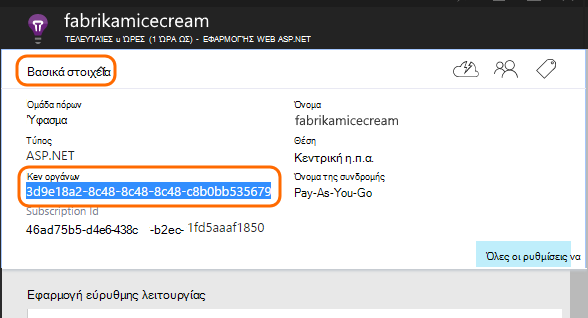

<properties
    pageTitle="Προσθήκη εφαρμογής SDK ιδέες για την παρακολούθηση της εφαρμογής σας Node.js | Microsoft Azure"
    description="Ανάλυση χρήσης, διαθεσιμότητα και την απόδοση της εσωτερικής εγκατάστασης ή την εφαρμογή web Microsoft Azure με εφαρμογή ιδέες σας."
    services="application-insights"
    documentationCenter=""
    authors="alancameronwills"
    manager="douge"/>

<tags
    ms.service="application-insights"
    ms.workload="tbd"
    ms.tgt_pltfrm="ibiza"
    ms.devlang="na"
    ms.topic="get-started-article"
    ms.date="08/30/2016"
    ms.author="awills"/>


# <a name="add-application-insights-sdk-to-monitor-your-nodejs-app"></a>Προσθήκη εφαρμογής SDK ιδέες για την παρακολούθηση της εφαρμογής σας Node.js

*Εφαρμογή ιδέες είναι σε προεπισκόπηση.*

[Visual Studio εφαρμογή ιδέες](app-insights-overview.md) παρακολουθεί την εφαρμογή σας live για να σας βοηθήσουν να [εντοπίσετε και να διάγνωση θεμάτων επιδόσεων και εξαιρέσεις](app-insights-detect-triage-diagnose.md)και [Ανακαλύψτε τον τρόπο χρήσης της εφαρμογής σας](app-insights-overview-usage.md). Αυτό ισχύει για τις εφαρμογές που φιλοξενούνται σε τη δική σας διακομιστών εσωτερικής εγκατάστασης των υπηρεσιών IIS ή στο ΣΠΣ Azure, καθώς και εφαρμογές Azure web.


Το SDK παρέχει αυτόματη συλλογή εισερχόμενες χρεώσεις αίτηση HTTP και τις απαντήσεις, μετρητές επιδόσεων (CPU, μνήμη, RPS) και ανεπίλυτη εξαιρέσεις. Επιπλέον, μπορείτε να προσθέσετε προσαρμοσμένα κλήσεων για να παρακολουθήσετε εξαρτήσεις, μετρική ή άλλα συμβάντα.


#### <a name="before-you-start"></a>Πριν ξεκινήσετε

Χρειάζεσαι:

* Visual Studio 2013 ή νεότερη έκδοση. Αργότερα, είναι καλύτερα.
* Μια συνδρομή στο [Microsoft Azure](http://azure.com). Εάν η ομάδα ή την εταιρεία σας έχει μια συνδρομή του Azure, ο κάτοχος να προσθέσετε που, χρησιμοποιώντας το [λογαριασμό Microsoft που διαθέτετε](http://live.com).

## <a name="add"></a>Δημιουργία ενός πόρου ιδέες εφαρμογής

Είσοδος στην [πύλη του Azure][portal], και να δημιουργήσετε ένα νέο πόρο εφαρμογής ιδέες. Ένας [πόρος] [ roles] στο Azure είναι μια παρουσία μιας υπηρεσίας. Αυτός ο πόρος είναι όπου θα αναλυθεί και καλείστε να λάβετε τηλεμετρίας από την εφαρμογή.


Επιλέξτε άλλο ως ο τύπος της εφαρμογής. Η επιλογή του τύπου εφαρμογή ορίζει το προεπιλεγμένο περιεχόμενο από τις λεπίδες πόρου και τις ιδιότητες ορατό στην [Εξερεύνηση μετρικά][metrics].

#### <a name="copy-the-instrumentation-key"></a>Αντιγράψτε τον αριθμό-κλειδί οργάνων

Το κλειδί προσδιορίζει τον πόρο και θα εγκαταστήσετε το συντομότερο στο SDK για να κατευθύνετε τα δεδομένα στον πόρο.




## <a name="sdk"></a>Εγκατάσταση του SDK στην εφαρμογή σας

```
npm install applicationinsights --save
```

## <a name="usage"></a>Χρήση

Αυτό θα ενεργοποιήσει αίτηση παρακολούθηση, ανεπίλυτη εξαίρεση παρακολούθησης και επιδόσεων του συστήματος παρακολούθησης (μνήμης/CPU/RPS).

```javascript

var appInsights = require("applicationinsights");
appInsights.setup("<instrumentation_key>").start();
```

Το κλειδί οργάνων μπορεί επίσης να οριστεί στη μεταβλητή περιβάλλοντος APPINSIGHTS_INSTRUMENTATIONKEY. Εάν το κάνετε αυτό, απαιτείται κατά την κλήση δεν έχει δοθεί όρισμα `appInsights.setup()` ή `appInsights.getClient()`.

Μπορείτε να δοκιμάσετε το SDK χωρίς να το στείλετε τηλεμετρίας: Ορίστε τον αριθμό-κλειδί οργάνων σε μια μη κενή συμβολοσειρά.


## <a name="run"></a>Εκτελέστε το έργο σας

Εκτελέστε την εφαρμογή και να το δοκιμάσετε: άνοιγμα διαφορετικές σελίδες για να δημιουργήσετε ορισμένες τηλεμετρίας.


## <a name="monitor"></a>Προβολή του τηλεμετρίας

Επιστροφή στην [πύλη του Azure](https://portal.azure.com) και αναζητήστε τον πόρο εφαρμογής ιδέες.


Αναζητήστε τα δεδομένα στη σελίδα Επισκόπηση. Αρχικά, θα δείτε μόνο μία ή δύο σημεία. Για παράδειγμα:


Κάντε κλικ σε οποιοδήποτε γράφημα για να δείτε πιο λεπτομερείς μετρήσεις. [Μάθετε περισσότερα σχετικά με τις μετρήσεις.][perf]

#### <a name="no-data"></a>Δεν υπάρχουν δεδομένα;

* Χρησιμοποιήστε την εφαρμογή, Άνοιγμα διαφορετικές σελίδες, έτσι ώστε να δημιουργεί ορισμένες τηλεμετρίας.
* Ανοίξτε το πλακίδιο [αναζήτησης](app-insights-diagnostic-search.md) , για να δείτε επιμέρους συμβάντα. Ορισμένες φορές χρειάζεται συμβάντα λίγο ενώ περισσότερο χρόνο για να λάβετε μέσω της διοχέτευσης μετρήσεις.
* Περιμένετε μερικά δευτερόλεπτα και κάντε κλικ στην επιλογή **Ανανέωση**. Γραφήματα ανανεωθεί οι ίδιοι περιοδικά, αλλά μπορείτε να ανανεώσετε με μη αυτόματο τρόπο εάν περιμένετε για ορισμένα δεδομένα για να εμφανίζονται.
* Ανατρέξτε στο θέμα [Αντιμετώπιση προβλημάτων][qna].

## <a name="publish-your-app"></a>Δημοσίευση της εφαρμογής σας

Τώρα, ανάπτυξη σας εφαρμογής των υπηρεσιών IIS ή Azure και παρακολουθήστε τα δεδομένα συγκεντρώσουν.


#### <a name="no-data-after-you-publish-to-your-server"></a>Δεν υπάρχουν δεδομένα μετά τη δημοσίευση σε διακομιστή;

Ανοίξτε αυτές τις θύρες για την εξερχόμενη κυκλοφορία του τείχους προστασίας του διακομιστή σας:

+ `dc.services.visualstudio.com:443`
+ `f5.services.visualstudio.com:443`


#### <a name="trouble-on-your-build-server"></a>Αντιμετωπίζετε πρόβλημα στο διακομιστή Δόμηση;

Ανατρέξτε στο θέμα [Αντιμετώπιση προβλημάτων αυτού του στοιχείου](app-insights-asp-net-troubleshoot-no-data.md#NuGetBuild).


## <a name="customized-usage"></a>Χρήση προσαρμοσμένων 

### <a name="disabling-auto-collection"></a>Απενεργοποίηση της αυτόματης συλλογής

```javascript
import appInsights = require("applicationinsights");
appInsights.setup("<instrumentation_key>")
    .setAutoCollectRequests(false)
    .setAutoCollectPerformance(false)
    .setAutoCollectExceptions(false)
    // no telemetry will be sent until .start() is called
    .start();
```

### <a name="custom-monitoring"></a>Παρακολούθηση προσαρμοσμένων

```javascript
import appInsights = require("applicationinsights");
var client = appInsights.getClient();

client.trackEvent("custom event", {customProperty: "custom property value"});
client.trackException(new Error("handled exceptions can be logged with this method"));
client.trackMetric("custom metric", 3);
client.trackTrace("trace message");
```

[Μάθετε περισσότερα σχετικά με το API τηλεμετρίας](app-insights-api-custom-events-metrics.md).

### <a name="using-multiple-instrumentation-keys"></a>Χρήση πολλών πλήκτρων οργάνων

```javascript
import appInsights = require("applicationinsights");

// configure auto-collection with one instrumentation key
appInsights.setup("<instrumentation_key>").start();

// get a client for another instrumentation key
var otherClient = appInsights.getClient("<other_instrumentation_key>");
otherClient.trackEvent("custom event");
```

## <a name="examples"></a>Παραδείγματα

### <a name="tracking-dependency"></a>Παρακολούθηση εξάρτησης

```javascript
import appInsights = require("applicationinsights");
var client = appInsights.getClient();

var startTime = Date.now();
// execute dependency call
var endTime = Date.now();

var elapsedTime = endTime - startTime;
var success = true;
client.trackDependency("dependency name", "command name", elapsedTime, success);
```


### <a name="manual-request-tracking-of-all-get-requests"></a>Μη αυτόματη αίτηση παρακολούθηση όλων των αιτήσεων "ΛΉΨΗ"

```javascript
var http = require("http");
var appInsights = require("applicationinsights");
appInsights.setup("<instrumentation_key>")
    .setAutoCollectRequests(false) // disable auto-collection of requests for this example
    .start();

// assign common properties to all telemetry sent from the default client
appInsights.client.commonProperties = {
    environment: process.env.SOME_ENV_VARIABLE
};

// track a system startup event
appInsights.client.trackEvent("server start");

// create server
var port = process.env.port || 1337
var server = http.createServer(function (req, res) {
    // track all "GET" requests
    if(req.method === "GET") {
        appInsights.client.trackRequest(req, res);
    }

    res.writeHead(200, { "Content-Type": "text/plain" });
    res.end("Hello World\n");
}).listen(port);

// track startup time of the server as a custom metric
var start = +new Date;
server.on("listening", () => {
    var end = +new Date;
    var duration = end - start;
    appInsights.client.trackMetric("StartupTime", duration);
});
```

## <a name="next-steps"></a>Επόμενα βήματα

* [Παρακολούθηση σας τηλεμετρίας στην πύλη](app-insights-dashboards.md)
* [Γράψτε ανάλυσης ερωτήματα πάνω από το τηλεμετρίας](app-insights-analytics-tour.md)


<!--Link references-->

[knowUsers]: app-insights-overview-usage.md
[metrics]: app-insights-metrics-explorer.md
[perf]: app-insights-web-monitor-performance.md
[portal]: http://portal.azure.com/
[qna]: app-insights-troubleshoot-faq.md
[roles]: app-insights-resources-roles-access-control.md
