<properties
    pageTitle="Ανάλυση χρήσης με ιδέες εφαρμογής"
    description="Επισκόπηση των αναλυτικών στοιχείων χρήσης με ιδέες εφαρμογής"
    services="application-insights"
    documentationCenter=""
    authors="alancameronwills"
    manager="douge"/>

<tags
    ms.service="application-insights"
    ms.workload="tbd"
    ms.tgt_pltfrm="ibiza"
    ms.devlang="multiple"
    ms.topic="article" 
    ms.date="04/08/2016"
    ms.author="awills"/>

# Ανάλυση χρήσης με ιδέες εφαρμογής

Γνωρίζετε πώς άτομα χρησιμοποιήσετε την εφαρμογή σας σάς επιτρέπει να εστιάσετε την εργασία σας ανάπτυξης τα σενάρια που είναι πιο σημαντικές για τους, και να αποκτήσει ιδέες σε τους στόχους που ότι τη βρίσκουν ευκολότερο ή δυσκολότερο να επιτύχετε.

Εφαρμογή ιδέες μπορούν να παρέχουν μια προβολή απαλοιφή της χρήσης της εφαρμογής σας, βοηθώντας σας να βελτιώσετε την εμπειρία των χρηστών σας και επιτύχετε τους στόχους σας επιχειρήσεις.

Εφαρμογή ιδέες λειτουργεί για τις δύο αυτόνομη εφαρμογές (στο iOS, Android και Windows) και για τις εφαρμογές web (φιλοξενούνται στο .NET ή J2EE). 

## Προσθήκη εφαρμογής ιδέες στο έργο σας

Για να ξεκινήσετε, λάβετε ένα δωρεάν λογαριασμό με το [Windows Azure](https://azure.com). (Ύστερα από την περίοδο, μπορείτε να συνεχίσετε με τη δωρεάν σειρά της υπηρεσίας.)

Στην [πύλη του Azure](https://portal.azure.com), δημιουργήστε έναν πόρο εφαρμογής ιδέες. Αυτό είναι όπου θα βλέπετε δεδομένα χρήσης και επιδόσεων σχετικά με την εφαρμογή σας.

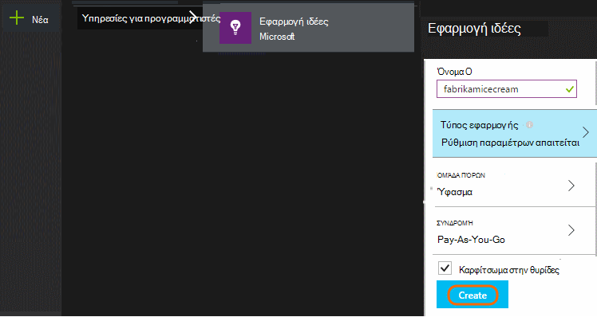

**Εάν η εφαρμογή σας είναι μια εφαρμογή για τη συσκευή,** προσθέστε SDK ιδέες για την εφαρμογή στο έργο σας. Η ακριβής διαδικασία διαφέρει ανάλογα με την [πλατφόρμα και IDE](app-insights-platforms.md). Για τις εφαρμογές των Windows, απλώς κάντε δεξί κλικ στο έργο στο Visual Studio και οι οποίες επιλέξτε "Προσθήκη εφαρμογής ιδέες."

**Εάν πρόκειται για μια εφαρμογή web,** Ανοίξτε το blade γρήγορης εκκίνησης και λάβετε το τμήμα κώδικα για να προσθέσετε στις ιστοσελίδες σας. Δημοσιεύστε ξανά τους με αυτό τμήματος κώδικα.

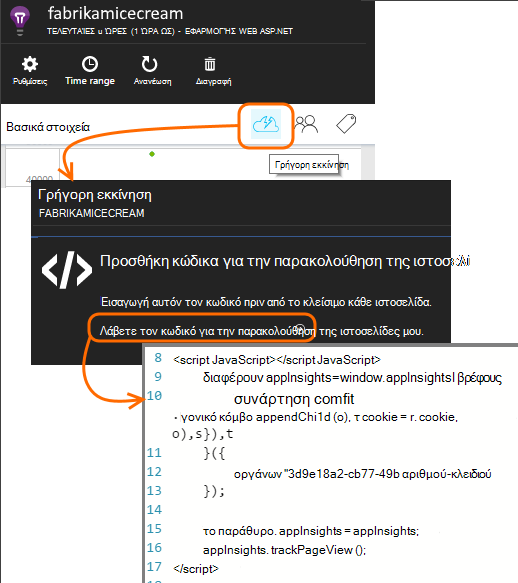

Μπορείτε επίσης να προσθέσετε την εφαρμογή ιδέες κώδικα διακομιστή [ASP.NET](app-insights-asp-net.md) ή [J2EE](app-insights-java-get-started.md) έτσι ώστε να συνδυάσετε τηλεμετρίας από το πρόγραμμα-πελάτη και διακομιστή.

### Εκτελέστε το έργο σας και δείτε πρώτα αποτελέσματα

Εκτέλεση του έργου σας σε κατάσταση εντοπισμού σφαλμάτων για λίγα λεπτά, και, στη συνέχεια, μεταβείτε στην [πύλη του Azure](https://portal.azure.com) και αναζητήστε τον πόρο έργου στο ιδέες εφαρμογής.

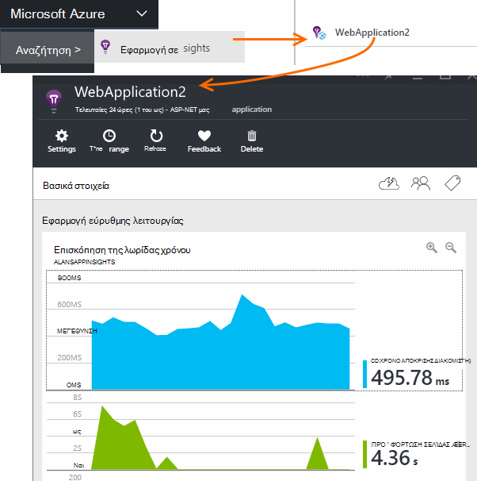

Δημοσιεύστε την εφαρμογή σας για να λάβετε περισσότερες τηλεμετρίας και να μάθετε τι κάνουν οι χρήστες σας με την εφαρμογή σας.

## Αναλυτικά στοιχεία από το πλαίσιο

Κάντε κλικ στο πλακίδιο προβολές σελίδας για να δείτε λεπτομέρειες χρήσης.

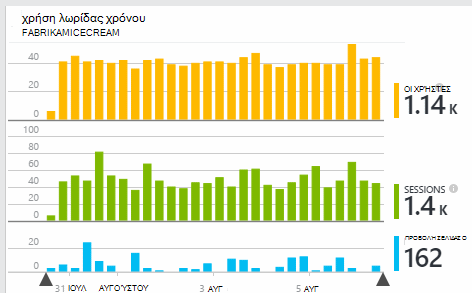

Τοποθετήστε το δείκτη στο κενό τμήμα επάνω από ένα γράφημα για να δείτε τις μετρήσεις σε ένα συγκεκριμένο σημείο. Διαφορετικά, οι αριθμοί δείχνουν την τιμή συναθροιστεί κατά την περίοδο, όπως το μέσο όρο, ένα σύνολο ή μια καταμέτρηση του διακριτές χρήστες κατά την περίοδο.

Στις εφαρμογές web, οι χρήστες υπολογίζονται με τη χρήση cookies. Ένα άτομο που χρησιμοποιεί πολλά προγράμματα περιήγησης, καταργεί τα cookies, ή τη δυνατότητα προστασίας προσωπικών δεδομένων θα καταμετρηθούν πολλές φορές.

Μια περίοδο λειτουργίας web συνυπολογίζεται έπειτα από 30 λεπτά αδράνειας. Μια περίοδο λειτουργίας σε τηλέφωνο ή άλλη συσκευή συνυπολογίζεται όταν η εφαρμογή τίθεται σε αναστολή για περισσότερα από μερικά δευτερόλεπτα.

Κάντε κλικ σε οποιοδήποτε γράφημα για να δείτε περισσότερες λεπτομέρειες. Για παράδειγμα:

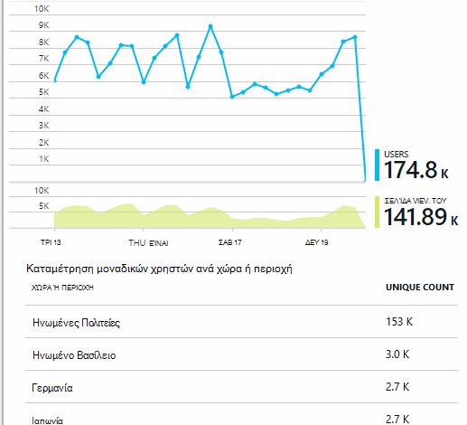

(Αυτό το παράδειγμα είναι από μια τοποθεσία Web, αλλά τα γραφήματα είναι παρόμοιο για τις εφαρμογές που εκτελούνται σε συσκευές.)

Σύγκριση με την προηγούμενη εβδομάδα για να δείτε αν αλλάζετε πράγματα:

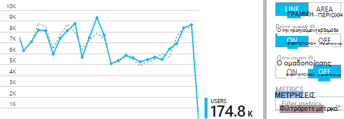

Σύγκριση δύο μετρήσεις, για παράδειγμα, οι χρήστες και τους νέους χρήστες:

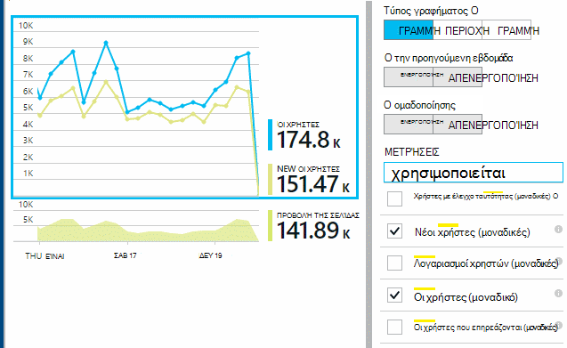

Ομάδα (τμήμα) δεδομένων από μια ιδιότητα όπως το πρόγραμμα περιήγησης, το λειτουργικό σύστημα ή πόλη:

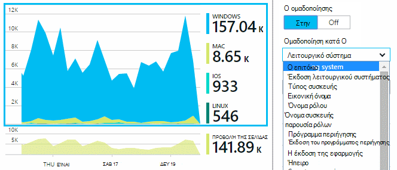

## Χρήση της σελίδας

Κάντε κλικ στην επιλογή πλακιδίου τις προβολές σελίδας για να λάβετε μια ανάλυση των σελίδων σας πιο δημοφιλή:

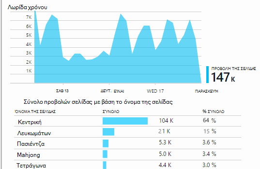

Το παραπάνω παράδειγμα είναι από μια τοποθεσία Web αγώνων. Από αυτό θα σας στη στιγμή να δείτε:

* Χρήση δεν έχει βελτιωθεί την προηγούμενη εβδομάδα. Μήπως θα σας θα πρέπει να σκεφτείτε βελτιστοποίηση μηχανισμού αναζήτησης;
* Πολλά άτομα λιγότερες δείτε τις σελίδες αγώνων από την αρχική σελίδα. Γιατί δεν μας αρχική σελίδα προσελκύσετε άτομα για την αναπαραγωγή αγώνων;
* 'Λευκωμάτων' είναι τα πιο δημοφιλή παιχνίδι. Θα σας θα πρέπει να δίνουν προτεραιότητα με νέες ιδέες και βελτιώσεις εκεί.

## Προσαρμοσμένη παρακολούθησης

Ας υποθέσουμε ότι αντί για εφαρμογή κάθε παιχνίδι σε ξεχωριστή σελίδα web, για να refactor όλες στην ίδια εφαρμογή μίας σελίδας, με το μεγαλύτερο μέρος της λειτουργικότητας κώδικα ως Javascript σε μια ιστοσελίδα. Αυτό σας επιτρέπει στο χρήστη να μεταβαίνετε γρήγορα ένα παιχνίδι και ένα άλλο ή ακόμα και έχετε πολλές αγώνων σε μία σελίδα.

Αλλά εξακολουθείτε να θέλετε ιδέες της εφαρμογής για να συνδεθείτε του αριθμού των φορών κάθε παιχνίδι ανοίξει, στο ακριβώς τον ίδιο τρόπο όπως όταν βρίσκονταν σε ξεχωριστές σελίδες web. Που είναι εύκολο: εισαγωγή απλώς μια κλήση στη λειτουργική μονάδα τηλεμετρίας σε σας JavaScript όπου θέλετε να εγγραφή που έχει ανοίξει ένα νέο "σελίδα":

    telemetryClient.trackPageView(game.Name);

## Προσαρμοσμένα συμβάντα

Μπορείτε να χρησιμοποιήσετε τηλεμετρίας με πολλούς τρόπους για να κατανοήσετε πώς χρησιμοποιείται η εφαρμογή σας. Αλλά πάντα δεν θέλετε να συνδυάσετε τα μηνύματα με προβολές σελίδας. Εναλλακτικά, χρησιμοποιήστε προσαρμοσμένα συμβάντα. Μπορείτε να τους στείλετε από εφαρμογές συσκευής, σελίδες web ή σε διακομιστή web:

(JavaScript)

    telemetryClient.trackEvent("GameEnd");

(C#)

    var tc = new Microsoft.ApplicationInsights.TelemetryClient();
    tc.TrackEvent("GameEnd");

(VB)

    Dim tc = New Microsoft.ApplicationInsights.TelemetryClient()
    tc.TrackEvent("GameEnd")

Τα πιο συχνά προσαρμοσμένα συμβάντα, παρατίθενται στη το blade Επισκόπηση.

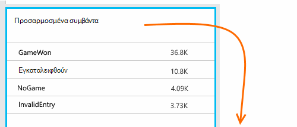

Κάντε κλικ στην κεφαλίδα του πίνακα για να δείτε το συνολικό αριθμό συμβάντα. Μπορείτε να χωρίσετε το γράφημα με διάφορα χαρακτηριστικά, όπως το όνομα του συμβάντος:

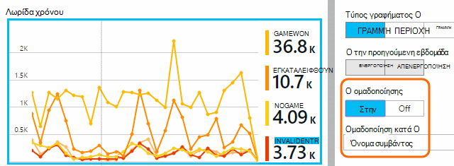

Η ιδιαίτερα χρήσιμη δυνατότητα λωρίδων χρόνου είναι ότι μπορείτε να συσχετίσετε αλλαγές με άλλα συμβάντα και μετρήσεις. Για παράδειγμα, ορισμένες φορές όταν αναπαράγονται περισσότερες αγώνων, που θα περιμένατε για να δείτε μια αύξηση που εγκαταλείφθηκαν αγώνων καθώς και. Αλλά την αύξηση που εγκαταλείφθηκαν αγώνων είναι δυσανάλογη, θα θέλετε να μάθετε εάν η φόρτωση υψηλή προκαλεί προβλήματα που τους χρήστες να βρουν αποδεκτή.

## Διερεύνηση σε συγκεκριμένα συμβάντα

Για να λάβετε μια καλύτερη κατανόηση των πώς μεταφερθείτε τυπικές περιόδου λειτουργίας, ενδέχεται να θέλετε στην εστίαση σε μια περίοδο λειτουργίας συγκεκριμένο χρήστη που περιέχει έναν συγκεκριμένο τύπο συμβάντος.

Σε αυτό το παράδειγμα, θα σας κωδικοποιημένο ένα προσαρμοσμένο συμβάν "NoGame" που ονομάζεται εάν ο χρήστης που πραγματοποιεί χωρίς στην πραγματικότητα Έναρξη ένα παιχνίδι. Γιατί μπορεί ένας χρήστης κάτι τέτοιο; Μήπως εάν θα σας εμβάθυνση σε κάποιες συγκεκριμένες εμφανίσεις, θα σας θα εμφανιστεί μια ιδέα.

Τα προσαρμοσμένα συμβάντα που λάβατε από την εφαρμογή παρατίθενται κατά όνομα στην το blade επισκόπηση:

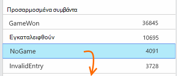

Κάντε κλικ στην επιλογή έως το συμβάν που σας ενδιαφέρουν και επιλέξτε μια πρόσφατη συγκεκριμένη εμφάνιση:

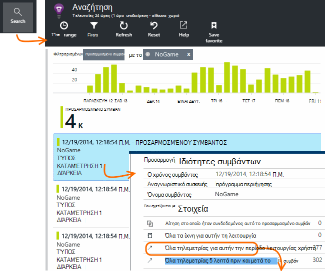

Ας δούμε όλα τα τηλεμετρίας για την περίοδο λειτουργίας στην οποία προέκυψε αυτό το συγκεκριμένο συμβάν NoGame.

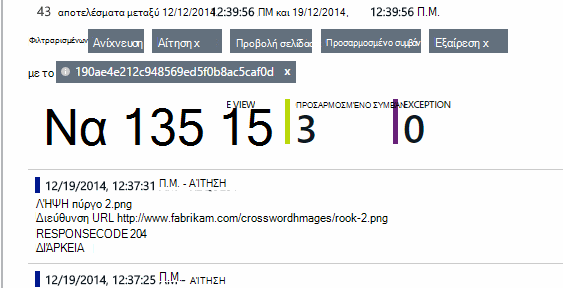

Δεν υπήρχαν χωρίς εξαιρέσεις, ώστε ο χρήστης δεν μπορούν να γίνεται αναπαραγωγή από ορισμένες αποτυχία.

Θα σας να φιλτράρετε όλους τους τύπους τηλεμετρίας εκτός από τις προβολές σελίδας για αυτήν την περίοδο λειτουργίας:

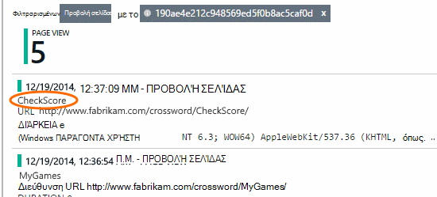

Και τώρα μπορούμε να δούμε ότι αυτός ο χρήστης συνδεθεί απλώς για να ελέγξετε τις πιο πρόσφατες βαθμολογίες. Μήπως θα σας πρέπει να λάβετε υπόψη ανάπτυξη ενός κειμένου χρήστη που σας διευκολύνει να το κάνετε. (Και θα σας θα πρέπει να υλοποιήσετε ένα προσαρμοσμένο συμβάν αναφορά όταν εμφανίζεται αυτό το άρθρο.)

## Φιλτράρισμα, αναζήτηση και τα δεδομένα σας με τις ιδιότητες του τμήματος
Μπορείτε να επισυνάψετε αυθαίρετο ετικετών και αριθμητικές τιμές σε συμβάντα.

JavaScript στο πρόγραμμα-πελάτη

    appInsights.trackEvent("WinGame",
        // String properties:
        {Game: currentGame.name, Difficulty: currentGame.difficulty},
        // Numeric measurements:
        {Score: currentGame.score, Opponents: currentGame.opponentCount}
    );

C# στο διακομιστή

    // Set up some properties:
    var properties = new Dictionary <string, string>
        {{"game", currentGame.Name}, {"difficulty", currentGame.Difficulty}};
    var measurements = new Dictionary <string, double>
        {{"Score", currentGame.Score}, {"Opponents", currentGame.OpponentCount}};

    // Send the event:
    telemetry.TrackEvent("WinGame", properties, measurements);

VB στο διακομιστή

    ' Set up some properties:
    Dim properties = New Dictionary (Of String, String)
    properties.Add("game", currentGame.Name)
    properties.Add("difficulty", currentGame.Difficulty)

    Dim measurements = New Dictionary (Of String, Double)
    measurements.Add("Score", currentGame.Score)
    measurements.Add("Opponents", currentGame.OpponentCount)

    ' Send the event:
    telemetry.TrackEvent("WinGame", properties, measurements)

Επισύναψη ιδιοτήτων προβολές σελίδας με τον ίδιο τρόπο:

JavaScript στο πρόγραμμα-πελάτη

    appInsights.trackPageView("Win",
        {Game: currentGame.Name},
        {Score: currentGame.Score});

Στο πλαίσιο Αναζήτηση διαγνωστικών, προβάλετε τις ιδιότητες, κάνοντας κλικ σε ένα μεμονωμένο εμφάνιση ενός συμβάντος.

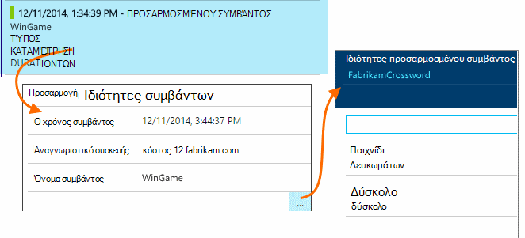

Χρησιμοποιήστε το πεδίο αναζήτησης για να δείτε συμβάν εμφανίσεις με μια συγκεκριμένη ιδιότητα τιμή.

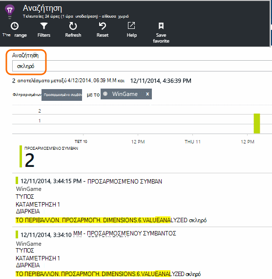

## A | Δοκιμές B

Εάν δεν γνωρίζετε ποια μεταβλητή μιας δυνατότητας θα είναι πιο επιτυχημένη, αφήστε και τα δύο από αυτά, καθιστώντας κάθε προσβάσιμα σε διαφορετικούς χρήστες. Μετρήστε την επιτυχία κάθε και, στη συνέχεια, μετακινήστε μια ενοποιημένη έκδοση.

Για αυτήν την τεχνική, μπορείτε να επισυνάψετε διακριτές ετικέτες σε όλα τα τηλεμετρίας που αποστέλλεται από κάθε έκδοση της εφαρμογής. Μπορείτε να το κάνετε ορίζοντας ιδιότητες στα το ενεργό TelemetryContext. Αυτές οι προεπιλεγμένες ιδιότητες προστίθεται σε κάθε τηλεμετρίας μήνυμα που στέλνει την εφαρμογή - όχι μόνο προσαρμοσμένες τα μηνύματά σας, αλλά καθώς και την τυπική τηλεμετρίας.

Στην πύλη του εφαρμογή ιδέες, στη συνέχεια, θα μπορείτε να φιλτράρισμα και ομαδοποίηση (τμήμα) τα δεδομένα σας σε τις ετικέτες, έτσι ώστε να συγκρίνετε τις διαφορετικές εκδόσεις.

C# στο διακομιστή

    using Microsoft.ApplicationInsights.DataContracts;

    var context = new TelemetryContext();
    context.Properties["Game"] = currentGame.Name;
    var telemetry = new TelemetryClient(context);
    // Now all telemetry will automatically be sent with the context property:
    telemetry.TrackEvent("WinGame");

VB στο διακομιστή

    Dim context = New TelemetryContext
    context.Properties("Game") = currentGame.Name
    Dim telemetry = New TelemetryClient(context)
    ' Now all telemetry will automatically be sent with the context property:
    telemetry.TrackEvent("WinGame")

Μεμονωμένα τηλεμετρίας να παρακάμψετε τις προεπιλεγμένες τιμές.

Μπορείτε να ρυθμίσετε μια καθολική προετοιμασία, έτσι ώστε όλα τα νέα TelemetryClients χρησιμοποιεί αυτόματα το περιβάλλον σας.

    // Telemetry initializer class
    public class MyTelemetryInitializer : ITelemetryInitializer
    {
        public void Initialize (ITelemetry telemetry)
        {
            telemetry.Properties["AppVersion"] = "v2.1";
        }
    }

Στο την προετοιμασία εφαρμογής όπως Global.asax.cs:

    protected void Application_Start()
    {
        // ...
        TelemetryConfiguration.Active.TelemetryInitializers
        .Add(new MyTelemetryInitializer());
    }

## Δόμηση - μέτρηση - μάθετε

Όταν χρησιμοποιείτε ανάλυση, γίνεται μια ενσωματωμένη τμήμα του κύκλου ανάπτυξης - απλώς δεν κάτι πιστεύετε ότι πρόκειται να βοηθήσετε στην επίλυση προβλημάτων. Ακολουθούν ορισμένες συμβουλές:

* Προσδιορίστε το πλήκτρο μετρικό της εφαρμογής σας. Θέλετε οι χρήστες όσο το δυνατόν περισσότερες όσο το δυνατόν ή προτιμούσατε ένα μικρό σύνολο πολύ Χαρούμενο χρήστες; Θέλετε να μεγιστοποιήσετε επισκέψεις ή πωλήσεων;
* Σχεδιασμός για τη μέτρηση κάθε αλυσίδα. Όταν σκιτσάρισμα ενός νέου κειμένου χρήστη ή τη δυνατότητα ή σχέδιο για να ενημερώσετε ένα υπάρχον, πάντα σκεφτείτε πώς θα μπορείτε να μετρήσετε την επιτυχία της αλλαγής. Πριν από την κωδικοποίηση ξεκινά, ρωτήστε "το αποτέλεσμα που θα έχει αυτή για μετρικά μας, εάν λειτουργεί; Πρέπει να σας παρακολουθεί οποιαδήποτε νέα συμβάντα;"
Και φυσικά, όταν η δυνατότητα είναι live, βεβαιωθείτε ότι έχετε εξετάστε την ανάλυση και ενεργούν τα αποτελέσματα.
* Συσχέτιση άλλα μετρικά με τη μέτρηση κλειδιού. Για παράδειγμα, εάν προσθέσετε μια δυνατότητα ομάδας "Αγαπημένα", που θα θέλατε να γνωρίζετε πόσο συχνά οι χρήστες προσθέτουν "Αγαπημένα". Αλλά ίσως είναι περισσότερα ενδιαφέρον για να μάθετε πόσο συχνά προκύπτουν ξανά τους "Αγαπημένα". Και, σημαντικότερο οι πελάτες που χρησιμοποιούν Αγαπημένα τελικά αγοράζουν περισσότερα του προϊόντος σας;
* Καναρίους δοκιμές. Ρύθμιση του διακόπτη δυνατότητα που σας επιτρέπει να κάνετε μια νέα δυνατότητα ορατό μόνο σε ορισμένα χρήστες. Χρησιμοποιήστε ιδέες εφαρμογής για να δείτε αν η νέα δυνατότητα που χρησιμοποιείται με τον τρόπο που προτεινόμενα. Κάντε προσαρμογές και, στη συνέχεια, αφήστε το ευρύ κοινό.
* Μιλήστε στους χρήστες σας! Ανάλυση δεν είναι αρκετά σε τα δικά της, αλλά συμπληρωματικής για τη διατήρηση σχέσης καλή πελάτη.

## Μάθε περισσότερα

* [Εντοπισμός, διαλογής και διάγνωση παρουσιάσει σφάλμα και θέματα απόδοσης στην εφαρμογή](app-insights-detect-triage-diagnose.md)
* [Γρήγορα αποτελέσματα με την εφαρμογή ιδέες σε πολλές πλατφόρμες](app-insights-detect-triage-diagnose.md)

## Βίντεο

> [AZURE.VIDEO usage-monitoring-application-insights]

 
