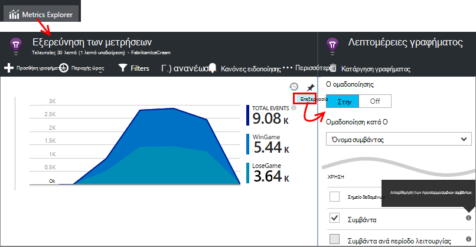
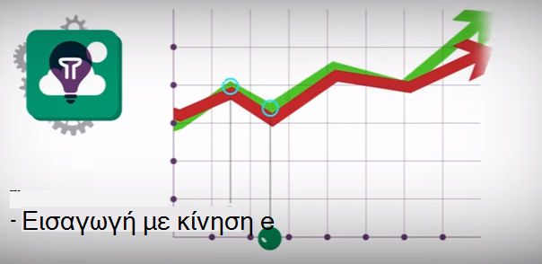

<properties 
    pageTitle="Πρόγραμμα εκμάθησης ιδέες εφαρμογή | Microsoft Azure" 
    description="Παρακολούθηση χρήσης και απόδοση της εφαρμογής σας ζωντανής τοποθεσία web.  Εντοπισμός, διαλογής και διάγνωση προβλημάτων. Συνεχώς παρακολουθείτε και να βελτιώσετε την επιτυχία με τους χρήστες σας." 
    services="application-insights" 
    documentationCenter=""
    authors="alancameronwills" 
    manager="douge"/>

<tags 
    ms.service="application-insights" 
    ms.workload="tbd" 
    ms.tgt_pltfrm="ibiza" 
    ms.devlang="na" 
    ms.topic="article" 
    ms.date="10/15/2016" 
    ms.author="awills"/>
 
# Εφαρμογή ιδέες - εισαγωγή

Visual Studio εφαρμογή ιδέες είναι μια υπηρεσία επεκτάσιμη ανάλυσης που παρακολουθεί την εφαρμογή ζωντανής τοποθεσία web σας. Με το μπορείτε να εντοπίσετε και να διάγνωση θεμάτων επιδόσεων και να κατανοήσετε τι χρήστες πραγματικά να κάνετε με την εφαρμογή σας. Έχει σχεδιαστεί για τους προγραμματιστές, θα σας βοηθήσουν να βελτιώνουμε συνεχώς επιδόσεων και χρηστικότητας. Λειτουργεί για τις εφαρμογές σε μια μεγάλη ποικιλία πλατφόρμες όπως .NET, Node.js και J2EE, φιλοξενούνται στην εσωτερική εγκατάσταση είτε στο cloud. 

[Ανατρέξτε στο θέμα Εισαγωγή κίνησης](https://www.youtube.com/watch?v=fX2NtGrh-Y0).

## Πώς λειτουργεί αυτό;

Εγκατάσταση ενός πακέτου μικρές οργάνων στην εφαρμογή σας και ρύθμιση ένας πόρος ιδέες εφαρμογής στην πύλη του Microsoft Azure. Το οργάνων παρακολουθεί την εφαρμογή σας και σας αποστέλλει δεδομένα τηλεμετρίας για την πύλη. Πύλη του παρουσιάζονται στατιστικών γραφημάτων και παρέχει εργαλεία ισχυρή αναζήτησης για να σας βοηθήσει να διάγνωση τυχόν προβλήματα.

Εφαρμογή ιδέες έχει πολλές [Τυπική οργάνων λειτουργικές μονάδες](app-insights-configuration-with-applicationinsights-config.md) που συλλέγει διάφορους τύπους τηλεμετρίας όπως χρόνους απόκρισης αίτηση, εξαιρέσεις και εξάρτησης κλήσεις. Μπορείτε επίσης να [γράψετε κώδικα για την αποστολή προσαρμοσμένων τηλεμετρίας](app-insights-api-custom-events-metrics.md) στην πύλη του.

### Ποια είναι τα έξοδα;

Οι επιπτώσεις στην απόδοση της εφαρμογής σας είναι πολύ μικρό. Παρακολούθηση κλήσεων είναι μη αποκλεισμού, και είναι μαζικής και αποστέλλονται σε ένα ξεχωριστό νήμα. 

## Τι κάνει αυτό;

Εφαρμογή ιδέες είναι με στόχο τη την ομάδα ανάπτυξης, για να σας βοηθήσει να κατανοήσετε πώς αποδίδει την εφαρμογή και τον τρόπο που θα χρησιμοποιηθεί. Παρέχει:

Τύποι τηλεμετρίας:

* Χρεώσεις αίτηση HTTP, χρόνους απόκρισης, συντελεστές επιτυχίας.
* Εξάρτηση (HTTP & SQL) κλήση χρεώσεων, χρόνους απόκρισης, συντελεστές επιτυχίας.
* Ίχνη εξαίρεση από το διακομιστή και προγράμματος-πελάτη.
* Αρχείο καταγραφής διαγνωστικών ανιχνεύσεις.
* Προβολή σελίδας καταμετρά, μετρήσεις χρήστη και την περίοδο λειτουργίας, τους χρόνους φόρτωσης προγράμματος περιήγησης, εξαιρέσεις.
* Χρεώσεις κλήση AJAX, χρόνους απόκρισης και συντελεστές επιτυχίας.
* Μετρητές επιδόσεων του διακομιστή.
* Προσαρμοσμένη τηλεμετρίας προγράμματος-πελάτη και διακομιστή.
* Αγοράς κατά θέση προγράμματος-πελάτη, έκδοση του προγράμματος περιήγησης, έκδοση λειτουργικού Συστήματος, παρουσία διακομιστή, προσαρμοσμένες διαστάσεις και πολλά άλλα.
* Διαθεσιμότητα δοκιμές

Εργαλεία διαγνωστικών και ανάλυσης:

* Έξυπνη και μη αυτόματες ειδοποιήσεις στην αποτυχία χρεώσεις και άλλες μετρήσεις και σχετικά με τη διαθεσιμότητα.
* Γραφήματα μέσα στο χρόνο συγκεντρωτική μετρικών.
* Κλήσεις διαγνωστικών αναζήτησης σε παρουσίες των αιτήσεων, εξαιρέσεις, προσαρμοσμένα συμβάντα, ανιχνεύσεις καταγραφής, προβολές σελίδας, εξάρτηση και AJAX. 
* Ανάλυση - μια γλώσσα ερωτημάτων ισχυρή πάνω από το τηλεμετρίας
* Πίνακες εργαλείων - σύνθεση τα γραφήματα που πρέπει να παρακολουθείτε όλα τα στοιχεία της εφαρμογής σας.

## Πώς μπορώ να τα χρησιμοποιήσω;

### Οθόνη

Εγκατάσταση εφαρμογής ιδέες στην εφαρμογή web, ρύθμιση δοκιμές web διαθεσιμότητα, και:

* Ρύθμιση του πίνακα εργαλείων για το κανάλι σας ομάδας για να παρακολουθείτε φόρτωσης, ανταπόκριση και την απόδοση των εξαρτήσεων, φορτώσεις σελίδων και AJAX κλήσεις. 
* Ανακαλύψτε ποια είναι η πιο αργές και περισσότερες αιτήσεις παρουσιάζει σφάλμα.
* Παρακολουθήστε ζωντανή ροή όταν αναπτύξετε μια νέα έκδοση, πρέπει να γνωρίζετε αμέσως τυχόν υποβάθμιση.

### Διάγνωση

Όταν λαμβάνετε μια ειδοποίηση ή Ανακαλύψτε το πρόβλημα:

* Συσχετισμός αποτυχίες με εξαιρέσεις, οι κλήσεις εξάρτηση και ανιχνεύσεις.
* Εξετάστε τα αρχεία καταγραφής ανίχνευσης και ενδείξεις στοίβας.

### Αξιολογήστε

Μετρήστε την αποτελεσματικότητα των κάθε νέα δυνατότητα που αναπτύσσετε.

* Σχεδιασμός για τη μέτρηση πώς οι πελάτες Χρησιμοποιήστε νέα UX ή δυνατότητες επιχειρηματικής.
* Γράψτε προσαρμοσμένο τηλεμετρίας στον κώδικά σας για να συνδεθείτε χρήση.
* Με βάση κάθε κύκλου ανάπτυξης σκληρό αποδείξεις από τηλεμετρίας.

## Γρήγορα αποτελέσματα

Εφαρμογή ιδέες είναι μία από τις πολλές υπηρεσίες φιλοξενείται σε Microsoft Azure και τηλεμετρίας αποστέλλεται εκεί για ανάλυση και παρουσίαση. Επομένως, πριν να κάνετε οτιδήποτε άλλο, θα χρειαστείτε μια συνδρομή στο [Microsoft Azure](http://azure.com). Είναι δωρεάν για να εγγραφείτε και μπορείτε να επιλέξετε την δωρεάν [τις τιμές των επιπέδων](https://azure.microsoft.com/pricing/details/application-insights/) των εφαρμογών ιδέες. Εάν ο οργανισμός σας διαθέτει ήδη μια συνδρομή, θα μπορούσε να προσθέσουν το λογαριασμό σας Microsoft σε αυτήν. 

Υπάρχουν πολλοί τρόποι για να ξεκινήσετε. Ξεκινήστε με όποιο από τα δύο είναι καλύτερη για εσάς. Μπορείτε να προσθέσετε τους άλλους αργότερα.

* **Χρόνος εκτέλεσης AT: μέσου την εφαρμογή web σας στο διακομιστή.** Αποκλείει οποιαδήποτε ενημερωμένη έκδοση στον κώδικα. Χρειάζεστε πρόσβαση διαχειριστή στο διακομιστή σας.
 * [**Των υπηρεσιών IIS εσωτερικής εγκατάστασης ή σε μια εικονική Μηχανή**](app-insights-monitor-performance-live-website-now.md)
 * [**Azure web app ή Εικονική**](app-insights-monitor-performance-live-website-now.md#if-your-app-runs-as-an-azure-web-app)
 * [**J2EE**](app-insights-java-live.md)
* **Κατά το χρόνο ανάπτυξης: Προσθήκη εφαρμογής ιδέες σας κώδικα.** Σάς επιτρέπει να γράφετε προσαρμοσμένο τηλεμετρίας και να instrument παρασκηνίου και εφαρμογές υπολογιστή του.
 * Ενημέρωση 2013 [Visual Studio](app-insights-asp-net.md) 2 ή νεότερη έκδοση.
 * Java [Έκλειψη](app-insights-java-eclipse.md) ή [άλλα εργαλεία](app-insights-java-get-started.md)
 * [Node.js](app-insights-nodejs.md)
 * [Άλλες πλατφόρμες](app-insights-platforms.md)
* **[Μέσου ιστοσελίδες σας](app-insights-javascript.md)** για προβολή σελίδας, AJAX και άλλες τηλεμετρίας πλευρά του προγράμματος-πελάτη.
* **[Διαθεσιμότητα δοκιμές](app-insights-monitor-web-app-availability.md)** - ping της τοποθεσίας Web τακτικά από τους διακομιστές μας.

> [AZURE.NOTE]  Σε αυτό το σημείο, ίσως θέλετε απλώς να σε και να πειραματιστείτε. Αλλά εάν θέλετε να δείτε τι να κάνετε εφαρμογή ιδέες, συνεχίστε την ανάγνωση...

## Εξερεύνηση μετρικά

Εκτελέστε την εφαρμογή - είτε σε λειτουργία εντοπισμού σφαλμάτων στον υπολογιστή σας στην ανάπτυξη ή από την ανάπτυξή του σε ένα διακομιστή - και χρησιμοποιήστε το για κάποιο χρονικό διάστημα. Στη συνέχεια, πραγματοποιήστε είσοδο στο [Azure πύλη](https://portal.azure.com).

Μεταβείτε blade Επισκόπηση ιδέες εφαρμογής της εφαρμογής σας:

Η επισκόπηση σάς επιτρέπει να δείτε αμέσως την απόδοση της εφαρμογής σας. Μπορείτε να συγκρίνετε φόρτωσης (όσον αφορά την ταχύτητα των αιτήσεων) με την ώρα πολύ να απαντούν σε αυτές τις αιτήσεις εφαρμογή σας. Εάν υπάρχει μια δυσανάλογη ανύψωση χρόνος απόκρισης κατά τη φόρτωση μεταβαίνει προς τα επάνω, που μπορεί να θέλετε να εκχωρήσετε περισσότερους πόρους για την εφαρμογή σας. Εάν εμφανίζει περισσότερες δεξιά αποτυχίας απαντήσεων μετά την ανάπτυξη του μια νέα έκδοση, στη συνέχεια, ενδέχεται να θέλετε να επαναφέρετε.

#### Περισσότερες λεπτομέρειες

Κάντε κλικ σε οποιοδήποτε γράφημα για να λάβετε μια πιο λεπτομερή ρύθμιση γραφημάτων. Για παράδειγμα, το γράφημα χρόνος απόκρισης του διακομιστή σας καθοδηγεί στα γραφήματα που εμφανίζουν αίτηση χρεώσεων, τους χρόνους απόκρισης και χρόνους απόκρισης εξαρτήσεων (δηλαδή, τις υπηρεσίες που καλεί την εφαρμογή σας).  

Το γράφημα εξαρτήσεις είναι χρήσιμη επειδή σας βοηθά να δείτε αν η βάσεις δεδομένων και REST API που χρησιμοποιεί την εφαρμογή σας είναι να ανταποκρίνεται επίσης και ή προκαλούν καθυστερήσεις.

#### Προσαρμογή ενός γραφήματος

Προσπαθήστε να επεξεργαστείτε ένα από αυτά τα γραφήματα. Για παράδειγμα, αν την εφαρμογή web της εκτελείται σε μια συλλογή από τις παρουσίες server, μπορείτε να συγκρίνετε χρόνους απόκρισης σε τις παρουσίες διαφορετικό διακομιστή:

1. Τοποθετήστε το δείκτη πάνω από το γράφημα και κάντε κλικ στην επιλογή Επεξεργασία.
2. Επιλέξτε ένα μετρικό. Πολλά μετρικά μπορούν να εμφανιστούν σε ένα γράφημα, αλλά μόνο σε συγκεκριμένους συνδυασμούς: ίσως χρειαστεί να καταργήσετε την επιλογή ένα μετρικό σύστημα πριν να επιλέξετε αυτήν που θέλετε.
3. Χρησιμοποιήστε ομαδοποίηση κατά για να χωρίσετε μια μέτρηση με βάση μια ιδιότητα. Σε αυτό το παράδειγμα, θα σας εμφανίζονται ξεχωριστές γραμμές για διαφορετικές ώρες απόκρισης. 

    Σημειώστε ότι πρέπει να επιλέξετε μια έγκυρη ιδιότητα για τη μέτρηση ή το γράφημα δεν θα εμφανίσει οποιαδήποτε δεδομένα.
4. Επιλέξτε έναν τύπο γραφήματος. Περιοχή και γραφήματα ράβδων εμφανίζουν μια Σωρευμένη εμφάνιση κατάλληλο όταν ο τύπος συνάθροισης είναι 'Άθροισμα'.

[Περισσότερες πληροφορίες σχετικά με την Εξερεύνηση μετρήσεις](app-insights-metrics-explorer.md).

## Αναζήτηση δεδομένων παρουσίας

Για να εξερευνήσετε ένα πρόβλημα, είναι χρήσιμο να ελέγξετε παρουσίες συγκεκριμένο συμβάν.

Κάντε κλικ στις μετρικό γραφήματος για να πραγματοποιήσετε αναζήτηση στα δεδομένα παρουσίας με σχετικά φίλτρα και το χρονικό διάστημα. Για παράδειγμα, κάντε κλικ στην επιλογή μέσω διακομιστή αίτησης μετράει για να δείτε μεμονωμένες αίτηση αναφορές. 

Ή μπορείτε να μεταβείτε απευθείας με την παρουσία δεδομένα από την αναζήτηση στη σελίδα επισκόπηση:

Χρήση φίλτρων για εστίαση σε συγκεκριμένους τύπους συμβάντων και στην επιλεγμένη ιδιότητα τιμές:

Κάντε κλικ στο κουμπί "…" για να δείτε μια πλήρη λίστα των ιδιοτήτων ή να ανοίξετε άλλα συμβάντα που σχετίζονται με την ίδια σε σύσκεψη. Σε αυτό το παράδειγμα, η αίτηση αποτυχίας έχει μια αναφορά συσχετισμένη εξαιρέσεων:

Ανοίξτε ένα συμβάν - σε αυτό το παράδειγμα, το σχετικό εξαίρεσης - και μπορείτε να δημιουργήσετε ένα στοιχείο εργασίας (Εάν χρησιμοποιείτε το Visual Studio Team Services για να παρακολουθείτε εργασίες). 
 

## Ανάλυση

[Ανάλυση](app-insights-analytics.md) αποτελεί δυνατότητα ακόμα πιο ισχυρή αναζήτησης και ανάλυση, στην οποία μπορείτε να συντάξετε ερωτήματα SQL μοιάζουν στα δεδομένα σας τηλεμετρίας, είτε για να αναζητήσετε συγκεκριμένα θέματα ή για να μεταγλωττίσετε στατιστικά στοιχεία.

Ανοίξτε το παράθυρο του προγράμματος εκμάθησης για να δείτε και να εκτελέσετε παραδείγματα ερωτημάτων στα δεδομένα σας ή να διαβάσουν το περισσότερο [προγραμμάτων εκμάθησης αναλυτικές οδηγίες](app-insights-analytics-tour.md). Το IntelliSense σάς ζητά με τα ερωτήματα που μπορείτε να χρησιμοποιήσετε και, υπάρχει μια [αναφορά πλήρους γλώσσας](app-insights-analytics-reference.md). 

Ερωτήματα ξεκινά συνήθως με το όνομα μιας ροής τηλεμετρίας όπως αιτήσεις, εξαιρέσεις ή εξαρτήσεις. POP άνοιγμα της γραμμής σχήματος στην αριστερή πλευρά για να δείτε μια λίστα με τις διαθέσιμες τηλεμετρίας ροές. Το ερώτημα είναι μια διαδικασία λειτουργιών για το [ερώτημα](app-insights-analytics-reference.md#queries-and-operators) όπως `where` - δυαδική φίλτρου - ή `project` -που υπολογίζει νέες ιδιότητες. `summarize`[παρουσίες συγκεντρώσεις](app-insights-analytics-tour.md#aggregate-groups-of-rows), ομαδοποιώντας τις από τις συναρτήσεις που μπορείτε να καθορίσετε και, στη συνέχεια, εφαρμόζοντας συναρτήσεις συνάθροισης μέσω των ομαδοποιημένων δεδομένων.

Αποτελέσματα μπορεί να είναι [αποδόθηκε σε πίνακες ή τους διάφορους τύπους γραφημάτων](app-insights-analytics-tour.md#charting-the-results).

## Προσαρμοσμένη τηλεμετρίας

Τα ενσωματωμένα τηλεμετρίας που λαμβάνετε απλώς με την εγκατάσταση εφαρμογών ιδέες σάς επιτρέπει να αναλύσετε υπολογίζεται, συντελεστές επιτυχίας, και ο χρόνος ανταπόκρισης και τα δύο για αιτήσεις web στις κλήσεις σας εφαρμογή και εξαρτήσεις - δηλαδή, από την εφαρμογή σε SQL, APIs ΥΠΌΛΟΙΠΟ. Μπορείτε επίσης να λάβετε ανιχνεύσεις εξαίρεσης, και (με οθόνη κατάσταση στο διακομιστή) μετρητές επιδόσεων του συστήματος. Αν προσθέσετε το τμήμα κώδικα του προγράμματος-πελάτη στις ιστοσελίδες σας, λάβετε καταμετρά προβολή σελίδας και τους χρόνους φόρτωσης, εξαιρέσεις προγράμματος-πελάτη και AJAX καλέστε χρεώσεις επιτυχίας και απόκρισης. 

Ανάλυση όλα αυτό τηλεμετρίας μπορούν να σας πολύ σχετικά με τις επιδόσεις και η χρήση της εφαρμογής σας. Αλλά μερικές φορές που δεν είναι αρκετά. Ενδέχεται να θέλετε να παρακολουθείτε τη διάρκεια μιας ουράς, έτσι ώστε να μπορείτε με ακρίβεια τις επιδόσεις; ή μέτρηση πωλήσεων και τμήμα τους κατά θέση. Εναλλακτικά, από την πλευρά του προγράμματος-πελάτη, μάθετε πώς μπορείτε συχνά οι χρήστες, κάντε κλικ στην επιλογή ένα συγκεκριμένο κουμπί, έτσι ώστε να μπορείτε με ακρίβεια την εμπειρία χρήστη.

Το [API ιδέες εφαρμογής](app-insights-api-custom-events-metrics.md) παρέχει κλήσεις `TrackEvent(name)` και `TrackMetric(name, value)` , έτσι ώστε να μπορείτε να στείλετε τα δικά σας προσαρμοσμένα συμβάντα και μετρήσεις. Υπάρχουν ισοδύναμη κλήσεων για την πλευρά του προγράμματος-πελάτη.

Για παράδειγμα, εάν η ιστοσελίδα σας είναι μια εφαρμογή παιχνιδιών μίας σελίδας, ενδέχεται να μπορείτε να εισαγάγετε μια γραμμές στις κατάλληλες θέσεις για να συνδεθείτε όταν ο χρήστης κερδίζει ή χάνει ένα παιχνίδι:

    
    appInsights.trackEvent("WinGame");
    ...
    appInsights.trackEvent("LoseGame");

Στη συνέχεια, θα σας να δημιουργήσετε ένα γράφημα καταμετρά προσαρμοσμένου συμβάντος, Διαίρεση τους κατά όνομα συμβάντος:

### Αρχείο καταγραφής ανίχνευσης

Για σκοπούς διαγνωστικών, υπάρχει ένα προσαρμοσμένο συμβάν `TrackTrace(message)` που μπορείτε να χρησιμοποιήσετε για την εκτέλεση ανιχνεύσεις. Στις δυνατότητες αναζήτησης και τις αναλύσεις, μπορείτε να κάνετε αναζήτηση στα περιεχόμενα του μηνύματος, η οποία μπορεί να είναι περισσότερο από ένα όνομα για το συμβάν. 

Εάν χρησιμοποιείτε ήδη ένα πλαίσιο καταγραφή όπως Log4Net, NLog, Log4J ή System.Diagnostic.Trace, στη συνέχεια, αυτές τις κλήσεις ανίχνευση να καταγραφή από την εφαρμογή ιδέες και θα εμφανίζονται μαζί με τα άλλα τηλεμετρίας. Τα εργαλεία του Visual Studio προστίθενται αυτόματα την κατάλληλη λειτουργική μονάδα SDK.

## Πίνακες εργαλείων

Πολλές εφαρμογές αποτελείται από διάφορα στοιχεία, όπως μια υπηρεσία web και μία ή περισσότερες πίσω λήξης επεξεργαστές. Κάθε στοιχείο θα παρακολουθείται από έναν νέο πόρο εφαρμογής ιδέες. Εάν το σύστημά σας εκτελείται στο Azure, που μπορεί να χρησιμοποιούν - και να παρακολούθηση - υπηρεσίες όπως το συμβάν διανομείς και μηχανικής εκμάθησης καθώς και. 

Για να παρακολουθήσετε ολόκληρο το σύστημά σας, μπορείτε να επιλέξετε το μεγαλύτερο ενδιαφέρον γραφήματα από διαφορετικές εφαρμογές και να καρφιτσώσετε στη το Azure [πίνακα εργαλείων](app-insights-dashboards.md), επιτρέποντάς σας για να παρακολουθείτε συνεχώς σε ολόκληρο το σύστημα. 

Στην πραγματικότητα, μπορείτε να δημιουργήσετε πολλούς πίνακες εργαλείων - για παράδειγμα, την ομάδα καναλιού πίνακα εργαλείων για την παρακολούθηση εύρυθμης λειτουργίας συστήματος Γενικά; Ένας πίνακας εργαλείων σχεδίασης που εστιάζει σε της χρήσης των διαφορετικές δυνατότητες; νέο πίνακα εργαλείων για τα στοιχεία στην περιοχή δοκιμής. και ούτω καθεξής.  

Πίνακες εργαλείων, όπως πόρων, μπορεί να είναι κοινόχρηστο μεταξύ τα μέλη της ομάδας.

## Ανάπτυξη στο Visual Studio

Εάν χρησιμοποιείτε το Visual Studio για την ανάπτυξη της εφαρμογής σας, θα βρείτε διάφορα εργαλεία ιδέες εφαρμογή ενσωματωμένη. 

### Διαγνωστικών αναζήτησης

Το παράθυρο αναζήτησης εμφανίζει τα συμβάντα που έχουν καταγραφεί. (Εάν έχετε εισέλθει στο Azure κατά τη ρύθμιση του εφαρμογή ιδέες, θα έχετε τη δυνατότητα να κάνετε αναζήτηση στα ίδια γεγονότα στην πύλη του.)

Η αναζήτηση ελεύθερου κειμένου λειτουργεί σε οποιαδήποτε πεδία στα συμβάντα. Για παράδειγμα, αναζητήστε ένα τμήμα της διεύθυνσης URL μιας σελίδας; ή την τιμή της ιδιότητας όπως Πόλη προγράμματος-πελάτη; ή συγκεκριμένες λέξεις σε ένα αρχείο καταγραφής ανίχνευσης.

Κάντε κλικ σε οποιοδήποτε συμβάν για να δείτε τη λεπτομερή ιδιότητες.

Μπορείτε επίσης να ανοίξετε την καρτέλα σχετικά στοιχεία για να βοηθά στη διάγνωση αποτυχημένων αιτήσεων ή εξαιρέσεις.

### Ενότητα διαγνωστικών

Ενότητα διαγνωστικών (στο Visual Studio 2015 ή νεότερη έκδοση) εμφανίζει το τηλεμετρίας διακομιστή εφαρμογής ιδέες καθώς δημιουργείται. Αυτό λειτουργεί ακόμα και αν έχετε επιλέξει μόνο για να εγκαταστήσετε το SDK, χωρίς να συνδεθείτε στην πύλη του Azure πόρου.

### Εξαιρέσεις

Εάν έχετε [Ρύθμιση εξαίρεση παρακολούθησης](app-insights-asp-net-exceptions.md), αναφορές εξαίρεση θα εμφανιστεί στο παράθυρο "Αναζήτηση". 

Κάντε κλικ στην επιλογή εξαίρεση για να λάβετε μια ανίχνευση στοίβας. Εάν ο κωδικός της εφαρμογής είναι ανοιχτό στο Visual Studio, μπορείτε να κάνετε κλικ στις από το ίχνος στοίβας τη σχετική γραμμή του κώδικα.

Επιπλέον, στη γραμμή κώδικα φακός επάνω από κάθε μέθοδο, θα δείτε μια καταμέτρηση του τις εξαιρέσεις που καταγράφονται από την εφαρμογή ιδέες στο το τελευταίες 24 ώρες.

### Τοπική παρακολούθησης

(Από το Visual Studio 2015 ενημερωμένη έκδοση 2) Εάν δεν έχετε ρυθμίσει τις παραμέτρους του SDK για να στείλετε τηλεμετρίας στην πύλη του ιδέες εφαρμογής (ώστε να υπάρχει κλειδί οργάνων στο ApplicationInsights.config), στη συνέχεια, το παράθυρο Διαγνωστικά θα εμφανίσει τηλεμετρίας από την τελευταία έκδοση εντοπισμού σφαλμάτων περίοδο λειτουργίας. 

Αυτό είναι επιθυμητό εάν έχετε ήδη δημοσιεύσει μια προηγούμενη έκδοση της εφαρμογής. Δεν θέλετε το τηλεμετρίας από το εντοπισμού σφαλμάτων περιόδους λειτουργίας για να μεικτή με το τηλεμετρίας στην πύλη ιδέες εφαρμογή από την εφαρμογή δημοσιευμένη.

Είναι επίσης χρήσιμο αν έχετε κάποια [προσαρμοσμένη τηλεμετρίας](app-insights-api-custom-events-metrics.md) που θέλετε να εντοπίσετε σφάλματα πριν από την αποστολή τηλεμετρίας στην πύλη του.

* *Αρχικά, να πλήρως έχει ρυθμιστεί εφαρμογή ιδέες για την αποστολή τηλεμετρίας στην πύλη του. Αλλά τώρα θέλω να δείτε το τηλεμετρίας μόνο στο Visual Studio.*

 * Στις ρυθμίσεις του παραθύρου αναζήτησης, υπάρχει μια επιλογή για να πραγματοποιήσετε αναζήτηση τοπικό Διαγνωστικά, ακόμα και εάν η εφαρμογή σας στέλνει τηλεμετρίας στην πύλη του.
 * Για να διακόψετε τηλεμετρίας που στέλνεται στην πύλη, σχολιάσετε γραμμής `<instrumentationkey>...` από ApplicationInsights.config. Όταν είστε έτοιμοι να στείλετε ξανά τηλεμετρίας στην πύλη, καταργήστε τα σχόλια από αυτό.

## Τάσεις

Τάσεις είναι ένα εργαλείο στο Visual Studio για απεικόνιση τον τρόπο συμπεριφοράς της εφαρμογής σας μέσα στο χρόνο. 

Επιλέξτε **Εξερεύνηση τάσεις Τηλεμετρίας** από το κουμπί γραμμής εργαλείων ιδέες εφαρμογής ή το παράθυρο αναζήτησης ιδέες εφαρμογής. Επιλέξτε μία από τις πέντε κοινά ερωτήματα για να ξεκινήσετε. Μπορείτε να αναλύσετε διαφορετικά σύνολα δεδομένων που βασίζονται σε τύπους τηλεμετρίας, ώρα περιοχές και άλλες ιδιότητες. 

Για να βρείτε ανωμαλίες στα δεδομένα σας, επιλέξτε μία από τις επιλογές ανωμαλία κάτω από την αναπτυσσόμενη λίστα "Τύπος προβολής". Οι επιλογές φιλτραρίσματος στο κάτω μέρος του παραθύρου διευκολύνουν την τελειοποιήστε στο συγκεκριμένο υποσύνολα τηλεμετρίας σας.

## Αποδέσμευση μια νέα έκδοση

### Ροή ζωντανή μετρικά

Ζωντανή ροή μετρικά δείχνει τις μετρήσεις εφαρμογή δεξιά αυτήν τη στιγμή πολύ, με ένα άμεσο λανθάνων χρόνος πραγματικό χρόνο από 1 δευτερόλεπτο. Αυτό είναι πολύ χρήσιμο όταν αφήσετε μια νέα έκδοση και θέλετε να βεβαιωθείτε ότι όλα τα στοιχεία είναι λειτουργεί όπως αναμένεται ή Διερεύνηση ενός περιστατικού σε πραγματικό χρόνο.

Σε αντίθεση με την Εξερεύνηση των μετρήσεων, ζωντανή ροή μετρικά εμφανίζει ένα σταθερό σύνολο μετρήσεις. Τα δεδομένα εξακολουθεί να εμφανίζεται μόνο για όσο διάστημα είναι στο γράφημα και, στη συνέχεια, απορρίπτονται. 

### Σχόλια

[Έκδοση σχόλια](app-insights-annotations.md) σχετικά με τα γραφήματα μετρικά εμφάνιση όπου αναπτυχθεί μια νέα έκδοση. Διευκολύνουν την για να δείτε εάν οι αλλαγές σας είχε επηρεάζει τις επιδόσεις της εφαρμογής σας. Μπορούν να δημιουργηθούν αυτόματα από [Υπηρεσίες ομάδας Visual Studio Δημιουργήστε συστήματος](https://www.visualstudio.com/en-us/get-started/build/build-your-app-vs)και μπορείτε επίσης να [δημιουργήσετε τις από το PowerShell](#create-annotations-from-powershell).

Σχόλια με την έκδοση είναι μια δυνατότητα του δημιουργία βασίζεται στο cloud και αφήστε υπηρεσίας του Visual Studio Team Services. 

## Ειδοποιήσεις

Εάν προκύψει κάποιο πρόβλημα με την εφαρμογή σας, θα θελήσετε να μάθετε σχετικά με το αμέσως. 

Εφαρμογή ιδέες προσφέρει τρεις τύπους ειδοποίηση, που θα παραδίδονται μέσω ηλεκτρονικού ταχυδρομείου.

### Έγκαιρη Διαγνωστικά 

Αυτόματη ρύθμιση [έγκαιρη Διαγνωστικά](app-insights-proactive-failure-diagnostics.md) - δεν χρειάζεται να ρυθμίσετε τις παραμέτρους της. Υπό την προϋπόθεση την τοποθεσία σας διαθέτει αρκετό κίνηση, θα λάβετε ένα μήνυμα ηλεκτρονικού ταχυδρομείου εάν υπάρχει μια αύξηση των αποτυχημένων αιτήσεων που είναι ασυνήθιστο για την ώρα της ημέρας ή αίτηση επιτόκιο. Ειδοποίηση περιέχει πληροφορίες διαγνωστικών. 

Παρακάτω θα δείτε μια ειδοποίηση δείγμα. 

Ένα δεύτερο τύπο πριν από την ενεργοποίηση εντοπισμού ανακαλύψει συσχετίσεων μεταξύ αποτυχίες και παράγοντες όπως θέση, το πρόγραμμα-πελάτη λειτουργικό σύστημα ή τύπο του προγράμματος περιήγησης.

### Μετρικό ειδοποιήσεων

Μπορείτε να ρυθμίσετε [ειδοποιήσεις μετρικό](app-insights-alerts.md) να σας ενημερώσει όταν οποιοδήποτε μετρικό τέμνει μια οριακή τιμή για ορισμένες περίοδο - όπως αποτυχία μετρήσεις, μνήμη ή προβολές σελίδας.

### Διαθεσιμότητα

[Διαθεσιμότητα web δοκιμές](app-insights-monitor-web-app-availability.md) αποστολή προσκλήσεων στην τοποθεσία σας από τους διακομιστές μας σε διάφορες τοποθεσίες όλο τον κόσμο. Λένε που κατά την τοποθεσία σας είναι διαθέσιμο στο internet, ή ανταποκρίνεται αργά. 

## Εξαγωγή

Υπάρχουν πολλοί τρόποι που μπορείτε να λάβετε τα δεδομένα σας τηλεμετρίας από την πύλη ιδέες εφαρμογής:

* [Συνεχής εξαγωγή](app-insights-export-telemetry.md) είναι ιδανική εάν θέλετε να διατηρήσετε μεγάλων τμημάτων του σας τηλεμετρίας για περισσότερο από την περίοδο τυπική διατήρησης.
* [Μετρικά](app-insights-metrics-explorer.md#export-to-excel) πινάκων, αποτελέσματα αναζήτησης και [ανάλυση](app-insights-analytics.md) αποτελεσμάτων να όλα δυνατή η εξαγωγή σε υπολογιστικό φύλλο του Excel. 
* Το REST API δεδομένων Access μπορεί να χρησιμοποιηθεί για την αναζήτηση και εξαγωγή δεδομένων, συμπεριλαμβανομένης της εκτέλεσης ανάλυσης ερωτήματα. Το API είναι αυτήν τη στιγμή στο ιδιωτικό preview. [Μάθετε σχετικά με τη συμμετοχή σε προεπισκόπηση](https://visualstudio.uservoice.com/forums/357324-application-insights/suggestions/4999529-make-data-accessible-via-apis-for-custom-processin).
* Μπορείτε να εξαγάγετε πίνακες εργαλείων [ανάλυσης ερωτήματα στο Power BI](app-insights-export-power-bi.md) και να δείτε τα αποτελέσματα στο Power BI απεικονίσεις, το οποίο μπορούν να ανανεωθούν αυτόματα.

 
## Διαχείριση δεδομένων

Υπάρχουν περιορισμοί σας τη χρήση της εφαρμογής ιδέες, που εξαρτώνται από σε κάποιο βαθμό το συνδυασμό τιμολόγησης που επιλέγετε. Τα κύρια όρια βρίσκονται σε:

* Επιτόκιο τηλεμετρίας ανά λεπτό
* Πλήθος σημείο δεδομένων ανά μήνα
* Περίοδος διατήρησης δεδομένων

[Δειγματοληψία](app-insights-sampling.md) είναι ένας μηχανισμός για τη μείωση κόστους και αποφυγή περιορισμού. Απορρίπτει μια αναλογία του σας τηλεμετρίας, διατηρώντας ένα δείγμα αντιπρόσωπος. Συσχετισμένα στοιχεία (όπως εξαιρέσεις και τις αιτήσεις που προκάλεσαν τους) είτε διατηρούνται ή απορρίπτονται μαζί. Για τις εφαρμογές ASP.NET, δειγματοληψία είναι αυτόματη και εφαρμόζεται στην εφαρμογή; Διαφορετικά, μπορείτε να τη ρυθμίσετε για να εφαρμοστεί σε κατάποσης στην πύλη του.

## Επόμενα βήματα

Γρήγορα αποτελέσματα κατά το χρόνο εκτέλεσης με:

* [Διακομιστής των υπηρεσιών IIS](app-insights-monitor-performance-live-website-now.md)
* [Διακομιστής J2EE](app-insights-java-live.md)

Γρήγορα αποτελέσματα με τη στιγμή ανάπτυξη:

* [ASP.NET](app-insights-asp-net.md)
* [Java](app-insights-java-get-started.md)
* [Node.js](app-insights-nodejs.md)

## Υποστήριξη και σχολίων

* Ερωτήσεις και θέματα:
 * [Αντιμετώπιση προβλημάτων][qna]
 * [Φόρουμ στο MSDN](https://social.msdn.microsoft.com/Forums/vstudio/home?forum=ApplicationInsights)
 * [StackOverflow](http://stackoverflow.com/questions/tagged/ms-application-insights)
 * [Λήψη υποστήριξης για προγραμματιστές](app-insights-get-dev-support.md)
* Προτάσεις σας:
 * [UserVoice](https://visualstudio.uservoice.com/forums/357324)
* Ιστολόγιο:
 * [Εφαρμογή ιδέες ιστολογίου](https://azure.microsoft.com/blog/tag/application-insights)

## Βίντεο

> [AZURE.VIDEO 218]

> [AZURE.VIDEO usage-monitoring-application-insights]

> [AZURE.VIDEO performance-monitoring-application-insights]

> [Εισαγωγικό κίνησης](https://www.youtube.com/watch?v=fX2NtGrh-Y0)

<!--Link references-->

[android]: https://github.com/Microsoft/ApplicationInsights-Android
[azure]: ../insights-perf-analytics.md
[client]: app-insights-javascript.md
[desktop]: app-insights-windows-desktop.md
[detect]: app-insights-detect-triage-diagnose.md
[greenbrown]: app-insights-asp-net.md
[ios]: https://github.com/Microsoft/ApplicationInsights-iOS
[java]: app-insights-java-get-started.md
[knowUsers]: app-insights-overview-usage.md
[platforms]: app-insights-platforms.md
[portal]: http://portal.azure.com/
[qna]: app-insights-troubleshoot-faq.md
[redfield]: app-insights-monitor-performance-live-website-now.md

 