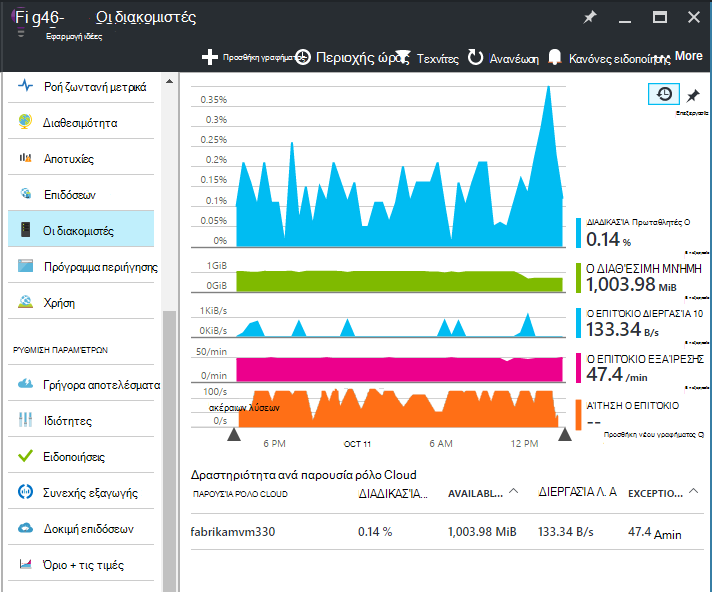

<properties 
    pageTitle="Μετρητές επιδόσεων στην εφαρμογή ιδέες | Microsoft Azure" 
    description="Παρακολούθηση του συστήματος και τα προσαρμοσμένα μετρητές επιδόσεων .NET στην εφαρμογή ιδέες." 
    services="application-insights" 
    documentationCenter=""
    authors="alancameronwills" 
    manager="douge"/>

<tags 
    ms.service="application-insights" 
    ms.workload="tbd" 
    ms.tgt_pltfrm="ibiza" 
    ms.devlang="na" 
    ms.topic="article" 
    ms.date="10/11/2016" 
    ms.author="awills"/>
 
# <a name="system-performance-counters-in-application-insights"></a>Μετρητές επιδόσεων συστήματος στην εφαρμογή ιδέες


Windows παρέχει μια μεγάλη ποικιλία [μετρητές επιδόσεων](http://www.codeproject.com/Articles/8590/An-Introduction-To-Performance-Counters) όπως διάθεση των χώρων CPU, μνήμης, δίσκου και χρήση δικτύου. Μπορείτε επίσης να ορίσετε τις δικές σας. [Εφαρμογή ιδέες](app-insights-overview.md) μπορεί να εμφανίσει αυτούς τους μετρητές επιδόσεων εάν εκτελείται η εφαρμογή σας στην περιοχή των υπηρεσιών IIS σε κεντρικού υπολογιστή εσωτερικής εγκατάστασης ή εικονική μηχανή στις οποίες έχετε δικαιώματα διαχειριστή. Τα γραφήματα υποδεικνύουν τους πόρους που είναι διαθέσιμα στην εφαρμογή σας live και μπορούν να σας βοηθήσουν να αναγνωρίσετε μη ισορροπημένες φόρτωσης μεταξύ παρουσιών διακομιστή.

Μετρητές επιδόσεων εμφανίζονται στο το blade διακομιστές, που περιλαμβάνει έναν πίνακα που τμήματα, παρουσία διακομιστή.



(Μετρητές επιδόσεων δεν είναι διαθέσιμες για τις εφαρμογές Web Azure. Αλλά μπορείτε να [στείλετε Διαγνωστικά Azure σε εφαρμογή ιδέες](app-insights-azure-diagnostics.md).)

## <a name="configure"></a>Ρύθμιση παραμέτρων

Εάν ακόμη δεν είναι εγκατεστημένο Εποπτεία κατάστασης ιδέες εφαρμογής σε υπολογιστές του διακομιστή σας, πρέπει να εγκαταστήσετε, για να δείτε μετρητές επιδόσεων.

Κάντε λήψη και εκτελέστε το [πρόγραμμα εγκατάστασης Εποπτεία κατάστασης](http://go.microsoft.com/fwlink/?LinkId=506648) σε κάθε παρουσία διακομιστή. Εάν έχει ήδη εγκατασταθεί, δεν χρειάζεται να το εγκαταστήσετε ξανά.

* *Να [εγκαταστήσει την εφαρμογή SDK ιδέες στην εφαρμογή](app-insights-asp-net.md) κατά την ανάπτυξη. Εξακολουθεί να πρέπει Εποπτεία κατάστασης;*

    Ναι, Εποπτεία κατάστασης είναι απαραίτητη για τη συλλογή μετρητών επιδόσεων για τις εφαρμογές web ASP.NET. Καθώς μπορεί να γνωρίζετε ήδη, Εποπτεία κατάστασης μπορεί επίσης να χρησιμοποιηθεί για [Εποπτεία εφαρμογών web που είναι ήδη live](app-insights-monitor-performance-live-website-now.md), χωρίς να εγκαταστήσετε το SDK κατά την ανάπτυξη.


## <a name="view-counters"></a>Προβολή μετρητών

Το blade διακομιστές εμφανίζει ένα προεπιλεγμένο σύνολο μετρητών επιδόσεων. 

Για να δείτε άλλους μετρητές, επεξεργαστείτε τα γραφήματα στην το blade διακομιστές, ή ανοίξτε ένα νέο blade [Explorer μετρήσεις](app-insights-metrics-explorer.md) και προσθέστε τα νέα γραφήματα. 

Οι διαθέσιμες μετρητές παρατίθενται ως μετρικά όταν επεξεργάζεστε ένα γράφημα.


Για να δείτε όλα τα σας πιο χρήσιμες γραφήματα σε ένα σημείο, δημιουργήστε έναν [πίνακα εργαλείων](app-insights-dashboards.md) και τις καρφιτσώσετε σε αυτήν.

## <a name="add-counters"></a>Προσθήκη μετρητών

Εάν το μετρητή επιδόσεων που θέλετε δεν εμφανίζεται στη λίστα των μετρήσεων, αυτό συμβαίνει επειδή SDK ιδέες για την εφαρμογή δεν είναι τη συλλογή στο διακομιστή web. Μπορείτε να ρυθμίσετε για να το κάνετε.

1. Μάθετε τι μετρητές που είναι διαθέσιμες στο διακομιστή σας, χρησιμοποιώντας αυτή την εντολή PowerShell από το διακομιστή:

    `Get-Counter -ListSet *`

    (See [`Get-Counter`](https://technet.microsoft.com/library/hh849685.aspx).)

1. Άνοιγμα ApplicationInsights.config.

 * Αν έχετε προσθέσει εφαρμογή ιδέες για την εφαρμογή σας κατά την ανάπτυξη, επεξεργαστείτε ApplicationInsights.config στο έργο σας και, στη συνέχεια, εκ νέου την ανάπτυξή του για τους διακομιστές σας.
 * Αν χρησιμοποιήσατε Εποπτεία κατάστασης σε μια εφαρμογή web κατά το χρόνο εκτέλεσης μέσου, βρείτε ApplicationInsights.config στον ριζικό κατάλογο της εφαρμογής στις υπηρεσίες IIS. Ενημερώσετε υπάρχουν σε κάθε παρουσία διακομιστή.

2. Επεξεργαστείτε την οδηγία συλλογής επιδόσεων:

 ```XML

    <Add Type="Microsoft.ApplicationInsights.Extensibility.PerfCounterCollector.PerformanceCollectorModule, Microsoft.AI.PerfCounterCollector">
      <Counters>
        <Add PerformanceCounter="\Objects\Processes"/>
        <Add PerformanceCounter="\Sales(photo)\# Items Sold" ReportAs="Photo sales"/>
      </Counters>
    </Add>

```

Μπορείτε να καταγράψετε τόσο τυπική μετρητές και αυτά που έχετε υλοποιήσει μόνοι σας. `\Objects\Processes`ένα παράδειγμα μιας τυπικής μετρητή, διαθέσιμη σε όλα τα συστήματα Windows. `\Sales(photo)\# Items Sold`είναι ένα παράδειγμα ενός προσαρμοσμένου μετρητή που μπορεί να εφαρμοστεί σε μια υπηρεσία web. 

Η μορφή είναι `\Category(instance)\Counter"`, ή για τις κατηγορίες που δεν διαθέτουν παρουσίες, μόνο `\Category\Counter`.

`ReportAs`απαιτείται για τα ονόματα μετρητή που δεν συμφωνούν με `[a-zA-Z()/-_ \.]+` -δηλαδή, που περιέχουν χαρακτήρες που δεν βρίσκονται σε τα ακόλουθα σύνολα: κουκκίδας γράμματα, στρογγυλοποίηση αγκύλες, κάθετος, ενωτικό, χαρακτήρας υπογράμμισης, κενό διάστημα,.

Εάν καθορίσετε μια παρουσία, θα συλλεχθεί ως Διάσταση "CounterInstanceName" του αναφερόμενου μέτρησης.

### <a name="collecting-performance-counters-in-code"></a>Συλλογή μετρητών επιδόσεων στον κώδικα

Για να συλλέξετε μετρητές επιδόσεων του συστήματος και στείλετε σε εφαρμογή ιδέες, μπορείτε να προσαρμόσετε το τμήμα κώδικα παρακάτω:

    var perfCollectorModule = new PerformanceCollectorModule();
    perfCollectorModule.Counters.Add(new PerformanceCounterCollectionRequest(
      @"\.NET CLR Memory([replace-with-application-process-name])\# GC Handles", "GC Handles")));
    perfCollectorModule.Initialize(TelemetryConfiguration.Active);

Ή μπορείτε να κάνετε το ίδιο με το προσαρμοσμένο μετρικά που δημιουργήσατε:

    var perfCollectorModule = new PerformanceCollectorModule();
    perfCollectorModule.Counters.Add(new PerformanceCounterCollectionRequest(
      @"\Sales(photo)\# Items Sold", "Photo sales"));
    perfCollectorModule.Initialize(TelemetryConfiguration.Active);

## <a name="performance-counters-in-analytics"></a>Μετρητές επιδόσεων στην ανάλυση

Μπορείτε να πραγματοποιήσετε αναζήτηση και να εμφανίζεται αναφορές μετρητή επιδόσεων στην [ανάλυση](app-insights-analytics.md).


Το σχήμα **performanceCounters** εκθέτει το `category`, `counter` όνομα, και `instance` όνομα κάθε μετρητή επιδόσεων.  Στο το τηλεμετρίας για κάθε εφαρμογή, θα δείτε μόνο τους μετρητές για αυτήν την εφαρμογή. Για παράδειγμα, για να δείτε ποιες μετρητές είναι διαθέσιμες: 


('Παρουσίας' αναφέρεται εδώ για να την παρουσία του μετρητή επιδόσεων, όχι το ρόλο ή server μηχανικής παρουσία. Το όνομα της παρουσίας μετρητή επιδόσεων συνήθως τμήματα μετρητές όπως χρόνου επεξεργαστή από το όνομα της διεργασίας ή της εφαρμογής.)

Για να λάβετε ένα γράφημα με διαθέσιμη μνήμη επάνω από την πρόσφατη περίοδο: 


Όπως άλλες τηλεμετρίας, **performanceCounters** περιλαμβάνει επίσης μια στήλη `cloud_RoleInstance` που υποδεικνύει την ταυτότητα της παρουσίας διακομιστή του κεντρικού υπολογιστή στον οποίο εκτελείται η εφαρμογή σας. Για παράδειγμα, για να συγκρίνετε τις επιδόσεις της εφαρμογής σε διαφορετικούς υπολογιστές: 


## <a name="aspnet-and-application-insights-counts"></a>ASP.NET και το πλήθος ιδέες εφαρμογής

*Ποια είναι η διαφορά μεταξύ της εξαίρεσης επιτόκιο και μετρήσεις εξαιρέσεις;*

* *Ρυθμός εξαίρεσης* είναι μετρητή επιδόσεων συστήματος. Το CLR καταμετρά όλες τις Διαχειρισμένων και ανεπίλυτη εξαιρέσεις που προκύπτουν και διαιρεί το σύνολο σε ένα διάστημα δειγματοληψία κατά τη διάρκεια του χρονικού διαστήματος. SDK ιδέες για την εφαρμογή συλλέγει αυτό το αποτέλεσμα και στέλνει την πύλη.
* *Εξαιρέσεις* είναι μια καταμέτρηση των αναφορών TrackException ελήφθη από την πύλη στο διάστημα δειγματοληψία του γραφήματος. Περιλαμβάνει μόνο τις εξαιρέσεις Διαχειρισμένων όπου έχετε εγγραφεί TrackException καλεί στον κώδικά σας και δεν περιλαμβάνει όλες τις [ανεπίλυτη εξαιρέσεις](app-insights-asp-net-exceptions.md). 

## <a name="alerts"></a>Ειδοποιήσεις

Όπως άλλες μετρήσεις, μπορείτε να [ορίσετε μια ειδοποίηση](app-insights-alerts.md) ώστε να σας ειδοποιήσει εάν μετρητή επιδόσεων μεταβαίνει έξω από το όριο που καθορίζετε. Ανοίξτε το blade ειδοποιήσεων και κάντε κλικ στην επιλογή Προσθήκη ειδοποίησης.


## <a name="next"></a>Επόμενα βήματα

* [Εξάρτηση παρακολούθησης](app-insights-asp-net-dependencies.md)
* [Εξαίρεση παρακολούθησης](app-insights-asp-net-exceptions.md)