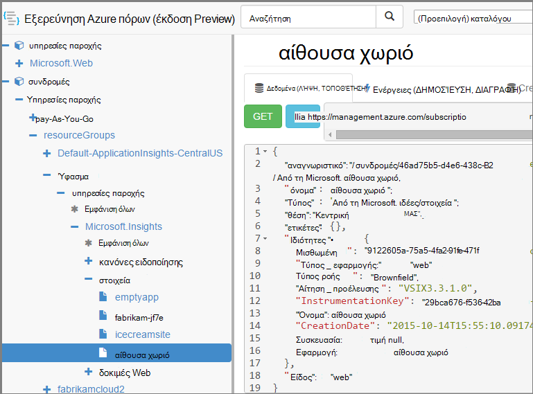

<properties 
    pageTitle="Δημιουργία εφαρμογής ιδέες πόρων με χρήση του PowerShell" 
    description="Μέσω προγραμματισμού Δημιουργία εφαρμογής ιδέες πόρων ως μέρος του σας δόμηση." 
    services="application-insights" 
    documentationCenter=""
    authors="alancameronwills" 
    manager="douge"/>

<tags 
    ms.service="application-insights" 
    ms.workload="tbd" 
    ms.tgt_pltfrm="ibiza" 
    ms.devlang="na" 
    ms.topic="article" 
    ms.date="03/02/2016" 
    ms.author="awills"/>
 
# <a name="create-application-insights-resources-using-powershell"></a>Δημιουργία εφαρμογής ιδέες πόρων με χρήση του PowerShell

Αυτό το άρθρο σας δείχνει πώς μπορείτε να δημιουργήσετε μια [Εφαρμογή ιδέες](app-insights-overview.md) πόρων στο Azure αυτόματα. Μπορεί, για παράδειγμα, κάνετε ως μέρος μιας διαδικασίας δημιουργίας. Μαζί με τον πόρο βασική εφαρμογή ιδέες, μπορείτε να δημιουργήσετε [διαθεσιμότητα web δοκιμές](app-insights-monitor-web-app-availability.md), [ορίστε ειδοποιήσεις](app-insights-alerts.md), και να δημιουργήσετε άλλες Azure πόρους.

Το κλειδί για τη δημιουργία αυτοί οι πόροι είναι πρότυπα JSON για [Τη διαχείριση πόρων Azure](../powershell-azure-resource-manager.md). Με λίγα λόγια, η διαδικασία είναι: κάντε λήψη των ορισμών JSON υπάρχοντα πόρων; ρυθμίσετε τις παραμέτρους των συγκεκριμένες τιμές όπως ονόματα. και, στη συνέχεια, εκτελέστε το πρότυπο κάθε φορά που θέλετε να δημιουργήσετε ένα νέο πόρο. Μπορείτε να συμπεριλάβετε πολλούς πόρους μαζί, για να τα δημιουργήσετε όλα σε ένα μεταβείτε - για παράδειγμα, μια εφαρμογή οθόνη με διαθεσιμότητα δοκιμές, ειδοποιήσεις και χώρου αποθήκευσης για συνεχή εξαγωγή. Υπάρχουν ορισμένες ιδιαιτερότητες σε ορισμένα από τα parameterizations, η οποία θα σας θα εξηγηθούν εδώ.

## <a name="one-time-setup"></a>Μοναδική εγκατάσταση

Εάν δεν έχετε χρησιμοποιήσει PowerShell με πριν από τη συνδρομή σας Azure:

Εγκαταστήστε τη λειτουργική μονάδα Azure Powershell στον υπολογιστή όπου θέλετε να εκτελέσετε τις δέσμες ενεργειών:

1. Εγκατάσταση [Microsoft Web πλατφόρμα Installer (v5 ή νεότερη έκδοση)](http://www.microsoft.com/web/downloads/platform.aspx).
2. Χρησιμοποιήστε το για να εγκαταστήσετε το Microsoft Azure Powershell.

## <a name="copy-the-json-for-existing-resources"></a>Αντιγράψτε το JSON για υπάρχοντα πόρους

1. Ρύθμιση [Εφαρμογών ιδέες](app-insights-overview.md) για ένα έργο παρόμοια με αυτά που θέλετε για την αυτόματη δημιουργία. Προσθήκη δοκιμές web και ειδοποιήσεις, εάν θέλετε.
2. Να δημιουργήσετε ένα νέο αρχείο .json - ας καλέστε την `template1.json` σε αυτό το παράδειγμα. Αντιγράψτε αυτό το περιεχόμενο σε αυτήν:


    ```JSON

        {
          "$schema": "https://schema.management.azure.com/schemas/2015-01-01/deploymentTemplate.json#",
          "contentVersion": "1.0.0.0",
          "parameters": {
            "appName": { "type": "string" },
            "webTestName": { "type": "string" },
            "url": { "type": "string" },
            "text": { "type" : "string" }
          },
          "variables": {
            "testName": "[concat(parameters('webTestName'), 
               '-', toLower(parameters('appName')))]"
            "alertRuleName": "[concat(parameters('webTestName'), 
               '-', toLower(parameters('appName')), 
               '-', subscription().subscriptionId)]"
          },
          "resources": [
            {
              // component JSON file contents
            },
            {
              //web test JSON file contents
            },
            {
              //alert rule JSON file contents
            }
 
            // Any other resources go here
          ]
        }
    
    ```

    Αυτό το πρότυπο θα ρυθμιστεί δοκιμή μία διαθεσιμότητα εκτός από το κύριο πόρων.


2. Ανοίξτε τη [Διαχείριση Azure πόρων](https://resources.azure.com/). Περιήγηση προς τα κάτω έως `subscriptions/resourceGroups/<your resource group>/providers/Microsoft.Insights/components`, για την εφαρμογή του πόρου. 

    

    *Τα στοιχεία* είναι οι βασικές πόροι εφαρμογή ιδέες για την εμφάνιση εφαρμογές. Υπάρχουν ξεχωριστές πόρους για τις σχετικές ειδοποίησης κανόνες και διαθεσιμότητα web δοκιμές.

3. Αντιγράψτε το JSON του στοιχείου στην κατάλληλη θέση στις `template1.json`.
6. Διαγραφή αυτές τις ιδιότητες:
  * `id`
  * `InstrumentationKey`
  * `CreationDate`
4. Ανοίξτε τις ενότητες webtests και alertrules και αντιγράψτε την JSON για τα μεμονωμένα στοιχεία στο πρότυπό σας. (Δεν αντιγραφή από τους κόμβους webtests ή alertrules: μεταβείτε σε τα στοιχεία κάτω από αυτά.)

    Κάθε δοκιμή web έχει ένα συσχετισμένο ειδοποίησης κανόνα, ώστε να έχετε για να αντιγράψετε και τα δύο.

    Η δοκιμή web θα πρέπει να μεταβείτε πριν από την ειδοποίηση κανόνα.

5. Για να ικανοποιήσετε το σχήμα, εισαγωγή αυτή η γραμμή σε κάθε πόρο:

    `"apiVersion": "2014-04-01",`

    (Το σχήμα επίσης παραπονεθεί ότι δεν λειτουργεί σχετικά με τη μετατροπή σε κεφαλαία των ονομάτων πόρων τύπου `Microsoft.Insights/*` --χωρίς να *αλλάξετε τα εξής* .)


## <a name="parameterize-the-template"></a>Ρυθμίσετε τις παραμέτρους του προτύπου

Τώρα θα πρέπει να αντικαταστήσετε το συγκεκριμένο ονόματα με παραμέτρους. Για να [ρυθμίσετε τις παραμέτρους των ένα πρότυπο](../resource-group-authoring-templates.md), μπορείτε να συντάξετε παραστάσεις χρησιμοποιώντας μια [ρύθμιση των συναρτήσεων Βοήθειας](../resource-group-template-functions.md). 

Δεν μπορείτε να ρυθμίσετε τις παραμέτρους των μόνο ένα μέρος της συμβολοσειράς, επομένως Χρησιμοποιήστε `concat()` για να δημιουργήσετε συμβολοσειρές.

Ακολουθούν παραδείγματα τα υποκατάστατα που θα θέλετε να κάνετε. Υπάρχουν πολλές εμφανίσεις της κάθε υποκατάστασης. Ίσως χρειαστεί άλλους στο πρότυπό σας. Αυτά τα παραδείγματα χρησιμοποιούν τις παραμέτρους και μεταβλητές ορίσαμε στο επάνω μέρος του προτύπου.

Εύρεση | Αντικατάσταση με
---|---
`"hidden-link:/subscriptions/.../components/MyAppName"`| `"[concat('hidden-link:',`<br/>` resourceId('microsoft.insights/components',` <br/> ` parameters('appName')))]"`
`"/subscriptions/.../alertrules/myAlertName-myAppName-subsId",` | `"[resourceId('Microsoft.Insights/alertrules', variables('alertRuleName'))]",`
`"/subscriptions/.../webtests/myTestName-myAppName",` | `"[resourceId('Microsoft.Insights/webtests', parameters('webTestName'))]",`
`"myWebTest-myAppName"` | `"[variables(testName)]"'`
`"myTestName-myAppName-subsId"` | `"[variables('alertRuleName')]"`
`"myAppName"` | `"[parameters('appName')]"`
`"myappname"`(πεζά) | `"[toLower(parameters('appName'))]"`
`"<WebTest Name=\"myWebTest\" ...`<br/>` Url=\"http://fabrikam.com/home\" ...>"`|`[concat('<WebTest Name=\"',` <br/> `parameters('webTestName'),` <br/> `'\" ... Url=\"', parameters('Url'),` <br/> `'\"...>')]" `


## <a name="set-dependencies-between-the-resources"></a>Ορισμός εξαρτήσεων μεταξύ τους πόρους

Azure θα πρέπει να ρυθμίσετε τους πόρους με αυστηρών σειρά. Για να βεβαιωθείτε ότι το πρόγραμμα Εγκατάστασης ολοκληρώνει πριν αρχίσει την επόμενη, προσθέστε εξάρτηση γραμμές:

* Στην τοποθεσία web δοκιμής πόρων:

    `"dependsOn": ["[resourceId('Microsoft.Insights/components', parameters('appName'))]"],`

* Στον πόρο ειδοποίησης:

    `"dependsOn": ["[resourceId('Microsoft.Insights/webtests', variables('testName'))]"],`

## <a name="create-application-insights-resources"></a>Δημιουργία εφαρμογής ιδέες πόρων

1. Σε PowerShell, πραγματοποιήστε είσοδο στο Azure

    `Login-AzureRmAccount`

2. Εκτελέστε την εντολή ως εξής:

    ```PS

        New-AzureRmResourceGroupDeployment -ResourceGroupName Fabrikam `
               -templateFile .\template1.json `
               -appName myNewApp `
               -webTestName aWebTest `
               -Url http://myapp.com `
               -text "Welcome!"
               -siteName "MyAzureSite"

    ``` 

    * -ResourceGroupName είναι η ομάδα όπου θέλετε να δημιουργήσετε νέους πόρους.
    * -templateFile πρέπει να είναι πριν από την προσαρμοσμένη παραμέτρους.
    * -όνομα_εφαρμογής το όνομα του πόρου για να δημιουργήσετε.
    * -webTestName το όνομα της δοκιμής web για να δημιουργήσετε.
    * -Διεύθυνση Url τη διεύθυνση url της εφαρμογής web.
    * -κείμενο μια συμβολοσειρά που εμφανίζεται στην ιστοσελίδα σας.
    * όνομα-τοποθεσίας - χρησιμοποιηθεί, εάν πρόκειται για μια τοποθεσία Web του Azure


## <a name="define-metric-alerts"></a>Ορισμός ειδοποιήσεων μετρικό

Υπάρχει μια [PowerShell μέθοδο Ορισμός ειδοποιήσεων](app-insights-alerts.md#set-alerts-by-using-powershell).


## <a name="an-example"></a>Ένα παράδειγμα

Ακολουθεί την πλήρη στοιχείου, δοκιμής web και web πρότυπο ειδοποίησης δοκιμής που έχω δημιουργήσει:

``` JSON

{
  "$schema": "https://schema.management.azure.com/schemas/2015-01-01/deploymentTemplate.json#",
  "contentVersion": "1.0.0.0",
  "parameters": {
    "webTestName": { "type": "string" },
    "appName": { "type": "string" },
    "URL": { "type": "string" },
    "text": { "type" : "string" }
  },
  "variables": {
    "alertRuleName": "[concat(parameters('webTestName'), '-', toLower(parameters('appName')), '-', subscription().subscriptionId)]",
    "testName": "[concat(parameters('webTestName'), '-', toLower(parameters('appName')))]"
  },
  "resources": [
    {
      //"id": "[resourceId('Microsoft.Insights/components', parameters('appName'))]",
      "apiVersion": "2014-04-01",
      "kind": "web",
      "location": "Central US",
      "name": "[parameters('appName')]",
      "properties": {
        "TenantId": "9122605a-471fc50f8438",
        "Application_Type": "web",
        "Flow_Type": "Brownfield",
        "Request_Source": "VSIX3.3.1.0",
        "Name": "[parameters('appName')]",
        //"CreationDate": "2015-10-14T15:55:10.0917441+00:00",
        "PackageId": null,
        "ApplicationId": "[parameters('appName')]"
      },
      "tags": { },
      "type": "microsoft.insights/components"
    },
    {
      //"id": "[resourceId('Microsoft.Insights/webtests', variables('testName'))]",
      "name": "[variables('testName')]",
      "apiVersion": "2014-04-01",
      "type": "microsoft.insights/webtests",
      "location": "Central US",
      "tags": {
        "[concat('hidden-link:', resourceId('microsoft.insights/components', parameters('appName')))]": "Resource"
      },
      "properties": {
        "provisioningState": "Succeeded",
        "Name": "[parameters('webTestName')]",
        "Description": "",
        "Enabled": true,
        "Frequency": 900,
        "Timeout": 120,
        "Kind": "ping",
        "RetryEnabled": true,
        "Locations": [
          {
            "Id": "us-va-ash-azr"
          },
          {
            "Id": "emea-nl-ams-azr"
          },
          {
            "Id": "emea-gb-db3-azr"
          }
        ],
        "Configuration": {
          "WebTest": "[concat(
             '<WebTest   Name=\"', 
                parameters('webTestName'), 
              '\"  Id=\"32cfc791-aaad-4b50-9c8d-993c21beb218\"   Enabled=\"True\"         CssProjectStructure=\"\"    CssIteration=\"\"  Timeout=\"120\"  WorkItemIds=\"\"         xmlns=\"http://microsoft.com/schemas/VisualStudio/TeamTest/2010\"         Description=\"\"  CredentialUserName=\"\"  CredentialPassword=\"\"         PreAuthenticate=\"True\"  Proxy=\"default\"  StopOnError=\"False\"         RecordedResultFile=\"\"  ResultsLocale=\"\">  <Items>  <Request Method=\"GET\"         Guid=\"a6f2c90b-61bf-b28hh06gg969\"  Version=\"1.1\"  Url=\"', 
              parameters('Url'), 
              '\" ThinkTime=\"0\"  Timeout=\"300\" ParseDependentRequests=\"True\"         FollowRedirects=\"True\" RecordResult=\"True\" Cache=\"False\"         ResponseTimeGoal=\"0\"  Encoding=\"utf-8\"  ExpectedHttpStatusCode=\"200\"         ExpectedResponseUrl=\"\" ReportingName=\"\" IgnoreHttpStatusCode=\"False\" />        </Items>  <ValidationRules> <ValidationRule  Classname=\"Microsoft.VisualStudio.TestTools.WebTesting.Rules.ValidationRuleFindText, Microsoft.VisualStudio.QualityTools.WebTestFramework, Version=10.0.0.0, Culture=neutral, PublicKeyToken=b03f5f7f11d50a3a\" DisplayName=\"Find Text\"         Description=\"Verifies the existence of the specified text in the response.\"         Level=\"High\"  ExectuionOrder=\"BeforeDependents\">  <RuleParameters>        <RuleParameter Name=\"FindText\" Value=\"', 
              parameters('text'), 
              '\" />  <RuleParameter Name=\"IgnoreCase\" Value=\"False\" />  <RuleParameter Name=\"UseRegularExpression\" Value=\"False\" />  <RuleParameter Name=\"PassIfTextFound\" Value=\"True\" />  </RuleParameters> </ValidationRule>  </ValidationRules>  </WebTest>')]"
        },
        "SyntheticMonitorId": "[variables('testName')]"
      }
    },
    {
      //"id": "[resourceId('Microsoft.Insights/alertrules', variables('alertRuleName'))]",
      "name": "[variables('alertRuleName')]",
      "apiVersion": "2014-04-01",
      "type": "microsoft.insights/alertrules",
      "location": "East US",
      "dependsOn": [
        "[resourceId('Microsoft.Insights/components', parameters('appName'))]",
        "[resourceId('Microsoft.Insights/webtests', variables('testName'))]"
      ],
      "tags": {
        "[concat('hidden-link:', resourceId('Microsoft.Insights/components', parameters('appName')))]": "Resource",
        "[concat('hidden-link:', resourceId('Microsoft.Insights/webtests', variables('testName')))]": "Resource"
      },
      "properties": {
        "name": "[variables('alertRuleName')]",
        "description": "",
        "isEnabled": true,
        "condition": {
          "$type": "Microsoft.WindowsAzure.Management.Monitoring.Alerts.Models.LocationThresholdRuleCondition, Microsoft.WindowsAzure.Management.Mon.Client",
          "odata.type": "Microsoft.Azure.Management.Insights.Models.LocationThresholdRuleCondition",
          "dataSource": {
            "$type": "Microsoft.WindowsAzure.Management.Monitoring.Alerts.Models.RuleMetricDataSource, Microsoft.WindowsAzure.Management.Mon.Client",
            "odata.type": "Microsoft.Azure.Management.Insights.Models.RuleMetricDataSource",
            "resourceUri": "[resourceId('microsoft.insights/webtests', variables('testName'))]",
            "metricName": "GSMT_AvRaW"
          },
          "windowSize": "PT15M",
          "failedLocationCount": 2
        },
        "action": {
          "$type": "Microsoft.WindowsAzure.Management.Monitoring.Alerts.Models.RuleEmailAction, Microsoft.WindowsAzure.Management.Mon.Client",
          "odata.type": "Microsoft.Azure.Management.Insights.Models.RuleEmailAction",
          "sendToServiceOwners": true,
          "customEmails": [ ]
        },
        "provisioningState": "Succeeded",
        "actions": [ ]
      }

    }
  ]
}

```

## <a name="see-also"></a>Δείτε επίσης

Άλλα άρθρα αυτοματοποίησης:

* [Δημιουργία ενός πόρου ιδέες εφαρμογή](app-insights-powershell-script-create-resource.md) - γρήγορη μέθοδο χωρίς τη χρήση ενός προτύπου.
* [Ρύθμιση ειδοποιήσεων](app-insights-powershell-alerts.md)
* [Δημιουργία δοκιμές web](https://azure.microsoft.com/blog/creating-a-web-test-alert-programmatically-with-application-insights/)
* [Αποστολή Azure Διαγνωστικά ιδέες εφαρμογής](app-insights-powershell-azure-diagnostics.md)
* [Δημιουργία σχολίων τελική έκδοση](https://github.com/Microsoft/ApplicationInsights-Home/blob/master/API/CreateReleaseAnnotation.ps1)
