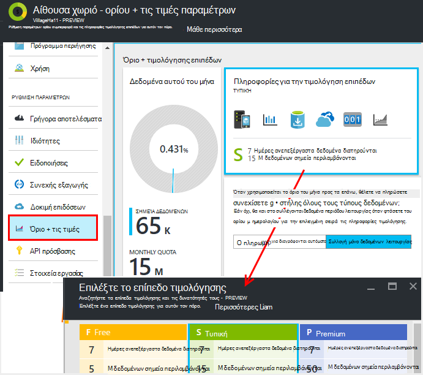
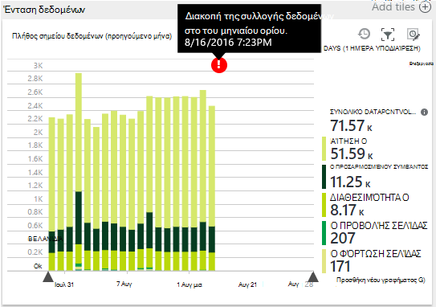
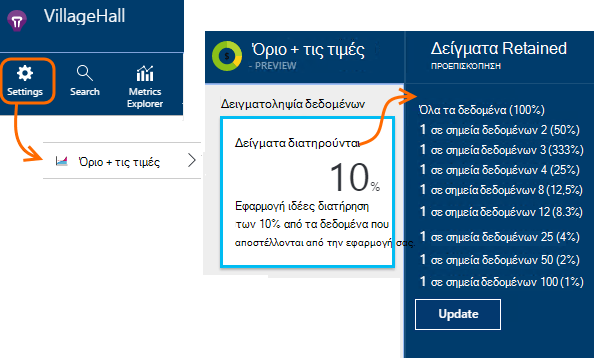
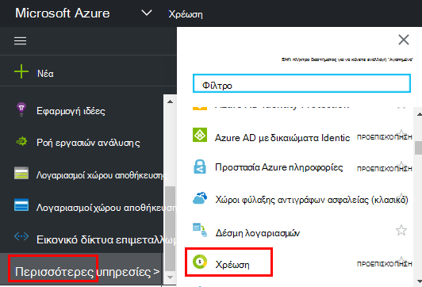

<properties 
    pageTitle="Διαχειριστείτε τις πληροφορίες τιμολόγησης και ορίων μεγέθους για ιδέες εφαρμογής | Microsoft Azure" 
    description="Επιλέξτε το πρόγραμμα τιμή που χρειάζεστε, Διαχείριση όγκους τηλεμετρίας" 
    services="application-insights" 
    documentationCenter=""
    authors="alancameronwills" 
    manager="douge"/>

<tags 
    ms.service="application-insights" 
    ms.workload="tbd" 
    ms.tgt_pltfrm="ibiza" 
    ms.devlang="na" 
    ms.topic="article" 
    ms.date="10/13/2016" 
    ms.author="awills"/>

# Διαχειριστείτε τις πληροφορίες τιμολόγησης και ορίων μεγέθους για ιδέες εφαρμογής

*Εφαρμογή ιδέες είναι σε προεπισκόπηση.*

[Τις τιμές] [ pricing] για [Ιδέες εφαρμογή του Visual Studio] [ start] είναι με βάση τον όγκο δεδομένων ανά εφαρμογή. Υπάρχει μια σημαντική δωρεάν σειρά με την οποία μπορείτε να λάβετε περισσότερες από τις δυνατότητες με ορισμένοι περιορισμοί.

Κάθε πόρο ιδέες εφαρμογή θα χρεωθεί ως ξεχωριστή υπηρεσία και συμβάλλει στη του τιμολογίου χρέωσης για τη συνδρομή σας για να Azure.

[Δείτε το συνδυασμό τιμολόγησης][pricing].

## Σχέδιο για τον πόρο ιδέες εφαρμογής ορίου αναθεώρηση και τιμής

Μπορείτε να ανοίξετε το όριο + τιμολόγησης blade από τις ρυθμίσεις του πόρου της εφαρμογής σας.

Επηρεάζει τις τιμές συνδυασμού την επιλογή σας:

* [Μηνιαίο ορίου](#monthly-quota) - το ποσό της τηλεμετρίας μπορείτε να αναλύσετε κάθε μήνα.
* [Ρυθμός δεδομένων](#data-rate) - τη μέγιστη ταχύτητα με την οποία είναι δυνατή η επεξεργασία δεδομένων από την εφαρμογή σας.
* [Εξαγωγή συνεχούς](#continuous-export) - εάν μπορείτε να εξαγάγετε δεδομένα σε άλλα εργαλεία και τις υπηρεσίες.

Αυτά τα όρια ορίζονται ξεχωριστά για κάθε πόρο εφαρμογής ιδέες.

### Δωρεάν δοκιμαστική έκδοση Premium

Όταν δημιουργείτε ένα νέο πόρο εφαρμογής ιδέες για πρώτη φορά, ξεκινά στο επίπεδο δωρεάν.

Οποιαδήποτε στιγμή, μπορείτε να μεταβείτε σε το δωρεάν δοκιμαστική έκδοση Premium 30 ημερών. Αυτό σας δίνει τα οφέλη από τη σειρά Premium. Έπειτα από 30 ημέρες, θα επιστρέψει αυτόματα σε όποια σειρά που ήταν πριν από - εκτός εάν επιλέξετε ρητά ένα άλλο επίπεδο. Επιλέξτε το επίπεδο που θέλετε ανά πάσα στιγμή κατά τη διάρκεια της δοκιμαστικής περιόδου, αλλά θα εξακολουθείτε να λάβετε το δωρεάν δοκιμαστική έκδοση μέχρι το τέλος της περιόδου 30 ημερών.

## Μηνιαίο ορίου

* Κάθε ημερολογιακό μήνα, την εφαρμογή σας να στείλετε μια καθορισμένη ποσότητα του τηλεμετρίας σε εφαρμογή ιδέες. Προς το παρόν του ορίου για το δωρεάν σειρά τιμολόγησης είναι 5 εκατομμύρια σημεία δεδομένων ανά μήνα και ουσιαστικά περισσότερα για τους άλλους συνδυασμούς Μπορείτε να αγοράσετε περισσότερες Εάν φτάσετε του ορίου.  Δείτε την [Τιμολόγηση συνδυασμού] [ pricing] για την πραγματική αριθμούς. 
* Το όριο μεγέθους εξαρτάται από το επίπεδο τιμολόγησης που έχετε επιλέξει.
* Το όριο μεγέθους συνυπολογίζεται από τα μεσάνυχτα UTC την πρώτη ημέρα κάθε μήνα.
* Το γράφημα σημεία δεδομένων εμφανίζει τον όγκο του ορίου σας έχει χρησιμοποιηθεί αυτόν το μήνα.
* Το όριο μεγέθους μετράται σε *σημεία δεδομένων.* Ένα μοναδικό σημείο δεδομένων είναι μια κλήση σε μία από τις μεθόδους παρακολούθησης, είτε που ονομάζεται ρητά στον κώδικά σας ή με μία από τις τυπικές τηλεμετρίας λειτουργικές μονάδες. Μπορεί να έχει πολλά συνημμένα ιδιότητες και μετρήσεις.
* Σημεία δεδομένων δημιουργούνται από:
 * [Λειτουργικές μονάδες SDK](app-insights-configuration-with-applicationinsights-config.md) που αυτόματα συλλογή δεδομένων, για παράδειγμα να αναφέρετε μια αίτηση ή σφάλμα ή μέτρησης των επιδόσεων.
 * [API](app-insights-api-custom-events-metrics.md) `Track...` κλήσεις που έχετε γράψει, όπως `TrackEvent` ή `trackPageView`.
 * [Διαθεσιμότητα web δοκιμές](app-insights-monitor-web-app-availability.md) που έχετε ορίσει.
* Ενώ κάνετε εντοπισμό σφαλμάτων, μπορείτε να δείτε τα σημεία δεδομένων που στέλνεται από την εφαρμογή στο παράθυρο εξόδου του Visual Studio. Συμβάντα προγράμματος-πελάτη μπορούν να προβληθούν ανοίγοντας την καρτέλα δικτύου στο πρόγραμμα περιήγησης του εντοπισμού παραθύρου (συνήθως F12).
* Δεν θα μετρηθεί στο του ορίου *δεδομένα περιόδου λειτουργίας* . Αυτό περιλαμβάνει το πλήθος των χρηστών, οι περίοδοι λειτουργίας, περιβάλλον και συσκευή δεδομένων.
* Εάν θέλετε για την καταμέτρηση των σημείων δεδομένων από επιθεώρησης, μπορείτε να τις βρείτε σε διάφορες θέσεις:
 * Κάθε στοιχείο που βλέπετε στο [διαγνωστικών αναζήτησης](app-insights-diagnostic-search.md), η οποία περιλαμβάνει HTTP αιτήσεις, εξαιρέσεις, ανιχνεύσεις καταγραφής, προβολές σελίδας, συμβάντα εξάρτηση, και προσαρμοσμένα συμβάντα.
 * Κάθε ανεπεξέργαστα μέτρηση ένα [μετρικό σύστημα](app-insights-metrics-explorer.md) όπως μετρητή επιδόσεων. (Τα σημεία που βλέπετε στην τα γραφήματα είναι συνήθως συγκεντρώσεις πολλών σημείων ανεπεξέργαστα δεδομένα).
 * Κάθε σημείο σε ένα γράφημα διαθεσιμότητα web είναι επίσης μια συγκεντρωτική τιμή από πολλά σημεία δεδομένων.
* Μπορείτε επίσης να εξετάσετε μεμονωμένα σημεία δεδομένων στην προέλευση κατά τον εντοπισμό σφαλμάτων:
 * Εάν εκτελείτε την εφαρμογή σας σε κατάσταση εντοπισμού σφαλμάτων στο Visual Studio, τα σημεία δεδομένων είστε συνδεδεμένοι στο παράθυρο εξόδου. 
 * Για να δείτε τα σημεία δεδομένων προγράμματος-πελάτη, Άνοιγμα εντοπισμού σφαλμάτων παράθυρο του προγράμματος περιήγησης (συνήθως F12) και ανοίξτε την καρτέλα "δίκτυο".
* Η ταχύτητα δεδομένων μπορεί να (από προεπιλογή) μειωθεί με [προσαρμόσιμες δειγματοληψία](app-insights-sampling.md). Αυτό σημαίνει ότι, με χρήση της αυξάνει την εφαρμογή, ο συντελεστής τηλεμετρίας δεν θα αυξήσετε κατά τον ίδιο τρόπο όπως ίσως αναμένατε.

### Επιπλέον χρέωση μονάδων

Εάν η εφαρμογή σας στέλνει περισσότερους χαρακτήρες από το όριο μηνιαία, μπορείτε να:

* Πληρωμή για πρόσθετα δεδομένα. Δείτε την [Τιμολόγηση συνδυασμού] [ pricing] για λεπτομέρειες. Μπορείτε να επιλέξετε αυτήν την επιλογή εκ των προτέρων. Αυτή η επιλογή δεν είναι διαθέσιμη στο το δωρεάν τις τιμές σε επίπεδο.
* Αναβαθμίστε το επίπεδο τις πληροφορίες τιμολόγησης.
* Μην κάνετε τίποτα. Δεδομένων λειτουργίας θα συνεχίσουν να καταγραφεί, αλλά δεν θα εμφανίζονται άλλα δεδομένα στο διαγνωστικών αναζήτησης ή στην Εξερεύνηση των μετρήσεων.

## Όγκο δεδομένων αποστολή;

Το γράφημα στο κάτω μέρος της τιμολόγησης blade εμφανίζεται όγκος σημείο δεδομένων της εφαρμογής σας, ομαδοποιημένα κατά τύπο σημείο δεδομένων. (Μπορείτε επίσης να δημιουργήσετε αυτό το γράφημα στην Εξερεύνηση μετρικό.)

Κάντε κλικ στο γράφημα για περισσότερες λεπτομέρειες, ή σύρετε κατά μήκος του και κάντε κλικ στην επιλογή (+) για τις λεπτομέρειες της περιοχής ώρας.

Το γράφημα εμφανίζει τον όγκο δεδομένων που λαμβάνονται με την υπηρεσία εφαρμογής ιδέες, μετά τη [δειγματοληψία](app-insights-sampling.md).

Εάν η ένταση δεδομένων φτάσει το όριο του μηνιαίου, εμφανίζεται ένα σχόλιο στο γράφημα.

## Ρυθμός δεδομένων

Εκτός από το μηνιαίο ορίου, υπάρχουν επιτάχυνσης όρια την ταχύτητα δεδομένων. Για την [Τιμολόγηση επίπεδο] τη δωρεάν[ pricing] το όριο είναι 200 δεδομένων σημεία/δευτερόλεπτο υπολογίζεται ο μέσος όρος πάνω από 5 λεπτά και για την πληρωμή σειρές αυτό είναι 500/s μέσος όρος πάνω από 1 λεπτό. 

Υπάρχουν τρεις Κάδοι διακοπών:

* [Κλήσεις TrackTrace](app-insights-api-custom-events-metrics.md#track-trace) και [καταγράφονται αρχείων καταγραφής](app-insights-asp-net-trace-logs.md)
* [Εξαιρέσεις](app-insights-api-custom-events-metrics.md#track-exception), περιορίζεται σε 50 σημεία/s.
* Όλα άλλες τηλεμετρίας (σελίδα προβολές, οι περίοδοι λειτουργίας, αιτήσεις, εξαρτήσεις, μετρικά, προσαρμοσμένα συμβάντα, αποτελέσματα δοκιμής web).

*Τι συμβαίνει εάν η εφαρμογή μου υπερβαίνει το επιτόκιο ανά δευτερόλεπτο;*

* Η ένταση των δεδομένων που στέλνει την εφαρμογή σας είναι αξιολογείται κάθε λεπτό. Εάν υπερβαίνει το επιτόκιο ανά δευτερόλεπτο ως μέσος όρος για το λεπτό, ο διακομιστής απορρίπτει ορισμένες αιτήσεις. Το SDK buffer για τα δεδομένα και, στη συνέχεια, προσπαθεί να στείλετε ξανά, που ένα αύξησης πάνω από μερικά λεπτά. Εάν την εφαρμογή σας στέλνει με συνέπεια δεδομένα στο επάνω από το ρυθμό επιτάχυνσης, θα καταργηθεί ορισμένα δεδομένα. (Το ASP.NET Java και SDK JavaScript επιχειρήσει να στείλει ξανά με αυτόν τον τρόπο, άλλες SDK μπορεί απλώς απόθεσης επιβραδύνει δεδομένων.)

Σε περίπτωση περιορισμού, θα δείτε μια ειδοποίηση προειδοποίηση ότι αυτό συνέβη.

*Πώς μπορώ να γνωρίζω το πλήθος των σημείων δεδομένων στέλνει εφαρμογή μου;*

* Άνοιγμα ρυθμίσεων/ορίου και τιμολόγηση για να δείτε το γράφημα όγκου δεδομένων.
* Ή στην Εξερεύνηση των μετρήσεων, προσθέστε ένα νέο γράφημα και επιλέξτε **Ένταση σημείο δεδομένων** ως το μετρικό σύστημα. Εναλλαγή σε ομαδοποίησης και ομαδοποίηση κατά **τύπο δεδομένων**.

## Για να μειώσετε το ρυθμό δεδομένων σας

Εάν αντιμετωπίσετε τα όρια επιτάχυνσης, ακολουθούν ορισμένα πράγματα που μπορείτε να κάνετε:

* Χρησιμοποιήστε [δειγματοληψία](app-insights-sampling.md). Αυτή η τεχνολογία μειώνει ταχύτητα δεδομένων χωρίς αλλοιώνοντας τις μετρήσεις και χωρίς να διακόψετε τη δυνατότητα για περιήγηση μεταξύ των σχετικών στοιχείων στο πλαίσιο Αναζήτηση.
* [Περιορισμός του αριθμού των κλήσεων Ajax που μπορεί να αναφερθεί](app-insights-javascript.md#detailed-configuration) σε κάθε προβολή σελίδας ή εναλλαγή απενεργοποίηση Ajax αναφοράς.
* Εναλλαγή απενεργοποίηση συλλογής λειτουργικές μονάδες που δεν χρειάζεστε με την [Επεξεργασία ApplicationInsights.config](app-insights-configuration-with-applicationinsights-config.md). Για παράδειγμα, μπορεί να αποφασίσετε ότι μετρητές επιδόσεων ή εξάρτηση δεδομένων είναι inessential.
* Προ-συγκεντρωτικών αποτελεσμάτων μετρικά. Εάν τοποθετήσατε κλήσεων στο TrackMetric στην εφαρμογή σας, μπορείτε να μειώσετε την κυκλοφορία χρησιμοποιώντας το υπερφόρτωσης που δέχεται τον υπολογισμό του μέσου και τυπική απόκλιση της μια δέσμη των μετρήσεων. Ή μπορείτε να χρησιμοποιήσετε ένα [πακέτο προ-συγκέντρωση](https://www.myget.org/gallery/applicationinsights-sdk-labs). 

## Δειγματοληψία

[Δειγματοληψία](app-insights-sampling.md) είναι μια μέθοδο μείωση του ρυθμού την οποία τηλεμετρίας αποστέλλεται την εφαρμογή σας, ενώ παράλληλα τη δυνατότητα για να βρείτε σχετικά συμβάντα στη διάρκεια των διαγνωστικών αναζητήσεων και παράλληλα σωστή καταμετρά συμβάν. 

Δειγματοληψία είναι ένας αποτελεσματικός τρόπος να μείωση της επιβάρυνσης και να παραμείνει εντός του ορίου μηνιαία. Ο αλγόριθμος δειγματοληψία διατηρεί τα σχετικά στοιχεία του τηλεμετρίας, έτσι ώστε, για παράδειγμα, όταν χρησιμοποιείτε την αναζήτηση, μπορείτε να βρείτε την αίτηση που σχετίζονται με μια συγκεκριμένη εξαίρεση. Ο αλγόριθμος διατηρεί επίσης σωστό πλήθος, έτσι ώστε να βλέπετε τις σωστές τιμές στην Εξερεύνηση μετρικό σύστημα για αίτηση χρεώσεων, χρεώσεις εξαίρεσης και άλλες μετρήσεις.

Υπάρχουν διάφορες μορφές δειγματοληψία.

* [Προσαρμόσιμες δειγματοληψία](app-insights-sampling.md) είναι η προεπιλογή για το ASP.NET SDK, το οποίο προσαρμόζεται αυτόματα για να τον όγκο των τηλεμετρίας που στέλνει την εφαρμογή σας. Αυτό λειτουργεί αυτόματα στο SDK στην εφαρμογή web, ώστε να μειωθεί η κίνηση τηλεμετρίας του δικτύου. 
* *Δειγματοληψία κατάποσης* είναι μια εναλλακτική λύση που λειτουργεί στο σημείο όπου τηλεμετρίας από την εφαρμογή εισάγει την υπηρεσία εφαρμογής ιδέες. Δεν επηρεάζει τον όγκο των τηλεμετρίας αποστέλλεται από την εφαρμογή σας, αλλά μειώνει την ένταση ήχου διατηρούνται από την υπηρεσία. Μπορείτε να το χρησιμοποιήσετε για να μειώσετε το όριο μεγέθους χρησιμοποιούνται προς τα επάνω από τηλεμετρίας από προγράμματα περιήγησης και άλλες SDK.

Για να ορίσετε δειγματοληψία κατάποσης, ορίστε το στοιχείο ελέγχου του ορίου + τιμολόγησης blade:

> [AZURE.WARNING] Την τιμή που εμφανίζεται στο πλακίδιο δείγματα διατηρούνται δείχνει μόνο την τιμή που έχετε ορίσει για κατάποση δειγματοληψία. Δεν εμφανίζει το ρυθμό δειγματοληψία που λειτουργεί με το SDK στην εφαρμογή. 
> 
> Εάν τα εισερχόμενα τηλεμετρίας έχει ήδη έχουν δείγμα από το SDK, δεν εφαρμόζεται δειγματοληψία κατάποσης.
 
Για να εντοπίσετε το επιτόκιο πραγματική δειγματοληψία ανεξάρτητα από το σημείο όπου έχει εφαρμοστεί, χρησιμοποιήστε ένα [ερώτημα αναλυτικών στοιχείων](app-insights-analytics.md) όπως αυτή:

    requests | where timestamp > ago(1d)
  	| summarize 100/avg(itemCount) by bin(timestamp, 1h) 
  	| render areachart 

Σε κάθε διατηρούνται εγγραφή, `itemCount` υποδεικνύει τον αριθμό των αρχικό εγγραφών που την αντιπροσωπεύει, ίσο με 1 + τον αριθμό των προηγούμενες απορρίφθηκαν εγγραφές. 

## Αναθεώρηση του τιμολογίου χρέωσης για τη συνδρομή σας για να Azure

Εφαρμογή ιδέες χρεώσεις προστίθεται Azure χρέωσή σας. Μπορείτε να δείτε λεπτομέρειες του Azure γραμματίου στην ενότητα χρέωση της πύλης Azure ή στην [Πύλη χρεώσεις Azure](https://account.windowsazure.com/Subscriptions). 

## Όρια όνομα

1.  Έως 200 μοναδικά ονόματα μετρικό και 200 ονόματα μοναδικών τιμών ιδιοτήτων για την εφαρμογή σας. Μετρικά περιλαμβάνουν δεδομένα που αποστέλλονται μέσω TrackMetric, καθώς και μετρήσεις σε άλλους τύπους δεδομένων, όπως τα συμβάντα.  [Ονόματα μετρικά και την ιδιότητα] [ api] είναι καθολικές ανά οργάνων κλειδί.
2.  [Ιδιότητες] [ apiproperties] μπορούν να χρησιμοποιηθούν για το φιλτράρισμα και ομαδοποίηση κατά μόνο ενώ έχουν λιγότερους από 100 μοναδικές τιμές για κάθε ιδιότητα. Μετά τον αριθμό των μοναδικών τιμών υπερβαίνει 100, εξακολουθεί να αναζήτηση την ιδιότητα, αλλά δεν είναι πλέον το χρησιμοποιήσετε για φίλτρα ή ομαδοποίηση κατά.
3.  Τυπικές ιδιότητες όπως αίτηση όνομα και η διεύθυνση URL της σελίδας περιορίζονται σε 1000 μοναδικές τιμές ανά εβδομάδα. Μετά από 1000 μοναδικές τιμές, τιμές επιπλέον επισημαίνονται ως "Άλλες τιμές". Τις αρχικές τιμές εξακολουθούν να μπορεί να χρησιμοποιηθεί για αναζήτηση πλήρους κειμένου και το φιλτράρισμα.

Εάν δεν μπορείτε να βρείτε την εφαρμογή σας είναι ότι έχετε υπερβεί αυτά τα όρια, εξετάστε το ενδεχόμενο να διαίρεσης δεδομένων μεταξύ πλήκτρα διαφορετικό οργάνων - δηλαδή, [Δημιουργία νέας εφαρμογής ιδέες πόρων](app-insights-create-new-resource.md) και αποστολή ορισμένα από τα δεδομένα για τα νέα κλειδιά οργάνων. Ίσως διαπιστώσετε ότι το αποτέλεσμα είναι καλύτερη δομή. Μπορείτε να χρησιμοποιήσετε [τους πίνακες εργαλείων](app-insights-dashboards.md#dashboards) για να μεταφέρετε τα διαφορετικά μετρικά στην ίδια οθόνη, ώστε αυτή η προσέγγιση δεν περιορίζουν τη δυνατότητά σας να συγκρίνετε διαφορετικά μετρήσεις. 

## Όρια σύνοψη

[AZURE.INCLUDE [application-insights-limits](../../includes/application-insights-limits.md)]

<!--Link references-->

[api]: app-insights-api-custom-events-metrics.md
[apiproperties]: app-insights-api-custom-events-metrics.md#properties
[start]: app-insights-overview.md
[pricing]: http://azure.microsoft.com/pricing/details/application-insights/

 