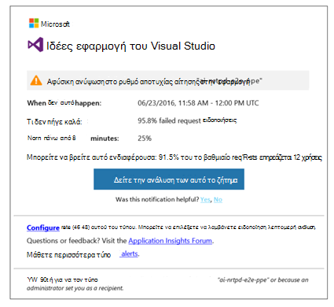
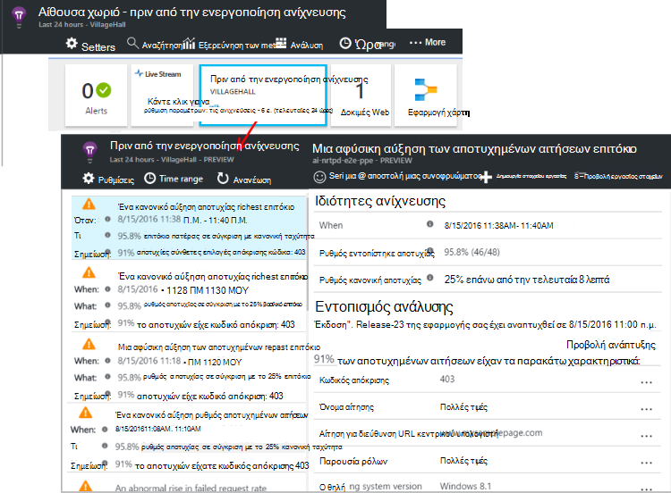

<properties 
    pageTitle="Έγκαιρη Διαγνωστικά στην εφαρμογή ιδέες | Microsoft Azure" 
    description="Εφαρμογή ιδέες εκτελεί αυτόματη βάθος ανάλυση της τηλεμετρίας την εφαρμογή και σας ειδοποιεί πιθανών προβλημάτων." 
    services="application-insights" 
    documentationCenter="windows"
    authors="rakefetj" 
    manager="douge"/>

<tags 
    ms.service="application-insights" 
    ms.workload="tbd" 
    ms.tgt_pltfrm="ibiza" 
    ms.devlang="na" 
    ms.topic="article" 
    ms.date="08/15/2016" 
    ms.author="awills"/>

#  Έγκαιρη Διαγνωστικά στην εφαρμογή ιδέες

 Έγκαιρη Διαγνωστικά σας προειδοποιεί αυτόματα για πιθανά προβλήματα επιδόσεων στην εφαρμογή web σας. Πραγματοποιεί έξυπνη ανάλυσης των το τηλεμετρίας που στέλνει την εφαρμογή του [Visual Studio εφαρμογή ιδέες](app-insights-overview.md). Εάν υπάρχει μια απότομη αύξηση αποτυχία χρεώσεων ή αφύσικη μοτίβα των επιδόσεων του προγράμματος-πελάτη ή διακομιστή, λαμβάνετε μια ειδοποίηση. Αυτή η δυνατότητα χρειάζεται καμία ρύθμιση παραμέτρων. Αυτό λειτουργεί αν η εφαρμογή σας στείλει αρκετό τηλεμετρίας.

Μπορείτε να αποκτήσετε πρόσβαση σε ειδοποιήσεις πριν από την ενεργοποίηση εντοπισμού τόσο από τα μηνύματα ηλεκτρονικού ταχυδρομείου που λαμβάνετε και από το blade πριν από την ενεργοποίηση εντοπισμού.

## Εξετάστε τις ανιχνεύσεις της σας πριν από την ενεργοποίηση

Μπορείτε να ανακαλύψετε τις ανιχνεύσεις με δύο τρόπους:

* **Λαμβάνετε ένα μήνυμα ηλεκτρονικού ταχυδρομείου** από εφαρμογή ιδέες. Ακολουθεί ένα τυπικό παράδειγμα:

    

    Κάντε κλικ στο μεγάλο κουμπί για να ανοίξετε περισσότερες λεπτομέρειες στην πύλη.

* **Η έγκαιρη εντοπισμού πλακιδίου** στην blade Επισκόπηση της εφαρμογής σας δείχνει μια καταμέτρηση του πρόσφατες ειδοποιήσεις. Κάντε κλικ στο πλακίδιο για να δείτε μια λίστα με τις πρόσφατες ειδοποιήσεις.

Επιλέξτε μια ειδοποίηση ώστε να δείτε τις λεπτομέρειές του.

## Τι προβλήματα εντοπίζονται;

Υπάρχουν τρία είδη ανίχνευσης:

* [Έγκαιρη αποτυχία επιτόκιο διαγνωστικών](app-insights-proactive-failure-diagnostics.md). Χρησιμοποιούμε μηχανικής εκμάθησης για να ορίσετε τον αναμενόμενο ρυθμό αποτυχημένων αιτήσεων για την εφαρμογή, συσχέτιση με φόρτωση και άλλους παράγοντες. Εάν το ποσοστό αποτυχίας οδηγεί έξω από το αναμενόμενο φάκελο, στείλουμε ειδοποίησης.
* [Διαγνωστικά απόδοσης πριν από την ενεργοποίηση](app-insights-proactive-performance-diagnostics.md). Γίνεται αναζήτηση για ύπαρξη μοτίβα σε ώρες απόκρισης και χρεώσεις αποτυχία καθημερινά. Θα σας συσχετισμός αυτά τα προβλήματα με τις ιδιότητες όπως θέση, πρόγραμμα περιήγησης, προγράμματος-πελάτη OS παρουσία διακομιστή και ώρα της ημέρας.
* [Azure στο Cloud Services](https://azure.microsoft.com/blog/proactive-notifications-on-cloud-service-issues-with-azure-diagnostics-and-application-insights/). Μπορείτε να λάβετε ειδοποιήσεις εάν την εφαρμογή σας φιλοξενείται σε υπηρεσίες Cloud Azure και μια παρουσία ρόλος έχει αποτυχίες εκκίνησης, συχνές ανακύκλωσης ή παρουσιάσει σφάλμα χρόνου εκτέλεσης.

(Οι συνδέσεις Βοήθειας σε κάθε ειδοποίηση μεταφέρουν με την περίπτωση.)

## Επόμενα βήματα

Αυτά τα εργαλεία διαγνωστικών σας βοηθήσει να ελέγξετε την τηλεμετρίας από την εφαρμογή:

* [Εξερεύνηση μετρικό](app-insights-metrics-explorer.md)
* [Εξερεύνηση αναζήτησης](app-insights-diagnostic-search.md)
* [Ανάλυση - γλώσσα ισχυρή ερωτημάτων](app-insights-analytics-tour.md)

Έγκαιρη Διαγνωστικά είναι εντελώς αυτόματες. Όμως, ίσως θέλετε να ορίσετε ορισμένες περισσότερες ειδοποιήσεις;

* [Μη αυτόματη ρύθμιση παραμέτρων ειδοποιήσεων μετρικό](app-insights-alerts.md)
* [Διαθεσιμότητα web δοκιμές](app-insights-monitor-web-app-availability.md) 

