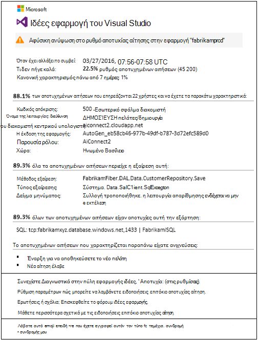
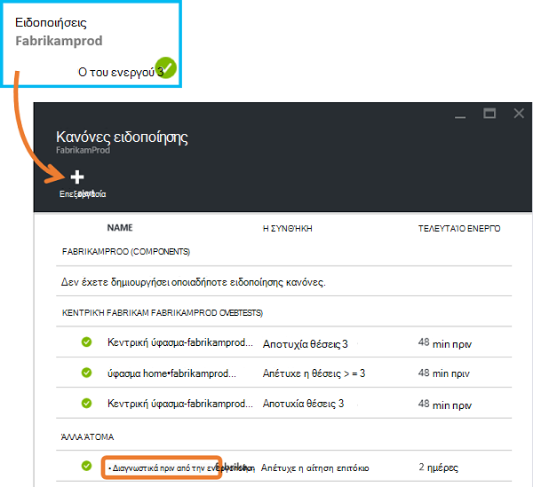
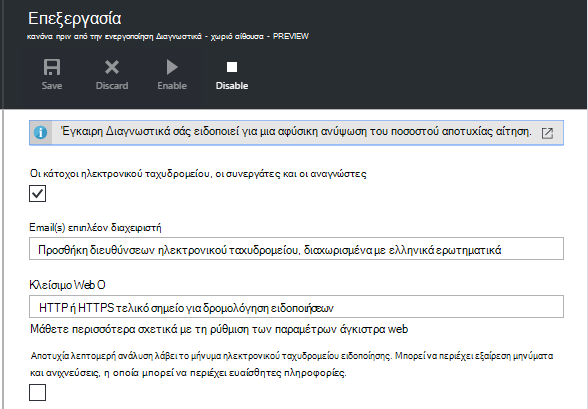
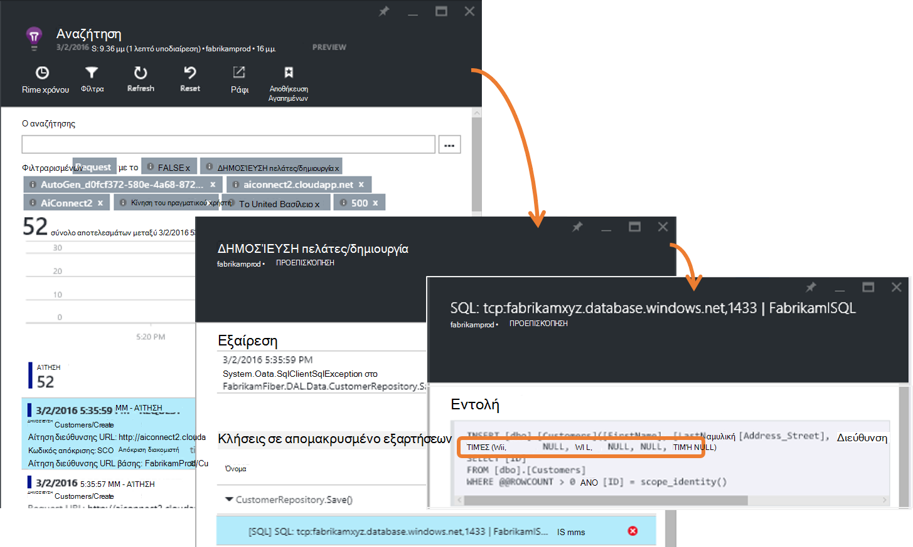
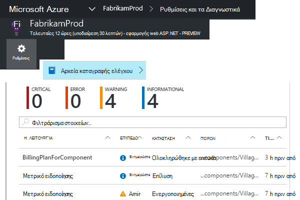
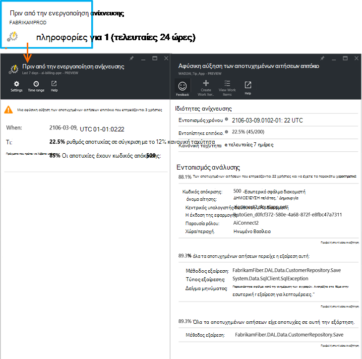

<properties 
    pageTitle="Έγκαιρη αποτυχία επιτόκιο Διαγνωστικά στην εφαρμογή ιδέες | Microsoft Azure" 
    description="Σάς ειδοποιεί για ασυνήθιστο αλλαγές του ποσοστού των αποτυχημένων αιτήσεων σε εφαρμογή web και παρέχει διαγνωστικών ανάλυσης. Ρύθμιση των παραμέτρων δεν είναι απαραίτητο." 
    services="application-insights" 
    documentationCenter=""
    authors="yorac" 
    manager="douge"/>

<tags 
    ms.service="application-insights" 
    ms.workload="tbd" 
    ms.tgt_pltfrm="ibiza" 
    ms.devlang="na" 
    ms.topic="article" 
    ms.date="10/12/2016" 
    ms.author="awills"/>
 
# Έγκαιρη αποτυχία Διαγνωστικά επιτόκιο

[Visual Studio εφαρμογή ιδέες](app-insights-overview.md) αυτόματα σάς ειδοποιεί σε άμεσο πραγματικό χρόνο εάν την εφαρμογή web της αντιμετωπίζει ένα αφύσικη ανύψωση του ποσοστού αποτυχιών. Εντοπίζει μια ασυνήθιστο ανύψωση του ποσοστού των αιτήσεων HTTP που αναφέρθηκε ως απέτυχε. Αυτά είναι συνήθως αυτές με τους κωδικούς απόκρισης σε το 400 - και 500-περιοχές. Για να σας βοηθήσει να διαλογής και να εντοπίσετε το πρόβλημα, ανάλυση σχετικά με τα χαρακτηριστικά των αποτυχημένων αιτήσεων και σχετικές τηλεμετρίας παρέχεται στην ειδοποίηση. Υπάρχουν επίσης συνδέσεις με την πύλη εφαρμογής ιδέες για περαιτέρω διάγνωση. Η δυνατότητα πρέπει χωρίς εγκατάστασης ή ρύθμισης παραμέτρων, όπως που χρησιμοποιεί αλγορίθμους μηχανικής εκμάθησης για την πρόβλεψη το ποσοστό κανονική αποτυχίας.

Η δυνατότητα αυτή λειτουργεί Java και ASP.NET εφαρμογές web, που φιλοξενούνται στο cloud ή σε διακομιστές το δικό σας. Αυτό ισχύει επίσης για οποιαδήποτε εφαρμογή που δημιουργεί τηλεμετρίας αίτηση - για παράδειγμα, εάν έχετε ένα ρόλο εργαζόμενου που καλεί [TrackRequest()](app-insights-api-custom-events-metrics.md#track-request). 

Αφού η ρύθμιση [Εφαρμογής ιδέες για το έργο σας](app-insights-overview.md)και που παρέχονται την εφαρμογή σας δημιουργεί ορισμένες ελάχιστο τηλεμετρίας, πριν από την ενεργοποίηση αποτυχία Διαγνωστικά διαρκεί 24 ώρες για να μάθετε την κανονική συμπεριφορά της εφαρμογής σας, πριν έχει ενεργοποιηθεί και να στείλετε ειδοποιήσεις.

Παρακάτω θα δείτε μια ειδοποίηση δείγμα. 

> [AZURE.NOTE] Από προεπιλογή, μπορείτε να λάβετε μια μικρότερη μορφή αλληλογραφίας από αυτό το παράδειγμα. Ωστόσο, μπορείτε να [μεταβείτε σε αυτήν τη μορφή λεπτομερείς](#configure-alerts).

Ειδοποίηση που σας ενημερώνει:

* Το ποσοστό αποτυχίας σε σύγκριση με τη συμπεριφορά κανονική εφαρμογή.
* Πόσοι χρήστες επηρεάζονται –, ώστε να γνωρίζετε πόσο να ανησυχείτε.
* Μια χαρακτηριστική μοτίβο που σχετίζονται με τις αποτυχίες. Σε αυτό το παράδειγμα, υπάρχει ένα συγκεκριμένο απόκριση κώδικα, αίτηση όνομα (λειτουργία) και έκδοση εφαρμογής. Που αμέσως σάς ενημερώνει πού θα ξεκινήσετε την αναζήτηση στον κώδικά σας. Άλλες δυνατότητες μπορεί να είναι ένα συγκεκριμένο πρόγραμμα περιήγησης ή υπολογιστή-πελάτη λειτουργικό σύστημα.
* Η εξαίρεση, ανιχνεύσεις καταγραφής και εξάρτηση αποτυχία (βάσεις δεδομένων ή άλλα στοιχεία του εξωτερικού) που εμφανίζονται να συσχετίζονται με τις αιτήσεις χαρακτηρισμένη αποτυχίας.
* Συνδέσεις απευθείας στο σχετικό αναζητήσεις σε το τηλεμετρίας στην εφαρμογή ιδέες.

## Πλεονεκτήματα της πριν από την ενεργοποίηση ειδοποιήσεων

Συνήθεις [μετρικό ειδοποιήσεις](app-insights-alerts.md) να σας μπορεί να υπάρχει κάποιο πρόβλημα. Αλλά πριν από την ενεργοποίηση αποτυχία Διαγνωστικά ξεκινά το διαγνωστικών εργασία για εσάς, εκτελούν πολλές την ανάλυση διαφορετικά θα πρέπει να το κάνετε εσείς. Λάβετε τα αποτελέσματα τακτοποιημένη συσκευαστούν, βοηθώντας σας να μεταβούν γρήγορα στον ριζικό κατάλογο του προβλήματος.

## Πώς λειτουργεί

Κοντά σε πραγματικό χρόνο πριν από την ενεργοποίηση Διαγνωστικά οθόνες του τηλεμετρίας λάβατε από την εφαρμογή, και ιδίως ο ρυθμός αποτυχημένων αιτήσεων. Αυτό το μετρικό μετρά τον αριθμό των αιτήσεων για την οποία το `Successful request` η ιδιότητα είναι ψευδής. Από προεπιλογή, `Successful request== (resultCode < 400)` (εκτός αν έχετε γράψει προσαρμοσμένου κώδικα με [φίλτρο](app-insights-api-filtering-sampling.md#filtering) ή δημιουργήστε τη δική σας [TrackRequest](app-insights-api-custom-events-metrics.md#track-request) κλήσεις). 

Απόδοση της εφαρμογής σας έχει ένα τυπικό μοτίβο της συμπεριφοράς. Ορισμένες αιτήσεις θα είναι πιο ευνοεί αποτυχία από άλλα άτομα. και το συνολικό ποσοστό μπορεί να μεταβείτε προς τα επάνω ως φόρτωσης αυξάνεται. Έγκαιρη αποτυχία Διαγνωστικά χρησιμοποιεί μηχανικής εκμάθησης για να βρείτε αυτές τις ανωμαλίες. 

Τηλεμετρίας έρχεται σε εφαρμογή ιδέες από την εφαρμογή web, πριν από την ενεργοποίηση αποτυχία Διαγνωστικά συγκρίνει την τρέχουσα συμπεριφορά με τα μοτίβα εμφανίζεται επάνω από τις τελευταίες μερικές ημέρες. Εάν μια αφύσικη ανύψωση στο ρυθμός αποτυχίας παρατηρείται σε σύγκριση με το προηγούμενο επιδόσεων, ενεργοποιείται μια ανάλυση.

Όταν ενεργοποιείται μια ανάλυση, η υπηρεσία εκτελεί μια ανάλυση σύμπλεγμα σε αποτυχίας αίτηση, για να προσδιορίσει ένα μοτίβο των τιμών που χαρακτηρίζουν τις αποτυχίες. Στο παραπάνω παράδειγμα, την ανάλυση έχει εντοπίσει ότι οι περισσότερες αποτυχίες είναι σχετικά με ένα συγκεκριμένο αποτέλεσμα κώδικα, όνομα αίτησης, host διεύθυνση URL του διακομιστή και παρουσία ρόλο. Αντίθετα, την ανάλυση έχει εντοπίσει ότι η ιδιότητα λειτουργικού συστήματος υπολογιστή-πελάτη είναι κατανεμημένες στο πολλές τιμές και, επομένως δεν παρατίθεται.

Όταν η υπηρεσία σας διαθέτει όργανα με αυτές τις τηλεμετρίας, ο αναλυτής βρίσκει μια εξαίρεση και αποτυχία εξάρτηση που συσχετίζονται με αιτήσεις στο σύμπλεγμα το έχει εντοπίσει, μαζί με ένα παράδειγμα οποιαδήποτε αρχεία καταγραφής ανίχνευσης που σχετίζονται με αυτές τις αιτήσεις.

Η ανάλυση που προκύπτει αποστέλλεται σε εσάς ως ειδοποίηση, εκτός και εάν έχετε ρυθμίσει τις παραμέτρους του μην.

Όπως τις [ειδοποιήσεις, μπορείτε να ρυθμίσετε με μη αυτόματο τρόπο](app-insights-alerts.md), μπορείτε να ελέγξετε την κατάσταση της ειδοποίησης και ρυθμίστε τις παραμέτρους του στο το blade ειδοποιήσεις του πόρου ιδέες εφαρμογής. Αλλά, σε αντίθεση με άλλες ειδοποιήσεις, δεν χρειάζεται να ρυθμίσετε ή να ρυθμίσετε τις παραμέτρους Διαγνωστικά αποτυχία πριν από την ενεργοποίηση. Εάν θέλετε, μπορείτε να το απενεργοποιήσετε ή να αλλάξετε τις διευθύνσεις ηλεκτρονικού ταχυδρομείου προορισμού.

## Ρύθμιση παραμέτρων ειδοποιήσεων 

Να απενεργοποιήσετε έγκαιρη Διαγνωστικά, αλλαγή των παραληπτών ηλεκτρονικού ταχυδρομείου, δημιουργήστε μια webhook ή επιλέξετε πιο λεπτομερή μηνύματα προειδοποίησης.

Ανοίξτε τη σελίδα ειδοποιήσεις. Έγκαιρη Διαγνωστικά περιλαμβάνεται μαζί με τις ειδοποιήσεις που έχετε ορίσει με μη αυτόματο τρόπο, και μπορείτε να δείτε εάν πρόκειται για τη συγκεκριμένη στιγμή σε κατάσταση ειδοποίησης.

Κάντε κλικ στην ειδοποίηση για να ρυθμίσετε τις παραμέτρους της.

Ειδοποίηση ότι μπορείτε να απενεργοποιήσετε τα Διαγνωστικά πριν από την ενεργοποίηση, αλλά δεν μπορείτε να το διαγράψετε (ή να δημιουργήσετε μια άλλη).

#### Λεπτομερείς ειδοποιήσεις

Εάν επιλέξετε "Λήψη λεπτομερή ανάλυση", στη συνέχεια, το μήνυμα ηλεκτρονικού ταχυδρομείου θα περιέχει περισσότερες πληροφορίες διαγνωστικών. Μερικές φορές θα έχετε τη δυνατότητα να εντοπίσετε το πρόβλημα απλώς από τα δεδομένα σε μήνυμα ηλεκτρονικού ταχυδρομείου. 

Υπάρχει ένα μικρό κίνδυνο το πιο λεπτομερείς ειδοποίηση μπορεί να περιέχει ευαίσθητες πληροφορίες, επειδή περιλαμβάνει εξαίρεσης και ανίχνευση μηνυμάτων. Ωστόσο, αυτό θα μόνο συμβεί εάν ο κώδικας θα μπορούσε να δώσει ευαίσθητες πληροφορίες σε αυτά τα μηνύματα. 

## Triaging και τη διάγνωση ειδοποίησης

Μια προειδοποίηση υποδεικνύει ότι εντοπίστηκε μια αφύσικη ανύψωση του ποσοστού αποτυχημένων αιτήσεων. Είναι πιθανό ότι υπάρχει κάποιο πρόβλημα με την εφαρμογή σας ή το περιβάλλον.

Από το ποσοστό των αιτήσεων και αριθμός των χρηστών που επηρεάζονται, μπορείτε να αποφασίσετε πώς επείγοντα είναι το πρόβλημα. Στο παραπάνω παράδειγμα, το ποσοστό % 22.5 συγκρίνεται με μια κανονική ταχύτητα 1%, υποδεικνύει ότι κάτι εσφαλμένες συμβαίνει. Από την άλλη πλευρά, 11 μόνο οι χρήστες έχουν επηρεάζονται. Εάν την εφαρμογή σας, θα μπορέσετε να Αξιολογήστε πώς σοβαρές που είναι.

Σε πολλές περιπτώσεις, θα μπορείτε να εντοπίσετε το πρόβλημα γρήγορα από το όνομα αίτησης, εξαίρεση, εξάρτηση αποτυχία και ανίχνευση δεδομένων που παρέχονται. 

Υπάρχουν κάποιες άλλες ενδείξεις. Για παράδειγμα, το ποσοστό αποτυχίας εξάρτηση σε αυτό το παράδειγμα είναι ίδια με την εξαίρεση ποσοστό (89.3%). Αυτό υποδηλώνει ότι η εξαίρεση προκύπτει απευθείας από την αποτυχία εξάρτησης - παρέχοντας μια ιδέα για απαλοιφή πού θα ξεκινήσετε την αναζήτηση στον κώδικά σας.

Για να εξερευνήσετε περαιτέρω, οι συνδέσεις σε κάθε ενότητα θα μεταβείτε απευθείας σε μια [σελίδα αναζήτησης](app-insights-diagnostic-search.md) φιλτραρισμένο για το σχετικό αιτήσεις, εξαίρεση, εξάρτησης ή ανιχνεύσεις. Ή μπορείτε να ανοίξετε την [πύλη του Azure](https://portal.azure.com), μεταβείτε στον πόρο εφαρμογής ιδέες για την εφαρμογή σας, και ανοίξτε το blade αποτυχίες.

Σε αυτό το παράδειγμα, κάνοντας κλικ στη σύνδεση 'Προβολή λεπτομερειών αποτυχίες εξάρτηση' ανοίγει blade αναζήτησης εφαρμογής ιδέες σχετικά με τη δήλωση SQL με τη ρίζα: τιμών null όπου που παρέχονται στο υποχρεωτικά πεδία και δεν περάσει επικύρωσης κατά την αποθήκευση λειτουργία.

## Αναθεώρηση πρόσφατες ειδοποιήσεις

Για να δείτε τις ειδοποιήσεις στην πύλη, ανοίξτε τις **ρυθμίσεις, αρχεία καταγραφής ελέγχου**.

Κάντε κλικ σε οποιαδήποτε ειδοποίησης για να δείτε την πλήρη λεπτομερειών.

Ή κάντε κλικ στην επιλογή **πριν από την ενεργοποίηση ανίχνευσης** για να μεταβείτε απευθείας στη την πιο πρόσφατη ειδοποίηση:

## Ποια είναι η διαφορά...

Έγκαιρη αποτυχία επιτόκιο Διαγνωστικά συμπληρώνει άλλες παρόμοια αλλά ξεχωριστές δυνατότητες της εφαρμογής ιδέες. 

* [Ειδοποιήσεις μετρικό σύστημα](app-insights-alerts.md) έχουν οριστεί από εσάς και να παρακολουθείτε μια ευρεία ποικιλία μετρικά όπως διάθεση των χώρων CPU, αίτηση χρεώσεων, τους χρόνους φόρτωσης σελίδων και ούτω καθεξής. Μπορείτε να χρησιμοποιήσετε τους για να σας ειδοποιήσει, για παράδειγμα, εάν πρέπει να προσθέσετε περισσότερους πόρους. Αντίθετα, πριν από την ενεργοποίηση αποτυχία Διαγνωστικά καλύπτει μια μικρή περιοχή κρίσιμες μετρικά (προς το παρόν μόνο αποτυχημένων αιτήσεων επιτόκιο), έχει σχεδιαστεί για να σας ειδοποιεί στο κοντά σε πραγματικό χρόνο τρόπο αφού της εφαρμογής σας web απέτυχε ζητάτε επιτόκιο αυξάνεται σημαντικά σε σύγκριση με κανονική συμπεριφορά της εφαρμογής web.

    Έγκαιρη αποτυχία επιτόκιο Διαγνωστικά προσαρμόζεται αυτόματα το όριο του απάντηση επικρατούσες συνθήκες.

    Έγκαιρη αποτυχία επιτόκιο Διαγνωστικά Ξεκινήστε το διαγνωστικών εργασία για εσάς. 
* [Διαγνωστικά πριν από την ενεργοποίηση απόδοσης](app-insights-proactive-performance-diagnostics.md) χρησιμοποιεί επίσης πληροφοριών υπολογιστή για να ανακαλύψετε ασυνήθιστο μοτίβα σε μετρικά σας και δεν απαιτείται ρύθμιση παραμέτρων από εσάς. Αλλά σε αντίθεση με τα Διαγνωστικά επιτόκιο έγκαιρη αποτυχία, είναι ο σκοπός της Διαγνωστικά πριν από την ενεργοποίηση απόδοσης για να βρείτε τμήματα της σας πολλαπλή χρήση που ενδέχεται να είναι εσφαλμένη λειτουργούσαν - για παράδειγμα, από συγκεκριμένες σελίδες σε ένα συγκεκριμένο τύπο προγράμματος περιήγησης. Η ανάλυση εκτελείται κάθε μέρα και, εάν βρεθεί οποιοδήποτε αποτέλεσμα, είναι πιθανό να είναι λιγότερο επείγοντα από μια ειδοποίηση. Αντίθετα, η ανάλυση για έγκαιρη αποτυχία Διαγνωστικά εκτελείται συνεχώς στην εισερχόμενη τηλεμετρίας και θα ειδοποιηθείτε μέσα σε λίγα λεπτά εάν οι χρεώσεις αποτυχία διακομιστή είναι μεγαλύτερο από το αναμενόμενο.

## Εάν λαμβάνετε μια ειδοποίηση Διαγνωστικά επιτόκιο έγκαιρη αποτυχία

*Γιατί να έχετε λάβει αυτή η ειδοποίηση;*

*   Θα σας εντόπισε ένα αφύσικη αύξηση των αποτυχημένων αιτήσεων επιτόκιο σε σύγκριση με την κανονική γραμμή βάσης της προηγούμενης περιόδου. Μετά την ανάλυση της αποτυχίες και σχετικές τηλεμετρίας, θα σας σκεφτείτε ότι υπάρχει κάποιο πρόβλημα που πρέπει να ανατρέξετε σε. 

*Ειδοποίηση σημαίνει σίγουρα έχω κάποιο πρόβλημα;*

*   Προσπαθούμε να λαμβάνω σχετικά με τη διακοπή της εφαρμογής, ή αποδόμησης, παρόλο που το μόνο που μπορεί να κατανοήσει πλήρως τη σημασιολογία και οι επιπτώσεις στην εφαρμογή ή χρήστες.

*Επομένως, guys κοιτάξετε τα δεδομένα μου;*

*   Όχι. Η υπηρεσία είναι εντελώς αυτόματες. Μόνο μπορείτε να λάβετε τις ειδοποιήσεις. Τα δεδομένα σας είναι [ιδιωτική](app-insights-data-retention-privacy.md).

*Πρέπει να διαθέτω για να εγγραφείτε για αυτήν την ειδοποίηση;* 

*   Όχι. Κάθε τηλεμετρίας αποστολή πρόσκλησης σε εφαρμογή έχει αυτόν τον κανόνα ειδοποίησης.

*Μπορώ να κατάργηση εγγραφής ή να λάβετε τις ειδοποιήσεις που αποστέλλονται σε τους συναδέλφους μου αντί για αυτό;*

*   Ναι, σε ειδοποίησης κανόνες, κάντε κλικ στην επιλογή έγκαιρη Διαγνωστικά κανόνα για να ρυθμίσετε τις παραμέτρους της. Μπορείτε να απενεργοποιήσετε την ειδοποίηση ή να αλλάξετε τους παραλήπτες για την ειδοποίηση. 

*Έχασα το μήνυμα ηλεκτρονικού ταχυδρομείου. Πού μπορώ να βρω τις ειδοποιήσεις στην πύλη του;*

*   Στα αρχεία καταγραφής ελέγχου. Κάντε κλικ στην επιλογή ρυθμίσεις, αρχεία καταγραφής ελέγχου, στη συνέχεια, οποιαδήποτε ειδοποίηση για να δείτε την εμφάνιση, αλλά με περιορισμένη λεπτομερή προβολή.

*Ορισμένες από τις ειδοποιήσεις είναι των γνωστών θεμάτων και δεν θέλω να λαμβάνω τους.*

*   Έχουμε ειδοποίησης απόκρυψη σε μας λίστας εκκρεμοτήτων.

## Επόμενα βήματα

Αυτά τα εργαλεία διαγνωστικών σας βοηθήσει να ελέγξετε την τηλεμετρίας από την εφαρμογή:

* [Εξερεύνηση μετρικό](app-insights-metrics-explorer.md)
* [Εξερεύνηση αναζήτησης](app-insights-diagnostic-search.md)
* [Ανάλυση - γλώσσα ισχυρή ερωτημάτων](app-insights-analytics-tour.md)

Έγκαιρη τις ανιχνεύσεις είναι εντελώς αυτόματες. Όμως, ίσως θέλετε να ορίσετε ορισμένες περισσότερες ειδοποιήσεις;

* [Μη αυτόματη ρύθμιση παραμέτρων ειδοποιήσεων μετρικό](app-insights-alerts.md)
* [Διαθεσιμότητα web δοκιμές](app-insights-monitor-web-app-availability.md) 

