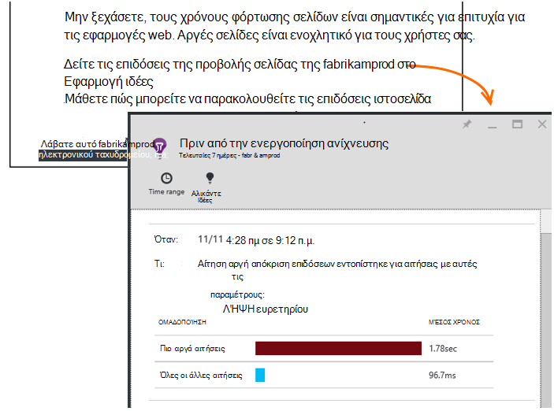

<properties 
    pageTitle="Ιδέες εφαρμογής: Διαγνωστικά πριν από την ενεργοποίηση απόδοσης | Microsoft Azure" 
    description="Εφαρμογή ιδέες εκτελεί βάθος ανάλυση της τηλεμετρίας την εφαρμογή και σας ειδοποιεί πιθανών προβλημάτων." 
    services="application-insights" 
    documentationCenter="windows"
    authors="antonfrMSFT" 
    manager="douge"/>

<tags 
    ms.service="application-insights" 
    ms.workload="tbd" 
    ms.tgt_pltfrm="ibiza" 
    ms.devlang="na" 
    ms.topic="article" 
    ms.date="08/31/2016" 
    ms.author="awills"/>

#  Διαγνωστικά πριν από την ενεργοποίηση απόδοσης

*Εφαρμογή ιδέες είναι σε προεπισκόπηση.*

[Visual Studio εφαρμογή ιδέες](app-insights-overview.md) εκτελεί βάθος ανάλυση των σας τηλεμετρίας εφαρμογή και μπορεί να σας ειδοποιήσει σχετικά με πιθανά προβλήματα επιδόσεων. Πιθανώς διαβάζετε αυτό επειδή έχετε λάβει ένα από τα πριν από την ενεργοποίηση ειδοποιήσεων μέσω ηλεκτρονικού ταχυδρομείου. 

Αυτή η δυνατότητα απαιτεί το πρόγραμμα Εγκατάστασης δεν υπάρχει και είναι ενεργή αυτόματα κατά την εφαρμογή σας δημιουργεί αρκετό τηλεμετρίας.

## Τι είναι τα Διαγνωστικά έγκαιρη επιδόσεων;

Διαγνωστικά πριν από την ενεργοποίηση απόδοσης ανακαλύψει ασυνήθιστο μοτίβα απόδοσης στην εφαρμογή σας, από την ανάλυση του τηλεμετρίας που στέλνει την εφαρμογή σας σε εφαρμογή ιδέες. 

Συγκεκριμένα, εντοπίζει προβλήματα επιδόσεων που επηρεάζουν μόνο ορισμένα από τους χρήστες σας ή μόνο επηρεάζουν τους χρήστες σε ορισμένες περιπτώσεις.

Για παράδειγμα, αυτό μπορεί να ειδοποιήσει εάν σελίδες σας εφαρμογή πολύ πιο αργά φόρτωση σε έναν τύπο προγράμματος περιήγησης από άλλους χρήστες, ή εάν αιτήσεις εξυπηρέτησης με πιο αργά από ένα συγκεκριμένο διακομιστή. Μπορούν επίσης να εντοπίσουν προβλήματα που σχετίζονται με τους συνδυασμούς ιδιότητες, όπως φορτώνεται η σελίδα αργή σε μία γεωγραφική περιοχή σε συγκεκριμένες ώρες της ημέρας.

Ανωμαλίες όπως αυτά είναι πολύ δύσκολη για τον εντοπισμό μόνο με έλεγχο των δεδομένων, αλλά είναι πιο κοινές από αυτές μπορεί να σκεφτείτε. Συχνά τους μόνο επιφάνειας όταν προσφυγής τους πελάτες σας. Από αυτό το χρονικό διάστημα, είναι πολύ αργά: τους χρήστες που επηρεάζονται ήδη εναλλαγή σε ανταγωνιστές σας!

Προς το παρόν, μας αλγόριθμους Εξετάστε τους χρόνους φόρτωσης σελίδων, χρόνους απόκρισης αίτηση στο διακομιστή και εξάρτησης χρόνους απόκρισης.  

Δεν χρειάζεται να ορίσετε οποιαδήποτε όρια ή να ρυθμίσετε τις παραμέτρους κανόνων. Μηχανικής εκμάθησης και αλγορίθμων εξόρυξης δεδομένων που χρησιμοποιούνται για τον εντοπισμό αφύσικη μοτίβα. 

Είμαστε πολύ πρόθυμοι να έχετε τα σχόλιά σας. Πείτε μας πώς σας βοηθά να, πώς μπορούμε να το βελτιώσουμε πριν από την ενεργοποίηση εντοπισμού και ποιες πρόσθετες δυνατότητες που θέλετε να προσθέσετε. Μπορείτε να στείλετε τα σχόλιά σας μέσω αποστολή χαμόγελου/συνοφρυώματος στην πύλη του ή να ηλεκτρονικού ταχυδρομείου να AppInsightsML@microsoft.com. 

## Σχετικά με την ειδοποίηση πριν από την ενεργοποίηση

* *Γιατί πρέπει να λάβει το μήνυμα ηλεκτρονικού ταχυδρομείου;*
 * Πριν από την ενεργοποίηση εντοπισμού ανάλυση τηλεμετρίας την εφαρμογή σας σταλεί σε εφαρμογή ιδέες και εντόπισε ένα ζήτημα επιδόσεων στην εφαρμογή σας. 
* *Ειδοποίηση σημαίνει σίγουρα έχω κάποιο πρόβλημα;*
 * Όχι. Είναι απλώς μια πρόταση για κάτι που μπορεί να θέλετε να δείτε περισσότερα στενά. 
* *Τι πρέπει να κάνω;*
 * [Εξετάστε τα δεδομένα που παρουσιάζονται](#responding-to-an-alert). Χρησιμοποιήστε την Εξερεύνηση μετρικά να εξετάσετε τις επιδόσεις διάρκεια του χρόνου και Διερεύνηση επιπλέον μετρική. Χρήση της αναζήτησης για να φιλτράρεται συγκεκριμένα συμβάντα που σας βοηθούν να προσδιορίσετε την αιτία ριζικό κατάλογο. 
* *Επομένως, guys κοιτάξετε τα δεδομένα μου;*
 * Όχι. Η υπηρεσία είναι εντελώς αυτόματες. Μόνο μπορείτε να λάβετε τις ειδοποιήσεις. Τα δεδομένα σας είναι [ιδιωτική](app-insights-data-retention-privacy.md).

## Η διαδικασία ανίχνευσης

* *Τι είδους ανωμαλίες επιδόσεων εντοπίζονται;*
 * Τα μοτίβα που μπορείτε να το βρείτε χρονοβόρα για να ελέγξετε για τον εαυτό σας. Για παράδειγμα, κακή απόδοση σε έναν συγκεκριμένο συνδυασμό θέση, την ώρα της ημέρας και την πλατφόρμα.
* *Που αναλύετε όλα τα δεδομένα που συλλέγονται από εφαρμογή ιδέες;*
 * Δεν αυτήν τη στιγμή. Προς το παρόν, ανάλυση αίτηση χρόνος απόκρισης, χρόνος απόκρισης εξάρτηση και σελίδας χρόνος φόρτωσης. Ανάλυση των πρόσθετων μετρήσεων σύντομα διαθέσιμο. 
* *Μπορώ να δημιουργήσω δικές μου ανωμαλία κανόνες εντοπισμού;*
 * Όχι ακόμα. Ωστόσο, μπορείτε να κάνετε:
 * [Ρύθμιση ειδοποιήσεων](app-insights-alerts.md) που σας ενημερώνουν πότε ένα μετρικό τέμνει μια οριακή.)
 * [Εξαγωγή τηλεμετρίας](app-insights-export-telemetry.md) σε μια [βάση δεδομένων](app-insights-code-sample-export-sql-stream-analytics.md) ή [να PowerBI](app-insights-export-power-bi.md) ή [άλλα](app-insights-code-sample-export-telemetry-sql-database.md) εργαλεία, όπου μπορείτε να αναλύσετε το μόνοι σας.
* *Πόσο συχνά πραγματοποιείται η ανάλυση;*
 * Μπορούμε να εκτελέσουμε την ανάλυση καθημερινά σε το τηλεμετρίας από την προηγούμενη ημέρα.
* * Ώστε αυτή αντικαθιστούν [μετρικό ειδοποιήσεις](app-insights-alerts.md);
 * Όχι.  Δεν θα σας να δεσμεύσετε για τον εντοπισμό κάθε συμπεριφορά που μπορείτε να αφύσικη.

## Πώς να διερευνήσουμε την των θεμάτων που προκύπτουν

Ανοίξτε την έκθεση διαγνωστικών από το μήνυμα ηλεκτρονικού ταχυδρομείου ή από τη λίστα ανωμαλίες.

* **Όταν** εμφανίζει την ώρα που εντοπίστηκε το ζήτημα.
* **Τι** περιγράφει
 * Το πρόβλημα που εντοπίστηκε;
 * Τα χαρακτηριστικά του συνόλου των συμβάντων που που βρέθηκαν εμφανίζεται η συμπεριφορά πρόβλημα.
* Ο πίνακας συγκρίνει το σύνολο κακή εκτέλεση με τη συμπεριφορά μέσος όρος όλων των άλλων συμβάντων.

Κάντε κλικ στις συνδέσεις για να ανοίξετε Explorer μετρικό και αναζήτηση σε σχετικές αναφορές, φιλτραρισμένων το χρόνο και τις ιδιότητες του συνόλου αργές επιδόσεις.

Τροποποιήστε το εύρος χρόνου και φίλτρα για να εξερευνήσετε το τηλεμετρίας.

## Πώς μπορώ να βελτιώσω επιδόσεων;

Αργή και αποτυχίας αποκρίσεις είναι ένα από τα προβλήματα μεγαλύτερων για τους χρήστες της τοποθεσίας web, όπως γνωρίζετε από τη δική σας εμπειρία. Επομένως, είναι σημαντικό να αντιμετωπίζουν τα ζητήματα.

### Διαλογής

Πρώτα, έχει σημασία; Εάν μια σελίδα είναι πάντα αργή για τη φόρτωση, αλλά μόνο 1% των χρηστών της τοποθεσίας σας έχουν ποτέ να το δείτε, ίσως έχετε πιο σημαντικά πράγματα που πρέπει να σκεφτείτε. Από την άλλη πλευρά, εάν μόνο 1% των χρηστών, ανοίξτε το, αλλά παρουσιάζει εξαιρέσεις κάθε φορά, που μπορεί να είναι αξίζει Διερεύνηση.

Χρησιμοποιήσετε τη δήλωση επίδραση σε μήνυμα ηλεκτρονικού ταχυδρομείου ως έναν γενικό οδηγό, αλλά έχετε υπόψη ότι δεν είναι ολόκληρο το κείμενο. Συλλογή άλλες αποδείξεις για επιβεβαίωση.

Εξετάστε τις παραμέτρους του ζητήματος. Εάν είναι εξαρτάται από το Γεωγραφία, ρύθμιση [διαθεσιμότητα δοκιμές](app-insights-monitor-web-app-availability.md) , συμπεριλαμβανομένων αυτήν την περιοχή: μπορεί απλώς να υπάρχουν ζητήματα δικτύου σε αυτήν την περιοχή. 

### Διάγνωση φορτώσεις σελίδων αργή 

Πού βρίσκεται το πρόβλημα; Είναι αργή για να απαντήσετε στο διακομιστή, είναι πολύ μεγάλη τη σελίδα ή διαθέτει το πρόγραμμα περιήγησης για να το κάνετε πολλή δουλειά για να το εμφανίσετε;

Ανοίξτε το blade μετρικό προγράμματα περιήγησης. Η [Τμηματική εμφάνισης του χρόνου φόρτωσης του προγράμματος περιήγησης σελίδας](app-insights-javascript.md#explore-your-data) δείχνει πού πρόκειται την ώρα. 

* Εάν **Στείλετε διάρκεια αίτησης** είναι υψηλή, είτε ο διακομιστής ανταποκρίνεται αργά ή η αίτηση είναι μια καταχώρηση με πολλά δεδομένα. Εξετάστε τα [μετρικών απόδοσης](app-insights-web-monitor-performance.md#metrics) για να εξερευνήσετε χρόνους απόκρισης. 
* Ρύθμιση του [εξάρτηση παρακολούθησης](app-insights-dependencies.md) για να δείτε εάν είναι του βάρους οφείλεται σε εξωτερικές υπηρεσίες ή τη βάση δεδομένων.
* Εάν **Λαμβάνετε απόκριση** είναι κύριο λόγο, σελίδα σας και τα εξαρτημένα τμήματά - JavaScript, CSS, εικόνες και ούτω καθεξής (αλλά δεν έχει φορτωθεί ασύγχρονα δεδομένα) είναι μεγάλες. Ρύθμιση μιας [διαθεσιμότητα δοκιμή](app-insights-monitor-web-app-availability.md)και θα πρέπει να ορίσετε την επιλογή για να φορτώσετε εξαρτώμενα τμήματα. Όταν λάβετε ορισμένα αποτελέσματα, ανοίξτε τις λεπτομέρειες ενός αποτελέσματος και ανάπτυξη, για να δείτε τους χρόνους φόρτωσης διαφορετικά αρχεία.
* Υψηλή **επεξεργασίας προγράμματος-πελάτη ώρας** προτείνει δέσμες ενεργειών εκτελούνται αργά. Εάν το λόγο που δεν είναι εμφανή, μπορείτε να προσθέσετε κάποια κώδικα χρονισμός και στείλτε τις ώρες στο trackMetric κλήσεις.

### Βελτίωση της αργές σελίδες

Υπάρχει μια πλήρη συμβουλές για βελτίωση της σας αποκρίσεις διακομιστή και τους χρόνους φόρτωσης σελίδων, έτσι δεν θα προσπαθήσουμε να επαναλάβετε την όλα εδώ web. Ακολουθούν μερικές συμβουλές που θα γνωρίζετε ήδη σχετικά με το, απλώς για να έχετε υπόψη:

* Αργή τη φόρτωση λόγω μεγάλο αρχεία: ασύγχρονη φόρτωση των δεσμών ενεργειών και άλλα τμήματα. Χρήση δέσμης ενεργειών. Διασπάσετε την κύρια σελίδα σε γραφικά στοιχεία που φορτώνονται ξεχωριστά τα δεδομένα τους. Μην στέλνετε απλό παλιά HTML για μεγάλους πίνακες: Χρησιμοποιήστε μια δέσμη ενεργειών για να ζητήσετε τα δεδομένα ως JSON ή άλλη συμπυκνωμένη μορφή και, στη συνέχεια, γέμισμα τον πίνακα στη θέση. Υπάρχουν εξαιρετική πλαισίων για να σας βοηθήσει με όλα αυτά. (Αυτές επίσης συνεπάγεται μεγάλο δέσμες ενεργειών, βέβαια.)
* Επιβραδύνει εξαρτήσεις διακομιστή: μπορείτε να τις γεωγραφικές θέσεις των στοιχείων που διαθέτετε. Για παράδειγμα, εάν χρησιμοποιείτε το Azure, βεβαιωθείτε ότι το διακομιστή web και τη βάση δεδομένων είναι στην ίδια περιοχή. Ερωτήματα ανάκτηση περισσότερων πληροφοριών από αυτήν που χρειάζονται; Θα προσωρινή αποθήκευση ή δέσμης για βοήθεια;
* Θέματα δυναμικότητας: εξετάστε τα μετρικά διακομιστή φορές απόκρισης και απαριθμεί αίτηση. Εάν χρόνους απόκρισης κορυφαίο δυσανάλογη με κορυφών καταμετρά αίτηση, είναι πιθανό ότι έχουν επεκταθεί διακομιστές σας. 

## Μηνύματα ηλεκτρονικού ταχυδρομείου ειδοποίησης

* *Πρέπει να διαθέτω για να εγγραφείτε για αυτήν την υπηρεσία προκειμένου να λαμβάνουν τις ειδοποιήσεις;*
 * Όχι. Μας bot περιοδικά έρευνες τα δεδομένα από όλους τους χρήστες της εφαρμογής ιδέες και αποστέλλει ειδοποιήσεις αν εντοπίσει ζητήματα.
* *Μπορώ να κατάργηση εγγραφής ή να λάβετε τις ειδοποιήσεις που αποστέλλονται σε τους συναδέλφους μου αντί για αυτό;*
 * Κάντε κλικ στη σύνδεση κατάργηση ηλεκτρονικού ταχυδρομείου ή την ειδοποίηση. 
 
    Αυτήν τη στιγμή που σας έστειλε με εκείνα που έχουν [δικαιώματα εγγραφής στον πόρο εφαρμογής ιδέες](app-insights-resources-roles-access-control.md).

    Μπορείτε επίσης να επεξεργαστείτε τη λίστα παραληπτών ρυθμίσεις στο το blade πριν από την ενεργοποίηση εντοπισμού.
* *Δεν θέλω να γίνει υπερχείλιση με αυτά τα μηνύματα.*
 * Περιορίζονται σε μία ανά ημέρα, με το ζήτημα πιο σχετικούς που θα σας αναφερθούν σχετικά με την έχετε ακόμη. Δεν θα λάβετε επανάληψης οποιουδήποτε μηνύματος.
* *Εάν να μην κάνετε τίποτα, θα λαμβάνω υπενθύμισης;*
 * Όχι, λαμβάνετε ένα μήνυμα σχετικά με κάθε θέμα μόνο μία φορά. 
* *Έχασα το μήνυμα ηλεκτρονικού ταχυδρομείου. Πού μπορώ να βρω τις ειδοποιήσεις στην πύλη του;*
 * Στην εφαρμογή ιδέες Επισκόπηση της εφαρμογής, κάντε κλικ στο πλακίδιο **Πριν από την ενεργοποίηση εντοπισμού** . Θα έχετε τη δυνατότητα για να βρείτε όλες τις ειδοποιήσεις προς τα επάνω στο φόντο 7 ημέρες.

## Επόμενα βήματα

Αυτά τα εργαλεία διαγνωστικών σας βοηθήσει να ελέγξετε την τηλεμετρίας από την εφαρμογή:

* [Εξερεύνηση μετρικό](app-insights-metrics-explorer.md)
* [Εξερεύνηση αναζήτησης](app-insights-diagnostic-search.md)
* [Ανάλυση - γλώσσα ισχυρή ερωτημάτων](app-insights-analytics-tour.md)

Έγκαιρη τις ανιχνεύσεις είναι εντελώς αυτόματες. Όμως, ίσως θέλετε να ορίσετε ορισμένες περισσότερες ειδοποιήσεις;

* [Μη αυτόματη ρύθμιση παραμέτρων ειδοποιήσεων μετρικό](app-insights-alerts.md)
* [Διαθεσιμότητα web δοκιμές](app-insights-monitor-web-app-availability.md) 

