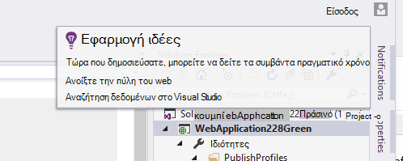

<properties
    pageTitle="Σημειώσεις έκδοσης για επέκταση Visual Studio για ανάλυση για προγραμματιστές"
    description="Τις πιο πρόσφατες ενημερώσεις για εργαλεία του Visual Studio για ανάλυση προγραμματιστής."
    services="application-insights"
    documentationCenter=""
    authors="acearun"
    manager="douge"/>
<tags
    ms.service="application-insights"
    ms.workload="tbd"
    ms.tgt_pltfrm="ibiza"
    ms.devlang="na"
    ms.topic="article"
    ms.date="06/09/2016"
    ms.author="acearun"/>

# Σημειώσεις έκδοσης για εργαλεία ανάλυσης για προγραμματιστές
Τι νέο υπάρχει: εφαρμογή ιδέες και HockeyApp ανάλυσης στο Visual Studio.
## Έκδοση 7.0
### Τάσεις ιδέες εφαρμογή του Visual Studio
Visual Studio εφαρμογή ιδέες είναι ένα νέο εργαλείο στο Visual Studio που μπορείτε να χρησιμοποιήσετε για να σας βοηθήσει να αναλύσετε τον τρόπο λειτουργίας της εφαρμογής σας μέσα στο χρόνο. Για να ξεκινήσετε, το κουμπί γραμμής εργαλείων **Εφαρμογής ιδέες** ή στο παράθυρο Αναζήτηση ιδέες εφαρμογής, επιλέξτε **Εξερεύνηση Τηλεμετρίας τάσεις**. Ή, στο μενού **Προβολή** , κάντε κλικ στην επιλογή **Other των Windows**και, στη συνέχεια, κάντε κλικ στην επιλογή **Εφαρμογή ιδέες τάσεις**. Επιλέξτε μία από τις πέντε κοινά ερωτήματα για να ξεκινήσετε. Μπορείτε να αναλύσετε διαφορετικά σύνολα δεδομένων που βασίζονται σε τύπους τηλεμετρίας, ώρα περιοχές και άλλες ιδιότητες. Για να βρείτε ανωμαλίες στα δεδομένα σας, επιλέξτε μία από τις επιλογές ανωμαλία στο την αναπτυσσόμενη λίστα **Τύπος προβολής** . Οι επιλογές φιλτραρίσματος στο κάτω μέρος του παραθύρου διευκολύνουν την τελειοποιήστε στο συγκεκριμένο υποσύνολα τηλεμετρίας σας.

### Εξαιρέσεις σε CodeLens
Εξαίρεση τηλεμετρίας εμφανίζεται τώρα στο CodeLens. Εάν έχετε συνδέσει το έργο σας με την υπηρεσία εφαρμογής ιδέες, θα δείτε τον αριθμό των εξαιρέσεις που έχουν προκύψει σε κάθε μέθοδο παραγωγή τις τελευταίες 24 ώρες. Από το CodeLens, μπορείτε να μεταπηδήσετε αναζήτησης ή τάσεις για να εξετάσετε τις εξαιρέσεις με περισσότερες λεπτομέρειες.

### Υποστήριξη πυρήνα ASP.NET
Εφαρμογή ιδέες υποστηρίζει πλέον έργα RC2 πυρήνα ASP.NET στο Visual Studio. Μπορείτε να προσθέσετε ιδέες εφαρμογής σε νέα έργα RC2 πυρήνα ASP.NET από το παράθυρο διαλόγου **Νέο έργο** , όπως το παρακάτω στιγμιότυπο οθόνης. Εναλλακτικά, μπορείτε να προσθέσετε σε ένα υπάρχον έργο, κάντε δεξί κλικ στο έργο στην Εξερεύνηση λύσεων και, στη συνέχεια, κάντε κλικ στην επιλογή **Προσθήκη εφαρμογής ιδέες Τηλεμετρίας**.

ASP.NET 5 RC1 και έργα RC2 πυρήνα ASP.NET έχουν επίσης νέα υποστήριξη στο παράθυρο διαγνωστικά εργαλεία. Θα δείτε εφαρμογή ιδέες συμβάντα όπως αιτήσεις και εξαιρέσεις από την εφαρμογή ASP.NET ενώ εντοπισμό σφαλμάτων σε τοπικά στον Υπολογιστή σας. Από κάθε συμβάν, κάντε κλικ στο κουμπί **Αναζήτηση** για να κάνετε Διερεύνηση για περισσότερες πληροφορίες.

### HockeyApp για τις εφαρμογές καθολικής των Windows
Εκτός από βήτα κατανομή και χρήστη σχόλια, HockeyApp παρέχει symbolicated σφάλμα αναφοράς για τις εφαρμογές σας γενικής χρήσης των Windows. Έχουμε κάνει ακόμα πιο εύκολη για να προσθέσετε το SDK HockeyApp: κάντε δεξί κλικ στο έργο σας καθολικής Windows και, στη συνέχεια, κάντε κλικ στην επιλογή **Εφαρμογή επί πάγου - Ενεργοποίηση ανάλυσης παρουσιάσει σφάλμα**. Αυτό εγκαθιστά το SDK, ρυθμίζει συλλογής σφάλμα και διατάξεις HockeyApp πόρου στο cloud, χωρίς αποστολή της εφαρμογής σας στην υπηρεσία HockeyApp.

Άλλες νέες δυνατότητες:

* Έχουμε κάνει την εμπειρία αναζήτησης ιδέες εφαρμογή ταχύτερου και πιο διαισθητική. Τώρα, περιοχές χρόνου και φίλτρα λεπτομερειών εφαρμόζονται αυτόματα κατά την επιλογή τους.
* Επίσης στην εφαρμογή αναζήτηση ιδέες, τώρα υπάρχει μια επιλογή για να μεταπηδήσετε τον κώδικα απευθείας από την αίτηση τηλεμετρίας.
* Έχουμε κάνει βελτιώσεις στην εμπειρία HockeyApp εισόδου.
* Στα εργαλεία διαγνωστικών, εμφανίζονται πληροφορίες τηλεμετρίας παραγωγής για εξαιρέσεις.

## Έκδοση 5.2
Συνεχίζουμε να ικανοποιημένοι ανακοινώνουμε η εισαγωγή σενάρια HockeyApp στο Visual Studio. Η πρώτη ενοποίηση είναι στην κατανομή βήτα καθολικής Windows εφαρμογών και εφαρμογές φόρμες των Windows από μέσα σε Visual Studio.

Με κατανομή βήτα, να αποστείλετε παλαιότερες εκδόσεις από τις εφαρμογές σας στο HockeyApp για διανομή σε ένα υποσύνολο επιλεγμένων πελατών ή στους υπεύθυνους δοκιμών. Κατανομή βήτα, σε συνδυασμό με HockeyApp σφάλμα χρήστη και συλλογής σχολίων δυνατότητες, μπορούν να σας παρέχει χρήσιμες πληροφορίες σχετικά με την εφαρμογή σας πριν να κάνετε μια ευρεία κυκλοφορίας. Μπορείτε να χρησιμοποιήσετε αυτές τις πληροφορίες για την αντιμετώπιση προβλημάτων με την εφαρμογή σας, ώστε να μπορείτε να αποφύγετε ή να ελαχιστοποιήσετε μελλοντικά προβλήματα, όπως χαμηλή εφαρμογή χαρακτηρισμών, αρνητικά σχόλια και ούτω καθεξής.

Ανατρέξτε στο θέμα πόσο απλό είναι να αποστείλετε δημιουργεί για κατανομή βήτα από μέσα σε Visual Studio.
### Καθολική Windows εφαρμογές
Το μενού περιβάλλοντος για έναν κόμβο Windows καθολική εφαρμογή έργου περιλαμβάνει τώρα μια επιλογή για να αποστείλετε το Δόμηση στο HockeyApp.

Επιλέξτε το στοιχείο και το HockeyApp ανοίγει το πλαίσιο διαλόγου αποστολή. Θα χρειαστείτε ένα λογαριασμό HockeyApp για να αποστείλετε το Δόμηση. Εάν είστε νέος χρήστης, μην ανησυχείτε. Δημιουργία λογαριασμού είναι μια απλή διαδικασία.

Όταν είστε συνδεδεμένοι, θα δείτε τη φόρμα αποστολής στο παράθυρο διαλόγου.

Επιλέξτε το περιεχόμενο για την αποστολή (ένα αρχείο .appxbundle ή .appx) και, στη συνέχεια, επιλέξτε Επιλογές κυκλοφορίας του οδηγού. Προαιρετικά, μπορείτε να προσθέσετε σημειώσεις έκδοσης στην επόμενη σελίδα. Επιλέξτε **Τέλος** για να ξεκινήσει η αποστολή.

Όταν ολοκληρωθεί η αποστολή, εμφανίζεται μια ειδοποίηση HockeyApp με επιβεβαίωσης και μια σύνδεση για την εφαρμογή στην πύλη του HockeyApp.

Αυτό είναι! Έχετε αποστείλει απλώς ένα build για κατανομή βήτα με λίγα μόνο κλικ.

Μπορείτε να διαχειριστείτε την εφαρμογή σας με πολλούς τρόπους στην πύλη του HockeyApp. Αυτό περιλαμβάνει Προσκαλώντας τους χρήστες, προβολή αναφορών σφαλμάτων και σχολίων, αλλαγή "Λεπτομέρειες" και ούτω καθεξής.

Ανατρέξτε στο άρθρο της [Γνωσιακής βάσης HockeyApp](http://support.hockeyapp.net/kb/app-management-2) για περισσότερες λεπτομέρειες σχετικά με τη Διαχείριση εφαρμογών.

### Windows φορμών εφαρμογές
Το μενού περιβάλλοντος για μια φόρμα Windows κόμβο του έργου περιλαμβάνει τώρα μια επιλογή για να αποστείλετε το Δόμηση στο HockeyApp.

Έτσι ανοίγει το παράθυρο διαλόγου Αποστολή HockeyApp, το οποίο είναι παρόμοια με αυτήν σε μια εφαρμογή για καθολική των Windows.

Σημείωση ένα νέο πεδίο σε αυτόν τον οδηγό, για να καθορίσετε την έκδοση της εφαρμογής. Καθολική Windows εφαρμογές, τις πληροφορίες συμπληρώνεται από το δηλωτικό. Εφαρμογές φόρμες των Windows, Δυστυχώς, δεν έχετε ένα ισοδύναμο με αυτήν τη δυνατότητα. Θα πρέπει να καθορίσετε με μη αυτόματο τρόπο.

Το υπόλοιπο της ροής της είναι παρόμοια με την καθολική Windows εφαρμογές: Επιλέξτε Δόμηση και αφήστε επιλογές, προσθέστε την έκδοση σημειώσεις, κάντε αποστολή και διαχείριση στην πύλη του HockeyApp.

Είναι τόσο απλή όσο η που. Δοκιμάστε και επιτρέψτε μας γνώμη σας.
## Έκδοση 4.3
### Αναζήτηση τηλεμετρίας από περιόδους λειτουργίας τοπικό εντοπισμού σφαλμάτων
Με αυτήν την έκδοση, μπορείτε να αναζητήσετε τώρα για ιδέες εφαρμογής τηλεμετρίας που δημιουργούνται στην περίοδο λειτουργίας εντοπισμού σφαλμάτων Visual Studio. Πριν, μπορείτε να χρησιμοποιήσετε αναζήτησης μόνο αν έχετε καταχωρήσει την εφαρμογή σας με εφαρμογή ιδέες. Τώρα, την εφαρμογή σας μόνο πρέπει να έχει το SDK ιδέες εφαρμογή εγκατεστημένο για να αναζητήσετε τοπικό τηλεμετρίας.

Εάν έχετε μια εφαρμογή του ASP.NET με SDK ιδέες για την εφαρμογή, ακολουθήστε τα παρακάτω βήματα για να χρησιμοποιήσετε την αναζήτηση.

1. Εντοπισμός σφαλμάτων της εφαρμογής σας.
2. Άνοιγμα αναζήτησης ιδέες εφαρμογής με έναν από τους εξής τρόπους:
    - Στο μενού **Προβολή** , κάντε κλικ στην επιλογή **Άλλες των Windows**και, στη συνέχεια, κάντε κλικ στην επιλογή **Εφαρμογή ιδέες αναζήτησης**.
    - Κάντε κλικ στο κουμπί της γραμμής εργαλείων **Εφαρμογής ιδέες** .
    - Στην Εξερεύνηση λύσεων, αναπτύξτε **ApplicationInsights.config**και, στη συνέχεια, κάντε κλικ στην επιλογή **Αναζήτηση τηλεμετρίας περιόδου λειτουργίας εντοπισμού σφαλμάτων**.
3. Εάν δεν έχετε εγγραφεί με εφαρμογή ιδέες, θα ανοίξει το παράθυρο αναζήτησης σε κατάσταση τηλεμετρίας περιόδου λειτουργίας εντοπισμού σφαλμάτων.
4. Κάντε κλικ στο εικονίδιο **αναζήτησης** για να δείτε τον τοπικό τηλεμετρίας.

## Έκδοση 4.2
Σε αυτήν την έκδοση, έχουμε προσθέσει δυνατοτήτων για να διευκολύνετε την αναζήτηση δεδομένων στο περιβάλλον της συμβάντα, με τη δυνατότητα για να μεταβείτε σε κώδικα από περισσότερες συμβάντα δεδομένων και μια εύκολη εμπειρία για να στείλετε τα δεδομένα σας καταγραφής σε εφαρμογή ιδέες. Αυτή η επέκταση ενημερώνεται κάθε μήνα. Εάν έχετε προσκλήσεις δυνατότητα σχολίων, αποστολή για να aidevtools@microsoft.com.
### Όχι-κάντε κλικ στην επιλογή καταγραφή από την εμπειρία
Εάν χρησιμοποιείτε ήδη NLog, log4net ή System.Diagnostics.Tracing, δεν χρειάζεται να ανησυχείτε σχετικά με τη μετακίνηση όλων των ανιχνεύσεις σας σε εφαρμογή ιδέες. Σε αυτήν την έκδοση, θα σας έχετε ενσωματωμένο η καταγραφή από την εφαρμογή ιδέες προσαρμογέων με την εμπειρία κανονική ρύθμιση παραμέτρων.
Εάν έχετε ήδη ένα από αυτά τα πλαίσια καταγραφής έχει ρυθμιστεί, ενότητα που ακολουθεί περιγράφει τον τρόπο για να το.
**Εάν έχετε ήδη προσθέσει ιδέες εφαρμογής:**
1. Κάντε δεξί κλικ στον κόμβο του έργου, και, στη συνέχεια, κάντε κλικ στην επιλογή **Εφαρμογή ιδέες**και, στη συνέχεια, κάντε κλικ στην επιλογή **Ρύθμιση παραμέτρων εφαρμογής ιδέες**. Βεβαιωθείτε ότι μπορείτε να δείτε την επιλογή για να προσθέσετε το σωστό προσαρμογέα στο παράθυρο Ρύθμιση παραμέτρων.
2. Εναλλακτικά, όταν δημιουργείτε τη λύση, σημειώστε το αναδυόμενο παράθυρο που εμφανίζεται στην επάνω δεξιά γωνία της οθόνης σας και κάντε κλικ στην επιλογή **Ρύθμιση παραμέτρων**.

Όταν έχετε εγκατεστημένο το προσαρμογέα καταγραφής, εκτελέστε την εφαρμογή και βεβαιωθείτε ότι βλέπετε τα δεδομένα στην καρτέλα Εργαλεία διαγνωστικών, ως εξής:

### Μεταπήδηση σε ή βρείτε τον κώδικα όπου αποστέλλεται την ιδιότητα συμβάντος τηλεμετρίας
Με τη νέα έκδοση χρήστης μπορεί να κάνει κλικ σε οποιαδήποτε τιμή συμβάντων λεπτομερειών και θα κάνει αναζήτηση για μια συμβολοσειρά που ταιριάζουν με την τρέχουσα λύση Άνοιγμα. Αποτελέσματα θα εμφανιστούν στο Visual Studio λίστας "Εύρεση αποτελεσμάτων", όπως φαίνεται παρακάτω:

### Νέο παράθυρο αναζήτησης για όταν δεν έχετε εισέλθει
Θα σας έχετε βελτιωμένη την εμφάνιση του παραθύρου αναζήτησης ιδέες εφαρμογή σας βοηθούν να αναζητήσετε τα δεδομένα σας κατά τη διάρκεια της εφαρμογής σας παραγωγής.

### Δείτε όλα τα συμβάντα τηλεμετρίας που σχετίζεται με το συμβάν
Έχουμε προσθέσει μια νέα καρτέλα, με προκαθορισμένα ερωτήματα για όλα τα δεδομένα που σχετίζονται με το συμβάν τηλεμετρίας προβολή στο χρήστη, δίπλα στην καρτέλα Λεπτομέρειες του συμβάντος. Για παράδειγμα, μια αίτηση περιλαμβάνει ένα πεδίο που ονομάζεται **Αναγνωριστικό λειτουργίας**. Κάθε συμβάν που έχει συσχετιστεί με αυτήν την αίτηση έχει την ίδια τιμή για το **Αναγνωριστικό λειτουργίας**. Εάν παρουσιαστεί εξαίρεση ενώ η λειτουργία επεξεργάζεται την αίτηση, την εξαίρεση λαμβάνει το ίδιο Αναγνωριστικό λειτουργία με την αίτηση για να σας διευκολύνουν να βρείτε. Εάν αναζητάτε σε μια πρόσκληση σε, κάντε κλικ στην επιλογή **όλα τηλεμετρίας για αυτήν τη λειτουργία** για να ανοίξετε μια νέα καρτέλα που εμφανίζει τα νέα αποτελέσματα αναζήτησης.

### Εμπρός "και" Ιστορικό πίσω στο πλαίσιο Αναζήτηση
Τώρα μπορείτε να μεταβείτε και πίσω μεταξύ των αποτελεσμάτων αναζήτησης.

## Έκδοση 4.1
Σε αυτήν την έκδοση συνοδεύεται από έναν αριθμό από νέες δυνατότητες και τις ενημερώσεις. Πρέπει να έχετε εγκατεστημένο για να εγκαταστήσετε αυτήν την έκδοση 1 ενημερωμένη έκδοση.

### Μετάβαση από μια εξαίρεση στη μέθοδο σε πηγαίου κώδικα
Τώρα, εάν δεν μπορείτε να προβάλετε εξαιρέσεις από την εφαρμογή παραγωγής στο παράθυρο Αναζήτηση ιδέες εφαρμογή, μπορείτε να μεταβείτε σε τη μέθοδο στον κώδικά σας όπου εμφανίζεται η εξαίρεση. Μόνο πρέπει να έχετε το σωστό έργο φόρτωση και εφαρμογή ιδέες αναλαμβάνει τα υπόλοιπα! (Για να μάθετε περισσότερα σχετικά με το παράθυρο αναζήτησης ιδέες εφαρμογής, δείτε τις σημειώσεις έκδοσης για την έκδοση 4.0 στις ενότητες που ακολουθούν.)

Πώς λειτουργεί αυτό; Μπορείτε να χρησιμοποιήσετε εφαρμογές ιδέες αναζήτησης, ακόμα και όταν δεν είναι ανοιχτό μια λύση. Στην περιοχή ανίχνευση στοίβας εμφανίζει ένα μήνυμα πληροφοριών και πολλά στοιχεία στην ανίχνευση στοίβας δεν είναι διαθέσιμες.

Εάν οι πληροφορίες αρχείου είναι διαθέσιμες, ορισμένα στοιχεία μπορεί να είναι συνδέσεις, αλλά στο στοιχείο πληροφορίες λύση θα εξακολουθούν να είναι ορατά.

Εάν κάνετε κλικ στην υπερ-σύνδεση, θα μπορείτε να μεταβείτε στη θέση του την επιλεγμένη μέθοδο στον κώδικά σας. Μπορεί να υπάρχει διαφορά στον αριθμό έκδοσης, αλλά τη δυνατότητα, για να μεταπηδήσετε στη σωστή έκδοση του κώδικα, να παραδίδεται σε νεότερες εκδόσεις.

### Νέα σημεία εισόδου στο πλαίσιο Αναζήτηση εμπειρία στην Εξερεύνηση λύσεων
Τώρα, μπορείτε να αποκτήσετε πρόσβαση για αναζήτηση μέσω Εξερεύνηση λύσεων.

### Εμφανίζει μια ειδοποίηση όταν η δημοσίευση έχει ολοκληρωθεί
Ένα αναδυόμενο παράθυρο διαλόγου εμφανίζεται όταν δημοσιευτεί το project online, ώστε να μπορείτε να προβάλετε τα δεδομένα σας ιδέες εφαρμογή στο παραγωγής.

## Έκδοση 4.0

### Αναζήτηση ιδέες εφαρμογή δεδομένα από το Visual Studio
Όπως τη λειτουργία αναζήτησης στην πύλη εφαρμογής ιδέες, τώρα στο Visual Studio μπορείτε να φιλτράρετε και αναζήτηση σε τύπους συμβάντων, τιμές ιδιοτήτων και κείμενο και, στη συνέχεια, έλεγχος μεμονωμένων συμβάντα.

### Ανατρέξτε στο θέμα δεδομένα που προέρχονται από τον τοπικό υπολογιστή στο διαγνωστικά εργαλεία

Μπορείτε να προβάλετε τις τηλεμετρίας, εκτός από άλλα δεδομένα εντοπισμού σφαλμάτων, στη σελίδα εργαλεία διαγνωστικών του Visual Studio. Υποστηρίζεται μόνο διαίρεσης 4,5 ASP.NET.

### Προσθήκη του SDK στο έργο σας χωρίς να πραγματοποιήσετε είσοδο στο Azure

Δεν χρειάζεται πλέον να εισέλθετε στο Azure για να προσθέσετε πακέτα εφαρμογή ιδέες για το έργο σας, είτε μέσω του παραθύρου διαλόγου **Νέο έργο** ή από το μενού περιβάλλοντος του έργου. Εάν δεν μπορείτε να εισέλθετε, SDK της θα εγκατασταθούν και θα ρυθμιστεί για την αποστολή τηλεμετρίας στην πύλη του ως πριν από. Εάν δεν μπορείτε να εισέλθετε, το SDK θα προστεθεί στο έργο σας και θα δημιουργήσει τηλεμετρίας για την ενότητα διαγνωστικών. Μπορείτε να ρυθμίσετε τις παραμέτρους του αργότερα αν θέλετε.

### Υποστήριξη συσκευών

Στο *Connect(),* 2015, θα σας [ανακοινώθηκε](https://azure.microsoft.com/blog/deep-diagnostics-for-web-apps-with-application-insights/) ότι μας εμπειρία κινητές συσκευές για προγραμματιστές για συσκευές είναι HockeyApp. HockeyApp σάς βοηθά να κατανομή βήτα εκδόσεις για να σας στους υπεύθυνους δοκιμών, συλλογή και την ανάλυση όλα παρουσιάζει σφάλμα από την εφαρμογή και συλλογή σχολίων απευθείας από τους πελάτες σας.
HockeyApp υποστηρίζει την εφαρμογή σας σε οποιαδήποτε πλατφόρμα που επιλέγετε για να δημιουργήσετε, είτε πρόκειται για iOS, Android, ή Windows ή μια λύση πλατφόρμες όπως Xamarin, Cordova ή ενότητας.

Σε μελλοντικές εκδόσεις της εφαρμογής ιδέες επέκτασης, θα σας θα Παρουσιάστε μια πιο ολοκληρωμένη εμπειρία μεταξύ HockeyApp και του Visual Studio. Προς το παρόν, μπορείτε να ξεκινήσετε με HockeyApp, απλώς προσθέτοντας την αναφορά NuGet. Ανατρέξτε στην [τεκμηρίωση](http://support.hockeyapp.net/kb/client-integration-windows-and-windows-phone) για περισσότερες πληροφορίες.
