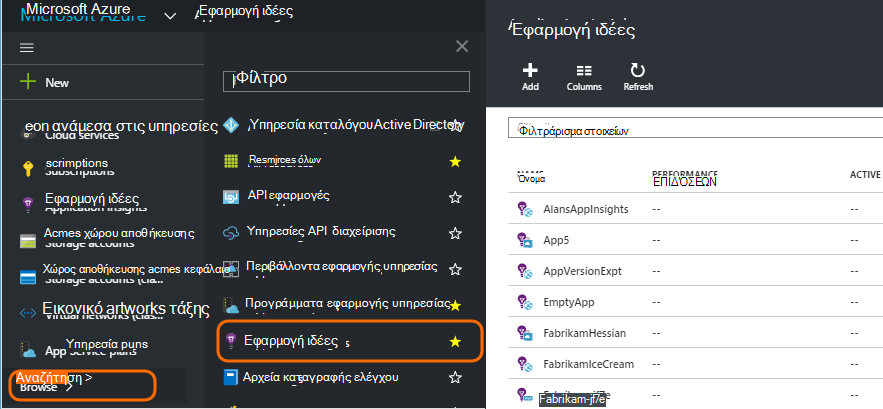
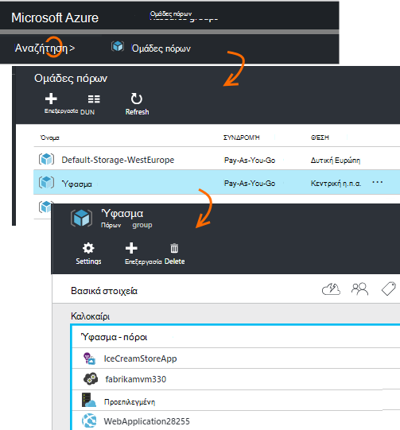
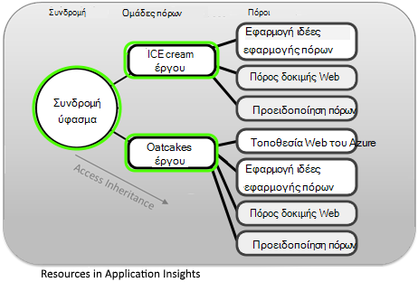
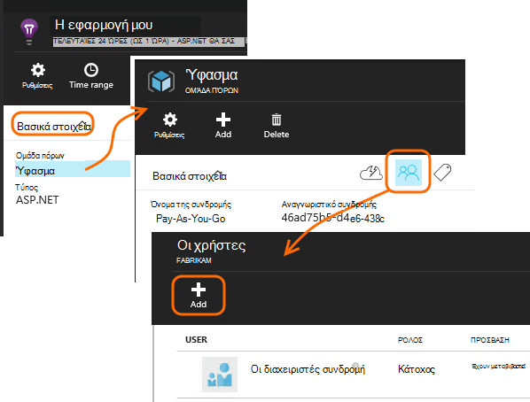
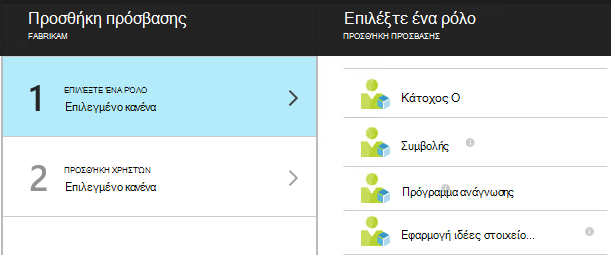
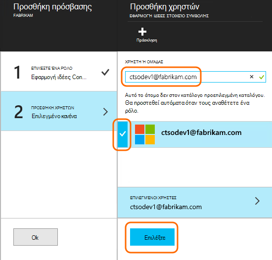

<properties
    pageTitle="Πόροι, τους ρόλους και έλεγχος πρόσβασης στο ιδέες εφαρμογής"
    description="Οι κάτοχοι, οι συνεργάτες και οι αναγνώστες του ιδέες της εταιρείας σας."
    services="application-insights"
    documentationCenter=""
    authors="alancameronwills"
    manager="douge"/>

<tags
    ms.service="application-insights"
    ms.workload="tbd"
    ms.tgt_pltfrm="ibiza"
    ms.devlang="na"
    ms.topic="article"
    ms.date="05/07/2016"
    ms.author="awills"/>

# Πόροι, ρόλους και έλεγχος πρόσβασης στο ιδέες εφαρμογής

Μπορείτε να ελέγξετε ποιος έχει ανάγνωσης και ενημέρωση πρόσβαση στα δεδομένα σας στο Visual Studio [Ιδέες εφαρμογής][start], χρησιμοποιώντας [τον έλεγχο πρόσβασης βάσει ρόλων στο Microsoft Azure](../active-directory/role-based-access-control-configure.md).

> [AZURE.IMPORTANT] Εκχώρηση πρόσβασης στους χρήστες στην **ομάδα πόρων ή τη συνδρομή** στην οποία ανήκει το πόρο εφαρμογής - δεν στον πόρο ίδια. Να αναθέσει το ρόλο **συμβολής στοιχείο εφαρμογή ιδέες** . Αυτό εξασφαλίζει ενιαίο τον έλεγχο της πρόσβασης στις δοκιμές web και ειδοποιήσεις μαζί με την εφαρμογή του πόρου. [Μάθετε περισσότερα](#access).

## Πόροι, ομάδες και συνδρομών

Πρώτα, κάποιοι ορισμοί:

* **Πόρου** - μια παρουσία μιας υπηρεσίας Microsoft Azure. Τον πόρο εφαρμογής ιδέες συγκεντρώνει, αναλύει και εμφανίζει τα δεδομένα τηλεμετρίας που αποστέλλονται από την εφαρμογή σας.  Άλλοι τύποι πόρων Azure περιλαμβάνουν εφαρμογές web, βάσεις δεδομένων και ΣΠΣ.

    Για να δείτε όλους τους πόρους σας, μεταβείτε στην [Πύλη του Azure][portal], πραγματοποιήστε είσοδο και κάντε κλικ στο κουμπί Αναζήτηση.

    

* [**Ομάδα πόρων** ] [ group] -κάθε πόρο ανήκει σε μία ομάδα. Η ομάδα είναι ένας εύκολος τρόπος για να διαχειριστείτε Σχετικοί πόροι, ιδιαίτερα για έλεγχο πρόσβασης. Για παράδειγμα, σε μία ομάδα πόρων μπορείτε να τοποθετήσετε μια εφαρμογή Web, ένας πόρος εφαρμογής ιδέες για την παρακολούθηση της εφαρμογής και έναν πόρο χώρου αποθήκευσης για να διατηρήσετε τα δεδομένα που έχουν εξαχθεί.

    

* [**Συνδρομή**](https://manage.windowsazure.com) - να χρησιμοποιήσετε την εφαρμογή ιδέες ή άλλους πόρους Azure, συνδέεστε σε μια συνδρομή του Azure. Κάθε ομάδα πόρων ανήκει σε Azure συνδρομή, όπου μπορείτε να επιλέξετε το πακέτο τιμή και, εάν πρόκειται για μια συνδρομή του οργανισμού, επιλέξτε τα μέλη και τα δικαιώματα πρόσβασης.
* [**Λογαριασμός Microsoft** ] [ account] -το όνομα χρήστη και κωδικό πρόσβασης που χρησιμοποιείτε για να εισέλθετε στο Microsoft Azure συνδρομές, XBox Live, Outlook.com και άλλες υπηρεσίες της Microsoft.

## Έλεγχος της πρόσβασης στην ομάδα πόρων

Είναι σημαντικό να κατανοήσετε ότι εκτός από τον πόρο που δημιουργήσατε για την εφαρμογή σας, δεν υπάρχουν επίσης ξεχωριστή κρυφών πόρους για τις ειδοποιήσεις και δοκιμές web. Επισύναψη στην ίδια [ομάδα πόρων](#resource-group) με την εφαρμογή σας. Μπορεί επίσης τοποθετήσατε άλλες υπηρεσίες του Azure στο εκεί, όπως τοποθεσίες Web ή το χώρο αποθήκευσης.

Για να ελέγχετε την πρόσβαση σε αυτούς τους πόρους, επομένως, συνιστάται να:

* Έλεγχος της πρόσβασης σε επίπεδο **ομάδας πόρων ή της συνδρομής** .
* Να αναθέσει το ρόλο **συμβολής στοιχείο ιδέες εφαρμογή** στους χρήστες. Αυτό σας επιτρέπει να επεξεργαστείτε web δοκιμές, ειδοποιήσεις και πόρους εφαρμογής ιδέες, χωρίς να παραχωρήσετε πρόσβαση σε οποιεσδήποτε άλλες υπηρεσίες στην ομάδα.

## Για να παρέχετε πρόσβαση σε άλλο χρήστη

Πρέπει να έχετε δικαιώματα κατόχου για τη συνδρομή ή την ομάδα των πόρων.

Ο χρήστης πρέπει να έχετε ένα [Λογαριασμό Microsoft][account], ή την access για να τον [Εταιρικό λογαριασμό Microsoft](..\active-directory\sign-up-organization.md). Μπορείτε να παρέχετε πρόσβαση σε άτομα, καθώς και σε ομάδες χρηστών που ορίζονται στο Azure Active Directory.

#### Μεταβείτε στην ομάδα πόρων

Προσθέστε το χρήστη εκεί.

Ή μπορείτε να μεταβείτε προς τα επάνω έναν άλλο επίπεδο και να προσθέσετε το χρήστη για τη συνδρομή.

#### Επιλέξτε ένα ρόλο

Ρόλος | Στην ομάδα πόρων
---|---
Κάτοχος | Μπορεί να αλλάξει οτιδήποτε, συμπεριλαμβανομένης της πρόσβασης χρήστη
Συμβολής | Να επεξεργαστείτε όλα τα στοιχεία, συμπεριλαμβανομένων όλων των πόρων
Εφαρμογή στοιχείο ιδέες συμβολής | Να επεξεργαστείτε εφαρμογή ιδέες τους πόρους, δοκιμές web και ειδοποιήσεων
Πρόγραμμα ανάγνωσης | Να προβάλετε αλλά δεν αλλάζει όλα τα στοιχεία

'Επεξεργασία' περιλαμβάνει τη δημιουργία, διαγραφή και ενημέρωση:

* Πόροι
* Δοκιμές Web
* Ειδοποιήσεις
* Συνεχής εξαγωγής

#### Επιλέξτε το χρήστη

Εάν δεν το χρήστη που θέλετε στον κατάλογο, μπορείτε να προσκαλέσετε οποιοσδήποτε με ένα λογαριασμό Microsoft.
(Εάν χρησιμοποιούν υπηρεσίες όπως το Outlook.com, OneDrive, Windows Phone ή XBox Live, που έχουν ένα λογαριασμό Microsoft.)

## Οι χρήστες και τους ρόλους

* [Έλεγχος πρόσβασης στο Azure βάσει ρόλων](../active-directory/role-based-access-control-configure.md)

<!--Link references-->

[account]: https://account.microsoft.com
[group]: ../resource-group-overview.md
[portal]: https://portal.azure.com/
[start]: app-insights-overview.md
