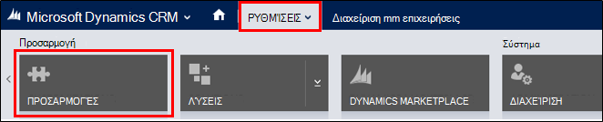
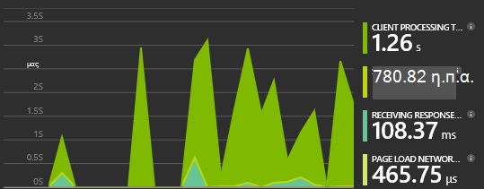
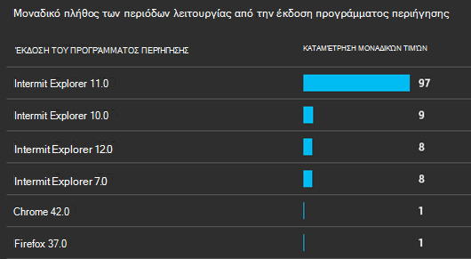

<properties 
    pageTitle="Αναλυτικές οδηγίες: Παρακολούθηση της Microsoft Dynamics CRM με ιδέες εφαρμογής" 
    description="Λάβετε τηλεμετρίας από το Microsoft Dynamics CRM Online με χρήση εφαρμογής ιδέες. Αναλυτικές οδηγίες εγκατάστασης, γρήγορα δεδομένα, απεικόνιση και εξαγωγή." 
    services="application-insights" 
    documentationCenter=""
    authors="mazharmicrosoft" 
    manager="douge"/>

<tags 
    ms.service="application-insights" 
    ms.workload="tbd" 
    ms.tgt_pltfrm="ibiza" 
    ms.devlang="na" 
    ms.topic="article" 
    ms.date="11/17/2015" 
    ms.author="awills"/>
 
# Αναλυτικές οδηγίες: Ενεργοποίηση Τηλεμετρίας για το Microsoft Dynamics CRM Online με χρήση εφαρμογής ιδέες

Σε αυτό το άρθρο θα μάθετε πώς να λάβετε δεδομένα τηλεμετρίας από το [Microsoft Dynamics CRM Online](https://www.dynamics.com/) με χρήση του [Visual Studio εφαρμογή ιδέες](https://azure.microsoft.com/services/application-insights/). Θα σας καθοδηγήσουμε κατά τη διαδικασία ολοκλήρωσης της προσθήκης ιδέες εφαρμογή δέσμης ενεργειών για την εφαρμογή σας, η καταγραφή δεδομένων και απεικόνιση δεδομένων.

>[AZURE.NOTE] [Αναζητήστε τη λύση δείγμα](https://dynamicsandappinsights.codeplex.com/).

## Προσθήκη εφαρμογής ιδέες σε νέα ή υπάρχουσα παρουσία CRM Online 

Για την παρακολούθηση της εφαρμογής σας, μπορείτε να προσθέσετε μια εφαρμογή του SDK ιδέες για την εφαρμογή σας. Το SDK στέλνει τηλεμετρίας στην [πύλη εφαρμογής ιδέες](https://portal.azure.com), όπου μπορείτε να χρησιμοποιήστε μας ισχυρές αναλύσεις και διαγνωστικά εργαλεία ή να εξαγάγετε τα δεδομένα στο χώρο αποθήκευσης.

### Δημιουργία ενός πόρου ιδέες εφαρμογή στο Azure

1. Αποκτήστε [ένα λογαριασμό στο Microsoft Azure](http://azure.com/pricing). 
2. Πραγματοποιήστε είσοδο στο [Azure πύλη](https://portal.azure.com) και να προσθέσετε ένα νέο πόρο εφαρμογής ιδέες. Αυτό είναι όπου θα υποβάλλονται σε επεξεργασία και θα εμφανιστούν τα δεδομένα σας.

    

    Επιλέξτε ASP.NET ως ο τύπος της εφαρμογής.

3. Ανοίξτε την καρτέλα γρήγορης εκκίνησης και ανοίξτε τη δέσμη ενεργειών κώδικα.

    

**Κρατήστε ανοιχτή τη σελίδα κώδικα** ενώ μπορείτε να κάνετε το επόμενο βήμα σε ένα άλλο παράθυρο προγράμματος περιήγησης. Θα χρειαστεί σύντομα τον κώδικα. 

### Δημιουργία ενός πόρου web JavaScript στο Microsoft Dynamics CRM

1. Ανοίξτε το CRM Online παρουσία και συνδεθείτε με δικαιώματα διαχειριστή.
2. Άνοιγμα Microsoft Dynamics CRM ρυθμίσεις, προσαρμογές, η προσαρμογή του συστήματος

    
    
    

    

3. Δημιουργήστε έναν πόρο JavaScript.

    

    Δώσετε ένα όνομα, επιλέξτε **δέσμης ενεργειών (JScript)** και ανοίξτε το πρόγραμμα επεξεργασίας κειμένου.

    
    
4. Αντιγράψτε τον κώδικα από εφαρμογή ιδέες. Κατά την αντιγραφή, βεβαιωθείτε ότι για να αγνοήσετε ετικέτες δέσμης ενεργειών. Αναφέρονται παρακάτω στιγμιότυπο οθόνης:

    

    Ο κώδικας περιλαμβάνει το κλειδί οργάνων που προσδιορίζει τον πόρο ιδέες εφαρμογής.

5. Αποθήκευση και δημοσίευση.

    

### Φόρμες Instrument

1. Στο Microsoft CRM Online, ανοίξτε τη φόρμα λογαριασμού

    

2. Ανοίξτε τη φόρμα ιδιοτήτων

    

3. Προσθήκη πόρου web JavaScript που δημιουργήσατε

    

    

4. Αποθηκεύστε και δημοσιεύστε τις προσαρμογές σας φόρμα.

## Μετρικά καταγράφονται

Τώρα έχετε ρυθμίσει καταγραφής τηλεμετρίας για τη φόρμα. Κάθε φορά που χρησιμοποιείται, θα σταλεί δεδομένων για τον πόρο εφαρμογής ιδέες.

Ακολουθούν παραδείγματα των δεδομένων που θα δείτε.

#### Εφαρμογή εύρυθμης λειτουργίας

Πρόγραμμα περιήγησης εξαιρέσεις:

Κάντε κλικ στο γράφημα για να λάβετε περισσότερες λεπτομέρειες:

#### Χρήση

#### Προγράμματα περιήγησης

#### Γεωεντοπισμός

#### Αίτηση προβολή εσωτερικά σελίδας

## Δείγμα κώδικα

[Αναζητήστε το δείγμα κώδικα](https://dynamicsandappinsights.codeplex.com/).

## Power BI

Μπορείτε να κάνετε ακόμα βαθύτερη ανάλυση Εάν κάνετε [Εξαγωγή των δεδομένων για το Microsoft Power BI](app-insights-export-power-bi.md).

## Δείγμα Microsoft Dynamics CRM λύσης

[Εδώ είναι η λύση δείγμα υλοποιηθεί σε Microsoft Dynamics CRM] (https://dynamicsandappinsights.codeplex.com/).

## Μάθε περισσότερα

* [Τι είναι η εφαρμογή ιδέες;](app-insights-overview.md)
* [Εφαρμογή ιδέες για τις ιστοσελίδες](app-insights-javascript.md)
* [Περισσότερα παραδείγματα και αναλυτικές παρουσιάσεις](app-insights-code-samples.md)

 
