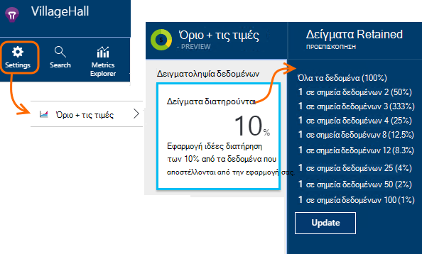

<properties 
    pageTitle="Δειγματοληψία τηλεμετρίας στην εφαρμογή ιδέες | Microsoft Azure" 
    description="Μάθετε πώς μπορείτε να διατηρήσετε τον όγκο των τηλεμετρίας στην περιοχή έλεγχος." 
    services="application-insights" 
    documentationCenter="windows"
    authors="vgorbenko" 
    manager="douge"/>

<tags 
    ms.service="application-insights" 
    ms.workload="tbd" 
    ms.tgt_pltfrm="ibiza" 
    ms.devlang="na" 
    ms.topic="article" 
    ms.date="08/30/2016" 
    ms.author="awills"/>

#  <a name="sampling-in-application-insights"></a>Δειγματοληψία στην εφαρμογή ιδέες

*Εφαρμογή ιδέες είναι σε προεπισκόπηση.*


Δειγματοληψία είναι μια δυνατότητα στο [Visual Studio εφαρμογή ιδέες](app-insights-overview.md) είναι το συνιστώμενο τρόπο για να μειώσετε την κυκλοφορία τηλεμετρίας και αποθήκευσης διατηρώντας μια στατιστικά σωστή ανάλυση των δεδομένων εφαρμογής. Το φίλτρο επιλέγει τα στοιχεία που σχετίζονται, έτσι ώστε να μπορείτε να μετακινηθείτε μεταξύ των στοιχείων όταν κάνετε διαγνωστικών έρευνες.
Όταν μετρικό καταμετρά παρουσιάζονται σε εσάς στην πύλη, αυτοί είναι renormalized για να ληφθούν υπόψη τη δειγματοληψία, για να ελαχιστοποιήσετε κανένα αποτέλεσμα σε τα στατιστικά στοιχεία.

Δειγματοληψία μειώνει την κίνηση, σας βοηθούν να διατηρείτε μέσα σε μηνιαία δεδομένων ορίων και σας βοηθά να αποφύγετε περιορισμού.

## <a name="in-brief"></a>Σύντομη:

* Δειγματοληψία διατηρεί 1 σε εγγραφές *n* και απορρίπτει τα υπόλοιπα. Για παράδειγμα, αυτό μπορεί να διατηρήσετε 1 σε 5 συμβάντα, δειγματοληψία ποσοστό 20%. 
* Δειγματοληψία γίνεται αυτόματα αν η εφαρμογή σας στείλει πολλές τηλεμετρίας, στις εφαρμογές διακομιστή web ASP.NET.
* Μπορείτε επίσης να ορίσετε δειγματοληψία με μη αυτόματο τρόπο, είτε στην πύλη στη σελίδα τις πληροφορίες τιμολόγησης. ή στο SDK ASP.NET στο αρχείο .config, για να μειώσετε επίσης την κίνηση δικτύου.
* Εάν συνδέεστε προσαρμοσμένα συμβάντα και θέλετε να βεβαιωθείτε ότι είναι διατηρούνται ή απορρίπτονται μαζί ενός συνόλου συμβάντων, βεβαιωθείτε ότι έχουν την ίδια τιμή OperationId.
* Ο διαιρέτης δειγματοληψία *n* αναφέρεται σε κάθε εγγραφή στην ιδιότητα `itemCount`, που στο πλαίσιο Αναζήτηση εμφανίζεται κάτω από το φιλικό όνομα "αίτηση πλήθος" ή "Πλήθος συμβάντων". Όταν δειγματοληψία δεν είναι σε λειτουργία, `itemCount==1`.
* Εάν κάνετε εγγραφή ανάλυσης ερωτήματα, θα πρέπει να [ληφθούν υπόψη δειγματοληψία](app-insights-analytics-tour.md#counting-sampled-data). Συγκεκριμένα, αντί να απλώς μετρώντας εγγραφές, πρέπει να χρησιμοποιήσετε `summarize sum(itemCount)`.


## <a name="types-of-sampling"></a>Τύποι δειγματοληψία


Υπάρχουν τρεις δειγματοληψία εναλλακτικές μεθόδους:

* **Προσαρμόσιμες δειγματοληψία** προσαρμόζεται αυτόματα τον όγκο των τηλεμετρίας που αποστέλλονται από το SDK στην εφαρμογή ASP.NET. Προεπιλεγμένος από SDK v 2.0.0-beta3. Διαθέσιμες επί του παρόντος για ASP.NET τηλεμετρίας πλευρά του διακομιστή μόνο. 
* **Σταθερό επιτόκιο δειγματοληψία** μειώνει τον όγκο των τηλεμετρίας αποστέλλονται από δύο διακομιστή ASP.NET και από τα προγράμματα περιήγησης των χρηστών σας. Μπορείτε να ρυθμίσετε το επιτόκιο. Το πρόγραμμα-πελάτη και διακομιστή θα συγχρονιστούν δειγματοληψία τους, ώστε αυτή, την αναζήτηση σε, μπορείτε να περιηγηθείτε μεταξύ των προβολών σχετικές σελίδας και προσκλήσεις.
* **Δειγματοληψία κατάποσης** μειώνει τον όγκο των τηλεμετρίας διατηρούνται από την υπηρεσία εφαρμογής ιδέες, με ρυθμό που ορίζετε. Δεν μειώσετε την κυκλοφορία τηλεμετρίας, αλλά σας βοηθούν να διατηρείτε εντός του ορίου μηνιαία. 

Εάν είναι προσαρμοσμένη ή σταθερό επιτόκιο δειγματοληψία σε λειτουργία, δειγματοληψία κατάποσης είναι απενεργοποιημένη.

## <a name="ingestion-sampling"></a>Δειγματοληψία κατάποσης

Αυτή η μορφή δειγματοληψία λειτουργεί στο σημείο όπου το τηλεμετρίας από το διακομιστή web, τα προγράμματα περιήγησης και συσκευές φτάσει τελικού σημείου υπηρεσίας εφαρμογής ιδέες. Παρόλο που αυτή δεν μειώνει την κυκλοφορία τηλεμετρίας που αποστέλλεται από την εφαρμογή, μειώνει το ποσό που υποβάλλονται σε επεξεργασία και διατηρούνται (και χρεωθείτε για) με εφαρμογή ιδέες.

Χρησιμοποιήστε αυτόν τον τύπο δειγματοληψία εάν την εφαρμογή σας συχνά καλύπτει το όριο μηνιαίο και δεν έχετε τη δυνατότητα χρήσης είτε με τους τύπους βάσει SDK δειγματοληψία. 

Ορίστε το επιτόκιο δειγματοληψία στο τα όρια και τις πληροφορίες τιμολόγησης blade:



Όπως άλλους τύπους δειγματοληψία, ο αλγόριθμος διατηρεί τηλεμετρίας σχετικών στοιχείων. Για παράδειγμα, όταν έλεγχο του τηλεμετρίας στο πλαίσιο Αναζήτηση, θα έχετε τη δυνατότητα για να βρείτε την αίτηση που σχετίζονται με μια συγκεκριμένη εξαίρεση. Μετρικό σύστημα καταμετρά όπως αίτηση χρέωση και χρέωση εξαίρεση διατηρούνται σωστά.

Σημεία δεδομένων που απορρίπτονται με δειγματοληψία δεν είναι διαθέσιμες σε οποιαδήποτε εφαρμογή ιδέες δυνατότητα όπως η [Συνεχής εξαγωγή](app-insights-export-telemetry.md).

Δειγματοληψία κατάποσης δεν λειτουργούν ενώ βάσει SDK προσαρμόσιμη ή σταθερού επιτοκίου δειγματοληψία είναι σε λειτουργία. Εάν ο ρυθμός δειγματοληψία στο SDK είναι μικρότερο του 100%, το επιτόκιο δειγματοληψία κατάποσης που ορίζετε παραβλέπεται.

> [AZURE.WARNING] Την τιμή που εμφανίζεται στο πλακίδιο υποδεικνύει την τιμή που έχετε ορίσει για κατάποση δειγματοληψία. Αυτό δεν αντιπροσωπεύει το επιτόκιο πραγματική δειγματοληψία εάν δειγματοληψία SDK είναι σε λειτουργία.


## <a name="adaptive-sampling-at-your-web-server"></a>Προσαρμόσιμες δειγματοληψία στο διακομιστή web

Προσαρμόσιμες δειγματοληψία είναι διαθέσιμη για το SDK ιδέες εφαρμογής για ASP.NET v 2.0.0-beta3 και νεότερες εκδόσεις και είναι ενεργοποιημένη από προεπιλογή. 


Προσαρμόσιμες δειγματοληψία επηρεάζει τον όγκο των τηλεμετρίας που αποστέλλονται από το διακομιστή web app για την υπηρεσία εφαρμογής ιδέες. Η ένταση προσαρμόζεται αυτόματα για να διατηρήσετε μέσα σε μια καθορισμένη μέγιστη ταχύτητα κυκλοφορίας.

Αυτό δεν λειτουργούν με χαμηλή όγκους τηλεμετρίας, επομένως μια εφαρμογή τον εντοπισμό σφαλμάτων ή μια τοποθεσία Web με χαμηλής χρήσης δεν επηρεάζονται.

Για να επιτύχετε την ένταση ήχου προορισμού, ορισμένα από τα τηλεμετρίας που δημιουργούνται απορρίπτονται. Αλλά όπως άλλους τύπους δειγματοληψία, ο αλγόριθμος διατηρεί τηλεμετρίας σχετικών στοιχείων. Για παράδειγμα, όταν έλεγχο του τηλεμετρίας στο πλαίσιο Αναζήτηση, θα έχετε τη δυνατότητα για να βρείτε την αίτηση που σχετίζονται με μια συγκεκριμένη εξαίρεση. 

Μετρικό σύστημα καταμετρά όπως αίτηση χρέωση και χρέωση εξαίρεσης αναπροσαρμόζονται αποζημιώσει για το συντελεστή δειγματοληψία, έτσι ώστε να εμφανίζονται περίπου σωστές τιμές στην Εξερεύνηση μετρικό σύστημα.

**Ενημέρωση του έργου σας NuGet** πακέτων στην πιο πρόσφατη έκδοση *προ-έκδοση* της εφαρμογής ιδέες: κάντε δεξί κλικ στο έργο στην Εξερεύνηση λύσεων, επιλέξτε Διαχείριση πακέτων NuGet, ελέγξτε **περιλαμβάνουν προέκδοση** και να αναζητήσετε Microsoft.ApplicationInsights.Web. 

Στο [ApplicationInsights.config](app-insights-configuration-with-applicationinsights-config.md), μπορείτε να ρυθμίσετε πολλές παραμέτρους στο το `AdaptiveSamplingTelemetryProcessor` κόμβο. Τα στοιχεία που εμφανίζονται είναι οι προεπιλεγμένες τιμές:

* `<MaxTelemetryItemsPerSecond>5</MaxTelemetryItemsPerSecond>`

    Ο ρυθμός προορισμού που αλγόριθμο προσαρμόσιμη στόχος για **κάθε κεντρικού υπολογιστή διακομιστή**. Εάν η εφαρμογή web της εκτελείται σε πολλές υπηρεσίες παροχής φιλοξενίας, μειώστε αυτήν την τιμή έτσι ώστε να παραμένει εντός σας ρυθμό κίνηση στην πύλη ιδέες εφαρμογή προορισμού.

* `<EvaluationInterval>00:00:15</EvaluationInterval>` 

    Το χρονικό διάστημα στο οποίο ο τρέχων συντελεστής της τηλεμετρίας είναι εκ νέου αξιολογηθεί. Αξιολόγηση εκτελείται ως ένα κυλιόμενο μέσο όρο. Ενδέχεται να θέλετε να συντομεύσετε αυτό το χρονικό διάστημα, εάν σας τηλεμετρίας υπόκειται σε απότομη καταιγισμό.

* `<SamplingPercentageDecreaseTimeout>00:02:00</SamplingPercentageDecreaseTimeout>`

    Κατά τη δειγματοληψία ποσοστό τιμή αλλαγές, πώς σύντομα μετά θα σας επιτρέπεται να κάτω ποσοστό δειγματοληψία ξανά για να καταγράψετε λιγότερα δεδομένα.

* `<SamplingPercentageIncreaseTimeout>00:15:00</SamplingPercentageIncreaseTimeout>`

    Κατά τη δειγματοληψία ποσοστό τιμή αλλαγές, πώς σύντομα μετά θα σας επιτρέπονται για να αυξήσετε το ποσοστό δειγματοληψία ξανά για να καταγράψετε περισσότερα δεδομένα.

* `<MinSamplingPercentage>0.1</MinSamplingPercentage>`

    Καθώς δειγματοληψία ποσοστό ποικίλλει, ποια είναι η ελάχιστη τιμή που θα σας ότι επιτρέπεται για να ορίσετε.

* `<MaxSamplingPercentage>100.0</MaxSamplingPercentage>`

    Καθώς δειγματοληψία ποσοστό ποικίλλει, τι είναι η μέγιστη τιμή που θα σας ότι επιτρέπεται για να ορίσετε.

* `<MovingAverageRatio>0.25</MovingAverageRatio>` 

    Για τον υπολογισμό του κυλιόμενου μέσου όρου, το πάχος που έχουν εκχωρηθεί στην πιο πρόσφατη τιμή. Χρησιμοποιήστε μια τιμή ίση ή μικρότερη από 1. Μικρότερες τιμές αλλαγές αλγόριθμο λιγότερο αντίδρασης σε απότομη.

* `<InitialSamplingPercentage>100</InitialSamplingPercentage>`

    Η τιμή που έχουν ανατεθεί όταν η εφαρμογή έχει ξεκινήσει μόλις. Δεν μείωση αυτή ενώ κάνετε εντοπισμό σφαλμάτων. 

### <a name="alternative-configure-adaptive-sampling-in-code"></a>Εναλλακτική λύση: ρύθμιση παραμέτρων προσαρμόσιμη δειγματοληψία στον κώδικα

Αντί για προσαρμογή δειγματοληψία στο αρχείο .config, μπορείτε να χρησιμοποιήσετε κώδικα. Αυτό σας επιτρέπει να καθορίσετε μια συνάρτηση επιστροφής κλήσης που ενεργοποιείται κάθε φορά που το επιτόκιο δειγματοληψία είναι εκ νέου αξιολογηθεί. Μπορείτε να χρησιμοποιήσετε, για παράδειγμα, για να μάθετε ποιες δειγματοληψία επιτόκιο που χρησιμοποιείται.

Κατάργηση του `AdaptiveSamplingTelemetryProcessor` κόμβο από το αρχείο .config.


*C#*

```C#

    using Microsoft.ApplicationInsights;
    using Microsoft.ApplicationInsights.Extensibility;
    using Microsoft.ApplicationInsights.WindowsServer.Channel.Implementation;
    using Microsoft.ApplicationInsights.WindowsServer.TelemetryChannel;
    ...

    var adaptiveSamplingSettings = new SamplingPercentageEstimatorSettings();

    // Optional: here you can adjust the settings from their defaults.

    var builder = TelemetryConfiguration.Active.TelemetryProcessorChainBuilder;
    
    builder.UseAdaptiveSampling(
         adaptiveSamplingSettings,

        // Callback on rate re-evaluation:
        (double afterSamplingTelemetryItemRatePerSecond,
         double currentSamplingPercentage,
         double newSamplingPercentage,
         bool isSamplingPercentageChanged,
         SamplingPercentageEstimatorSettings s
        ) =>
        {
          if (isSamplingPercentageChanged)
          {
             // Report the sampling rate.
             telemetryClient.TrackMetric("samplingPercentage", newSamplingPercentage);
          }
      });

    // If you have other telemetry processors:
    builder.Use((next) => new AnotherProcessor(next));

    builder.Build();

```

([Μάθετε πληροφορίες για τους επεξεργαστές τηλεμετρίας](app-insights-api-filtering-sampling.md#filtering).)


<a name="other-web-pages"></a>
## <a name="sampling-for-web-pages-with-javascript"></a>Δειγματοληψία για τις ιστοσελίδες με JavaScript

Μπορείτε να ρυθμίσετε τις ιστοσελίδες για δειγματοληψία σταθερού επιτοκίου από οποιονδήποτε διακομιστή. 

Όταν [ρυθμίσετε τις παραμέτρους οι σελίδες web για εφαρμογή ιδέες](app-insights-javascript.md), τροποποιήστε το τμήμα κώδικα που μπορείτε να πάρετε από την πύλη εφαρμογής ιδέες. (Στις εφαρμογές ASP.NET, το τμήμα κώδικα συνήθως μεταφέρονται στα _Layout.cshtml.)  Εισαγάγετε μια γραμμή όπως `samplingPercentage: 10,` πριν από τον αριθμό-κλειδί οργάνων:

    <script>
    var appInsights= ... 
    }({ 


    // Value must be 100/N where N is an integer.
    // Valid examples: 50, 25, 20, 10, 5, 1, 0.1, ...
    samplingPercentage: 10, 

    instrumentationKey:...
    }); 
    
    window.appInsights=appInsights; 
    appInsights.trackPageView(); 
    </script> 

Για το ποσοστό δειγματοληψία, επιλέξτε ένα ποσοστό που μοιάζει με 100/N όπου N είναι ένας ακέραιος αριθμός.  Προς το παρόν δειγματοληψία δεν υποστηρίζει άλλες τιμές.

Εάν ενεργοποιήσετε επίσης δειγματοληψία σταθερού επιτοκίου στο διακομιστή, τα προγράμματα-πελάτες και διακομιστή θα συγχρονίσει, ώστε αυτή, την αναζήτηση σε, μπορείτε να περιηγηθείτε μεταξύ των προβολών σχετικές σελίδας και προσκλήσεις.


## <a name="fixed-rate-sampling-for-aspnet-web-sites"></a>Δειγματοληψία σταθερού επιτοκίου για τοποθεσίες web ASP.NET

Σταθερό επιτόκιο δειγματοληψία μειώνει την κυκλοφορία που αποστέλλεται από το διακομιστή web και προγράμματα περιήγησης web. Σε αντίθεση με προσαρμόσιμες δειγματοληψία, μειώνει τηλεμετρίας με σταθερό ρυθμό αποφασίσατε από εσάς. Το συγχρονίζει επίσης τις του προγράμματος-πελάτη και διακομιστή δειγματοληψία ώστε να παραμένουν σχετικά στοιχεία - για παράδειγμα, έτσι ώστε αν κοιτάξετε μια προβολή σελίδας στο πλαίσιο Αναζήτηση, μπορείτε να βρείτε τη σχετική αίτηση.

Ο αλγόριθμος δειγματοληψία διατηρεί τα σχετικά στοιχεία. Για κάθε αίτηση HTTP συμβάντος, το και τις σχετικές συμβάντα είναι είτε απορρίπτονται ή μεταδίδονται. 

Στην Εξερεύνηση των μετρήσεων, χρεώσεις όπως μετρήσεις αίτηση και εξαίρεσης είναι πολλαπλασιασμένη επί συντελεστή για την αποζημίωση για το επιτόκιο δειγματοληψία, ώστε να είναι σωστά κατά προσέγγιση.

1. **Ενημέρωση των πακέτων NuGet του έργου σας** με την πιο πρόσφατη έκδοση *προ-έκδοση* της εφαρμογής ιδέες. Κάντε δεξί κλικ στο έργο στην Εξερεύνηση λύσεων, επιλέξτε Διαχείριση πακέτων NuGet, επιλέξτε **περιλαμβάνουν προέκδοση** και να αναζητήσετε Microsoft.ApplicationInsights.Web. 

2. **Απενεργοποίηση προσαρμόσιμη δειγματοληψία**: στο [ApplicationInsights.config](app-insights-configuration-with-applicationinsights-config.md), κατάργηση ή σχολιάσετε το `AdaptiveSamplingTelemetryProcessor` κόμβο.

    ```xml

    <TelemetryProcessors>
    <!-- Disabled adaptive sampling:
      <Add Type="Microsoft.ApplicationInsights.WindowsServer.TelemetryChannel.AdaptiveSamplingTelemetryProcessor, Microsoft.AI.ServerTelemetryChannel">
        <MaxTelemetryItemsPerSecond>5</MaxTelemetryItemsPerSecond>
      </Add>
    -->
    

    ```

2. **Ενεργοποίηση της λειτουργικής μονάδας δειγματοληψία σταθερό επιτόκιο.** Προσθέστε αυτό το τμήμα κώδικα [ApplicationInsights.config](app-insights-configuration-with-applicationinsights-config.md):

    ```XML

    <TelemetryProcessors>
     <Add  Type="Microsoft.ApplicationInsights.WindowsServer.TelemetryChannel.SamplingTelemetryProcessor, Microsoft.AI.ServerTelemetryChannel">

      <!-- Set a percentage close to 100/N where N is an integer. -->
     <!-- E.g. 50 (=100/2), 33.33 (=100/3), 25 (=100/4), 20, 1 (=100/100), 0.1 (=100/1000) -->
      <SamplingPercentage>10</SamplingPercentage>
      </Add>
    </TelemetryProcessors>

    ```

> [AZURE.NOTE] Για το ποσοστό δειγματοληψία, επιλέξτε ένα ποσοστό που μοιάζει με 100/N όπου N είναι ένας ακέραιος αριθμός.  Προς το παρόν δειγματοληψία δεν υποστηρίζει άλλες τιμές.


### <a name="alternative-enable-fixed-rate-sampling-in-your-server-code"></a>Εναλλακτική λύση: Ενεργοποίηση δειγματοληψία σταθερού επιτοκίου στον κώδικα διακομιστή


Αντί για τον ορισμό δειγματοληψία της παραμέτρου στο αρχείο .config, μπορείτε να χρησιμοποιήσετε κώδικα. 

*C#*

```C#

    using Microsoft.ApplicationInsights.Extensibility;
    using Microsoft.ApplicationInsights.WindowsServer.TelemetryChannel;
    ...

    var builder = TelemetryConfiguration.Active.GetTelemetryProcessorChainBuilder();
    builder.UseSampling(10.0); // percentage

    // If you have other telemetry processors:
    builder.Use((next) => new AnotherProcessor(next));

    builder.Build();

```

([Μάθετε πληροφορίες για τους επεξεργαστές τηλεμετρίας](app-insights-api-filtering-sampling.md#filtering).)


## <a name="when-to-use-sampling"></a>Πότε να χρησιμοποιήσετε δειγματοληψία;

Προσαρμόσιμες δειγματοληψία ενεργοποιείται αυτόματα αν χρησιμοποιείτε το 2.0.0-beta3 έκδοσης ASP.NET SDK ή νεότερη έκδοση. Ανεξάρτητα από το ποια έκδοση SDK που χρησιμοποιείτε, μπορείτε να χρησιμοποιήσετε κατάποσης δειγματοληψία (στο διακομιστή μας).

Δεν χρειάζεται δειγματοληψία για τις περισσότερες εφαρμογές μικρές και μεσαίες μέγεθος. Η πιο χρήσιμες πληροφορίες διαγνωστικών και πιο ακριβή στατιστικά στοιχεία λαμβάνονται από τη συλλογή δεδομένων για όλες τις δραστηριότητες του χρήστη. 

 
Τα βασικά πλεονεκτήματα της δειγματοληψία είναι οι εξής:

* Εφαρμογή ιδέες υπηρεσίας σταγόνες ("περιορισμοί") τα σημεία δεδομένων κατά την εφαρμογή σας στέλνει ένα πολύ υψηλό ρυθμό τηλεμετρίας με λίγα λόγια χρόνου χρονικό διάστημα. 
* Για να διατηρήσετε εντός του [ορίου](app-insights-pricing.md) των σημείων δεδομένων για τις πληροφορίες για την τιμολόγηση σειρά. 
* Για να μειώσετε την κίνηση του δικτύου από τη συλλογή τηλεμετρίας. 

### <a name="which-type-of-sampling-should-i-use"></a>Τον τύπο του δειγματοληψία πρέπει να χρησιμοποιήσω;


**Χρησιμοποιήστε κατάποσης δειγματοληψία εάν:**

* Συχνά ακολουθήσετε σας μηνιαία όριο των τηλεμετρίας.
* Χρησιμοποιείτε μια έκδοση του SDK που δεν υποστηρίζει δειγματοληψία - για παράδειγμα, το Java SDK ή εκδόσεις ASP.NET παλαιότερη από το 2.
* Λαμβάνετε πολλά τηλεμετρίας από τα προγράμματα περιήγησης web των χρηστών σας.

**Χρησιμοποιήστε σταθερού επιτοκίου δειγματοληψία εάν:**

* Χρησιμοποιείτε SDK ιδέες για την εφαρμογή για έκδοση υπηρεσιών web ASP.NET 2.0.0 ή νεότερη έκδοση, και
* Θέλετε δειγματοληψία συγχρονισμένες μεταξύ του προγράμματος-πελάτη και διακομιστή, έτσι ώστε, όταν κάνετε έρευνα συμβάντα στο πλαίσιο [Αναζήτηση](app-insights-diagnostic-search.md), μπορείτε να μετακινηθείτε μεταξύ των σχετικών συμβάντων στον υπολογιστή-πελάτη και στο διακομιστή, όπως προβολές σελίδων και αιτήσεις http.
* Είστε βέβαιοι του ποσοστού κατάλληλη δειγματοληψία για την εφαρμογή σας. Θα πρέπει να είναι αρκετά υψηλή ώστε να λάβετε ακριβή μετρικά, αλλά κάτω από το επιτόκιο που υπερβαίνει το όριο του τιμολόγησης και τα όρια επιτάχυνσης. 


**Χρησιμοποιήστε προσαρμόσιμη δειγματοληψία:**

Διαφορετικά, συνιστάται να προσαρμόσιμη δειγματοληψία. Αυτή είναι ενεργοποιημένη από προεπιλογή σε διακομιστή ASP.NET SDK, έκδοση 2.0.0-beta3 ή νεότερη έκδοση. Αυτή δεν μειώνει την κυκλοφορία μέχρι ορισμένες ελάχιστο χρέωσης, ώστε να που δεν θα επηρεάσει μια τοποθεσία χαμηλή χρήση.


## <a name="how-do-i-know-whether-sampling-is-in-operation"></a>Πώς μπορώ να γνωρίζω εάν δειγματοληψία είναι σε λειτουργία;

Για να εντοπίσετε το επιτόκιο πραγματική δειγματοληψία ανεξάρτητα από το σημείο όπου έχει εφαρμοστεί, χρησιμοποιήστε ένα [ερώτημα αναλυτικών στοιχείων](app-insights-analytics.md) όπως αυτή:

    requests | where timestamp > ago(1d)
  	| summarize 100/avg(itemCount) by bin(timestamp, 1h) 
  	| render areachart 

Σε κάθε διατηρούνται εγγραφή, `itemCount` υποδεικνύει τον αριθμό των αρχικό εγγραφών που την αντιπροσωπεύει, ίσο με 1 + τον αριθμό των προηγούμενες απορρίφθηκαν εγγραφές. 


## <a name="how-does-sampling-work"></a>Πώς λειτουργεί η δειγματοληψία;

Σταθερού επιτοκίου και προσαρμόσιμη δειγματοληψία είναι μια δυνατότητα του SDK σε εκδόσεις ASP.NET από 2.0.0 και μετά. Δειγματοληψία κατάποσης είναι μια δυνατότητα της υπηρεσίας εφαρμογής ιδέες και μπορεί να είναι σε λειτουργία, εάν το SDK δεν εκτελεί δειγματοληψία. 

Ο αλγόριθμος δειγματοληψία καθορίζεται ποια στοιχεία τηλεμετρίας για να απορρίψετε και ποιες από αυτές θα διατηρήσετε (εάν είναι στο SDK ή στην υπηρεσία εφαρμογής ιδέες). Η απόφαση δειγματοληψία βασίζεται σε πολλούς κανόνες που έχουν στόχο για να διατηρήσετε όλα τα σημεία δεδομένων αλληλοσχετιζόμενων ανέπαφη, λαμβάνοντας υπόψη μια διαγνωστικών εμπειρία στο ιδέες εφαρμογών που έχει δυνατότητα επεξεργασίας και αξιόπιστη ακόμα και με ένα μικρότερο σύνολο δεδομένων. Για παράδειγμα, αν για ένα αίτημα αποτυχίας της εφαρμογής σας στείλει πρόσθετες τηλεμετρίας στοιχείων (όπως εξαίρεσης και ανιχνεύσεις συνδεδεμένοι από αυτήν την αίτηση), δειγματοληψία δεν θα διαιρέσετε αυτής της αίτησης και άλλες τηλεμετρίας. Να διατηρεί ή να τις απορρίπτει όλες μαζί. Ως αποτέλεσμα, όταν εξετάζετε τις λεπτομέρειες της αίτησης στην εφαρμογή ιδέες, μπορείτε πάντα να δείτε την αίτηση μαζί με τα στοιχεία σχετικές τηλεμετρίας. 

Για τις εφαρμογές που ορίζουν "χρήστης" (δηλαδή, συνηθέστερες εφαρμογές web), η απόφαση δειγματοληψία βασίζεται ο κατακερματισμός το αναγνωριστικό χρήστη, γεγονός που σημαίνει ότι είναι διατηρούνται ή καταργηθεί όλα τηλεμετρίας για οποιοδήποτε συγκεκριμένο χρήστη. Για τους τύπους των εφαρμογών που δεν ορίσετε τους χρήστες (όπως υπηρεσίες web) την απόφαση δειγματοληψία εξαρτάται από το αναγνωριστικό λειτουργίας της αίτησης. Τέλος, για τα στοιχεία τηλεμετρίας που δεν έχουν αναγνωριστικό χρήστη ούτε λειτουργία (για παράδειγμα τηλεμετρίας στοιχεία που αναφέρθηκε από ασύγχρονης νήματα με χωρίς περιβάλλον http) δειγματοληψία απλώς καταγράφει ένα ποσοστό στοιχείων τηλεμετρίας κάθε τύπο. 

Κατά την παρουσίαση τηλεμετρίας σε εσάς, η υπηρεσία εφαρμογής ιδέες ρυθμίζει τα μετρικά με το ίδιο ποσοστό δειγματοληψία που χρησιμοποιήθηκε κατά τη στιγμή της συλλογής, για να αποζημιώσει για τα σημεία δεδομένων που λείπουν. Ως εκ τούτου, όταν βλέπετε το τηλεμετρίας στην εφαρμογή ιδέες, οι χρήστες βλέπουν στατιστικά σωστή προσεγγίσεων που είναι πολύ κοντά τα πραγματικούς αριθμούς.

Την ακρίβεια της την προσέγγιση εξαρτάται σε μεγάλο βαθμό από το ποσοστό ρυθμισμένο δειγματοληψία. Επίσης, αυξάνει την ακρίβεια για τις εφαρμογές που χειρίζεται μεγάλο όγκο γενικά παρόμοια αιτήσεις από πολλούς χρήστες. Από την άλλη πλευρά, για τις εφαρμογές που δεν λειτουργούν με μια σημαντική φόρτωση, δειγματοληψία δεν είναι απαραίτητος κατά την αυτές τις εφαρμογές συνήθως να στείλετε όλες τις τηλεμετρίας ενώ μείνετε εντός του ορίου, χωρίς να προκαλεί απώλεια δεδομένων από περιορισμού. 

Σημειώστε ότι ιδέες εφαρμογή δεν δείγμα τύπους τηλεμετρίας μετρήσεις και περιόδους λειτουργίας, από την έναρξη της για αυτούς τους τύπους, μπορεί να είναι ιδιαίτερα ανεπιθύμητες μείωση της ακρίβειας. 

### <a name="adaptive-sampling"></a>Προσαρμόσιμες δειγματοληψία

Προσαρμόσιμες δειγματοληψία προσθέτει ένα στοιχείο που παρακολουθεί ο τρέχων συντελεστής μετάδοσης από το SDK και προσαρμόζει το ποσοστό δειγματοληψία για να προσπαθήσετε να παραμείνει εντός τη μέγιστη ταχύτητα προορισμού. Η προσαρμογή υπολογίζεται εκ νέου σε τακτά χρονικά διαστήματα και βασίζεται σε έναν κυλιόμενο μέσο όρο του ρυθμού εξερχόμενων μετάδοση.

## <a name="sampling-and-the-javascript-sdk"></a>Δειγματοληψία και το SDK JavaScript

-Πελάτη (JavaScript) SDK συμμετέχει στη δειγματοληψία σταθερού επιτοκίου σε συνδυασμό με το διακομιστή SDK. Τις αρμόδιες σελίδες θα στέλνει μόνο τηλεμετρίας πλευρά του προγράμματος-πελάτη από τους ίδιους χρήστες για την οποία την πλευρά του διακομιστή κάνει την απόφασή "δείγμα σε". Αυτή η λογική έχει σχεδιαστεί για τη διατήρηση της ακεραιότητας της περιόδου λειτουργίας του χρήστη κατά μήκος πλευρές προγράμματος-πελάτη και διακομιστή. Ως αποτέλεσμα, από οποιοδήποτε στοιχείο συγκεκριμένο τηλεμετρίας σε εφαρμογή ιδέες, μπορείτε να βρείτε όλα τα άλλα στοιχεία τηλεμετρίας για αυτόν το χρήστη ή την περίοδο λειτουργίας. 

*Πρόγραμμα-πελάτη και διακομιστή τηλεμετρίας μου να μην εμφανίζονται συντονισμένη δείγματα όπως που περιγράφουν παραπάνω.*

* Βεβαιωθείτε ότι έχετε ενεργοποιήσει δειγματοληψία σταθερού επιτοκίου τόσο στο διακομιστή και προγράμματος-πελάτη.
* Βεβαιωθείτε ότι η έκδοση SDK είναι 2.0 ή νεότερη έκδοση.
* Επιλέξτε να ορίσετε το ίδιο ποσοστό δειγματοληψία τόσο στο πρόγραμμα-πελάτη και διακομιστή.


## <a name="frequently-asked-questions"></a>Συνήθεις ερωτήσεις 

*Γιατί δεν είναι δειγματοληψία μια απλή "Συλλογή X τοις εκατό κάθε τύπο τηλεμετρίας";*

 *  Ενώ αυτή η προσέγγιση δειγματοληψία θα μπορούσε να παρέχει ένα πολύ υψηλή ακρίβεια στο μετρικό προσεγγίσεων, αυτό θα καταργήσουν δυνατότητα συσχετισμού διαγνωστικών δεδομένων ανά χρήστη, την περίοδο λειτουργίας και αίτηση, η οποία είναι σημαντικό για τα Διαγνωστικά. Επομένως, δειγματοληψία λειτουργεί καλύτερα με "Συλλογή όλες τηλεμετρίας στοιχείων για X τοις εκατό της χρήστες της εφαρμογής" ή "Συλλογή όλα τηλεμετρίας για X τοις εκατό της αιτήσεις εφαρμογής" λογική. Για τα στοιχεία τηλεμετρίας δεν συσχετίζονται με τις αιτήσεις (όπως ασύγχρονης επεξεργασίας στο παρασκήνιο), η επιστροφή είναι η "Συλλογή X ποσοστό όλων των στοιχείων για κάθε τύπο τηλεμετρίας." 

*Να το ποσοστό δειγματοληψία αλλάξετε διάρκεια του χρόνου;*

 * Ναι, προσαρμόσιμη δειγματοληψία αλλάζει σταδιακά ποσοστού δειγματοληψία, με βάση αυτήν τη στιγμή παρατηρούμενη έντασης ήχου του τηλεμετρίας.

 

*Εάν χρησιμοποιώ δειγματοληψία σταθερού επιτοκίου, πώς μπορώ να γνωρίζω ποιες δειγματοληψία ποσοστό θα λειτουργεί το καλύτερο για εφαρμογή μου;*

* Ένας τρόπος είναι για να ξεκινήσετε με προσαρμόσιμες δειγματοληψία, μάθετε τι χαρακτηρισμός settles σε (δείτε παραπάνω ερώτηση) και, στη συνέχεια, να μεταβείτε σταθερού επιτοκίου δειγματοληψία χρησιμοποιώντας αυτό το επιτόκιο. 

    Διαφορετικά, θα πρέπει να προβλέψει. Ανάλυση την τρέχουσα χρήση τηλεμετρίας σε AI, παρατηρήστε τις περιορισμού που παρουσιάζεται και εκτίμηση της έντασης ήχου του που έχουν συλλεχθεί τηλεμετρίας. Αυτά τα τρία στοιχεία εισόδου, μαζί με το επιλεγμένο τιμολόγησης σειρά, προτείνει έκταση που μπορεί να θέλετε να μειώσετε την ένταση ήχου από τη συλλογή τηλεμετρίας. Ωστόσο, μια αύξηση του αριθμού των χρηστών σας ή ορισμένες άλλες shift του όγκου της τηλεμετρίας μπορεί να ακυρώσει την εκτίμηση.

*Τι συμβαίνει εάν η ρύθμιση παραμέτρων του ποσοστού δειγματοληψία πολύ χαμηλή;*

* Ποσοστό υπερβολικά χαμηλή δειγματοληψία (over-aggressive δειγματοληψία) μειώνει την ακρίβεια της το προσεγγίσεων, όταν ιδέες εφαρμογή προσπαθεί να αποζημιώσει την απεικόνιση των δεδομένων για τη μείωση της έντασης ήχου δεδομένων. Επίσης, διαγνωστικών εμπειρία μπορεί να επηρεαστεί αρνητικά, καθώς ορισμένες από τις αιτήσεις σπάνια σφάλματος ή αργή μπορεί να δείγματα ανάληψη.

*Τι συμβαίνει εάν η ρύθμιση παραμέτρων του ποσοστού δειγματοληψία πολύ υψηλή;*

* Ρύθμιση παραμέτρων πολύ υψηλή δειγματοληψία ποσοστό (δεν αυστηρές αρκετά) ως αποτέλεσμα ένα ανεπαρκές μείωση της έντασης ήχου του που έχουν συλλεχθεί τηλεμετρίας. Εξακολουθείτε να αντιμετωπίζετε τηλεμετρίας απώλεια δεδομένων που σχετίζονται με περιορισμού και το κόστος χρήσης εφαρμογής ιδέες μπορεί να είναι μεγαλύτερη από αυτόν που έχει προγραμματιστεί λόγω μονάδων χρεώσεων.

*Σε ποιες πλατφόρμες μπορώ να χρησιμοποιήσω δειγματοληψία;*

* Δειγματοληψία κατάποσης μπορεί να προκύψουν αυτόματα για τυχόν τηλεμετρίας επάνω από ένα συγκεκριμένο όγκο, εάν το SDK δεν εκτελεί δειγματοληψία. Αυτό θα λειτουργεί, για παράδειγμα, εάν η εφαρμογή σας χρησιμοποιεί ένα διακομιστή Java ή εάν χρησιμοποιείτε μια παλαιότερη έκδοση του ASP.NET SDK.

* Εάν χρησιμοποιείτε το ASP.NET SDK εκδόσεις 2.0.0 και επάνω (φιλοξενείται στο Azure ή στο δικό σας διακομιστή), λάβετε προσαρμόσιμη δειγματοληψία από προεπιλογή, αλλά μπορείτε να μεταβείτε σε σταθερού επιτοκίου, όπως περιγράφεται παραπάνω. Με δειγματοληψία σταθερού επιτοκίου, το πρόγραμμα περιήγησης SDK συγχρονίζει αυτόματα για να λαμβάνετε δείγματα σχετικά συμβάντα. 

*Υπάρχουν ορισμένα σπάνιων συμβάντα θέλω πάντα να δείτε. Πώς μπορώ να αποκτήσω τα πέρα από τη λειτουργική μονάδα δειγματοληψία;*

 * Προετοιμασία ξεχωριστή εμφάνιση του TelemetryClient με μια νέα TelemetryConfiguration (μην το προεπιλεγμένο ενεργό). Το χρησιμοποιήσετε για να στείλετε τα συμβάντα σπάνιων σας.


## <a name="next-steps"></a>Επόμενα βήματα

* [Φιλτράρισμα](app-insights-api-filtering-sampling.md) μπορούν να παρέχουν περισσότερες αυστηρό έλεγχο του τι στέλνει το SDK.
