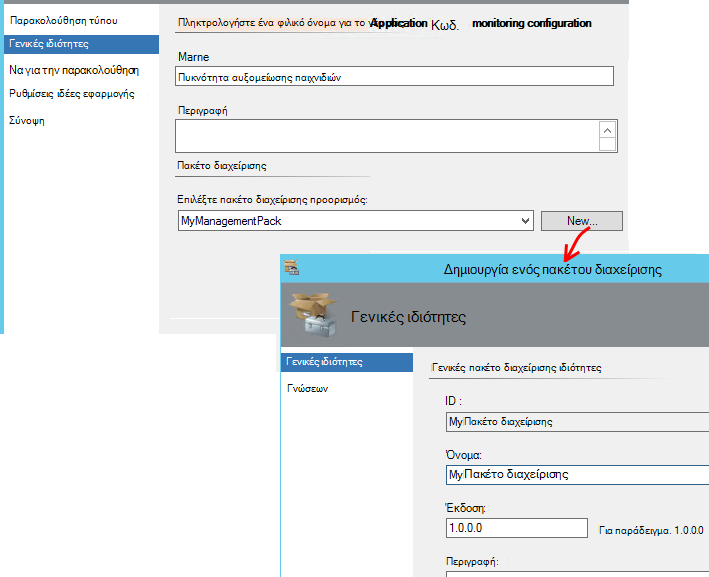

<properties 
    pageTitle="Ενοποίηση SCOM με εφαρμογή ιδέες | Microsoft Azure" 
    description="Εάν είστε χρήστης του SCOM, παρακολούθηση των επιδόσεων και διάγνωση θεμάτων με εφαρμογή ιδέες. Ολοκληρωμένη πίνακες εργαλείων, προειδοποιήσεις smart, ισχυρά εργαλεία διαγνωστικών και ερωτήματα ανάλυσης." 
    services="application-insights" 
    documentationCenter=""
    authors="alancameronwills" 
    manager="douge"/>

<tags 
    ms.service="application-insights" 
    ms.workload="tbd" 
    ms.tgt_pltfrm="ibiza" 
    ms.devlang="na" 
    ms.topic="article" 
    ms.date="08/12/2016" 
    ms.author="awills"/>
 
# Εφαρμογή παρακολούθηση των επιδόσεων με εφαρμογή ιδέες για SCOM

Εάν χρησιμοποιείτε το σύστημα κέντρο Operations Manager (SCOM) για να διαχειριστείτε τους διακομιστές σας, μπορείτε να παρακολουθείτε τις επιδόσεις και διάγνωση θεμάτων επιδόσεων με τη Βοήθεια του [Visual Studio εφαρμογή ιδέες](app-insights-asp-net.md). Εφαρμογή ιδέες παρακολουθεί εισερχόμενες αιτήσεις της εφαρμογής web, εξερχόμενης ΥΠΌΛΟΙΠΟ και κλήσεις SQL, εξαιρέσεις και ανιχνεύσεις καταγραφής. Παρέχει πινάκων εργαλείων με μετρικό γραφήματα και προειδοποιήσεις smart, καθώς και ισχυρές διαγνωστικών αναζήτησης και αναλυτική ερωτήματα επάνω από αυτό τηλεμετρίας. 

Μπορείτε να μεταβείτε στην εφαρμογή ιδέες παρακολούθησης με χρήση του πακέτου διαχείρισης SCOM.

## Πριν ξεκινήσετε

Υποθέσουμε ότι:

* Είστε εξοικειωμένοι με SCOM και ότι χρησιμοποιείτε SCOM 2012 R2 ή 2016 για να διαχειριστείτε τις υπηρεσίες IIS διακομιστές web.
* Έχετε ήδη εγκαταστήσει στους διακομιστές μια εφαρμογή web που θέλετε να παρακολουθείτε με εφαρμογή ιδέες.
* Εφαρμογή framework έκδοση είναι .NET 4,5 ή νεότερη έκδοση.
* Έχετε πρόσβαση σε μια συνδρομή στο [Microsoft Azure](https://azure.com) και να εισέλθετε στην [πύλη του Azure](https://portal.azure.com). Εταιρεία σας ενδέχεται να έχετε μια συνδρομή και να προσθέσετε το λογαριασμό σας Microsoft σε αυτήν.

(Η ομάδα ανάπτυξης μπορεί να δημιουργήσει η [Εφαρμογή ιδέες SDK](app-insights-asp-net.md) στο web app. Αυτό οργάνων χρόνου κατασκευής τους δίνει μεγαλύτερη ευελιξία κατά την εγγραφή προσαρμοσμένης τηλεμετρίας. Ωστόσο, δεν έχει σημασία: μπορείτε να ακολουθήσετε τα βήματα που περιγράφονται εδώ με ή χωρίς το SDK ενσωματωμένη.)

## (Μία φορά) Εγκατάσταση του πακέτου διαχείρισης εφαρμογής ιδέες

Στον υπολογιστή όπου εκτελείτε Operations Manager:

2. Κατάργηση εγκατάστασης οποιαδήποτε παλιά έκδοση του πακέτου διαχείρισης:
 1. Στο Operations Manager, ανοίξτε διαχείρισης, διαχείριση πακέτων. 
 2. Διαγράψτε την παλιά έκδοση.
1. Κάντε λήψη και εγκατάσταση του πακέτου διαχείρισης από τον κατάλογο.
2. Επανεκκινήστε το Operations Manager.

## Δημιουργία ενός πακέτου διαχείρισης

1. Στο Operations Manager, ανοίξτε **σύνταξη από κοινού**, **.NET... με εφαρμογή ιδέες**, **Προσθήκη παρακολούθησης οδηγού**και επιλέξτε **.NET... με εφαρμογή ιδέες**.

    

2. Όνομα στη ρύθμιση παραμέτρων μετά την εφαρμογή σας. (Πρέπει να μέσου εφαρμογή μία κάθε φορά.)
    
    

3. Στην ίδια σελίδα του οδηγού, δημιουργήστε ένα νέο πακέτο διαχείρισης ή επιλέξτε ένα πακέτο που δημιουργήσατε νωρίτερα για ιδέες εφαρμογής.

     (Η εφαρμογή ιδέες [πακέτο διαχείρισης](https://technet.microsoft.com/library/cc974491.aspx) είναι ένα πρότυπο, από την οποία μπορείτε να δημιουργήσετε μια παρουσία. Μπορείτε να χρησιμοποιήσετε ξανά την ίδια παρουσία αργότερα.)

    

4. Επιλέξτε μια εφαρμογή που θέλετε να παρακολουθήσετε. Η δυνατότητα αναζήτησης πραγματοποιεί αναζήτηση ανάμεσα σε εφαρμογές που είναι εγκατεστημένες στους διακομιστές σας.

    

    Το προαιρετικό πεδίο εύρος παρακολούθησης μπορεί να χρησιμοποιηθεί για να καθορίσετε ένα υποσύνολο των διακομιστών σας, εάν δεν θέλετε να παρακολουθείτε την εφαρμογή σε όλους τους διακομιστές.

5. Στην επόμενη σελίδα του οδηγού, πρέπει να πρώτα να δώσετε τα διαπιστευτήριά σας για να εισέλθετε στο Microsoft Azure.

    Σε αυτήν τη σελίδα, μπορείτε να επιλέξετε τον πόρο ιδέες εφαρμογής όπου θέλετε τα δεδομένα τηλεμετρίας για να αναλύσετε και να εμφανίζεται. 

 * Εάν η εφαρμογή έχει ρυθμιστεί για ιδέες εφαρμογή κατά την ανάπτυξη, επιλέξτε το υπάρχον πόρων.
 * Διαφορετικά, δημιουργήστε ένα νέο πόρο με το όνομα για την εφαρμογή. Εάν υπάρχουν άλλες εφαρμογές που είναι τα στοιχεία του ίδιου συστήματος, να τα τοποθετήσετε στην ίδια ομάδα πόρων, για να διευκολύνετε την access για να το τηλεμετρίας για να διαχειριστείτε τους.

    Μπορείτε να αλλάξετε αυτές τις ρυθμίσεις αργότερα.

    

6. Ολοκλήρωση του οδηγού.

    
    
Επαναλάβετε αυτήν τη διαδικασία για κάθε εφαρμογή που θέλετε να παρακολουθήσετε.

Εάν θέλετε να αλλάξετε τις ρυθμίσεις αργότερα, ανοίξτε ξανά τις ιδιότητες της οθόνης από το παράθυρο σύνταξη από κοινού.

## Επαλήθευση παρακολούθησης

Στην οθόνη ότι έχετε εγκαταστήσει αναζητήσεις για την εφαρμογή σας σε κάθε διακομιστή. Όπου βρίσκει την εφαρμογή, ρυθμίζει εφαρμογή Εποπτεία κατάστασης ιδέες για την παρακολούθηση της εφαρμογής. Εάν είναι απαραίτητο, εγκαθιστά πρώτα Εποπτεία κατάστασης στο διακομιστή.

Μπορείτε να επαληθεύσετε ποια εμφανίσεις της εφαρμογής που εντόπισε:

## Προβολή τηλεμετρίας στην εφαρμογή ιδέες

Στην [πύλη του Azure](https://portal.azure.com), αναζητήστε τον πόρο για την εφαρμογή σας. Μπορείτε να [δείτε τα γραφήματα που εμφανίζει τηλεμετρίας](app-insights-dashboards.md) από την εφαρμογή. (Εάν δεν εμφανίζεται στην κύρια σελίδα ακόμη, κάντε κλικ στην επιλογή ζωντανή ροή μετρικά.)

## Επόμενα βήματα

* [Ρύθμιση του πίνακα εργαλείων](app-insights-dashboards.md) για να μεταφέρετε μαζί τα σημαντικότερα γραφήματα παρακολούθησης αυτό και άλλες εφαρμογές.
* [Μάθετε περισσότερα σχετικά με τις μετρήσεις](app-insights-metrics-explorer.md)
* [Ρύθμιση ειδοποιήσεων](app-insights-alerts.md)
* [Διάγνωση θεμάτων επιδόσεων](app-insights-detect-triage-diagnose.md)
* [Ισχυρές ανάλυσης ερωτήματα](app-insights-analytics.md)
* [Διαθεσιμότητα web δοκιμές](app-insights-monitor-web-app-availability.md)
