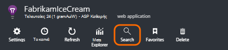
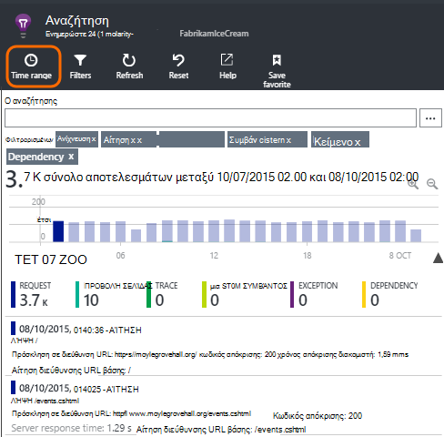
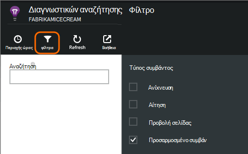
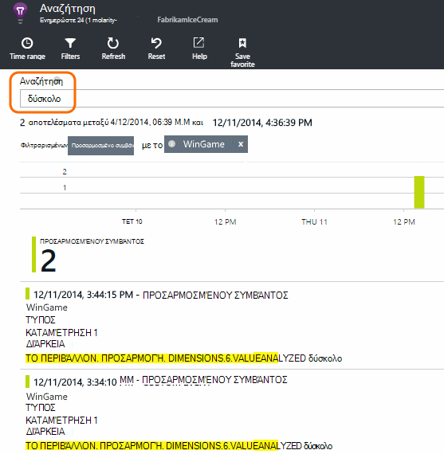
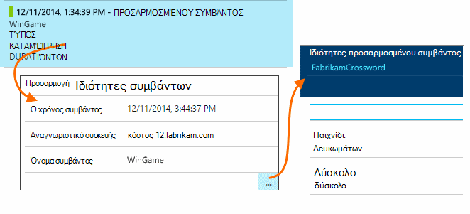
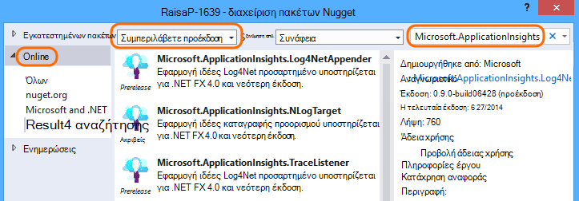
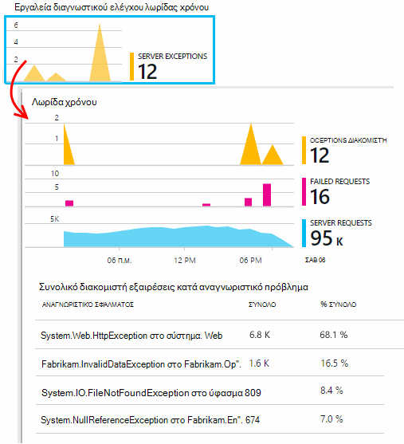
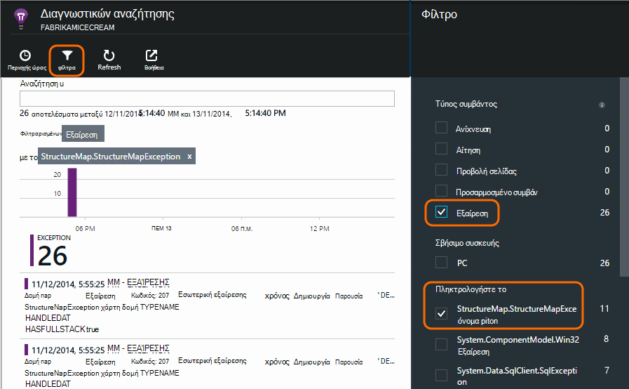

<properties 
    pageTitle="Αρχεία καταγραφής, εξαιρέσεις και προσαρμοσμένες Διαγνωστικά για ASP.NET στην εφαρμογή ιδέες" 
    description="Διάγνωση θεμάτων στις εφαρμογές web ASP.NET κάνοντας αναζήτηση προσκλήσεις, εξαιρέσεις και τα αρχεία καταγραφής που δημιουργούνται με ανίχνευση, NLog ή Log4Net." 
    services="application-insights" 
    documentationCenter=""
    authors="alancameronwills" 
    manager="douge"/>

<tags 
    ms.service="application-insights" 
    ms.workload="tbd" 
    ms.tgt_pltfrm="ibiza" 
    ms.devlang="na" 
    ms.topic="article" 
    ms.date="04/08/2016" 
    ms.author="awills"/>
 
# Αρχεία καταγραφής, εξαιρέσεις και προσαρμοσμένες Διαγνωστικά για ASP.NET στην εφαρμογή ιδέες

[Εφαρμογή ιδέες] [ start] περιλαμβάνει ισχυρή [Διαγνωστικών αναζήτησης] [ diagnostic] εργαλείο που σας επιτρέπει να εξερευνήσετε και λεπτομερής να τηλεμετρίας αποστέλλονται από SDK ιδέες για την εφαρμογή από την εφαρμογή σας. Πολλά συμβάντα όπως προβολές σελίδας χρήστη αποστέλλονται αυτόματα από το SDK.

Μπορείτε επίσης να γράψετε κώδικα για την αποστολή προσαρμοσμένων συμβάντων, οι εκθέσεις εξαίρεσης και ανιχνεύσεις. Και αν χρησιμοποιείτε ήδη ένα πλαίσιο καταγραφή όπως log4J, log4net, NLog ή System.Diagnostics.Trace, μπορείτε να καταγράψετε αυτά τα αρχεία καταγραφής και να τις συμπεριλάβετε στην αναζήτηση. Αυτό καθιστά εύκολη για να συσχετίσετε ανιχνεύσεις καταγραφής με ενέργειες χρηστών, εξαιρέσεις και άλλα συμβάντα.

## Πριν να γράψετε προσαρμοσμένο τηλεμετρίας

Εάν δεν το έχετε κάνει ακόμα [Ρύθμιση εφαρμογής ιδέες για το έργο σας][start], κάνετε τώρα.

Όταν εκτελείτε την εφαρμογή σας, θα στείλει ορισμένες τηλεμετρίας που θα εμφανίζεται στο διαγνωστικών αναζήτησης, συμπεριλαμβανομένων των αιτήσεων παραλήφθηκε από το διακομιστή, σελίδα συνδεδεμένος στον υπολογιστή-πελάτη, προβολών και μη καταγεγραμμένο εξαιρέσεις.

Άνοιγμα διαγνωστικών αναζήτησης για να δείτε το τηλεμετρίας που στέλνει αυτόματα το SDK.

Τις λεπτομέρειες διαφέρει από τον τύπο μία εφαρμογή σε μια άλλη. Μπορείτε να κάνετε κλικ σε οποιοδήποτε μεμονωμένο συμβάν για περισσότερες λεπτομέρειες.

## Δειγματοληψία 

Εάν η εφαρμογή σας στέλνει πολλά δεδομένα και χρησιμοποιείτε το SDK ιδέες εφαρμογής για ASP.NET έκδοση 2.0.0-beta3 ή νεότερη έκδοση, η δυνατότητα προσαρμόσιμης δειγματοληψία μπορεί να εφαρμόζει και αποστολή μόνο ποσοστό του τηλεμετρίας σας. [Μάθετε περισσότερα σχετικά με τη δειγματοληψία.](app-insights-sampling.md)

##Προσαρμοσμένα συμβάντα

Προσαρμοσμένα συμβάντα που εμφανίζονται και τα δύο σε [Διαγνωστικών αναζήτησης] [ diagnostic] και στην [Εξερεύνηση μετρικό σύστημα][metrics]. Μπορείτε να τους στείλετε από συσκευές, σελίδες web και εφαρμογές διακομιστή. Μπορούν να χρησιμοποιηθούν για σκοπούς διαγνωστικών και για να [κατανοήσετε τα μοτίβα χρήσης][track].

Ένα προσαρμοσμένο συμβάν έχει ένα όνομα και μπορούν επίσης να περιέχουν ιδιότητες που μπορείτε να φιλτράρετε, μαζί με αριθμητικές μετρήσεις.

JavaScript στο πρόγραμμα-πελάτη

    appInsights.trackEvent("WinGame",
         // String properties:
         {Game: currentGame.name, Difficulty: currentGame.difficulty},
         // Numeric measurements:
         {Score: currentGame.score, Opponents: currentGame.opponentCount}
         );

C# στο διακομιστή

    // Set up some properties:
    var properties = new Dictionary <string, string> 
       {{"game", currentGame.Name}, {"difficulty", currentGame.Difficulty}};
    var measurements = new Dictionary <string, double>
       {{"Score", currentGame.Score}, {"Opponents", currentGame.OpponentCount}};

    // Send the event:
    telemetry.TrackEvent("WinGame", properties, measurements);

VB στο διακομιστή

    ' Set up some properties:
    Dim properties = New Dictionary (Of String, String)
    properties.Add("game", currentGame.Name)
    properties.Add("difficulty", currentGame.Difficulty)

    Dim measurements = New Dictionary (Of String, Double)
    measurements.Add("Score", currentGame.Score)
    measurements.Add("Opponents", currentGame.OpponentCount)

    ' Send the event:
    telemetry.TrackEvent("WinGame", properties, measurements)

### Εκτελέστε την εφαρμογή και να προβάλετε τα αποτελέσματα.

Άνοιγμα διαγνωστικών αναζήτησης.

Επιλέξτε προσαρμοσμένη συμβάντος και επιλέξτε ένα όνομα για το συγκεκριμένο συμβάν.

Φιλτράρετε τα δεδομένα περισσότερες, πληκτρολογώντας έναν όρο αναζήτησης σε μια τιμή της ιδιότητας.  

Διερεύνηση σε ένα μεμονωμένο συμβάν για να δείτε τη λεπτομερή ιδιότητες.

##Προβολές σελίδας

Σελίδα προβολή τηλεμετρίας αποστέλλεται από την κλήση trackPageView() στο [το τμήμα κώδικα JavaScript που εισάγετε σε σελίδες web][usage]. Ο κύριος σκοπός είναι να συνεισφέρουν σε το πλήθος των προβολών σελίδας που βλέπετε στη σελίδα Επισκόπηση.

Συνήθως ονομάζεται μία φορά σε κάθε σελίδα HTML, αλλά μπορείτε να εισαγάγετε περισσότερες κλήσεις - για παράδειγμα, εάν έχετε μια εφαρμογή μίας σελίδας και που θέλετε να καταγράψετε μια νέα σελίδα, κάθε φορά που ο χρήστης λαμβάνει περισσότερα δεδομένα.

    appInsights.trackPageView(pageSegmentName, "http://fabrikam.com/page.htm"); 

Μερικές φορές είναι χρήσιμο να επισυνάψετε ιδιότητες που μπορείτε να χρησιμοποιήσετε ως φίλτρα στην διαγνωστικών αναζήτησης:

    appInsights.trackPageView(pageSegmentName, "http://fabrikam.com/page.htm",
     {Game: currentGame.name, Difficulty: currentGame.difficulty});

##Ανίχνευση τηλεμετρίας

Ανίχνευση τηλεμετρίας είναι κώδικα που μπορείτε να εισαγάγετε ειδικά για τη δημιουργία αρχείων καταγραφής διαγνωστικών. 

Για παράδειγμα, θα μπορούσατε να εισάγετε κλήσεις ως εξής:

    var telemetry = new Microsoft.ApplicationInsights.TelemetryClient();
    telemetry.TrackTrace("Slow response - database01");

####  Εγκατάσταση προσαρμογέα για το πλαίσιο καταγραφή

Μπορείτε επίσης να κάνετε αναζήτηση αρχείων καταγραφής που δημιουργούνται από το ένα πλαίσιο καταγραφή - log4Net, NLog ή System.Diagnostics.Trace. 

1. Εάν σκοπεύετε να χρησιμοποιήσετε το log4Net ή NLog, εγκαταστήσετε στο έργο σας. 
2. Στην Εξερεύνηση λύσεων, κάντε δεξιό κλικ στο έργο σας και επιλέξτε **Διαχείριση πακέτων NuGet**.
3. Επιλέξτε Online > όλα, επιλέξτε **Περιλαμβάνουν προέκδοση** και κάντε αναζήτηση για "Microsoft.ApplicationInsights"

    

4. Επιλέξτε το κατάλληλο πακέτο - μία από:
  + Microsoft.ApplicationInsights.TraceListener (για να καταγράψετε τις κλήσεις System.Diagnostics.Trace)
  + Microsoft.ApplicationInsights.NLogTarget
  + Microsoft.ApplicationInsights.Log4NetAppender

Το πακέτο NuGet εγκαθιστά τις απαραίτητες συγκροτήσεις και επίσης τροποποιεί web.config ή app.config.

#### Εισαγωγή κλήσεις αρχείο καταγραφής διαγνωστικών

Εάν χρησιμοποιείτε το System.Diagnostics.Trace, πρέπει να είναι μια τυπική κλήση:

    System.Diagnostics.Trace.TraceWarning("Slow response - database01");

Εάν προτιμάτε να log4net ή NLog:

    logger.Warn("Slow response - database01");

Εκτελέστε την εφαρμογή σας σε κατάσταση εντοπισμού σφαλμάτων, ή να το αναπτύξετε.

Όταν επιλέγετε το φίλτρο ανίχνευση, θα δείτε τα μηνύματα διαγνωστικών αναζήτησης.

### Εξαιρέσεις

Γρήγορα εξαίρεση αναφορές σε εφαρμογή ιδέες παρέχει μια εμπειρία ισχυρούς, ιδιαίτερα επειδή μπορείτε να περιήγηση μεταξύ των αποτυχημένων αιτήσεων και τις εξαιρέσεις και διαβάστε στη στοίβα εξαίρεσης.

Σε ορισμένες περιπτώσεις, πρέπει να [εισαγάγετε μερικές γραμμές κώδικα] [ exceptions] για να βεβαιωθείτε ότι το εξαιρέσεις είναι να εμπίπτουν αυτόματα.

Μπορείτε επίσης να γράψετε ρητή κώδικα για την αποστολή τηλεμετρίας εξαίρεση:

JavaScript

    try 
    { ...
    }
    catch (ex)
    {
      appInsights.TrackException(ex, "handler loc",
        {Game: currentGame.Name, 
         State: currentGame.State.ToString()});
    }

C#

    var telemetry = new TelemetryClient();
    ...
    try 
    { ...
    }
    catch (Exception ex)
    {
       // Set up some properties:
       var properties = new Dictionary <string, string> 
         {{"Game", currentGame.Name}};

       var measurements = new Dictionary <string, double>
         {{"Users", currentGame.Users.Count}};

       // Send the exception telemetry:
       telemetry.TrackException(ex, properties, measurements);
    }

VB

    Dim telemetry = New TelemetryClient
    ...
    Try
      ...
    Catch ex as Exception
      ' Set up some properties:
      Dim properties = New Dictionary (Of String, String)
      properties.Add("Game", currentGame.Name)

      Dim measurements = New Dictionary (Of String, Double)
      measurements.Add("Users", currentGame.Users.Count)
  
      ' Send the exception telemetry:
      telemetry.TrackException(ex, properties, measurements)
    End Try

Τις παραμέτρους ιδιοτήτων και μετρήσεις είναι προαιρετικό, αλλά είναι χρήσιμο για το φιλτράρισμα και την προσθήκη επιπλέον πληροφορίες. Για παράδειγμα, εάν έχετε μια εφαρμογή που μπορούν να εκτελούν πολλές αγώνων, ενδέχεται να μπορείτε να βρείτε όλες τις αναφορές εξαίρεσης που σχετίζονται με ένα συγκεκριμένο παιχνίδι. Μπορείτε να προσθέσετε όσες στοιχεία θέλετε κάθε λεξικό.

#### Προβολή εξαιρέσεις

Θα δείτε μια σύνοψη των εξαιρέσεις που αναφέρεται σε την επισκόπηση blade και κάνετε κλικ για να δείτε περισσότερες λεπτομέρειες. Για παράδειγμα:

[]

Κάντε κλικ σε οποιονδήποτε τύπο εξαίρεση για να δείτε τις συγκεκριμένες εμφανίσεις:

[]

Μπορείτε επίσης να ανοίξτε διαγνωστικών αναζήτησης απευθείας, φιλτράρετε εξαιρέσεις και επιλέξτε ο τύπος εξαίρεσης που θέλετε να δείτε.

### Δημιουργία αναφορών ανεπίλυτη εξαιρέσεις

Εφαρμογή ιδέες αναφορών δεν επιλύεται εξαιρέσεις όπου είναι δυνατό, από συσκευές, [προγράμματα περιήγησης web][usage], ή διακομιστές web, εάν όργανα, από [Την οθόνη κατάσταση] [ redfield] ή [Εφαρμογή ιδέες SDK][greenbrown]. 

Ωστόσο, δεν είναι πάντα μπορούν να το κάνετε αυτό σε ορισμένες περιπτώσεις, επειδή το .NET framework εντοπίζει το εξαιρέσεις.  Για να βεβαιωθείτε ότι μπορείτε να δείτε όλες τις εξαιρέσεις, επομένως πρέπει να συντάξετε ένα πρόγραμμα χειρισμού μικρές εξαίρεσης. Η βέλτιστη διαδικασία διαφέρει ανάλογα με την τεχνολογία. Ανατρέξτε στο θέμα [εξαίρεση τηλεμετρίας για το ASP.NET] [ exceptions] για λεπτομέρειες. 

### Συσχέτιση με μια έκδοση

Κατά την ανάγνωση αρχείων καταγραφής διαγνωστικών, είναι πιθανό ότι σας πηγαίος κώδικας θα έχουν αλλάξει από τον κώδικα live αναπτύχθηκε.

Επομένως, είναι χρήσιμο για να θέσετε Δόμηση πληροφορίες, όπως η διεύθυνση URL της τρέχουσας έκδοσης, σε μια ιδιότητα μαζί με κάθε εξαίρεση ή ανίχνευση. 

Αντί για να προσθέσετε την ιδιότητα ξεχωριστά σε κάθε εξαίρεση κλήση, μπορείτε να ορίσετε τις πληροφορίες στο προεπιλεγμένο περιβάλλον. 

    // Telemetry initializer class
    public class MyTelemetryInitializer : ITelemetryInitializer
    {
        public void Initialize (ITelemetry telemetry)
        {
            telemetry.Properties["AppVersion"] = "v2.1";
        }
    }

Στο την προετοιμασία εφαρμογής όπως Global.asax.cs:

    protected void Application_Start()
    {
        // ...
        TelemetryConfiguration.Active.TelemetryInitializers
        .Add(new MyTelemetryInitializer());
    }

###Προσκλήσεις σε διακομιστή Web

Αίτηση τηλεμετρίας αποστέλλεται αυτόματα όταν [εγκαταστήσετε Εποπτεία κατάστασης στο διακομιστή web][redfield], ή όταν [προσθέσετε ιδέες εφαρμογή στο έργο σας web][greenbrown]. Τροφοδοσίες σε τα γραφήματα αίτησης και απόκρισης ώρας στην Εξερεύνηση μετρικό και στη σελίδα Επισκόπηση.

Εάν θέλετε να στείλετε πρόσθετα συμβάντα, μπορείτε να χρησιμοποιήσετε το API TrackRequest().

## Ερωτήσεις και απαντήσεις

### Λαμβάνω ένα μήνυμα σφάλματος "το κλειδί οργάνων δεν μπορεί να είναι κενό"

Φαίνεται έχετε εγκαταστήσει το πακέτο Nuget προσαρμογέα καταγραφής χωρίς την εγκατάσταση εφαρμογών ιδέες.

Στην Εξερεύνηση λύσεων, κάντε δεξί κλικ `ApplicationInsights.config` και επιλέξτε **Ενημέρωση εφαρμογής ιδέες**. Θα εμφανιστεί ένα παράθυρο διαλόγου που σάς καλεί να εισέλθετε στο Azure και είτε δημιουργήστε έναν πόρο ιδέες εφαρμογής, ή εκ νέου χρήση μιας υπάρχουσας. Που θα πρέπει να το διορθώσετε.

### Διατηρούνται όγκο δεδομένων;

Έως 500 συμβάντα ανά δευτερόλεπτο από κάθε εφαρμογή. Συμβάντα διατηρούνται για επτά ημέρες.

### Ορισμένα από τα συμβάντα ή ανιχνεύσεις μου δεν εμφανίζονται

Εάν η εφαρμογή σας στέλνει πολλά δεδομένα και χρησιμοποιείτε το SDK ιδέες εφαρμογής για ASP.NET έκδοση 2.0.0-beta3 ή νεότερη έκδοση, η δυνατότητα προσαρμόσιμης δειγματοληψία μπορεί να εφαρμόζει και αποστολή μόνο ποσοστό του τηλεμετρίας σας. [Μάθετε περισσότερα σχετικά με τη δειγματοληψία.](app-insights-sampling.md)

## Επόμενα βήματα

* [Ρύθμιση δοκιμές απόκριση και διαθεσιμότητα][availability]
* [Αντιμετώπιση προβλημάτων][qna]

<!--Link references-->

[availability]: app-insights-monitor-web-app-availability.md
[diagnostic]: app-insights-diagnostic-search.md
[exceptions]: app-insights-asp-net-exceptions.md
[greenbrown]: app-insights-asp-net.md
[metrics]: app-insights-metrics-explorer.md
[qna]: app-insights-troubleshoot-faq.md
[redfield]: app-insights-monitor-performance-live-website-now.md
[start]: app-insights-overview.md
[track]: app-insights-api-custom-events-metrics.md
[usage]: app-insights-web-track-usage.md

 
